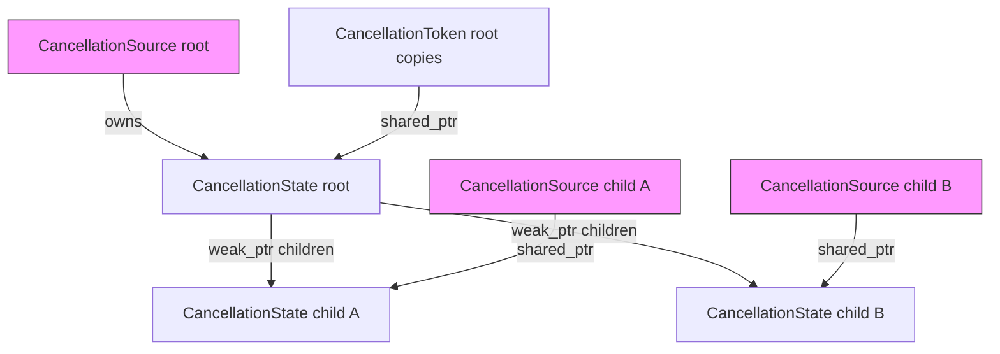

# CancellationToken Design

> **Status: proposed — not yet implemented.**
> This document describes a planned cooperative cancellation API (`CancellationToken` /
> `CancellationSource`). It is distinct from the library's built-in **structured cancellation**
> mechanism, which is automatic and requires no API surface — see
> [Coroutine Frame Lifetime](coroutine_scope.md) for that. `CancellationToken` is an
> opt-in extension for cases where the built-in mechanism is insufficient.

## Motivation

The library already supports task cancellation via `JoinHandle` drop and `JoinSet` drop.
These cover the *ownership* case: the entity that spawned a task is the entity that cancels
it. But in practice a second pattern comes up constantly: cancel a set of tasks in response
to an event that occurs outside the task hierarchy — where the canceller does not hold, and
may never have held, the tasks' handles.

Common scenarios:

- A request handler spawns N sub-tasks. When any one succeeds, all others should be
  cancelled — but the sub-tasks were spawned in different call sites and their handles are
  not all collected in one place.
- A background worker loop should stop when a global shutdown signal fires. The signal
  comes from a signal handler or a UI thread, neither of which participates in the
  coroutine task tree.
- A `JoinSet` fan-out should abort all in-flight tasks the moment one returns an error,
  without waiting for the rest to finish naturally.

In all three cases, `JoinHandle::cancel()` and `JoinSet` drop are insufficient: you either
do not have the handles, or the cancellation trigger does not live inside the coroutine
scope that owns them.

`CancellationToken` fills this gap. It is a shared, named signal — a broadcast flag with an
async `wait` face — that can be passed to any number of coroutines regardless of task
ownership, and fired by any holder of the paired `CancellationSource`.

---

## Relationship to existing cancellation

| Mechanism | Who can cancel | Cardinality | Signal delivery |
|---|---|---|---|
| `JoinHandle` drop | The spawner only | 1 : 1 | `PollDropped` via executor re-enqueue |
| `JoinSet` drop | The spawner only | 1 : N (same scope) | `PollDropped` per task |
| `CancellationToken` | Any holder of `CancellationSource` | M : N (across scopes) | `CancelledFuture` resolves → caller decides how to exit |

`CancellationToken` is *not* a replacement for `PollDropped`. It is a cooperative signal
that a coroutine opts into by calling `token.cancelled()` or checking
`token.is_cancelled()`. The coroutine still returns via its normal path (co_return) or
propagates `PollDropped` to its children as usual; the token just gives it a trigger to do
so.

---

## Use Cases

### 1. Fan-out with early exit

The most common case. Spawn N tasks, cancel all when one condition is met.

```cpp
coro::Coro<void> fan_out(std::vector<Request> reqs) {
    auto [source, token] = coro::cancellation::make();

    co_await coro::co_invoke([&]() -> coro::Coro<void> {
        coro::JoinSet<Result> js;
        for (auto& req : reqs)
            js.spawn(handle_request(req, token));

        // Take the first result, cancel the rest.
        if (auto first = co_await coro::next(js)) {
            source.cancel();
            process(*first);
        }
        co_await js.drain();
    });
}

coro::Coro<Result> handle_request(Request req, coro::CancellationToken token) {
    auto result = co_await coro::select(do_work(req), token.cancelled());
    if (result.index() == 1) co_return Result::cancelled();
    co_return std::get<0>(result).value;
}
```

### 2. External shutdown signal

A signal handler or supervisor fires cancellation; all running coroutines observe it.

```cpp
coro::CancellationSource g_shutdown_source;
coro::CancellationToken  g_shutdown = g_shutdown_source.token();

// In a signal handler or supervisor thread:
g_shutdown_source.cancel();

// In any coroutine that should respect shutdown:
coro::Coro<void> serve(coro::CancellationToken shutdown) {
    while (true) {
        auto conn = co_await coro::select(
            listener.accept(),
            shutdown.cancelled());
        if (conn.index() == 1) co_return;   // shutdown fired
        spawn(handle(std::get<0>(conn).value));
    }
}
```

### 3. Scoped sub-operation timeout with shared cancellation

Thread a token through a deep call stack so that an outer deadline can abort work
that spans multiple coroutines without them knowing about each other.

```cpp
coro::Coro<void> pipeline_stage(Data data, coro::CancellationToken token) {
    // Each step checks the same token — no timeout plumbing needed at each level.
    auto a = co_await coro::select(step_a(data), token.cancelled());
    if (a.index() == 1) co_return;
    auto b = co_await coro::select(step_b(std::get<0>(a).value), token.cancelled());
    if (b.index() == 1) co_return;
    // ...
}
```

### 4. Hierarchical cancellation

A parent token propagates to child tokens automatically. Cancelling the parent cancels
all children; cancelling a child does not affect the parent or siblings.

```cpp
auto [root_source, root_token] = coro::cancellation::make();

// Sub-operations get child tokens:
auto [child_source_a, child_token_a] = root_token.make_child();
auto [child_source_b, child_token_b] = root_token.make_child();

// Cancelling root cancels both children:
root_source.cancel();   // child_token_a and child_token_b both fire

// Cancelling child_a does NOT affect child_b or root_token:
child_source_a.cancel();
```

---

## API

### Creating a token pair

```cpp
#include <coro/sync/cancellation_token.h>

auto [source, token] = coro::cancellation::make();
```

`make()` returns a `std::pair<CancellationSource, CancellationToken>`. Both ends share
ownership of an internal `CancellationState` via `shared_ptr`.

### `CancellationSource`

```cpp
class CancellationSource {
public:
    // Fires the cancellation signal. All tasks awaiting cancelled() on any
    // token derived from this source are woken immediately. Idempotent.
    // Thread-safe — may be called from any thread.
    void cancel();

    // Returns true if cancel() has already been called.
    bool is_cancelled() const;

    // Returns the paired token. Token may be copied freely.
    CancellationToken token() const;
};
```

`CancellationSource` is move-only. Destroying it without calling `cancel()` does **not**
fire the signal — the token remains live but will never be cancelled unless another holder
calls `cancel()` on a source sharing the same state.

### `CancellationToken`

```cpp
class CancellationToken {
public:
    // Copyable — each copy shares the same underlying signal.
    CancellationToken(const CancellationToken&)            = default;
    CancellationToken& operator=(const CancellationToken&) = default;
    CancellationToken(CancellationToken&&)                 = default;
    CancellationToken& operator=(CancellationToken&&)      = default;

    // Synchronous check. May be stale by the time the caller acts on it;
    // prefer awaiting cancelled() for reliable notification.
    bool is_cancelled() const;

    // Returns a Future<void> that resolves when cancel() is called on any
    // CancellationSource that shares this token's state. If already cancelled,
    // resolves immediately on the first poll.
    [[nodiscard]] CancelledFuture cancelled() const;

    // Creates a child token + source pair. The child is cancelled whenever
    // this token is cancelled, or independently via the returned source.
    std::pair<CancellationSource, CancellationToken> make_child() const;
};
```

`CancellationToken` is freely copyable. Each copy is interchangeable — all copies observe
the same cancellation signal.

### `CancelledFuture`

`CancelledFuture` satisfies `Future<void>`. It is returned by `token.cancelled()` and
intended to be passed directly to `select()`:

```cpp
// The idiomatic one-liner:
auto res = co_await coro::select(do_work(), token.cancelled());
if (res.index() == 1) { /* cancelled */ }

// Or awaited directly when the only thing to do is wait for cancellation:
co_await token.cancelled();
```

`CancelledFuture` is not `Cancellable`. When used as a losing `select()` branch, the
wrapper is discarded and the underlying token is untouched.

---

## Internal Design

### Shared state

All copies of a `CancellationToken` and its paired `CancellationSource` share one
heap-allocated `CancellationState`:

```cpp
struct WaiterEntry {
    CancelledFuture*           future;  // key for O(n) removal on ~CancelledFuture
    std::shared_ptr<detail::Waker> waker;
};

struct CancellationState {
    mutable std::mutex                              mutex;
    bool                                            cancelled = false;
    std::vector<WaiterEntry>                        waiters;
    std::vector<std::weak_ptr<CancellationState>>   children;
};
```

`CancellationSource` and `CancellationToken` both hold a `shared_ptr<CancellationState>`.
The state is freed when the last source and the last token copy are destroyed.

### `CancelledFuture` poll

```
poll():
  lock mutex
  if cancelled → unlock, return PollReady
  upsert {this, ctx.waker()} into waiters   // inside the lock — prevents lost wakeup
  unlock
  return PollPending
```

Waker registration occurs under the same mutex that `cancel()` checks before extracting
waiters, eliminating the lost-wakeup race that would arise from checking then registering
in two separate critical sections (same pattern as `Event::WaitFuture::poll()`).

### `CancellationSource::cancel()`

```
cancel():
  lock mutex
  if already cancelled → return (idempotent)
  set cancelled = true
  extract all wakers from waiters (clear waiters)
  snapshot children list
  unlock

  wake each extracted waker
  for each child weak_ptr: if still alive → child->do_cancel()
```

Wakers are woken *outside* the mutex to avoid waking tasks that immediately try to
re-acquire the same mutex.

### `CancelledFuture` destructor

```
~CancelledFuture():
  lock state mutex
  erase entry where future == this from waiters
  unlock
```

This is the same back-pointer pattern `Event::WaitFuture` uses. It prevents a dangling
waker from firing after a losing `select()` branch has been discarded.

### State machine

```mermaid
stateDiagram-v2
    [*] --> Live : cancellation::make()
    Live --> Cancelled : source.cancel()
    Cancelled --> Cancelled : source.cancel() (idempotent)

    state Live {
        [*] --> NoWaiters
        NoWaiters --> HasWaiters : token.cancelled() polled
        HasWaiters --> NoWaiters : CancelledFuture destroyed\n(select branch lost)
        HasWaiters --> HasWaiters : additional token.cancelled() polled
    }

    state Cancelled {
        note right of Cancelled : all CancelledFutures resolve immediately\nnew polls return PollReady without registering
    }
```

### Hierarchical cancellation



When `root_source.cancel()` fires: iterates `children` weak_ptrs, locks and cancels each
live child state recursively. The weak_ptr prevents the root from keeping dead children
alive beyond their natural lifetime.

---

## Integration with `select()`

`CancelledFuture` is an ordinary `Future<void>`, so it composes with `select()` with no
special support:

```cpp
// Works today, no changes to select() needed:
auto res = co_await coro::select(work_future, token.cancelled());
```

When the token fires while `work_future` is pending:
1. The `CancelledFuture`'s waker is invoked by `cancel()`.
2. The `select()` future is woken and re-polled.
3. `CancelledFuture::poll()` returns `PollReady`; `select()` picks branch 1.
4. `select()` calls `work_future.cancel()` (if `Cancellable`) and polls until `PollDropped`.
5. `select()` returns `SelectBranch<1, void>` to the caller.

The full `PollDropped` drain on the cancelled work branch is handled by `select()` exactly
as it is for any other losing branch — no special casing for tokens.

---

## What is explicitly out of scope

**Context integration.** The `Context` object already carries a
`shared_ptr<CancellationToken>` placeholder. This was reserved for a future design where
the executor automatically threads the "current task's cancellation token" through every
`poll()` call, allowing futures to observe cancellation without being explicitly passed a
token.

This is not part of this design phase. Explicit parameter passing is simpler, avoids
hidden coupling, and covers all the identified use cases. The `Context` placeholder remains
but stays `nullptr`; it can be wired up in a future phase if a compelling use case
emerges.

**`CancellationToken` as a `Cancellable` future.** `CancelledFuture` does not implement
the `Cancellable` concept. When it is the losing branch of a `select()`, it is simply
discarded; the underlying token continues to live and may fire later. This is intentional:
the token is a shared signal, and a losing select branch should not silently prevent it
from ever firing.

---

## Header location

```
include/coro/sync/cancellation_token.h   — CancellationSource, CancellationToken,
                                           CancelledFuture, cancellation::make()
src/cancellation_token.cpp               — CancellationState, cancel(), ~CancelledFuture
```

`cancellation::make()` follows the `oneshot_channel<T>()` / `mpsc_channel<T>()` naming
convention for channel-like paired objects.
