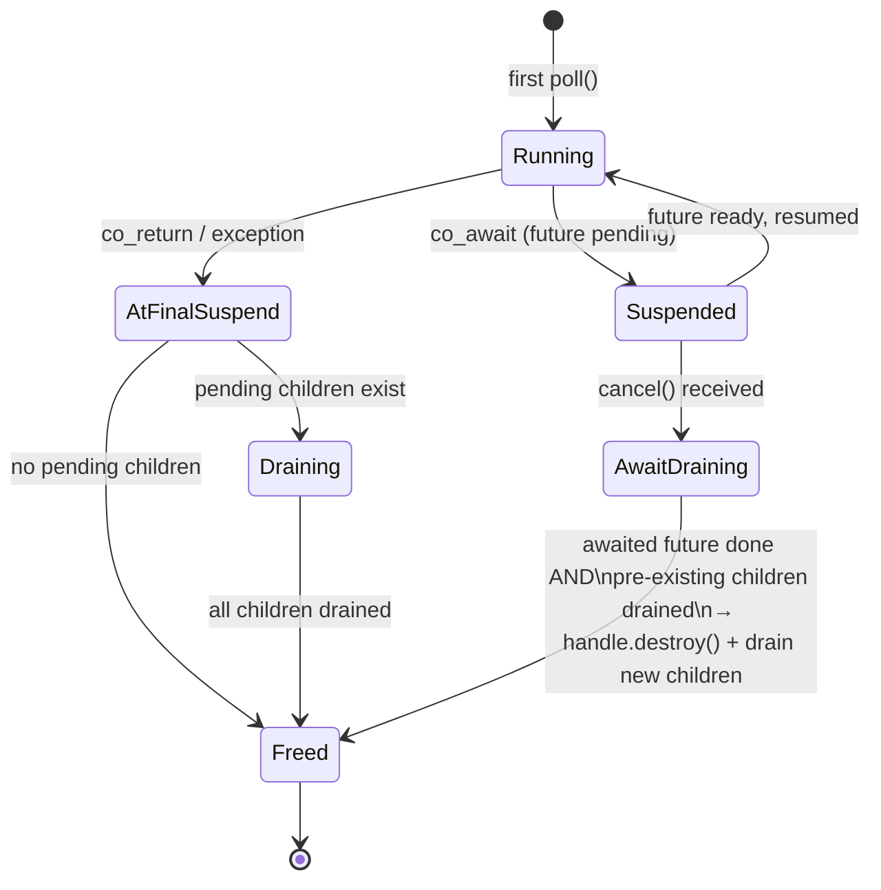
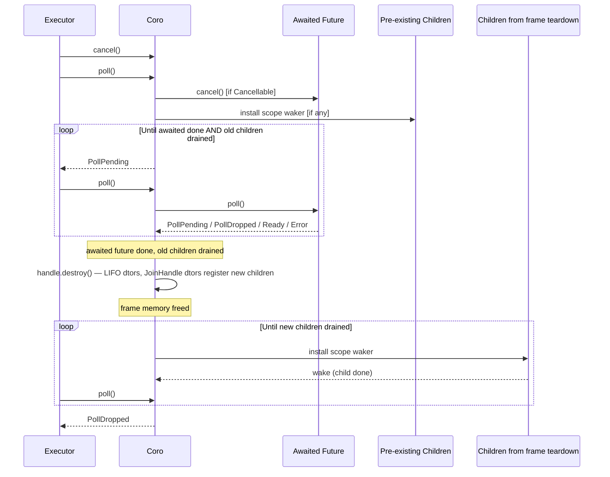

# Coroutine Scope — Implicit Structured Concurrency

## Problem

`Synchronize` was designed to make it safe for spawned child tasks to hold references to
data owned by the parent coroutine. It guarantees that all children complete before the
parent's `co_await Synchronize(...)` returns, so the data stays alive for as long as any
child needs it.

This guarantee breaks when the `Synchronize` future itself is cancelled — for example, when
it is one branch of a `select` or `timeout` that loses. In that case:

1. The losing branch is dropped, tearing down the `Synchronize` future and its body coroutine.
2. The spawned child tasks are still running in the executor.
3. Those children hold references to data that may now be freed.

This is a use-after-free waiting to happen, and it cannot be caught at compile time because
C++ has no lifetime borrow checker.

The root cause is deeper than `Synchronize`: any future combinator that can abandon a branch
creates this hazard for any coroutine in that branch that has spawned tasks holding borrowed
references.

## Guarantee

The scope mechanism provides one guarantee, applied uniformly across all termination paths:

> **A coroutine frame is not freed while any future it is currently awaiting, or any
> previously-registered pending child, could still hold a reference to frame-local data.**

This prevents the frame allocation from being reclaimed out from under running futures.
It does **not** guarantee that the logical values of local variables remain valid after
their own destructors have run — that is a separate concern addressed by explicit drain
points (`JoinSet::drain()`), described below.

| Termination path | Awaited future drained first? | Pre-existing children drained first? | Frame freed after? |
|---|---|---|---|
| `co_return` (normal) | N/A — body already ran past it | Yes | Yes |
| Uncaught exception | N/A — body already ran past it | Yes | Yes |
| Cancellation | Yes | Yes | Yes |

Detached tasks (`JoinHandle::detach()`) are explicitly opted out of the tracking guarantee
and are not tracked by the scope.

## Frame Lifetime Invariant

The single rule governing frame destruction:

> **A coroutine frame must not be destroyed while it is suspended waiting on an awaited
> future, or while any of its previously-registered pending children are still running.**

Once both of those conditions clear, `handle.destroy()` may be called immediately — the
coroutine body does not need to be resumed. `handle.destroy()` runs all in-scope local
variable destructors in LIFO order, exactly as normal C++ stack unwinding does. Any
`JoinHandle` destructors that fire during this teardown cancel their children and register
them as new pending children in the scope; those are then drained in turn before
`PollDropped` is returned.

The state diagram for a `Coro<T>` frame:



`handle.destroy()` is called exactly once, on the transition to Freed. It is never called
while the frame is in Running, Suspended, AtFinalSuspend, or Draining.

## Cancellation Protocol

### Invoking cancellation

`cancel()` sets an internal flag on the `Coro<T>`. It is not a preemptive interrupt — it
does not stop a `Coro<T>::poll()` call that is already mid-execution. The flag is checked
at the entry of each `Coro<T>::poll()` call, so cancellation takes effect the next time
`poll()` is entered for that coroutine. That may be within the same outer task poll cycle
(if the combinator re-polls the branch after cancelling it) or in a subsequent cycle.

### Step 1 — drain or drop the awaited future

When `poll()` is called with the cancellation flag set and the frame is suspended at a
`co_await`, the treatment of the awaited future depends on whether it satisfies
`Cancellable`:

1. **Cancellable awaited future** — call `cancel()` on it, then continue polling it on
   every subsequent `poll()` call until it returns a non-`Pending` result. A `Cancellable`
   future has its own execution tree that must drain before the outer frame is safe to tear
   down.

2. **Non-Cancellable awaited future** — proceed directly to step 3 (`handle.destroy()`).
   Non-Cancellable futures are leaf futures: they do not await children and hold no
   references to the caller's frame locals. Their destructors execute immediate cleanup
   (e.g., removing a waker registration from shared state) and are safe to call at any
   time. The `FutureAwaitable` holding the non-Cancellable future is destroyed as part of
   LIFO teardown in `handle.destroy()`.

The `Cancellable` concept carries a semantic contract: a type opting in declares that it
is not safe to destroy mid-execution — it must be cancelled and polled to `PollDropped`
first. A type that does not implement `cancel()` declares that dropping it at any point
is safe.

### Step 2 — drain pre-existing pending children

While waiting for the awaited future, the scope may also have pending children that were
registered earlier (JoinHandles dropped before cancellation was set). These are drained in
parallel with step 1 using the same scope-waker mechanism used on the normal completion
path. The frame is not destroyed until this list is also empty.

### Step 3 — eager frame destruction

Once both conditions are clear (no awaited future, no pre-existing pending children),
`handle.destroy()` is called with `t_current_coro` pointing to this coroutine's scope.
This runs all remaining local variable destructors in LIFO order. Any `JoinHandle`
destructors that fire during this step cancel their children and add them to the scope's
pending list.

The frame allocation is freed by this `handle.destroy()` call.

### Step 4 — drain new children

Any children registered during step 3 are now drained using the scope-waker mechanism.
Once the list is empty, `PollDropped` is returned.

### Sequence diagram



## Design — `CoroutineScope` as a Value Member

### Scope

Everything in this section applies equally to `Coro<T>` and `CoroStream<T>`. Both types
own a `CoroutineScope`, follow the same frame lifetime invariant, and implement the same
cancellation protocol. `CoroStream` additionally requires a `m_cancel_current` hook in its
`promise_type` (analogous to the one in `CoroPromiseBase`) so that Cancellable awaited
futures can be cooperatively cancelled before the stream frame is destroyed.

### Core idea

`CoroutineScope` tracks spawned children whose `JoinHandle`s were dropped during the
coroutine's execution. It is owned directly by the `Coro<T>` (or `CoroStream<T>`) object
(value member, not `unique_ptr`).

`CoroutineScope` contains a `std::mutex` which is not movable, but `Coro<T>` must be
movable to be returned from coroutine functions and moved into a `Task`. This is safe
because:

- Moves of `Coro<T>` only occur **before the first `poll()` call** — when the return value
  is transferred from the coroutine function to the caller and then into a `Task`. After
  that, the `Coro<T>` lives inside a heap-allocated `Task` (held by `shared_ptr`) and is
  never moved again.
- Before first `poll()`, `m_pending` is always empty. No `JoinHandle` destructor has fired,
  so the scope has no state that depends on its address.

`CoroutineScope` therefore implements a custom move constructor and move-assignment that
**moves `m_pending` and default-constructs a fresh mutex** at the destination. The source
mutex is left in its default state and destroyed with the moved-from object.

### Thread-local current coroutine

During each `poll()` call, the `Coro<T>` installs a `CurrentCoroGuard` that points
`t_current_coro` at its `CoroutineScope`. Any code running on that thread during the
poll — including coroutine body code and all destructors it triggers — can read this
thread-local to identify which scope to register with.

### Registration mechanism

When a `JoinHandle` is destroyed and `t_current_coro` is non-null, the destructor:
1. Sets `cancelled = true` on the child `TaskState`.
2. Calls `t_current_coro->add_child(is_done, set_scope_waker)` to register the child.

The `JoinHandle` destructor fires during the coroutine body's LIFO unwind (guaranteed by
the frame lifetime invariant above), so `t_current_coro` is always valid at that point.

### `transfer_to` is not needed

The legacy `transfer_to` method existed to migrate pending children from a dying inner
`Coro<T>` to the enclosing scope when the inner frame was destroyed eagerly (without first
draining its awaited future). With the revised invariant, the awaited future is always
drained and pre-existing pending children are always cleared before `handle.destroy()` is
called. When `handle.destroy()` runs the inner `Coro<T>`'s destructor it will find the
scope empty, so there is nothing to migrate.

`transfer_to` and its associated locking are therefore removed.

### Memory cycle note

The scope waker — a `TaskWaker` that holds a `shared_ptr<Task>` for the parent — is **not**
stored as a member of `CoroutineScope`. Storing it would create the cycle:

```
Task → Coro<T> → CoroutineScope → TaskWaker → Task
```

The waker is passed to each pending child's `set_scope_waker` callback and lives in
`TaskState::scope_waker`, which is cleared when the child completes. No member storage of
the waker in `CoroutineScope` is needed.

## `PollDropped` — a dedicated cancellation state

`PollResult<T>` carries four states:

| State | Meaning |
|---|---|
| `PollReady(value)` | completed normally with a value |
| `PollError(exception)` | completed with an exception |
| `PollPending` | not yet done, waker registered |
| `PollDropped` | cancelled and fully drained — safe to discard |

`PollDropped` propagates up through the caller chain the same way a value or error does.
Each layer that receives `PollDropped` from a child treats it as a clean termination signal.
Combinators (select, timeout) use `PollDropped` from a cancelled branch as the signal that
cleanup is complete.

## Protection guarantees and limitations

The scope mechanism prevents the **frame allocation** from being freed while running futures
or children could still reference it. It does **not** prevent the logical values of local
variables from being destroyed while children spawned from within the frame are still
running.

When `handle.destroy()` is called (step 3 of the cancellation protocol, or after
`final_suspend` on the normal path), it destructs in-scope locals in LIFO order. Any
`JoinHandle` whose destructor fires during this destruction cancels and registers its child
before the matching local variable is destroyed — so from the `JoinHandle`'s perspective the
local is still live. But the cancelled child task continues running asynchronously and may
access the local after its destructor has already run.

This is a fundamental limitation: the scope mechanism cannot prevent a spawned task from
reading a reference after the referent is destroyed, because C++ has no borrow checker.

The recommended fix is to avoid passing references to frame locals to spawned tasks
entirely — move the data into the task, or share it via `std::shared_ptr`. When a reference
truly must be shared, use `co_invoke` to push the spawning into an inner coroutine: the
outer frame (and its locals) remains suspended at `co_await co_invoke(...)` for the entire
inner coroutine lifetime, including through exceptions in the inner body. The referenced
local is therefore guaranteed to be alive for as long as any child spawned inside runs.

`co_await js.drain()` placed in the same frame as the referenced local is not a safe
alternative: any exception thrown between the `spawn()` call and the `co_await`
short-circuits to `co_return` via the exception path, bypassing the drain and destroying
the local while children are still running.

```cpp
// Unsafe — child continues running after local_data is destroyed
Coro<void> bad() {
    int local_data = 42;
    auto h = spawn(worker(&local_data)).submit();
    co_return;
}

// Deceptively unsafe — co_await js.drain() is bypassed if anything before it throws
Coro<void> fragile() {
    int local_data = 42;
    JoinSet<void> js;
    js.add(spawn(worker(&local_data)).submit());
    co_await js.drain();
}

// Safe — local_data lives in the outer frame, which stays suspended at co_await co_invoke()
// for the entire inner coroutine lifetime, including through exceptions thrown inside.
Coro<void> safe(int local_data) {
    co_await co_invoke([](int& data) -> Coro<void> {
        JoinSet<void> js;
        js.add(spawn(worker(&data)).submit());
        co_await js.drain();
    }(local_data));
}
```

## Non-coroutine futures

A non-coroutine future only needs to participate in this mechanism if it directly calls
`spawn()` itself. If it wraps other futures, it propagates `PollDropped` transparently by
continuing to poll until it sees `PollDropped`, which any correct future combinator already
does.

The one requirement on combinators that cancel branches: they must not drop a child future
before it returns `PollDropped`. They must continue polling the cancelled branch until it
signals that cleanup is complete.

## Interaction with explicit `Synchronize`

> **Deprecated:** prefer `co_invoke` + `JoinSet::drain()` for new code.

`Synchronize` provides an explicit mid-coroutine drain point. Both roles are now covered
by `co_invoke` + `JoinSet`. The safe `Synchronize` example above can be rewritten as:

```cpp
Coro<void> safe_example() {
    int local_data = 42;
    co_await co_invoke([](int& data) -> Coro<void> {
        JoinSet<void> js;
        js.add(spawn(worker(&data)).submit());
        co_await js.drain();
    }(local_data));
}
```

**Comparison with Tokio:** Tokio does not have this problem because `tokio::spawn()` requires
`Send + 'static` — spawned tasks must own all their data, making it structurally impossible
for a spawned task to hold a reference into the spawning context. The type system enforces
the guarantee at compile time. Our implicit scope mechanism fills the gap that Rust closes
with the borrow checker, trading a compile-time guarantee for a runtime one.
