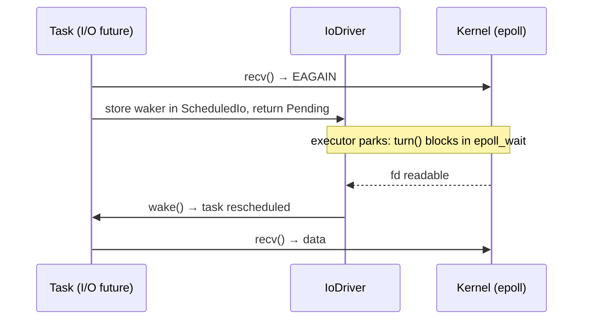

# Architecture

A detailed reference for the library's design, internals, and implementation patterns.

---

## Motivation and Goals

The library brings Rust's async/await model to C++20 without requiring the borrow checker.
It takes direct inspiration from [Tokio](https://tokio.rs/): poll-based futures, a
work-stealing executor, structured concurrency via scoped tasks, and first-class async I/O
through an event loop.

Where Tokio enforces safety at compile time with `'static + Send` bounds, this library
enforces equivalent guarantees at runtime through the coroutine scope mechanism. The trade
is a compile-time guarantee for a runtime one — unavoidable given C++'s object model.

Primary target is GCC on Linux (Ubuntu); Clang and MSVC are secondary. Requires C++20.
Dependencies are managed with Conan.

---

## What Is Implemented

### Runtime & Scheduling
- **Single-threaded executor** — deterministic, used for testing
- **Work-sharing executor** — shared injection queue, multiple worker threads
- **Work-stealing executor** — per-worker `WorkStealingDeque` with CAS-based
  `SchedulingState` transitions; Tokio-style injection budget enforcement
- **`CurrentThreadExecutor`** — polling loop on the calling thread; no extra threads;
  interleaves task scheduling with an injected `PollFn`; primary executor on MCU targets
- `Runtime` selects executor by thread count at construction; `block_on()` drives the
  top-level coroutine to completion

### I/O Reactor
- **`IoDriver`** — an epoll readiness reactor with no thread of its own; executor threads
  turn it when they would otherwise park, and a remote wake unparks it through an eventfd.
  See [I/O Driver](io_driver.md)
- I/O primitives (`UdpSocket`, `TcpStream`, `TcpListener`, `Pipe`, signals) make their
  non-blocking syscalls directly from the polling task, and register with the driver only
  to wait for readiness
- **`SleepFuture` / `sleep_for()`** — one-shot timers in the driver's timer queue; the
  nearest deadline bounds the driver's wait (nanosecond resolution on desktop)
- **`TcpStream`** — async connect, read, write
- **`File` / `lookup_host()`** — blocking syscalls run as jobs on the blocking pool
- **`WsStream` / `WsListener`** — async WebSocket client and server via libwebsockets, each
  lws context on its own service thread; full and partial frame modes, TLS, subprotocol
  negotiation
- **`coro::signal()` / `coro::signal_stream()`** — async OS signal delivery via a self-pipe
  on the IoDriver; one-shot `Future<void>` and a coalesced `Stream<SignalEvent>` variant;
  see [Signal Handling](signal_handling.md)

### Task Primitives
- **`spawn()` / `SpawnBuilder`** — schedule a `Coro<T>` on the runtime; returns a
  `JoinHandle<T>`; `.detach()` for fire-and-forget
- **`co_invoke()`** — run a lambda as a coroutine in the current scope
- **`spawn_blocking()`** — run a blocking callable on a dedicated `BlockingPool` thread;
  returns `BlockingHandle<T>`; fire-and-forget on drop

### Structured Concurrency
- **Coroutine scope** — every coroutine implicitly tracks child tasks; frame destruction
  is deferred until all non-detached children return `PollDropped`
- **`JoinSet<T>`** — spawn homogeneous child tasks, collect results in completion order
  via `next()`, or discard via `drain()`; satisfies `Stream<T>` for non-void T;
  cancel-on-drop with scope-guaranteed drain

### Combinators
- **`select(f1, f2, ...)`** — first-ready-wins; cancels and drains losing branches before
  delivering result; `SelectBranch<N, T>` tagging handles homogeneous types
- **`timeout(duration, future)`** — wraps `select` + `sleep_for`
- **`next(stream)`** — advance any `Stream<T>` by one item

### Channels and Synchronization (`include/coro/sync/`)
- **`Event`** — one-shot signal; `set()` from any thread, `co_await ev.wait()` in a
  coroutine; latch semantics; single waiter; `clear()` to reset
- **`oneshot`** — single value; synchronous send, async receive
- **`mpsc`** — bounded ring buffer; cloneable sender, single `Stream<T>` receiver;
  intrusive waiter nodes; zero-copy direct-handoff paths; `blocking_recv()` for OS threads
- **`watch`** — latest-value; synchronous overwrite; `changed()` + `borrow()` (returns
  `WatchBorrowGuard<T>` holding a shared read lock); cloneable sender and receiver
- **`broadcast`** — fixed-capacity ring buffer; every receiver sees every value sent
  while subscribed; synchronous, non-suspending `send()`; a receiver whose cursor falls
  behind the oldest buffered value is reported `Lagged` rather than served stale data;
  cloneable sender, `resubscribe()`-able receiver

All channels use `std::expected<T, ChannelError>` for fallible operations; `try_send`
returns `std::expected<void, TrySendError<T>>` so the caller recovers unsent values on
failure.

---

## Key Design Decisions

**Cancellation via `PollDropped`, not drop.** C++ coroutine frames must be resumed to run
destructors; cancellation is delivered as a poll signal so the task can drain its children
before the frame is freed.

**Implicit structured concurrency.** The `t_current_coro` thread-local lets `JoinHandle`
destructors register pending children with the enclosing coroutine automatically — no
explicit scope object required in the common case.

**Mutex over atomics.** Shared state uses `std::mutex` by default. Atomics are reserved
for the `SchedulingState` CAS machine and a handful of documented cross-thread waker
stores where a mutex would introduce lock-ordering issues.

**Readiness-based I/O on the polling thread.** I/O futures make their non-blocking
syscall directly from `poll()`, on whichever thread polls the task. Only on `EAGAIN` do they
register a waker with the `IoDriver`'s `ScheduledIo` for that fd and return `Pending`;
the driver wakes them when epoll reports readiness, and the retry happens on the next
poll. There is no dedicated I/O thread and no cross-thread hop per operation. See
[I/O Driver](io_driver.md).

**`std::expected` error policy.** Fallible operations return `std::expected<T, E>` rather
than throwing. `.value()` is the exception-throwing escape hatch for callers that prefer it.

---

## Core Abstractions

| Abstraction | C++ type | Rust analogue |
|---|---|---|
| Async value | `Future` concept | `Future` trait |
| Async sequence | `Stream` concept | `Stream` trait |
| Coroutine return type | `Coro<T>` | `async fn` / `impl Future` |
| Async generator | `CoroStream<T>` | `async-stream` / `impl Stream` |
| Scheduled work unit | `Task<T>` | `tokio::task::JoinHandle` |
| Result ownership | `JoinHandle<T>` | `JoinHandle<T>` |
| Executor wakeup | `Waker` | `Waker` |
| Poll context | `Context` | `Context` |
| Runtime | `Runtime` | `tokio::runtime::Runtime` |

### `Future` concept

```cpp
template<typename F>
concept Future = requires(F f, Context& ctx) {
    typename F::OutputType;
    { f.poll(ctx) } -> std::same_as<PollResult<typename F::OutputType>>;
};
```

Any type with a `poll(Context&)` method returning `PollResult<T>` is a future. The concept
is structural — no inheritance required.

### `Stream` concept

```cpp
template<typename S>
concept Stream = requires(S s, Context& ctx) {
    typename S::ItemType;
    { s.poll_next(ctx) } -> std::same_as<PollResult<typename S::ItemType>>;
};
```

A stream is a future that produces a sequence of items. `PollReady(value)` is the next
item; `PollDropped` signals exhaustion.

---

## Poll Model

Every async operation produces a `PollResult<T>`:

```cpp
template<typename T>
class PollResult {
    using Result = std::expected<T, std::exception_ptr>;
    std::variant<PendingTag, Result, DroppedTag> m_state;
    // ...
};
```

The `std::expected<T, std::exception_ptr>` arm unifies the ready-value and error cases in
a single variant slot. This avoids the structural constraint violation that would arise from
`std::variant<PendingTag, T, std::exception_ptr, DroppedTag>` when `T = std::exception_ptr`
(duplicate types are ill-formed).

| State | `m_state` holds | Meaning |
|---|---|---|
| `PollReady(v)` | `Result` with `has_value() == true` | Completed normally |
| `PollError(e)` | `Result` with `has_value() == false` | Completed with exception |
| `PollPending` | `PendingTag` | Not ready; waker registered |
| `PollDropped` | `DroppedTag` | Cancelled and fully drained |

`PollDropped` is the key addition over Rust's three-state model. It propagates up through
the caller chain as the signal that a cancelled branch has finished draining all its
children — safe to discard.

### Waker and Context

`Context` carries a `Waker` into each `poll()` call. The future stores the waker and,
when the operation completes (on an I/O callback thread, a blocking thread, or another
task's completion), calls `waker->wake()`. This enqueues the owning `Task` into the
executor's injection queue, where it will be re-polled.

`Waker` holds a `shared_ptr<Task>` internally. Calling `wake()` on a waker for a dead
task is a safe no-op — the `shared_ptr` reference count keeps the Task control block
alive long enough for the wake call to complete, then it is freed.

---

## Runtime and Executors

`Runtime` is the top-level object. On desktop it owns:
- An `IoDriver` (`m_io_driver`) — epoll readiness reactor with no thread of its own;
  executor threads turn it when they park (see `io_driver.md`)
- An `Executor` (`m_executor`) — user-facing task scheduler; `CurrentThreadExecutor` or
  `WorkStealingExecutor` selected by thread count at construction
- A `BlockingPool` (thread pool for blocking work)

On MCU targets (`CORO_PICO`), `Runtime` owns only a `CurrentThreadExecutor` — no I/O
driver, no blocking pool. See [MCU Platforms](#mcu-platforms).

```cpp
Runtime rt;           // work-stealing, hardware_concurrency threads
Runtime rt(1);        // single-threaded
Runtime rt(4);        // work-stealing, 4 threads

rt.block_on(my_coro());  // drives the top-level coroutine to completion
```

Thread-locals `t_current_runtime` and `t_worker_index` are set on each worker thread at
startup so that `spawn()`, `sleep_for()`, and `spawn_blocking()` can access runtime
services without passing them through call stacks.

### `CurrentThreadExecutor`

A polling executor that runs its task loop directly on the calling thread with no extra
threads of its own. Its `wait_for_completion()` loop alternates between draining the task
ready queue and calling an injected `PollFn`:

```
loop:
  poll_ready_tasks()      // drain ready coroutines
  check_expired_timers()  // fire sleep_for / timeout wakers
  m_poll()                // cyw43_arch_poll() on Pico W; no-op elsewhere
```

The `ClockFn` and `PollFn` are injected at construction, making the scheduling loop
platform-agnostic. This is the executor for MCU targets, where a dedicated I/O thread
is undesirable and the I/O poll function (`cyw43_arch_poll()`) must interleave with task
scheduling on a single thread.

### Single-threaded executor

Simple round-robin queue with condition-variable idle sleep. Deterministic and useful for
unit tests.

### Work-sharing executor

Shared injection queue protected by a mutex. Multiple worker threads drain it cooperatively.
Lower latency than single-threaded; simpler than work-stealing. Used as a stepping stone
in the implementation.

### Work-stealing executor

The primary production executor. Modelled on Tokio's scheduler:

- Each worker has a fixed-capacity `WorkStealingDeque` (local run queue).
- A shared `InjectionQueue` accepts tasks from non-worker threads (e.g. waker calls from
  the I/O thread or blocking threads).
- Each poll cycle, a worker:
  1. Drains up to a budget (default 64) tasks from its local queue.
  2. Checks the injection queue (drains up to budget tasks, distributing to other workers).
  3. Attempts to steal from a randomly chosen peer's deque.
  4. Parks on a `std::binary_semaphore` if no work is found.
- Tasks are woken via `waker->wake()` which calls `executor->enqueue(task)` — thread-safe
  injection from any thread.

#### `SchedulingState` CAS machine

Each `Task` has an atomic `SchedulingState`:

```
Idle           — parked, not in any queue
Running        — currently being polled by a worker
Notified       — wake() called while Idle; about to be enqueued
RunningAndNotified — wake() called while Running; re-enqueue after poll
Done           — completed; no further state transitions
```

CAS transitions prevent double-enqueue (a task appearing in two queues simultaneously)
and ensure a wake that arrives during a poll is not lost.

---

## Coroutine Types

### `Coro<T>`

The primary coroutine return type. Implements `Future<T>`. The compiler generates a
coroutine frame for any function returning `Coro<T>` that uses `co_await` or `co_return`.

`Coro<T>` wraps a `shared_ptr<TaskState<T>>` which holds:
- The `coroutine_handle<>` to the suspended frame
- The `cancelled` flag
- The `CoroutineScope` pending-children list
- The result (set on completion)

`poll()` on `Coro<T>`:
1. Sets `t_current_coro` to this coroutine's state.
2. If `cancelled`: calls `handle.destroy()`, registers children in the pending list,
   returns `PollPending` (or `PollDropped` if the pending list is empty).
3. Otherwise: resumes the coroutine handle; returns the appropriate `PollResult` based
   on suspension or completion.

### `CoroStream<T>`

An async generator — a coroutine that `co_yield`s values. Implements `Stream<T>`.
`poll_next()` resumes the generator until the next `co_yield` or `co_return`.

### `co_invoke(lambda)`

A convenience wrapper that constructs a `Coro<T>` from a callable without naming a
separate coroutine function. The lambda's lifetime is managed inside the `Coro<T>` frame.
This is important for lambda captures: the `Coro<T>` returned by `co_invoke` keeps the
lambda alive for as long as the coroutine runs, making reference captures safe within
the lambda body.

---

## Task Lifecycle

### Spawning

```cpp
// Returns JoinHandle<T> — owns the result and can cancel
JoinHandle<int> h = spawn(compute());

// Fire and forget
spawn(background_work()).detach();

// Named task (for debugging) — use build_task() builder
JoinHandle<int> h2 = build_task().name("my-task").spawn(compute());
```

`spawn()` immediately schedules the task on the runtime and returns a `JoinHandle<T>`.
Use `build_task()` when you need to set a name or buffer size. `.detach()` on the handle
drops interest in the result; the task runs to completion independently.

`JoinHandle<T>` satisfies `Future<T>`. `co_await handle` suspends until the task
completes, then returns the result (or rethrows the exception).

### Handle lifecycle and cancellation

Dropping a `JoinHandle` without calling `.detach()` or `co_await`ing it:
1. Sets `TaskState::cancelled = true`.
2. Reads `t_current_coro` — if inside a coroutine poll, registers the `TaskState` as a
   pending child of that coroutine (the coroutine scope mechanism).
3. Wakes the task via `waker->wake()` so it is re-polled through the `PollDropped` path.

`.detach()` clears the internal `shared_ptr<TaskState>` before the destructor body,
skipping all of the above. Detached tasks are fire-and-forget.

---

## Cancellation and Structured Concurrency

> The cancellation described in this section is the library's built-in **structured
> cancellation**: automatic, drop-based, requires no API surface. A separate opt-in
> **cooperative cancellation** mechanism (`CancellationToken`) is proposed but not yet
> implemented — see [CancellationToken Design](cancellation_token.md).

### The core problem

C++ coroutine frames are heap-allocated. The only way to run destructors for locals is
to *resume* the coroutine. Simply dropping the `shared_ptr<Task>` frees the control block
but leaves the frame's locals alive without running their destructors — a resource leak,
or worse, a use-after-free if child tasks hold references into that frame.

### Solution: `PollDropped` + coroutine scope

Cancellation is delivered as a poll signal, not by freeing memory:

1. The task's `cancelled` flag is set.
2. On the next `poll()`, the coroutine detects this and calls `handle.destroy()`, which
   runs all local destructors in LIFO order.
3. Each `JoinHandle` destructor fires during this destruction, cancels its child task,
   and registers it in the coroutine's pending-children list.
4. The coroutine returns `PollPending` until all pending children return `PollDropped`.
5. When the last child drains, the coroutine returns `PollDropped` to its caller.

This mirrors `std::thread::scope` for threads: destruction blocks until all scoped
threads complete. Here the "blocking" is async — the `Coro<T>` future stays alive,
returning `PollPending`, while children drain.

### `t_current_coro` thread-local

During any `poll()` call, `t_current_coro` is set to the current coroutine's `TaskState`.
This allows `JoinHandle` destructors — which may fire from within a coroutine body, from
local variable destructors, or from `handle.destroy()` during cancellation — to find the
enclosing scope without any explicit scope parameter.

### `JoinSet<T>`

`JoinSet<T>` provides explicit structured concurrency for homogeneous child tasks:

```cpp
JoinSet<int> js;
js.spawn(compute(1));
js.spawn(compute(2));
js.spawn(compute(3));

// Consume results in completion order:
while (auto result = co_await next(js))
    use(*result);

// Or discard all results:
co_await js.drain();
```

Internally, `JoinSetSharedState<T>` is shared between the `JoinSet`, all `JoinSetTask`
wrappers, and any live drain future via `shared_ptr`. It holds:
- A result queue (`variant<T, exception_ptr>` for non-void, `exception_ptr` for void)
- `pending_count` — number of tasks still running
- A consumer waker for `next()`/`drain()` waiters
- `pending_handles` — `std::list<JoinHandle<void>>` for running tasks
- `done_handles` — `std::list<JoinHandle<void>>` for finished tasks, swept at the next
  call to `spawn()`, `poll_next()`, or `drain()` (outside the lock, to avoid
  lock-ordering issues with `JoinHandle` destructors)

`JoinSet<T>` (non-void) satisfies `Stream<T>` and composes with `select`.

Dropping a `JoinSet` cancels all pending children. The enclosing `CoroutineScope` ensures
they drain before the parent frame is freed.

### Combinators and cancellation

`select(f1, f2, ...)` and `timeout(dur, f)` cancel their losing branches. They do not
drop them — they mark them cancelled and continue polling until each returns `PollDropped`.
Only then is the winning result delivered to the caller.

This adds drain latency compared to Tokio (which can drop instantly due to the borrow
checker), but is required for correctness in C++.

---

## I/O Reactor

### `IoDriver`

The desktop reactor is an epoll-based `IoDriver` owned by the `Runtime`. It has no thread
of its own: an executor thread with no ready tasks turns it (`epoll_wait`, bounded by the
nearest timer), dispatches readiness to the `ScheduledIo` of each fd, and fires due
timers. Only one thread turns it at a time; a wake from any other thread unparks it through
an eventfd. The full design, including the per-executor parking protocols and their races,
is in [I/O Driver](io_driver.md).



### I/O futures

Each primitive (`UdpSocket`, `TcpStream`, `TcpListener`, `Pipe`, signals) holds an
`IoRegistration` for its fd and calls its non-blocking backend operation from `poll()`.
On success it returns `Ready`; on `EAGAIN` it records its waker for that direction in the
`ScheduledIo` and returns `Pending`. The readiness check and the waker store share the
`ScheduledIo` lock with the driver's dispatch, so a readiness event can't slip between
them (the "tick" handshake in io_driver.md). Dropping a future mid-wait only clears its
waker; nothing is left armed.

`File` and `lookup_host()` have no readiness to wait for, so each operation runs as one job
on the blocking pool.

### `SleepFuture` / `sleep_for()`

Deadlines are `Instant`s on `coro::Clock` (`steady_clock` on desktop). The first pending
`poll()` adds a `{deadline, TimerSlot}` entry to the driver's `TimerQueue`; the nearest
deadline bounds the driver's `epoll_pwait2` at nanosecond resolution. Each later pending
poll replaces the slot's waker. Dropping the future empties the slot, and the entry is
later popped without a wake (lazy cancellation). `poll()` checks the clock itself, so it
is never ready early.

### `WsStream` / `WsListener`

Built on [libwebsockets](https://libwebsockets.org/), built without libuv. Each
`lws_context` runs on its own service thread (`detail::ws::LwsService`) running lws's
built-in `poll()` loop: one process-wide client context shared by every
`WsStream::connect()`, and one per `WsListener`. Other threads reach lws only by posting
commands to that thread, which `lws_cancel_service()` wakes. See
[WebSocket Stream, "Service threads"](websocket_stream.md#service-threads).

A single `protocol_cb` C function dispatches all events (`ESTABLISHED`, `RECEIVE`,
`WRITEABLE`, `CLOSED`, `CONNECTION_ERROR`) to the appropriate sub-state in
`coro::detail::ws::ConnectionState`. The connect attempt, `ReceiveFuture` and
`SendFuture` share `ConnectionState` via `shared_ptr`.

Writing requires write-readiness: `SendFuture` enqueues a `SendSubState*` and posts
`lws_callback_on_writable()`; lws fires `WRITEABLE` when ready; `protocol_cb` calls
`lws_write()` and wakes the future. This is one extra suspension point versus `TcpStream`
but required by the lws API.

### Shutdown ordering

```
Runtime::~Runtime():
  1. m_executor      // join worker threads — no task runs after this
  2. m_blocking_pool // join blocking pool threads
  3. m_io_driver     // close the epoll and eventfd
```

Members are destroyed in reverse declaration order. The executor goes first: its tasks
own the futures that own `IoRegistration`s, and those deregister from a driver that is
still alive. Only executor threads turn the driver, so once the executor is gone nothing
dispatches.

---

## Blocking Thread Pool

`BlockingPool` provides a thread pool for synchronous, potentially-blocking work that
must not run on executor worker threads (which must never block).

```cpp
int result = co_await coro::spawn_blocking([]() -> int {
    return expensive_cpu_work();  // runs on blocking pool thread
});
```

- Pool grows on demand up to a configurable maximum (default 512, matching Tokio).
- Idle threads time out after a keep-alive period (default 10s) and exit.
- Threads are detached at creation; the pool tracks `total_threads` and `idle_threads`
  under a mutex to know when shutdown is complete.
- Each call allocates a `shared_ptr<BlockingState<T>>` shared between the `BlockingHandle`
  and the pool thread. `BlockingState` holds a mutex, a condition variable (for
  `blocking_get()`), the waker, and the result as
  `std::optional<std::expected<T, std::exception_ptr>>`.
- Dropping a `BlockingHandle` before the callable returns **detaches** — the thread runs
  to completion and discards the result. Waiting is not safe because blocking threads
  cannot be cooperatively cancelled.
- Worker threads call `set_current_runtime(m_runtime)` on startup so that code running
  inside a `spawn_blocking` callable can itself call `spawn_blocking` or `spawn`.

---

## Channels

All three implemented channel variants live in `include/coro/sync/`. They share common
design principles: `std::expected` for fallible operations, intrusive waiters (no
allocations beyond the channel itself), and RAII handles with reference counting.

### `oneshot`

Single producer, single consumer, single value. The sender is synchronous; the receiver
satisfies `Future<T>`.

Shared state holds a `std::optional<T>` slot, `sender_alive`, `receiver_alive`, and a
single waker. No intrusive list needed — at most one waiter at a time.

`OneshotSender::send(T)` returns `std::expected<void, T>` — on failure (receiver already
dropped) the unsent value is returned to the caller.

### `mpsc`

Multi-producer, single consumer, bounded ring buffer with backpressure.

The ring buffer is allocated once at construction (fixed capacity). Senders are cloneable;
each clone is a separate object sharing the same `MpscShared<T>` via `shared_ptr`.

Waiter nodes live in the coroutine frames of suspended futures — no heap allocation for
waiters. `SenderNode` (linked into `sender_waiters`) holds the waker and the unsent value.
`ReceiverNode` (a single `std::optional` in the shared state) holds the waker and a
destination pointer into the receiver's frame.

**Zero-copy fast paths:**
- Sender finds a waiting receiver → value moves directly from sender argument to receiver
  frame, bypassing the ring buffer.
- Receiver finds suspended senders with an empty buffer → value moves directly from sender
  frame to receiver, bypassing the ring buffer.

Cancellation: a suspended `SendFuture` or `RecvFuture` destructor re-acquires the channel
mutex and unlinks its intrusive node. Safe because the destructor holds a `shared_ptr` to
the channel state.

### `watch`

Single producer, multiple consumers, latest-value semantics. Send never blocks.

`WatchShared<T>` uses two separate locks:
- `std::shared_mutex value_mutex` — shared for `borrow()`, exclusive for `send()`
- `std::mutex waker_mutex` — guards the receiver waker list only

Separating them means a long-held `WatchBorrowGuard` (shared read lock on `value_mutex`) does
not block `changed()` from registering its waker (which only needs `waker_mutex`).

`borrow()` returns a `WatchBorrowGuard<T>` — a lightweight RAII handle that holds the shared
read lock via `operator*` and `operator->`. The lock releases on guard destruction.
**Do not hold a `WatchBorrowGuard` across a `co_await` point** — doing so holds the read lock
while suspended, blocking all future `send()` calls.

Each receiver stores its own `last_seen` version number. `changed()` suspends if
`last_seen == current_version`; returns immediately if a newer value has been sent.

### `broadcast`

Multiple producers, multiple consumers, every receiver sees every value sent while it is
subscribed (unlike `watch`, which only exposes the latest value).

`BroadcastShared<T>` holds a fixed-capacity ring buffer (`std::vector<std::optional<T>>`,
allocated once at construction) plus a monotonic `next_seq` counter. Each receiver tracks
its own cursor — a sequence number — independent of every other receiver's read progress.
`send()` writes to `ring[next_seq % capacity]`, overwriting the oldest slot on wraparound,
and wakes every currently-suspended receiver; it never blocks or fails except when there
are currently zero receivers (`std::unexpected(value)`, handing the value back).

A receiver whose cursor has fallen below `next_seq - capacity` (the oldest sequence number
still held in the ring) has lagged: the value(s) it hadn't read were overwritten by faster
producers. Rather than silently skip or serve wrong data, `recv()`/`try_recv()` report
`BroadcastRecvError::Lagged{skipped}` and snap the cursor forward to the oldest remaining
value — the same pattern Tokio's `broadcast::Receiver` uses.

Both `BroadcastSender<T>` and `BroadcastReceiver<T>` are reference-counted via the shared
`Rc<BroadcastShared<T>>`: the channel closes from the sender side only when the last sender
clone (`BroadcastSender::clone()`) is dropped; receivers are independent and one dropping
has no effect on the others or on senders (`subscribe()`/`resubscribe()` to add more).

---

## Combinators

### `select(f1, f2, ...)`

```cpp
auto result = co_await select(timeout(5s), read_packet(sock), recv_signal());
// result is std::variant<SelectBranch<0,TimeoutResult>, SelectBranch<1,Packet>, SelectBranch<2,Signal>>
```

`SelectFuture<Fs...>` polls all branches in round-robin order (advancing `m_poll_start`
each tick for fairness). On the first `PollReady` or `PollError`:
1. The winning result is stored internally.
2. Each losing branch that satisfies `Cancellable` (`Coro<T>`, `CoroStream<T>`) is
   cancelled and polled until it returns `PollDropped`.
3. Non-`Cancellable` futures are dropped immediately.
4. Only once all losing branches have returned `PollDropped` is the winning result
   delivered to the caller.

`SelectBranch<N, T>` tagging ensures the result variant is well-formed even when multiple
branches share the same `OutputType` (including `void`).

### `timeout(duration, future)`

Thin wrapper: `select(sleep_for(duration), std::forward<F>(future))`. Returns
`SelectBranch<0, void>` if the timeout wins, `SelectBranch<1, T>` if the future wins.

### `next(stream)` / `JoinSet` as `Stream`

`next(s)` wraps a `Stream` in a `NextFuture` that calls `poll_next()` and returns
`std::optional<T>` — `nullopt` on exhaustion. `JoinSet<T>` (non-void) exposes `ItemType`
and `poll_next()`, so it satisfies `Stream<T>` and works with `next()`, `select`, and
all future stream combinators.

---

## Error Handling Policy

Fallible operations return `std::expected<T, E>` rather than throwing:

```cpp
auto r = co_await rx.recv();
if (!r) { /* channel closed */ return; }
T value = *r;

// Or let it throw:
T value = (co_await rx.recv()).value();
```

`PollResult` uses `std::expected<T, std::exception_ptr>` internally. Exception-based
errors from coroutine bodies are captured as `std::exception_ptr` and stored as
`PollError`; `co_await`ing the `JoinHandle` rethrows them.

`try_send` returns `std::expected<void, TrySendError<T>>` where `TrySendError<T>` carries
both the failure reason (`Full` or `Disconnected`) and the unsent value, so move-only
types are never silently dropped.

---

## Threading and Synchronization

**General rule: prefer `std::mutex` over `std::atomic`.**
Atomics are used only where a mutex would introduce a lock-ordering deadlock, or where
profiling justifies the complexity:

| Location | Mechanism | Reason |
|---|---|---|
| `SchedulingState` | `std::atomic` + CAS | Hot path; mutex would serialize all wakeups |
| `ScheduledIo` readiness + wakers | `std::mutex` | Readiness check and waker store must be atomic with the driver's dispatch |
| `TimerQueue` / `TimerSlot` | `std::mutex` | Heap updates and the waiting-thread record change together |
| `BlockingState` | `std::mutex` | Low contention; protocol clarity outweighs cost |
| Channel shared state | `std::mutex` | Multiple fields updated together; mutex makes invariants obvious |
| `JoinSetSharedState` | `std::mutex` | List splice + counter + waker update must be atomic together |

**Known concurrency concerns are documented inline** with comments in the source. When in
doubt about whether a pattern is safe, a comment is added even if no race has been
observed.

**`[[nodiscard]]` on all future-returning functions.** Discarding a `JoinHandle`,
`BlockingHandle`, `SpawnBuilder`, `SelectFuture`, etc. silently cancels work. The
annotation turns silent bugs into compile-time warnings.

---

## MCU Platforms

The library supports Raspberry Pi Pico / Pico W (RP2040, Cortex-M0+) via the `CORO_PICO`
preprocessor flag. The MCU build replaces the desktop runtime model with a single-thread,
poll-driven model that requires no RTOS, no epoll driver, and no blocking pool.

### `Runtime` on Pico

`Runtime` owns only a `CurrentThreadExecutor`. There is no `IoDriver` and no
`BlockingPool`. Networking I/O (TCP, if used) is
handled by lwIP + CYW43, polled by `cyw43_arch_poll()` injected as the executor's
`PollFn`.

The firmware main loop drives the executor by calling `rt.poll()` alongside the
platform's own event dispatchers:

```cpp
coro::Runtime rt;
// ... install handlers, spawn tasks ...
while (true) {
    rt.poll();
    cyw43_arch_poll();
    // other platform event handling
}
```

`rt.block_on(coro)` is an alternative entry point that loops until the given coroutine
completes.

### ISR safety

The `CORO_PICO` build adds `IsrEvent` and `IsrChannel<T>` (`coro/sync/isr_event.h`) —
the only two coro API calls safe to make from an interrupt service routine. Everything
else touches `shared_ptr` ref-counts, atomic scheduling state, or `detail::Mutex`, which
on Cortex-M0+ all route through the `pico_atomic` global spin-lock — ISR-deadlock-prone.

The design keeps the ISR path minimal: the ISR writes a `volatile` flag (and for
`IsrChannel<T>`, a value with a `__DMB()` release fence) and returns immediately. The
executor discovers the signal once per poll iteration and wakes the waiting coroutine
from safe executor context.

See `doc/isr_safety.md` for the complete policy and implementation details.

### Conditional compilation

Headers and source files gate MCU-specific code on `#ifdef CORO_PICO`. Desktop code is
unaffected. The Pico CMake build sets this flag; it is not defined in standard desktop
builds.

---

## Header Layout

```
include/coro/
  coro.h                    Coro<T> — primary coroutine return type
  coro_stream.h             CoroStream<T> — async generator
  co_invoke.h               co_invoke() — lambda-coroutine lifetime helper
  future.h                  Future concept; NextFuture adapter
  stream.h                  Stream concept; next() free function

  runtime/
    runtime.h               Runtime — owns executor, IoDriver, BlockingPool
    executor.h              Executor interface
    current_thread_executor.h       CurrentThreadExecutor — calling-thread loop; parks in the I/O driver
    parker.h                        Parker / PollingParker
    io_driver.h                     IoDriver, IoRegistration, IoDriverParker
    work_sharing_executor.h         WorkSharingExecutor
    work_stealing_executor.h        WorkStealingExecutor

  task/
    join_handle.h           JoinHandle<T>
    join_set.h              JoinSet<T>
    spawn_builder.h         SpawnBuilder, StreamSpawnBuilder
    spawn_blocking.h        BlockingHandle<T>, BlockingPool, spawn_blocking()

  sync/
    event.h                 Event — one-shot signal, any-thread set, coroutine wait
    sleep.h                 SleepFuture, sleep_for()
    oneshot.h               oneshot_channel<T>
    mpsc.h                  mpsc_channel<T>
    watch.h                 watch_channel<T>
    broadcast.h             broadcast_channel<T>
    isr_event.h             IsrEvent, IsrChannel<T> — ISR-to-coroutine (CORO_PICO only)
    mutex.h                 Mutex, MutexGuard
    join.h                  join() combinator
    select.h                select() combinator
    timeout.h               timeout() combinator

  io/
    tcp_stream.h            TcpStream
    tcp_listener.h          TcpListener
    file.h                  File
    lookup_host.h           lookup_host(), dns_error_category()
    ws_stream.h             WsStream
    ws_listener.h           WsListener
    signal.h                signal(), signal_stream(), SignalEvent

  detail/
    poll_result.h           PollResult<T>
    waker.h                 Waker, Context
    task_state.h            TaskState<T>, SchedulingState
    coro_scope.h            CoroutineScope, t_current_coro
    intrusive_list.h        IntrusiveList, IntrusiveListNode
    work_stealing_deque.h   Chase-Lev deque for WorkStealingExecutor

src/                        Implementation files (one per header where non-trivial)
test/                       gtest unit tests — one file per module
test/pico/                  MCU-specific tests using hardware stubs
doc/                        Design documents (Markdown)
```

When adding a new header, consult `doc/module_structure.md` for placement rules.
