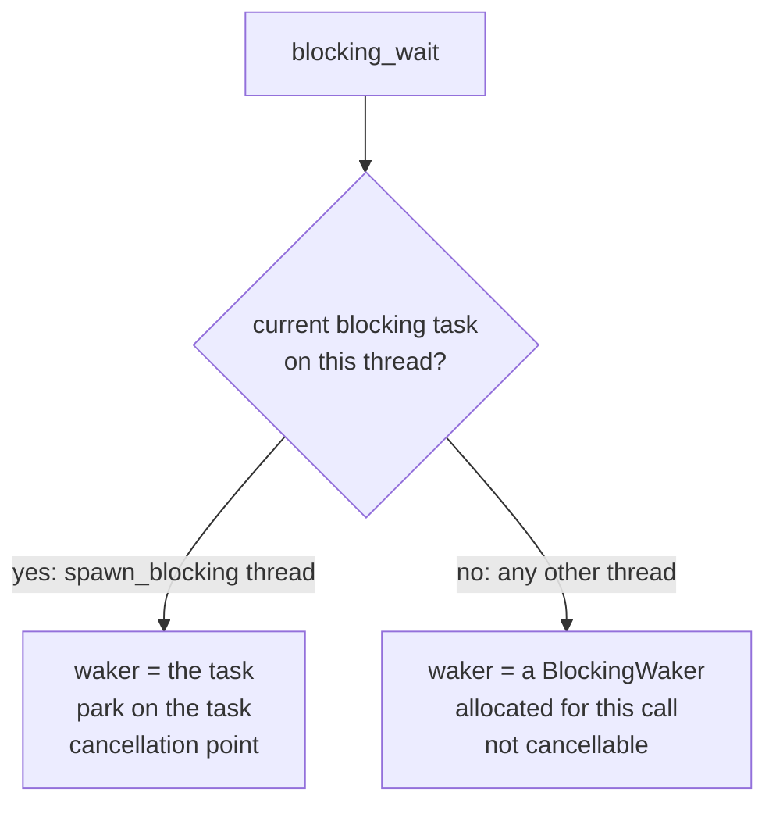

# `blocking_wait` / `blocking_next` — driving a `Future`/`Stream` from a blocking thread

!!! note "Implemented"
    `blocking_wait` lives in `coro/future.h`, `blocking_next` in `coro/stream.h`, both
    guarded `#ifndef CORO_PICO`. Tests: `test/test_future.cpp` (`BlockingWaitTest`),
    `test/test_stream.cpp` (`BlockingNextTest`), and, for parking on the blocking task
    and cancellation, `test/task/test_spawn_blocking.cpp` (`SpawnBlockingCancel`).

## Motivation

Any OS thread that already has `current_runtime()` set — today, that means a
[`spawn_blocking`](spawn_blocking.md) pool thread, and in the future any thread that has
called the proposed `Runtime::enter()` (see [task_and_executor.md](task_and_executor.md)'s
"Runtime" section) — is a valid place to synchronously drive a `Future` or `Stream` to
completion. There is currently no generic way to do this. The nested-`Runtime` pattern (see
[spawn_blocking.md](spawn_blocking.md)'s "Running a Future on a blocking thread") gives a
blocking-pool callable a fully independent async environment — its own executor, its own
`IoDriver`, complete isolation. That isolation is the *point* when it's needed, but it is
also unavoidable overhead when it is not: a compute loop that just wants to drain a
`Stream<T>` (an `MpscReceiver<T>`, or a `CoroStream<T>` async generator) one item at a time
has no need for a second reactor — it already has one available via the ambient thread-local
context.

`blocking_wait`/`blocking_next` are the lightweight alternative: a single-future driver with
no executor and no ready queue — it polls exactly one `Future` (or, via
`next()`, one `Stream` item) to completion on the calling thread, reusing whatever runtime
context is already ambient there. This is the same role Tokio's `Handle::block_on` plays
relative to spinning up a second `tokio::Runtime`.

Although the concrete use in mind today is a `spawn_blocking` compute loop generalized over
`Stream<T>` (see the example below), `blocking_wait`/`blocking_next` are not
`spawn_blocking`-specific: the goal is a primitive usable from any thread with an active
runtime context, which is why this design lives in its own document rather than folded into
`spawn_blocking.md`.

## API

```cpp
namespace coro {

// Polls `future` to completion on the calling thread, blocking between polls.
// Returns the future's value, or rethrows its exception.
// On a blocking pool thread this is a cancellation point: it throws BlockingCancelled
// if the blocking task has been cancelled (see "Cancellation" below).
template<Future F>
typename F::OutputType blocking_wait(F future);

// Equivalent to blocking_wait(coro::next(stream)) — pulls exactly one item.
// Returns nullopt (or false, for void streams) once the stream is exhausted —
// the same detail::StreamItem<T> mapping next()/NextFuture use.
template<Stream S>
detail::StreamItem<typename S::ItemType> blocking_next(S& stream);

} // namespace coro
```

Typical use: a `spawn_blocking` compute loop generalized over any `Stream<T>` source —

```cpp
template<Stream S>
void run_compute_loop(S stream) {
    while (auto item = coro::blocking_next(stream)) {
        process(*item);
    }
}
```

This works identically whether `S` is an `MpscReceiver<T>` or a `CoroStream<T>` async
generator; neither has a blocking-consumption path of its own. Run by `spawn_blocking`,
the loop also ends when its task is cancelled: `blocking_next` throws
`BlockingCancelled`, which unwinds it.

## Design

`blocking_wait` needs two things: a `Waker` to hand to the future, and a way to sleep
until that waker fires. Where they come from depends on the calling thread.



Either way it needs nothing from an executor's ready queue or the I/O driver —
`Context`/`Waker` are just an abstract notification interface (see
[waker_and_context_propagation.md](waker_and_context_propagation.md)).

### On a blocking pool thread

The pool worker publishes the `BlockingTaskBase` it is running in a thread-local (see
[spawn_blocking.md](spawn_blocking.md)'s "The blocking task"). That task is a `TaskBase`,
so it is already a `Waker`, and it gives access to a mutex and a condition variable.
`blocking_wait` uses it for both jobs and allocates nothing:

```cpp
// Sketch. `task` is the current BlockingTaskBase; its scheduling_state is Running.
// The real code reaches it through the free functions in detail/blocking_cancel.h.
template<Future F>
typename F::OutputType blocking_wait(F future) {
    task->throw_if_cancelled();                // entry check
    detail::Context ctx(task);                 // the task is the waker
    for (;;) {
        auto r = future.poll(ctx);
        if (r.isDropped()) throw BlockingCancelled{};
        if (!r.isPending()) { /* return value or rethrow */ }
        task->park();                          // see spawn_blocking.md, "Scheduling state and parking"
        if (task->cancel_pending()) { /* cancel, drain, destroy future; throw */ }
    }
}
```

`park()` is the executor worker's post-poll step, done by the thread to itself: move
`Running → Idle` and sleep until a `wake()` moves the task to `Notified`, or return at
once if a wake already arrived during the poll (`RunningAndNotified`). `wake()` is
`TaskBase::wake()`, unchanged; the task's `owning_executor` turns its `enqueue()` into a
condition-variable notify.

A return from `park()` means "poll again", not "the future is ready". The wake may be
left over from an earlier wait, or be the cancellation wake. A spurious poll returns
`PollPending` and the thread parks again, exactly as for a coroutine task.

### On any other thread

With no current blocking task, `blocking_wait` builds a self-contained `Waker` for the
duration of the call — a mutex, a condition variable, and a "ready" flag — and loop-polls:

```cpp
auto waker = detail::make_rc<detail::BlockingWaker>();  // owns mutex + cv + flag
detail::Context ctx(waker->clone());
for (;;) {
    auto r = future.poll(ctx);
    if (r.isDropped()) throw BlockingCancelled{};
    if (!r.isPending()) {
        r.rethrowIfError();
        if constexpr (std::is_void_v<typename F::OutputType>) return;
        else return std::move(r).value();
    }
    waker->wait_for_wake();  // condvar-wait; BlockingWaker::wake() sets the flag and notifies
}
```

This path has no dependency on where it is called from, which is what keeps
`blocking_wait` usable beyond `spawn_blocking` threads — anywhere `current_runtime()` is
valid works. There is no task to cancel on such a thread, so the call is never a
cancellation point; it can still throw `BlockingCancelled` for a future that reports
`PollDropped` (below).

## Cancellation

On a blocking pool thread `blocking_wait` and `blocking_next` are cancellation points of
the blocking task, in the sense of
[spawn_blocking.md](spawn_blocking.md#cancellation-and-ownership). Three rules:

1. **Cancelled.** Whether the request was already pending on entry or wakes the thread
   while it is parked, the future is shut down before anything is thrown:
    - if it is `Cancellable`, call `cancel()` once and keep polling, parking between
      polls, until it stops returning `PollPending`. Whatever it returns is discarded;
    - destroy the future;
    - throw `BlockingCancelled`.
2. **Entry.** If the task is already cancelled on entry, the wait is not started: the
   future is not polled for a result first. It is still shut down by rule 1, so a
   `Cancellable` future is drained even though it was never polled.
3. **Shielded.** While a `BlockingCancelShield` is alive on the thread, neither rule
   applies: the call behaves as on a thread with no task to cancel, and the request stays
   pending for the first cancellation point after the shield.

Rule 1 is the guarantee a cancelled task gives the future it runs, and the one a
cancelled coroutine gives a future it is awaiting, for the same reason. A `Cancellable`
future (a coroutine, a `JoinHandle`) may own a frame and children that hold references
into the stack that is about to unwind, and may have asynchronous work to do on its way
out. Destroying it is not enough: it has to be told, then polled until it reports that it
has drained. A coroutine does the rest itself during those polls — cancels and drains
what it is awaiting, destroys its frame, waits for the children in its
[scope](coroutine_scope.md) — exactly as it does under an executor. A leaf future is
simply dropped. By the time the exception propagates, nothing the wait was driving is
still running.

Rule 2 drains a future that has not been polled because an unstarted future can still
own things: a coroutine owns its arguments, and a `JoinHandle` a task that is already
running.

!!! note "NOTE: the drain is not itself cancellable"
    Once the drain has started, the thread waits for the future to drain however long that
    takes, as a cancelled coroutine does. A future whose drain can block indefinitely
    makes cancellation of the blocking task block with it.

### A future that reports `PollDropped`

`blocking_wait` is to synchronous code what `co_await` is to a coroutine. When a
coroutine awaits something that turns out to have been cancelled — a `JoinHandle` or
`BlockingHandle` whose task somebody else cancelled — `PollDropped` propagates: the
coroutine does not resume, it drains and reports `PollDropped` in turn. Synchronous code
has one way to stop and unwind, so `blocking_wait` throws `BlockingCancelled`:

- for every output type, `void` included. There is nothing to return, and returning
  normally from a `void` wait would let the caller carry on as if the work had been done;
- on every thread, pool worker or not;
- inside a `BlockingCancelShield` too. A shield holds back the cancellation of *this*
  task; it cannot produce a value the future does not have.

On a pool thread the exception unwinds the callable and the task ends with no result, so
its own handle reports `PollDropped`: cancellation propagates through a chain of waiting
blocking tasks and coroutines the same way in both directions. This does not set the
task's `cancelled` flag. A callable that catches the exception may go on and wait on
other things.

The same goes for the result of a drain under rule 1: whatever the cancelled future
returns, a value included, is discarded and `BlockingCancelled` is thrown. The point of
cancelling is to stop and unwind, not to use one last value and continue.

### Streams

`blocking_next(stream)` applies rule 1 to the stream itself. A stream that has a
`cancel()` — a `CoroStream`, a `StreamHandle` — is cancelled and polled until it reports
`PollDropped`, an error or exhaustion; items it hands out on the way are discarded. Only
then is `BlockingCancelled` thrown. The stream is finished at that point, and destroying
it during the unwinding is all that is left to do with it. A stream with no `cancel()` (a
channel receiver) is a leaf and is left alone.

!!! note "NOTE: `next(stream)` itself is not `Cancellable`"
    `blocking_next` does not wait on a plain `NextFuture`. That future borrows the
    stream, and a `select()` that drops a losing `next(stream)` branch must leave the
    stream running for the next round. `blocking_next` waits on an internal adapter that
    is `Cancellable` when the stream is, so `blocking_wait(next(stream))` and
    `blocking_next(stream)` differ under cancellation: only the second drains the stream.

Cancellation is sticky, so a `blocking_wait` reached during unwinding (in a destructor,
or a `catch` block that cleans up) throws again by rule 1. Cleanup that has to wait wraps
itself in a `BlockingCancelShield`.

!!! warning "WARNING: do not call an unshielded cancellation point from a destructor"
    A destructor that calls `blocking_wait` on a blocking pool thread can throw
    `BlockingCancelled`, which terminates the program if it happens during unwinding.
    Put a `BlockingCancelShield` in the destructor.

## Excluded on `CORO_PICO` — for now

`blocking_wait`/`blocking_next` are compiled out entirely under `CORO_PICO` (`#ifndef
CORO_PICO` around both, in `future.h`/`stream.h`; `detail/blocking_waker.h` is guarded the
same way, and so is the blocking pool whose tasks the cancellable path parks on). This is
**not** a judgment that parking-until-woken has no use case on Pico —
it's that the current backend, `detail::BlockingWaker`, is built on `std::mutex`/
`std::condition_variable`, which require an OS thread scheduler that bare-metal RP2040
builds don't have. The exclusion tracks what the implementation can support today, not a
claim about the primitive itself.

A concrete use case the exclusion rules out: RP2040/RP2350 are dual-core, so core 1 could
run a blocking compute loop while core 0 runs the `CurrentThreadExecutor` loop — core 1
parking via `blocking_wait` until core 0 (or an ISR) has work for it is the same shape as
the desktop `spawn_blocking`-thread case, just with cores instead of OS threads. Supporting
it would mean a second `Waker` backend selected under `CORO_PICO` — not condvar-based, but
built on the same **SIO inter-processor FIFO doorbell** (`sio_hw->fifo_wr` →
`SIO_IRQ_PROC0`) already sketched out as the cross-core wake mechanism for the `__wfi()`
idle-executor TODO in [pico_port.md](pico_port.md#busy-poll-loop-no-cpu-idle-wfi) (see
"Dual-core implementation (requires doorbell)"). That backend has its own race to get right — the
check-then-sleep atomicity the WFI TODO already calls out — which is why this is being
deferred as its own design discussion rather than folded into this exclusion silently.

## Contract: an active `Runtime` is required for reactor-touching futures

`blocking_wait`/`blocking_next` do not set up `current_runtime()` themselves — they inherit
whatever the calling thread already has. Concretely:

- On a `spawn_blocking` thread: it is already set (see
  [spawn_blocking.md](spawn_blocking.md)'s "Thread-local runtime context"), so any future —
  including one that awaits a timer, a socket, or spawns child tasks — can be driven with
  `blocking_wait` with no extra setup.
- On a thread with no active `Runtime` at all (a thread the application created itself, not
  via `spawn_blocking`): `current_runtime()` throws `std::runtime_error` when called, so a
  future that never touches it (pure in-memory work — draining an `MpscReceiver`, awaiting
  a `oneshot`, a hand-written `CoroStream` that only ever `co_await`s channel `recv()`s)
  still works, but one that does throws through `blocking_wait` exactly as it would through
  `co_await` anywhere else without a `Runtime`. Use the proposed `Runtime::enter()` (see
  [task_and_executor.md](task_and_executor.md)'s "Runtime" section) to give such a thread
  valid context first.

!!! note "NOTE: what runtime shutdown does to a thread that is not one of its blocking callables"
    A thread that gave itself runtime context (`set_current_runtime()`) can wait on a
    timer or socket future, but runtime shutdown neither cancels it nor waits for it.
    When the runtime has shut down, the wait ends with an error: `std::runtime_error`
    from a timer, `std::system_error` with `std::errc::operation_canceled` from a
    socket. Such a thread must be finished with the runtime before the `Runtime` is
    destroyed. A `spawn_blocking` callable has neither concern: shutdown cancels and
    drains it. See "Waiters on the I/O driver from outside the runtime" in
    [runtime_shutdown.md](runtime_shutdown.md).

`blocking_wait` deliberately does not paper over this by silently constructing a throwaway
`Runtime`/reactor on first use — that would hide a real cost (a second event loop) behind an
innocuous-looking function call, the same reason the nested-`Runtime` pattern in
`spawn_blocking.md` requires writing out `coro::Runtime inner(1)` explicitly at the call
site.

## Comparison with alternatives

| Approach | Pros | Cons |
|---|---|---|
| `blocking_wait`/`blocking_next` (this doc) | No second reactor/executor allocation; works with any `Future`/`Stream`; usable from any thread with an active runtime context | Requires an already-active `Runtime` context (ambient on `spawn_blocking` threads, or via the proposed `Runtime::enter()`) for futures that touch the reactor |
| Nested `Runtime` + `block_on` (see [spawn_blocking.md](spawn_blocking.md)) | Fully isolated reactor; no ambient-context requirement | Full second executor + `IoDriver` (epoll fd, eventfd) allocated per call |
| Per-channel blocking calls (`MpscReceiver::blocking_recv()` and the like) | Purpose-built | Bespoke to one channel type, and not cancellation points. Removed in favour of this; see [runtime_shutdown.md](runtime_shutdown.md#removing-the-channel-blocking-calls) |

## Placement

`blocking_wait` belongs in `coro/future.h`, next to the `Future` concept itself.
`future.h` already holds the pure poll-based machinery that has no dependency on any
specific task type or executor (`Cancellable`, `Ref`) — `blocking_wait` fits the same
shape: it operates only through `Context`/`Waker`, plus `detail/blocking_cancel.h` for
the current blocking task, which brings in neither `TaskBase`, the pool nor
`BlockingHandle` (see [spawn_blocking.md](spawn_blocking.md#header-layout)).

`blocking_next` belongs in `coro/stream.h`, next to `next()`/`NextFuture`, which it
mirrors directly — `blocking_next(stream)` is `blocking_wait(next(stream))` (plus the
stream drain under cancellation described above) with a
stream-shaped return type, the same relationship `next()` already has to `Future`.

`coro/task` (alongside `spawn_blocking` and `fiber`) and `coro/sync` were considered and
ruled out: both `blocking_wait` and `blocking_next` are meant to be usable independent of
any specific task type, and neither is a synchronization primitive between tasks — they're
polling drivers, which is what makes `future.h`/`stream.h` the correct fit.
