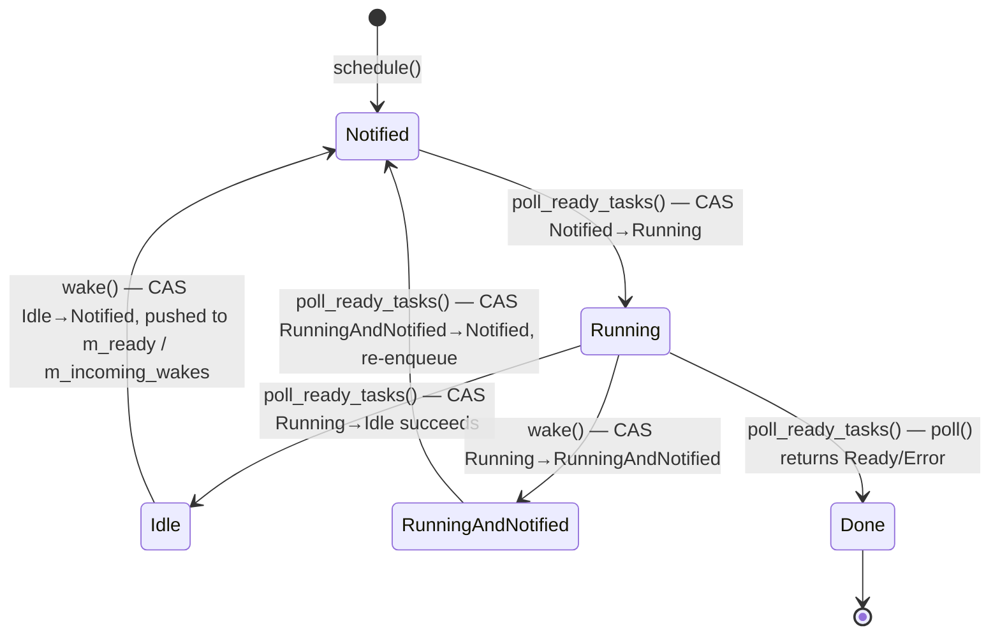
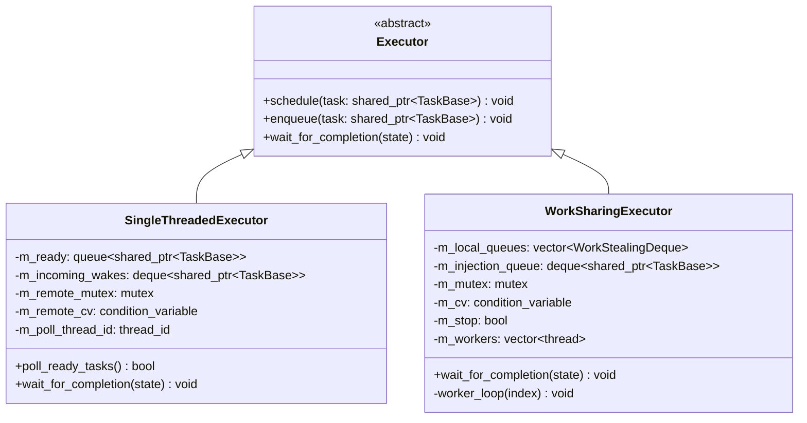
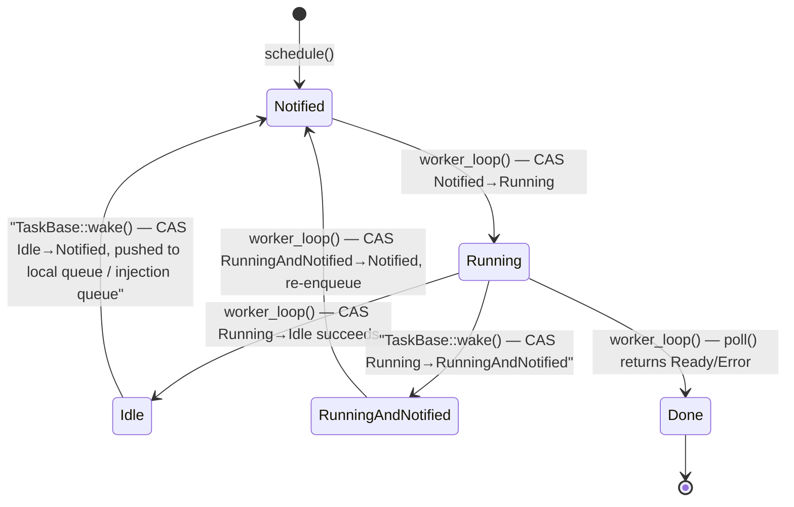
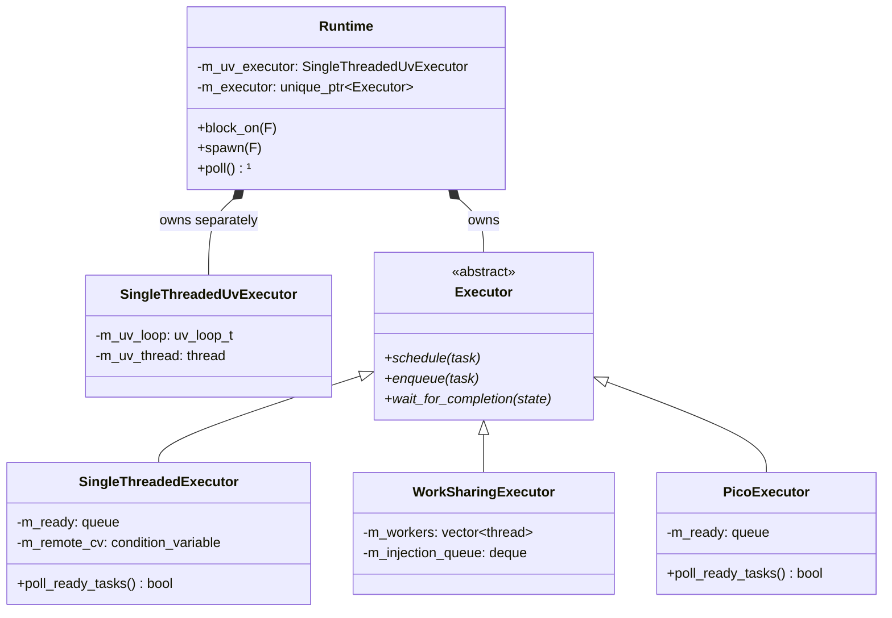
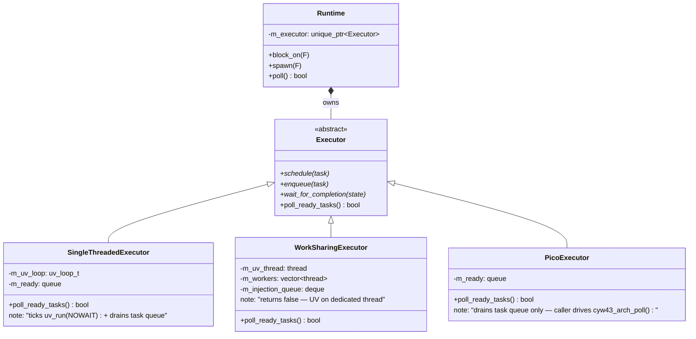

# Executor Design

Design document covering the `Executor` interface, the two concrete implementations
(`SingleThreadedExecutor` and `WorkSharingExecutor`), and the planned local-queue /
injection-queue changes that enable safe wakeups from external threads.

---

## Overview

`Executor` is the abstract scheduling interface. It accepts type-erased `Task` objects
and decides when to poll them. It does not own threads or the I/O reactor — those belong
to `Runtime`.

Two concrete implementations exist:

| Executor | Threads | Use case |
|---|---|---|
| `SingleThreadedExecutor` | 1 (the calling thread) | Tests, deterministic debugging, single-threaded apps |
| `WorkSharingExecutor` | N worker threads | Multi-threaded production use |

`Runtime` selects the implementation at construction time:

```cpp
Runtime::Runtime(std::size_t num_threads) {
    if (num_threads <= 1)
        m_executor = std::make_unique<SingleThreadedExecutor>();
    else
        m_executor = std::make_unique<WorkSharingExecutor>(num_threads, this);
}
```

---

## Local Wake vs. Remote Wake

When the `IoService` background thread calls `Waker::wake()` (e.g. from a libuv timer or
I/O callback), it originates from a thread that is not the poll loop.
Every executor must therefore handle wakeups from threads it does not own.

Tokio and similar runtimes distinguish two categories of wakeup:

| Category | Caller thread | Synchronization needed |
|---|---|---|
| **Local wake** | Same thread as the poll loop / owning worker | None — sole owner of the local queue |
| **Remote wake** | Any other thread (timer, I/O, cross-thread) | Mutex + condvar signal |

**Local wake (fast path):** the waker fires from the thread that owns the ready queue.
No locking is needed. This is the common case: coroutines waking each other
synchronously during `poll()` — channels, `select`, `JoinHandle` resolution.

**Remote wake (injection queue):** the waker fires from a foreign thread. The safe
path appends the task to a mutex-protected **injection queue** and signals a condvar so
the poll thread wakes up if it is blocked. The poll thread drains the injection queue
at the start of each cycle.

The thread identity check is performed inside `Executor::enqueue()` — the method called
by `TaskBase::wake()` after winning the `Idle → Notified` CAS. This replaces the old
`wake_task(key)` pattern that required a `m_suspended` lookup:

```
enqueue(task):
    if this_thread is the owning worker:
        local_queue.push(task)   // no lock
    else:
        lock(injection_mutex)
        injection_queue.push_back(task)
        unlock(injection_mutex)
        injection_cv.notify_one()
```

External threads never touch the local ready queue directly — only the injection queue.

---

## Task Scheduling State

Rather than tracking suspended tasks in a central `m_suspended` map, the planned design
follows Tokio's approach: ownership of the `shared_ptr<TaskBase>` moves with the task's
lifecycle, and an atomic state field in `TaskBase` tracks the current phase.

### States

| State | `shared_ptr<TaskBase>` owner | Description |
|---|---|---|
| **Idle** | The `Waker` stored by the suspended future | Waiting for an external event |
| **Running** | The executor / worker | Currently inside `poll()` |
| **Notified** | A ready queue | Queued and waiting to be polled |
| **RunningAndNotified** | The executor / worker | `wake()` fired during `poll()`; worker re-enqueues after poll returns |
| **Done** | About to be destroyed | `poll()` returned `Ready`; terminal — no further transitions |

```cpp
enum class SchedulingState : uint8_t {
    Idle               = 0,
    Running            = 1,
    Notified           = 2,
    RunningAndNotified = 3,
    Done               = 4,
};
```

When `schedule()` first enqueues a task it must explicitly store `Notified` into
`scheduling_state` before pushing to the queue. The field defaults to `Idle`, but `Idle`
means a waker is responsible for re-enqueueing — at initial schedule no waker exists yet.
This mirrors Tokio, which initializes new task state with the `SCHEDULED` flag set.

Unlike the conceptual states shown in the executor state diagrams (which are implicit in
which data structure holds the task's `shared_ptr`), `SchedulingState` is an explicit
field that must be stored. The CAS operations that replace `m_suspended` have nothing to
operate on without it.

**Implementation note:** `scheduling_state` lives in `TaskBase`. Fire-and-forget tasks
(created by `spawn().detach()`) have no external `JoinHandle` holding a
`shared_ptr<TaskState<T>>`, but they still need a scheduling state for the waker CAS to
work. Placing the field in `TaskBase` — which every `TaskImpl<F>` inherits — handles both
cases uniformly:

```cpp
class TaskBase {
public:
    std::atomic<SchedulingState> scheduling_state{SchedulingState::Idle};
    // ...
};
```

**C++ note:** `std::atomic<T>` is not movable. `Task` previously had
`Task(Task&&) noexcept = default`, which would produce a deleted move constructor once
`scheduling_state` was added. Explicit move operations were required that load/store the
atomic value rather than trying to move it.

### TaskBase as Waker

`TaskBase` IS the `Waker`. It inherits both `detail::Waker` and
`std::enable_shared_from_this<TaskBase>`, so a waker clone is simply a `shared_ptr`
refcount increment on the existing task allocation — no separate heap object is needed.

`scheduling_state` and `owning_executor` live directly in `TaskBase`, giving `wake()` all
the state it needs without an extra indirection:

```cpp
void TaskBase::wake() {
    auto expected = SchedulingState::Idle;
    while (true) {
        switch (expected) {
        case SchedulingState::Idle:
            if (CAS(expected → Notified)) { owning_executor->enqueue(shared_from_this()); return; }
            break; // expected updated; retry

        case SchedulingState::Running:
            if (CAS(expected → RunningAndNotified)) { return; }
            break; // expected updated; retry

        case SchedulingState::Notified:
        case SchedulingState::RunningAndNotified:
            return; // already pending — no-op

        case SchedulingState::Done:
            return; // task completed — no-op

        default:
            std::abort(); // unknown state — bug
        }
    }
}

std::shared_ptr<Waker> TaskBase::clone() {
    return shared_from_this(); // refcount increment only — no allocation
}
```

`acq_rel` on the winning CAS synchronizes-with any subsequent load of the task's state,
ensuring the worker that picks it up sees all writes made by the waking thread before the
CAS. `relaxed` on the failure path is safe because no memory ordering guarantee is needed
when nothing is transferred.

The loop is necessary because the state can change between two CAS attempts. For example,
if an `Idle → Notified` CAS fails because a worker just transitioned the task to `Running`,
the next iteration correctly handles `Running → RunningAndNotified`. Conversely, if
`Running → RunningAndNotified` fails because the worker completed and moved back to `Idle`,
the next iteration retries `Idle → Notified`. Without the loop, that second scenario would
be a silent dropped wakeup.

Multiple waker clones may race to call `wake()`. Only the first `Idle → Notified` CAS
succeeds and pushes to the queue; the rest observe `Notified` (or `RunningAndNotified`)
and return as no-ops. Each clone is a `shared_ptr<TaskBase>`, so the task remains alive
until the winning clone transfers its ref to the queue via `enqueue()`.

The executor obtains the initial waker immediately before calling `poll()` with a simple
cast — no allocation:

```cpp
Context ctx(std::static_pointer_cast<detail::Waker>(task));
```

### Executor::enqueue()

`executor->enqueue(task)` routes the task to the appropriate queue based on thread
identity — local queue (no lock) for the owning worker, injection queue (with lock) for
any other thread. This replaces `wake_task(key)`, which had to look up the task in
`m_suspended`. With the waker owning the `shared_ptr<Task>`, no lookup is needed.

**Initial schedule always uses the injection queue.** `schedule()` is called by
`Runtime::block_on()` before `wait_for_completion()` sets `m_poll_thread_id`
(single-threaded) or before any worker thread is running (work-sharing). In both cases
the caller is not a worker of the executor, so the first enqueue always takes the
injection/remote path. This is correct and expected — the poll thread or first worker
will drain it on its first iteration.

!!! tip "TODO: merge `schedule()` into `enqueue()`"
    `schedule()` and `enqueue()` follow identical routing logic. The only difference today is
    that `schedule()` explicitly sets `scheduling_state = Notified` before pushing, because new
    tasks start at `Idle` and no waker exists yet to do the CAS transition.

    That responsibility belongs at task construction, not in the executor interface. If new
    tasks are initialized with `scheduling_state = Notified` directly — which is correct, since
    they are created explicitly to run — `schedule()` and `enqueue()` become identical and can
    be merged into a single `enqueue()` method on `Executor`.

    The "remote spawn from a non-worker thread" case that might otherwise justify separate
    treatment does not exist in this library: `spawn()` is only callable from within a running
    coroutine, which is always polled by a worker. First-time submission and re-wakeup always
    originate from the same class of caller and warrant the same routing logic. Removing
    `schedule()` also opens the door to the LIFO-slot optimization: since spawned tasks come
    from a worker, they can go directly to the local queue (or LIFO slot) rather than
    passing through the injection queue, matching Tokio's behaviour.

### Worker loop integration

After `poll()` returns `Pending`, the worker attempts to transition `Running → Idle`. If
`wake()` fired concurrently the state is `RunningAndNotified` and the CAS fails — the
worker re-enqueues instead of parking:

```
after poll() returns Pending:
    expected = Running
    if CAS(expected → Idle) succeeds:
        task.reset()          // waker now holds the only ref; task parks until wake() fires
    else:
        // State must be RunningAndNotified — assert and re-enqueue
        expected = RunningAndNotified
        ASSERT CAS(expected → Notified) succeeds, else log unexpected state and terminate
        enqueue(task)
```

This eliminates `m_suspended` from both executors entirely — there is no longer a map of
parked tasks. A task in the `Idle` state is kept alive solely by the `shared_ptr` inside
the `Waker` that the suspended future is holding.

Every scheduling state transition uses CAS — including `Notified → Running` before
`poll()`. A plain store would silently overwrite whatever state the task is actually in.
A CAS failure indicates a bug (e.g. two workers racing to poll the same task) and the
executor must log the unexpected state and terminate. This policy applies to every
transition: `schedule()` storing `Notified`, workers storing `Running`, and the post-poll
`Running → Idle` / `RunningAndNotified → Notified` paths.

---

## TaskStateBase, TaskState<T>, and Completion Signalling

`block_on` must block the calling thread until the top-level task completes. The
completion signal lives in `TaskStateBase` — a non-template base of `TaskState<T>`, which
is itself a base of every `TaskImpl<F>`. The inheritance chain is:

```
TaskStateBase   ← mutex, cv, terminated, wait_until_done()
  └── TaskState<T>   ← cancelled, join_waker, scope_waker, self_waker, result, exception
        └── TaskImpl<F>   ← m_future, poll() override    (also inherits TaskBase)
```

`TaskStateBase` and `TaskState<T>` are not allocated separately — they are base subobjects
of the single `make_shared<TaskImpl<F>>()` call that `spawn()` makes. `JoinHandle<T>`
holds a `shared_ptr<TaskState<T>>` aliased from that same allocation.

```cpp
struct TaskStateBase {
    mutable std::mutex      mutex;
    std::condition_variable cv;
    bool                    terminated{false};

    // RACE CONDITION NOTE: this is safe because every code path that sets
    // `terminated = true` also calls `cv.notify_all()` *in the same critical section*
    // (under `mutex`). Key invariant: set `terminated = true` AND call `cv.notify_all()`
    // while holding `mutex`.
    void wait_until_done() {
        std::unique_lock lock(mutex);
        cv.wait(lock, [this]{ return terminated; });
    }
};
```

`scheduling_state` does **not** live here — see the implementation note in [Task Scheduling State](#task-scheduling-state).

Every terminal method (`setResult`, `setDone`, `setException`, `mark_done`) sets
`terminated = true` and calls `cv.notify_all()` **inside the same lock**, eliminating
any lost-wakeup window.

Cancellation is delivered by setting `cancelled = true` (in `TaskState<T>`) and then
calling `waker->wake()`. This transitions the task from `Idle → Notified` so it is
re-enqueued and polled, where it observes `cancelled` and enters the `PollDropped` path
to run destructors and drain child tasks. Simply dropping the `shared_ptr<TaskBase>` is
not safe: unlike Rust futures (plain values that the compiler drops safely at any `await`
point), C++ coroutine frames are heap-allocated and the only way to release their
resources is to resume and poll through completion.

`wait_for_completion` for `WorkSharingExecutor` delegates entirely:

```cpp
void wait_for_completion(detail::TaskStateBase& state) {
    state.wait_until_done();
}
```

`SingleThreadedExecutor` cannot use this directly since it *is* the poll thread — it
must interleave polling with waiting. See the [SingleThreadedExecutor](#singlethreadedexecutor)
section for the planned fix.

`Runtime::block_on` passes `*state` directly to either implementation:

```cpp
m_executor->schedule(task_base_ptr);
m_executor->wait_for_completion(*task_state_ptr);
```

---

## SingleThreadedExecutor

### Task states

Each task is in exactly one state at any moment:



| Transition | Function |
|---|---|
| `[*] → Notified` | `schedule()` — stores `Notified` before first `enqueue()` call |
| `Notified → Running` | `poll_ready_tasks()` — CAS before invoking `task->poll()` |
| `Running → Idle` | `poll_ready_tasks()` — CAS after `poll()` returns `Pending`; succeeds when no concurrent wake |
| `Running → RunningAndNotified` | `TaskBase::wake()` — second CAS when task is mid-poll |
| `RunningAndNotified → Notified` | `poll_ready_tasks()` — CAS after `poll()` returns `Pending`; fires when first CAS failed; re-enqueues via `m_ready` |
| `Running → Done` | `poll_ready_tasks()` — `poll()` returned `true`; task dropped in place |
| `Idle → Notified` | `TaskBase::wake()` — first CAS; calls `enqueue()` which routes to `m_ready` (local) or `m_incoming_wakes` (remote) |

### Data model

```
m_poll_thread_id : thread::id                         ← set when wait_for_completion is entered
m_incoming_wakes : deque<shared_ptr<TaskBase>>        ← remote enqueue() calls deposit here
m_remote_mutex   : mutex                              ← guards m_incoming_wakes
m_remote_cv      : condition_variable                 ← signalled by remote enqueue(); waited on by wait_for_completion
```

The fields `m_suspended`, `m_running_task_key`, and `m_running_task_woken` that existed
in earlier iterations have been replaced by the `SchedulingState` CAS machine — a task in
`Idle` is kept alive solely by the `shared_ptr<Task>` inside its waker.

### Enqueue routing

`TaskBase::wake()` calls `executor->enqueue(task)` after the `Idle → Notified` CAS
succeeds. `enqueue` routes based on thread identity:

```
enqueue(task):
    if this_thread == m_poll_thread_id:
        // Local path — push directly to ready queue, no lock
        m_ready.push(task)
    else:
        // Remote path — hand off to poll thread via injection queue
        lock(m_remote_mutex)
        m_incoming_wakes.push_back(task)
        unlock(m_remote_mutex)
        m_remote_cv.notify_one()
```

The `Running → RunningAndNotified` self-wake CAS is handled entirely inside
`TaskBase::wake()` — no executor involvement needed.

### poll_ready_tasks — drain injection queue first

```
poll_ready_tasks():
    lock(m_remote_mutex)
    for task in m_incoming_wakes:
        m_ready.push(task)
    m_incoming_wakes.clear()
    unlock(m_remote_mutex)

    // Existing poll loop (unchanged)
    ...
```

### wait_for_completion — block until done

```
wait_for_completion(state):
    m_poll_thread_id = this_thread::get_id()
    while true:
        if state.terminated: return
        if poll_ready_tasks(): continue
        // Ready queue empty — block until a remote wake arrives.
        // state.terminated cannot change while blocked here since tasks only
        // complete during poll_ready_tasks(), which is not running.
        lock(m_remote_mutex)
        m_remote_cv.wait(lock, [this]{ return !m_incoming_wakes.empty(); })
        unlock(m_remote_mutex)
    m_poll_thread_id = {}
```

!!! tip "PERF: add per-turn task budget"
    If tasks continuously wake each other, `poll_ready_tasks()` always returns `true` and
    the outer loop never yields. `m_incoming_wakes` is drained at the start of each
    `poll_ready_tasks()` call so timer wakeups are still serviced, but remote wakes may be
    delayed by an arbitrary number of local iterations. Tokio addresses this with a per-turn
    task budget (default 61): after processing that many tasks the worker unconditionally
    yields to drain the injection queue regardless of whether the local queue is empty. A
    similar bound should be applied here.

---

## WorkSharingExecutor

### Current implementation



### Data model

```
WorkSharingExecutor
│
├── m_local_queues    : vector<WorkStealingDeque<shared_ptr<TaskBase>>>  ← per-worker local queues
├── m_injection_queue : deque<shared_ptr<TaskBase>>                      ← remote enqueue path
├── m_mutex           : mutex                    ← guards m_injection_queue and m_stop only
├── m_cv              : condition_variable       ← workers wait here when both queues empty
├── m_stop            : bool                     ← shutdown signal, set under m_mutex
└── m_workers         : vector<thread>           ← N worker threads
```

There is no `m_suspended` map — a task in `Idle` is kept alive solely by the waker
clone(s) held by leaf futures. There is no `m_self_woken` map — self-wake is handled by
the `Running → RunningAndNotified` CAS in `TaskBase::wake()`.

### Task state machine



| Transition | Function |
|---|---|
| `[*] → Notified` | `schedule()` — stores `Notified` before first `enqueue()` call |
| `Notified → Running` | `worker_loop()` — CAS before invoking `task->poll()` |
| `Running → Idle` | `worker_loop()` — CAS after `poll()` returns `Pending`; succeeds when no concurrent wake |
| `Running → RunningAndNotified` | `TaskBase::wake()` — second CAS when task is mid-poll on a worker |
| `RunningAndNotified → Notified` | `worker_loop()` — CAS after `poll()` returns `Pending`; fires when first CAS failed; re-enqueues via `enqueue()` |
| `Running → Done` | `worker_loop()` — `poll()` returned `true`; task dropped outside any lock |
| `Idle → Notified` | `TaskBase::wake()` — first CAS; calls `enqueue()` which routes to `m_local_queues[t_worker_index]` (local) or `m_injection_queue` (remote) |

**Self-wake** (waker fires while the task is mid-poll on a worker thread) is handled
lock-free via the `Running → RunningAndNotified` CAS in `TaskBase::wake()`. No shared
`m_self_woken` map is needed — after `poll()` returns `Pending`, `worker_loop()` attempts
`Running → Idle`; if that CAS fails the state must be `RunningAndNotified`, so the worker
CASes to `Notified` and re-enqueues.

### Worker thread loop

```
worker_loop():
    set_current_runtime(m_runtime)
    set_current_io_service(&m_runtime->io_service())

    loop:
        // Try local queue first (no lock), then injection queue.
        task = m_local_queues[this_worker].pop()
        if not task:
            lock(m_mutex)
            wait on m_cv until: m_injection_queue non-empty OR m_stop
            if m_stop and m_injection_queue empty → break
            task = m_injection_queue.pop_front()
            unlock(m_mutex)

        expected = Notified
        ASSERT CAS(expected → Running) succeeds

        done = task->poll(Context(task))        ← runs outside any lock

        if done:
            drop task
        else:
            // Try Running → Idle; re-enqueue if woken during poll
            expected = Running
            if CAS(expected → Idle):
                task.reset()    // waker clone holds the only ref
            else:
                expected = RunningAndNotified
                ASSERT CAS(expected → Notified) succeeds
                enqueue(task)

    set_current_runtime(nullptr)
    set_current_io_service(nullptr)
```

**Key invariants:**
- `task->poll()` runs without holding `m_mutex` so other workers can dequeue and remote
  wakers can push to the injection queue concurrently.
- `m_cv.notify_all()` on task completion is called **inside** `m_mutex` (via
  `TaskStateBase::wait_until_done`). Calling it after the lock release creates a
  lost-wakeup window.
- `m_stop = true` is set **inside** `m_mutex` before `notify_all()` in the destructor,
  for the same reason.

### Thread-local state

Two thread-locals are set on each worker at startup:

| Thread-local | Set by | Used by |
|---|---|---|
| `t_current_runtime` | Worker thread startup | `coro::spawn()`, `JoinSet::spawn()`, `spawn_blocking()` |
| `t_current_io_service` | Worker thread startup | `SleepFuture::poll()`, any future that submits to `IoService` |

### Shutdown

The destructor:
1. Sets `m_stop = true` inside `m_mutex`
2. Calls `m_cv.notify_all()` after releasing the lock
3. Joins all worker threads

Outstanding tasks in `m_queue` and `m_suspended` are dropped when their `shared_ptr`s
destruct.

### Enqueue routing

`TaskBase::wake()` calls `executor->enqueue(task)` after the `Idle → Notified` CAS.
Two thread-locals identify the calling worker:

```cpp
thread_local WorkSharingExecutor* t_owning_executor = nullptr;
thread_local int                  t_worker_index    = -1;
```

`enqueue()` routes based on both — `t_owning_executor == this` ensures cross-executor
calls always take the injection path:

```
enqueue(task):
    if t_worker_index >= 0 AND t_owning_executor == this:
        m_local_queues[t_worker_index].push(task)   // no lock
    else:
        lock(m_mutex)
        m_injection_queue.push_back(task)
        unlock(m_mutex)
        m_cv.notify_one()
```

!!! tip "PERF: add per-turn task budget"
    A worker that continuously receives local wakes will never yield to check the injection
    queue, starving remote wakes. Tokio uses a per-turn budget (default 61 tasks from the
    local queue) after which the worker unconditionally checks the injection queue before
    continuing. A similar bound should be applied to the local queue drain loop here.

---

## Summary

| | `SingleThreadedExecutor` | `WorkSharingExecutor` |
|---|---|---|
| **External wake safety** | `m_incoming_wakes` injection queue; `m_remote_cv` blocks when idle | `m_injection_queue` + `m_cv`; workers block when both local and injection queues empty |
| **Suspended task storage** | `Idle` atomic state; waker holds the only `shared_ptr<Task>` ref | `Idle` atomic state; waker holds the only `shared_ptr<Task>` ref |
| **Self-wake detection** | `RunningAndNotified` CAS in `TaskBase::wake()` | `RunningAndNotified` CAS in `TaskBase::wake()` |
| **Local enqueue path** | Direct to `m_ready`, no lock (poll thread only) | Direct to `m_local_queue[t_worker_index]`, no lock (owning worker only) |
| **Remote enqueue path** | `m_incoming_wakes` + `m_remote_cv.notify_one()` | `m_injection_queue` + `m_cv.notify_one()` |
| **wait_for_completion** | Drives poll loop; blocks on `m_remote_cv` when ready queue empty | Delegates entirely to `state.wait_until_done()` |

---

## Future Direction: Unified Current-Thread Poll Loop

!!! tip "TODO: absorb UV reactor into SingleThreadedExecutor"
    The current design treats the task executor and the I/O reactor as separate peers.
    `Runtime::block_on()` sets both `t_current_runtime` and `t_current_uv_executor` as
    independent thread-locals, and `SingleThreadedExecutor::wait_for_completion()` interleaves
    task polling with UV ticks by blocking on `m_remote_cv` when the ready queue is empty and
    relying on the UV thread to signal it when I/O events arrive.

    The Pico port exposes a cleaner model: `PicoExecutor` is a **current-thread executor** with
    no worker threads at all. The calling thread IS the scheduler. `wait_for_completion()` drives
    both the coroutine ready queue and the hardware I/O event loop (`cyw43_arch_poll()`) in a
    tight alternating loop with no blocking. Because there are no other threads, `Runtime::poll()`
    — a single call to `poll_ready_tasks()` — is safe to expose to the caller for use in a
    manually-driven firmware event loop.

    `SingleThreadedExecutor` could adopt the same model for the standard build:

    - Replace the `m_remote_cv` blocking wait with a `uv_run(UV_RUN_NOWAIT)` tick when the
      ready queue is empty, giving libuv a turn without yielding the thread.
    - This eliminates the need for a separate UV thread in single-threaded mode and the
      `t_current_uv_executor` thread-local, since the UV loop is now owned by the executor
      itself rather than `Runtime`.
    - `poll_ready_tasks()` would become a meaningful virtual method on `Executor` (with a
      default no-op), allowing `Runtime::poll()` to be exposed unconditionally rather than
      only under `#ifdef CORO_PICO`.

    **Key constraint:** libuv is thread-affine — `uv_run()` must be called from the thread
    that owns the loop. This integration therefore only applies to `SingleThreadedExecutor`.
    `WorkSharingExecutor` must keep UV on a dedicated thread as it does today, because tasks
    migrate across worker threads and there is no single thread that can own the UV loop.

    The practical consequence is a three-way executor taxonomy:

    | Executor | UV ownership | `poll()` safe from caller? |
    |---|---|---|
    | `PicoExecutor` | `cyw43_arch_poll()` called by caller alongside `poll()` | Yes — current-thread model |
    | `SingleThreadedExecutor` (future) | UV loop owned by executor, ticked inside `poll_ready_tasks()` | Yes — current-thread model |
    | `WorkSharingExecutor` | Dedicated UV thread; no caller-visible poll | No — worker threads own scheduling |

    This redesign is non-trivial: it requires `SingleThreadedExecutor` to own the UV loop
    (currently owned by `SingleThreadedUvExecutor` as a separate `Runtime` member), restructure
    `wait_for_completion()`, and add `poll_ready_tasks()` to the `Executor` base interface.
    It should be tackled as a dedicated phase with its own design document.

### Current ownership model



¹ `Runtime::poll()` is `#ifdef CORO_PICO` only — delegates to `PicoExecutor::poll_ready_tasks()`.
UV is a separate peer of the task executor; `block_on()` must set both as independent thread-locals.

### Future ownership model



`SingleThreadedUvExecutor` is absorbed into `SingleThreadedExecutor`. `Runtime` owns a single
executor pointer in all builds. `poll_ready_tasks()` is a virtual method with a default `return false`
no-op, making `Runtime::poll()` unconditionally available — meaningful for single-threaded and
Pico runtimes, a safe no-op for multi-threaded ones.

---

## Files

| File | Status | Contents |
|---|---|---|
| `include/coro/detail/task_state.h` | Complete | `TaskStateBase`, `TaskState<T>` — completion signal, result, wakers |
| `include/coro/detail/task.h` | Complete | `TaskBase` (non-template executor base); `TaskImpl<F>` (concrete template combining `TaskBase` + `TaskState<T>` + future in one allocation) |
| `include/coro/detail/work_stealing_deque.h` | Complete | `WorkStealingDeque<T>` — mutex-backed, Chase-Lev interface |
| `include/coro/runtime/executor.h` | Complete | `schedule`/`enqueue(shared_ptr<TaskBase>)` pure virtual |
| `src/task.cpp` | Complete | `TaskBase::wake()` / `TaskBase::clone()` — out-of-line to break circular include with `executor.h` |
| `include/coro/runtime/single_threaded_executor.h` | Complete | Injection queue fields; `m_suspended` and self-wake fields removed |
| `src/single_threaded_executor.cpp` | Complete | `enqueue` routing; CAS-based poll loop; fixed `wait_for_completion` |
| `include/coro/runtime/work_sharing_executor.h` | Complete | Per-worker local queues; `m_suspended`, `m_self_woken` removed |
| `src/work_sharing_executor.cpp` | Complete | Dual thread-locals; `enqueue` routing; CAS-based worker loop |
