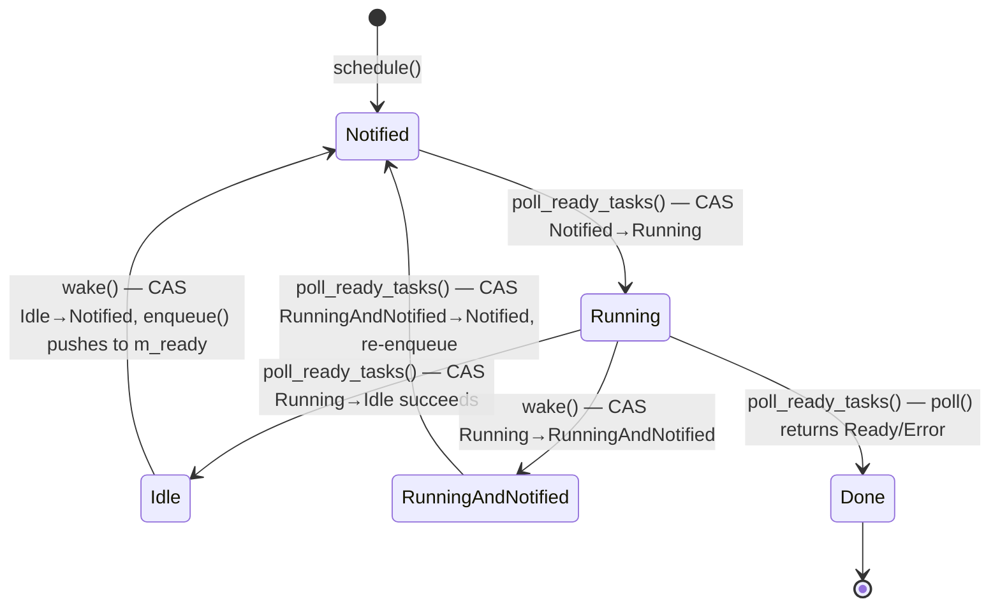
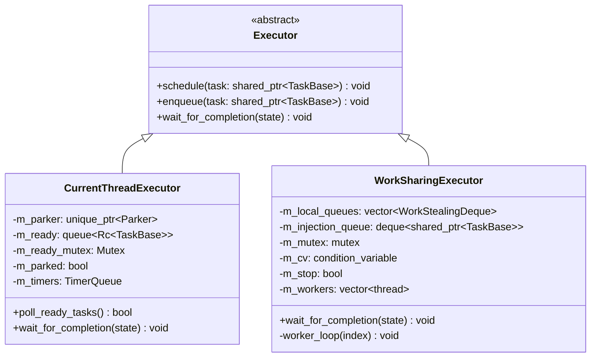
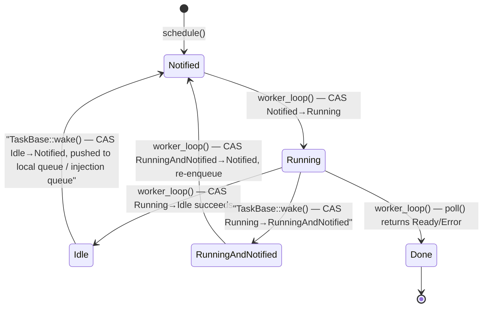

# Executor Design

Design document covering the `Executor` interface, the task scheduling state machine,
and two of the concrete implementations: `CurrentThreadExecutor` and
`WorkSharingExecutor`. `WorkStealingExecutor`, the default multi-threaded executor, has
its own document: [Work-Stealing Scheduler](work_stealing_executor.md).

---

## Overview

`Executor` is the abstract scheduling interface. It accepts type-erased `Task` objects
and decides when to poll them. It does not own threads or the I/O reactor — those belong
to `Runtime`.

Three concrete implementations exist:

| Executor | Threads | Use case |
|---|---|---|
| `CurrentThreadExecutor` | 1 (the calling thread) | Single-threaded apps, deterministic tests, Pico |
| `WorkStealingExecutor` | N worker threads | Multi-threaded production use (the default) |
| `WorkSharingExecutor` | N worker threads | Simpler reference scheduler, mainly a debugging aid |

`Runtime` selects the implementation at construction time:

```cpp
Runtime::Runtime(std::size_t num_threads) {
    if (num_threads <= 1)
        m_executor = std::make_unique<CurrentThreadExecutor>(this);
    else
        m_executor = std::make_unique<WorkStealingExecutor>(this, num_threads);
}
```

`Runtime(std::in_place_type<E>, args...)` builds any other executor, such as
`WorkSharingExecutor`.

---

## Local Wake vs. Remote Wake

When a blocking-pool thread, an lws service thread, or another executor's worker calls
`Waker::wake()`, it originates from a thread that is not the poll loop.
Every executor must therefore handle wakeups from threads it does not own.

Tokio and similar runtimes distinguish two categories of wakeup:

| Category | Caller thread | Synchronization needed |
|---|---|---|
| **Local wake** | Same thread as the poll loop / owning worker | None — sole owner of the local queue |
| **Remote wake** | Any other thread (timer, I/O, cross-thread) | Mutex + condvar signal |

**Local wake (fast path):** the waker fires from the thread that owns the ready queue.
No locking is needed. This is the common case: coroutines waking each other
synchronously during `poll()` — channels, `select`, `JoinHandle` resolution.

**Remote wake (injection queue):** the waker fires from a foreign thread. The safe
path appends the task to a mutex-protected **injection queue** and signals a condvar so
the poll thread wakes up if it is blocked. The poll thread drains the injection queue
at the start of each cycle.

The thread identity check is performed inside `Executor::enqueue()` — the method called
by `TaskBase::wake()` after winning the `Idle → Notified` CAS. This replaces the old
`wake_task(key)` pattern that required a `m_suspended` lookup:

```
enqueue(task):
    if this_thread is the owning worker:
        local_queue.push(task)   // no lock
    else:
        lock(injection_mutex)
        injection_queue.push_back(task)
        unlock(injection_mutex)
        injection_cv.notify_one()
```

External threads never touch the local ready queue directly — only the injection queue.

---

## Task Scheduling State

Rather than tracking suspended tasks in a central `m_suspended` map, the planned design
follows Tokio's approach: ownership of the `shared_ptr<TaskBase>` moves with the task's
lifecycle, and an atomic state field in `TaskBase` tracks the current phase.

### States

| State | `shared_ptr<TaskBase>` owner | Description |
|---|---|---|
| **Idle** | The `Waker` stored by the suspended future | Waiting for an external event |
| **Running** | The executor / worker | Currently inside `poll()` |
| **Notified** | A ready queue | Queued and waiting to be polled |
| **RunningAndNotified** | The executor / worker | `wake()` fired during `poll()`; worker re-enqueues after poll returns |
| **Done** | About to be destroyed | `poll()` returned `Ready`; terminal — no further transitions |

```cpp
enum class SchedulingState : uint8_t {
    Idle               = 0,
    Running            = 1,
    Notified           = 2,
    RunningAndNotified = 3,
    Done               = 4,
};
```

When `schedule()` first enqueues a task it must explicitly store `Notified` into
`scheduling_state` before pushing to the queue. The field defaults to `Idle`, but `Idle`
means a waker is responsible for re-enqueueing — at initial schedule no waker exists yet.
This mirrors Tokio, which initializes new task state with the `SCHEDULED` flag set.

Unlike the conceptual states shown in the executor state diagrams (which are implicit in
which data structure holds the task's `shared_ptr`), `SchedulingState` is an explicit
field that must be stored. The CAS operations that replace `m_suspended` have nothing to
operate on without it.

**Implementation note:** `scheduling_state` lives in `TaskBase`. Fire-and-forget tasks
(created by `spawn().detach()`) have no external `JoinHandle` holding a
`shared_ptr<TaskState<T>>`, but they still need a scheduling state for the waker CAS to
work. Placing the field in `TaskBase` — which every `TaskImpl<F>` inherits — handles both
cases uniformly:

```cpp
class TaskBase {
public:
    std::atomic<SchedulingState> scheduling_state{SchedulingState::Idle};
    // ...
};
```

**C++ note:** `std::atomic<T>` is not movable. `Task` previously had
`Task(Task&&) noexcept = default`, which would produce a deleted move constructor once
`scheduling_state` was added. Explicit move operations were required that load/store the
atomic value rather than trying to move it.

### TaskBase as Waker

`TaskBase` IS the `Waker`. It inherits both `detail::Waker` and
`std::enable_shared_from_this<TaskBase>`, so a waker clone is simply a `shared_ptr`
refcount increment on the existing task allocation — no separate heap object is needed.

`scheduling_state` and `owning_executor` live directly in `TaskBase`, giving `wake()` all
the state it needs without an extra indirection:

```cpp
void TaskBase::wake() {
    auto expected = SchedulingState::Idle;
    while (true) {
        switch (expected) {
        case SchedulingState::Idle:
            if (CAS(expected → Notified)) { owning_executor->enqueue(shared_from_this()); return; }
            break; // expected updated; retry

        case SchedulingState::Running:
            if (CAS(expected → RunningAndNotified)) { return; }
            break; // expected updated; retry

        case SchedulingState::Notified:
        case SchedulingState::RunningAndNotified:
            return; // already pending — no-op

        case SchedulingState::Done:
            return; // task completed — no-op

        default:
            std::abort(); // unknown state — bug
        }
    }
}

std::shared_ptr<Waker> TaskBase::clone() {
    return shared_from_this(); // refcount increment only — no allocation
}
```

`acq_rel` on the winning CAS synchronizes-with any subsequent load of the task's state,
ensuring the worker that picks it up sees all writes made by the waking thread before the
CAS. `relaxed` on the failure path is safe because no memory ordering guarantee is needed
when nothing is transferred.

The loop is necessary because the state can change between two CAS attempts. For example,
if an `Idle → Notified` CAS fails because a worker just transitioned the task to `Running`,
the next iteration correctly handles `Running → RunningAndNotified`. Conversely, if
`Running → RunningAndNotified` fails because the worker completed and moved back to `Idle`,
the next iteration retries `Idle → Notified`. Without the loop, that second scenario would
be a silent dropped wakeup.

Multiple waker clones may race to call `wake()`. Only the first `Idle → Notified` CAS
succeeds and pushes to the queue; the rest observe `Notified` (or `RunningAndNotified`)
and return as no-ops. Each clone is a `shared_ptr<TaskBase>`, so the task remains alive
until the winning clone transfers its ref to the queue via `enqueue()`.

The executor obtains the initial waker immediately before calling `poll()` with a simple
cast — no allocation:

```cpp
Context ctx(std::static_pointer_cast<detail::Waker>(task));
```

### Executor::enqueue()

`executor->enqueue(task)` routes the task to the appropriate queue based on thread
identity — local queue (no lock) for the owning worker, injection queue (with lock) for
any other thread. This replaces `wake_task(key)`, which had to look up the task in
`m_suspended`. With the waker owning the `shared_ptr<Task>`, no lookup is needed.

**Initial schedule always uses the injection queue.** `schedule()` is called by
`Runtime::block_on()` before `wait_for_completion()` sets `m_poll_thread_id`
(single-threaded) or before any worker thread is running (work-sharing). In both cases
the caller is not a worker of the executor, so the first enqueue always takes the
injection/remote path. This is correct and expected — the poll thread or first worker
will drain it on its first iteration.

!!! tip "TODO: merge `schedule()` into `enqueue()`"
    `schedule()` and `enqueue()` follow identical routing logic. The only difference today is
    that `schedule()` explicitly sets `scheduling_state = Notified` before pushing, because new
    tasks start at `Idle` and no waker exists yet to do the CAS transition.

    That responsibility belongs at task construction, not in the executor interface. If new
    tasks are initialized with `scheduling_state = Notified` directly — which is correct, since
    they are created explicitly to run — `schedule()` and `enqueue()` become identical and can
    be merged into a single `enqueue()` method on `Executor`.

    The "remote spawn from a non-worker thread" case that might otherwise justify separate
    treatment does not exist in this library: `spawn()` is only callable from within a running
    coroutine, which is always polled by a worker. First-time submission and re-wakeup always
    originate from the same class of caller and warrant the same routing logic. Removing
    `schedule()` also opens the door to the LIFO-slot optimization: since spawned tasks come
    from a worker, they can go directly to the local queue (or LIFO slot) rather than
    passing through the injection queue, matching Tokio's behaviour.

### Worker loop integration

After `poll()` returns `Pending`, the worker attempts to transition `Running → Idle`. If
`wake()` fired concurrently the state is `RunningAndNotified` and the CAS fails — the
worker re-enqueues instead of parking:

```
after poll() returns Pending:
    expected = Running
    if CAS(expected → Idle) succeeds:
        task.reset()          // waker now holds the only ref; task parks until wake() fires
    else:
        // State must be RunningAndNotified — assert and re-enqueue
        expected = RunningAndNotified
        ASSERT CAS(expected → Notified) succeeds, else log unexpected state and terminate
        enqueue(task)
```

This eliminates `m_suspended` from both executors entirely — there is no longer a map of
parked tasks. A task in the `Idle` state is kept alive solely by the `shared_ptr` inside
the `Waker` that the suspended future is holding.

Every scheduling state transition uses CAS — including `Notified → Running` before
`poll()`. A plain store would silently overwrite whatever state the task is actually in.
A CAS failure indicates a bug (e.g. two workers racing to poll the same task) and the
executor must log the unexpected state and terminate. This policy applies to every
transition: `schedule()` storing `Notified`, workers storing `Running`, and the post-poll
`Running → Idle` / `RunningAndNotified → Notified` paths.

---

## TaskStateBase, TaskState<T>, and Completion Signalling

`block_on` must block the calling thread until the top-level task completes. The
completion signal lives in `TaskStateBase` — a non-template base of `TaskState<T>`, which
is itself a base of every `TaskImpl<F>`. The inheritance chain is:

```
TaskStateBase   ← mutex, cv, terminated, wait_until_done()
  └── TaskState<T>   ← cancelled, join_waker, scope_waker, self_waker, result, exception
        └── TaskImpl<F>   ← m_future, poll() override    (also inherits TaskBase)
```

`TaskStateBase` and `TaskState<T>` are not allocated separately — they are base subobjects
of the single `make_shared<TaskImpl<F>>()` call that `spawn()` makes. `JoinHandle<T>`
holds a `shared_ptr<TaskState<T>>` aliased from that same allocation.

```cpp
struct TaskStateBase {
    mutable std::mutex      mutex;
    std::condition_variable cv;
    bool                    terminated{false};

    // RACE CONDITION NOTE: this is safe because every code path that sets
    // `terminated = true` also calls `cv.notify_all()` *in the same critical section*
    // (under `mutex`). Key invariant: set `terminated = true` AND call `cv.notify_all()`
    // while holding `mutex`.
    void wait_until_done() {
        std::unique_lock lock(mutex);
        cv.wait(lock, [this]{ return terminated; });
    }
};
```

`scheduling_state` does **not** live here — see the implementation note in [Task Scheduling State](#task-scheduling-state).

Every terminal method (`setResult`, `setDone`, `setException`, `mark_done`) sets
`terminated = true` and calls `cv.notify_all()` **inside the same lock**, eliminating
any lost-wakeup window.

Cancellation is delivered by setting `cancelled = true` (in `TaskState<T>`) and then
calling `waker->wake()`. This transitions the task from `Idle → Notified` so it is
re-enqueued and polled, where it observes `cancelled` and enters the `PollDropped` path
to run destructors and drain child tasks. Simply dropping the `shared_ptr<TaskBase>` is
not safe: unlike Rust futures (plain values that the compiler drops safely at any `await`
point), C++ coroutine frames are heap-allocated and the only way to release their
resources is to resume and poll through completion.

`wait_for_completion` for `WorkSharingExecutor` delegates entirely:

```cpp
void wait_for_completion(detail::TaskStateBase& state) {
    state.wait_until_done();
}
```

`CurrentThreadExecutor` cannot use this directly since it *is* the poll thread — it
must interleave polling with waiting. See [CurrentThreadExecutor](#currentthreadexecutor).

`Runtime::block_on` passes `*state` directly to either implementation:

```cpp
m_executor->schedule(task_base_ptr);
m_executor->wait_for_completion(*task_state_ptr);
```

---

## CurrentThreadExecutor

`CurrentThreadExecutor` runs every task on the thread that calls `block_on()`. It is the
executor behind desktop `Runtime(1)` and the only executor on Pico. The scheduling loop is
platform-neutral; how it waits for outside events is an injected `Parker`
(see [I/O Driver](io_driver.md), "Parker"):

| Parker | Wait | Used by |
|---|---|---|
| `IoDriverParker` | Blocks in `IoDriver::turn()`; I/O events and timers are dispatched on this thread | desktop `Runtime(1)` |
| `PollingParker` | Calls `cyw43_arch_poll()` once and never blocks, so the loop busy-polls | Pico `Runtime` |

It keeps a single mutex-protected ready queue for local and remote wakes alike. The local
case is uncontended, and one queue is simpler to reason about than a lock-free local queue
next to a remote one.

!!! tip "PERF: no lock-free same-thread fast path"
    Every enqueue takes `m_ready_mutex`, even from the executor's own thread. If profiling
    ever shows that lock, add a thread-local fast path for local wakes then.

### Task states

The task state machine is the shared `SchedulingState` CAS machine described above:


```mermaid
stateDiagram-v2
    [*] --> Notified : schedule()
    Notified --> Running : poll_ready_tasks() — CAS Notified→Running
    Running --> Idle : poll_ready_tasks() — CAS Running→Idle succeeds
    Running --> RunningAndNotified : wake() — CAS Running→RunningAndNotified
    RunningAndNotified --> Notified : poll_ready_tasks() — CAS RunningAndNotified→Notified, re-enqueue
    Running --> Done : poll_ready_tasks() — poll() returns Ready/Error
    Idle --> Notified : wake() — CAS Idle→Notified, enqueue() pushes to m_ready
    Done --> [*]
```

### The loop

All ready-queue state is under `m_ready_mutex`:

```cpp
wait_for_completion(state):
    while (true) {
        if (state.terminated) break;            // under state.mutex
        poll_ready_tasks();
        check_expired_timers();
        if (state.terminated) break;            // the last poll may have finished the root task
        park_once();
    }

park_once():
    { lock(m_ready_mutex);
      if (!m_ready.empty()) max_wait = 0;
      else { max_wait = m_timers.begin_wait(nullopt); m_parked = true; } }
    t_parked_executor = this;                   // thread-local
    parker.park(max_wait);
    t_parked_executor = nullptr;
    m_timers.end_wait();
    { lock(m_ready_mutex); m_parked = false; }

enqueue(task):
    { lock(m_ready_mutex); m_ready.push(task); unpark = m_parked && t_parked_executor != this; }
    if (unpark) parker.unpark();
```

- **The executor picks the wait.** Zero when the ready queue isn't empty; otherwise the
  time until the next deadline in its own timer queue, or no limit. On a desktop `Runtime`
  its timers live in the driver's queue instead, and `turn()` bounds its own wait by them
  (see [Timers](timers.md)).
- **Busy executors poll I/O every N batches, not every batch.** While tasks stay ready, the
  loop calls `park(0)` once per batch. `IoDriverParker` only turns the driver on every
  `event_interval`-th such call (61, tokio's value), so a task that keeps re-waking itself
  doesn't pay an `epoll_wait` syscall per poll. Edge-triggered events wait in the kernel
  meanwhile. Any non-zero wait always turns. Keeping the counter in the parker leaves the
  loop platform-neutral and Pico's per-iteration `cyw43_arch_poll()` unchanged.
- **A remote enqueue unparks only a parked executor.**

### Parking and its races

- **A remote wake before the executor decides to park.** `enqueue()` pushes under the lock,
  so the executor's empty check sees the task and parks with a zero wait. No unpark is
  needed and none is sent.
- **A remote wake while the executor is parked, or about to be.** The executor set
  `m_parked` under the same lock as its empty check, so `enqueue()` sees it and unparks.
  `unpark()` is sticky (an eventfd write), so it works even if it lands before the executor
  actually blocks in `turn()`.
- **A local wake while parked.** The driver fires wakers inside `turn()`, on the executor
  thread, while `m_parked` is true. Unparking there would cost an eventfd write and make the
  next `turn()` return at once for nothing. The thread-local `t_parked_executor` marks the
  parking thread, so these wakes skip the unpark.
- **A stale unpark (benign).** A remote `enqueue()` reads `m_parked == true`, releases the
  lock, and the executor wakes for another reason before `unpark()` runs. The unpark then
  makes the executor's next `park()` return early: one extra loop iteration.
- **The root task finishes during `poll_ready_tasks()`.** The second `terminated` check
  catches it. Without it, an empty queue would park with no limit and never return.
- **A `spawn()` from another thread.** `schedule()` goes through `enqueue()`, not a bare
  push onto `m_ready`, so that it unparks too.

!!! danger "WARNING: every push onto `m_ready` from outside the loop must unpark"
    A common pattern is a root task that awaits `spawn_blocking()`, so the executor parks
    with no limit, while the blocking thread `spawn()`s a task. If `schedule()` pushed onto
    `m_ready` without unparking, that task would never run.
    `CurrentThreadRuntimeTest.SpawnFromBlockingThreadUnparksDriver` covers it.

### Tests

`test/runtime/test_current_thread_executor.cpp` covers the executor with a test `Parker`
(remote enqueue unparks only while parked, local wakes during `park()` don't, the root task
finishing mid-batch, its own timer queue) and on `Runtime(1)` (`CurrentThreadRuntimeTest`:
I/O and timers through the driver, spawns from foreign threads). The typed `AllExecutors`
suites run every executor-agnostic test on it as well.

---

## WorkSharingExecutor

### Current implementation


```mermaid
classDiagram
    class Executor {
        <<abstract>>
        +schedule(task: shared_ptr~TaskBase~) void
        +enqueue(task: shared_ptr~TaskBase~) void
        +wait_for_completion(state) void
    }
    class CurrentThreadExecutor {
        -m_parker: unique_ptr~Parker~
        -m_ready: queue~Rc~TaskBase~~
        -m_ready_mutex: Mutex
        -m_parked: bool
        -m_timers: TimerQueue
        +poll_ready_tasks() bool
        +wait_for_completion(state) void
    }
    class WorkSharingExecutor {
        -m_local_queues: vector~WorkStealingDeque~
        -m_injection_queue: deque~shared_ptr~TaskBase~~
        -m_mutex: mutex
        -m_cv: condition_variable
        -m_stop: bool
        -m_workers: vector~thread~
        +wait_for_completion(state) void
        -worker_loop(index) void
    }
    Executor <|-- CurrentThreadExecutor
    Executor <|-- WorkSharingExecutor
```

### Data model

```
WorkSharingExecutor
│
├── m_local_queues    : vector<WorkStealingDeque<shared_ptr<TaskBase>>>  ← per-worker local queues
├── m_injection_queue : deque<shared_ptr<TaskBase>>                      ← remote enqueue path
├── m_mutex           : mutex                    ← guards m_injection_queue and m_stop only
├── m_cv              : condition_variable       ← workers wait here when both queues empty
├── m_stop            : bool                     ← shutdown signal, set under m_mutex
└── m_workers         : vector<thread>           ← N worker threads
```

There is no `m_suspended` map — a task in `Idle` is kept alive solely by the waker
clone(s) held by leaf futures. There is no `m_self_woken` map — self-wake is handled by
the `Running → RunningAndNotified` CAS in `TaskBase::wake()`.

### Task state machine


```mermaid
stateDiagram-v2
    [*] --> Notified : schedule()
    Notified --> Running : worker_loop() — CAS Notified→Running
    Running --> Idle : worker_loop() — CAS Running→Idle succeeds
    Running --> RunningAndNotified : "TaskBase\:\:wake() — CAS Running→RunningAndNotified"
    RunningAndNotified --> Notified : worker_loop() — CAS RunningAndNotified→Notified, re-enqueue
    Running --> Done : worker_loop() — poll() returns Ready/Error
    Idle --> Notified : "TaskBase\:\:wake() — CAS Idle→Notified, pushed to local queue / injection queue"
    Done --> [*]
```

| Transition | Function |
|---|---|
| `[*] → Notified` | `schedule()` — stores `Notified` before first `enqueue()` call |
| `Notified → Running` | `worker_loop()` — CAS before invoking `task->poll()` |
| `Running → Idle` | `worker_loop()` — CAS after `poll()` returns `Pending`; succeeds when no concurrent wake |
| `Running → RunningAndNotified` | `TaskBase::wake()` — second CAS when task is mid-poll on a worker |
| `RunningAndNotified → Notified` | `worker_loop()` — CAS after `poll()` returns `Pending`; fires when first CAS failed; re-enqueues via `enqueue()` |
| `Running → Done` | `worker_loop()` — `poll()` returned `true`; task dropped outside any lock |
| `Idle → Notified` | `TaskBase::wake()` — first CAS; calls `enqueue()` which routes to `m_local_queues[t_worker_index]` (local) or `m_injection_queue` (remote) |

**Self-wake** (waker fires while the task is mid-poll on a worker thread) is handled
lock-free via the `Running → RunningAndNotified` CAS in `TaskBase::wake()`. No shared
`m_self_woken` map is needed — after `poll()` returns `Pending`, `worker_loop()` attempts
`Running → Idle`; if that CAS fails the state must be `RunningAndNotified`, so the worker
CASes to `Notified` and re-enqueues.

### Worker thread loop

```
worker_loop():
    set_current_runtime(m_runtime)

    loop:
        // Try local queue first (no lock), then injection queue.
        task = m_local_queues[this_worker].pop()
        if not task:
            // Waits on m_cv, or turns the I/O driver if no other worker is
            // (see "I/O and timers: the driver handoff" below).
            task = wait_for_task(this_worker)
            if not task:
                if m_stop → break
                continue          // a driver turn woke tasks onto the local queue

        expected = Notified
        ASSERT CAS(expected → Running) succeeds

        done = task->poll(Context(task))        ← runs outside any lock

        if done:
            drop task
        else:
            // Try Running → Idle; re-enqueue if woken during poll
            expected = Running
            if CAS(expected → Idle):
                task.reset()    // waker clone holds the only ref
            else:
                expected = RunningAndNotified
                ASSERT CAS(expected → Notified) succeeds
                enqueue(task)

    set_current_runtime(nullptr)
```

**Key invariants:**
- `task->poll()` runs without holding `m_mutex` so other workers can dequeue and remote
  wakers can push to the injection queue concurrently.
- `m_cv.notify_all()` on task completion is called **inside** `m_mutex` (via
  `TaskStateBase::wait_until_done`). Calling it after the lock release creates a
  lost-wakeup window.
- `m_stop = true` is set **inside** `m_mutex` before `notify_all()` in the destructor,
  for the same reason.

### I/O and timers: the driver handoff

I/O readiness and timers fire only where some thread turns the runtime's `IoDriver`. The
work-sharing port is the smallest handoff that works; its workers share one injection
queue, one mutex and one condvar:

```
wait_for_task(i):                         // under m_mutex
    loop:
        if m_injection_queue non-empty: return its front
        if m_stop: return null
        if m_driver_held: wait on m_cv; continue
        m_driver_held = true
        unlock; driver.turn(nullopt); lock    // wakes land in local queue i
        m_driver_held = false
        if local queue i, the injection queue, or m_stop has something:
            m_cv.notify_one()                 // let a waiter take the driver over
            if local queue i non-empty: return null
```

- **An idle worker takes the driver** if no other worker holds it (`m_driver_held`, under
  `m_mutex`), and turns it with no limit with the mutex released. Other idle workers wait
  on the condvar as before.
- **Wakes from I/O and timers run on the holder's thread,** so they land in its local
  queue. When it leaves the driver with work, it notifies the condvar so another worker
  can take the driver over; with none, it turns again.
- **A remote enqueue** into the injection queue calls `driver.unpark()` if the driver is
  held, as well as notifying the condvar. Shutdown does the same.

The races:

- **A remote enqueue while the holder is about to block.** `m_driver_held` is set under
  `m_mutex` before the holder unlocks to turn, and the enqueuer reads it under the same
  lock. Either the holder's check sees the task, or the enqueuer sees `m_driver_held` and
  unparks. The unpark is sticky (the eventfd stays readable until a poll consumes it), so
  it is not lost if it lands before the holder blocks.
- **A stale unpark (benign).** The holder leaves `turn()` for another reason before the
  enqueuer's `unpark()`; its next turn returns at once.
- **A handoff to a worker that finds the driver re-taken (benign).** The notified worker
  sees `m_driver_held` again and goes back to waiting.
- **Shutdown.** A worker takes the driver only after checking `m_stop` under `m_mutex`, so
  the destructor either stops it from turning or sees it holding the driver and unparks
  it. The `Runtime` destroys its executor before its driver, so the unpark is safe.

!!! note "NOTE: busy workers never turn the driver"
    I/O and timers wait until some worker goes idle, and tasks woken by the driver run on
    the holder: local queues are not stolen from, so a burst of I/O wakes is not spread
    across workers. That is acceptable for a debugging executor; `WorkStealingExecutor`
    is the one to use for throughput.

### Thread-local state

One thread-local is set on each worker at startup:

| Thread-local | Set by | Used by |
|---|---|---|
| `t_current_runtime` | Worker thread startup | `coro::spawn()`, `JoinSet::spawn()`, `spawn_blocking()`, `SleepFuture::poll()` and the I/O primitives (via `current_runtime().io_driver()`) |

### Shutdown

Shutdown has two parts, and `Runtime::shutdown()` runs them in order (see
[runtime_shutdown.md](runtime_shutdown.md)):

1. `begin_shutdown()` closes the owned set and cancels every task in it, under
   `m_owned_mutex`. The workers keep running and drain those tasks. A task scheduled
   after this is born cancelled, and each removal from the closed set reports to the
   runtime, which is how the thread in `shutdown()` learns that the set is empty.
2. The destructor, which runs only once no task is left, sets `m_stop = true` inside
   `m_mutex`, calls `m_cv.notify_all()` after releasing the lock, unparks the driver if
   a worker holds it (see the driver handoff above), and joins the worker threads.

### Enqueue routing

`TaskBase::wake()` calls `executor->enqueue(task)` after the `Idle → Notified` CAS.
Two thread-locals identify the calling worker:

```cpp
thread_local WorkSharingExecutor* t_owning_executor = nullptr;
thread_local int                  t_worker_index    = -1;
```

`enqueue()` routes based on both — `t_owning_executor == this` ensures cross-executor
calls always take the injection path:

```
enqueue(task):
    if t_worker_index >= 0 AND t_owning_executor == this:
        m_local_queues[t_worker_index].push(task)   // no lock
    else:
        lock(m_mutex)
        m_injection_queue.push_back(task)
        unlock(m_mutex)
        m_cv.notify_one()
```

!!! tip "PERF: add per-turn task budget"
    A worker that continuously receives local wakes will never yield to check the injection
    queue, starving remote wakes. Tokio uses a per-turn budget (default 61 tasks from the
    local queue) after which the worker unconditionally checks the injection queue before
    continuing. A similar bound should be applied to the local queue drain loop here.

---

## Summary

| | `CurrentThreadExecutor` | `WorkSharingExecutor` |
|---|---|---|
| **External wake safety** | `m_ready` under `m_ready_mutex`; unparks the `Parker` if parked | `m_injection_queue` + `m_cv`; unparks the driver if a worker holds it |
| **Suspended task storage** | `Idle` atomic state; the executor's owned-task set keeps it alive | `Idle` atomic state; waker holds the only `shared_ptr<Task>` ref |
| **Self-wake detection** | `RunningAndNotified` CAS in `TaskBase::wake()` | `RunningAndNotified` CAS in `TaskBase::wake()` |
| **Local enqueue path** | `m_ready` under `m_ready_mutex` (uncontended), no unpark | Direct to `m_local_queue[t_worker_index]`, no lock (owning worker only) |
| **Remote enqueue path** | `m_ready` under `m_ready_mutex` + `parker.unpark()` if parked | `m_injection_queue` + `m_cv.notify_one()` (+ `driver.unpark()`) |
| **Idle wait** | `Parker::park()`: blocks in the I/O driver (desktop) or busy-polls (Pico) | One worker turns the I/O driver; the others wait on `m_cv` |
| **wait_for_completion** | Drives the poll loop on the calling thread | Delegates entirely to `state.wait_until_done()` |

---

## Former direction: unified current-thread poll loop

!!! note "NOTE: superseded by the I/O driver"
    This section used to propose absorbing the libuv loop into a single-threaded executor,
    so the calling thread would drive both tasks and I/O, as the Pico executor does. The
    I/O driver did this more generally: an idle executor parks by turning the epoll `IoDriver`
    (one worker at a time on the multi-threaded executors), the uv thread and the
    `t_current_uv_executor` thread-local are gone, and libuv was removed. See
    [I/O Driver](io_driver.md), "Who turns the driver". The `poll_ready_tasks()` /
    unconditional `Runtime::poll()` part of the proposal was not adopted;
    `Runtime::poll()` remains Pico-only.

---

## Files

| File | Status | Contents |
|---|---|---|
| `include/coro/detail/task_state.h` | Complete | `TaskStateBase`, `TaskState<T>` — completion signal, result, wakers |
| `include/coro/detail/task.h` | Complete | `TaskBase` (non-template executor base); `TaskImpl<F>` (concrete template combining `TaskBase` + `TaskState<T>` + future in one allocation) |
| `include/coro/detail/work_stealing_deque.h` | Complete | `WorkStealingDeque<T>` — mutex-backed, Chase-Lev interface |
| `include/coro/runtime/executor.h` | Complete | `schedule`/`enqueue(shared_ptr<TaskBase>)` pure virtual |
| `src/task.cpp` | Complete | `TaskBase::wake()` / `TaskBase::clone()` — out-of-line to break circular include with `executor.h` |
| `include/coro/runtime/current_thread_executor.h` | Complete | Single ready queue under `m_ready_mutex`; `Parker`; own `TimerQueue` |
| `src/runtime/current_thread_executor.cpp` | Complete | CAS-based poll loop; `park_once()`; unpark-only-when-parked `enqueue` |
| `include/coro/runtime/parker.h` | Complete | `Parker`, `IoDriverParker`, `PollingParker` |
| `include/coro/runtime/work_sharing_executor.h` | Complete | Per-worker local queues; `m_suspended`, `m_self_woken` removed |
| `src/runtime/work_sharing_executor.cpp` | Complete | Dual thread-locals; `enqueue` routing; CAS-based worker loop; driver handoff |
