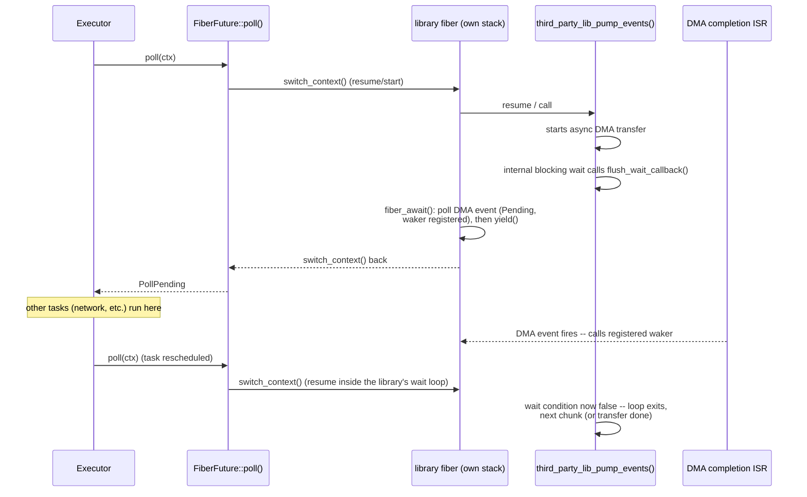

# Fiber — cooperative stackful execution contexts

## Status: Phase 3 (implemented — POSIX/desktop backend)

This document sketches a new coro primitive: a cooperative, stackful execution
context ("fiber") that can suspend from *anywhere in its call stack* — not just
at a `co_await` expression — and be resumed later exactly where it left off.

The POSIX/desktop backend (`FiberFuture<T>`, `FiberHandle<T>`, `spawn_fiber()`,
`fiber_await()`, `ucontext`-backed `switch_context()`, `mprotect`-guarded
stack allocation) is implemented and unit-tested — see
`include/coro/task/fiber.h`, `include/coro/detail/fiber_context.h`,
`src/detail/fiber_context_posix.cpp`, `src/task/fiber.cpp`, and
`test/task/test_fiber.cpp`. Per the "Testing strategy" section's sequencing
note, the Pico/ARMv6-M backend (`fiber_context_pico.S`, the Unicorn-based test
setup) has not been started yet.

---

## Motivation

`Coro<T>` is a stackless coroutine: the compiler only inserts a suspension
point at each `co_await` in the coroutine's own body. That's fine as long as
you own the whole call stack down to the blocking operation. It breaks down
the moment a third-party C library sits in between — its blocking wait loop
is buried several ordinary (non-coroutine) stack frames deep, and there is no
`co_await` anywhere inside it to hook into.

This came up concretely on a Pico (RP2040) project driving a DMA-based
peripheral through a third-party C GUI/display library. Getting a truly
async, DMA-driven transfer out of that library requires suspending *inside*
its own event-pump entry point — specifically inside an internal spin loop
that blocks until the DMA completes, several frames below any code we
control — and resuming exactly there once the DMA finishes, while letting
every other coro task keep making progress in the meantime. `Coro<T>`
fundamentally cannot do this: there is no `co_await` point inside the
library's C code for the compiler to have generated a suspension for.

`spawn_blocking` (see [spawn_blocking.md](spawn_blocking.md)) solves the
adjacent problem — "call a blocking function without stalling the
executor" — on desktop, by running the callable on a dedicated OS thread.
That doesn't help here for two reasons:

- **No OS thread pool exists on bare metal.** The Pico target has no threads
  to spawn at all.
- **Some libraries assume single-thread affinity.** This particular
  library's global state is not internally synchronized and is documented
  as single-threaded-only — `spawn_blocking`'s pool hands work to whichever
  thread happens to be idle, with no guaranteed affinity across calls, which
  is exactly the kind of use a library like this doesn't support even if
  threads were available.

The same shape of problem can often be encountered on desktop projects too,
independent of any MCU constraint — wanting to run a blocking, callback-driven
library cooperatively on the executor's own thread rather than paying for a
full OS thread or fighting its single-thread-affinity assumptions. So this is
worth designing as a portable coro primitive, not a bare-metal-only hack.

---

## Prior art

| Approach | Mechanism | Portable? |
|---|---|---|
| POSIX `ucontext.h` (`getcontext`/`makecontext`/`swapcontext`) | OS-provided context save/restore | POSIX only |
| Boost.Context, `libaco`, Ruby `Fiber`, Win32 Fiber API | Hand-written per-ISA assembly register/stack swap | Yes, with per-arch backends |
| FreeRTOS / ChibiOS Cortex-M0 ports | Hand-written ARMv6-M assembly context switch (for preemptive scheduling, but the register save/restore mechanics are identical for a purely cooperative switch) | Reference implementation for the exact target this project cares about |

Nothing here needs to be invented from scratch — this is a well-trodden
technique with directly adaptable reference implementations, particularly for
Cortex-M0+ specifically (RP2040), whose AAPCS calling convention only
requires saving `r4`–`r11` and `sp` across a switch (`r0`–`r3`/`r12` are
caller-saved scratch; `lr`/`pc` fall out of the return sequence).

!!! note "Default to following FreeRTOS's lead on Cortex-M mechanics"
    For any low-level ARMv6-M question this design runs into (stack-pointer
    banking, register save/restore conventions, interrupt-masking needs, and
    similar) — FreeRTOS's Cortex-M0 port has already had this exact class of
    problem worked through and hardened across years of production use on
    real hardware. Defer to what it actually does rather than re-deriving an
    answer from first principles or intuition, and only deviate where there's
    a concrete, stated reason this project's constraints differ from an
    RTOS's. Any deviation from FreeRTOS's approach should be called out
    explicitly in this document, next to the design point it affects, rather
    than left implicit.

---

## Design

### `FiberContext` — the low-level primitive

One stackful execution context: a dedicated stack buffer plus enough saved
register state to resume execution in it later. A single operation —
symmetric context transfer, not an asymmetric function call:

```
switch_context(FiberContext* from, FiberContext* to)
```

Saves the currently-running context's callee-saved registers and stack
pointer into `from`, loads `to`'s saved registers and stack pointer, and
resumes wherever `to` last left off. Before resuming `to`, checks the saved
`sp` against `to`'s precomputed `[stack_base, stack_base + stack_size)`
range and fails clean (assert/abort in debug, best-effort trap in release)
if it's outside that range — see "Stack overflow detection" below.

!!! note "Interrupts firing mid-switch"
    Considered and not believed to need masking: the `sp` transfer is a
    single instruction (atomic w.r.t. interrupts), and at every point in the
    sequence the live `sp` points into a currently-valid stack region, so an
    interrupt landing anywhere just pushes/pops its own frame normally
    (given adequate ISR-nesting headroom, as above). Unlike an RTOS's
    PendSV-based switch, no shared scheduler state is touched here that an
    ISR could race against — because this design is cooperative, not
    preemptive. `PendSV` exists to let an RTOS switch a task *out from under
    it*, asynchronously, at a moment the running code never chose (a timer
    tick, an IRQ waking a higher-priority task); deferring the actual
    save/restore to one serialized, lowest-priority exception is what makes
    that safe against racing another interrupt trying to do the same thing.
    `switch_context()` here is only ever called synchronously, by code
    explicitly choosing to yield (`fiber_await()`/`fiber_yield()`) — nothing
    external ever forces a switch at a moment a fiber didn't ask for, so
    there's no shared, concurrently-mutated scheduler state for an ISR to
    race in the first place.

This is implemented per-architecture, mirroring how `runtime/` already
selects an `Executor` implementation per platform:

- **ARMv6-M (RP2040 / Cortex-M0+, `CORO_PICO`)** — hand-written assembly,
  saving/restoring `r4`–`r11` and `sp` only.
- **POSIX desktop (x86-64 / ARM64)** — backed by `ucontext.h` initially
  (`makecontext`/`swapcontext`); no new assembly needed here to start. A
  hand-rolled backend can replace it later if `ucontext`'s overhead (it saves
  the full signal mask, not just registers) ever actually matters.

### `FiberFuture<T>` — a fiber is just another `Future`, internally

A fiber is not a new scheduling concept: it's a `Future<T>` whose `poll()` is
a context switch instead of resumed compiler-generated coroutine state. It
reuses `Task`/`Executor`/`Waker` machinery unchanged — the executor polls it
like any other task's future.

This isn't the type users spawn directly (see "`spawn_fiber()`" below): a
fiber suspended mid-switch sits inside foreign, non-coroutine call frames
with no safe unwind point, so cancelling it there could corrupt whatever
state the callee was in. `FiberFuture<T>` stays internal — the only place
it's ever constructed is inside `spawn_fiber()` itself, as the root future of
a freshly spawned task. That's why `spawn_fiber()` is the sole entry point: a
fiber can't exist without a task to own it, so spawning the task and creating
the fiber are the same act. `spawn_fiber()` hands back a `FiberHandle<T>`
rather than the bare future — see below for how that closes off cancellation.

```cpp
template<typename T>
class FiberFuture {
public:
    using OutputType = T;

    explicit FiberFuture(std::function<T()> entry, size_t stack_size);

    detail::PollResult<T> poll(detail::Context& ctx);

private:
    // ... FiberContext m_caller_ctx, m_fiber_ctx; entry/result/exception storage ...
};
```

`stack_size` has no default here or on `spawn_fiber()` (below) — see "Stack
allocation and sizing": the Pico backend has no safe universal default, so
every call site passes one explicitly on both backends.

The trampoline invokes the entry callable in a `try`/`catch`, storing the
result or `std::current_exception()` into `FiberFuture`'s own state (exactly
like `BlockingState<T>` does for `spawn_blocking`) before switching back to
the caller. `poll()` returns `PollError`/`PollReady` from that stored state
like any other `Future` — an uncaught exception needs no special handling.

The only place that ever switches *into* a fiber is `poll()`, just as the
only place that resumes an ordinary `Coro<T>` is its `poll()`. Once running,
a fiber body calls `fiber_yield()`/`fiber_await()` for the same reason
coroutine code uses `co_yield`/`co_await` — but as ordinary function calls
rather than compiler-recognized keywords, so they work from *any* function,
including one written by a third-party library with no idea coro exists.
That's the whole point of a fiber. It's also why the plumbing is harder: the
compiler generates nothing to carry state across the suspension point, so it
has to happen by hand.

`switch_context()` takes no arguments, but `poll(Context&)` needs to hand the
fiber a `Context&` (to register a waker before yielding, see below), and
`fiber_yield()`/`fiber_await()` need to know which two `FiberContext`s to
switch between — from wherever they're called, since a fiber body can be many
frames deep inside third-party code. Neither fits an ordinary parameter:
there's no call frame connecting "whoever polled the fiber" to "wherever
inside it wants to yield." Thread-locals fix this the same way
`task/context.cpp`'s `t_current_coro` already exposes "the currently running
task" to code that isn't lexically inside it: `poll()` stashes what the fiber
side needs immediately before each switch, saving the previous values, and
restores them immediately after — the save/restore is what lets fibers nest
and interleave correctly:

```cpp
detail::PollResult<T> FiberFuture<T>::poll(detail::Context& ctx) {
    // ... stash ctx and this fiber's two FiberContexts into thread-locals,
    // saving the previous values (see fiber.h for the exact variables) ...

    switch_context(&m_caller_ctx, &m_fiber_ctx);   // resume (or start) the fiber

    // ... restore the saved values ...

    if (!m_finished) return detail::PollPending;
    if (m_exception) return detail::PollError(m_exception);
    return std::move(m_result);
}
```

A fiber body waiting on something needs to do two things: poll it, and if
it's not ready, hand control back to the caller so the executor can keep
making progress elsewhere, then resume polling once woken. `fiber_yield()`
is the "hand control back" half — it reads the thread-local `FiberContext`s
to know who to switch back to:

```cpp
void fiber_yield() {
    if (!t_current_fiber_ctx) throw std::logic_error("fiber_yield() called outside a fiber");
    switch_context(t_current_fiber_running_ctx, t_current_fiber_caller_ctx);
}
```

`fiber_await()` is `fiber_yield()` plus the polling loop around it. It needs
`ctx` to actually call `poll()` on the thing being awaited, which is exactly
what's sitting in the thread-local from the code above. Because both pieces
it needs — `ctx` and the two `FiberContext`s — are already reachable via
thread-local from anywhere in the fiber's call stack, `fiber_await()` can be
written once, generically, for any `Future`, and reused by every fiber body:

```cpp
// fiber_yield() is deliberately internal (coro::detail), not part of the
// public API: it's a bare context switch with no contract that anything
// will ever wake the fiber back up. fiber_await() is the only sanctioned
// way for a fiber body to suspend, since it always pairs a yield with a
// waker registration on the future being awaited first. Exposing the bare
// yield publicly would invite a fiber body to suspend without registering
// any waker at all, wedging it permanently.
template<Future F>
typename F::OutputType fiber_await(F future) {
    if (!detail::t_current_fiber_ctx) throw std::logic_error("fiber_await() called outside a fiber");
    for (;;) {
        auto r = future.poll(*detail::t_current_fiber_ctx);
        if (!r.isPending()) { r.rethrowIfError(); return std::move(r).value(); }
        detail::fiber_yield();   // hand control back; resumes here once woken + re-polled
    }
}
```

There's no parallel "explicit handle" API alongside the thread-local one.
An explicit handle would need to be passed down as a function parameter to
reach the point that wants to yield. But the code doing the yielding is
often inside a third-party library whose call signatures coro doesn't
control, so there's nowhere to add that parameter. The thread-local is
required regardless, so a handle-based alternative would just be a second,
more limited way to do the same thing.

`fiber_await()` is what a fiber body calls to wait on anything coro already
represents as a `Future` (an `IsrEvent`, a channel receive, `sleep_for`, ...)
— the fiber-land `co_await`, and what makes the wakeup event-driven rather
than polled on a fixed cadence.

### `spawn_fiber()` — the user-facing entry point, modeled on `spawn_blocking`

A fiber's stack is exactly as non-cancellable as a `spawn_blocking` thread,
for the same underlying reason: once execution has entered foreign,
non-coroutine call frames, there is no compiler-generated hook to unwind
through safely, and force-unwinding through code that doesn't expect it (a
third-party library, here) can leave that library's own state corrupted even
if the C++ side unwinds memory-safely. `doc/guidelines.md`'s BL.3/SC.2
already document this exact restriction for `spawn_blocking`'s
`BlockingHandle<T>`: "a blocking thread cannot be interrupted — waiting for
it on drop could deadlock," so dropping detaches rather than cancels.

`spawn_fiber()` copies `BlockingHandle<T>`'s *shape* exactly — the caller gets
a handle back that can be `co_await`ed for the result, or simply dropped to
let the work keep running in the background — but with the cancellation
capability removed rather than just defaulted off:

```cpp
template<typename T>
class FiberHandle {
public:
    using OutputType = T;

    explicit FiberHandle(JoinHandle<T> handle) noexcept : m_handle(std::move(handle)) {}

    FiberHandle(FiberHandle&&) noexcept            = default;
    FiberHandle& operator=(FiberHandle&&) noexcept = default;

    // Detaches -- never cancels. Not configurable, unlike JoinHandle<T>'s
    // cancelOnDestroy: a fiber has no safe unwind point to cancel through.
    ~FiberHandle() { m_handle.detach(); }

    detail::PollResult<T> poll(detail::Context& ctx) { return m_handle.poll(ctx); }

private:
    JoinHandle<T> m_handle;
};

template<typename T>
FiberHandle<T> spawn_fiber(std::function<T()> entry, size_t stack_size) {
    return FiberHandle<T>(coro::spawn(FiberFuture<T>(std::move(entry), stack_size)));
}
```

Deliberately *not* built on a heap-allocated `FiberState<T>` mirroring
`BlockingState<T>`, even though that's the more literal reading of "modeled on
`BlockingHandle<T>`": `spawn_blocking()` needs its own shared state because the
work runs on a separate OS thread with no relationship to the coro executor at
all — `BlockingState<T>` is the only channel between that thread and the
`BlockingHandle<T>` sitting in a coroutine frame. A fiber has no such separate
worker; it only ever makes progress by being polled by the executor, which is
exactly what `coro::spawn()` already sets up via `TaskState<T>`/`JoinHandle<T>`.
Reinventing that plumbing under a different name would be more code for the
same guarantees, not fewer. `FiberHandle<T>` instead wraps a `JoinHandle<T>`
purely as an implementation detail, restricted to the shape `BlockingHandle<T>`
exposes: no `.cancel()` method anywhere in the public interface, and the
destructor unconditionally calls `.detach()` — never `.cancel()` — so
`JoinHandle<T>`'s cancellation machinery is simply never reached, regardless of
whether the caller ever awaits the handle or drops it immediately. This is not
the same as constructing the inner `JoinHandle<T>` with `cancelOnDestroy(false)`:
that flag only skips the `cancel()` call inside `JoinHandle::close()`, but
`close()` unconditionally registers the task with the enclosing `CoroutineScope`
(so the parent coroutine would still wait for the fiber to drain before
completing) — exactly the entanglement a background fiber must not have.
Calling `.detach()` up front clears `JoinHandle<T>`'s internal state before its
destructor ever runs `close()`, so a dropped `FiberHandle<T>` never touches the
enclosing scope at all: the executor's owned map becomes its sole anchor, the
same as any other detached fire-and-forget task.

The entry callable's return value, if `T` isn't `void`, is computed and then
simply discarded if nothing is left to observe it — same as `BlockingHandle<T>`'s
destructor comment already says today ("the blocking thread runs to completion
and the result is discarded"). Because there is no `.cancel()` method anywhere
in `FiberHandle<T>`'s public interface, there's no code path that could ever
attempt to cancel a fiber mid-switch, whether the handle is awaited, dropped
immediately, or held and dropped later.

### Usage sketch — bridging a third-party library's blocking wait callback

```cpp
[[maybe_unused]] auto lib_fiber = coro::spawn_fiber<void>([]() {
    for (;;) {
        third_party_lib_pump_events();   // its internal blocking-wait spin
                                          // calls our flush_wait_callback --
                                          // see below
    }
}, kLibFiberStackSize);
```

No outer polling loop needed. This particular fiber body never returns, so
there's nothing to `co_await` — the returned `FiberHandle<void>` is bound
purely to satisfy `[[nodiscard]]` and immediately discarded (hence
`[[maybe_unused]]`). `spawn_fiber()` hands the task to the executor and
returns immediately; the executor resumes it whenever its waker fires,
exactly like any other detached task, for as long as the process runs. A
fiber body that *does* return (and whose result the caller cares about) would
instead keep the handle and `co_await` it later.

```cpp
void flush_wait_callback() {
    fiber_await(g_dma_done_event.wait());
}
```

The library's blocking wait loop becomes a cooperative one with **zero
changes to the library itself** — `flush_wait_callback` is registered
through a documented, first-class extension point the library already
exposes for this purpose, not a workaround. The DMA-completion ISR calls
`g_dma_done_event`'s completion path exactly as any other `IsrEvent`
consumer would — it doesn't need to know a fiber is involved. That, in turn,
calls `wake()` on the waker `fiber_await()` registered, which reschedules
`lib_fiber` through completely ordinary executor machinery — no
fixed-cadence re-poll needed to notice the DMA finished.



### Stack model (Pico backend): MSP as the dedicated ISR stack, PSP for everything else

Adopted directly from FreeRTOS's own Cortex-M0 port rather than designed from
scratch — confirmed against the real, current source
([`portable/GCC/ARM_CM0/portasm.c`](https://github.com/FreeRTOS/FreeRTOS-Kernel/blob/main/portable/GCC/ARM_CM0/portasm.c),
non-MPU `vRestoreContextOfFirstTask`):

```
movs r1, #2
msr  CONTROL, r1   ; switch to use PSP in thread mode
msr  psp,     r0   ; new top of stack for the task
```

This is the *only* place FreeRTOS ever touches `CONTROL` — done once, at
scheduler start, and never reverted. From that point on, every task runs on
PSP (swapped per-task by `PendSV_Handler`'s `mrs/msr psp`, e.g. lines
399/427 of the same file), and MSP is permanently abandoned as a thread-mode
stack. Handler mode (any ISR, including `PendSV` itself) is hardware-defined
to always use MSP regardless of `CONTROL.SPSEL` — this isn't something
software configures, it's an architectural guarantee — so MSP ends up as a
single, dedicated interrupt stack that every ISR lands on no matter what
thread-mode code was running (or which fiber's stack was active) when the
interrupt fired.

This design follows the identical shape, with one timing difference from
FreeRTOS worth being explicit about: the switch does *not* need to happen at
reset. FreeRTOS does it at scheduler start only because that's the earliest
point its own model has a "first task" to move onto PSP; the actual
requirement being satisfied is narrower than "at boot" — it's that
**`CONTROL.SPSEL` must select PSP before the first `switch_context()` call,
and must never be reverted for the remaining lifetime of the program.**
Nothing before that point is ever a `switch_context()` target, so it has no
need for the no-ISR-margin guarantee and can run on MSP without
consequence. Concretely: SDK/hardware init and any code in `main()` prior to
entering the executor's run loop are free to stay on MSP; the switch belongs
at the top of the executor's own run-loop entry point
(`CurrentThreadExecutor::wait_for_completion()`), executed once, from the
executor's own thread, immediately before it starts polling anything.

That switch moves the executor's own primary execution (its main loop, and
any stackless `Coro<T>` resumption running inline on top of it) onto a
PSP-managed stack, exactly like FreeRTOS's first task — specifically, *the
same stack it's already running on*: `MSR PSP, <current sp>` before flipping
`CONTROL.SPSEL` means there's no discontinuity, just a change in which
register alias `sp` refers to. That stack becomes, permanently, the
"caller-side" `FiberContext` that `switch_context()`'s caller side already
assumes (the default-constructed one with `buffer == nullptr` — see
`FiberFuture` above) — so it must already be sized adequately as the
executor's permanent stack before the switch happens, since there's no
going back to MSP afterward. From then on, **both** "the executor's calling
context" and "whichever fiber is currently active" live on PSP —
`switch_context()` is just a PSP-value + callee-saved-register swap between
two PSP-side contexts, with no `CONTROL`/`SPSEL` toggling per switch at all
(that only ever happens once, at executor entry). MSP is left exactly where
the vector table initialized it at reset, now permanently repurposed as the
one shared, dedicated ISR stack, sized once for worst-case interrupt nesting
across the whole program rather than per-fiber.

!!! note "Implemented"
    `coro_pico_enable_psp_stack()` (`fiber_context_pico.S`) performs the
    `MRS`/`MSR PSP`/`MSR CONTROL`/`ISB` sequence described above; its one call
    site, guarded by a `static bool` so it only ever runs once, is at the top
    of `CurrentThreadExecutor::wait_for_completion()`.

This also fully answers the "nested context switch" question for free: since
both parties in any `switch_context()` call are already PSP-side contexts
distinguished only by their saved stack-pointer *value* (never by a
`CONTROL` mode bit), swapping which one is "active" is symmetric and requires
no bookkeeping about how many levels deep the switch is — the same reasoning
that already ruled out fiber-into-fiber recursion arising in this design in
the first place.

!!! note "POSIX/desktop backend is unaffected"
    MSP/PSP banking is Cortex-M-specific hardware; it doesn't exist on
    x86-64/ARM64. The desktop backend's `ucontext.h`-based `switch_context()`
    and its `mprotect`-guarded stack sizing (below) are unrelated to this and
    unchanged by it.

### Stack allocation and sizing

Boost.Context/Boost.Fiber's own `stack_traits` (checked directly against its
docs/source) doesn't have one universal default either — it's split by
platform, and the reasoning behind each half doesn't transfer to the other:

- `minimum_size()`: an OS-defined floor (4KB on Win32, 8KB on Win64,
  similarly small on POSIX).
- `default_size()`: on POSIX, the *process's* `RLIMIT_STACK` soft limit if
  bounded (typically 8MB on Linux — i.e. "whatever an ordinary thread
  already gets"); otherwise `max(64KB, minimum_size())`.
- `protected_fixedsize_stack` backs that up with an `mprotect(PROT_NONE)`
  guard page at the low end, so overflow reliably faults instead of
  silently corrupting adjacent memory — cheap to do because it's virtual
  address space, not physical RAM, that gets spent on the guard page.

That whole philosophy — "match what a normal thread gets, and lean on the
MMU for a free safety net" — assumes an MMU and abundant virtual memory,
neither of which Cortex-M0+ has. A single hardcoded default shared by both
backends would be wrong for at least one of them, so this is split per
backend, same as `switch_context()` itself:

**POSIX/desktop backend**: borrow Boost's reasoning directly. Default to
something in the 64–256KB range, and back it with a real `mprotect`-based
guard page the same way `protected_fixedsize_stack` does — overflow then
reliably faults instead of corrupting whatever static/heap data happens to
sit past the stack, at negligible cost (unmapped virtual pages, not RAM).

**Pico/MCU backend**: no safe universal default exists — physical RAM is the
scarce, fully-budgeted resource (264KB total, shared with the framebuffer
and everything else), and there's no guard page to fall back on if a guess
is wrong. `stack_size` is a required constructor argument on this backend
rather than a number pulled out of the air. Sizing it correctly is a
one-time, offline profiling step, not something done at runtime in the
shipped build: during development, deliberately over-provision (e.g. 16KB),
paint it with a fill pattern, exercise the worst-case call path (the
third-party library's deepest internal call chain, under whatever real
content/workload stresses it hardest), and read the high-water mark
afterward — the same technique FreeRTOS's
`uxTaskGetStackHighWaterMark()` is built on (see the RTOS comparison below).
Set `stack_size` in the shipped build to that measured peak (see the note
below on why no ISR-nesting margin needs to be added on top); once that
number is fixed, the high-water-mark measurement itself has served its
purpose and isn't part of the ongoing runtime path at all. The SP-range check
folded into `switch_context()` (see "Stack overflow detection" below) is the
separate, cheap, every-resume mechanism that answers a different question at
runtime — not "what should the size be" but "did this run exceed whatever
size we already picked."

!!! note "Fiber stacks don't need ISR-nesting margin — MSP already absorbs it"
    With the MSP/PSP split adopted above (MSP as the sole, dedicated ISR
    stack; every fiber's stack lives on PSP), an interrupt firing while a
    fiber is active does *not* push its exception frame onto that fiber's
    stack — hardware forces handler mode onto MSP unconditionally, regardless
    of which fiber (or the executor itself) was running in thread mode. Each
    fiber's `stack_size` only needs to cover its own peak usage; worst-case
    ISR nesting is instead a single, one-time budget added to MSP's size,
    shared across the whole program rather than paid for by every fiber
    individually.

### Stack overflow detection (borrowed from FreeRTOS/ChibiOS)

Neither mainstream RTOS trusts static analysis of stack depth, and both
converge on the same two-pronged approach worth borrowing directly:

- **FreeRTOS** paints each stack with a `0xa5a5a5a5` fill pattern at
  creation. `uxTaskGetStackHighWaterMark()` reports how much of that pattern
  survives untouched after running — i.e. the actual peak usage ever
  reached. That's the measurement technique behind the Pico backend's
  empirical sizing approach above. Separately, `configCHECK_FOR_STACK_OVERFLOW`
  offers Method 1 (check `sp` is still in-range at each context switch —
  cheap, can miss an overflow that happens and recovers between switches)
  and Method 2 (also check whether the last 16 bytes of the painted pattern
  got clobbered — catches more, still not a guarantee). Both just invoke a
  hook (`vApplicationStackOverflowHook`) after the fact rather than
  preventing the corruption.
- **ChibiOS** uses the same fill-pattern idea (`CH_DBG_FILL_THREADS`, pattern
  `0x55`) plus `CH_DBG_ENABLE_STACK_CHECK`, which checks the incoming stack
  pointer against a precomputed valid range before resuming a thread and
  halts immediately if it's out of range. On Cortex-M4/M7 parts with an MPU
  it can back this with a real guard region that traps synchronously on the
  offending write; **RP2040's Cortex-M0+ has no MPU**, so that particular
  option isn't available to us any more than it is for our own backend.

!!! note "The SP-range check is containment, not prevention"
    Neither RTOS's software check actually stops the corruption — both only
    sample `sp` at discrete checkpoints (context-switch boundaries), while
    the overflow itself happens synchronously, mid-instruction-stream, the
    moment a `push`/`sub sp, sp, #n` decrements `sp` past the buffer's low
    boundary and something writes there. By the time *any* software check
    runs — before resuming (ChibiOS) or after the switch (FreeRTOS Method 2)
    — that write already happened. Only a hardware guard page (an MPU, which
    Cortex-M0+ doesn't have) traps synchronously on the write itself and
    actually prevents it. What the SP-range check buys instead is bounding
    the *blast radius*: without it, a thread that's already overflowed keeps
    running with a corrupted stack (smashed locals, possibly a corrupted
    return address), which can fail arbitrarily far downstream in a way
    that's nearly impossible to trace back to the real cause. The check
    turns that into a reliable halt at the next switch boundary with a known
    cause — fail-fast, not prevention.

The SP-range check folded into `switch_context()` above is ChibiOS's
placement (check before resuming, not after), since coro has no separate
context-switch ISR to hook a trap into the way FreeRTOS does. The
poison-fill/high-water-mark measurement (FreeRTOS's technique) is the tool
for *choosing* `stack_size` during development. Given neither technique
actually prevents corruption on a Cortex-M0+ with no MPU, the stack buffer
itself should include a small sacrificial cushion of extra bytes below the
real working range, with the canary word placed at the *bottom* of that
cushion rather than the top of the working stack — sized so a typical modest
overrun lands in dead space instead of whatever static/heap data follows it,
same reasoning as `protected_fixedsize_stack`'s guard page, done with plain
static allocation since no MMU is available to do it properly.

---

## Header layout

```
include/coro/task/fiber.h            spawn_fiber(), FiberHandle<T>, fiber_await() -- user-facing
                                      (FiberFuture<T> also lives here, but is an
                                      internal detail spawn_fiber() wraps --
                                      not meant to be constructed directly;
                                      detail::fiber_yield() lives here too, but
                                      is internal -- fiber_await() is the only
                                      sanctioned way for a fiber body to suspend)
include/coro/detail/fiber_context.h  FiberContext struct + switch_context()/alloc_fiber_stack()
                                      declarations -- both backends implemented (POSIX and
                                      ARMv6-M/CORO_PICO, selected by #ifdef CORO_PICO)
src/detail/fiber_context_pico.S      ARMv6-M switch_context()/init_fiber_entry() (CORO_PICO) --
                                      implemented and Unicorn-tested, including the SP-range/
                                      canary overflow checks (see "Testing strategy" and "Stack
                                      overflow detection"); also coro_pico_enable_psp_stack(),
                                      the one-time CONTROL/PSP switch (see "Stack model")
src/detail/fiber_context_pico.cpp    alloc_fiber_stack()/free_fiber_stack() (CORO_PICO) -- plain
                                      heap allocation + fill pattern + canary word, implemented
                                      and host-tested (test_fiber_context_pico_alloc.cpp; no ARM
                                      instructions here, so no Unicorn needed)
src/detail/fiber_context_posix.cpp   ucontext-backed switch_context() + mmap/mprotect-based
                                      stack allocation (POSIX) -- implemented
src/task/fiber.cpp                   the fiber-bridge thread-locals + detail::fiber_yield() --
                                      backend-agnostic (just switch_context() calls); wired into
                                      the real coro_pico build (cmake/platforms/pico.cmake), not
                                      just the host-side coro_pico_core test double
```

`FiberContext`/`switch_context()` itself is `detail/` — a low-level extension
point, not something typical application code touches directly, same
category as `Waker`/`Context`. `spawn_fiber()`/`FiberFuture<T>` belong in
`task/` alongside `spawn_blocking.h`, since `spawn_fiber()` is modeled
directly on `spawn_blocking()`'s shape (a spawn-style entry point with no
joinable handle back to the caller) even though `FiberFuture<T>`'s `poll()`
is backed by a context switch rather than resumed coroutine state or a
worker-thread handoff.

---

## Testing strategy

`test/pico/stub/` already lets existing Pico-specific code be unit-tested on
the host by stubbing out *pico-sdk API calls* (`hardware/dma.h` and similar)
so the surrounding logic compiles and runs as ordinary x86 code. That
approach doesn't reach the ARMv6-M `switch_context()` backend here: it isn't
a pico-sdk call being stubbed out, it's hand-written assembly that manipulates
real `CONTROL`/PSP/MSP and callee-saved registers — there's no header to stub,
and the thing under test *is* the architecture-specific mechanics.

**Unicorn Engine** (a host-native library wrapping QEMU's CPU-only emulation
core, with no board/peripheral model) resolves this without needing to boot a
whole emulated Pico or flash real hardware. The test itself stays a completely
ordinary gtest, running as an x86 binary linked against `libunicorn` like any
other host test dependency — nothing about the test binary itself is
cross-compiled. Only the tiny routine under test needs to be actual ARM code,
and `switch_context()` is a clean fit for this because it has zero external
dependencies (no libc, no SDK calls, pure register/stack manipulation):

- `fiber_context_pico.S` — and *only* that file, nothing else in coro or the
  SDK — gets assembled standalone with `arm-none-eabi-as`/`-gcc` and
  `objcopy`'d to a raw machine-code blob, as an isolated build step separate
  from the main link graph.
- The gtest body loads that blob into Unicorn's emulated memory, seeds two
  `FiberContext` stack buffers (also just emulated memory), points emulated
  `pc` at the blob's entry, runs it, and asserts on the resulting
  register/`sp`/stack contents.

This avoids cross-compiling the SDK, the third-party library, or the rest of
coro for ARM just to test this one primitive — contrast with a
Renode/QEMU-board or real-hardware approach, either of which requires a full
firmware image linked against pico-sdk and drivers. It also generalizes:
Unicorn supports many ISAs
(ARM, ARM64, RISC-V, MIPS, ...), so the same pattern — cross-assemble just the
one context-switch file, load it standalone, assert on registers — applies
unchanged if coro ever gains a `switch_context()` backend for a different
architecture, rather than needing a new one-off testing approach per port.

The POSIX `ucontext`-backed path needs none of this — it's ordinary host code,
unit-tested the normal way already.

**Sequencing**: get the POSIX/desktop backend (design, stub, implementation,
and normal host-native tests) working end to end first, before taking on the
ARM cross-compilation/`libunicorn`/conanfile work above. That surfaces any
unexpected issues in the shared parts of the design (`FiberFuture<T>`,
`fiber_await()`, the thread-locals, stack sizing/overflow-detection
philosophy) on the simpler backend, before adding the Pico backend's extra
moving parts on top.

---

## Open Questions

None currently open — cancellation, exception propagation, stack allocation
strategy, the MSP/PSP stack model, and the testing strategy for the Pico
backend's `switch_context()` have all been resolved above. This section is
kept as a placeholder for whatever comes up during Phase 2 stubbing.
