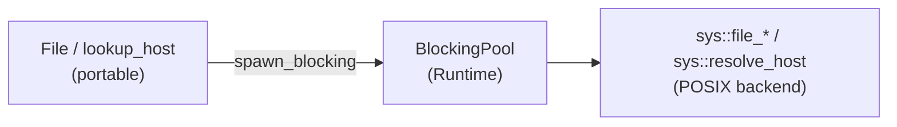
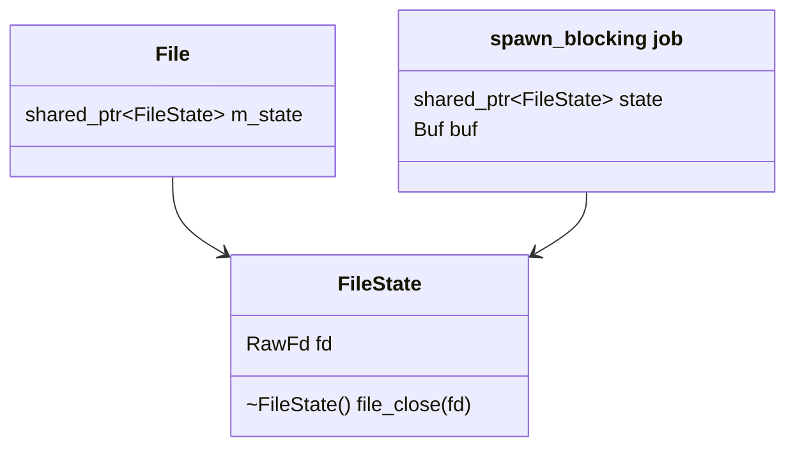

# File I/O and DNS

`File` (async regular files) and `lookup_host()` (name resolution). Neither has any
readiness to wait for: `epoll_ctl` rejects a regular file with `EPERM`, because a disk
read is always "ready" and then blocks, and `getaddrinfo` is a blocking library call.
So neither goes through the [I/O Driver](io_driver.md). Each operation runs as one job
on the Runtime's blocking pool ([`spawn_blocking`](spawn_blocking.md)), as tokio does
for `tokio::fs` and `lookup_host`.

Both are desktop only. On Pico, `TcpStream::connect` resolves names through lwIP
itself, and there is no `File`.

---

## Goals

- **Same owned-buffer API as sockets.** Every read and write takes a
  `ByteBuffer` by value and hands it back with the byte count.
- **One thread hop per operation.** The `_exact` variants loop inside one job instead of
  hopping per chunk.
- **No write-behind.** A write completes when its syscall has returned, so an error is
  reported by the call that caused it.
- **Safe to drop.** Dropping an operation's future, or the `File` itself, never closes
  the fd under a running syscall.
- **No driver needed.** Only `current_runtime()`'s blocking pool, so both work on a
  `CurrentThreadExecutor` with a caller-supplied `Parker`.

## Non-goals

- **Directory operations, metadata, `rename`, `remove`.** Use `spawn_blocking` around
  `std::filesystem` for now.
- **Cancelling a running syscall.** A dropped job runs to completion.

---

## Layers



The portable layer never makes a syscall itself. Everything goes through two backend
seams, in the style of the driver's [`sys` layer](io_driver.md#the-sys-layer):

| Seam | Functions | POSIX backend |
|---|---|---|
| `detail/sys/file.h` | `file_open`, `file_read`, `file_write`, `file_sync`, `file_close` | `src/detail/sys/file_posix.cpp` |
| `detail/sys/dns.h` | `resolve_host(host, port)`, `dns_category()` | `src/detail/sys/dns_posix.cpp` |

Unlike the socket seams, these are ordinary blocking calls. `EINTR` is retried inside
the backend. `file_read`/`file_write` take an `offset`: negative means the file position
(`read`/`write`), anything else is positional (`pread`/`pwrite`).

---

## `File`

```cpp
#include <coro/io/file.h>

auto file = co_await coro::File::open("data.bin", coro::FileMode::ReadWrite |
                                                   coro::FileMode::Create);

auto [written, out] = co_await file.write_exact(std::string("hello"));
co_await file.sync_all();

auto [n, buf] = co_await file.read_at(std::vector<std::byte>(4096), 0);
buf.resize(n);
```

| Method | Returns | Syscall |
|---|---|---|
| `static open(path, mode)` | `OpenFuture` = `BlockingHandle<File>` | `open`, close-on-exec, mode 0644 with `Create` |
| `read(buf)` / `write(buf)` | `IoFuture<Buf>` = `BlockingHandle<pair<size_t, Buf>>` | one `read` / `write` at the file position |
| `read_exact(buf)` / `write_exact(buf)` | `IoFuture<Buf>` | loops until `buf` is full / written, or EOF |
| `read_at(buf, off)` / `write_at(buf, off)` | `IoFuture<Buf>` | one `pread` / `pwrite` |
| `read_at_exact` / `write_at_exact` | `IoFuture<Buf>` | positional loops |
| `sync_all()` | `BlockingHandle<void>` | `fsync` |

`FileMode` flags (`Read`, `Write`, `ReadWrite`, `Create`, `Truncate`, `Append`) combine
with `|` and are translated to `sys::FileOpenFlags`, then to `O_*` flags by the backend.

Errors are `std::system_error` in `std::system_category()`, thrown at `co_await`. A
short read returns fewer bytes than `buf.size()`, and 0 means EOF. Any call on a
moved-from `File` throws `std::logic_error`.

### Ownership of the fd



`File` holds a `shared_ptr<detail::FileState>`, which owns the fd and closes it
synchronously in its destructor. Every job captures its own share. So the fd closes
when the `File` and every job started on it are gone, on whichever thread drops the last
share, and never while a syscall is running on it (the fd can't be reused under a read
either). Because the close is synchronous, reopening the same path right after dropping
a `File` sees every completed write.

### Eager operations

The futures are `BlockingHandle`s, not lazy futures: an operation starts when the method
is called, like a `JoinHandle`. `co_await` hides the difference. `File` returns its
handles already detached (`BlockingHandle::detach()`), so dropping one does not cancel
the job: it runs to completion and discards its result, buffer included. Without that, a
job dropped while still queued would be skipped, and whether a dropped `write()` reached
the file would depend on timing.
For `read()`/`write()` at the file position, that means the position still moves.

!!! note "NOTE: no write-behind, unlike `tokio::fs::File`"
    tokio's `File` buffers writes and reports their errors on a later call or on
    `flush()`. coro's `write()` completes only when the syscall has returned, so dropping
    a `File` never loses an error that was already reported as success. Completed writes
    have reached the kernel, not necessarily the disk: `sync_all()` is for that.

---

## `lookup_host`

```cpp
#include <coro/io/lookup_host.h>

std::vector<coro::SocketAddress> addrs = co_await coro::lookup_host("example.com", 443);
```

- **Numeric literals** (`"127.0.0.1"`, `"::1"`, `"fe80::1%3"`) are parsed by
  `SocketAddress::parse` and returned at once, without a pool hop.
- **Anything else** goes to `sys::resolve_host` on the blocking pool:
  `getaddrinfo(AF_UNSPEC, SOCK_STREAM)`, so `/etc/hosts`, nsswitch and search domains
  apply. Addresses come back in the resolver's preference order, each with `port`.
- **Errors** are `std::system_error`, thrown at `co_await`. A resolver failure is in
  `dns_error_category()` (category name `coro.dns`, `gai_strerror` messages; "no
  addresses" is `EAI_NONAME`). `EAI_SYSTEM` is reported as its `errno` in
  `std::system_category()`.
- **Dropping the future** doesn't cancel the lookup. It finishes on the pool and the
  result is discarded.

`TcpStream::connect`, `TcpListener::bind` and `UdpSocket::bind` take a host string and
resolve it with `lookup_host`. They try each address in order and rethrow the last
failure if all of them fail, as tokio does.

!!! tip "TODO: asynchronous resolver"
    `getaddrinfo` holds a pool thread for the whole lookup, up to the resolver's timeout.
    That is fine at connect-time rates. If a workload resolves many names concurrently,
    consider an asynchronous resolver (c-ares, or a minimal UDP DNS client on the driver)
    behind `sys/dns.h`.

---

## Races

- **Close vs. an in-flight job.** Each job holds a share of `FileState`, so the close in
  its destructor runs on whichever thread drops the last share: possibly a pool thread,
  after the user has dropped the `File` and every future.
- **Concurrent operations on one `File`.** Jobs may run in parallel on different pool
  threads. `read_at`/`write_at` (`pread`/`pwrite`) share no state and may overlap
  freely. Position-based `read`/`write` calls that overlap run in an unspecified order
  and interleave at the kernel's discretion: await one before starting the next if order
  matters. A `File` must not be moved or assigned while another task is calling it.
- **Dropped open.** If the `OpenFuture` is dropped before its job finishes, the `File`
  dies with the job's discarded result and closes its fd: no leak.
- **Runtime shutdown.** The Runtime cancels and drains its tasks and its blocking jobs
  together before it stops either, so no task is left awaiting a job that the pool
  abandons. See [runtime_shutdown.md](runtime_shutdown.md).

!!! tip "TODO: io_uring backend for files"
    `sys/file.h` is the seam for an io_uring backend (`IORING_OP_READ`/`WRITE`/`FSYNC`
    completions reaped by the driver), which would drop the pool hop per operation. The
    blocking pool would stay as the fallback where io_uring is unavailable or disabled
    (containers, older kernels).

---

## Tests

| Test | Checks |
|---|---|
| `FileTest.BasicOpenWriteReadClose`, `ReadEOF`, `PositionalIO`, `MultipleSequentialReads`, `MultipleConcurrentFiles` | Basic round trips, EOF, positional I/O, several files at once. |
| `FileTest.OpenNonExistentFileForWrite` | `Write` without `Create` on a missing path throws. |
| `FileTest.ExactVariantsRoundTripLargeBuffer` | 4 MiB `write_exact`/`read_exact` round trip; a read larger than the file stops short at EOF. |
| `FileTest.ReadAtExactAndWriteAtExact` | Positional exact variants, overlapping writes. |
| `FileTest.AppendWritesAtEnd` | `FileMode::Append`, plus `sync_all()`. |
| `FileTest.OpenMissingFileThrowsEnoent` | The error code is `no_such_file_or_directory`. |
| `FileTest.PendingWriteOutlivesFile` | Dropping the `File` with a write in flight: the write still lands. |
| `FileTest.ReopenAfterDropSeesWrites` | Close is synchronous. |
| `FileTest.MovedFromFileThrowsLogicError` | `write` and `sync_all` on a moved-from `File`. |
| `FileTest.WorksWithoutDriver` | `CurrentThreadExecutor` with a `PollingParker`. |
| `LookupHostTest.NumericLiteralsReturnThemselves` | IPv4 and IPv6 literals, port applied. |
| `LookupHostTest.LocalhostResolvesToLoopbackWithPort` | Every result is loopback with the port. |
| `LookupHostTest.UnresolvableNameThrowsDnsError` | `nonexistent.invalid` (RFC 6761) fails in `dns_error_category()`. |
| `LookupHostTest.WorksWithoutDriver` | As for `File`. |

---

## Files

| File | Contents |
|---|---|
| `include/coro/io/file.h`, `file.hpp`, `src/io/file.cpp` | `FileMode`, `detail::FileState`, `File` |
| `include/coro/io/lookup_host.h`, `src/io/lookup_host.cpp` | `lookup_host()`, `dns_error_category()` |
| `include/coro/detail/sys/file.h`, `src/detail/sys/file_posix.cpp` | File backend seam |
| `include/coro/detail/sys/dns.h`, `src/detail/sys/dns_posix.cpp` | Resolver backend seam |
| `test/io/test_file.cpp`, `test/io/test_lookup_host.cpp` | Tests |

`file.h`, `file.hpp` and `lookup_host.h` are excluded from the Pico install.
