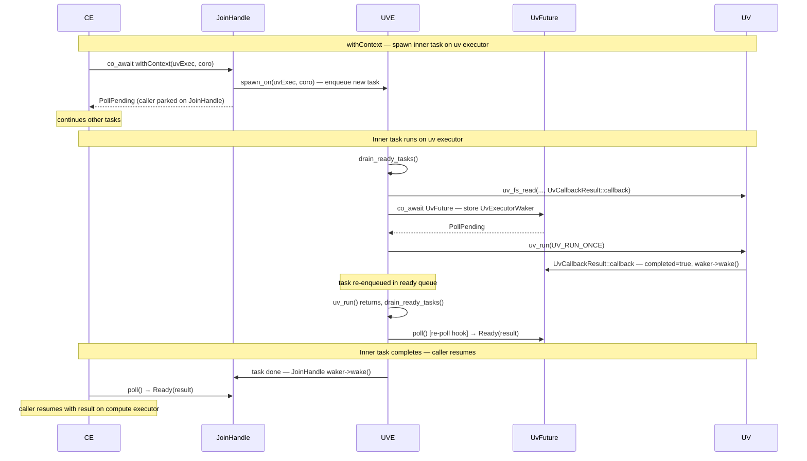

# IoCoroutine — Coroutine-Native I/O Thread Dispatch

Design for replacing the `IoRequest` polymorphic command pattern with coroutine-native
primitives that run directly on the libuv I/O thread.

---

## Motivation

The current `IoRequest` pattern works but involves significant boilerplate. Every
new libuv operation requires:

1. A concrete `IoRequest` subclass with captured state members
2. An `execute()` implementation that calls the uv API and parks a `shared_ptr`
   (or heap-allocated pointer) in `req.data` so the callback can recover state
3. A callback function that extracts the state, stores results, and calls `waker->wake()`

Looking at `File` alone: `OpenRequest`, `ReadRequest`, `WriteRequest`, `CloseRequest`,
`CancelRequest` — five structs plus five callbacks, each doing roughly the same thing.
`PollStream` adds `EnsurePollingRequest` and `CloseRequest` on top.

The core observation: an `IoRequest` is just a resumable unit of work. That is exactly
what a coroutine is. The coroutine handle *is* the closure; `handle.resume()` *is*
`execute()`. With the right primitives, new I/O operations require no new types at all.

---

## Proposed Design

The design rests on three components:

- **`SingleThreadedUvExecutor`** — a full-featured executor that integrates the libuv
  event loop into its scheduling loop, replacing `IoService` entirely.
- **`withContext(executor, coro)`** — runs a coroutine on a specific executor and
  `co_await`s the result, analogous to Kotlin's `withContext(dispatcher)`.
- **`UvCallbackResult<Args...>` / `UvFuture<Args...>`** — a pair for bridging one-shot
  libuv callbacks into the `Future` machinery.

`spawn_on(Executor&, Coro<T>)` is a small new primitive — analogous to the existing
`spawn()` but targeting a specific executor — that the above are built on.

---

### `withContext` — executor-scoped execution

```cpp
template<typename T>
[[nodiscard]] Coro<T> withContext(Executor& exec, Coro<T> coro) {
    co_return co_await spawn_on(exec, std::move(coro)).join();
}
```

`withContext` spawns the inner coroutine as a new independent task on `exec` and parks
the caller on the resulting `JoinHandle` until it completes. The calling task stays on
its original executor throughout — nothing migrates.

**Reference captures are safe.** The caller is synchronously suspended for the entire
duration of the inner coroutine, so the inner coroutine can capture locals by reference.
This is the same guarantee that structured concurrency provides via `JoinSet::drain()`.

**Exception safety is free.** Exceptions thrown inside the inner coroutine propagate
through `JoinHandle::join()` to the caller via the existing exception delivery mechanism.
No special handling is needed.

**Exception safety constraint.** If an exception is thrown inside a `withContext`
block between a uv call and its `co_await UvFuture`, the frame unwinds and the request
struct is freed while the callback is still in-flight — a use-after-free identical to
the cancellation problem, with no recovery path. For now, uv-facing coroutines are
assumed not to throw in that window; this is easy to enforce by inspection for internal
code. A `noexcept` coroutine type whose `unhandled_exception()` calls `std::terminate()`
will make this statically impossible and is planned as a future addition.

**No task migration, no scheduler races.** The calling task parks on `JoinHandle` using
the normal single-executor `Idle → Notified` path. The inner task is a completely
independent task on the uv executor with its own `SchedulingState`. When it completes,
the `JoinHandle` wakes the caller. The two tasks never share a `SchedulingState` or
compete on any CAS transition.



---

### `UvCallbackResult` and `UvFuture` — one pair per uv callback signature

uv callbacks vary in signature: `uv_fs_t` callbacks take only the request pointer,
`uv_poll_t` callbacks take `(handle, status, events)`, and so on. The variation is
captured as a template parameter pack split across two types.

The split is necessary because a `Future` going through `await_transform` may be moved
or wrapped, which would invalidate a raw pointer stored in `handle->data` before the uv
callback fires. **`UvCallbackResult`** is the stable anchor pinned on the coroutine
frame; **`UvFuture`** is the moveable `Future` that holds a pointer to it.

```cpp
// Pinned on the coroutine frame — never moved.
// handle->data points here; callback writes results and calls resume() through it.
template<typename... CallbackArgs>
struct UvCallbackResult {
    std::tuple<CallbackArgs...>    result;
    std::shared_ptr<detail::Waker> waker;
    bool                           completed = false;

    template<typename HandleT>
    static void callback(HandleT* h, CallbackArgs... args) {
        auto* self = static_cast<UvCallbackResult*>(h->data);
        self->result    = std::make_tuple(args...);
        self->completed = true;
        self->waker->wake(); // UvExecutorWaker: enqueues task into uv executor ready queue
    }
};

// The Future — safe to move or wrap by await_transform.
// Holds a non-owning pointer to the pinned UvCallbackResult.
template<typename... CallbackArgs>
struct UvFuture {
    UvCallbackResult<CallbackArgs...>* ctx;

    PollResult<std::tuple<CallbackArgs...>> poll(detail::Context& c) {
        if (!ctx->completed) {
            ctx->waker = c.getWaker();
            return PollPending;
        }
        return std::move(ctx->result);
    }
};
```

`UvCallbackResult<>` (empty pack) is the degenerate case for all `uv_fs_t` operations —
results live in `req->result`, so no args need to be captured. A single
`UvCallbackResult<>::callback<uv_fs_t>` is shared by every file operation.

`current_io_loop()` returns the thread-local `uv_loop_t*` set at uv executor startup.
`current_uv_executor()` returns the thread-local `SingleThreadedUvExecutor*` set by
`Runtime` at startup — the same pattern as `current_io_service()` today.

### Cancellation

When a `JoinHandle` is dropped, the library cancels the associated task and polls it
with a cancellation signal. The `Future` contract requires that a future drain cleanly
to completion even when cancelled — it must not return `PollPending` indefinitely.

For `UvFuture` this means: on a cancellation poll, issue the uv cancel operation, keep
awaiting the callback (which fires with `UV_ECANCELED`), then return `PollCancelled`.
The frame stays alive through teardown because `UvFuture` keeps returning `PollPending`
until the callback fires. No separate cancellation token mechanism is needed — this
integrates directly with the existing `JoinHandle` cancellation protocol.

The only addition `UvFuture` needs is an optional cancel function, since the libuv
request struct (e.g. `uv_fs_t`) lives on the coroutine frame rather than inside
`UvFuture`. Using a template parameter rather than `std::function` keeps the type
zero-cost when cancellation is not needed:

```cpp
template<typename CancelFn = std::nullptr_t, typename... CallbackArgs>
struct UvFuture {
    UvCallbackResult<CallbackArgs...>*  ctx;
    [[no_unique_address]] CancelFn      cancel_fn = {};
    bool                                cancel_issued = false;

    PollResult<std::tuple<CallbackArgs...>> poll(detail::Context& c) {
        if (ctx->completed) {
            if (cancel_issued) return PollCancelled;
            return std::move(ctx->result);
        }

        if (c.is_cancellation_requested() && !cancel_issued) {
            cancel_issued = true;
            if constexpr (!std::is_same_v<CancelFn, std::nullptr_t>)
                cancel_fn();
            // Do not return — must keep awaiting the callback.
        }

        ctx->waker = c.getWaker();
        return PollPending;
    }
};
```

CTAD deduces `CancelFn` from the constructor argument. Call sites pass the cancel
lambda inline — the lambda captures the request by reference, which is safe since the
frame is alive for the duration:

```cpp
uv_fs_read(current_io_loop(), &req, fd, &desc, 1, offset,
           UvCallbackResult<>::callback<uv_fs_t>);

// Without cancellation — CancelFn deduced as std::nullptr_t, zero overhead:
co_await UvFuture{&ctx};

// With cancellation — CancelFn deduced from lambda type:
co_await UvFuture{&ctx, [&]{ uv_fs_cancel(&req); }};
```

For operations with no cancellation support (timers, `uv_poll_t` events) `cancel_fn`
stays null and the future drains normally when cancelled — the callback fires eventually
and `PollCancelled` is returned.

`PollStream` is not affected: its driver coroutine owns its own lifecycle via
`CloseEvent` and handles uv teardown before the frame is released.

---

## Runtime Architecture

`SingleThreadedUvExecutor` is a full-featured executor that integrates the libuv
event loop into its scheduling loop. It satisfies the same `Executor` concept as
`SingleThreadedExecutor` and the multi-threaded executors and can be used directly
with `Runtime`. It **replaces `IoService`** entirely.

### Executor modes

| Runtime mode | Setup | Notes |
|---|---|---|
| Truly single-threaded | `SingleThreadedUvExecutor` alone | One thread drives both tasks and uv; `withContext` is a no-op hop to the same executor |
| Two-thread (existing default) | `SingleThreadedExecutor` + `SingleThreadedUvExecutor` | Compute thread + uv thread; `withContext` spawns on the uv executor |
| Multi-threaded | `WorkStealingExecutor` + `SingleThreadedUvExecutor` | N worker threads + 1 uv thread; same `withContext` mechanism |

When `SingleThreadedUvExecutor` is used as the sole executor, `withContext` spawns a
task on the same executor — the cooperative event loop handles suspend and resume without
any thread hop. `UvFuture` works identically in all modes.

### `IoRequest` is deprecated

With `SingleThreadedUvExecutor` as a proper executor, `IoService::submit(unique_ptr<IoRequest>)`
has no equivalent. Submitting work to the uv thread is just scheduling a task via
`withContext` or `spawn_on`.

During migration, existing `IoRequest`-based operations (`File`, `PollStream`,
`TcpStream`, `WsStream`) can be wrapped as fire-and-forget tasks on
`SingleThreadedUvExecutor` until each is ported to the coroutine-native approach.

### `SingleThreadedExecutor` naming note

`SingleThreadedExecutor` becomes a two-thread design once paired with a
`SingleThreadedUvExecutor`. This naming inconsistency will be addressed with a rename
in the near future. Users who need a genuinely single-threaded runtime should use
`SingleThreadedUvExecutor` directly.

### Future direction: shared uv driver (not for v1)

In Tokio's multi-thread runtime there is no dedicated I/O thread. Instead, when a
worker thread runs out of tasks it temporarily acquires a mutex on the shared `mio`
I/O driver, calls `mio::poll()`, fires any ready wakers, and returns to work-stealing.
The driver role rotates among idle workers.

An analogous design for coro would let idle `WorkStealingExecutor` threads take turns
driving the uv loop rather than having a dedicated uv thread.

**This is not being pursued in v1 for two reasons:**

1. **libuv thread-safety is unverified for this pattern.** `mio` is designed for
   concurrent access; libuv explicitly documents that its loop and handles are not
   thread-safe and must be driven from one thread.

2. **Significantly higher complexity.** `withContext` would need to mean "acquire the
   driver role" rather than "spawn on a fixed executor". The `SingleThreadedUvExecutor`
   thread is a clean, conservative first implementation.

---

## `SingleThreadedUvExecutor` cooperative event loop

All libuv API calls must be made from the thread that owns the `uv_loop_t`. Once a task
is running on `SingleThreadedUvExecutor` via `withContext`, it still needs a way to
suspend, wait for a callback, and resume — without direct `handle.resume()` calls that
would bypass the `FutureAwaitable` re-poll machinery.

The solution is a **cooperative two-phase event loop**:

```
loop:
  drain_ready_tasks()       // poll all tasks in the ready queue
  uv_run(UV_RUN_ONCE)       // process I/O events; blocks if queue empty
```

`UV_RUN_ONCE` processes all currently-ready libuv callbacks and then returns. If no
callbacks are pending it blocks until at least one event arrives (or `uv_async_send`
wakes it). This prevents busy-waiting when the system is idle.

### `UvExecutorWaker`

A `UvExecutorWaker` enqueues a task back into the `SingleThreadedUvExecutor`'s ready
queue. When the uv callback calls `waker->wake()`, the task goes into the queue; after
`uv_run()` returns, `drain_ready_tasks()` picks it up and calls `task->poll(uv_ctx)`
through the normal `Coro<T>::poll()` machinery. The `FutureAwaitable` re-poll hook
fires as usual, `UvFuture::poll()` sees `completed == true` and returns `Ready`.
**`UvFuture` stays a plain `Future` with no changes to the promise type or
`await_transform`.**

Callbacks fire *during* `uv_run()` — already on the uv thread — so `wake()` does not
need `uv_async_send()`. The task is drained on the very next loop iteration.

Cross-thread wakeups (e.g. `JoinHandle` completing on the uv thread waking a task on
the compute executor) still use the existing `uv_async_send()` mechanism.

### Analogy: Rust/Tokio and Node.js

This is the same pattern used by Tokio's `current_thread` runtime and Node.js:

- **Tokio `current_thread`**: integrates the `mio` reactor as its "park" mechanism.
  Each turn drains the ready task queue, then parks into `mio` to wait for I/O.
- **Node.js**: alternates between the microtask/callback queue and `uv_run()`.
  Structurally identical.

The key invariant: **`wake()` enqueues; the runtime calls `poll()`.** This keeps all
`FutureAwaitable` re-poll-hook machinery valid.

---

## Examples

### One-shot operation: file read

Today a read requires `ReadRequest`, `ReadState`, `ReadFuture::poll()`, and `read_cb`.
Under this design:

```cpp
Coro<std::size_t> async_read(uv_file fd, std::span<std::byte> buf, int64_t offset) {
    co_return co_await withContext(current_uv_executor(),
        co_invoke([&]() -> Coro<std::size_t> {
            uv_fs_t req;
            uv_buf_t desc = uv_buf_init(reinterpret_cast<char*>(buf.data()), buf.size());

            UvCallbackResult<> ctx;
            req.data = &ctx;
            uv_fs_read(current_io_loop(), &req, fd, &desc, 1, offset,
                       UvCallbackResult<>::callback<uv_fs_t>);
            co_await UvFuture<>{&ctx};

            ssize_t result = req.result;
            uv_fs_req_cleanup(&req);
            co_return static_cast<std::size_t>(result);
        })
    );
}
```

`ReadState`, `ReadRequest`, `read_cb`, and the `complete`/`waker` atomics all
disappear. The coroutine frame holds all locals that `ReadState` used to hold.
`buf` and `offset` are captured by reference safely — the caller is suspended for
the duration.

### Repeated callbacks: `uv_poll_t` (simple case)

`uv_poll_t` fires its callback repeatedly without re-arming. `uv_poll_start` is called
**once** before the loop; only `handle->data` is updated each iteration to point to the
current `UvCallbackResult` anchor:

```cpp
uv_poll_start(&handle, UV_READABLE, poll_signal_cb);  // arm once

while (!closing) {
    UvCallbackResult<int,int> result;   // stack-allocated each iteration
    handle.data = &result;              // update anchor — callback writes here
    auto [status, events] = co_await UvFuture<int,int>{&result};

    // Phase 1 read + Phase 2 decode
    process_event(status, events);
}

uv_poll_stop(&handle);
```

`poll_signal_cb` is a thin forwarder: stores `{status, events}` in the
`UvCallbackResult` and calls the driver waker. All read and decode logic lives in the
coroutine body. This pattern works for the simple single-producer, single-consumer case
with no backpressure. `PollStream` requires more (see below).

---

### `PollStream` redesign — performance-critical hot path

`PollStream` is motivated by hardware devices (e.g. PCIe DMA) where the fd-backed
buffer *must* be drained as fast as possible or a hardware fault occurs. This makes
`PollStream` different from ordinary repeated-callback use cases: any extra scheduling
latency on the hot path is unacceptable.

The `PollEventFuture` approach — where the driver coroutine suspends and resumes on each
poll event — adds a scheduler round-trip between the callback firing and the read
executing:

```
poll_cb fires → set flag, wake() → task enqueued → drain_ready_tasks() → driver resumes → read
```

For `PollStream` this overhead is not acceptable. Instead, `poll_cb` does the read and
decode work **directly in the callback**, synchronously on the uv thread, exactly as it
does today. The driver coroutine's only job is setup and teardown.

#### Architecture

```
poll_cb (fires synchronously on uv thread — no scheduler round-trip)
  ├── Phase 1: greedy read from fd  ← latency-critical, runs immediately on callback
  ├── Phase 2: greedy decode + push to packet_buffer
  └── wakes consumer_waker if packets were produced

Driver coroutine (SingleThreadedUvExecutor) — thin lifecycle wrapper only
  ├── uv_poll_init + uv_poll_start  (setup)
  ├── co_await CloseEvent{state}    (parks until PollStream::close() signals)
  └── uv_poll_stop + uv_close       (teardown)

PollStream::poll_next() (compute executor) — unchanged
  └── pops from state->packet_buffer
```

The mutex-protected `packet_buffer` in `State` is the channel. Its semantics —
including the two backpressure modes — are unchanged. `poll_cb` is unchanged.

The driver coroutine is spawned via `spawn_on(uv_executor, poll_driver(state))` when
`PollStream::open()` is called — it does not use `withContext` because it is a
long-running independent task, not a scoped operation with a return value.

#### Driver coroutine

```cpp
// Spawned on SingleThreadedUvExecutor when PollStream::open() is called.
Coro<void> poll_driver(std::shared_ptr<State> state) {
    uv_poll_init(current_io_loop(), &state->poll_handle, state->fd);
    uv_poll_start(&state->poll_handle, UV_READABLE, poll_cb);  // poll_cb unchanged

    co_await CloseEvent{state};   // parks until PollStream::close() signals

    uv_poll_stop(&state->poll_handle);
    // uv_close with shared_ptr<State>-in-handle->data trick — same as CloseRequest today
}
```

#### `CloseEvent`

`CloseEvent` is a lightweight manual future — distinct from `UvFuture` (which wraps
libuv callbacks) since this is an inter-task signal:

```cpp
struct CloseEvent {
    std::shared_ptr<State> state;

    PollResult<void> poll(detail::Context& ctx) {
        std::lock_guard lock(state->mutex);
        if (state->closing) return PollReady{};
        state->close_waker = ctx.getWaker();
        return PollPending;
    }
};
```

`PollStream::close()` sets `state->closing = true` and wakes the driver if it is
already parked. Because `UvExecutorWaker::wake()` uses `uv_async_send`, the
cross-thread call from the compute executor is safe. The `closing` flag in
`CloseEvent::poll()` handles the case where `close()` fires before the driver's first
poll — the driver sees `closing == true` on its first poll and returns `PollReady`
immediately without storing a waker. `close()` must null-check before calling `wake()`:

```cpp
void PollStream::close() {
    std::shared_ptr<detail::Waker> w;
    {
        std::lock_guard lock(state->mutex);
        if (std::exchange(state->closing, true)) return; // idempotent
        w = std::exchange(state->close_waker, nullptr);
    }
    if (w) w->wake();
}
```

#### What disappears

- `EnsurePollingRequest` — replaced by driver coroutine startup.
- `CloseRequest` — replaced by driver coroutine teardown after `CloseEvent` fires.
- No changes to `poll_cb`, `State`, `packet_buffer`, `byte_buffer`, decoder, or
  backpressure modes.

#### State field migration

With the driver owning the handle's lifecycle, two fields move out of the shared `State`
and into the driver's coroutine frame:

| Field | Current | Redesign |
|---|---|---|
| `uv_poll_t poll_handle` | `State` (shared) | Driver frame — stable address, no longer needs `shared_ptr` for stability |
| `initialized` flag | `State` | Driver frame — `uv_poll_init` called unconditionally on entry |

`byte_buffer` could also move to the driver frame since `poll_next()` never touches it,
but this is a separate refactor.

---

### Repeated callbacks: coroutine-native approach (`PollEventFuture`)

For repeated uv callbacks where the hot-path latency requirement of `PollStream` does
not apply — timers, low-frequency status events, WebSocket frames — the coroutine-native
approach is cleaner: a driver coroutine loops on `co_await PollEventFuture`, doing the
work in the coroutine body rather than in the callback itself. Both approaches are valid
and can coexist in the library; the choice is driven by latency requirements.

`PollEventFuture` is a domain-specific future (not a generic `UvFuture`) because it
must manage `uv_poll_t` arming/disarming and coordinate backpressure with a consumer:

```cpp
struct PollEventFuture {
    std::shared_ptr<State> state;

    PollResult<void> poll(detail::Context& ctx) {
        std::lock_guard lock(state->mutex);

        if (state->closing) return PollReady{};

        // Block mode: park if consumer buffer is full.
        if (state->backpressure_mode == BackpressureMode::Block &&
            state->packet_buffer.full()) {
            uv_poll_stop(&state->poll_handle);
            state->polling = false;
            state->driver_waker = ctx.getWaker();
            return PollPending;
        }

        // (Re-)arm if not running.
        if (!state->polling) {
            uv_poll_start(&state->poll_handle, UV_READABLE, poll_signal_cb);
            state->polling = true;
        }

        // Park until poll_signal_cb fires.
        if (!state->callback_fired) {
            state->driver_waker = ctx.getWaker();
            return PollPending;
        }

        state->callback_fired = false;
        return PollReady{};
    }
};
```

The driver loop reads/decodes after each resume:

```cpp
Coro<void> poll_driver(std::shared_ptr<State> state) {
    uv_poll_init(current_io_loop(), &state->poll_handle, state->fd);

    while (!state->closing) {
        co_await PollEventFuture{state};
        // Phase 1 read + Phase 2 decode in coroutine body
    }
    // teardown
}
```

`poll_signal_cb` sets `state->callback_fired = true` and calls
`state->driver_waker->wake()` — no read or decode logic in the callback itself.

The scheduling round-trip (`poll_signal_cb` → wake → enqueue → `drain_ready_tasks()` →
resume → read) is acceptable for low-frequency events but rules this approach out for
`PollStream`'s DMA-drain use case.

---

## `uv_close` remains awkward

`uv_close` fires its callback *after* the handle memory may logically be gone. The
close path still needs the same `new shared_ptr<State>` trick in `handle->data` that
`CloseRequest::execute()` uses today. This is a property of `uv_close` being async —
not a property of the request model — and is unchanged by this design.

---

## Comparison

| | `IoRequest` (today) | Proposed |
|---|---|---|
| New operation cost | New struct + `execute()` + callback | `UvFuture<Args...>` inline in `withContext` block; no new types |
| Per-operation allocation | `unique_ptr<XxxRequest>` + `shared_ptr<XxxState>` | Coroutine frame only (+ `JoinHandle` for `withContext`) |
| Shared state lifetime | `shared_ptr` + waker atomic + complete atomic | Locals in coroutine frame; captures by reference to caller frame |
| Thread hop | `IoService::submit(unique_ptr<IoRequest>)` | `co_await withContext(uvExec, co_invoke([&]{...}))` |
| Cross-thread wakeup | `waker->wake()` in callback | `waker->wake()` in callback (`UvExecutorWaker` enqueues task; uv loop re-polls) |
| `uv_poll_t` (repeated, latency-critical) | State machine in `State` struct; `poll_cb` does read+decode | `poll_cb` unchanged; thin driver coroutine for lifecycle only |
| `uv_poll_t` (repeated, non-critical) | State machine in `State` struct | `PollEventFuture` loop; read+decode in coroutine body |
| `uv_close` safety | `new shared_ptr` in `handle->data` | Same — unchanged |
| Cancellation | `cancelled` atomic + `CancelRequest` | `cancel_fn` lambda in `UvFuture`; integrates with `JoinHandle` cancellation protocol |

---

## Status

Design complete — implementation in progress.

### Transition strategy

`SingleThreadedUvExecutor` replaces `IoService` entirely from day one. It retains
`submit(unique_ptr<IoRequest>)` as a deprecated method so all existing
`IoRequest`-based operations (`File`, `PollStream`, `TcpStream`, `WsStream`) continue
working without changes. The cooperative event loop gains one extra drain step:

```
loop:
  drain_ready_tasks()       // coroutine tasks
  drain_io_request_queue()  // legacy IoRequest submissions (deprecated)
  uv_run(UV_RUN_ONCE)
```

This avoids any period of parallel infrastructure — there is always exactly one uv loop.
Operations are migrated to the coroutine-native approach incrementally; once all uses of
`submit()` are removed, the method and `IoRequest` are deleted.

### Implementation order

1. `SingleThreadedUvExecutor` — morph from `IoService`; add coroutine task queue and
   `Executor` interface; keep `submit(IoRequest)` as deprecated; update `Runtime` to
   use it in place of `IoService`
2. `spawn_on(Executor&, Coro<T>)` and `withContext` — new scheduling primitives
3. `UvCallbackResult`, `UvFuture`, `UvExecutorWaker` — uv callback bridge
4. Port `File::read` as proof of concept — first operation migrated off `IoRequest`
5. Port `PollStream` driver coroutine + `CloseEvent`
6. Migrate remaining operations (`File` write/open/close, `TcpStream`, `WsStream`)
   incrementally; remove `submit()` and `IoRequest` when complete
