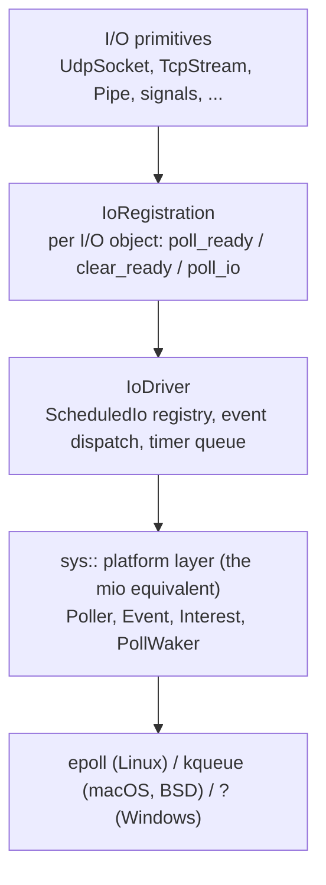
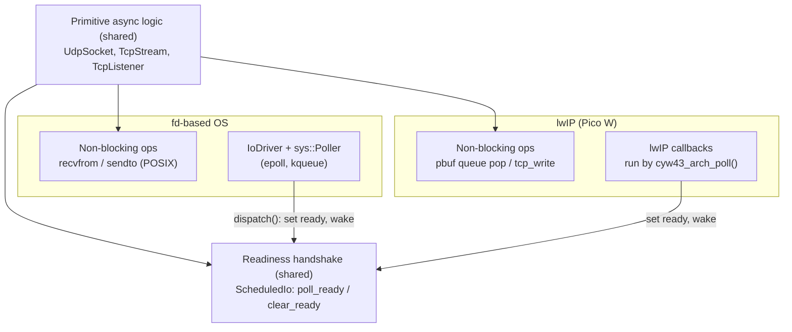
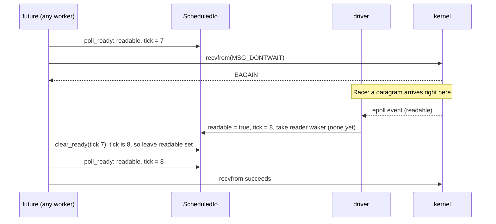
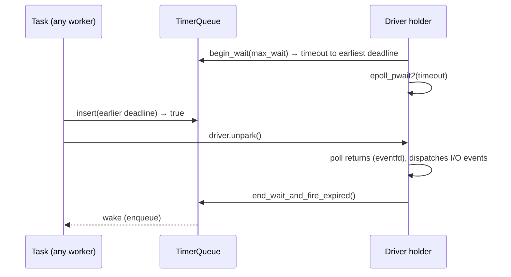

# I/O Driver (epoll reactor)

`IoDriver` is coro's readiness-based I/O reactor. It owns the OS readiness queue (epoll on
Linux) and the runtime's timer queue, and wakes the futures waiting on either. It has no
thread of its own: executor threads turn it when they run out of work, so an I/O wake
reaches its task without a cross-thread hop.

This document covers the driver itself: the platform layer under it, the readiness
handshake a primitive uses, registration lifetime, how executors turn it, and its timer
queue. Each I/O primitive built on it has its own document (see
[Primitives on the driver](#primitives-on-the-driver)).

| Piece | Where | Tests |
|---|---|---|
| `sys::Poller`, `sys::PollWaker`, `Interest`, `Event` (epoll) | `include/coro/detail/sys/poller.h`, `src/detail/sys/poller_epoll.cpp` | `test/detail/test_poller.cpp` |
| `IoDriver`, `ScheduledIo`, `IoRegistration`, `IoDriverParker` | `include/coro/runtime/io_driver.h`, `src/runtime/io_driver.cpp` | `test/runtime/test_io_driver.cpp` |
| `Parker`, `PollingParker` | `include/coro/runtime/parker.h` | `test/runtime/test_current_thread_executor.cpp` |
| `Clock`, `Instant` | `include/coro/runtime/clock.h` | |
| `detail::TimerQueue`, `detail::TimerSlot` | `include/coro/detail/timer_queue.h`, `src/detail/timer_queue.cpp` | `test/detail/test_timer_queue.cpp` |

---

## Why a readiness driver

The driver follows tokio and mio: a pending I/O future stores its waker and returns
`PollPending`, and whichever thread turns the driver wakes it when the kernel reports the
fd ready. The alternative, a dedicated I/O thread that owns every socket and runs
completion callbacks, makes every slow-path operation a round trip through that thread:
a task allocation, a queue push, a wake of the I/O thread, and a second wake back to the
waiting worker. It also lends the caller's buffer to the I/O thread for as long as the
operation is armed, which makes dropping a pending future unsafe.

The readiness model avoids both:

- **No hop.** The future's own thread makes the non-blocking syscall. Only a wait goes
  through the driver, and the wake runs on whichever executor thread is turning it.
- **Safe cancellation.** A pending future holds no kernel state, only a waker in its
  registration. Dropping it clears nothing the kernel knows about, and no buffer is ever
  lent across a suspension.
- **Any syscall.** The driver reports only readiness, so a primitive can use whatever call
  it needs once the fd is ready (`recvmsg()` with control messages, `sendmmsg()`,
  `accept4()`), with no wrapper API in between.
- **Precise timers.** The driver blocks in `epoll_pwait2()`, whose timeout is in
  nanoseconds, so the timer queue's earliest deadline bounds the wait directly.

## Goals

- Any thread can wait on an fd without a thread hop.
- Dropping an I/O future is always safe.
- Readiness waits are first-class, so any non-blocking syscall can be wrapped.
- Timers with sub-millisecond resolution.
- One small, explicit platform boundary, so adding an OS means implementing that boundary
  and nothing else. See [Porting to a new platform](#porting-to-a-new-platform).

## Non-goals

- **io_uring.** It is ruled out because of its security track record (many distributions
  and container runtimes disable it) and its uneven availability across Linux platforms.
- **A completion (proactor) model, and resuming tasks inline from the driver.** Wakes go
  through the executor. The same-thread queue round trip is cheap, and it avoids
  re-entrancy hazards.
- **A dedicated driver thread.** See [Who turns the driver](#who-turns-the-driver).

---

## Layering

Primitives never touch the OS readiness API directly; they go through an
`IoRegistration`. Only `sys::Poller` and its companions are platform-specific.



| Layer | Portable? | Responsibility |
|---|---|---|
| `sys::Poller` and `sys::PollWaker` | **No.** One implementation per OS. | Register, re-register and deregister an fd with an interest set; wait for events with a timeout; wake a blocked wait from another thread. |
| `IoDriver` | Yes | Own the `Poller`, map each event to its `ScheduledIo`, update readiness, fire wakers; own the timer queue. |
| `IoRegistration` | Yes | The readiness handshake a future uses: wait until ready, attempt the syscall, clear readiness on `EAGAIN`. |
| Primitives | Mostly | Non-blocking syscalls behind a per-primitive backend seam (`detail/sys/udp.h`, `tcp.h`, ...), plus the `IoRegistration` handshake. |

### The `sys` layer

`include/coro/detail/sys/poller.h` is coro's internal equivalent of mio: only what the
driver needs.

```cpp
namespace coro::detail::sys {

using RawFd = int;  // SOCKET on Windows, if that platform is ever added

bool would_block(int err) noexcept;  // EAGAIN or EWOULDBLOCK

struct Interest { bool readable = false; bool writable = false; /* read(), write(), read_write() */ };

struct Event {
    void* key;       // the ScheduledIo* the fd was registered with
    bool  readable;
    bool  writable;
    bool  error;     // EPOLLERR: waiters in both directions retry and see the error
    bool  hup;       // EPOLLHUP / EPOLLRDHUP
};

class Poller {
public:
    void register_fd(RawFd fd, void* key, Interest interest);    // thread-safe
    void reregister_fd(RawFd fd, void* key, Interest interest);  // thread-safe
    bool deregister_fd(RawFd fd) noexcept;                       // thread-safe
    /// Waits up to timeout (nullopt = forever) and appends events to out.
    void poll(std::vector<Event>& out, std::optional<std::chrono::nanoseconds> timeout);
};

/// Wakes a thread blocked in Poller::poll(). An eventfd on Linux, EVFILT_USER on kqueue.
class PollWaker {
public:
    PollWaker(Poller& poller, void* key);
    void wake() noexcept;   // thread-safe; a wake with nobody polling is kept
    void reset() noexcept;  // the polling thread consumes pending wakes
};

} // namespace coro::detail::sys
```

Socket creation and the per-protocol non-blocking operations live in their own seam
headers next to it (`socket.h`, `udp.h`, `tcp.h`, `pipe.h`, `signal.h`, `file.h`,
`dns.h`), each documented with the primitive that uses it.

Semantics every backend must provide:

- **Edge-triggered delivery.** An event is only guaranteed when readiness changes, so a
  consumer may only wait after it has seen `EAGAIN`. This is the strictest contract, and
  the handshake below follows it. A level-triggered backend still works under it; it just
  reports extra events.
- **Thread-safe registration.** Any thread may register or deregister while another
  thread is blocked in `poll()`. `epoll_ctl` and `kevent` both allow this.
- **High-resolution timeout.** `poll()`'s timeout is in nanoseconds. On Linux this is
  `epoll_pwait2()` (5.11 and later), falling back to `epoll_wait()` with the timeout
  rounded up to whole milliseconds when the kernel lacks it. kqueue takes a `timespec`
  natively. Timer precision is the backend's job, not the timer queue's.

!!! tip "TODO: prove the boundary with a second backend"
    A kqueue backend is small (a few hundred lines), and writing it is the cheapest way to
    catch Linux-isms leaking through `sys`.

---

## Porting to a new platform

A port supplies two things, and the rest of the stack is shared:

1. **A readiness source.** Something has to mark a `ScheduledIo` readable or writable and
   fire its waker.
2. **The non-blocking operations** each primitive is built on: "try to receive now",
   "try to send now", and so on. Each one either completes or reports *would block*.

Everything above those two is the same on every platform: the `IoRegistration`
handshake; each primitive's futures, buffer ownership, cancellation and error mapping;
the executors and the `Parker` protocol; and the public API.

How much a port has to write depends on what kind of platform it is:

| Platform kind | Readiness source | Non-blocking ops | Shared unchanged |
|---|---|---|---|
| **fd-based OS** (Linux epoll, macOS/BSD kqueue) | A new `sys::Poller`/`PollWaker`. `IoDriver` itself is reused. | Reused: `recvfrom`, `sendto` and friends are POSIX. Only OS-specific options (GSO, GRO) differ, behind `#ifdef`. | `IoDriver`, `IoRegistration`, primitives, executors |
| **Callback network stack** (lwIP raw API on Pico W) | The stack's own callbacks (`udp_recv`, `tcp_recv`, `tcp_sent`, `tcp_accept`, `tcp_err`) set readiness directly, playing `IoDriver::dispatch()`'s role, so neither a `Poller` nor `IoDriver::turn()` is involved. `PollingParker` around `cyw43_arch_poll()` runs those callbacks. | New: pop a queued pbuf (receive), `udp_sendto`/`tcp_write` with `ERR_MEM` mapped to *would block* (send). | The handshake, primitives' async logic, executors |



This works because readiness is a property of the `ScheduledIo`, not of epoll. Only
`dispatch()` knows where an event came from.

!!! note "NOTE: the Pico lwIP primitives are not on the shared seam yet"
    The lwIP `UdpSocket`, `TcpStream` and `TcpListener` are still separate
    implementations with their own async logic. Moving them onto the shared readiness
    core is described in [Raspberry Pi Pico Port](pico_port.md).

!!! warning "WARNING: keep the shared layers free of fds and syscalls"
    A port stays this small only if:

    - the readiness handshake doesn't assume an fd or an `IoDriver`;
    - each primitive's async logic calls its non-blocking operations through one narrow
      backend seam, never `::recvfrom()` inline.

---

## `ScheduledIo` and the readiness handshake

Each registered I/O object has one `ScheduledIo`. Its `IoRegistration` holds it, and the
kernel holds its address as the event key:

```cpp
class ScheduledIo {
    std::mutex   m_mutex;
    bool         m_readable = true;   // GUARDED BY m_mutex. Starts true, so the first
    bool         m_writable = true;   //   attempt is a plain syscall.
    uint64_t     m_tick     = 0;      // GUARDED BY m_mutex. Bumped on every driver event.
    Weak<Waker>  m_reader;            // GUARDED BY m_mutex
    Weak<Waker>  m_writer;            // GUARDED BY m_mutex
};
```

- **One waker slot per direction.** A primitive allows one receive and one send in flight
  at a time; a concurrent receive and send are fine.
- **Weak wakers.** The task owns the future, which owns the registration, so a strong
  waker here would be a reference cycle. A waker whose task is gone is skipped.
- **A plain mutex.** It is uncontended on the hot path. See
  [Future improvements](#future-improvements) for tokio's lock-free alternative.

The handshake prevents lost wakeups by comparing ticks. Readiness is only cleared if no
event has arrived since the attempt that failed. `IoRegistration::poll_io()` packages the
loop (tokio's `Registration::poll_io`):

```cpp
// Inside some future's poll(). Read direction shown.
auto result = m_reg.poll_io(IoDirection::Read, ctx, [&]() -> std::expected<size_t, int> {
    ssize_t n = ::recvfrom(fd, ..., MSG_DONTWAIT, ...);
    if (n < 0) return std::unexpected(errno);
    return size_t(n);
});
if (!result) return PollPending;   // waker stored; the driver will wake us
// *result is the value, or an error other than would-block
```

which expands to:

```cpp
for (;;) {
    auto ready = reg.poll_ready(IoDirection::Read, ctx);  // not ready: store waker, nullopt
    if (!ready) return PollPending;
    auto r = op();
    if (r || !would_block(r.error())) return r;
    reg.clear_ready(*ready);                              // clears only if tick is unchanged
}
```



Without the tick, `clear_ready` would clear the flag the driver had just set, the future
would store its waker, and nothing would ever wake it.

An `Event` with `error` or `hup` set marks both directions ready, so each waiter retries
its syscall and receives the actual error or end of stream from it.

### Registration lifetime and stale events

An event batch returned by `poll()` may still name a `ScheduledIo` whose primitive was
dropped (and deregistered) after the kernel queued the event. `Event::key` must not
dangle:

- The `IoRegistration` holds the only strong reference; the kernel holds the object's
  address as the event key. Every path that drops the reference (destructor,
  move-assignment, explicit `deregister()`) deregisters first.
- Deregistration (from the primitive's destructor, on any thread) calls
  `Poller::deregister_fd()` and moves the reference onto the driver's pending-release
  list. The primitive closes the fd afterwards.
- The driver drops pending releases only at the **start** of a turn, before calling
  `poll()`, so no batch it is still processing can reference them.
- Because events are keyed by `ScheduledIo*` rather than by fd, a new socket that reuses
  the fd number of a closed one is harmless: a stale event in flight lands on the old
  object, which no longer has any wakers.
- A `ScheduledIo` built on one thread reaches the turning thread only through the
  kernel (`epoll_ctl()`, then the `epoll_wait()` that returns its address), which orders
  the two. ThreadSanitizer can't see that ordering and reports a race between the
  construction and `dispatch()` (`IoDriver.RegisterWhileTurnIsBlocked`), so `add()` and
  `dispatch()` carry `__tsan_release`/`__tsan_acquire` annotations. They compile to
  nothing outside TSan builds. A mutex would do the same, but taken on every turn it
  would bounce a shared cache line between workers for the sake of a tool.

!!! danger "WARNING: deregister before closing the fd"
    epoll watches the open file, not the fd number. If a primitive closes its fd while a
    dup of it is still open (a `dup()`, a `fork()`ed child, an fd passed over a Unix
    socket), the registration survives the close, and the later `EPOLL_CTL_DEL` on the
    closed number fails. The kernel then still holds the `ScheduledIo`'s address after the
    deferred release frees it: a use-after-free on the next event. Even without a dup, a
    reused fd number could deregister someone else's socket. `IoDriver::deregister()`
    asserts that the removal succeeded, in debug builds only. See the TODO under
    [Future improvements](#future-improvements) on letting the registration own the fd.

A released object can outlive its primitive until the driver's next turn. Two details
keep that cheap, both taken from tokio:

- **Each turn checks before locking.** An atomic count mirrors the list's size. It is
  written only under the release mutex and read without it at the start of each turn,
  so the usual empty case skips the lock, whose cache line would otherwise move to
  every worker that turns. It is only a hint: a stale zero delays a release to a later
  turn, which is always safe.
- **The 16th pending release unparks the driver**, so a blocked driver doesn't hold them
  until some unrelated event. Only an executor that never turns the driver lets the list
  grow without bound.

---

## Who turns the driver

!!! danger "WARNING: there is no I/O thread"
    The executor's own worker threads turn the driver. A dedicated driver thread would
    bring back the very thing this design removes: a cross-thread hop on every slow-path
    wake. Don't add one.

`IoDriver` doesn't know about executors. It exposes:

```cpp
/// Releases pending registrations, waits up to timeout for events, dispatches them
/// (sets readiness, bumps ticks, fires wakers), then fires expired timers. Returns the
/// number of events dispatched plus timers fired. One thread at a time.
std::size_t turn(std::optional<std::chrono::nanoseconds> timeout);

/// Like turn(), but returns nullopt at once if another thread is turning.
std::optional<std::size_t> try_turn(std::optional<std::chrono::nanoseconds> timeout);

/// Like try_turn(), but calls before_poll() once this thread holds the driver; false
/// releases the driver without polling and returns 0.
template<typename BeforePoll>
std::optional<std::size_t> try_turn(std::optional<std::chrono::nanoseconds> timeout,
                                    BeforePoll&& before_poll);

/// Makes a blocked turn() return, or the next turn() return at once. Any thread.
void unpark() noexcept;
```

`unpark()` writes the `PollWaker`'s eventfd. The write is sticky: if no thread is in
`poll()`, the next turn returns immediately. Only the thread holding the driver consumes
it (`PollWaker::reset()` when the waker's key comes back in a batch). Callers must
publish the work they want the turning thread to see *before* calling `unpark()`.

`try_turn()` exists for executors whose workers share one driver: a worker that can't
get it parks somewhere else rather than queueing behind the holder. The `before_poll`
form lets a parking worker publish "I am blocked in the driver" only once it holds the
turn, so an unpark aimed at it can't be consumed by another thread's turn.

Each executor turns the driver from its scheduling loop:

- **When idle,** a thread blocks in `turn(nullopt)` (bounded by the earliest timer)
  instead of on a condition variable. A wake from another thread calls `unpark()`.
- **When busy,** the executor turns with a zero timeout every N tasks, as tokio does with
  its `event_interval` (61). This keeps I/O from starving behind a long ready queue.
  Because events are edge-triggered, they wait safely in the kernel until then.

Dispatch calls `wake()` on the thread that is turning. If the woken task belongs to that
thread, it is a plain local enqueue: no lock on a shared queue, no hop.

### `Parker`

A single-threaded executor waits for outside events through a `Parker` (tokio's `Park`
trait). Waiting has two halves: the executor thread waits, and other threads interrupt
the wait.

```cpp
class Parker {
public:
    virtual ~Parker() = default;
    /// Waits up to max_wait for outside events; nullopt = no limit, zero = don't block.
    virtual void park(std::optional<std::chrono::nanoseconds> max_wait) = 0;
    /// Makes a blocked park() return early, or the next one return at once. Any thread.
    virtual void unpark() noexcept = 0;
};
```

| Parker | `park(max_wait)` | `unpark()` | Used by |
|---|---|---|---|
| `IoDriverParker` | `driver.turn(max_wait)`, but a zero wait only turns every `event_interval`-th call | `driver.unpark()` | desktop `Runtime(1)` |
| `PollingParker` | calls a function once (`cyw43_arch_poll()`), ignores `max_wait` | nothing | Pico `Runtime` |

The executor picks the wait: zero when its ready queue isn't empty, otherwise no limit
(the driver bounds it by the earliest timer itself). `IoDriverParker` keeps the
`event_interval` counter, so a task that keeps re-waking itself doesn't pay an
`epoll_wait()` per batch, and the executor loop stays platform-neutral. `PollingParker`
never blocks, so Pico busy-polls.

### Per-executor integration

| Executor | How it turns the driver | Details |
|---|---|---|
| `CurrentThreadExecutor` (`Runtime(1)`) | Parks through an `IoDriverParker`; a remote enqueue unparks it only while it is parked. | [Executor Scheduling Design](executor_design.md) |
| `WorkStealingExecutor` (`Runtime(n)`) | The first idle worker takes the driver with `try_turn(nullopt, before_poll)`; other idle workers park on their own condition variable. Busy workers `try_turn(0)` every 61 polls. | [Work-Stealing Scheduler](work_stealing_executor.md) |
| `WorkSharingExecutor` | One idle worker turns the driver; a remote enqueue unparks it. | [Executor Scheduling Design](executor_design.md) |

!!! note "NOTE: I/O latency depends on someone turning the driver"
    After a holder leaves `turn()` to run the tasks it woke, nobody is in the driver until
    it parks again, another worker parks and finds the driver free, or a busy worker
    reaches its `event_interval` turn. Edge-triggered events wait in the kernel meanwhile,
    so nothing is lost, but a long-running task on the holder delays I/O and timer
    delivery while every other worker sleeps. Tokio has the same property.

---

## Timers

The driver owns the runtime's timer queue. The earliest deadline bounds every blocking
turn, so timers have the driver's nanosecond resolution and fire on whichever thread is
turning, without a hop. The user-facing API built on it (`sleep_for`, `sleep_until`,
`timeout`, `IntervalTimer`) is described in [Timers](timers.md).

### `Clock` and `Instant`

`coro::Clock` is the runtime's monotonic clock, and `coro::Instant` is
`Clock::time_point`. Every timer deadline is an `Instant`.

- Desktop: an alias for `std::chrono::steady_clock`.
- Pico: `PicoClock`, a small clock over `time_us_64()` with microsecond ticks. It meets
  the standard's *Clock* requirements, so `Instant` arithmetic with `std::chrono`
  durations works on both platforms. Its `now()` is defined in `runtime.cpp`, next to the
  SDK include, so `clock.h` doesn't pull in the SDK.

### `detail::TimerQueue`

One timer queue type, used by the driver on desktop and by `CurrentThreadExecutor` on Pico
(and when it runs without a `Runtime`):

```cpp
namespace coro::detail {

// Shared by a SleepFuture and its queue entry.
struct TimerSlot {
    Mutex       mutex;
    Weak<Waker> waker;   // GUARDED BY mutex; empty once the future is dropped
};

class TimerQueue {
public:
    // Adds an entry. Returns true if the caller must unpark the thread blocked
    // waiting, because this deadline is earlier than the one it is waiting for.
    bool insert(Instant deadline, Rc<TimerSlot> slot);

    // For the thread about to block: min(max_wait, time to the earliest deadline),
    // rounded up. If that is non-zero, records that a waiter is blocked, for insert().
    std::optional<std::chrono::nanoseconds>
        begin_wait(std::optional<std::chrono::nanoseconds> max_wait);
    void end_wait();

    // Pops every entry with deadline <= Clock::now() and wakes the live ones, outside
    // the lock. Returns the number woken.
    std::size_t fire_expired();

    // Both of the above under one lock. IoDriver calls this once per turn.
    std::size_t end_wait_and_fire_expired();
};

}
```

- **Binary heap.** A `std::vector` with `std::push_heap`/`std::pop_heap`, ordered by
  deadline then by insertion sequence number, so equal deadlines fire in FIFO order.
  Insert and pop are O(log n).
- **Lazy cancellation.** Dropping a `SleepFuture` empties its slot's waker. The entry
  stays in the heap until its deadline and is then popped without a wake. A cancelled
  timer therefore costs memory and heap depth until its deadline, but never a wake.
- **Wakes run outside the queue mutex.** `fire_expired()` moves the live wakers into a
  local vector, unlocks, then wakes them. A wake enqueues onto an executor, which takes
  that executor's locks, so holding the queue mutex across it would order the two locks
  against `SleepFuture::poll()`, which takes them the other way round.
- **Weak waker**, as in `ScheduledIo`, for the same reason.

!!! tip "PERF: cancelled timers stay in the heap until their deadline"
    A loop that races a short operation against a long `timeout()` leaves one dead entry
    per iteration until each deadline passes. If profiling shows that heap growing, store
    each entry's heap index in its slot and remove it in O(log n) when the future is
    dropped. A hashed timer wheel (tokio's design) is the next step after that.

### Who fires timers



`IoDriver`'s turn:

1. releases pending registrations, if the pending count says there are any;
2. `effective = timers.begin_wait(timeout)`;
3. polls with `effective`;
4. dispatches I/O events, then `timers.end_wait_and_fire_expired()`: one lock where
   `end_wait()` and `fire_expired()` would take two.

`turn()` returns the I/O events dispatched plus the timers fired, so a caller sees that
tasks were woken either way.

`begin_wait()` records a waiter only for a non-zero `effective`. A zero-timeout turn (a
busy worker's `try_turn(0)`, or `IoDriverParker`'s every-61st turn) still fires expired
timers, but `insert()` never unparks it. `IoDriver::add_timer(deadline, slot)` calls
`insert()` and then `unpark()` if told to.

Where a timer goes:

- **Desktop `Runtime`**, any executor: `Runtime::add_timer()` adds it to the driver.
  `CurrentThreadExecutor`'s `IoDriverParker` and the multi-threaded executors' driver
  turns pick up the earliest deadline by themselves.
- **`CurrentThreadExecutor`'s own `TimerQueue`** serves Pico and any executor built
  without a `Runtime`, through `CurrentThreadExecutor::add_timer()`. Its loop brackets
  `park()` with `begin_wait()`/`end_wait()` and calls `fire_expired()` after each batch.
  On Pico nothing blocks (`PollingParker`) and every insert comes from the executor's own
  thread; `add_timer()` still unparks when `insert()` says so, which costs nothing there
  and keeps a blocking `Parker` correct.
- **Neither:** on a desktop `Runtime` whose executor never turns the driver (a
  `CurrentThreadExecutor` given its own `Parker`), `Runtime::add_timer()` throws
  `std::logic_error`, as registering an fd does.

Timers fire only when some thread turns the driver, so they have the same latency as I/O
readiness (see the note under [Who turns the driver](#who-turns-the-driver)). They are
never early: `SleepFuture` checks the clock itself.

### Timer races

- **Insert while the holder is blocked.** `begin_wait()` computes the timeout and records
  the waiter under the queue mutex, and `insert()` compares against it under the same
  mutex. Either the holder's `begin_wait()` sees the new entry, or `insert()` sees the
  recorded waiter and returns true. In the second case, `unpark()` writes the eventfd,
  which stays readable until the holder's poll consumes it, so an unpark made between
  `begin_wait()` and `epoll_pwait2()` is not lost.
- **Stale waiter record (benign).** The holder returns from poll, but `insert()` runs
  before `end_wait()` and returns true. On the driver that window includes dispatching the
  I/O events, since `end_wait_and_fire_expired()` runs after it. The unpark makes the
  holder's *next* turn return immediately: one extra loop iteration, nothing lost.
- **Future dropped while its timer is firing.** `fire_expired()` takes the waker out of
  the slot under the slot mutex and wakes it after unlocking. A destructor that runs in
  between finds the slot already empty. The wake then reaches a task whose future is
  gone, which is a spurious wake the task tolerates. The `Weak` waker stops it from
  touching a freed task.
- **Clock read after the poll.** `fire_expired()` reads `Clock::now()` after
  `epoll_pwait2` returns. Rounding the timeout up guarantees the earliest deadline has
  passed by then, so a timer-only wake always fires something.

---

## Runtime integration

- `Runtime` owns an `IoDriver`, exposed as `Runtime::io_driver()`. Primitives reach it via
  `current_runtime().io_driver()`; a separate thread-local `current_driver()` isn't
  needed. `Runtime::turns_io_driver()` says whether the runtime's executor turns it;
  primitives that register an fd throw `std::logic_error` when it doesn't.
- Declaration order is `m_io_driver`, `m_blocking_pool`, `m_executor`, so destruction
  runs in the reverse order:
    - The executor goes first. Its tasks own the futures that own `IoRegistration`s, and
      those deregister from a driver that is still alive.
    - The driver only dispatches inside `turn()`, and only executor threads call `turn()`.
      Once the executor is gone, nothing dispatches.
- The Pico `Runtime` has no `IoDriver`. It builds a `CurrentThreadExecutor` with a
  `PollingParker`, and its timers go to that executor's own queue.

!!! warning "FIXME: wakes into a destroyed executor"
    A wake calls into the executor, and for a parked executor into its parker and the
    driver. The driver outlives the executor, but nothing stops a thread that still holds
    a waker (a blocking-pool thread, a foreign thread with a cloned waker) from waking a
    task after the executor is destroyed. That is a use-after-free. Wakers would need to
    hold the executor alive, or the executor would need to detach its tasks' wakers on
    destruction.

---

## Primitives on the driver

| Primitive | How it uses the driver | Design |
|---|---|---|
| `UdpSocket` | `IoRegistration` per socket; non-blocking ops in `detail/sys/udp.h` | [UDP Socket](udp_socket.md) |
| `TcpStream`, `TcpListener` | `IoRegistration` per socket; non-blocking ops in `detail/sys/tcp.h` | [TCP Stream](tcp_stream.md) |
| `Pipe` | `IoRegistration` per FIFO end; `detail/sys/pipe.h` | [Pipe](pipe_streaming.md) |
| `signal()`, `signal_stream()` | A self-pipe written by the signal handler; each watcher reads it through the driver | [Signal Handling](signal_handling.md) |
| `sleep_for`, `sleep_until`, `timeout`, `IntervalTimer` | The driver's timer queue | [Timers](timers.md) |
| `File`, `lookup_host()` | Not on the driver: regular files are always "ready", and `getaddrinfo()` blocks, so both run on the blocking pool | [File I/O](file_io.md) |
| `WsStream`, `WsListener` | Not on the driver: libwebsockets runs its own poll loop on a service thread | [WebSocket Stream](websocket_stream.md) |

---

## Tests

| Test | Checks |
|---|---|
| `Poller.*` | Timeouts (zero, sub-millisecond, honored), key delivery, edge-triggering, deregistration, re-registration, HUP on peer close, append-without-clear. |
| `PollWaker.*` | A wake from another thread unblocks `poll()`; a wake before `poll()` is kept; `reset()` consumes it. |
| `IoRegistration.*` | Starts ready in both directions; `clear_ready()` makes a direction pending. |
| `IoDriver.EventBetweenEagainAndClearIsNotLost` | The tick handshake. |
| `IoDriver.DirectionsAreWokenIndependently`, `WakerFiresOncePerWait`, `LaterPollReplacesStoredWaker`, `ExpiredWakerIsIgnored` | Waker slots. |
| `IoDriver.DeregisteredFdNoLongerWakes`, `DropWithQueuedEventIsSafe`, `MoveAssignDeregistersPrevious`, `RegisterWhileTurnIsBlocked` | Registration lifetime and stale events. |
| `IoDriver.ManyDeregistrationsUnparkBlockedTurn`, `FewDeregistrationsDoNotUnparkBlockedTurn` | The pending-release threshold. |
| `IoDriver.UnparkWakesBlockedTurn`, `UnparkBeforeTurnIsNotLost`, `UnparkIsConsumedByTurn` | `unpark()` is sticky and consumed by one turn. |
| `IoDriver.TryTurnReturnsNulloptWhileAnotherThreadTurns`, `TryTurnDispatchesWhenFree` | `try_turn()` never blocks on a held driver, and behaves like `turn()` otherwise. |
| `IoDriver.PollIoWaitsForWritable`, `PollIoPassesThroughOtherErrors`, `UdpReceiveHandshake` | `poll_io()` end to end on real sockets. |
| `IoDriverParker.*` | A zero wait turns only every N-th call; a non-zero wait always turns; `unpark()` interrupts an unlimited park. |
| `TimerQueue.*` | Deadline and FIFO order, lazy cancellation, when `insert()` reports an unpark, `begin_wait()` bounds. |
| `IoDriver.TurnTimesOutAtNextDeadline`, `ShorterMaxWaitBeatsTimer`, `CancelledTimerFiresNothing`, `EarlierTimerFromOtherThreadUnparks` | Timers on the driver. |

---

## Future improvements

These are candidates, not plans. Each one is worth doing only once a benchmark shows the
cost it removes, and each makes the code harder to review. The locks the driver takes, by
how often:

| Frequency | Locks |
|---|---|
| Every I/O operation | `ScheduledIo::m_mutex` in `poll_ready()`; an EAGAIN adds `clear_ready()` and a second `poll_ready()` |
| Every event | `ScheduledIo::m_mutex` once in `dispatch()` |
| Every turn | `m_turn_mutex`; the `TimerQueue` mutex twice (`begin_wait()`, `end_wait_and_fire_expired()`); `m_release_mutex` only when releases are pending |
| Register / deregister | `m_release_mutex` on deregister |

!!! tip "PERF: lock-free readiness on `ScheduledIo` (tokio's design)"
    Every successful send or receive takes `ScheduledIo::m_mutex` in `poll_ready()`, and a
    task that work-stealing moved to another core pulls that cache line with it. Tokio
    splits the state instead: an atomic word packs the readiness bits, the tick and a
    shutdown bit, and a mutex guards only the waiters.

    - `poll_ready()` loads the word and returns if ready, without a lock. If not, it
      locks the waiters, **reloads** the word, and stores the waker only if still not
      ready.
    - `dispatch()` updates the word first, then locks the waiters to take the wakers.
    - `clear_ready()` is a compare-and-swap loop that clears only if the tick still
      matches.

    No wake is lost: dispatch locks after its atomic update, so either the reload under
    the lock sees the readiness, or dispatch's lock follows the stored waker and finds it.
    This is the kind of atomic protocol CLAUDE.md warns against, so do it only with
    profiling evidence, copy tokio's protocol rather than inventing one, and keep it
    inside `poll_ready()`, `clear_ready()` and `dispatch()`.

!!! tip "PERF: skip the timer queue lock when it is empty"
    `begin_wait()` takes the queue mutex on every blocking turn, even with no timers. An
    atomic "non-empty" hint, like the pending-release count, would skip it. The gain is
    one uncontended lock per turn, so it's marginal.

!!! tip "PERF: per-worker timer wheels"
    One heap behind one mutex is shared by every worker. Tokio uses a hierarchical timer
    wheel, sharded per worker to cut contention.

!!! tip "PERF: take the waker instead of upgrading a weak one"
    `dispatch()` and `fire_expired()` upgrade a weak waker with `lock()`, a
    compare-and-swap loop on its reference count. Tokio moves a strong waker out of its
    slot instead. Weak is deliberate here (a strong waker would be a reference cycle
    through the task), so this needs a different way to break that cycle.

!!! tip "TODO: let `IoRegistration` own the fd"
    The rule "deregister before closing" (see
    [Registration lifetime and stale events](#registration-lifetime-and-stale-events)) is
    checked only by a debug assert. If the registration owned the fd and closed it after
    deregistering, the ordering would be impossible to get wrong, at no runtime cost. Every
    primitive would change, so it waits for a reason to touch them all.

!!! note "NOTE: not planned: a driver-side registration set"
    Tokio keeps every registration in a set under the driver's mutex, mainly so that
    dropping the driver can mark them all shut down and fail pending I/O cleanly. We
    instead require the driver to outlive its registrations, which `Runtime`'s teardown
    order guarantees. A set would cost a lock and shared cache lines on every register and
    deregister, for safety against misuse of an internal type.

## Open questions

- **Windows / MSVC.** CLAUDE.md lists MSVC as a secondary target. If that means Windows
  must work, the option is an IOCP-backed `sys` layer using mio's AFD approach (readiness
  emulated on top of IOCP). If MSVC only matters as a compiler, it doesn't come up.
- **More than one waiter per direction.** Tokio keeps a waiter list. The current API
  contract (one receive and one send in flight) doesn't need one; revisit if a primitive
  does.
- **Waiting while no executor thread is running.** `CurrentThreadExecutor` only turns the
  driver inside `block_on()`. A `blocking_wait()` on a foreign thread for I/O, while the
  runtime thread sits outside `block_on()`, never makes progress. Decide whether that is
  supported, and document it if not.
