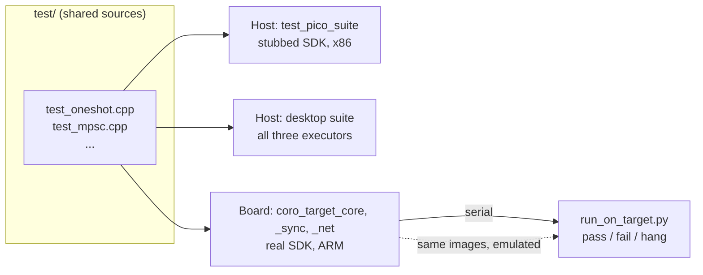
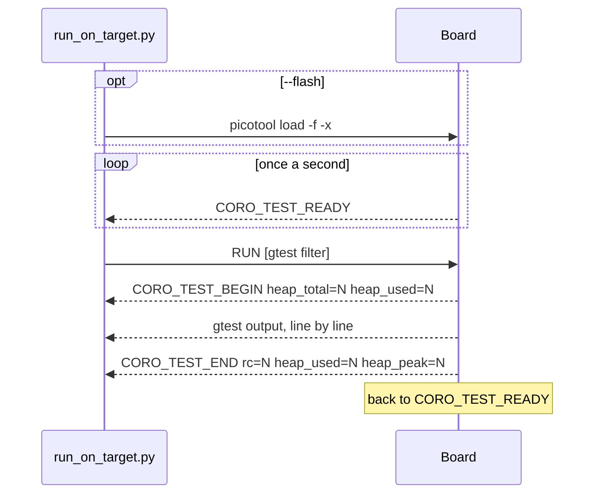
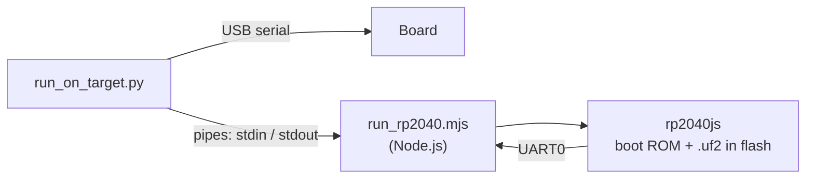

# On-Target Tests

Running the library's unit tests on real microcontroller hardware, starting with the
Raspberry Pi Pico W.

**Status:** 252 tests from 18 test files build with GoogleTest and pass on an RP2040
board, including the fiber tests and TCP and UDP over lwIP loopback; see
[the second measurement](#second-measurement-252-tests). That was one firmware image
built by a separate CMake project. The build is now part of `test/`'s Conan package and
splits the suite into four images with about 450 tests (see [Images](#images)). All of
them pass on the desktop, in the emulator and on the board.

## Summary

The plan is to compile the existing gtest sources in `test/` for the board, not to write
a second suite. Most of the structure for that is already in place:

- `test_pico_suite` already compiles 16 of the desktop test files under `CORO_PICO`,
  with only the current-thread executor, and runs them on the host against stubbed SDK
  calls.
- Those files already guard their desktop-only parts with `#ifndef CORO_PICO`.

What is missing is a build for the board, a way to get results off it, and real-hardware
versions of the tests that fake an interrupt with a host thread.

The first choice of test framework is GoogleTest itself, built for the board. A
gtest-compatible header of our own is the fallback if GoogleTest does not fit in RAM.



The same images also run in an RP2040 emulator, for a machine with no board attached;
see [Running without a board](#running-without-a-board).

## Test framework

### GoogleTest on the board

GoogleTest is compiled from its single amalgamated source
(`googletest/src/gtest-all.cc`) with the hosted features switched off:

| Setting | Why |
|---|---|
| `GTEST_HAS_PTHREAD=0` | Bare metal has no threads |
| `GTEST_HAS_STREAM_REDIRECTION=0` | Needs `dup()` and temporary files |
| `GTEST_HAS_FILE_SYSTEM=0` | No XML/JSON reports or flag files |
| `GTEST_HAS_POSIX_RE=0` | No `regcomp()`; gtest falls back to its own matcher |
| `GTEST_HAS_RTTI=0` | The Pico SDK compiles with `-fno-rtti` |

Exceptions stay on (`PICO_CXX_ENABLE_EXCEPTIONS`), as in the rest of the Pico build.
Death tests are off automatically on an unrecognised platform. gmock is compiled in
the same way (`googlemock/src/gmock-all.cc`), since a few shared tests define a mock.

!!! note "NOTE: RAM cost"
    Every `TEST` registers itself at start-up and takes heap doing so. The spike measured
    at most 360 bytes per test against a 233 KB heap, so the tests that apply to the Pico
    are expected to fit in one image; see [the results](#spike-results). If they stop
    fitting, the suite can be split across several firmware images: the runner and host
    script do not care how many there are.

### Fallback: a gtest-compatible header

Not needed on the Pico W. It remains the option for a smaller microcontroller, where
GoogleTest's 320 KB of fixed flash or its RAM use may not fit: the same test sources can compile against a
small header of our own that defines the same macros. The tests use a narrow slice of
gtest:

| Feature | Uses in `test/` | In a custom header |
|---|---|---|
| `EXPECT_*` / `ASSERT_*` comparisons, with `<<` | about 1,900 | Simple |
| `TEST`, `TEST_F` | 641 | Simple |
| `TYPED_TEST`, `TYPED_TEST_SUITE`, `testing::Types` | 232 | The one involved part |
| `EXPECT_THROW`, `EXPECT_NO_THROW` | 66 | Simple |
| `SUCCEED`, `FAIL`, `ADD_FAILURE`, `GTEST_SKIP` | 11 | Simple |
| gmock (`MOCK_METHOD`, `EXPECT_CALL`, `ElementsAre`) | 27 | Not provided; those tests stay host-only or are rewritten |
| `EXPECT_DEATH` | 1 | Not provided |

Existing embedded frameworks with a gtest-like API were considered and set aside because
the ones looked at do not support typed tests, which this suite relies on to run one
test body per executor.

## Runner and host script

The firmware's `main()` (`test/target/pico/main.cpp`) does not run the tests on its own. It announces itself and waits to be told, so the host
never misses output from a board that started before the serial port was open, and so
the tests can be re-run with a different filter without flashing.



The protocol is plain text lines so that a terminal program works as a host too, and so
that a port to another microcontroller needs only "write a line" and "read a line".

The host script exits with:

| Status | Meaning |
|---|---|
| 0 | Every test passed |
| 1 | At least one test failed |
| 2 | The run did not finish: no output for `--idle-timeout`, the serial port vanished, or the board never answered. The script names the test that was running. |

!!! warning "FIXME: a crash ends the run"
    A hard fault, a deadlock or running out of heap in one test stops every test after
    it. The spike only reports which test was running. The plan is a watchdog that
    resets the board, plus the host re-issuing `RUN` with a filter that skips past the
    test that died.

Running out of heap is the crash seen so far: the Pico SDK panics when `malloc` fails.
To make that diagnosable the device prints `CORO_TEST_HEAP used=N` before each test.
The host script hides those lines and, when a run dies, reports how much heap the
failed test started with.

## Running without a board

`run_on_target.py --emulator` runs each image in an emulated RP2040 and speaks the same
protocol to it. Nothing in the firmware changes: the image that is flashed is the image
that is emulated.



| Piece | What it does |
|---|---|
| [rp2040js](https://github.com/wokwi/rp2040js) | Emulates the RP2040: the Cortex-M0+ core, memory, timer, UART and other peripherals. Pinned to one version in `test/target/emulator/package-lock.json` |
| `test/target/emulator/run_rp2040.mjs` | Loads the boot ROM and the `.uf2`, connects UART0 to its stdin and stdout, and exits with status 3 if the firmware hits a breakpoint (a panic or a failed assert) or the emulator reports an error |
| `run_on_target.py --emulator` | Installs the emulator with `npm ci` and downloads the boot ROM the first time, starts one emulator process per image, and treats the process exiting as the device being lost |

The firmware already writes to UART0 as well as to USB, so the emulator needs no USB
host. The boot ROM is required because the Pico SDK calls routines in it. It is not
part of the emulator, so the script downloads revision B1 from Raspberry Pi's
`pico-bootrom-rp2040` releases and checks its SHA-256 before using it.

Unicorn, which `test_switch_context_pico` uses, was not an option: it emulates the
processor only, with no timer, UART or boot ROM.

!!! danger "WARNING: a pass in the emulator is not a pass on the board"
    The emulator is a smoke check. It catches firmware that no longer boots, a test that
    fails on a 32-bit ARM core, and an image that runs out of heap. It does not reproduce
    the board's timing, and a peripheral behaves only as well as the emulator models it.
    A failure means something broke and should be looked at on the hardware. A release
    is gated on a run on the hardware, not on this.

!!! note "NOTE: what the emulator cannot cover"
    Tests that need the radio, real interrupt latency, or a peripheral the emulator does
    not model have to stay out of the images, or be filtered out of the emulator run with
    `--filter`. The `IsrEvent` tests are the first that depend on a peripheral: they
    raise a hardware-timer alarm (see [Interrupts in tests](#interrupts-in-tests)), so
    they pass in the emulator only because it models the timer's alarm interrupt, which
    it does.

## Build

There is one test build, `test/CMakeLists.txt`, and one list of test files,
`test/tests.cmake`. Each file appears there once, on one line that says which builds it
belongs to:

```cmake
coro_test(sync/test_oneshot.cpp          DESKTOP PICO_STUB ON_TARGET sync)
coro_test(runtime/test_io_driver.cpp     DESKTOP)
coro_test(io/test_tcp_stream.cpp         DESKTOP HOST_LINK coro_lwip_tcp ON_TARGET net)
```

| Keyword | Where the file is built |
|---|---|
| `DESKTOP` | Its own executable on the development machine, linked with the desktop library |
| `PICO_STUB` | `test_pico_suite`: the Pico configuration of the core on the development machine, SDK calls stubbed |
| `HOST_LINK <lib>...` | Its own executable on the development machine, linked with the named libraries: Pico code against stubs or a host build of lwIP. Named `<file>_pico` when the file is also `DESKTOP` |
| `ON_TARGET <image>` | The firmware image `coro_target_<image>`, run on the board |

Adding a test file is one line. Running an existing file on the board is one more
keyword on its line. The same recipe, `test/conanfile.py`, builds either side: a desktop
profile gives the host executables, a bare-metal profile (`os=baremetal`) gives the
firmware images. `coro_test()` is defined in `test/cmake/coro_test.cmake`.

```bash
# Desktop, as before.
conan build test -pr:h default --build=missing

# Firmware. The library must first exist as a package built for the board.
conan create . -pr:h rp2040_pico_w -pr:b default --build=missing
conan build test -pr:h rp2040_pico_w -pr:b default --build=missing

# Flash and run every image in turn (needs picotool and pyserial):
test/target/run_on_target.py test/build/baremetal/Release/coro_target_*.uf2
# or
cmake --build test/build/baremetal/Release --target run_on_target

# With no board, in the emulator (needs Node.js):
test/target/run_on_target.py --emulator test/build/baremetal/Release/coro_target_*.uf2
# or
cmake --build test/build/baremetal/Release --target run_in_emulator

# One image, or part of what is already on the board:
test/target/run_on_target.py test/build/baremetal/Release/coro_target_sync.uf2
test/target/run_on_target.py --filter 'OneshotTest/*'
```

The firmware build goes to `test/build/baremetal/`, apart from the desktop build in
`test/build/Release/`. `test/README.md` in the repository has the one-time setup
(picotool's udev rules, pyserial) and a troubleshooting table.

### Images

One image cannot hold the whole suite on an RP2040 (see
[what the second measurement means](#what-this-means-for-the-plan)), so `ON_TARGET` names
the image a file goes into. The host script loads and runs each image and reports the
worst result.

| Image | Files |
|---|---|
| `core` | `test_poll_result`, `test_waker_context`, `test_intrusive_list`, `test_rc`, `test_frame_pool`, `test_timer_queue`, `test_future`, `test_future_ref`, `test_stream`, `test_coro`, `test_coro_stream`, `test_co_invoke`, `test_join_set`, `test_stream_handle`, `test_fiber` |
| `runtime` | `test_runtime`, `test_executor_task`, `test_join_handle`, `test_coro_scope` |
| `sync` | `test_event`, `test_select`, `test_when`, `test_sleep`, `test_oneshot`, `test_mpsc`, `test_watch`, `test_broadcast`, `test_isr_event` |
| `net` | `test_tcp_stream`, `test_udp_socket` |

A new image needs no CMake beyond a new name after `ON_TARGET`. An image holds about 325
tests before GoogleTest's own bookkeeping exhausts the heap, so `core` and `sync` have
room left but not much.

### Memory checks

ASan and TSan cannot run on the board. Both need a runtime library that does not exist
for bare metal; ASan needs shadow memory an eighth the size of the address space, and
TSan needs a 64-bit machine with threads. They run on the desktop instead, where
`test_pico_suite` and the `HOST_LINK` tests compile the Pico configuration of the library
for the host. What that leaves uncovered is the code that exists only in firmware, and
anything that depends on 32-bit sizes. For that the firmware has two checks that cost no
RAM:

| Check | When | What it catches | Where |
|---|---|---|---|
| Stack guard (`PICO_USE_STACK_GUARDS`) | Always | A write to the 32 bytes below the main stack. The stack is the full 4 KB of its linker region | Board only: the emulator has no memory protection unit, and its launcher only stores the MPU registers so that the firmware boots |
| UBSan in trap mode (`with_sanitize=ubsan`) | On request | Undefined behaviour in the library, the tests and the runner: signed overflow, bad shifts, misaligned or null access, out-of-bounds array indexing, a missing return | Board and emulator |

Both end in a hard fault, which the host script reports as the device stopping during
the test that was running. UBSan is an option, like ASan and TSan on the desktop, because
the library has to be compiled with it as well, which makes it a different package from
the one that ships, and slower. The stack guard changes nothing but the SDK's start-up,
so it is always on.

!!! note "NOTE: what these do not catch"
    Heap overruns, use after free and leaks on the board; an overflow of a fiber's
    stack; a stack frame large enough to step over the 32-byte guard. The SDK, lwIP and
    GoogleTest are not instrumented.

!!! tip "TODO: heap checks on the board"
    The SDK already wraps `malloc()` and `free()`. A test-only wrapper could put a
    canary after each block and check it on `free()`, and the runner could fail a test
    that ends with more heap in use than it started with.

### Interrupts in tests

`IsrEvent`, `IsrChannel` and `IsrSemaphore` are signalled from an interrupt handler. Their
tests get one from `IsrTrigger` (`test/isr_trigger.h`), which calls a function a number of
times at a fixed period:

| Build | What calls the function |
|---|---|
| The board | A Pico SDK alarm (`add_alarm_in_us()`). Its callback runs in the hardware timer's interrupt handler, so it preempts the executor as a real interrupt does |
| `test_pico_suite` on the host | A thread that sleeps and then calls it. The stubbed spin lock is a `std::mutex`, which makes that well defined |

The test body is the same in both. `PICO_ON_DEVICE`, which the SDK defines for firmware
and the stubs do not, selects the implementation.

### Where GoogleTest comes from

The desktop build takes GoogleTest from Conan. The firmware build compiles it from
source, fetched by CMake (`test/cmake/on_target_pico.cmake`), with the settings in
[GoogleTest on the board](#googletest-on-the-board).

!!! warning "FIXME: GoogleTest for the board does not come from Conan yet"
    The Conan Center recipe builds GoogleTest through its own `CMakeLists.txt` and has
    an option only for threads. Stream redirection, the filesystem, POSIX regular
    expressions and RTTI also have to be switched off, in the library and in every test
    that includes its headers, and the recipe gives no way to pass those. They would
    have to come from the profile (`gtest/*:tools.build:defines`, with the
    `extra_flags` and `cmake_flags_init` toolchain blocks enabled for that package
    only). Whether that builds and links has not been tried. `-o gtest_from_conan=True`
    on the test recipe requires the package and makes the firmware link it, for trying
    this out.

## Per-platform test selection

- **Whole files** are chosen in `test/tests.cmake`, by the keywords on the file's line
  (see [Build](#build)).
- **Individual tests** inside a shared file are guarded by the preprocessor. Today that
  is `#ifndef CORO_PICO`, and in the socket tests `CORO_TCP_BACKEND_LWIP` and
  `CORO_UDP_BACKEND_LWIP`, because what differs there is the socket backend.
- **The runtime** a networking test uses is `NetRuntime` (`test/net_runtime.h`): the
  default runtime on the desktop, and on Pico one built with `PicoNetwork::Lwip` after
  starting lwIP once. A test body is then the same on every platform:
  `NetRuntime rt; rt.block_on(...)`.

!!! tip "TODO: guard on capabilities, not platform names"
    Before a second microcontroller is added, replace `CORO_PICO` in the tests with
    capability macros from one small test header, for example "has threads", "has
    multi-threaded executors", "has a blocking pool", "has a filesystem". A new platform
    then sets a few flags in one place instead of adding its name to every guard.

## Which tests apply

| Group | Files | On the board |
|---|---|---|
| Pure logic | `test_oneshot`, `test_mpsc`, `test_watch`, `test_broadcast`, `test_event`, `test_select`, `test_when`, `test_join_set`, `test_stream_handle`, `test_co_invoke`, `test_future_ref`, `test_stream`, `test_rc`, `test_frame_pool`, `test_coro`, `test_future`, `test_coro_stream`, `test_timer_queue`, `test_intrusive_list`, `test_poll_result`, `test_waker_context` | In the firmware. The tests of `blocking_wait()` and the stress test in `test_coro` are desktop-only |
| Runtime and tasks | `test_runtime`, `test_executor_task`, `test_join_handle`, `test_coro_scope` | In the firmware, on the one runtime the board has. The files use `SingleThreadRuntime` (`test/executor_traits.h`), one name for a single-threaded runtime on both builds |
| Timers | `test_sleep` | In the firmware: one file for the desktop and the board, replacing the separate `test_sleep_pico`. The tests of the multi-threaded executors and the 10,000-timer stress tests are desktop-only |
| Signalled from an interrupt | `test_isr_event` | In the firmware, with a real timer interrupt; see [Interrupts in tests](#interrupts-in-tests) |
| Driven through stubbed hardware | `test_gpio`, `test_async_dma` | Not in the firmware. They set pin levels and fire interrupts through the SDK stubs, which the board does not have. Testing the real peripherals needs new tests: a pin driven and read back, a memory-to-memory DMA transfer |
| Not in the Pico library | `test_circular_byte_buffer` | Not in the firmware: the buffer's source is compiled only into the desktop library |
| Fibers | `test_fiber`, `test_switch_context_pico` | `test_fiber` is in the firmware: it runs the real context switch on real fiber stacks. The stack-overflow death test stays desktop-only until crash recovery exists. `test_switch_context_pico` drives the assembly through an ARM emulator and is not needed on the board |
| Sockets | `test_tcp_stream`, `test_udp_socket`, `test_mqtt_client` | TCP and UDP are in the firmware: the same two files as the desktop, against lwIP's loopback interface, so no radio and no Pico W is needed. MQTT is not yet: it needs lwIP's MQTT client compiled in (`CORO_PICO_WITH_MQTT`) |
| Over the radio | none written yet | Needs a Pico W, an access point and a peer on the network. On a microcontroller the network stack and the Wi-Fi driver are part of the firmware, so this tests code that loopback never reaches |
| Desktop only | work-stealing and work-sharing executors, `test_io_driver`, `test_poller`, `test_file`, `test_pipe`, `test_signal`, `test_spawn_blocking`, `test_ws_stream`, `test_lookup_host`, `test_skynet` | Never |

The third and fourth rows are where running on hardware tests something the host cannot.

## Plan

| Step | What | Rough effort |
|---|---|---|
| 1. Spike | GoogleTest plus three test files on a board; measure flash and RAM | 1–2 days |
| 2. Decide | GoogleTest, GoogleTest split across images, or the custom header. Decided by the second measurement: GoogleTest, split across images | — |
| 3. Existing Pico suite | Bring the rest of `test_pico_suite`'s files and the other pure-logic tests onto the board | 2–4 days |
| 4. Crash and hang recovery | Watchdog reset, hard-fault report, host resumes after the failed test | 2–4 days |
| 5. Capability macros | Replace `CORO_PICO` guards in the tests | 1–2 days |
| 6. Hardware tests | Interrupts, DMA, GPIO, fibers, lwIP loopback | 1–2 weeks |
| (if needed) Custom header | See [the fallback](#fallback-a-gtest-compatible-header) | 3–5 days |

Steps 1–3 give a usable suite in one to two weeks. All of it is four to five weeks. Time
spent fixing library bugs the tests find is extra; the Pico port has not been verified on
hardware since the desktop I/O rewrite (see the FIXME in
[Raspberry Pi Pico Port](pico_port.md)).

Not planned yet:

- **Automation on the hardware.** Running on a board in CI needs a self-hosted runner
  with one attached. Until then the host script is run by hand, and before every
  release. The workflow `.github/workflows/pico_emulator.yml` runs the images in the
  [emulator](#running-without-a-board) in the meantime.
- **A second microcontroller.** The test side is small if the runner keeps to the line
  protocol above. Porting the library itself is the larger job.

## The spike

Three files, chosen because they already build for the Pico on the host, use typed
tests, and need no hardware beyond the board: `test_oneshot.cpp`, `test_mpsc.cpp`,
`test_select.cpp` (63 tests on the Pico).

### Building and running

The spike used a separate CMake project in `test/target/pico`, since replaced; see
[Build](#build) for the current commands.

`arm-none-eabi-size` on an image's `.elf` gives the flash and static RAM figures. The
script prints the heap figures at the end of the run.

### What could go wrong first

- **GoogleTest does not compile or link.** The settings in the table above are the ones
  expected to matter; a missing libc function at link time would point to another hosted
  feature that needs switching off.
- **A hard fault during start-up or in the first test.** Suspect the stack before the
  library. On an RP2040 the main stack starts in a 4 KB region above main RAM and has
  about 8 KB before it grows into the top of the heap; gtest, iostreams and exception
  unwinding together use far more stack than the examples do.
- **No output.** Over USB, output only appears once the host has opened the port, which
  is why the runner repeats `CORO_TEST_READY`. The same text also goes to the UART.

### Spike results

| Measurement | Value |
|---|---|
| Board, SDK version, compiler version | Pico W (RP2040), Pico SDK 2.2, arm-none-eabi-g++ 14.2.1, `Release` |
| Compiles and links? Changes needed | Yes |
| Flash used (`text` + `data`) | 662 KB of 2 MB (32%) |
| Static RAM (`data` + `bss`) | 29 KB, of which 8 KB is the library's interrupt stack |
| Heap total | 232,916 bytes |
| Heap used before the first test (63 tests registered) | 22,684 bytes |
| Heap at peak | 28,116 bytes (12% of the heap) |
| Tests passed / failed | 63 / 0 |
| Run time | 776 ms |

Where the flash goes:

| Part | Size |
|---|---|
| libstdc++ (mostly iostream and locale support that gtest pulls in) | about 250 KB |
| C library, Pico SDK, lwIP, CYW43 driver | about 120 KB |
| The 63 tests | about 100 KB of code, plus their share of exception tables |
| GoogleTest | about 70 KB |
| coro | about 65 KB |

The first, second, fourth and fifth rows are paid once per image. The tests cost roughly
2–4 KB of flash each, so the 1.4 MB left has room for several hundred more. Flash is
therefore not the constraint; RAM, still to be measured, is the open question.

### Conclusion

GoogleTest works on the board as it is, and the custom header is not needed.

- **RAM.** The 22.7 KB in use before the first test covers both the fixed start-up
  cost (iostreams, gtest itself) and the 63 registrations, and one run cannot separate
  the two. Treating all of it as registration gives an upper bound of 360 bytes per
  test. At that rate 400 tests would need about 144 KB, which fits in the 233 KB heap.
  The real figure is lower.
- **Working memory.** Running the tests raised the heap by only 5.4 KB over the
  start-up figure, and 48 bytes stayed allocated afterwards.
- **Flash.** Not a constraint, as above.

A single image for everything that applies to the Pico looked likely at this point. The
second measurement below shows it is not.

## Second measurement: 252 tests

The rest of `test_pico_suite` (all but `test_isr_event.cpp`), the fiber tests, and the
TCP and UDP loopback tests were added to the same image: 18 test files in all.

| Measurement | 63 tests | 252 tests |
|---|---|---|
| Tests passed / failed | 63 / 0 | 252 / 0 |
| Run time | 776 ms | 4,089 ms |
| Flash used | 662 KB (32%) | 1,379 KB (66%) |
| Static RAM | 29 KB | 61 KB |
| Heap total | 232,916 bytes | 191,216 bytes |
| Heap used before the first test | 22,684 bytes | 86,688 bytes |
| Heap at peak | 28,116 bytes | 166,640 bytes |
| Still allocated at the end, over the start | 48 bytes | 224 bytes |

What the two columns together show:

- **Each registered test costs about 340 bytes of heap.** 189 more tests raised the
  start-up figure by 64 KB. The fixed start-up cost is small, about 1 KB, so the upper
  bound from the first spike was close to the real figure.
- **The heap is 42 KB smaller** now that the tests reference lwIP. Most of that is
  lwIP's static pools, and the largest of those (37 KB) is the packet pool for the
  Wi-Fi driver, which loopback never uses.
- **Running the tests needs about 80 KB above the start-up figure.** That left 24.6 KB
  of the heap unused at the peak. The first version of `LargeDataTransfer` kept four
  32 KB copies of its data and ran the board out of memory; see
  [other changes](#other-changes-made-for-this).
- **Each test costs about 3.8 KB of flash**, more than the first estimate, because
  gmock and lwIP are now linked in as well.

### What this means for the plan

One image cannot hold the whole suite. With 80 KB kept free for running tests, the heap
has room for about 325 registered tests, and this image already has 252. The files still
to come are about 110 pure-logic tests, 14 MQTT tests, and the hardware tests. Flash runs
out later, at roughly 430 tests.

The suite therefore has to be split across several images, each flashed and run in turn
by the host script. GoogleTest itself is still the right framework: the 340 bytes per
test are its registration records, and a custom header would save some of that but not
change the conclusion.

The split is in place: see [Images](#images).

## Other changes made for this

- The Pico `Runtime` constructor takes a `PicoNetwork` (`None`, `Lwip` or `Cyw43`)
  instead of `bool enable_network`. `Lwip` is new: the runtime drives lwIP's timers and
  loopback queue without the radio, so a socket test can use `block_on()` on a board
  where `cyw43_arch_init()` was never called. This is a library change; see
  [lwIP configuration](lwip_config.md#loopback).
- `CurrentThreadTraits` and `SingleThreadRuntime` in `test/executor_traits.h` build the
  Pico runtime with `PicoNetwork::None`. With the default, the runtime calls
  `cyw43_arch_poll()` on every loop, which is undefined behaviour on a board where
  `cyw43_arch_init()` was never called. On the host the call was a stub, so the problem
  was invisible there.
- The separate lwIP socket tests (`test/pico/test_tcp_stream_real.cpp`,
  `test_udp_socket_real.cpp`) are gone. `test/io/test_tcp_stream.cpp` and
  `test_udp_socket.cpp` are built three times: for the desktop, against lwIP on the
  host (`test_tcp_stream_pico`, `test_udp_socket_pico`), and into the `net` image.
  Tests of the other executors, IPv6, errno values, multicast and GSO/GRO are
  desktop-only sections of those files.
- `LargeWriteCompletesInPieces` in `test_tcp_stream.cpp` keeps one copy of its data at
  a time and checks received bytes as they arrive. On lwIP its size is
  `2 * TCP_SND_BUF + 1024`, because the host and firmware lwIP options set the send
  buffer differently.
- `test/task/test_fiber.cpp` takes its runtime from `CurrentThreadTraits`, uses 8 KB
  fiber stacks on Pico instead of 64 KB, and compiles its stack-overflow death test
  for the desktop only.
- The `coro::pico` Conan target now defines `CORO_UDP_BACKEND_LWIP`, as the in-tree
  `coro_pico` target already did. Without it a Conan consumer including `udp_socket.h`
  got the desktop branch of the header.
- Loopback is now enabled in coro's bundled `lwipopts.h`, and the Pico runtime drains
  lwIP's loopback queue on every loop. This is a library change, not a test-only one;
  see [lwIP configuration](lwip_config.md#loopback).
