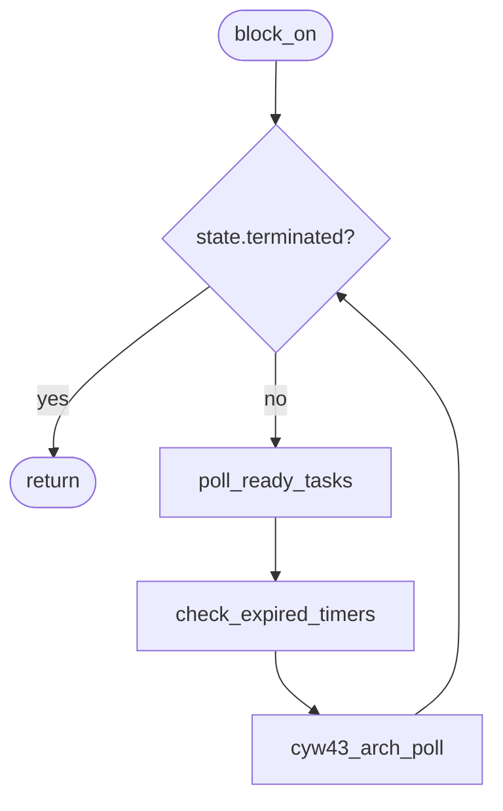
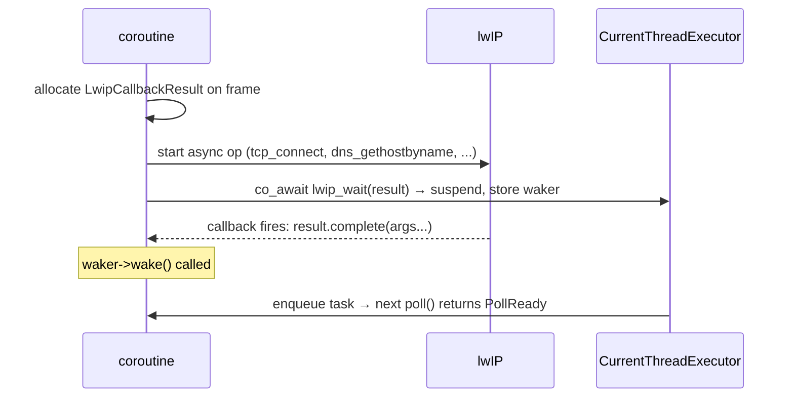
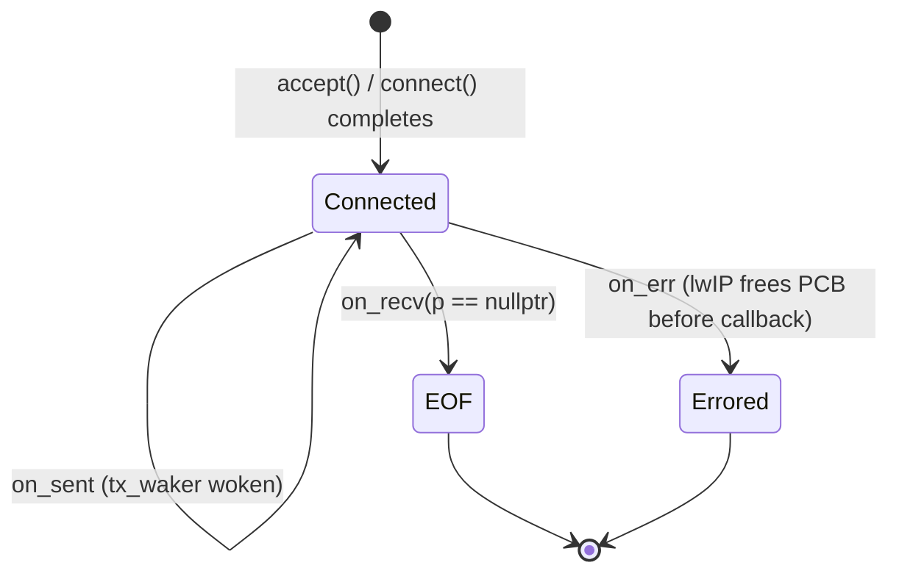
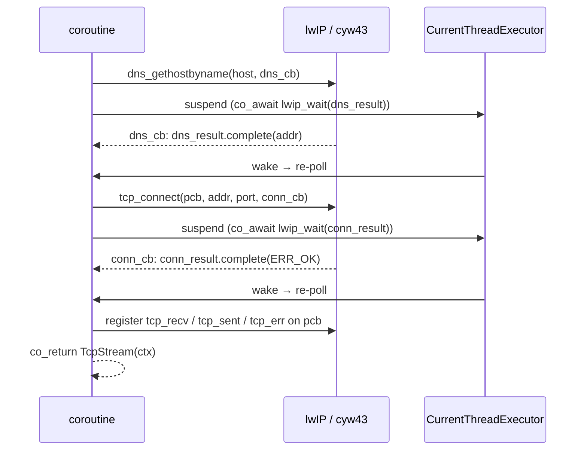

# Pico Port

Stripped-down port of the coro library to Raspberry Pi Pico W (RP2040/RP2350),
targeting the Pico SDK with `CYW43_ARCH_POLL` mode. Provides `CurrentThreadExecutor`,
`TcpStream`, `TcpListener`, `sleep_for`, and `timeout` — enough to run coroutines
with async TCP I/O, timers, and hardware IRQ integration on bare metal.

## Scope

| Included | Excluded |
|---|---|
| `Coro<T>` / `JoinHandle<T>` / `JoinSet<T>` — coroutine return types | `WorkStealingExecutor` / `WorkSharingExecutor` |
| `spawn()` — task spawning and joining | `File` / `WsStream` |
| `CurrentThreadExecutor` — single-threaded run loop | `spawn_blocking` (no thread pool) |
| `TcpStream` — async TCP client (lwIP backend) | |
| `TcpListener` — async TCP server (lwIP backend) | |
| `mpsc`, `oneshot`, `watch`, `select`, `join` — sync primitives | |
| `sleep_for` / `timeout` — timer-queue based, no ISR | |

All coroutine machinery in `include/coro/detail/` and `include/coro/sync/` is
portable C++20/23 with no platform dependencies and compiles as-is.

---

## Architecture

### Compile-time feature flags

| Flag | Effect |
|---|---|
| `CORO_PICO` | Selects `CurrentThreadExecutor`, no-op mutex stubs, `SleepFuture` timer queue, no libuv |
| `CORO_TCP_BACKEND_LWIP` | Selects lwIP TCP backend for `TcpStream` / `TcpListener` |

Both flags are set automatically by `cmake/platforms/pico.cmake`.

### How the existing library maps to the Pico SDK

| libuv backend | Pico SDK equivalent |
|---|---|
| `uv_run(UV_RUN_ONCE)` | `cyw43_arch_poll()` |
| `uv_tcp_t` | lwIP `tcp_pcb*` |
| `uv_timer_t` | `CurrentThreadExecutor` timer queue (min-heap + `time_us_64()`) |
| `uv_async_send()` doorbell | Not needed — single-threaded cooperative scheduling; ISR path uses `IsrEvent` volatile flags |
| `UvCallbackResult` | `LwipCallbackResult` (no mutex; see below) |
| `SingleThreadedUvExecutor` (dedicated I/O thread) | `CurrentThreadExecutor` (runs on calling thread) |

### Event loop

`Runtime::block_on()` drives everything:



`cyw43_arch_poll()` processes pending WiFi chip events and fires any pending lwIP
callbacks (TCP recv, sent, err) synchronously on the calling thread before returning.
`check_expired_timers()` fires wakers for any `sleep_for` / `timeout` deadlines that
have passed since the last iteration.

---

## Synchronisation and ISR safety

### `detail::Mutex` — no-op on Pico

On all non-Pico targets `detail::Mutex` / `detail::SharedMutex` are thin aliases for
`std::mutex` / `std::shared_mutex`. On Pico they are **no-ops** — all methods are empty:

```cpp
class Mutex {
public:
    void lock()     {}
    void unlock()   {}
    bool try_lock() { return true; }
};
```

This is correct because `CurrentThreadExecutor` is **cooperative and single-threaded**.
`co_await` is the only yield point: no two coroutines ever run concurrently, so no
mutual exclusion is needed to protect channel state, wakers, or the ready queue. IRQ
handlers communicate with coroutines exclusively via `IsrEvent` and `IsrChannel<T>`
(described below), not by calling coro sync primitives directly.

#### History: why spin locks were used and then removed

The initial Pico port implemented `detail::Mutex` using `spin_lock_blocking()` /
`spin_unlock()` from the Pico SDK, sharing a single hardware spin lock (number 16)
across every mutex instance. This approach disabled IRQs for the entire duration of each
lock-guarded critical section.

The intent was to allow ISR handlers and core-1 code to safely call coro APIs (channel
send, waker wake, etc.) directly. In practice, this caused a class of hard-to-diagnose
deadlocks: coro mutexes protect channel state that is accessed deep inside application
logic (e.g. inside a `WatchSender::borrow_mut()` scope). Application code running under
these locks may legitimately perform slow I/O — I2C writes, `printf` via USB-CDC — that
depend on IRQ handlers to make progress. With IRQs disabled for the duration of the lock,
those handlers could never run, deadlocking the whole system.

A concrete example from the `pico_ws2812_tcp` example:

1. `display_loop` called `rx.borrow_and_update()` (acquires `detail::Mutex` → IRQs disabled)
2. Inside the lock, `lcd.write()` issued an I2C transaction (~640 µs per character)
3. The I2C peripheral fired a TX-empty IRQ to advance the transfer — but IRQs were disabled
4. `i2c_write_blocking` spun forever waiting for the IRQ flag
5. USB-CDC `printf` later in the loop also requires IRQ service; filling the TX buffer blocked
6. Entire system deadlocked

The root cause is that the spin-lock approach coupled IRQ liveness to coro internal lock
scopes, making any I/O inside a lock-guarded section unsafe. The correct fix is to
recognise that these locks are unnecessary in the first place.

!!! warning "WARNING: Core-1 task dispatch would require revisiting this decision"
    No-op mutexes are correct *only* as long as all coro operations (spawning tasks,
    sending on channels, waking futures) happen on the same core as the executor. If a
    future feature adds the ability to dispatch tasks or send on channels from core 1,
    every `detail::Mutex` guard site would need to become a real critical section again.
    Any core-1 integration must audit this before landing.

#### Cortex-M0+ atomics

`std::atomic` operations in coro internals (e.g. `SchedulingState` CAS in `TaskBase`)
use IRQ-disable (`CPSID I / CPSIE I`) on Cortex-M0+ because M0+ lacks the `LDREX` /
`STREX` load-linked / store-conditional instructions. The libatomic fallback disables IRQs
for approximately 4–6 instructions per operation. This is safe and correct; the brief
IRQ-disable window is far too short to cause the deadlock class described above.

### ISR → coroutine communication: `IsrEvent` and `IsrChannel<T>`

The **only supported** way to signal a coroutine from an ISR is via `IsrEvent` or
`IsrChannel<T>` (declared in `include/coro/sync/isr_event.h`).

!!! danger "WARNING: All other coro APIs are undefined behavior from ISR"
    Calling `oneshot::send()`, `mpsc::send()`, `watch::send()`, `event::set()`,
    `CancellationToken::cancel()`, or any other coro sync primitive from an ISR is
    **undefined behavior** — even if it appears to work on single-core RP2040 today.
    These APIs call `waker->wake()`, which calls `shared_from_this()` and
    `Executor::enqueue()`. While those operations happen to use IRQ-safe spin locks on
    RP2040, the library makes no guarantee about ISR safety for any API other than
    `IsrEvent` and `IsrChannel<T>`. Do not rely on it. A future executor implementation,
    a dual-core configuration, or a port to a different MCU can silently break code
    that calls these APIs from ISR context. See `doc/isr_safety.md` for the full analysis.

`IsrEvent` signals that something happened (DMA complete, GPIO edge, timer tick).
`IsrChannel<T>` additionally transfers a trivially-copyable value (ADC reading, byte
received, encoder count). The ISR writes a `volatile` flag (and for `IsrChannel<T>`,
the value with a `__DMB()` release fence) and returns immediately — it never touches
the scheduler, wakers, or `shared_ptr` ref-counts. The executor discovers the flag
once per event loop iteration and wakes the waiting coroutine.

```cpp
// Shared between ISR and coroutine — must outlive both.
coro::IsrEvent g_dma_done;

extern "C" void dma_irq_handler() {
    dma_irqn_acknowledge_channel(0, DMA_CHANNEL);
    g_dma_done.signal_from_isr();   // one volatile write; nothing else
}

coro::Coro<void> do_dma_transfer() {
    // configure and start DMA here ...
    co_await g_dma_done.wait();   // yields until ISR signals; at most one loop iteration of latency
    // DMA complete; buffer is ready
}
```

See `doc/isr_safety.md` for the full `IsrEvent` / `IsrChannel<T>` design, including
the multi-core memory-barrier note for `IsrChannel<T>::send_from_isr()`.

---

## Optional HAL layer: `coro_pico_hal`

`coro_pico_hal` is an **optional** cmake target, separate from `coro_pico`, that provides
async wrappers for RP2040 hardware peripherals (DMA, SPI, I2C, ADC). Applications that
only need TCP coroutines do not need it.

```cmake
# Link the HAL layer in addition to the core:
target_link_libraries(my_firmware PRIVATE coro_pico coro_pico_hal hardware_dma)
```

The HAL layer depends on `coro_pico` (for `IsrEvent`) and on SDK hardware libraries
(`hardware_dma`, etc.). It lives in `src/pico/hal/` and `include/coro/pico/hal/`.

### `AsyncDmaTransfer` — RAII async DMA channel

`AsyncDmaTransfer` claims one DMA channel on construction, performs an async transfer
that suspends the coroutine until completion (via `IsrEvent`), and releases the channel
on destruction. Cancellation aborts the in-progress transfer immediately.

```cpp
// include/coro/pico/hal/dma.h
class AsyncDmaTransfer {
public:
    // Claims an unused DMA channel. Throws std::runtime_error if none available.
    AsyncDmaTransfer();

    // Aborts any in-progress transfer and releases the DMA channel.
    ~AsyncDmaTransfer();

    // Returns the claimed channel number (useful for DREQ configuration).
    int channel() const;

    // Configures and starts the transfer described by ctrl/read_addr/write_addr/count.
    // Suspends the calling coroutine until the DMA IRQ fires; at most one executor
    // loop iteration of latency between IRQ and resumption.
    // Cancellable: if the awaiting coroutine is cancelled, the in-progress transfer
    // is aborted immediately via dma_channel_abort() (synchronous and safe).
    [[nodiscard]] coro::Coro<void> transfer(
        const dma_channel_config& ctrl,
        const volatile void*      read_addr,
        volatile void*            write_addr,
        uint                      transfer_count);

private:
    int      m_channel;
    IsrEvent m_done;
};
```

#### IRQ dispatch

`DMA_IRQ_0` on RP2040 is a shared interrupt for all 12 DMA channels. `AsyncDmaTransfer`
uses a module-internal dispatch table:

```cpp
// Internal — not part of the public API
static IsrEvent* g_dma_events[NUM_DMA_CHANNELS] = {};

static void dma_irq0_handler() {
    for (int ch = 0; ch < NUM_DMA_CHANNELS; ++ch) {
        if (dma_irqn_get_channel_status(0, ch)) {
            dma_irqn_acknowledge_channel(0, ch);
            if (g_dma_events[ch])
                g_dma_events[ch]->signal_from_isr();
        }
    }
}
```

`AsyncDmaTransfer::transfer()` stores `&m_done` in `g_dma_events[m_channel]` before
starting the transfer and clears it after `wait()` returns (or on abort). The IRQ
handler is registered once (via `irq_add_shared_handler`) when the first
`AsyncDmaTransfer` is constructed.

!!! note "NOTE: DMA_IRQ_1 available"
    For applications that need lower IRQ latency on high-priority channels,
    `AsyncDmaTransfer` could be extended to support `DMA_IRQ_1` as an alternative.
    This is deferred until a concrete need arises.


### `LwipCallbackResult` — no mutex needed for lwIP callbacks

`LwipCallbackResult` (used for DNS resolution and TCP connect) stores a waker and a
result value but uses no mutex. This is safe because `CYW43_ARCH_POLL` guarantees that
all lwIP callbacks fire synchronously inside `cyw43_arch_poll()`, which runs on the
executor thread. There is no separate I/O thread and no concurrent access.

!!! warning "CYW43_ARCH_THREADSAFE_BACKGROUND incompatibility"
    If you switch to `CYW43_ARCH_THREADSAFE_BACKGROUND`, lwIP callbacks can arrive from
    core 1 or a background IRQ. `LwipCallbackResult` would then need a `detail::Mutex`
    guard around `waker` and `value`. The entire port is designed around `CYW43_ARCH_POLL`.

---

## File structure

```
cmake/platforms/
  pico.cmake                    Platform include: defines coro_pico STATIC library
  pico_hal.cmake                Optional HAL layer: defines coro_pico_hal (DMA, SPI, ...)

include/coro/
  detail/mutex.h                Platform-portable mutex: no-op stubs on Pico (cooperative
                                scheduling makes locking unnecessary), std::mutex elsewhere
  sync/
    isr_event.h                 IsrEvent / IsrChannel<T> — ISR-to-coroutine primitives
    sleep.h                     SleepFuture — timer-queue based on Pico, libuv on desktop
  pico/
    pico_executor.h             CurrentThreadExecutor class (timer queue, ready queue)
    pico_callback_result.h      PicoCallbackResult / PicoFuture — legacy; used by
                                older pico_tcp_stream.h. New code uses LwipCallbackResult.
    hal/
      dma.h                     AsyncDmaTransfer — RAII async DMA channel (coro_pico_hal)
  io/
    tcp_stream.h                TcpStream — dispatches to lwIP or libuv backend
    tcp_listener.h              TcpListener — dispatches to lwIP or libuv backend
    lwip/
      lwip_callback_result.h    LwipCallbackResult<Args...> + lwip_wait() helper

src/
  pico_executor.cpp             CurrentThreadExecutor + timer queue implementation
  runtime.cpp                   Runtime::schedule_timer() (Pico gate)
  pico/hal/
    dma.cpp                     AsyncDmaTransfer + DMA_IRQ_0 dispatch table
  io/lwip/
    lwip_tcp_ctx.h              LwipTcpCtx internal struct (shared between stream + listener)
    tcp_stream_lwip.cpp         TcpStream lwIP implementation
    tcp_listener_lwip.cpp       TcpListener lwIP implementation

examples/pico/
  CMakeLists.txt                Standalone Pico SDK build
  lwipopts.h                    lwIP configuration (DHCP, TCP, NO_SYS=1)
  wifi_credentials.h.example    Template — copy to wifi_credentials.h (gitignored)
  pico_tcp_echo_server.cpp      TCP echo server example
  pico_tcp_echo_client.cpp      TCP echo client example
  pico_ws2812_tcp.cpp           WS2812B LED controller with TCP command interface
  ws2812_gui.py                 PyQt6 desktop GUI for the LED controller
  requirements.txt              Python dependencies (pip install -r requirements.txt)
  README.md                     Build instructions
```

---

## Component design

### `CurrentThreadExecutor`

Identical CAS state machine as `SingleThreadedExecutor`
(`Notified → Running → Idle / RunningAndNotified`). Key differences:

- **Single-threaded.** No remote injection queue. `enqueue()` pushes directly to
  `m_ready`, nominally protected by `m_ready_mutex` (a `detail::Mutex` — a no-op on
  Pico; see [Synchronisation](#synchronisation-and-isr-safety)). Wakers from ISR
  handlers must go through `IsrEvent` / `IsrChannel<T>`, not direct `enqueue()` calls.
- **No `std::condition_variable` in the run loop.** `wait_for_completion()` polls
  `state.terminated` in a loop rather than blocking on a condvar.
- **Timer queue.** A min-heap of `(deadline_us, waker)` pairs. `schedule_timer()`
  pushes an entry; `check_expired_timers()` fires wakers on each loop iteration.
  No hardware alarm or ISR is used — resolution is bounded by poll loop latency
  (sub-millisecond in practice).
- **`Runtime` is the public entry point.** Users call `rt.block_on(coro)`, not
  `CurrentThreadExecutor` methods directly. `CurrentThreadExecutor` is an internal implementation detail.

### `sleep_for` / `timeout` (Pico)

`SleepFuture` records a deadline in microseconds (via `time_us_64()`) and calls
`current_runtime().schedule_timer(deadline_us, waker)` on the first `poll()` where the
deadline hasn't passed. `check_expired_timers()` in the executor loop fires the waker
when the deadline is reached; the next `poll()` returns `PollReady`.

`timeout<F>` is implemented on top of `sleep_for` and works unchanged on Pico because
it only depends on `SleepFuture` and `select`.

### `LwipCallbackResult<Args...>`

One-shot bridge between an lwIP C callback and an awaiting coroutine. Stores a `Waker`
pointer set by `poll()` and an `optional<tuple<Args...>>` result set by `complete()`.
No mutex is needed (see [Synchronisation](#synchronisation-and-isr-safety) above).



### `LwipTcpCtx` — TCP stream shared state

Internal struct shared between a `TcpStream` and the three lwIP callbacks registered
on its PCB (`on_recv`, `on_sent`, `on_err`). Owned by `std::shared_ptr`.



**Receive:** `on_recv` copies pbuf data into `rx_buf` (`std::vector<uint8_t>`),
calls `tcp_recved()` to open the window, and wakes `rx_waker`. `read()` drains up to
`buf.size()` bytes per call; multiple `on_recv` firings accumulate in `rx_buf`.

**Transmit:** `write()` loops calling `tcp_write(..., TCP_WRITE_FLAG_COPY)` in chunks
sized to `tcp_sndbuf()`. When the send buffer fills, it flushes with `tcp_output()` and
suspends on `tx_waker` until `on_sent` fires.

**Error:** `on_err` is called by lwIP after a fatal error; lwIP frees the PCB *before*
the callback returns, so `on_err` sets `pcb = nullptr`. All code that touches the PCB
checks `errored` or `pcb != nullptr` first.

**Accept race:** callbacks must be set up immediately in `on_accept`, not deferred to
when the application calls `accept()`. Data can arrive in the same `cyw43_arch_poll()`
pass that establishes the connection — registering `tcp_recv` in `on_accept` prevents
that data from being silently dropped.

### `TcpStream` destructor

Uses `tcp_close()` rather than `tcp_abort()`. `tcp_abort()` sends an RST and discards
the send buffer immediately; `tcp_close()` sends FIN and lets the peer receive any data
already in flight. `tcp_abort()` is used only as a fallback if `tcp_close()` returns
an error.

### TCP connect sequence



---

## CMake integration

`cmake/platforms/pico.cmake` defines a single `coro_pico` STATIC library containing
all sources (portable core + executor + lwIP TCP). All sources are merged into one
archive to avoid circular linker ordering between the core (which references
`CurrentThreadExecutor`) and the executor (which references core symbols).

```cmake
# examples/pico/CMakeLists.txt pattern

cmake_minimum_required(VERSION 3.13)
include($ENV{PICO_SDK_PATH}/external/pico_sdk_import.cmake)
project(my_pico_project CXX C ASM)

set(PICO_CXX_ENABLE_EXCEPTIONS 1)    # must be set before pico_sdk_init()
pico_sdk_init()

set(CORO_ROOT /path/to/coro)
include(${CORO_ROOT}/cmake/platforms/pico.cmake)

# lwipopts.h must be visible when compiling coro_pico lwIP sources
target_include_directories(coro_pico PRIVATE ${CMAKE_CURRENT_SOURCE_DIR})

add_executable(my_firmware main.cpp)
target_include_directories(my_firmware PRIVATE ${CMAKE_CURRENT_SOURCE_DIR})
target_link_libraries(my_firmware PRIVATE coro_pico pico_stdlib pico_cyw43_arch_lwip_poll)
pico_enable_stdio_usb(my_firmware 1)
pico_add_extra_outputs(my_firmware)   # generates .uf2 / .bin / .hex
```

!!! note "SDK deps are PRIVATE to coro_pico"
    `pico_stdlib` and `pico_cyw43_arch_lwip_poll` are linked PRIVATE to `coro_pico`.
    They provide include paths for compiling the library sources but are not bundled
    into the archive. Applications must link them directly to avoid duplicate symbol
    errors (the SDK uses OBJECT libraries internally).

!!! note "PICO_BOARD"
    Set `PICO_BOARD=pico_w` (not the default `pico`) — the `pico` board has no CYW43
    WiFi chip and `cyw43_arch.h` will not be found. Set it as an environment variable
    or pass `-DPICO_BOARD=pico_w` to cmake.

`lwipopts.h` must be provided by the application project. Minimum recommended settings:

```c
#define NO_SYS                  1
#define MEM_LIBC_MALLOC         1
#define LWIP_ARP                1
#define LWIP_ETHERNET           1
#define LWIP_DHCP               1
#define LWIP_DNS                1
#define LWIP_TCP                1
#define LWIP_UDP                1
#define MEMP_NUM_TCP_PCB        8
#define MEMP_NUM_TCP_PCB_LISTEN 2
#define TCP_MSS                 1460
#define TCP_SND_BUF             (4 * TCP_MSS)
#define TCP_WND                 (4 * TCP_MSS)
```

---

## Usage example

```cpp
#include <pico/stdlib.h>
#include <pico/cyw43_arch.h>
#include <lwip/netif.h>
#include <coro/runtime/runtime.h>
#include <coro/io/tcp_listener.h>
#include <coro/io/tcp_stream.h>
#include <coro/coro.h>
#include <coro/task/join_set.h>
#include <coro/sync/timeout.h>
#include "wifi_credentials.h"   // gitignored — copy wifi_credentials.h.example
#include <string>

using namespace coro;
using namespace std::chrono_literals;

static Coro<void> handle(TcpStream stream) {
    for (;;) {
        auto [n, buf] = co_await stream.read(std::string(4096, '\0'));
        if (n == 0) co_return;
        buf.resize(n);
        co_await stream.write(std::move(buf));
    }
}

static Coro<void> run_server() {
    TcpListener listener = co_await TcpListener::bind("0.0.0.0", 8080);
    JoinSet<void> sessions;
    for (int i = 0;;) {
        auto result = co_await coro::timeout(5s, listener.accept());
        if (result.index() != 0) {
            std::printf("still waiting...\n");
            continue;
        }
        sessions.spawn(handle(std::move(std::get<0>(result).value)));
        ++i;
    }
}

int main() {
    stdio_init_all();
    cyw43_arch_init();
    cyw43_arch_enable_sta_mode();
    cyw43_arch_wifi_connect_timeout_ms(WIFI_SSID, WIFI_PASSWORD,
                                       CYW43_AUTH_WPA2_AES_PSK, 15000);
    std::printf("IP: %s\n", ip4addr_ntoa(netif_ip4_addr(netif_default)));

    coro::Runtime rt;
    rt.block_on(run_server());

    cyw43_arch_deinit();
}
```

---

## Known limitations and future work

### Single active read and write per stream

`LwipTcpCtx` stores one `rx_waker` and one `tx_waker`. Calling `read()` from two
concurrent tasks on the same stream would silently overwrite the waker and lose
wakeups. Document and enforce single-consumer usage per direction; the same restriction
exists in the libuv `TcpStream`.

### `rx_buf` memory pressure

Incoming data is eagerly copied from pbufs into a `std::vector<uint8_t>`. On a busy
stream this allocation grows until `read()` drains it. For memory-constrained
applications consider capping `rx_buf` at a fixed size and pausing `tcp_recv` (by
returning `ERR_WOULDBLOCK`) when it fills.

### Busy-poll loop — no CPU idle / WFI

`CurrentThreadExecutor::wait_for_completion()` spins unconditionally:

```cpp
while (!done) {
    poll_ready_tasks();
    check_expired_timers();
    cyw43_arch_poll();
}
```

The RP2040 core runs at 125 MHz and never enters a low-power state, even when every
task is parked and no network or timer events are pending. On USB- or wall-powered
devices this is usually acceptable, but **battery-powered applications will see
significantly reduced runtime** compared to an executor that sleeps between events.

The fix is to call `__wfi()` (Wait For Interrupt) at the bottom of the loop when the
ready queue is empty, no timers are near-expiry, and no ISR events are pending. The
CYW43 WiFi chip drives a GPIO IRQ that wakes the CPU when a network event arrives, so
the executor would be woken promptly. Key implementation considerations:

- The "nothing pending" check must be atomic with the decision to sleep — a waker
  enqueue between the check and `__wfi()` must not be lost. On single-core this is
  solved by disabling IRQs briefly during the check, then using `__wfi()` which
  re-enables them atomically.
- The nearest timer deadline gives the maximum sleep duration; a hardware alarm
  (`add_alarm_at()`) should wake the CPU at that deadline if no earlier IRQ fires.
- `cyw43_arch_poll()` must still be called at least once after every wakeup to drain
  any buffered WiFi events before re-evaluating the idle condition.

**Single-core implementation (simple):** When the executor runs exclusively on core 0
and ISRs communicate only via `IsrEvent::signal_from_isr()` (a volatile write — no
`wake()` call), nothing can enqueue a task to the ready queue from outside the executor
loop. If the loop reaches the idle check and the queue is empty, it stays empty until a
hardware IRQ fires and wakes the CPU. No special atomicity is required:

```cpp
if (ready_queue_empty() && no_timers_near() && no_isr_events_pending()) {
    __wfi();   // safe: nothing can enqueue between this check and the sleep
}
```

**Dual-core implementation (requires doorbell):** If core 1 runs user code that calls
`wake()` on core 0 tasks, a lost-wakeup race exists: core 1 may enqueue a task between
core 0's "queue is empty" check and the `__wfi()` instruction. The RP2040 fix is the
**SIO inter-processor FIFO** — writing to `sio_hw->fifo_wr` raises `SIO_IRQ_PROC0` on
core 0, waking it from WFI. `CurrentThreadExecutor::enqueue()` would write the doorbell
after pushing to the ready queue, mirroring what `uv_async_send()` does in libuv.

!!! tip "TODO: Implement WFI idle in CurrentThreadExecutor"
    Implementing this would materially reduce power consumption on battery-powered
    Pico W projects. Single-core change is confined to `CurrentThreadExecutor::wait_for_completion()`.
    Dual-core additionally requires a SIO FIFO doorbell write in `CurrentThreadExecutor::enqueue()`.
    No changes to coroutine user code are needed in either case.

### Timer resolution

`sleep_for` / `timeout` resolution is bounded by poll loop iteration time rather than
a hardware alarm. In practice the loop is tight (sub-millisecond), but the Pico SDK's
`add_alarm_in_us()` / hardware timer could provide sub-100µs resolution if needed.

### IPv6

`tcp_new()` creates an IPv4-only PCB. For dual-stack, replace with
`tcp_new_ip_type(IPADDR_TYPE_ANY)` and use `ip_addr_t` throughout. lwIP's DNS resolver
already returns an `ip_addr_t` that holds either address family.

### Potential future primitives

| Primitive | Layer | Notes |
|---|---|---|
| GPIO edge | `coro_pico_hal` | `gpio_set_irq_enabled_with_callback` → `IsrEvent::signal_from_isr()` |
| DMA completion | `coro_pico_hal` | `AsyncDmaTransfer` — implemented; see above |
| UART async RX | `coro_pico_hal` | PIO or SDK UART RX IRQ → `IsrChannel<uint8_t>::send_from_isr()` |
| I2C / SPI async | `coro_pico_hal` | DMA-backed transfers via `AsyncDmaTransfer` |
| ADC burst | `coro_pico_hal` | DMA from ADC FIFO via `AsyncDmaTransfer` |
| TLS | `coro_pico` | mbedTLS layered over `TcpStream` |

The `IsrEvent` / `IsrChannel<T>` pattern is the required integration point for all
hardware peripherals that need ISR → coroutine signalling. For peripherals that do not
involve an ISR (e.g. blocking SPI in a spawned coroutine), no special primitive is
needed.
