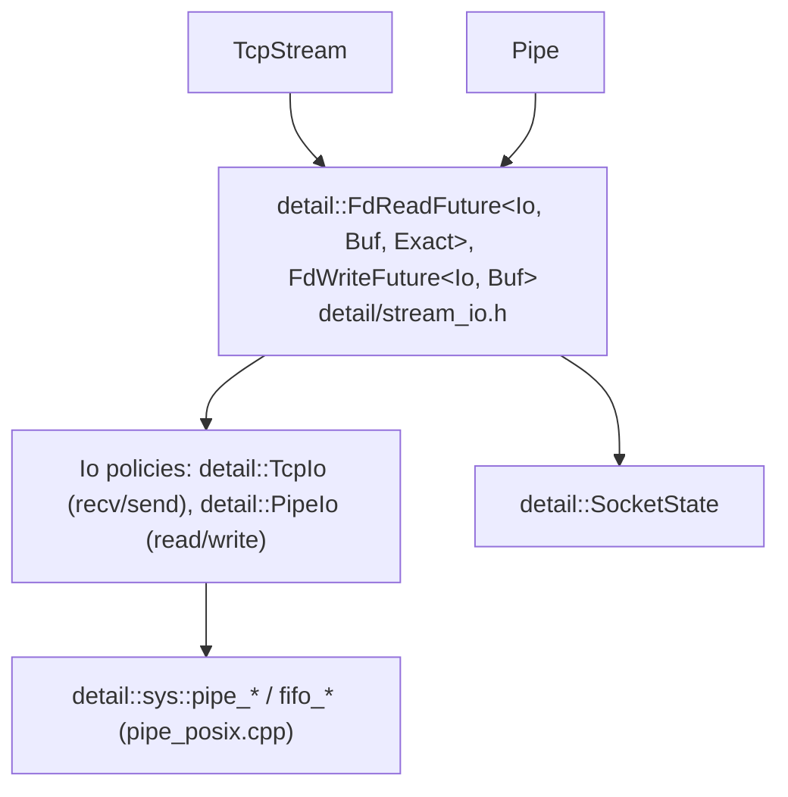
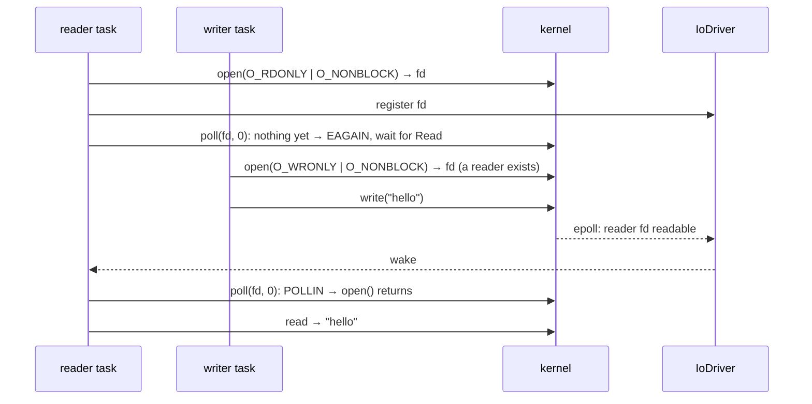

# Pipe — Named FIFOs

`Pipe` is an async handle to one end of a named pipe (a FIFO created with `mkfifo`). It
has the same shape as [`TcpStream`](tcp_stream.md): every operation is a non-blocking
syscall on the calling thread, and an operation that would block waits for readiness
from the [I/O Driver](io_driver.md). Reads and writes are the same leaf futures TCP uses.

Desktop only. `pipe.h` and `pipe.hpp` are excluded from the Pico install.

---

## Goals

- **One byte-stream implementation.** `Pipe` reuses TCP's read and write futures through
  an `Io` policy. Only opening a FIFO is pipe-specific.
- **No allocation in the common case.** A read of buffered data, or a write that fits
  the pipe buffer, completes on the first `poll()` without suspending.
- **EOF means EOF.** A 0-byte read means every writer has gone, never "no writer has
  arrived yet" (see [Opening](#opening-the-fifo-rendezvous)).
- **Safe to drop.** Dropping a pending `open()` or `read()` loses nothing.

## Non-goals

- **Queueing work before awaiting.** Nothing starts until its future is polled, and only
  one read and one write may be in flight. Several writes in a row are sequential
  `co_await`s, and each that fits the pipe buffer completes on its first poll, so there
  is no batching to amortise.
- **Anonymous pipes** (`pipe(2)`) and **process spawning.**

---

## API

```cpp
#include <coro/io/pipe.h>

co_await coro::Pipe::create("/tmp/samples.fifo");        // mkfifo; existing file is fine

// Producer
auto out = co_await coro::Pipe::open("/tmp/samples.fifo", coro::PipeMode::Write);
co_await out.write(std::string("hello"));

// Consumer
auto in = co_await coro::Pipe::open("/tmp/samples.fifo", coro::PipeMode::Read);
auto [n, buf] = co_await in.read(std::vector<std::byte>(4096));   // 0 once writers close
```

| Method | Returns | Output |
|---|---|---|
| `static create(path, permission = 0666)` | `Coro<void>` | `mkfifo`; an existing file at `path` is accepted, whatever its type |
| `static open(path, mode)` | `Coro<Pipe>` | the open end; see [Opening](#opening-the-fifo-rendezvous) |
| `read(buf)` | `PipeReadFuture<Buf, false>` | `{bytes_read, buf}` after the first non-empty chunk; 0 at EOF |
| `read_exact(buf)` | `PipeReadFuture<Buf, true>` | `{bytes_read, buf}` once `buf` is full; fewer only at EOF |
| `write(buf)` | `PipeWriteFuture<Buf>` | `buf`, once the kernel has accepted every byte |

`PipeMode` is `Read`, `Write` or `ReadWrite`. Errors are `std::system_error`, thrown at
`co_await`. `open` throws `std::logic_error` on a `Runtime` whose executor never turns
the driver. `create` makes no I/O and works anywhere.

Writes of at most `PIPE_BUF` bytes (4096 on Linux) are atomic with respect to other
writers of the same FIFO; larger ones may interleave with theirs.

!!! danger "WARNING: a write after the reader closed raises SIGPIPE"
    `write(2)` has no per-call flag like `send()`'s `MSG_NOSIGNAL`, so a `Pipe` write to
    a FIFO whose reader has gone raises SIGPIPE, which kills the process by default.
    Applications that write to pipes should ignore it (`signal(SIGPIPE, SIG_IGN)`); the
    write then throws `EPIPE`.

---

## Layers



- **Shared futures.** `PipeReadFuture` and `PipeWriteFuture` are aliases of
  `FdReadFuture` and `FdWriteFuture` with `detail::PipeIo`, which names `pipe_try_read`
  and `pipe_try_write` and the `"Pipe::..."` error prefixes. A FIFO isn't a socket, so it
  uses `read`/`write` where TCP uses `recv`/`send`. The futures, and what dropping each
  one does to the byte stream, are described in
  [TCP Stream, "Byte-stream futures"](tcp_stream.md#byte-stream-futures).
- **State.** `Pipe` holds a `shared_ptr<detail::SocketState>`, like a socket. A FIFO fd
  needs exactly the same register, then deregister-and-close handling; only the type's
  name is socket-specific. Each future copies the pointer, so the fd outlives any
  syscall made on it.

### The `sys/pipe.h` seam

| Function | Kind | POSIX implementation |
|---|---|---|
| `fifo_create(path, permission)` | setup, throws | `mkfifo`; `EEXIST` is not an error |
| `fifo_open_read(path)` | setup, throws | `open(O_RDONLY \| O_NONBLOCK \| O_CLOEXEC)` |
| `fifo_open_read_write(path)` | setup, throws | `open(O_RDWR \| O_NONBLOCK \| O_CLOEXEC)` |
| `fifo_try_open_write(path)` | non-blocking | `open(O_WRONLY \| O_NONBLOCK \| O_CLOEXEC)`; `ENXIO` means no reader yet |
| `fifo_try_writer_seen(fd)` | non-blocking | zero-timeout `poll()` for `POLLIN` or `POLLHUP`; `EAGAIN` if neither |
| `pipe_try_read(fd, ...)` | non-blocking | `read`, retrying `EINTR` |
| `pipe_try_write(fd, ...)` | non-blocking | `write`, retrying `EINTR` |

---

## Opening: the FIFO rendezvous

A blocking `open()` of a FIFO waits for the other end. With `O_NONBLOCK`, which the
driver needs, the two ends behave differently, and neither gives a readiness event when
the other end arrives:

| Mode | Non-blocking `open` | What `Pipe::open` does |
|---|---|---|
| `Write` | fails with `ENXIO` until a reader has the FIFO open | Retries on a timer: `sleep_for` from 1 ms, doubling up to 50 ms. |
| `Read` | succeeds at once, but until a writer arrives `read` returns 0, as if at EOF | Opens, registers, then waits with `poll_io(Read, fifo_try_writer_seen)`. Data (`EPOLLIN`) or the writer closing (`EPOLLHUP`) wakes it. |
| `ReadWrite` | succeeds at once; never reads EOF (it is a writer itself) | No wait. |



Linux reports `POLLHUP` on a FIFO's read end only once a writer has come and gone since
that end was opened, never for "no writer yet". That is what makes the read-side probe
work. So `open(Read)` returns once a writer has written data, or has opened and closed
again, and after that a 0-byte read really means every writer is gone.

!!! note "NOTE: `open(Read)` is not exactly a blocking open"
    A blocking open returns as soon as a writer opens. Here a writer that opens and
    writes nothing yet keeps the reader in `open()` until it writes or closes. For a
    one-way pipe the reader's first `read()` would wait for that data anyway, so only the
    point where the wait happens moves.

`open` is a `Coro`. The read-side wait is a private leaf future, `WriterSeenFuture`, and
the write-side wait is a `sleep_for`, so dropping a pending `open()` in either mode just
drops the `SocketState` or the timer: nothing is left open.

!!! tip "TODO: replace the write-open retry timer"
    The retry timer is the only place `Pipe` polls. A reader-side `inotify` watch on the
    FIFO could wake the writer instead, if a workload needs writer opens to complete
    faster than within 50 ms of the reader arriving.

---

## Races

- **Write-open retry.** A reader that opens just after a failed attempt is seen on the
  next retry, at most 50 ms later. Benign; commented in `pipe.cpp`.
- **Read-open probe.** A writer that wrote, or came and went, before the registration is
  seen on the first poll, because readiness starts set. Other platforms may report
  `POLLHUP` for "no writer yet", which would end the wait at once and turn the first read
  into an early EOF. Commented in `pipe_posix.cpp`; only the Linux behaviour is relied on
  today.
- **SIGPIPE.** See the warning under [API](#api).
- **One read and one write at once.** Allowed (it only makes sense in `ReadWrite` mode).
  Two reads or two writes at once are not supported, as for
  [TCP](tcp_stream.md#races).
- **Pipe dropped while a future is pending.** The future's share of `SocketState` keeps
  the fd open and registered until it completes or is dropped.

!!! tip "TODO: suppress SIGPIPE on `Pipe` writes if a user needs it"
    The standard trick is to block SIGPIPE on the calling thread around the write, then
    consume a SIGPIPE the write raised with a zero-timeout `sigtimedwait` (only if one
    wasn't already pending). That is two or three extra syscalls per write, so it waits
    for a user who can't ignore SIGPIPE process-wide.

---

## Tests

`test/io/test_pipe.cpp` (`test_pipe`). FIFOs live in the temp directory, named with the
test process's pid. `static_assert`s check that the futures are `Future`s and not
`Cancellable`.

| Test | Checks |
|---|---|
| `CreateMakesFifo`, `CreateIdempotent` | `create` makes a FIFO; a second `create` is not an error. |
| `WriteAndRead{WorkStealing,CurrentThread}` | The reader is spawned first and its `open` waits for the writer; the data arrives. |
| `ReaderGetsEofAfterWriterCloses` | Data, then 0 once the writer closes. |
| `MultipleWritesInOrder` | Three sequential writes arrive in order. |
| `LargeWriteCompletesInPieces{WorkStealing,CurrentThread}` | A 1 MiB `write()`, far beyond the 64 KiB pipe buffer, waits for write readiness repeatedly and arrives intact. |
| `ReadWriteModeNeverWaits` | `ReadWrite` opens at once and reads back its own write. |
| `WriterOpenWaitsForReader` | A writer opened before any reader retries until one arrives 30 ms later. |
| `ReaderOpenSeesWriterThatWroteNothing` | A writer that opens and closes without writing ends the reader's `open`; the first read is EOF. |
| `OpenNonExistentThrows` | `ENOENT` in all three modes. |
| `DroppedOpenLeavesNothingOpen` | `open(Write)` and `open(Read)` dropped by a timeout mid-wait; the FIFO still works afterwards. |
| `OpenThrowsWithoutDriver` | `open` throws `std::logic_error` without a driver; `create` still works. |
| `WriteAfterReaderClosedThrowsEpipe` | With SIGPIPE ignored, the write throws `EPIPE`. |
| `DroppedReadLosesNoData` | A `read` dropped mid-wait consumes nothing. |

---

## Files

| File | Contents |
|---|---|
| `include/coro/io/pipe.h`, `pipe.hpp`, `src/io/pipe.cpp` | `PipeMode`, `PipeIo`, `Pipe`, `WriterSeenFuture` |
| `include/coro/detail/sys/pipe.h`, `src/detail/sys/pipe_posix.cpp` | FIFO backend seam |
| `include/coro/detail/stream_io.h` | `FdReadFuture`, `FdWriteFuture` (shared with `TcpStream`) |
| `test/io/test_pipe.cpp` | Tests |
