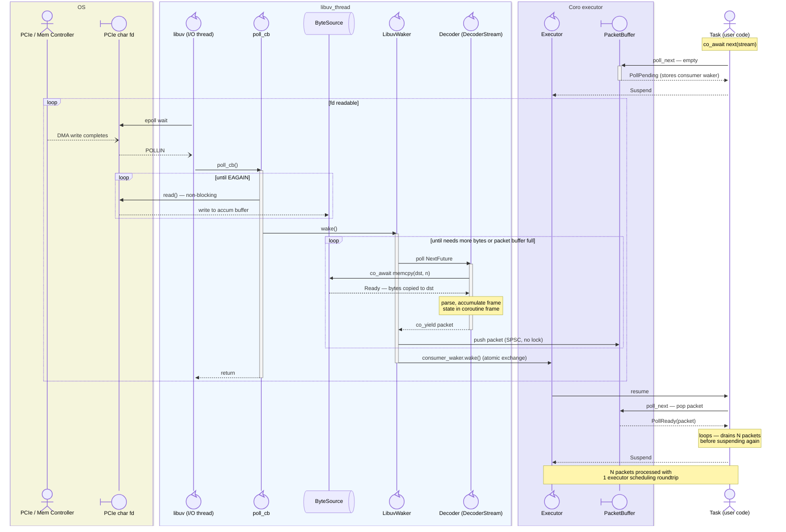
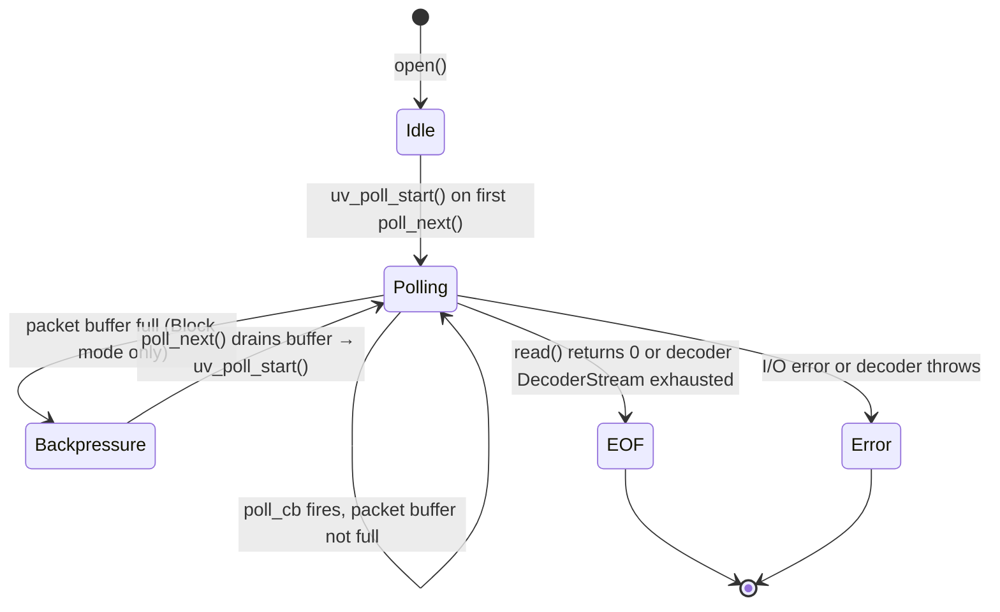

# Poll-based Streams

Design document for `PollStream<T>` — a buffered `Stream<T>` adapter for pollable file
descriptors (character devices, pipes, Unix sockets, serial ports) using `uv_poll_t`.

---

## Overview

`PollStream<T>` provides an efficient `Stream<T>` interface for reading framed data from
pollable file descriptors. It is designed for **event-driven I/O** on fds that support
`epoll()`/`poll()` semantics, as opposed to the threadpool-based `File` class which uses
`uv_fs_read()` for regular disk files.

Primary motivation: reading a continuous stream of variable-length, multi-header packets
from a PCIe character device with minimal latency and executor overhead.

### Key Design Goals

1. **Event-driven, not polled** — `uv_poll_t` notification; no threadpool
2. **Zero executor overhead for decoding** — decoder runs directly on the libuv I/O thread; no task wakeup per read
3. **Amortised scheduling cost** — packet buffer allows one executor resumption to drain multiple decoded packets
4. **Backpressure** — automatic flow control via `uv_poll_stop` / `uv_poll_start`
5. **Expressive decoder interface** — decoder is a `DecoderStream<T>`; sequential coroutine code replaces explicit state machines
6. **Type erasure** — `PollStream<T>` templates only on the packet type, not on the decoder
7. **Extensible decoder** — decoder accepts arbitrary user-defined arguments via explicit parameters; factory lambda bridges open() to the decoder

---

## Problem Statement: Executor Scheduling Overhead

### The PCIe Character Device Use Case

The device streams variable-length packets through a PCIe character device
(`/dev/pcie_data`). Each packet has a multi-stage framing protocol:

1. **Primary header** (16 bytes, fixed) — packet type, flags, payload length
2. **Optional secondary header** (16 bytes, conditional) — present if flag set in primary header
3. **Payload** (variable, 4 KB – 128 KB) — actual data, size specified in primary header
4. **Footer** (16 bytes, fixed pattern) — synchronisation marker for framing error detection

```
┌─────────────┬──────────────┬──────────────┬─────────┐
│ Header1     │ Header2?     │ Payload      │ Footer  │
│ 16 bytes    │ 0 or 16 bytes│ 4KB – 128KB  │ 16 bytes│
└─────────────┴──────────────┴──────────────┴─────────┘
```

### Why `uv_fs_read` Is the Wrong Tool

The existing `File` class uses `uv_fs_read()`, which dispatches every read to libuv's
threadpool. Each packet incurs a threadpool context switch plus executor scheduling
overhead. For a stream producing thousands of packets per second this becomes the
dominant cost.

PCIe character devices are **pollable** — they support `epoll()`/`poll()` and signal
`POLLIN` when data is ready. `uv_poll_t` can therefore notify us immediately when the fd
is readable, allowing non-blocking reads directly in the event loop callback with no
threadpool involved.

---

## Architecture

### High-Level Design

The central idea is that the **decoder is a `DecoderStream<T>`** driven directly on the
libuv I/O thread by a custom `LibuvWaker`. The libuv thread acts as the executor for the
decoder coroutine — no task scheduler involvement on the hot path.

There are two distinct thread contexts with clearly separated state:

- **libuv I/O thread** — owns `ByteSource`, `LibuvWaker`, and the decoder `DecoderStream`.
  No locks needed for any of this state.
- **Executor thread** — owns the consumer task. Shares only the decoded packet buffer,
  `consumer_waker`, `eof`, and `error` with the I/O thread.



### ByteSource — Byte Delivery to the Decoder

`ByteSource` is the interface through which the decoder coroutine receives bytes. It is
owned by `PollStream::State` and lives entirely on the libuv I/O thread.

Internally it holds:
- An **accumulation buffer** (ring buffer, e.g. 256 KB) — raw bytes from the fd. Written
  by `poll_cb` via non-blocking `read()`. Read by the decoder via `src.read(n)` futures.
  Private to the libuv thread; no locking.
- A **stored decoder waker** — when `src.read(n)` returns Pending (no bytes available),
  it stores the waker. This waker is always a `LibuvWaker` clone (see below), so calling
  it is equivalent to re-driving the decoder.

For fixed-size reads (headers, footers, fixed-width fields) the decoder calls
`co_await src.memcpy(dst, n)`, which copies exactly `n` bytes into `dst` and resolves
only when all `n` bytes have been delivered — looping over ring-buffer wrap boundaries
internally. For variable-length or large payloads where the destination is managed by the
caller, `co_await src.read(n)` returns up to `n` contiguous bytes with `read(2)` semantics;
the decoder calls `consume(n)` after use and loops as needed. `poll_cb` refills the buffer
and calls `LibuvWaker::wake()`, which re-polls the decoder.

### LibuvWaker — the libuv Thread as Executor

`LibuvWaker` is a custom `Waker` subclass. Its `wake()` method is the mini-executor that
drives the decoder coroutine inline on the libuv I/O thread:

```
LibuvWaker::wake():
    if not on libuv thread:
        uv_async_send(pending_wake_handle)  // dispatch to libuv thread; return
        // async callback will call wake() again on the libuv thread

    create Context containing a clone of this waker
    loop:
        result = decoder_next.poll(ctx)
        case Ready(Some(packet)): push to packet_buffer (SPSC, no lock); continue
        case Ready(None):         signal eof; break
        case Pending:             break
        case Error:               store error; break
    if packets added, eof, or error:
        atomically exchange consumer_waker; call waker->wake() outside any lock
```

No scheduler queue, no thread hop on the hot path. The decoder runs to completion or
suspension inline. The final `consumer_waker->wake()` is the only cross-thread call.

---

## Thread Safety Model

### Invariant

**The decoder coroutine must only resume on the libuv I/O thread.** Since
`LibuvWaker::wake()` is the only entity that drives `decoder_next.poll(ctx)`, and since
`ByteSource` futures always store a `LibuvWaker` clone as their waker, the invariant holds
automatically for decoders that only `co_await` ByteSource futures — the common and
intended case.

### What Happens if the Decoder Awaits a Non-ByteSource Future

This is **not a supported use case** and will likely stall the decoder permanently.

If a decoder coroutines `co_await`s something other than a `ByteSource` future (e.g. a
channel receive, a timer), that future stores the `Context`'s waker — a `LibuvWaker`
clone. When the future is fulfilled on another thread, it calls `LibuvWaker::wake()` from
that thread. This violates the invariant and is not safe.

The failure mode is not a crash or a small delay — it is a **permanent stall**:

1. The foreign-thread `wake()` call has no way to drive the decoder safely. The decoder
   is suspended, and `uv_poll_t` may be stopped (backpressure). There is no mechanism
   outside of `poll_cb` to restart polling or deliver bytes.
2. Even if a `uv_async_t` callback were used to bounce back to the libuv thread, the
   decoder would resume and immediately hit the next `co_await src.memcpy(...)` —
   which suspends again because the accumulation buffer is empty and polling is stopped.
   `uv_poll_start` is only called from `poll_next` on the consumer side; nothing in the
   async callback path can restart it.
3. The decoder stalls indefinitely. It may eventually unblock if the consumer coincidentally
   drains the packet buffer and restarts polling, but this is not guaranteed.

In debug builds, `LibuvWaker::wake()` should assert that it is called on the libuv thread,
turning the silent stall into an immediate assertion failure.

### Enforcement: Compile-time via `await_transform`

The `ByteSource`-only constraint is enforced at compile time using a dedicated coroutine
return type `DecoderStream<T>`. Its promise type, `DecoderCoroPromise<T>`, overrides
`await_transform` to accept only `ByteSource`-produced awaitables:

```cpp
// In DecoderCoroPromise<T>:
template<ByteSourceFuture F>
auto await_transform(F&& f) { return base_promise::await_transform(std::forward<F>(f)); }

template<typename F> requires (!ByteSourceFuture<std::remove_cvref_t<F>>)
void await_transform(F&&) = delete;  // hard compile error for anything else
```

Because `DecoderCoroPromise<T>` defines `await_transform`, it hides all base class
overloads via name hiding — no base `Future` overloads are visible inside a
`DecoderStream` coroutine body. The explicit `= delete` catch-all ensures a clear
diagnostic ("call to deleted function") rather than an ambiguous "no matching function"
error.

`open()` requires `DecoderFactory` to return `DecoderStream<T>`, enforcing the restriction
at the call site. `CoroStream<T>` is unchanged and remains available for unrestricted use.

`DecoderCoroPromise<T>` inherits `CoroStream<T>::promise_type` as its sole direct base.
`get_return_object()` upcasts `*this` to the base and calls `from_promise` on it —
valid because single non-virtual inheritance guarantees both share the same address. A
`static_assert(!is_virtual_base_of_v<...>)` guards against future regressions in the
inheritance hierarchy.

`DecoderStream<T>` publicly inherits `CoroStream<T>` with only a `promise_type` override
and no added data members, so it can be move-constructed into a `CoroStream<T>` wherever
the infrastructure expects one.

### SPSC Packet Buffer — Eliminating Locks on the Hot Path

The packet buffer is written exclusively by the libuv I/O thread (`LibuvWaker::wake()`)
and read exclusively by the executor thread (`poll_next()`). This is a classic
**single-producer / single-consumer (SPSC)** queue; no mutex is needed for push/pop.

The only remaining shared state requiring synchronisation is:

| Field | Access pattern | Synchronisation |
|---|---|---|
| `consumer_waker` | Written by executor (`poll_next`), read-cleared by libuv (`wake()`) | `atomic<shared_ptr<Waker>>` or lock-free exchange |
| `error` | Written by libuv (`poll_cb`/`wake()`), read once by executor | One-shot atomic flag + `std::exception_ptr` |
| `eof` | Written by libuv, read by executor | `std::atomic<bool>` |
| `polling` | Written and read by libuv only | No synchronisation needed |

All hot-path operations (push packet, pop packet) are therefore lock-free. A lock is only
needed for the infrequent error/EOF path.

---

## API Design

### ByteSource

```cpp
class ByteSource {
public:
    /// Copies exactly n bytes into dst. Resolves only after all n bytes have been
    /// delivered, looping across ring-buffer wrap boundaries internally.
    /// Use for fixed-size reads: headers, footers, fixed-width fields.
    [[nodiscard]] MemcpyFuture memcpy(void* dst, std::size_t n);

    /// Returns a Future<std::span<const std::byte>> with up to max_bytes contiguous
    /// bytes — identical semantics to a non-blocking read(2) syscall. Resolves with
    /// [1, max_bytes] bytes when data is available; suspends when the buffer is empty.
    /// May return fewer than max_bytes at a ring-buffer wrap boundary.
    /// Call consume(n) after processing the returned span.
    /// Use for variable-length or large reads where the caller manages the destination.
    [[nodiscard]] ReadFuture read(std::size_t max_bytes);

    /// Advance the read pointer by n bytes, releasing that space in the ring buffer.
    void consume(std::size_t n);
};
```

`ByteSource` is **not copyable or movable** after being passed to the decoder factory —
the decoder coroutine frame holds a reference to it throughout its lifetime.

### PollStream

```cpp
template<typename T>
class PollStream {
public:
    /// Opens a pollable file descriptor and wraps it as a Stream<T>.
    ///
    /// decoder_factory: any callable with signature DecoderStream<T>(ByteSource&)
    ///   Called once during open(). The ByteSource reference is valid for the
    ///   lifetime of the PollStream.
    /// options:   buffer sizes and backpressure policy
    /// uv_exec:   executor owning the uv_loop (defaults to current thread's)
    template<typename DecoderFactory>
    [[nodiscard]] static PollStream open(
        int                       fd,
        DecoderFactory            decoder_factory,
        PollStreamOptions         options  = {},
        SingleThreadedUvExecutor* uv_exec  = nullptr
    );

    /// Stream concept interface — poll for the next decoded packet.
    PollResult<std::optional<T>> poll_next(detail::Context& ctx);

    /// Stops polling and closes the fd. Called by destructor.
    void close();

    PollStream(PollStream&&) noexcept;
    PollStream& operator=(PollStream&&) noexcept;
    PollStream(const PollStream&)            = delete;
    PollStream& operator=(const PollStream&) = delete;
    ~PollStream();

private:
    struct State;
    std::shared_ptr<State>    m_state;
    SingleThreadedUvExecutor* m_uv_exec = nullptr;
};
```

`DecoderFactory` is any callable with signature `DecoderStream<T>(ByteSource&)`. It is
called once inside `open()`, receives the `ByteSource` owned by `State`, and returns the
decoder. The factory is not stored after `open()` completes.

### DecoderStream and DecoderCoroPromise

```cpp
/// Tag base inherited by all ByteSource-produced future types.
struct ByteSourceFutureTag {};

/// Concept satisfied by MemcpyFuture, ReadFuture, and any future ByteSource futures.
template<typename F>
concept ByteSourceFuture =
    std::is_base_of_v<ByteSourceFutureTag, std::remove_cvref_t<F>>;

/// Promise for DecoderStream<T>. Inherits all of CoroStream<T>::promise_type
/// except get_return_object() and await_transform().
template<typename T>
struct DecoderCoroPromise : CoroStream<T>::promise_type {
    using base_promise = typename CoroStream<T>::promise_type;

    DecoderStream<T> get_return_object();   // returns DecoderStream<T> via base upcast

    template<ByteSourceFuture F>
    auto await_transform(F&& f) { return base_promise::await_transform(std::forward<F>(f)); }

    template<typename F> requires (!ByteSourceFuture<std::remove_cvref_t<F>>)
    void await_transform(F&&) = delete;     // co_await of non-ByteSource future: compile error
};

/// Coroutine return type for PollStream decoders.
/// Identical to CoroStream<T> except its promise restricts co_await to ByteSource futures.
/// Can be move-constructed into CoroStream<T> (no added data members).
template<typename T>
class DecoderStream : public CoroStream<T> {
public:
    using promise_type = DecoderCoroPromise<T>;
    using CoroStream<T>::CoroStream;
};
```

### PollStreamOptions

```cpp
struct PollStreamOptions {
    BackpressureMode backpressure   = BackpressureMode::Block;
    std::size_t      packet_buf_cap = 64;       // decoded packets (SPSC ring buffer)
    std::size_t      accum_buf_cap  = 256'384;  // raw bytes (~256 KB)
};

enum class BackpressureMode { Block, Overrun };
```

---

## Decoder with Custom Arguments

The decoder coroutine accepts any extra arguments as **explicit parameters**. The factory
(a regular, non-coroutine lambda) captures those values and passes them at call time.
Because the factory is not a coroutine, capturing by value is safe — the closure is not
subject to the dangling-capture rules that apply to coroutine lambdas.

```cpp
// Decoder with user-defined configuration passed as an explicit parameter.
// The parameter lives in the coroutine frame — safe across suspension points.
coro::DecoderStream<PciePacket> pcie_decoder(coro::ByteSource& src, PcieConfig cfg) {
    for (;;) {
        PciePacket::Header1 h1;
        co_await src.memcpy(&h1, sizeof(h1));
        // ...use cfg for protocol-specific decisions...
        co_yield make_packet(h1, cfg);
    }
}

// The factory is an ordinary (non-coroutine) lambda that captures cfg by value.
// It calls pcie_decoder with the captured config, which is then moved into
// the decoder coroutine's frame as a parameter.
PcieConfig cfg = load_config();
auto stream = coro::PollStream<PciePacket>::open(
    fd,
    [cfg](coro::ByteSource& src) { return pcie_decoder(src, cfg); }
);
```

**Multiple custom arguments** work the same way — add parameters to the decoder function
and capture them in the factory closure.

---

## Example: PCIe Decoder as a DecoderStream

The decoder is ordinary sequential coroutine code. The coroutine frame implicitly carries
all partial-frame state across `co_await` suspension points — there is no explicit state
machine enum to manage.

```cpp
// In examples/io/pcie_decoder.h

struct PciePacket {
    struct Header1 {
        uint32_t magic;
        uint16_t flags;           // bit 0: has_header2
        uint16_t payload_length;  // bytes, 4 KB – 128 KB
        uint64_t timestamp;
    } header1;

    std::optional<struct Header2 {
        uint64_t sequence_number;
        uint64_t reserved;
    }> header2;

    std::vector<std::byte> payload;

    struct Footer {
        uint64_t magic1;  // expected: 0xDEADBEEFCAFEBABE
        uint64_t magic2;  // expected: 0x0123456789ABCDEF
    } footer;
};

coro::DecoderStream<PciePacket> pcie_decoder(coro::ByteSource& src) {
    for (;;) {
        PciePacket pkt;

        co_await src.memcpy(&pkt.header1, sizeof(pkt.header1));

        if (pkt.header1.payload_length < 4096 ||
            pkt.header1.payload_length > 128 * 1024)
            throw std::runtime_error("invalid payload length");

        if (pkt.header1.flags & 0x01) {
            pkt.header2.emplace();
            co_await src.memcpy(&*pkt.header2, sizeof(PciePacket::Header2));
        }

        // Payload — pre-allocate destination; memcpy loops internally across wrap boundaries
        pkt.payload.resize(pkt.header1.payload_length);
        co_await src.memcpy(pkt.payload.data(), pkt.header1.payload_length);

        co_await src.memcpy(&pkt.footer, sizeof(pkt.footer));

        if (pkt.footer.magic1 != 0xDEADBEEFCAFEBABEULL ||
            pkt.footer.magic2 != 0x0123456789ABCDEFULL)
            throw std::runtime_error("footer magic mismatch — frame sync lost");

        co_yield std::move(pkt);
    }
}

// Type alias for convenience:
using PcieStream = coro::PollStream<PciePacket>;

// Usage:
auto stream = PcieStream::open(
    ::open("/dev/pcie_data", O_RDONLY | O_NONBLOCK),
    pcie_decoder
);
```

The coroutine replaces the explicit `ReadingHeader1 / ReadingHeader2 / ReadingPayload /
ReadingFooter` state machine. Each `co_await src.memcpy(...)` is a potential suspension
point — if no bytes are buffered the decoder suspends and resumes when `poll_cb`
delivers more. Ring-buffer wrap boundaries are handled transparently inside `memcpy`;
the coroutine frame carries all partial-copy state across suspensions.

---

## Implementation Details

### Internal State

```
PollStream<T>::State:
    // libuv I/O thread only — no synchronisation needed
    uv_poll_t                          poll_handle
    int                                fd
    ByteSource                         byte_source
    LibuvWaker                         libuv_waker
    NextFuture<DecoderStream<T>>       decoder_next

    // Shared: written by libuv, read by executor
    SpscRingBuffer<T>                  packet_buffer   // lock-free SPSC
    std::atomic<std::shared_ptr<Waker>> consumer_waker // atomic exchange
    std::atomic<bool>                  eof{ false }

    // Shared: error path only (infrequent)
    std::mutex                         error_mutex
    std::exception_ptr                 error
```

```
ByteSource:
    CircularBuffer                     accum_buffer   // libuv thread only
```

**Thread safety:**
- `byte_source`, `decoder_next`, `poll_handle` are exclusively accessed on the libuv
  thread.
- `packet_buffer` (push side) is written on the libuv thread; (pop side) on the executor.
  SPSC semantics eliminate the lock.
- `consumer_waker` uses atomic shared_ptr operations for lock-free exchange.
- `eof` uses `std::atomic<bool>`.
- `error` is written at most once (fatal path) and protected by a simple mutex.

### Two-Phase Initialisation of decoder_next

`decoder_next` holds a reference `DecoderStream<T>& m_stream`. It cannot be initialised
until the `DecoderStream` returned by the factory has a stable heap address. `State` is
always allocated via `shared_ptr` and never moved, so the address of `State::decoder` is
stable from construction.

The sequence in `open()`:

1. Allocate `State` via `make_shared` (gives `byte_source` a stable address).
2. Call `decoder_factory(state->byte_source)` → `DecoderStream<T>`. Emplace into
   `State::decoder` (via `std::optional<DecoderStream<T>>`).
3. Emplace `State::decoder_next` with a reference to `*state->decoder`.

Because `State` is never moved after allocation, the reference in `decoder_next` remains
valid for the lifetime of the `PollStream`.

### The `poll_cb` Callback

Runs on the libuv I/O thread when the fd signals `POLLIN`:

1. **Greedy read** — loop calling non-blocking `read()` until `EAGAIN`, writing into
   `byte_source.accum_buffer`. On fd EOF or error: store to atomic flags; stop polling.
2. **Drive decoder** — call `libuv_waker.wake()`. Since we are already on the libuv
   thread, no dispatch is needed; the decoder runs inline.

Phase 2 always runs even after a Phase 1 error, so that bytes already in the accumulation
buffer are decoded and delivered to the consumer before the error surfaces.

### The `poll_next` Method

Called by the executor thread when the consumer task is polled. No locks in the hot path:

1. Check `packet_buffer.pop()` (SPSC, lock-free). If a packet is ready, return it.
   In Block mode, if the buffer has been drained below the restart threshold, submit a
   coroutine to the uv thread to call `uv_poll_start`.
2. Check `eof.load()` and `error` (lock on error only).
3. If nothing ready: atomically store `consumer_waker`; request polling start.

**Key properties:**
- Packets are returned before errors — bytes decoded before a fault reach the consumer.
- No mutex on the hot path (SPSC pop + atomic waker store).
- `consumer_waker->wake()` is called on the libuv thread, outside any critical section.

---

## Backpressure

`PollStreamOptions::backpressure` selects one of two policies:

**`Block` (default)** — When the SPSC packet buffer is full, `LibuvWaker::wake()` stops
polling the decoder (returns from the drive loop without restarting). After the consumer
drains the buffer, `poll_next` submits a coroutine to the uv thread to call
`uv_poll_start`. Correct for sources that can tolerate backpressure.

**`Overrun`** — The fd is drained unconditionally. When the packet buffer is full, the
oldest packet is evicted and an overrun counter is incremented. A
`PollStreamOverrunError{n}` is delivered to the consumer as a non-fatal error before the
next surviving packet. Use when a stalled read would cause a hardware fault.

---

## State Machine



| State | uv_poll active |
|---|---|
| **Idle** | No |
| **Polling** | Yes |
| **Backpressure** | No |
| **EOF** | No |
| **Error** | No |

---

## Comparison: PollStream vs File

| | `File` | `PollStream` |
|---|---|---|
| **API** | `uv_fs_read` | `uv_poll_t` + `read()` |
| **Execution** | Threadpool | Event loop callback |
| **Per-read cost** | High — threadpool round-trip | Low — inline callback |
| **Buffering** | None | Accumulation buffer + packet buffer |
| **Framing** | None | `DecoderStream<T>` decoder |
| **Backpressure** | N/A | `uv_poll_stop` / `uv_poll_start` |
| **Suitable for** | Disk files, random access | Character devices, pipes, sockets |

---

## Generalisation: Other fd Types and Protocols

`PollStream<T>` works for any pollable fd. The decoder factory determines the framing
protocol. Simple examples:

**Fixed-size messages:**

```cpp
template<typename T>
coro::DecoderStream<T> fixed_size_decoder(coro::ByteSource& src) {
    for (;;) {
        T item;
        co_await src.memcpy(&item, sizeof(T));
        co_yield item;
    }
}
```

**Length-prefixed (e.g. Protocol Buffers):**

```cpp
coro::DecoderStream<std::vector<std::byte>> length_prefixed_decoder(coro::ByteSource& src) {
    for (;;) {
        uint32_t len;
        co_await src.memcpy(&len, sizeof(len));
        len = ntohl(len);

        std::vector<std::byte> payload(len);
        co_await src.memcpy(payload.data(), len);
        co_yield std::move(payload);
    }
}
```

**Newline-delimited:**

```cpp
coro::DecoderStream<std::string> line_decoder(coro::ByteSource& src) {
    std::string line;
    for (;;) {
        auto chunk = co_await src.read(4096);
        for (std::byte b : chunk) {
            if (b == std::byte{'\n'}) { co_yield std::move(line); line.clear(); }
            else                      { line += static_cast<char>(b); }
        }
        src.consume(chunk.size());
    }
}
```

---

## Zero-Copy Payload

`src.memcpy(dst, n)` copies bytes from the ring buffer into `dst` — one copy from the
accumulation buffer to the packet struct. For most fields (headers, footers) this is
negligible. For large payloads (e.g. 64 KB PCIe packets at 1,000/sec ≈ 64 MB/sec) it
represents ~64 MB/sec of memory bandwidth.

A zero-copy path is achievable using `src.read(n)` + `consume(n)` directly into a
pre-allocated destination, bypassing the intermediate copy into the accumulation buffer
by reading from the fd directly:

```cpp
pkt.payload.resize(len);
std::size_t received = 0;
while (received < len) {
    auto chunk = co_await src.read(len - received);
    std::memcpy(pkt.payload.data() + received, chunk.data(), chunk.size());
    src.consume(chunk.size());
    received += chunk.size();
}
```

This reduces payload copies from 2 (kernel → accum_buffer → pkt.payload) to 1 (kernel →
pkt.payload) by reading directly from whatever contiguous slice the ring buffer exposes.
The PCIe example uses `src.memcpy` for simplicity; switch to `read` + `consume` here
when payload bandwidth is measured to be a bottleneck.

---

## EOF and Error Signalling

There are two distinct error sources: the fd (EOF or I/O error) and the decoder itself
(framing error, validation failure, explicit throw).

### fd EOF or I/O Error

When the fd closes mid-packet, the decoder's pending `memcpy` or `read` future cannot
be satisfied. `ByteSource` maintains an `eof` flag. When `poll_cb` observes `read() == 0`
or an fd error, it sets this flag before calling `libuv_waker.wake()`.
`MemcpyFuture::poll()` checks the flag: if set mid-copy (destination not yet fully
written), it returns `PollError` wrapping a `std::runtime_error("unexpected EOF")`. The
decoder observes this as a thrown exception, which propagates as an unhandled exception
and is stored in the `DecoderStream` promise. On the next `decoder_next.poll()`,
`LibuvWaker::wake()` sees a `PollError` result, stores it as the stream's fatal error,
and wakes the consumer.

**`read()` at EOF:** Returns an empty span. The decoder can detect this and call
`co_return` to signal clean stream exhaustion (as opposed to a mid-packet truncation).

### Decoder-Thrown Exceptions

When the decoder throws explicitly (e.g. framing error, footer magic mismatch,
out-of-range field), the exception is caught by `CoroStream`'s `unhandled_exception()`
promise hook, which stores it in `m_exception` and allows the coroutine to reach
`final_suspend`. On the next `decoder_next.poll()`, `CoroStream::poll_next()` sees
`m_handle.done()` with `m_exception` set and returns `PollError`. `LibuvWaker::wake()`
propagates this to `State::error` and wakes the consumer, which receives the original
exception via `PollStream::poll_next()` returning `PollError`.

No special handling is needed in `LibuvWaker` or `PollStream` for this case — it flows
through the existing `CoroStream` exception propagation machinery.

---

## Design Questions

1. **Decoder error recovery** — when the decoder throws (framing error), the stream
   faults and is closed. For protocols where resync is possible (e.g. scan for next
   frame delimiter), an optional recovery path could be provided: `stream.reset()`
   re-calls the decoder factory to obtain a fresh `DecoderStream`. This requires storing
   the factory in `State`. Opt-in via `PollStreamOptions::allow_reset = true`.

2. **Write support** — bidirectional fds (pipes, Unix sockets) need a write path. Add
   `UV_WRITABLE` polling and a `co_await stream.write(data)` method.

3. **Multiple simultaneous streams** — each `PollStream` registers an independent
   `uv_poll_t` with the event loop. libuv multiplexes all registered handles under a
   single `epoll` call, so opening 8 simultaneous `PollStream` instances on 8 fds is
   essentially free at the OS level.
