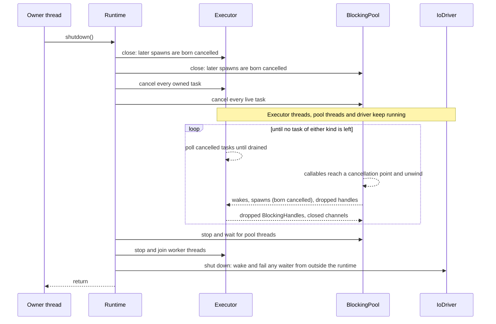
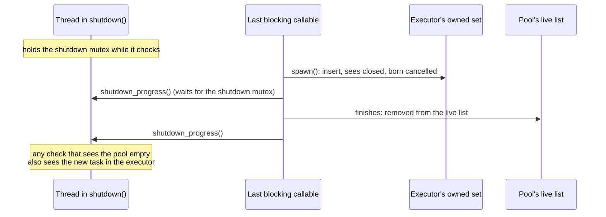
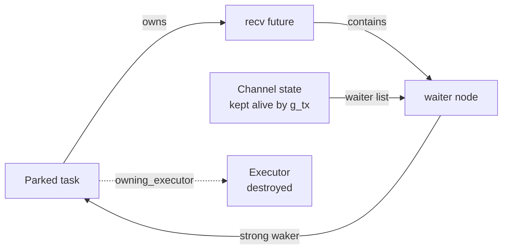
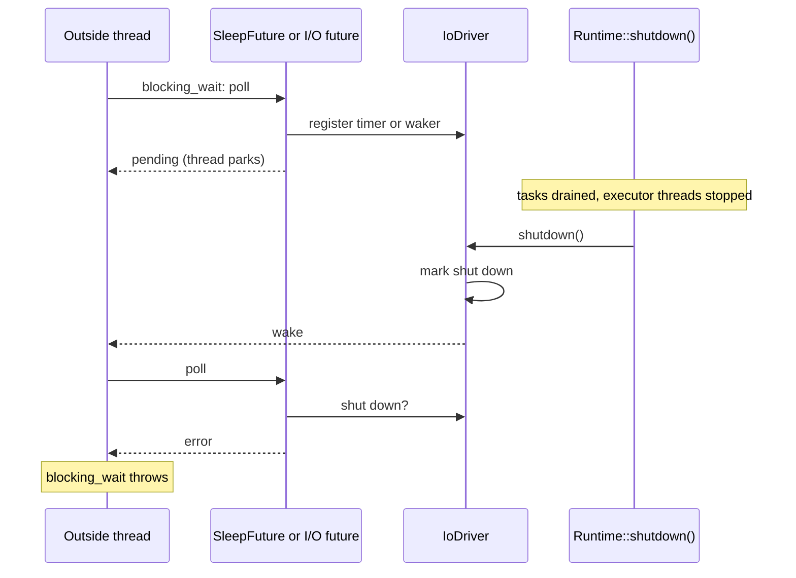

# Runtime shutdown

## Overview

When a `Runtime` shuts down, **every task it still owns is cancelled and drained**:
tasks on the executor and tasks on the blocking pool alike, whether a handle to them is
still held or they were detached. Nothing in the runtime is torn down until both kinds
of task are gone.

A task that is cancelled at shutdown is shut down exactly as one that is cancelled by
dropping its handle: its `Cancellable` futures are cancelled and polled until drained,
its coroutine frame is destroyed, and its scope children are drained (see
[coroutine_scope.md](coroutine_scope.md)). A blocking task is cancelled at its next
cancellation point and unwinds (see [spawn_blocking.md](spawn_blocking.md)).

The rules:

1. **Both kinds are cancelled together, and the runtime keeps running until both are
   empty.** The executor, the blocking pool and the I/O driver all stay fully
   operational for the whole drain.
2. **A task spawned during shutdown is born cancelled.** This holds for `spawn()`,
   `JoinSet::spawn()` and `spawn_blocking()`. The task is still tracked and drained;
   its future is never started, its callable is never called, and its handle reports
   that it was dropped.
3. **Detached tasks are cancelled too.** Detaching gives up the handle, not the
   runtime's ownership.
4. **On a single-thread runtime the thread that shuts the runtime down runs the
   executor**, as the thread that calls `block_on()` does.
5. **Shutdown is an explicit operation, `Runtime::shutdown()`, which the destructor
   calls.**

Shutdown therefore waits for anything that does not respond to cancellation; see [What shutdown still waits for](#what-shutdown-still-waits-for).

## Motivation

A task cannot be destroyed mid-flight. Its coroutine frame may own children that hold
references into it, and its destructors may need other tasks to finish first. That is
why a cancelled task is drained rather than dropped, and it is as true on the last day
of the runtime's life as on any other. A destructor-ordering scheme (destroy the
executor, then the pool) cannot honour it, because the two kinds of task wait on each
other:

- A blocking callable in `blocking_wait(handle)` is waiting for an executor task. When
  it is cancelled it must cancel that task and wait for it to drain, and only the
  executor can drain it.
- A blocking callable can spawn a task, or send on a channel that wakes one, as the
  last thing it does.
- A task being destroyed can drop a `BlockingHandle`, or the receiving end of a channel
  that a blocking callable is waiting on.

Whichever of the two is torn down first, the other can still reach into it. The
scenarios below show what that looked like when the runtime did exactly that.

## Scenarios

Each row is a blocking task that is still live when the runtime shuts down, and what it
is doing at that moment. "Before" is the behaviour of the executor-first destruction
order this design replaced.

| | The blocking callable is… | Before | Now |
|---|---|---|---|
| A | parked in `blocking_wait` on a leaf future (a channel, an event) | Works: the pool cancels it and it unwinds | Same |
| B | waiting on, or already draining, something an executor task must finish: a `JoinHandle`, a `co_invoke` scope with children, a `CoroStream` with children, a `StreamHandle` | **Hangs** in `~BlockingPool`: the executor is gone, so the drain never completes | The executor is still running; the task drains and the callable unwinds |
| C | unwinding, and drops or cancels a `JoinHandle` or `StreamHandle` | **Use after free**: cancelling a task enqueues it on a destroyed executor | The task is cancelled and drained by the running executor |
| D | calling `spawn()` or `JoinSet::spawn()` | **Use after free**: schedules on a destroyed executor | The task is born cancelled (rule 2) and drained; `blocking_wait` on its handle throws `BlockingCancelled` |
| E | finishing, or sending on a channel, and so waking an executor task | **Race** into an executor that is part-way through its destructor | The executor is whole until both kinds of task are gone |
| F | cleaning up under a `BlockingCancelShield` with a timer or socket wait | **Hangs**: nothing turns the I/O driver any more | The driver is still turned; the wait completes |
| G | running, while a task being shut down drops its `BlockingHandle` | Works: the drop requests cancellation and does not wait | Same |
| H | not started: `spawn_blocking` is called after shutdown began | Works: the task is cancelled, the callable is skipped | Same (this is rule 2) |
| I | in a wait that is not a cancellation point and that only a task can end (see [the channel blocking calls](#removing-the-channel-blocking-calls)) | Released only as a side effect of the executor destroying the task that holds the other end | The task is cancelled and drained, which drops its end and releases the wait |

Two consequences beyond the table:

- **Handles and wakers may outlive the runtime.** Once shutdown returns, every task is
  in a terminal state and every future it was running has been destroyed. A
  `JoinHandle`, `StreamHandle` or `BlockingHandle` that is dropped or polled afterwards
  has nothing left to cancel; it reports dropped. A waker that is still held somewhere
  refers to a finished task, and waking a finished task does nothing. See
  [Wakers held outside the runtime](#wakers-held-outside-the-runtime).
- **Cleanup that needs the runtime works.** A task that is draining can still be woken
  by a timer, a socket or a blocking job, because all three are still being serviced.
  This is the guarantee [the drain invariant](task_and_executor.md#the-drain-invariant)
  asks of the executor.

## API

```cpp
class Runtime {
public:
    /// Cancels and drains every task the runtime owns, then stops its threads.
    /// Blocks until that is done. Calling it again does nothing.
    void shutdown() noexcept;

    /// Calls shutdown().
    ~Runtime();
};
```

`shutdown()` exists so that a program can choose where the wait happens, and so that
the wait is visible at the call site instead of hidden in a closing brace:

```cpp
int main() {
    coro::Runtime rt;
    rt.block_on(run());
    rt.shutdown();          // every task has drained once this returns
    flush_logs();
}
```

Calling it is optional; the destructor has the same effect.

### Preconditions

- **No `block_on()` in progress.** `shutdown()` is for the owner of the `Runtime`,
  after its `block_on()` calls have returned.
- **Not from one of the runtime's own threads.** A task or a blocking callable that
  shut down the runtime it runs on would wait for itself. `shutdown()` throws
  `std::logic_error` in that case, and since it is `noexcept` that terminates the
  program: a deadlock made loud. A nested `Runtime` owned by a blocking callable is a
  different runtime and shuts down normally.
- **No other thread is spawning on the `Runtime`.** As for any object being destroyed,
  a thread outside the runtime must not call `spawn()` on it while it shuts down.
  Threads inside the runtime (tasks, blocking callables, destructors run by either)
  may, under rule 2. A thread outside the runtime that is only *waiting* on one of its
  timers or sockets is allowed: its wait ends with an error. See
  [Waiters on the I/O driver from outside the runtime](#waiters-on-the-io-driver-from-outside-the-runtime).

### After shutdown

Once `shutdown()` has returned, the `Runtime` can only be destroyed. `block_on()`,
`spawn()` and `spawn_blocking()` throw `std::runtime_error`, and so does starting a
timer or creating a socket on it.

## Design

### Sequence



Stopping the pool and the executor is the teardown there has always been. It now runs
only once nothing is left that could reach into what it destroys. The last step is for
waiters the runtime does not own; see
[below](#waiters-on-the-io-driver-from-outside-the-runtime). The driver itself is
destroyed by `~Runtime`.

### Knowing when both are empty

"Until both are empty" has to be one condition, checked in one place. A blocking
callable's last act can be to spawn a task, and a task's last act can be to spawn a
blocking job, so two separate "is it empty?" checks can each pass while a task moves
between them.

The runtime does not count tasks to solve this: a count would put one more lock on
every spawn and every completion, for the whole life of the program. Instead each place
that already holds live tasks gains a `closed` flag, under the mutex it already has:

| Holds | Mutex | Closed by |
|---|---|---|
| Work-stealing executor: `OwnedTasks`, one flag per shard | the shard's | `begin_shutdown()` |
| Work-sharing and current-thread executors: the owned set | `m_owned_mutex` | `begin_shutdown()` |
| `BlockingPool`: the live list | the pool's | `begin_shutdown()` |

Closing a set and collecting its tasks for cancellation is one step under that mutex,
so every task is either in the collected set or arrives afterwards and sees the flag.
Once a set is closed:

- **A task added to it is born cancelled** (rule 2), and the thread that added it then
  tells the runtime, by calling `Runtime::shutdown_progress()`.
- **A thread that removes a finished task from it** tells the runtime the same way,
  after the removal.

`shutdown_progress()` takes one mutex, the shutdown mutex, and wakes the thread in
`shutdown()`. That thread evaluates "the executor has no tasks and the pool has no
tasks" with the shutdown mutex held, and stops waiting when it is true.



Why that check cannot pass while a task is in transit: a task can only be spawned by
something that is itself a live task, and the spawner is still in its own set while it
inserts the new one. So at every instant at least one of the two is visible. And the
check cannot be missed, because every removal from a closed set is followed by a
`shutdown_progress()`, which cannot complete between the waiting thread's check and
its wait: both happen with the shutdown mutex held.

Once the check has passed it stays passed. Rule 2 means nothing can add a task except
a task, and there are none.

The lock order is the shutdown mutex first, then a set's mutex. The threads that call
`shutdown_progress()` hold no other lock when they do.

Before shutdown begins nothing is closed, so no thread calls `shutdown_progress()` and
the spawn and completion paths cost what they did before: one read of a flag under a
mutex that was already taken.

!!! note "NOTE: why spawns during shutdown are cancelled, not refused"
    Refusing (throwing from `spawn()`) would throw out of destructors and out of
    callables that are already unwinding. Dropping the future on the spot would destroy
    a `Cancellable` future without draining it. Creating the task cancelled gives it
    the ordinary path: the executor polls it once, sees that it is cancelled, shuts its
    future down and marks it done. A coroutine that was never started owns only its
    arguments, so that is cheap.

### Who runs the executor

| Runtime | During the drain |
|---|---|
| Multi-thread (`WorkStealingExecutor`, `WorkSharingExecutor`) | The worker threads keep running and keep turning the I/O driver. The thread in `shutdown()` waits on a condition variable until both are empty. |
| Single-thread (`CurrentThreadExecutor`) | Nothing runs unless a thread is inside the executor's loop. The thread in `shutdown()` runs that loop, with the runtime set as the thread's current runtime, exactly as `block_on()` does, until both are empty. It parks in the I/O driver between polls, so timers, sockets and wakes from pool threads all reach it; `shutdown_progress()` unparks it. |

On a single-thread runtime this is also the first time tasks that were spawned and left
behind by the last `block_on()` get to run at all. They run only to be shut down.

!!! note "NOTE: Pico"
    The Pico build has the same `CurrentThreadExecutor` and no blocking pool. The same
    rule applies there, for executor tasks only. Firmware that never
    destroys its `Runtime` is unaffected.

### Wakers held outside the runtime

A channel whose other end lives outside the runtime (in a global, in `main()`, on a
user thread) holds wakers for the tasks parked on it. That used to crash at exit:

```cpp
std::optional<coro::BroadcastSender<std::string>> g_tx;   // destroyed after main()

int main() {
    coro::Runtime rt;
    rt.block_on(serve());   // leaves tasks parked in rx.recv()
}                           // ~Runtime, then later ~g_tx: wakes a parked task
```



A parked task is kept alive by its own waker: the task owns the future, the future
contains the waiter node, and the node holds a strong reference back to the task. When
the executor is destroyed it releases its reference, but the task is not destroyed, so
its future never unlinks the node. The task is left idle, still on the channel's waiter
list, pointing at an executor that no longer exists. When the sender is finally
destroyed it wakes its waiters, and `wake()` enqueues the task on that executor.

Draining removes the cause. A task that is cancelled at shutdown has its future
destroyed, which unlinks the node and releases the waker, and the task is marked done.
Nothing is left on the waiter list, and a waker that some other code still holds
refers to a done task, for which `wake()` returns without touching the executor.

No change to how futures hold wakers is needed, and none is made: the rule that keeps
this safe is that **no task is left non-terminal when the executor goes away**, which
is rule 1.

### Waiters on the I/O driver from outside the runtime

That covers wakers that point *into* the runtime. The opposite direction needs its own
step. A waiter that is neither a task nor a blocking callable of this runtime can still
be parked on its I/O driver:

- a thread the application created, which called `set_current_runtime(&rt)` and is in
  `blocking_wait(coro::sleep_for(...))`, or which is in `blocking_wait()` on a socket
  future of this runtime;
- a task of a second runtime that awaits a socket belonging to this one.

Shutdown does not cancel such a waiter and does not wait for it: it owns neither. But
once the executor's threads have stopped, nothing turns the driver, so the timer would
never fire and the readiness would never arrive. The waiter would stay parked for good.

So the last step of `shutdown()` is `IoDriver::shutdown()`, which tells every waiter
still registered that the driver is finished:

| Waiting on | What `IoDriver::shutdown()` does | What the waiter's next poll gets |
|---|---|---|
| A socket, pipe or signal (`IoRegistration`) | Marks the registration shut down and wakes its reader and writer | `std::system_error` with `std::errc::operation_canceled` |
| A timer (`sleep_for`, `timeout`, `IntervalTimer`) | Removes every timer and wakes its waker, whatever the deadline | `std::runtime_error` |

An operation started afterwards fails the same way, at once: a timer or a new socket
throws `std::runtime_error`, and I/O on an existing socket reports
`operation_canceled`.

No task of the runtime itself ever sees any of this. They have all finished before the
driver is shut down, and everything they wait on during the drain works normally.



Both kinds of future reach the driver through one place each, so no individual future
changed: every socket, pipe and signal future goes through
`IoRegistration::poll_io()`, and every timer through `SleepFuture`. See
[io_driver.md](io_driver.md), "Shutdown".

!!! danger "WARNING: the runtime must still outlive the waiter"
    This makes a wait end with an error when the runtime shuts down. It does not make
    it safe to use a future or a socket of a runtime that has been *destroyed*: both
    hold a pointer into it. A thread outside the runtime must have finished with the
    runtime's timers and sockets, and dropped them, before `~Runtime` returns. Calling
    `shutdown()` explicitly, joining the thread, and only then destroying the
    `Runtime` is the pattern.

### What shutdown still waits for

Cancellation is a request. Shutdown waits for the answer, however long it takes:

!!! danger "WARNING: shutdown waits for work that does not respond to cancellation"
    - A blocking callable that never reaches a cancellation point: a long computation,
      a blocking system call, a wait on a `std::future` or a condition variable, a
      nested `Runtime::block_on()`.
    - A blocking callable that holds a `BlockingCancelShield` and waits, under it, for
      something that will not happen.
    - A task that spins without ever awaiting.
    - A `Cancellable` future whose drain does not complete, in breach of the
      [drain invariant](task_and_executor.md#the-drain-invariant).

    None of this is new. The same cases used to hang in `~BlockingPool` or in the join
    of the executor's threads. Cancelling the pool first, the executor first, or both
    together makes no difference to them.

There is no shutdown timeout. A thread cannot be killed, and a pool thread that is
still running holds a pointer to the `Runtime`, so giving up on it would mean leaking
the whole runtime. A callable that may block for a long time has to make itself
interruptible: wait through `blocking_wait`, or call `blocking_cancellation_point()` at intervals.

### Results and exceptions during shutdown

A task that is cancelled at shutdown produces no result. If it completes or fails
anyway (it was past its last suspension point, or its drain threw), the outcome is
stored in its handle as usual and is discarded if nobody holds one. `shutdown()`
itself never throws on behalf of a task.

A `block_on()` whose task is cancelled by shutdown throws `std::runtime_error`, since
it has no value to return. That can only happen to a `block_on()` that breaks the first
precondition, or to one made on the same runtime by a blocking callable.

## Removing the channel blocking calls

`MpscSender::blocking_send()`, `MpscReceiver::blocking_recv()` and
`OneshotReceiver::blocking_recv()` have been removed. They predate `blocking_wait`, which
does the same job for every future and does it correctly at cancellation and shutdown.

| Removed | Replacement | Result type |
|---|---|---|
| `tx.blocking_send(v)` | `blocking_wait(tx.send(std::move(v)))` | `std::expected<void, T>`, unchanged: the value comes back if the receiver is gone |
| `rx.blocking_recv()` (mpsc) | `blocking_next(rx)`, or `blocking_wait(rx.recv())` | `std::optional<T>`, unchanged |
| `rx.blocking_recv()` (oneshot) | `blocking_wait(rx.recv())` | `std::expected<T, ChannelError>`, unchanged |

Why they have to go, rather than stay as shorthand:

- **They are not cancellation points.** They wait on a condition variable inside the
  channel, which a cancel request cannot reach. A callable parked in one ignores
  `BlockingHandle` drop and runtime shutdown alike, and ends only if the other end of
  the channel happens to be dropped (scenario I).
- **Making them cancellation points would duplicate `blocking_wait`.** They would need
  the blocking task as their waker, the entry check, the shield, and the same
  exception.
- **They cost every channel operation.** The channel carries a condition variable that
  is notified on every push, pop and close, for the benefit of callers that are almost
  never there.

What changes for the caller:

- **Inside `spawn_blocking`, the replacement can throw `BlockingCancelled`.** That is
  the point of the change. A callable that must finish a send or a receive regardless
  holds a `BlockingCancelShield` around it.
- **On a plain `std::thread`, nothing changes.** Channel futures do not touch the
  runtime, so `blocking_wait` needs no runtime context there; it parks the thread on a
  private waker.
- **On Pico, nothing is lost.** `blocking_wait` is not available there, and neither, in
  practice, were the blocking calls: on that target their condition variable wait
  is a loop that never returns.

Guideline BL.5 went with them: BL.2 already covers `blocking_wait` and `blocking_next`
in a coroutine.

## What this replaced

`~Runtime` used to destroy its executor, then its blocking pool, then its I/O driver,
and unfinished executor tasks were destroyed without being drained. The "Before" column
of [Scenarios](#scenarios) is that behaviour. The member order of `Runtime` (driver,
pool, executor) is unchanged, but nothing depends on it for correctness any more: by
the time members are destroyed there is no task left.

## Related gaps

Shutdown cancels every task in the program at once, so cancellation paths that were
rarely taken are now taken on every exit. Three gaps were found on those paths. One was
closed with this work; two are open and independent of it.

The closed one: a cancelled stream task used to destroy its stream without draining it.
`StreamTaskImpl::poll()` now cancels a stream that has a `cancel()` and polls it until
it is exhausted, as `TaskImpl` does for a `Cancellable` future, and closes the queue
only after that.

!!! warning "FIXME: a coroutine cancelled in `co_await next(stream)` does not drain the stream"
    `NextFuture` is deliberately not `Cancellable` (it borrows the stream, and a losing
    `select` branch must leave the stream running). So when the awaiting coroutine is
    cancelled, a `CoroStream` it holds as a local is destroyed with the frame, not
    cancelled and drained first. `blocking_next` handles its side of this, because a
    blocking callable's stream is always about to unwind with it. A coroutine has no
    such guarantee: the stream may be borrowed from a parent that goes on using it, and
    `next()` cannot tell. Until there is a way to say which, treat it like any other
    `Cancellable` dropped undrained (guidelines CS.1 and CS.2).

!!! warning "FIXME: `co_await` of a dropped future with a value"
    A coroutine that is not itself cancelled and awaits a future that reports dropped
    (a handle to a task that was cancelled) is resumed, and `await_resume()` reads a
    value that is not there. For a `void` future the resume is harmless and is relied
    on: `co_await std::move(h).cancel_and_join()` is exactly this. `blocking_wait`
    turns the same case into `BlockingCancelled`. The coroutine side needs a defined
    outcome for non-void futures, which is an API decision (which exception) and is
    not made here. Shutdown does not make this newly reachable from a coroutine:
    every task that could await such a handle is itself cancelled.

## Testing

A failure in this area is a hang inside a destructor, or memory misuse, not a wrong
value. So:

- **Every test runs under a watchdog**: a helper thread that aborts the test binary,
  naming the test, if the test has not finished by a deadline. Without it a regression
  stalls the whole suite.
- **Every test runs on each executor**: `Runtime(1)`, the work-stealing executor and
  the work-sharing executor.
- **The suite is expected to pass under AddressSanitizer and ThreadSanitizer**, which
  is what catches scenarios C, D and E.

Tests live in `test/runtime/test_runtime_shutdown.cpp`. Each records, through a probe
that the task shares with the test, that the task's cleanup really ran.

| Test | Scenario | Checks |
|---|---|---|
| `ParkedCallableIsCancelled` | A | The callable unwinds with `BlockingCancelled` |
| `CallableWaitingOnTaskDrainsIt` | B | The awaited task is cancelled and fully drained before the callable unwinds |
| `CallableOwningScopeDrainsChildren` | B | `blocking_wait(co_invoke(...))` with running children: all children drained first |
| `CallableOwningStreamDrainsIt` | B | `blocking_next` on a `CoroStream` with a child: stream and child drained first |
| `CallableDroppingHandleDuringUnwind` | C | A `JoinHandle` dropped by the unwinding callable: its task is drained |
| `CallableSpawningDuringShutdown` | D | The new task's body never runs; its arguments are destroyed; its handle reports dropped |
| `CallableFinishingWakesTask` | E | A callable that completes and sends on a channel as shutdown starts: no crash, receiver drained |
| `ShieldedCleanupUsesTimer` | F | `blocking_wait(sleep_for(...))` under a shield during cleanup completes |
| `TaskDroppingBlockingHandle` | G | The callable sees the cancel request; shutdown does not wait on the handle |
| `SpawnBlockingDuringShutdown` | H | The callable is never called; its captures are destroyed; its handle reports dropped |
| `CallableReleasedByChannelClose` | I | A shielded `blocking_wait(rx.recv())` returns when the task holding the sender is drained |
| `DetachedTaskIsDrained` | rule 3 | A detached task with a child: both drained |
| `TaskSpawningDuringShutdown` | rule 2 | A destructor in a draining task spawns: born cancelled, drained |
| `IdleTasksOnSingleThreadRuntime` | rule 4 | Tasks left behind by `block_on()` are drained by the destroying thread |
| `DrainNeedsTimerAndPool` | drain | A `Cancellable` future whose drain waits on a timer and on a blocking job completes |
| `ExplicitShutdownThenDestroy` | API | `shutdown()` twice, then the destructor: no effect after the first |
| `UseAfterShutdownThrows` | API | `block_on`, `spawn`, `spawn_blocking` throw `std::runtime_error` |
| `HandleOutlivesRuntime` | handles | Handles of each kind dropped after the runtime is gone |
| `OutsideThreadWaitingOnTimerIsReleased` | outside waiters | A thread with the runtime as its context, in `blocking_wait(sleep_for(1h))`: `std::runtime_error` once the runtime shuts down |
| `OutsideThreadWaitingOnSocketIsReleased` | outside waiters | A thread in `blocking_wait(socket.recv_from(...))`: `std::system_error`, `operation_canceled` |
| `TaskOfAnotherRuntimeWaitingOnSocketIsReleased` | outside waiters | A task of a second runtime awaiting a socket of the one that shuts down: woken on its own executor, same error |
| `TimerAndSocketAfterShutdownThrow` | API | `sleep_for()` and `UdpSocket::bind()` on a shut-down runtime throw `std::runtime_error` |
| `ChannelEndOutlivesRuntime` | wakers | For each channel type: a task parked on a channel whose other end is destroyed after the runtime. The task's future is destroyed at shutdown and the late close wakes nothing |

The existing channel tests that call `blocking_send()` and `blocking_recv()` are
rewritten against the replacements, and gain a case each for cancellation while parked.
