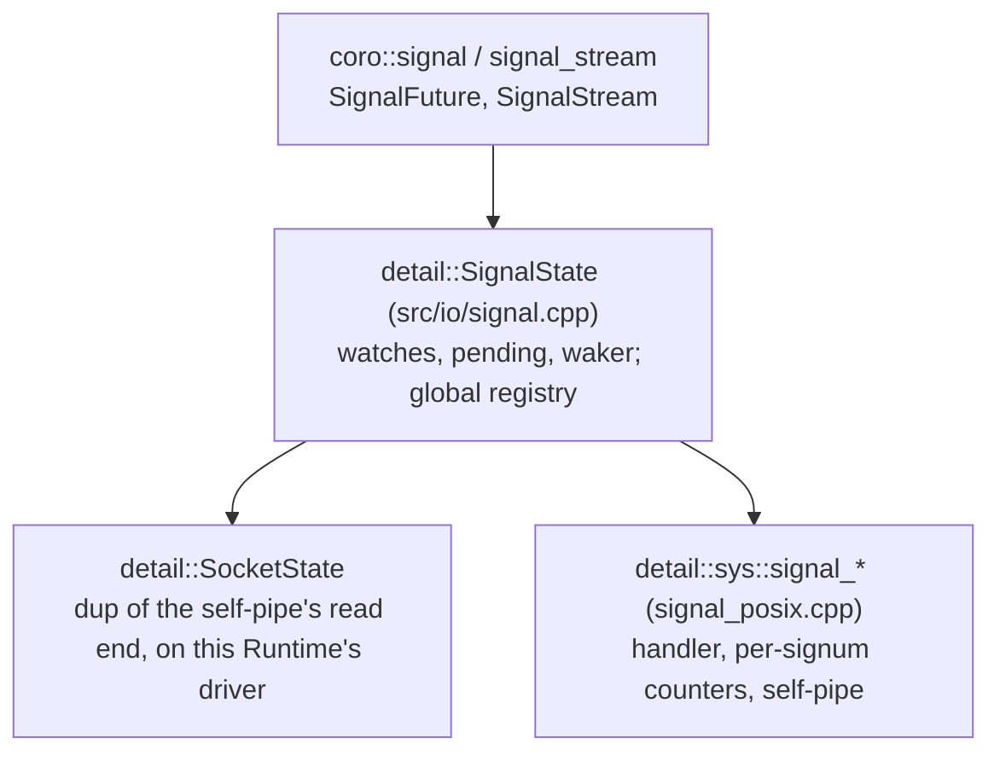

# Signal Handling

`coro::signal()` and `coro::signal_stream()` deliver Unix signals (`SIGINT`, `SIGTERM`,
`SIGHUP`, ...) to coroutines. A `sigaction` handler counts each delivery and writes one
byte to a process-wide self-pipe. Every watcher reads that pipe through the
[I/O Driver](io_driver.md) and is handed the new counts.

Two variants, mirroring tokio's `ctrl_c()` / `signal(SignalKind)` split:

- **`coro::signal(signum)`**: a one-shot `Future<void>` that resolves on the next
  delivery of `signum`. For shutdown triggers, where only the first occurrence matters.
- **`coro::signal_stream({signums...})`**: a `Stream<SignalEvent>` that yields one
  coalesced `{signum, count}` event per watched signal that has fired since the last
  item. For reload-on-`SIGHUP` and similar repeating signals, or to watch several
  signals through one object.

Desktop only. `signal.h` is excluded from the Pico install.

---

## Goals

- **Nothing missed after creation.** Watching starts synchronously in `signal()` /
  `signal_stream()`, so a delivery between creation and the first `co_await` counts.
- **No cooperation from other threads.** Works whatever signal mask the application's
  or a library's threads have.
- **Errors at the call site.** An uncatchable signal throws from `signal()` /
  `signal_stream()`, not from a later poll.
- **Default behaviour restored.** Once the last watcher of a signal is dropped, its
  previous action is back, so `SIGINT` terminates the process again.
- **Safe to drop**, at any time, on any thread.

## Non-goals

- **Blocking or masking signals** for the rest of the process.
- **Running user code in signal context.** Everything the user sees runs in a task.
- **Recovering deliveries the kernel merged** before the handler ran (see
  [Delivery counting](#delivery-counting)).
- **Chaining** to a handler the application installed itself. It is replaced while coro
  watches the signal, and restored afterwards.

---

## API

```cpp
#include <coro/io/signal.h>

// Shut down on SIGINT or SIGTERM, whichever arrives first:
co_await coro::select(coro::signal(SIGINT), coro::signal(SIGTERM));
begin_shutdown();

// Reload on every SIGHUP until SIGINT. Three SIGHUPs in a burst before the loop polls
// again give one item with count == 3, not three wake-ups:
auto reload = coro::signal_stream({SIGHUP});
auto shutdown = coro::signal(SIGINT);
while (true) {
    auto sel = co_await coro::select(coro::next(reload), coro::ref(shutdown));
    if (sel.index() == 1) break;   // shutdown won
    reload_config();
}
```

```cpp
struct SignalEvent {
    int      signum;
    uint64_t count;   // a lower bound: see "Delivery counting"
};
```

| Function | Returns | Output |
|---|---|---|
| `signal(signum)` | `SignalFuture` | `void`, on the first delivery after creation; stays ready once fired |
| `signal_stream(signums)` | `SignalStream` | one `SignalEvent` per signal with new deliveries; never exhausts |

Both throw at the call:

- `std::system_error` `EINVAL` for a signum that can't be caught (`SIGKILL`, `SIGSTOP`,
  0, out of range). A stream with one bad signum throws and watches nothing.
- `std::logic_error` on a Runtime whose executor never turns the driver.

A failure reading the pipe fails the next poll with `std::system_error`. Destruction is
synchronous: the previous action is restored by the time the last watcher's destructor
returns. Only one task may poll a given watcher at a time.

---

## Why a self-pipe, not `signalfd`

`signalfd` only receives a signal that is **blocked in every thread** of the process.
coro doesn't own every thread: a library may start its own, and the application may
start a `std::thread` before the first watcher exists. If any thread leaves the signal
unblocked, the kernel may deliver it there and take the default action, which for
`SIGINT`/`SIGTERM` kills the process. A `sigaction` handler needs no cooperation from
other threads, works the same on every POSIX platform, and is what tokio (through mio)
does too.

!!! tip "TODO: `EVFILT_SIGNAL` backend for kqueue"
    On a kqueue driver, `EVFILT_SIGNAL` reports deliveries without a self-pipe. It would
    go behind the same `sys/signal.h` seam.

---

## Layers



### The `sys/signal.h` seam

| Function | POSIX implementation |
|---|---|
| `signal_watch(signum)` | Reference-counts `signum`; the first watch installs `on_signal` with `SA_RESTART` and saves the previous action. Throws `std::system_error`. |
| `signal_unwatch(signum)` | The last unwatch restores the saved action. `noexcept`. |
| `signal_count(signum)` | Deliveries counted so far for `signum`. |
| `signal_pipe_dup()` | A close-on-exec `dup` of the self-pipe's read end. |
| `signal_pipe_drain(fd)` | Reads the pipe until empty; `EAGAIN` if it already was. |

- **The self-pipe** is non-blocking, created on first use and never closed: a handler
  may run on any thread at any time, so its write end must stay valid.
- **The handler** (`on_signal`) increments `g_counts[signum]`, an atomic, then writes
  one byte to the pipe. Both are async-signal-safe. A full pipe (`EAGAIN`) is fine,
  since unread bytes already guarantee a wake-up. It saves and restores `errno`.
- **The install refcounts** and saved actions are guarded by a mutex that is only ever
  taken innermost.

The atomic counters are the CLAUDE.md exception for signal handlers: a handler can
interrupt a thread holding any mutex, so it must not take one. Everything outside the
handler uses mutexes.

### `detail::SignalState`

One per `SignalFuture` / `SignalStream`, held by `unique_ptr`:

- `pipe`: a `SocketState` holding its own `dup()` of the pipe's read end, registered
  with the creating Runtime's driver. All dups share one open file description, so a
  byte drained through any of them is gone for all.
- `watches`: `{signum, seen}` per watched signal, where `seen` is the count last handed
  out. Guarded by the registry mutex.
- `pending` (at most one `SignalEvent` per signum) and a weak `waker`, guarded by the
  state's own mutex.

**The registry** is a global mutex and the list of live `SignalState`s. It is leaked, so
a watcher dropped during static destruction is safe.

---

## Delivery

Every watcher's dup is in some driver's epoll set, so a delivery makes every polling
watcher's fd readable. Whichever one's task polls first drains the pipe and
**broadcasts** to all watchers, on every Runtime:

```mermaid
sequenceDiagram
    participant K as Kernel (any thread)
    participant H as on_signal
    participant D1 as Driver of Runtime A
    participant A as Watcher A's task
    participant B as Watcher B (Runtime B)
    K->>H: SIGUSR1
    H->>H: g_counts[SIGUSR1]++
    H->>H: write 1 byte to the self-pipe
    D1-->>A: dup A readable: wake
    A->>A: poll: pending empty, store waker
    A->>A: poll_io(Read, drain) reads the byte
    A->>A: broadcast(): lock registry
    Note over A,B: for each watcher, each watch:<br/>delta = count - seen; seen = count;<br/>coalesce delta into pending; take its waker
    A-->>B: wake B (after unlocking)
    A->>A: loop: pending non-empty, Ready
    B->>B: poll: pending non-empty, Ready<br/>(its own driver may also have woken it; its drain finds EAGAIN)
```

- `poll` loops. If `pending` is non-empty, it is ready. Otherwise it stores the weak
  waker, then calls `poll_io(Read, signal_pipe_drain)`:
    - pending means the pipe was empty (another watcher drained it, or nothing has
      arrived);
    - an error fails the future with `std::system_error`;
    - a successful drain calls `broadcast()` and loops.
- `SignalStream::poll_next` pops one event; it never yields `nullopt`.
  `SignalFuture::poll` never pops, so once fired it stays ready.
- Because of the broadcast, a watcher on a Runtime whose driver isn't turning right now
  (busy, or blocked elsewhere) still gets its event, through its waker, from whichever
  Runtime drained.

!!! note "NOTE: broadcast is O(watchers) per drain"
    Each drain locks the registry and walks every watcher. Programs watch a handful of
    signals, so this is far simpler than per-signum watcher lists and costs nothing
    measurable.

---

## Delivery counting

`pending` holds at most one event per signum. Deliveries that arrive before the consumer
polls again add to that event's `count` instead of queueing more events, so a burst of
three `SIGHUP`s is one wake-up and one `{SIGHUP, 3}` item. The consumer couldn't tell
"woken three times" from "woken once with count 3" anyway.

!!! warning "WARNING: `count` is a lower bound, never an exact count and never an overcount"
    For standard (non-realtime) signals, the kernel does not queue repeats: a signal
    sent again while the previous instance is still pending is merged into it, before
    any of coro's code runs. `kill(pid, SIGHUP)` three times in quick succession may run
    the handler only once or twice. This is POSIX semantics; raw `sigaction` in C sees
    the same.

    coro itself loses nothing: the handler counts before it writes, and a watcher
    drains before it reads the counts, so every drained byte's delivery is counted. So
    the first delivery after creation is always reported, and `count` means "at least
    this many times". A delivery that is counted but whose byte is still unread is just
    handed out early; the byte later causes an empty broadcast.

    **Real-time signals** (`SIGRTMIN`..`SIGRTMAX`) are queued by the kernel one per
    send, so for them `count` is exact.

!!! tip "TODO: make coalescing optional"
    `poll_next()` could decrement `count` and yield `{signum, 1}` per delivery instead of
    one batch, as a `SignalStream` mode. The broadcast wouldn't change. Deferred until a
    use case needs it; the batch form covers shutdown and reload.

---

## Races

- **Registration vs. delivery.** The constructor takes the registry mutex, reads each
  baseline `seen = signal_count(signum)` and *then* installs the handler. No broadcast
  can run in between, so every delivery after the baseline is handed to this watcher
  and none before it is.
- **Check vs. store of the waker.** `poll` checks `pending` and stores the waker under
  the state mutex, which `broadcast` also takes. So a broadcast from another thread
  either lands before the check (seen) or after the store (wakes).
- **Drain by another watcher.** If watcher B drains between A's readiness event and A's
  read, A's read gets `EAGAIN` and re-arms. B's broadcast has already filled A's
  `pending` and woken it.
- **Last unwatch vs. a delivery in flight.** A handler already running on another thread
  finishes normally; its count is seen by nobody. A later delivery takes the restored
  action. Commented in `signal_posix.cpp`.
- **Lock order:** registry, then a state's mutex. Wakers are called after both are
  released. The `sys` install mutex is only ever taken innermost.

---

## Tests

`test/io/test_signal.cpp` (`test_signal`). Tests call `::raise()`, which runs the
handler on the calling thread before it returns, so no extra synchronisation is needed.
Every await is bounded by `timeout(5s)`. The `SignalFutureTest` and `SignalStreamTest`
suites run on every executor.

| Test | Checks |
|---|---|
| `SignalFutureTest.ResolvesOnDelivery` | A raise between creation and `co_await` resolves the future. |
| `SignalFutureTest.PendingUntilDelivered` | No delivery: still pending after 20 ms. |
| `SignalFutureTest.ResolvesOnDeliveryFromAnotherThread` | `kill(getpid())` from a `std::thread`. |
| `SignalFutureTest.IgnoresDeliveriesBeforeCreation` | A delivery counted while only an older watcher existed doesn't fire a newer one. |
| `SignalFutureTest.MultipleIndependentWatchersOfSameSignal` | One raise resolves both. |
| `SignalFutureTest.InvalidSignalThrows` | `SIGKILL`, `SIGSTOP`, 0, -1, and a stream with one bad signum throw `system_error`. |
| `SignalFutureTest.DroppingBeforeDeliveryDoesNotHang`, `SignalStreamTest.DroppingBeforeDeliveryDoesNotHang` | Drop without delivery. |
| `SignalStreamTest.ResolvesOnDelivery` | One raise: `{SIGUSR1, 1}`. |
| `SignalStreamTest.CoalescesBurstIntoOneEventWithCount` | Three raises before polling: one item, `count == 3`. |
| `SignalStreamTest.DistinctSignalsYieldSeparateEvents` | `SIGUSR1` and `SIGUSR2`: two items. |
| `SignalStreamTest.CountsResetBetweenItems` | Counts 2 then 1. |
| `SignalTest.RestoresPreviousActionWhenLastWatcherDrops` | `SIGUSR2` is back to `SIG_DFL` only after the last watcher drops. |
| `SignalTest.WatchersOnSeparateRuntimesBothResolve` | One raise resolves watchers on two Runtimes on two threads. |
| `SignalTest.ThrowsWithoutDriver` | `logic_error`, and no handler left installed. |

---

## Files

| File | Contents |
|---|---|
| `include/coro/io/signal.h`, `src/io/signal.cpp` | `SignalEvent`, `SignalFuture`, `SignalStream`, `detail::SignalState`, the registry |
| `include/coro/detail/sys/signal.h`, `src/detail/sys/signal_posix.cpp` | Handler and self-pipe backend seam |
| `test/io/test_signal.cpp` | Tests |
