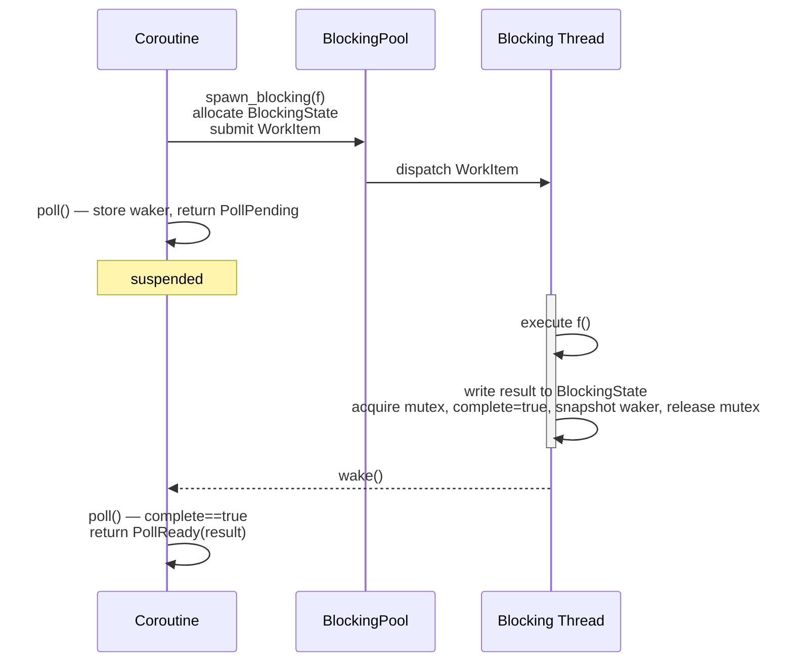

# spawn_blocking

## Overview

`spawn_blocking` runs a synchronous, potentially-blocking callable on a dedicated
**blocking thread pool** and returns a `Future` the calling coroutine can `co_await`.
The calling task suspends immediately, freeing the executor worker thread to run other
tasks while the blocking work proceeds on its own thread.

This mirrors Tokio's `tokio::task::spawn_blocking` and is the standard bridge between
async code and blocking APIs (CPU-intensive computation, synchronous file I/O, C
libraries that do not support async callbacks, etc.).

---

## Motivation

Executor worker threads must never block — a blocked worker starves every other task
scheduled on that thread. Without `spawn_blocking`, users must either:

- Avoid all blocking calls entirely (not always possible), or
- Spawn an OS thread manually and wire a oneshot channel back to the coroutine
  (tedious and error-prone).

`spawn_blocking` provides that wiring as a first-class primitive.

---

## Behaviour

- Accepts any `std::invocable` callable with no arguments returning `T`.
- Returns a `BlockingHandle<T>` — a `Future<T>` that resolves when the callable returns.
- The calling coroutine suspends immediately; the executor worker is freed.
- The callable runs on a **separate blocking thread pool** — never on an executor worker.
- The pool is owned by `Runtime` and torn down when the runtime is destroyed.
- `co_await`ing the handle after the callable has already finished returns immediately.
- If the handle is dropped before the callable returns, the callable still runs to
  completion (fire-and-forget semantics — the result is simply discarded).
- Exceptions thrown by the callable are captured and re-thrown when the handle is awaited.
- The callable may call `spawn_blocking` recursively — blocking pool threads are not
  executor threads and may block freely.

---

## API

```cpp
#include <coro/task/spawn_blocking.h>

// Run a blocking callable, await its result.
coro::Coro<void> run() {
    int result = co_await coro::spawn_blocking([]() -> int {
        return expensive_cpu_work();   // runs on blocking pool, not executor thread
    });

    // Blocking file I/O example.
    std::string content = co_await coro::spawn_blocking([]() -> std::string {
        return read_file_sync("/etc/hosts");
    });
}
```

The free function `coro::spawn_blocking(f)` is the primary entry point. It requires a
running `Runtime` (same requirement as `coro::spawn()`).

`BlockingHandle<T>` also exposes a `blocking_get()` method for use from synchronous or
re-entrant blocking contexts where `co_await` is not available:

```cpp
// From within a spawn_blocking closure — recursive re-entrance.
int result = co_await coro::spawn_blocking([]() -> int {
    // Dispatch sub-work to another blocking thread, then wait synchronously.
    auto handle = coro::spawn_blocking([]() -> int {
        return sub_computation();
    });
    return handle.blocking_get();  // blocks this thread, not an executor worker
});
```

The `blocking_` prefix follows Tokio's convention (e.g. `blocking_recv()` on channel
receivers) to make it unambiguous at the call site that this is a synchronous blocking
call — not something that should appear in a coroutine body.

---

## Design

### Thread pool — `BlockingPool`

A `BlockingPool` is owned by `Runtime`. It manages a collection of OS threads that
pull work items from a shared queue:

```
Runtime
  └── BlockingPool
        ├── std::deque<WorkItem>    (protected by mutex)
        ├── std::condition_variable (work available / shutdown / thread exit)
        ├── size_t total_threads    (protected by mutex)
        └── size_t idle_threads     (protected by mutex)
```

Threads are detached at creation — the pool never holds joinable `std::thread` handles.
Instead it tracks `total_threads` (all live threads) and `idle_threads` (waiting for
work). When an idle thread times out and exits it decrements `total_threads` and calls
`notify_all()` so the destructor's drain wait can observe the change. This avoids the
self-join problem (a thread cannot join itself) and is consistent with the
detach-on-handle-drop semantics of `BlockingHandle` — blocking threads are never
expected to be joined by the pool.

Switching to joinable threads with lazy reaping is a contained change to `BlockingPool`
internals if needed later — no user-facing API is affected.

**Pool sizing:**
- The pool grows on demand, up to a configurable maximum (default: 512, matching Tokio).
- Idle threads time out after a keep-alive period (default: 10 seconds) and exit,
  decrementing `total_threads`.
- A minimum of 0 persistent threads; all threads are created lazily.

This is intentionally distinct from the executor worker pool, which has a fixed size
equal to `hardware_concurrency`. Blocking work is unbounded in concurrency — a task
blocking on a slow database query should not prevent other blocking tasks from making
progress.

### Shared state — `BlockingState<T>`

Each `spawn_blocking` call allocates a shared state object on the heap:

```cpp
template<typename T>
struct BlockingState {
    std::mutex                               mutex;
    std::condition_variable                  cv;       // for blocking_get()
    std::shared_ptr<Waker>                   waker;    // stored by poll(), read by blocking thread
    std::optional<std::expected<T,
        std::exception_ptr>>                 result;   // set once under mutex
    bool                                     complete{false};
};
```

`std::expected<T, std::exception_ptr>` is used rather than a three-way
`std::variant<std::monostate, T, std::exception_ptr>` so that `T = std::exception_ptr`
is unambiguous: a successful result lives in the expected slot and a captured exception
lives in the unexpected slot regardless of what `T` is.

All fields are accessed under `mutex` rather than using atomics. The atomic waker +
release/acquire pattern is correct but subtle — it is easy to introduce a missed-wakeup
race if the re-check after storing the waker is omitted or mis-ordered. A mutex makes
the protocol obvious and the cost is irrelevant here since we are already paying for
thread creation and a condvar wait on the blocking path.

- The blocking thread acquires `mutex`, writes `result`, sets `complete = true`, snapshots
  the waker, releases the mutex, then calls `cv.notify_one()` and `waker->wake()`.
- `poll()` acquires `mutex`, checks `complete`; if set, moves the result out and returns
  `PollReady`; otherwise stores the waker and returns `PollPending`. Storing the waker
  under the same lock that the blocking thread reads it under eliminates the
  check-then-store race entirely.

### `BlockingHandle<T>`

`BlockingHandle<T>` is the `Future<T>` returned by `spawn_blocking`. It holds a
`shared_ptr<BlockingState<T>>`.

```
poll():
  acquire mutex
  if complete == true:
    move result out, release mutex, return PollReady
  else:
    store waker, release mutex, return PollPending

blocking_get():
  condvar-wait(mutex) until complete == true
  move result out, return (or rethrow if exception)
```

Because the work is already submitted at construction time (not at first poll), the
callable begins running even if the coroutine yields before reaching the first `co_await`
on the handle. On the fast path (work already done by first poll) the mutex is
acquired and released once with no contention.

> **Do not call `blocking_get()` from an executor worker thread.** Doing so blocks the
> worker and starves all other tasks on that thread — the same mistake as any other
> blocking call on the executor. In debug builds this can be asserted by checking the
> `t_worker_index` thread-local (≥ 0 means the caller is a worker thread).

### `spawn_blocking` free function

```cpp
template<std::invocable F>
[[nodiscard]] BlockingHandle<std::invoke_result_t<F>>
spawn_blocking(F&& f);
```

Implementation:
1. Allocate `BlockingState<T>` (shared between handle and pool thread).
2. Wrap callable + state into a `WorkItem` (type-erased `std::function<void()>`).
3. Submit `WorkItem` to `BlockingPool` via the current runtime
   (`coro::current_runtime().blocking_pool().submit(...)`).
4. Return `BlockingHandle<T>` wrapping the shared state.

### Work item execution (blocking thread)

```cpp
// Inside BlockingPool worker loop:
try {
    state->result = f();                                        // success path
} catch (...) {
    state->result = std::unexpected(std::current_exception()); // exception path
}

std::shared_ptr<Waker> w;
{
    std::lock_guard lock(state->mutex);
    state->complete = true;
    w = state->waker;   // snapshot waker while holding the lock — no missed-wakeup gap
}
state->cv.notify_one();
if (w) w->wake();
```

### Shutdown

`BlockingPool::~BlockingPool()` (called from `Runtime` destructor):
1. Sets a `stop` flag under the mutex and calls `notify_all()` — idle threads wake,
   see `stop`, decrement `total_threads`, and exit.
2. Condvar-waits until `total_threads == 0`. Threads that are mid-execution finish
   their current work item first, then exit and decrement the counter.

Results written by threads that finish during shutdown are stored in `BlockingState`
but the waker may never fire (`Runtime` is gone). Handles already awaited by the
application will have resolved before shutdown; handles that were never awaited are
dropped with the runtime and their results discarded.

---

## State machine



Edge cases:
- **Handle polled after work already finished:** `complete` is already true on first poll;
  return `PollReady` without suspending.
- **Handle dropped before work finishes:** the `BlockingState` stays alive via the
  pool thread's copy of the `shared_ptr`. The thread completes, stores the result, and
  calls `wake()`. The waker holds a `shared_ptr<Task>` — if the task is gone, the wake
  is a no-op and the state is freed when the thread drops its `shared_ptr`.

---

## Header layout

```
include/coro/task/spawn_blocking.h   — BlockingHandle<T>, BlockingPool, spawn_blocking()
src/blocking_pool.cpp                — BlockingPool implementation
```

---

## Cancellation and ownership

### Cancellation cannot be guaranteed

Blocking threads can be cancelled cooperatively (see the `std::stop_token` section
below), but the library cannot *guarantee* cancellation — it depends entirely on the
callable checking for it. A blocking thread that is stuck on a non-interruptible syscall
or an opaque C library call may not respond to a stop request at all.

Because cancellation cannot be guaranteed, waiting for a blocking thread to finish when
its handle is dropped is not safe — if the thread never checks the stop token the wait
is unbounded, which is a deadlock from the caller's perspective. For this reason,
dropping a `BlockingHandle<T>` **detaches** the thread: it continues running to
completion and the result is discarded.

This contrasts with async `spawn`, where cancellation is always cooperative and
guaranteed — the task is polled with `PollDropped`, unwinds, and finishes in bounded
time, so waiting on handle drop is safe. That guarantee does not exist for blocking
threads.

For reference, the approaches that would allow forcible cancellation are not viable:
- `pthread_cancel` cancels at arbitrary POSIX cancellation points and leaves resources
  in inconsistent states unless cleanup handlers are installed everywhere — widely
  considered unsafe.
- For threads blocked on non-interruptible syscalls (`write` to a full pipe, `flock`,
  opaque C library calls) there is no portable interruption mechanism at all.

### Cooperative cancellation with `std::stop_token`

If the blocking work can check for cancellation periodically, pass a `std::stop_token`
into the callable manually. The caller holds a `std::stop_source` and calls
`request_stop()` when it wants to cancel:

```cpp
std::stop_source source;

auto handle = coro::spawn_blocking([token = source.get_token()]() -> int {
    for (int i = 0; i < 1'000'000; ++i) {
        if (token.stop_requested()) {
            // clean up and bail out early
            return -1;
        }
        do_chunk_of_work(i);
    }
    return 0;
});

// Request cancellation — thread will notice on its next iteration.
source.request_stop();

// Must still await (or drop) the handle — the thread runs until it checks the token.
int result = co_await handle;
```

For threads blocked on a condition variable, `std::condition_variable_any` has a
`stop_token` overload that wakes the thread automatically when stop is requested:

```cpp
auto handle = coro::spawn_blocking([token = source.get_token()]() -> int {
    std::mutex m;
    std::condition_variable_any cv;

    std::unique_lock lock(m);
    // Wakes when predicate is true OR stop is requested — no extra flag needed.
    cv.wait(lock, token, [&] { return work_is_ready(); });

    if (token.stop_requested()) return -1;
    // ... process work
    return 0;
});
```

Cancellation is entirely the callable's responsibility. `spawn_blocking` has no
knowledge of `std::stop_token` — it just runs whatever callable it is given.

### Ownership requirement — no references into the calling coroutine

Because dropping a `BlockingHandle` detaches rather than waits, it is **unsafe to
capture references to data owned by the spawning coroutine**. If the coroutine exits
while the blocking thread is still running, the thread will access dangling memory.

Unlike async `spawn`, there is no `co_invoke` + `JoinSet` escape hatch here — the
blocking thread cannot be cooperatively cancelled and therefore cannot be safely waited
on during scope exit. The rule is strict:

> **The callable passed to `spawn_blocking` must own all of its data. Do not capture
> references or pointers into the spawning coroutine's stack frame.**

```cpp
// UNSAFE — captures a reference to a local variable.
coro::Coro<void> bad() {
    std::string data = "hello";
    auto handle = coro::spawn_blocking([&data]() -> int {
        return process(data);  // data may be destroyed before this runs
    });
    co_return;  // handle dropped here → detach → data destroyed → thread reads dangling ref
}

// SAFE — moves data into the callable.
coro::Coro<void> good() {
    std::string data = "hello";
    auto handle = coro::spawn_blocking([data = std::move(data)]() -> int {
        return process(data);  // data is owned by the lambda
    });
    co_return;  // handle dropped → detach → lambda owns data until thread finishes
}

// SAFE — co_await the handle before locals are destroyed.
coro::Coro<void> also_good() {
    std::string data = "hello";
    // Awaiting guarantees the thread finishes before data goes out of scope.
    int result = co_await coro::spawn_blocking([&data]() -> int {
        return process(data);
    });
}
```

The third pattern (await before locals are destroyed) is safe but requires discipline —
if the handle is ever stored and awaited elsewhere, or passed to `select`/`timeout`
where it might be dropped as the losing branch, the guarantee breaks. Preferring
`std::move` into the lambda is the safest default.

This is the C++ analogue of Rust's `'static + Send` bound on `spawn_blocking` closures,
enforced by documentation and code review rather than the type system.

---

## Running a `Future` on a blocking thread

Occasionally a third-party library exposes an async API built on its own event loop, or
you need to drive a `Coro<T>` in complete isolation from the outer runtime (separate I/O
loop, separate timer state). The right tool is a nested `Runtime` inside the blocking
callable — `spawn_blocking` is the bridge that keeps the outer executor free while the
inner one runs.

```cpp
coro::Coro<std::string> inner_async_work() {
    // I/O here uses the inner runtime's event loop — isolated from the outer one.
    coro::TcpStream tcp = co_await coro::TcpStream::connect("10.0.0.1", 8080);
    // ...
    co_return result;
}

coro::Coro<void> run() {
    // The outer executor thread is freed while the inner runtime runs to completion.
    std::string result = co_await coro::spawn_blocking([]() -> std::string {
        coro::Runtime inner(1);                   // single-threaded, its own uv loop
        return inner.block_on(inner_async_work());
    });
}
```

**What this gives you:**
- The outer executor thread is free for other tasks while `inner.block_on()` blocks.
- `inner_async_work` has full access to `co_await`, I/O, timers, and `spawn()` — it runs
  in a complete async environment.

**What it does NOT give you:**
- Shared I/O handles, sockets, or timers with the outer runtime. The inner runtime has
  its own `uv_loop_t`; any `TcpStream`, `WsStream`, or `sleep_for` inside it is
  completely independent.
- Shared channels or synchronization primitives that depend on the outer runtime's
  executor for waking. Cross-runtime communication requires OS-level primitives
  (mutexes, `std::promise`/`std::future`) rather than async channels.

This is intentionally explicit. The cost — a full nested `Runtime` — is visible at the
call site rather than hidden behind a convenience wrapper.

---

## Comparison with alternatives

| Approach | Pros | Cons |
|---|---|---|
| `spawn_blocking` (this doc) | Simple API; pool managed by runtime; result typed | Extra thread per concurrent blocking task |
| `oneshot` channel + `std::thread` | No library support needed | Boilerplate; caller manages thread lifetime |
| libuv thread pool (`uv_queue_work`) | Reuses existing pool | Pool is shared with libuv internals; size capped at `UV_THREADPOOL_SIZE` (default 4) |
| `co_await` blocking future inline | None | Blocks an executor worker — should never be done |

The libuv thread pool (`uv_queue_work`) was considered but rejected: its default size cap
of 4 threads (max 128 via `UV_THREADPOOL_SIZE`) is too restrictive for general-purpose
blocking work, and sharing it with libuv internals creates unpredictable contention.
