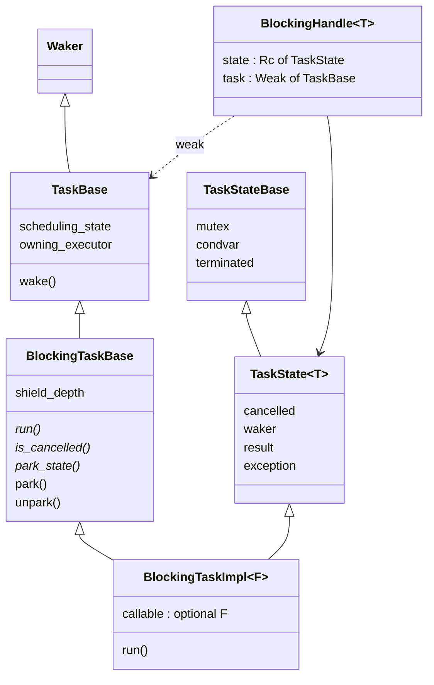
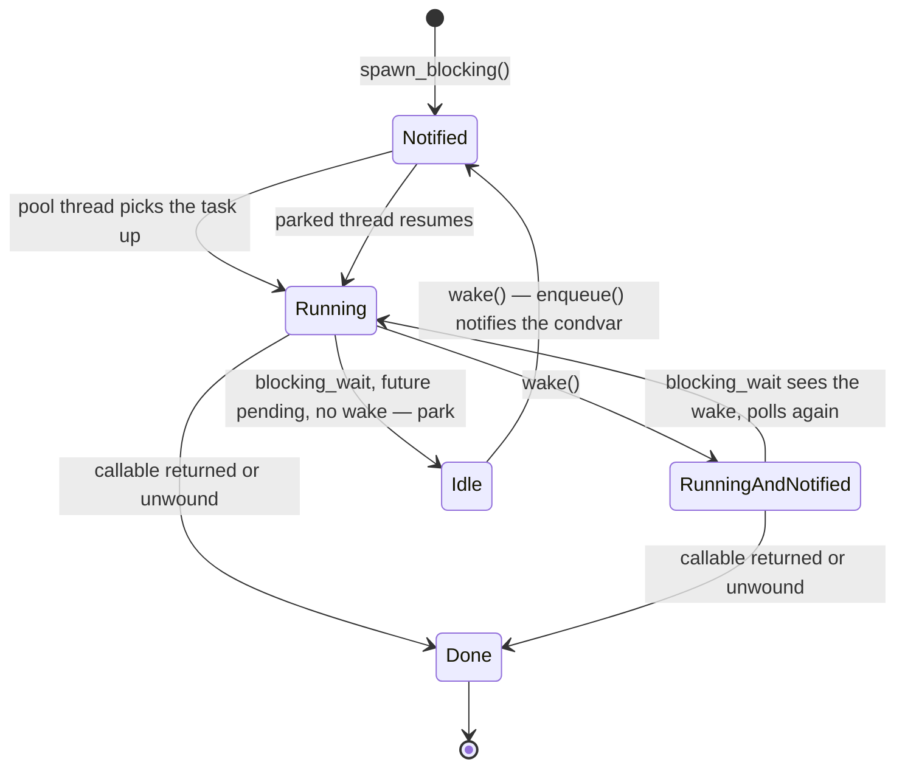
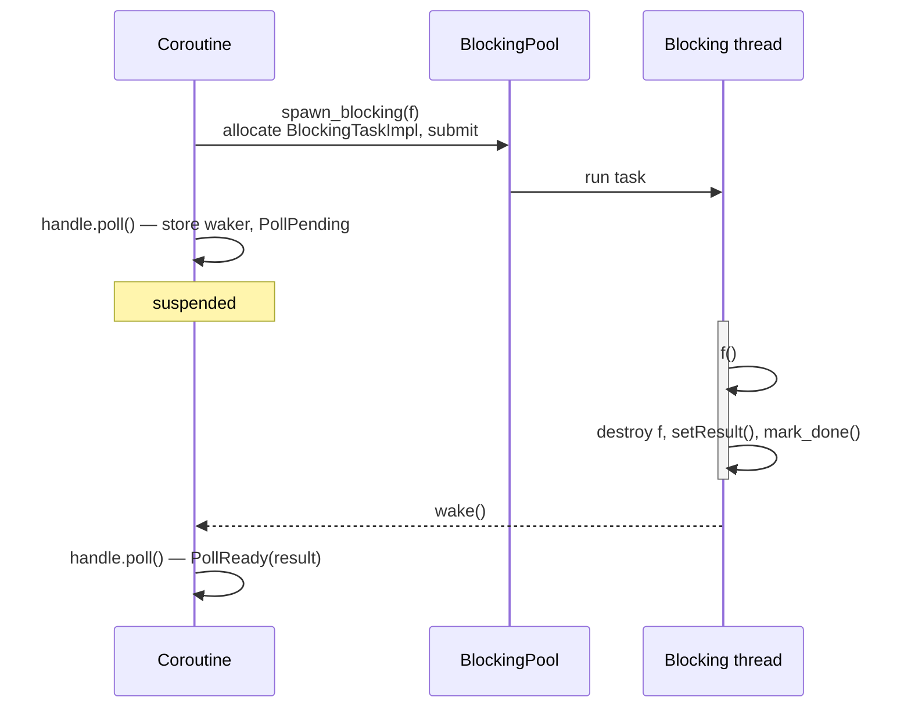

# spawn_blocking

!!! note "Implemented"
    Code: `include/coro/task/spawn_blocking.h`, `include/coro/detail/blocking_task.h`,
    `include/coro/detail/blocking_cancel.h`, `src/task/blocking_pool.cpp`. Tests:
    `test/task/test_spawn_blocking.cpp`.

## Overview

`spawn_blocking` runs a synchronous, potentially-blocking callable on a dedicated
**blocking thread pool** and returns a `Future` the calling coroutine can `co_await`.
The calling task suspends immediately, freeing the executor worker thread to run other
tasks while the blocking work proceeds on its own thread.

This mirrors Tokio's `tokio::task::spawn_blocking` and is the standard bridge between
async code and blocking APIs (CPU-intensive computation, synchronous file I/O, C
libraries that do not support async callbacks, etc.).

---

## Motivation

Executor worker threads must never block — a blocked worker starves every other task
scheduled on that thread. Without `spawn_blocking`, users must either:

- Avoid all blocking calls entirely (not always possible), or
- Spawn an OS thread manually and wire a oneshot channel back to the coroutine
  (tedious and error-prone).

`spawn_blocking` provides that wiring as a first-class primitive.

---

## Behaviour

- Accepts any `std::invocable` callable with no arguments returning `T`.
- Returns a `BlockingHandle<T>` — a `Future<T>` that resolves when the callable returns.
- The work is submitted when `spawn_blocking` is called, not when the handle is first
  polled.
- The callable runs on a **separate blocking thread pool** — never on an executor worker.
- The pool is owned by `Runtime` and torn down when the runtime is destroyed.
- `co_await`ing the handle after the callable has already finished returns immediately.
- Exceptions thrown by the callable are captured and re-thrown when the handle is awaited.
- The callable may call `spawn_blocking` recursively — blocking pool threads are not
  executor threads and may block freely.
- A blocking task can be **cancelled**, by `BlockingHandle::request_cancel()` or by
  dropping the handle. Cancellation is delivered as a `coro::BlockingCancelled` exception
  thrown from the callable's next *cancellation point* (`blocking_wait`, `blocking_next`,
  `blocking_cancellation_point`). A callable that never reaches one runs to completion.
- Dropping the handle requests cancellation and returns at once. It does **not** wait for
  the thread, so the callable must still own everything it touches (see
  [Ownership requirement](#ownership-requirement-no-references-into-the-calling-coroutine)).
- A task cancelled before a pool thread has picked it up never runs its callable.

---

## API

```cpp
#include <coro/task/spawn_blocking.h>

// Run a blocking callable, await its result.
coro::Coro<void> run() {
    int result = co_await coro::spawn_blocking([]() -> int {
        return expensive_cpu_work();   // runs on blocking pool, not executor thread
    });

    // Blocking file I/O example.
    std::string content = co_await coro::spawn_blocking([]() -> std::string {
        return read_file_sync("/etc/hosts");
    });
}
```

The free function `coro::spawn_blocking(f)` is the primary entry point. It requires a
running `Runtime` (same requirement as `coro::spawn()`).

```cpp
namespace coro {

template<std::invocable F>
[[nodiscard]] BlockingHandle<std::invoke_result_t<F>> spawn_blocking(F&& f);

template<typename T>
class BlockingHandle {
public:
    using OutputType = T;
    PollResult<T> poll(detail::Context& ctx);

    // Asks the task to stop. Returns at once; see "Cancellation and ownership".
    void request_cancel() noexcept;

    // request_cancel(), then hands the handle back to be awaited. The await completes
    // once the callable has returned or unwound.
    [[nodiscard]] BlockingHandle cancel_and_join() &&;

    // Dropping the handle no longer requests cancellation: the callable runs to
    // completion and its result is discarded. The handle can still be awaited.
    BlockingHandle& detach() &;
    BlockingHandle&& detach() &&;

    ~BlockingHandle();   // request_cancel() unless detached; never waits
};

// Thrown from a cancellation point of a cancelled blocking task. Deliberately not
// derived from std::exception.
struct BlockingCancelled {};

// Throws BlockingCancelled if the calling blocking task has been cancelled. No-op on any
// other thread, and inside a BlockingCancelShield.
void blocking_cancellation_point();

// While one is alive on a blocking pool thread, cancellation points do not throw.
class BlockingCancelShield;

} // namespace coro
```

A blocking pool thread waits for another blocking task with
`blocking_wait(std::move(handle))` (see [blocking_wait.md](blocking_wait.md)). The
`blocking_get()` method an earlier version of `BlockingHandle` had is gone: it was the
same wait, except that it was not a cancellation point.

```cpp
int result = co_await coro::spawn_blocking([]() -> int {
    // Dispatch sub-work to another blocking thread, then wait synchronously.
    auto handle = coro::spawn_blocking([]() -> int {
        return sub_computation();
    });
    return coro::blocking_wait(std::move(handle));  // blocks this thread, not a worker
});
```

If the outer task is cancelled while it waits here, `blocking_wait` destroys `handle`,
which requests cancellation of the inner task, and then throws: cancellation follows the
handles down.

---

## Design

### Thread pool — `BlockingPool`

A `BlockingPool` is owned by `Runtime`. It manages a collection of OS threads that
pull tasks from a shared queue:

```
Runtime
  └── BlockingPool
        ├── std::deque<Rc<BlockingTaskBase>>   queued tasks      (protected by mutex)
        ├── list of live BlockingTaskBase      queued or running (protected by mutex)
        ├── ParkingExecutor                    owning_executor of every blocking task
        ├── std::condition_variable            (work available / shutdown / thread exit)
        ├── size_t total_threads               (protected by mutex)
        └── size_t idle_threads                (protected by mutex)
```

Threads are detached at creation — the pool never holds joinable `std::thread` handles.
Instead it tracks `total_threads` (all live threads) and `idle_threads` (waiting for
work). When an idle thread times out and exits it decrements `total_threads` and calls
`notify_all()` so the destructor's drain wait can observe the change. This avoids the
self-join problem (a thread cannot join itself).

Switching to joinable threads with lazy reaping is a contained change to `BlockingPool`
internals if needed later — no user-facing API is affected.

**Thread-local runtime context:** each worker thread sets `current_runtime()` once, at
the top of its loop, before pulling any task. This is what makes recursive
`spawn_blocking()` and a nested `block_on()` (see "Running a Future on a blocking thread"
below) work from inside a blocking-pool thread — and it is also what makes a
blocking-pool thread a valid place to poll *any* future or stream that touches the
runtime (timers, sockets on the `IoDriver`, file I/O), not just ones that stay in-memory.

**Thread-local current blocking task:** around each task, the worker also sets a
thread-local pointer to the `BlockingTaskBase` it is running. `blocking_wait` and the
other cancellation points find their task through it; it is null on every thread that is
not a pool worker, which is how `blocking_wait` tells the two apart. It is a separate
pointer from `TaskBase::current`, which stays null on pool threads: code that reads
`TaskBase::current` assumes a task that an executor polls repeatedly, and a blocking task
is not one.

**Pool sizing:**
- The pool grows on demand, up to a configurable maximum (default: 512, matching Tokio).
- Idle threads time out after a keep-alive period (default: 10 seconds) and exit,
  decrementing `total_threads`.
- A minimum of 0 persistent threads; all threads are created lazily.

This is intentionally distinct from the executor worker pool, which has a fixed size
equal to `hardware_concurrency`. Blocking work is unbounded in concurrency — a task
blocking on a slow database query should not prevent other blocking tasks from making
progress.

### The blocking task — `BlockingTaskImpl<F>`

Each `spawn_blocking` call makes one heap allocation, a `BlockingTaskImpl<F>`. It has the
same shape as the `TaskImpl<F>` behind `spawn()`:


```mermaid
classDiagram
    class Waker
    class TaskBase {
        scheduling_state
        owning_executor
        wake()
    }
    class TaskStateBase {
        mutex
        condvar
        terminated
    }
    class TaskState~T~ {
        cancelled
        waker
        result
        exception
    }
    class BlockingTaskBase {
        shield_depth
        run()*
        is_cancelled()*
        park_state()*
        park()
        unpark()
    }
    class BlockingTaskImpl~F~ {
        callable : optional F
        run()
    }
    class BlockingHandle~T~ {
        state : Rc of TaskState
        task : Weak of TaskBase
    }
    Waker <|-- TaskBase
    TaskBase <|-- BlockingTaskBase
    BlockingTaskBase <|-- BlockingTaskImpl~F~
    TaskStateBase <|-- TaskState~T~
    TaskState~T~ <|-- BlockingTaskImpl~F~
    BlockingHandle~T~ --> TaskState~T~
    BlockingHandle~T~ ..> TaskBase : weak
```

One object does four jobs that used to be separate allocations or separate types:

| Job | How |
|---|---|
| Result channel to the handle | It is a `TaskState<T>`: `result`, `exception`, `cancelled`, the awaiter's `waker`, and `mark_done()`/`setResult()`/`setException()`, exactly as for a spawned coroutine task. |
| Queue entry | The pool's queue holds `Rc<BlockingTaskBase>` and calls the virtual `run()`. The callable is stored directly in the task, so there is no `std::function` wrapper. |
| Waker for `blocking_wait` | It is a `TaskBase`, hence a `Waker`. `blocking_wait` polls with the task itself as the context's waker and allocates nothing per wait. |
| Cancellation target | The handle calls `cancel_task()`, which sets `cancelled` and calls `wake()`, as `TaskImpl::cancel_task()` does. |

`run()` destroys the callable as soon as it has returned or thrown, before publishing the
result, as `TaskImpl` resets its future. Whatever the callable owns is therefore released
on the blocking thread, not on whichever thread drops the last reference to the task.

#### Why `BlockingTaskBase` exists

`TaskImpl<F>` inherits `TaskBase` directly, and `BlockingTaskImpl<F>` could too: the pool
would queue `Rc<TaskBase>` and run a task through `TaskBase::poll()`. That was considered
and rejected. (`TaskBase::cancel_task()` *is* reused as it stands: it means the same
thing for both kinds of task.) `BlockingTaskBase` is the
non-template type through which code that does not know `F` — `blocking_wait`, the
parking executor, the pool — reaches the three things a blocking task has and a
`TaskBase` does not:

```cpp
struct BlockingTaskBase : TaskBase {
    virtual void           run() = 0;                 // run the callable to the end, once
    virtual bool           is_cancelled() const = 0;  // TaskState<T>::cancelled
    virtual TaskStateBase& park_state() = 0;          // the mutex + condvar to park on
    void park();                                      // Running → Idle, wait for a wake
    void unpark();                                    // lock, notify
    int  shield_depth = 0;                            // live BlockingCancelShields
    bool poll(Context&) final;                        // never called; aborts
};
```

The virtuals exist because `cancelled`, the mutex and the condition variable live in
`TaskState<T>`, a sibling base that only `BlockingTaskImpl<F>` can see.

Without this class each of them has to come from somewhere else, and every substitute is
worse:

| Without `BlockingTaskBase` | Problem |
|---|---|
| `wake()` reaches the parked thread through a per-thread `Executor` that the worker installs as `owning_executor` when it dequeues the task | `owning_executor` is then written after the task is already shared with its handle. Everywhere else it is set before the first enqueue and never changes. It can be argued safe from the order of the `scheduling_state` transitions, but that is exactly the subtle atomic-ordering reasoning this codebase avoids where a simpler structure will do. |
| `blocking_wait` reads the flag through a raw `const std::atomic<bool>*` into the task, stashed in a thread-local while the callable runs | A type-erased pointer with a hand-managed lifetime, in place of one virtual call. |
| The pool runs a task with `TaskBase::poll()` | `poll()` means "advance one step; may be called again" for every other task. Here it would mean "run the whole callable, once". |
| The queue holds `Rc<TaskBase>` | Nothing but convention keeps an executor task out of it. |

With the class, `owning_executor` is set once, in `BlockingPool::submit()` before the
task is queued, to a single
`ParkingExecutor` owned by the pool, and that executor's `enqueue()` can
`static_cast<BlockingTaskBase&>` because the type of the queue guarantees what it was
given. The cost is one small class and three virtual functions, none on a path where it
matters.

### Scheduling state and parking

`TaskBase::wake()` is used unchanged. Its state machine already describes a blocking
task; only the meaning of the states differs:

| `scheduling_state` | Blocking task |
|---|---|
| `Notified` | Queued in the pool, or woken while parked and about to resume |
| `Running` | The thread is in the callable, or polling a future inside `blocking_wait` |
| `RunningAndNotified` | A wake arrived while `Running` |
| `Idle` | The thread is parked in `blocking_wait` |
| `Done` | The callable has returned or unwound |

What makes `wake()` work is the task's `owning_executor`. For a blocking task it is the
pool's `ParkingExecutor`, set once in `spawn_blocking`. Its `enqueue(task)` does not
queue anything: it calls `BlockingTaskBase::unpark()`, which locks the task's mutex and
notifies its condition variable (`TaskStateBase` already has both). "Enqueue this task so
that it is polled again" becomes "unpark the thread that is this task".

`blocking_wait` then does what an executor worker does around a poll:


```mermaid
stateDiagram-v2
    [*] --> Notified : spawn_blocking()
    Notified --> Running : pool thread picks the task up
    Running --> RunningAndNotified : wake()
    RunningAndNotified --> Running : blocking_wait sees the wake, polls again
    Running --> Idle : blocking_wait, future pending, no wake — park
    Idle --> Notified : wake() — enqueue() notifies the condvar
    Notified --> Running : parked thread resumes
    Running --> Done : callable returned or unwound
    RunningAndNotified --> Done : callable returned or unwound
    Done --> [*]
```

After a poll that returned `PollPending`, the thread tries `Running → Idle`. If the state
was `RunningAndNotified` instead, a wake arrived during the poll: it sets `Running` and
polls again without parking. Otherwise it waits on the condition variable until the state
is `Notified`, sets `Running`, and polls again.

!!! note "NOTE: no missed wake between `Running → Idle` and the wait"
    `wake()` makes its `Idle → Notified` transition without the mutex and only then
    calls `enqueue()`, which takes the mutex before notifying. The parking thread checks
    for `Notified` under that same mutex before every wait. So a wake that lands after
    the thread went `Idle` is either seen by that check or blocks in `enqueue()` until the
    thread is waiting. A wake that lands before `Idle` is the `RunningAndNotified` case.

A wake that arrives while the thread is in the callable's own code (not in
`blocking_wait`) leaves the state `RunningAndNotified` until the next `blocking_wait`,
whose first pending poll is then followed by one extra poll. That is the same stale wake
a coroutine task gets and is harmless: a future must tolerate being polled when nothing
has changed.

### `BlockingHandle<T>`

`BlockingHandle<T>` is the `Future<T>` returned by `spawn_blocking`. It holds what a
`JoinHandle<T>` holds, an `Rc<TaskState<T>>` and a `Weak<TaskBase>`, and its `poll()` is
the same: under the state's mutex, if the task has terminated, return its exception
(`PollError`), its result (`PollReady`), or `PollDropped` if it was cancelled and left no
result; otherwise store the waker and return `PollPending`. Storing the waker under the
lock the blocking thread publishes under is what rules out a missed wakeup.

It stays a separate type from `JoinHandle<T>` because the two differ exactly where the
difference matters:

| | `JoinHandle<T>` | `BlockingHandle<T>` |
|---|---|---|
| Cancellation is | guaranteed: the task drains in bounded time | a request the callable may never see |
| Dropping the handle | cancels and registers the task with the enclosing coroutine scope, which waits for it | requests cancellation and returns; nothing waits |
| `Cancellable` (has `cancel()`) | yes | **no** — the method is `request_cancel()` |
| Waiting for a cancelled task | implicit, by the scope | explicit: `co_await std::move(h).cancel_and_join()` |

!!! warning "WARNING: `BlockingHandle` must not satisfy `Cancellable`"
    A `Cancellable` future is one that whoever cancels it must keep polling until it has
    drained. If `BlockingHandle` had a `cancel()` method, a coroutine cancelled while
    awaiting one — the losing branch of a `select`, a `timeout` that fired — would be
    held until the blocking thread reached a cancellation point, which may be never.
    Named `request_cancel()`, the handle is an ordinary leaf future: it is destroyed, its
    destructor requests cancellation, and the coroutine moves on.

Because the work is submitted at construction time (not at first poll), the callable
begins running even if the coroutine yields before reaching the first `co_await` on the
handle.

### `spawn_blocking` free function

1. Allocate the `BlockingTaskImpl<F>`, moving the callable into it, with
   `scheduling_state = Notified` and `owning_executor` set to the pool's
   `ParkingExecutor`.
2. Submit it to the `BlockingPool` of the current runtime, which adds it to the queue and
   to the list of live tasks.
3. Return a `BlockingHandle<T>` holding the state and a weak reference to the task.

### Running a task (blocking thread)

```cpp
// BlockingTaskImpl<F>::run(), called by the pool worker with the current-blocking-task
// pointer set and scheduling_state == Running:
if (!cancelled) {                       // cancelled while still queued: skip the callable
    try {
        auto value = (*callable)();
        if (!cancelled) setResult(std::move(value));   // a cancelled task has no result
    } catch (const BlockingCancelled&) {
        // The task was cancelled and unwound. Not an error: no result, no exception.
    } catch (...) {
        setException(std::current_exception());
    }
}
callable.reset();                       // destroy F on this thread
scheduling_state = Done;
mark_done();                            // terminated = true, wake the awaiter
```

A cancelled task ends with neither a result nor an exception, however its callable left:
by `BlockingCancelled`, by returning a value after swallowing it, or without running.
So does a task that was not cancelled itself but unwound with `BlockingCancelled` because
something it waited on had been (see
[blocking_wait.md](blocking_wait.md#a-future-that-reports-polldropped)).
The handle then reports `PollDropped`, as a `JoinHandle` does for a cancelled coroutine
task. This mirrors `TaskImpl`, which discards the result of a future that completes after
its task was cancelled.

An exception other than `BlockingCancelled` is reported even if the task was cancelled,
since it says something went wrong rather than that the task stopped.

### Shutdown

The pool shuts down in two steps, both driven by `Runtime::shutdown()` (see
[runtime_shutdown.md](runtime_shutdown.md)), which does the same to the executor in
between so that the two kinds of task can finish each other off:

1. `begin_shutdown()` marks the pool closed and calls `cancel_task()` on every live
   task. A thread parked in `blocking_wait` wakes and unwinds; a queued task is
   skipped. The pool's threads keep running. A task submitted from now on is born
   cancelled: it is tracked and completed, but its callable is never called. Each task
   that finishes from now on reports to the runtime, which is waiting for the pool and
   the executor to be empty together.
2. `stop()`, called once both are empty, sets the `stop` flag, wakes the idle threads
   and condvar-waits until `total_threads == 0`. `submit()` throws
   `std::runtime_error` after this.

Step 1 is what the list of live tasks is for. `~BlockingPool` runs both steps, for a
pool that is not owned by a `Runtime` (the pool's own tests).

!!! warning "WARNING: shutdown still waits for callables that ignore cancellation"
    A callable that is inside a long computation or a blocking syscall, or that holds a
    `BlockingCancelShield`, finishes on its own schedule, and shutdown waits for it.
    Cancellation shortens the common case; it does not bound the wait.

---

## Sequence

Normal completion:


```mermaid
sequenceDiagram
    participant C as Coroutine
    participant P as BlockingPool
    participant T as Blocking thread

    C->>P: spawn_blocking(f)<br/>allocate BlockingTaskImpl, submit
    P->>T: run task
    C->>C: handle.poll() — store waker, PollPending
    Note over C: suspended

    activate T
    T->>T: f()
    T->>T: destroy f, setResult(), mark_done()
    deactivate T
    T-->>C: wake()

    C->>C: handle.poll() — PollReady(result)
```

Cancellation while the callable is parked in `blocking_wait`:

```mermaid
sequenceDiagram
    participant C as Coroutine
    participant K as BlockingTaskImpl
    participant T as Blocking thread

    T->>T: blocking_wait(fut): poll — PollPending
    T->>K: Running → Idle, wait on condvar
    Note over T: parked

    C->>K: handle dropped: cancelled = true, wake()
    K->>K: Idle → Notified, enqueue() notifies condvar
    Note over C: continues, does not wait

    K-->>T: unpark
    T->>T: Notified → Running, sees cancelled
    T->>T: fut.cancel() and poll until drained (if Cancellable)
    T->>T: destroy fut
    T->>T: throw BlockingCancelled
    T->>T: f unwinds; destroy f; mark_done()
```

Edge cases:
- **Handle polled after work already finished:** the task has already terminated on the
  first poll; return `PollReady` without suspending.
- **Handle dropped before work finishes:** the task stays alive through the pool's and
  the running thread's references. If the callable ignores the cancellation, it runs to
  completion; `mark_done()` finds no waker and the task is freed when the thread lets go
  of it.
- **Cancelled while queued:** the thread that picks the task up skips the callable,
  destroys it, and marks the task done.

---

## Header layout

```
include/coro/task/spawn_blocking.h    — BlockingHandle<T>, BlockingTaskImpl<F>, BlockingPool
                                        (with its ParkingExecutor), spawn_blocking(),
                                        BlockingCancelShield
include/coro/detail/blocking_task.h   — BlockingTaskBase
include/coro/detail/blocking_cancel.h — BlockingCancelled, blocking_cancellation_point(), and
                                        the functions blocking_wait calls on an opaque
                                        BlockingTaskBase: the current blocking task, whether
                                        a cancel is pending, the task as a waker, park
src/task/blocking_pool.cpp            — BlockingPool, ParkingExecutor, parking, the
                                        current-blocking-task thread-local
```

`coro/future.h` includes only `detail/blocking_cancel.h` for `blocking_wait`. It cannot
include `detail/blocking_task.h`: `BlockingTaskBase` needs `TaskBase` (`detail/task.h`),
which itself includes `coro/future.h`. So `blocking_wait` reaches the task through a few
out-of-line functions on a forward-declared `BlockingTaskBase`, and needs neither the
pool, `BlockingTaskImpl` nor the handle.

---

## Cancellation and ownership

### Cancellation is a request, delivered at cancellation points

The model is the one POSIX threads use for deferred cancellation. Cancelling a blocking
task sets a flag and wakes the thread if it is parked. The thread acts on the flag only
at a **cancellation point**, where the library throws `coro::BlockingCancelled`:

| Cancellation point | When it throws |
|---|---|
| `blocking_wait(future)` | If cancelled on entry or while waiting, after the future has been cancelled, drained and destroyed; or when the future itself turns out to have been cancelled (see [blocking_wait.md](blocking_wait.md#cancellation)) |
| `blocking_next(stream)` | As `blocking_wait`, after the stream has been cancelled and drained |
| `blocking_cancellation_point()` | If cancelled. For compute loops that never wait on anything |

The exception unwinds the callable like any other, so RAII cleanup runs. When it leaves
the callable the task is finished, with no result.

Cancellation is **sticky**: once a task is cancelled, every cancellation point it reaches
throws, not only the first. A callable that catches the exception and carries on is
thrown at again at its next wait.

`BlockingCancelled` does not derive from `std::exception`, so the usual
`catch (const std::exception&)` around a unit of work does not swallow it. `catch (...)`
does; code that uses it for cleanup must rethrow.

A typical use is a blocking producer feeding a channel:

```cpp
coro::CoroStream<Frame> frames(FrameSource source) {
    auto [tx, rx] = coro::mpsc_channel<Frame>(8);
    auto producer = coro::spawn_blocking(
        [source = std::move(source), tx = std::move(tx)]() mutable {
            for (;;) {
                Frame frame = source.compute_next();               // long, synchronous
                coro::blocking_wait(tx.send(std::move(frame)));   // cancellation point
            }
        });
    while (auto frame = co_await coro::next(rx)) co_yield std::move(*frame);
}
```

When the consumer drops the stream, `producer` is dropped, and the thread unwinds from
its current or next `send`, whether it was computing or parked on a full queue. Without
task cancellation the callable has to carry its own stop signal: a shared flag tested
on every iteration, plus some way to release the thread when it is parked.

### Cancellation cannot be guaranteed

The library cannot make a callable reach a cancellation point. A callable that is in a
long computation, stuck in a syscall or an opaque C library call, or that swallows
`BlockingCancelled` and never waits again, keeps running. This is by design: the
alternatives that would force the matter are not viable.

- `pthread_cancel` cancels at arbitrary POSIX cancellation points and leaves resources
  in inconsistent states unless cleanup handlers are installed everywhere — widely
  considered unsafe.
- For threads blocked on non-interruptible syscalls (`write` to a full pipe, `flock`,
  opaque C library calls) there is no portable interruption mechanism at all.

Because cancellation cannot be guaranteed, nothing waits for a blocking thread
implicitly: dropping a `BlockingHandle<T>` requests cancellation and returns. A wait
there would be unbounded whenever the callable does not cooperate, and it would happen
in a destructor, where it cannot be seen or timed out.

This contrasts with async `spawn`, where a cancelled task always drains in bounded time,
so the enclosing scope can wait for it. A caller that does want to wait for a blocking
task says so:

```cpp
co_await std::move(handle).cancel_and_join();   // returns once the callable has left
```

and can put a `timeout` around it.

For a callable that does long stretches of work without waiting on anything, call
`blocking_cancellation_point()` at a convenient interval:

```cpp
auto handle = coro::spawn_blocking([]() -> int {
    for (int i = 0; i < 1'000'000; ++i) {
        coro::blocking_cancellation_point();   // throws BlockingCancelled if cancelled
        do_chunk_of_work(i);
    }
    return 0;
});
```

Work that blocks in something only a `std::stop_token` can interrupt (a
`std::condition_variable_any` wait, a `std::jthread`-style API) still needs its own
`std::stop_source` passed into the callable. Task cancellation does not reach it.

### Shielding cleanup — `BlockingCancelShield`

Some code must not be interrupted: a flush on the way out, a final message to a peer, a
`blocking_wait` inside a destructor (which would otherwise throw from a destructor).
`BlockingCancelShield` is the equivalent of
`pthread_setcancelstate(PTHREAD_CANCEL_DISABLE)`, as a scope:

```cpp
auto handle = coro::spawn_blocking([tx = std::move(tx)]() mutable {
    try {
        produce_until_cancelled(tx);
    } catch (const coro::BlockingCancelled&) {
        coro::BlockingCancelShield shield;
        coro::blocking_wait(tx.send(Frame::end_marker()));   // waits, does not throw
        throw;
    }
});
```

While a shield is alive, cancellation points on that thread behave as if the task were
not cancelled. `blocking_wait` waits for its future however long that takes. The
request stays pending: the first cancellation point after the outermost shield is gone
throws. Shields nest, and the shield's destructor never throws.

!!! warning "WARNING: a shield makes the wait inside it uninterruptible"
    A shielded `blocking_wait` on something that never completes holds the thread, and
    with it runtime shutdown. Keep shielded sections short and bounded, with a `timeout`
    around the future if nothing else bounds it.

### Ownership requirement — no references into the calling coroutine

Dropping a `BlockingHandle` does not wait for the thread, and cancellation may never take
effect. So it is still **unsafe to capture references to data owned by the spawning
coroutine**: if the coroutine exits while the blocking thread is running, the thread
accesses dangling memory. That the handle now asks the thread to stop narrows the window;
it does not close it.

!!! danger "WARNING: the callable must own all of its data"
    Do not capture references or pointers into the spawning coroutine's frame in a
    callable passed to `spawn_blocking`.

```cpp
// UNSAFE — captures a reference to a local variable.
coro::Coro<void> bad() {
    std::string data = "hello";
    auto handle = coro::spawn_blocking([&data]() -> int {
        return process(data);  // data may be destroyed before or while this runs
    });
    co_return;  // handle dropped → cancellation requested, not awaited → data destroyed
}

// SAFE — moves data into the callable.
coro::Coro<void> good() {
    std::string data = "hello";
    auto handle = coro::spawn_blocking([data = std::move(data)]() -> int {
        return process(data);  // data is owned by the callable
    });
    co_return;  // handle dropped → the task owns data until the thread is done with it
}

// SAFE — co_await the handle before locals are destroyed.
coro::Coro<void> also_good() {
    std::string data = "hello";
    // Awaiting guarantees the thread finishes before data goes out of scope.
    int result = co_await coro::spawn_blocking([&data]() -> int {
        return process(data);
    });
}
```

The third pattern (await before locals are destroyed) is safe but requires discipline —
if the handle is ever stored and awaited elsewhere, or passed to `select`/`timeout`
where it might be dropped as the losing branch, the guarantee breaks. The same goes for
the coroutine itself being cancelled at that `co_await`: the handle is dropped, not
drained. Preferring `std::move` into the lambda is the safest default.

This is the C++ analogue of Rust's `'static + Send` bound on `spawn_blocking` closures,
enforced by documentation and code review rather than the type system.

## Running a `Future` on a blocking thread

Occasionally a third-party library exposes an async API built on its own event loop, or
you need to drive a `Coro<T>` in complete isolation from the outer runtime (separate I/O
loop, separate timer state). The right tool is a nested `Runtime` inside the blocking
callable — `spawn_blocking` is the bridge that keeps the outer executor free while the
inner one runs.

```cpp
coro::Coro<std::string> inner_async_work() {
    // I/O here uses the inner runtime's event loop — isolated from the outer one.
    coro::TcpStream tcp = co_await coro::TcpStream::connect("10.0.0.1", 8080);
    // ...
    co_return result;
}

coro::Coro<void> run() {
    // The outer executor thread is freed while the inner runtime runs to completion.
    std::string result = co_await coro::spawn_blocking([]() -> std::string {
        coro::Runtime inner(1);                   // single-threaded, its own I/O driver
        return inner.block_on(inner_async_work());
    });
}
```

**What this gives you:**
- The outer executor thread is free for other tasks while `inner.block_on()` blocks.
- `inner_async_work` has full access to `co_await`, I/O, timers, and `spawn()` — it runs
  in a complete async environment.

**What it does NOT give you:**
- Shared I/O handles, sockets, or timers with the outer runtime. The inner runtime has
  its own `IoDriver`; any `TcpStream`, `WsStream`, or `sleep_for` inside it is
  completely independent.
- Shared channels or synchronization primitives that depend on the outer runtime's
  executor for waking. Cross-runtime communication requires OS-level primitives
  (mutexes, `std::promise`/`std::future`) rather than async channels.

This is intentionally explicit. The cost — a full nested `Runtime` — is visible at the
call site rather than hidden behind a convenience wrapper.

---

## `blocking_wait` / `blocking_next` — driving a `Future`/`Stream` from a blocking thread

!!! note "See blocking_wait.md"
    `blocking_wait`/`blocking_next` are a general-purpose primitive, usable from any
    thread with an active runtime context (a `spawn_blocking` thread today; any thread
    that has called the proposed `Runtime::enter()` in the future). Full design, API, and
    rationale live in [blocking_wait.md](blocking_wait.md). Two things tie them to this
    doc: `spawn_blocking` threads are where the runtime context is already ambient (see
    "Thread-local runtime context" above), and on those threads they are the cancellation
    points of the blocking task and park on the task itself.

---

## Comparison with alternatives

| Approach | Pros | Cons |
|---|---|---|
| `spawn_blocking` (this doc) | Simple API; pool managed by runtime; result typed | Extra thread per concurrent blocking task |
| `oneshot` channel + `std::thread` | No library support needed | Boilerplate; caller manages thread lifetime |
| libuv thread pool (`uv_queue_work`) | Reuses existing pool | Pool is shared with libuv internals; size capped at `UV_THREADPOOL_SIZE` (default 4) |
| `co_await` blocking future inline | None | Blocks an executor worker — should never be done |
| `blocking_wait`/`blocking_next` (see [blocking_wait.md](blocking_wait.md)) | No second reactor/executor allocation; works with any `Future`/`Stream` | Requires an already-active `Runtime` context (ambient on `spawn_blocking` threads, or via the proposed `Runtime::enter()`) for futures that touch the reactor |
| Nested `Runtime` + `block_on` (above) | Fully isolated reactor; no ambient-context requirement | Full second executor + `IoDriver` (epoll fd, eventfd) allocated per call |

The libuv thread pool (`uv_queue_work`) was considered but rejected (coro no longer
uses libuv at all): its default size cap of 4 threads (max 128 via `UV_THREADPOOL_SIZE`)
is too restrictive for general-purpose blocking work, and sharing it with libuv internals
creates unpredictable contention.
