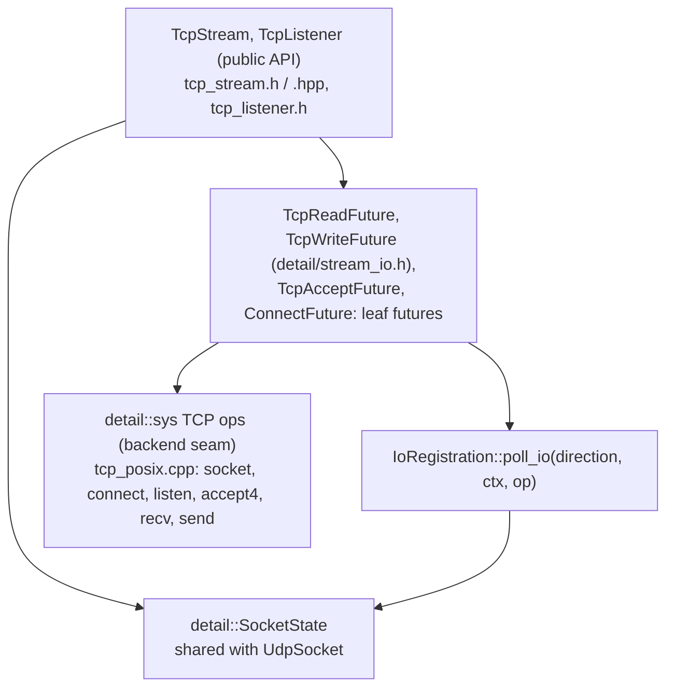
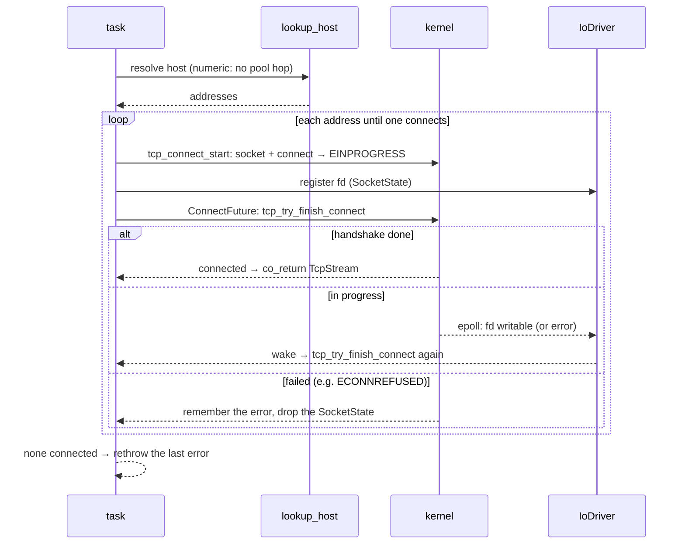

# TCP Stream

`TcpStream` (a connected byte stream) and `TcpListener` (a listening socket that accepts
`TcpStream`s). On desktop both run on the [I/O Driver](io_driver.md): every operation is
a non-blocking syscall on the calling thread, and an operation that would block waits for
readiness from the driver. On Pico the same API runs over the lwIP raw TCP API (see
[Pico (lwIP) backend](#pico-lwip-backend)).

---

## Goals

- **Same API on every platform.** `connect` and `bind` return `Coro`s on both backends,
  and reads and writes take a `ByteBuffer` by value and hand it back.
- **No allocation in the common case.** Reads, writes and accepts are hand-written leaf
  futures. When data is already buffered, the send buffer has room, or a connection is
  already queued, the first `poll()` completes the operation with no coroutine frame and
  no wait.
- **Safe to drop.** No future has a `cancel()`. Dropping any of them is memory-safe, and
  dropping a pending `read()` or `accept()` loses nothing, so they can race a timer in
  `timeout()` or `select()`.
- **No thread hop.** The syscall runs on whichever worker polls the future. Only a
  would-block involves the driver.

## Non-goals

- **Overlapping reads or overlapping writes on one stream.** One read and one write may
  run concurrently; two of the same kind may not (see [Races](#races)).
- **Socket options and half-close.** See [Known limitations](#known-limitations).

---

## Public API

```cpp
#include <coro/io/tcp_listener.h>
#include <coro/io/tcp_stream.h>

auto listener = co_await coro::TcpListener::bind("0.0.0.0", 8080);
coro::TcpStream conn = co_await listener.accept();

auto [n, buf] = co_await conn.read(std::vector<std::byte>(4096));   // up to 4096 bytes
buf.resize(n);
co_await conn.write(std::move(buf));                                 // echoes it back

auto client = co_await coro::TcpStream::connect("localhost", 8080);
```

| Method | Returns | Output |
|---|---|---|
| `TcpStream::connect(host, port)` | `Coro<TcpStream>` | the connected stream |
| `read(buf)` | `TcpReadFuture<Buf, false>` | `{bytes_read, buf}` after the first non-empty chunk; 0 at EOF |
| `read_exact(buf)` | `TcpReadFuture<Buf, true>` | `{bytes_read, buf}` once `buf` is full; fewer only at EOF |
| `write(buf)` | `TcpWriteFuture<Buf>` | `buf`, once the kernel has accepted every byte |
| `TcpListener::bind(host, port)` | `Coro<TcpListener>` | the listening socket |
| `accept()` | `TcpAcceptFuture` | the next incoming `TcpStream` |

`host` is an IPv4 or IPv6 literal or a name. Names are resolved with
[`lookup_host`](file_io.md#lookup_host), and each address is tried in the resolver's
order. Errors are `std::system_error`, thrown at `co_await`. `connect` and `bind` throw
`std::logic_error` on a `Runtime` whose executor never turns the driver (a
`CurrentThreadExecutor` given its own `Parker`), because nothing would ever wake their
futures.

Both types are move-only. The socket is closed when the last owner drops it: the
`TcpStream` or `TcpListener`, or a future still pending on it.

---

## Layers



Each stream and listener holds a `shared_ptr<detail::SocketState>`: the fd, the driver it
is registered with, and its `IoRegistration`. Every future copies the pointer, so the fd
outlives any syscall made on it. `SocketState` is shared with `UdpSocket` and described
in [UDP Socket](udp_socket.md#socketstate-who-owns-the-fd).

### The `sys/tcp.h` seam

The portable code never makes a syscall itself. It calls these, so a new platform
supplies `sys/tcp.h` (and `sys/socket.h`) and reuses both types unchanged; see
[I/O Driver](io_driver.md#porting-to-a-new-platform).

| Function | Kind | POSIX implementation |
|---|---|---|
| `tcp_connect_start(peer)` | setup, throws | `socket(SOCK_STREAM \| SOCK_NONBLOCK \| SOCK_CLOEXEC)`, then `connect`; `EINPROGRESS` and `EINTR` mean "still connecting" |
| `tcp_try_finish_connect(fd)` | non-blocking | `SO_ERROR`, then `getpeername`; `ENOTCONN` is reported as `EAGAIN` |
| `tcp_listen(local, backlog)` | setup, throws | `socket`, `SO_REUSEADDR`, `bind`, `listen` |
| `tcp_try_accept(listener)` | non-blocking | `accept4(SOCK_NONBLOCK \| SOCK_CLOEXEC)`, skipping `ECONNABORTED`, `EPROTO` and `EINTR` |
| `tcp_try_read(fd, ...)` | non-blocking | `recv(MSG_DONTWAIT)` |
| `tcp_try_write(fd, ...)` | non-blocking | `send(MSG_DONTWAIT \| MSG_NOSIGNAL)` |

The non-blocking functions return `sys::IoResult` (a byte count or an errno). An `EAGAIN`
errno means "wait for readiness and retry", which is what `IoRegistration::poll_io`
does. Setup functions close the socket themselves before throwing, so nothing leaks.

Where `MSG_NOSIGNAL` does not exist, the socket is created with `SO_NOSIGPIPE` instead,
so a write to a closed connection fails with `EPIPE` rather than killing the process.

---

## Byte-stream futures

`detail/stream_io.h` holds the read and write futures shared by every byte stream on the
driver. `TcpReadFuture` and `TcpWriteFuture` are aliases of them, and `Pipe` uses the
same templates. Each stream type supplies an `Io` policy naming its syscalls and its
error-message prefixes:

```cpp
struct TcpIo {
    static sys::IoResult try_read (sys::RawFd, std::byte*, std::size_t) noexcept;  // tcp_try_read
    static sys::IoResult try_write(sys::RawFd, const std::byte*, std::size_t) noexcept;  // tcp_try_write
    static constexpr const char* read_name = "TcpStream::read", ...;
};

template<ByteBuffer Buf, bool Exact>
using TcpReadFuture = detail::FdReadFuture<detail::TcpIo, Buf, Exact>;
template<ByteBuffer Buf>
using TcpWriteFuture = detail::FdWriteFuture<detail::TcpIo, Buf>;
```

- **`FdReadFuture`** calls `poll_io(Read, try_read)` into the unfilled part of `buf`.
  With `Exact = false` it returns after the first non-empty chunk. With `Exact = true`
  it loops until `buf` is full or the peer closes. A zero-byte read is EOF.
- **`FdWriteFuture`** loops `poll_io(Write, try_write)` until every byte is written. A
  partial write keeps its progress in the future and waits for write readiness before
  sending the rest.
- **First poll is eager.** `FutureAwaitable::await_ready()` runs the first `poll()`, so a
  read of buffered data or a write that fits in the send buffer never suspends.

Dropping a pending future is always memory-safe: it holds only a weak waker in the
registration. What it does to the byte stream depends on how far it got:

| Dropped while pending | Effect on the stream |
|---|---|
| `read()` | Nothing. No bytes were consumed, so the next read gets them. |
| `read_exact()` | The bytes it already read are lost with it. |
| `write()` | Part of the buffer may have been sent. |
| `accept()` | Nothing. The connection stays queued for the next `accept()`. |

After a dropped `read_exact()` or `write()` the byte stream is out of step, and the
connection should be closed. `tcp_stream.h` documents this on `TcpStream`.

---

## `connect`



`connect` is a `Coro`, because it awaits `lookup_host` and loops over addresses. The wait
for each handshake is a private leaf future, `ConnectFuture`, so dropping `connect`
mid-handshake just drops the `SocketState`, which closes the socket. If every address
fails, the last address's error is rethrown, as tokio does. For example, `"localhost"`
may resolve to `::1` first: if nothing listens there, that attempt is refused and the
IPv4 address is tried next.

---

## `TcpListener`

`bind` resolves `host` the same way and listens on the first address that binds, with
`SO_REUSEADDR` (so a restarted server can rebind while old connections sit in
`TIME_WAIT`) and a backlog of 128. The kernel caps the backlog at
`net.core.somaxconn`.

`accept()` returns a `TcpAcceptFuture`, a leaf future around
`poll_io(Read, tcp_try_accept)`. The accepted socket is registered with the listener's
driver (the `IoDriver*` held in its `SocketState`), not with the accepting thread's
runtime. If the registration throws, the new `SocketState` closes the fd itself and the
error surfaces at `co_await`.

`tcp_try_accept` skips `ECONNABORTED`, `EPROTO` and `EINTR`. They concern one connection
that died while queued, not the listener, so it tries the next connection. Any error it
returns (for example `EMFILE`) concerns the listener.

Dropping the listener closes the listening socket once no `accept()` is pending.
Connections still in the kernel's backlog are reset.

---

## Races

- **Connect finishing before registration.** The fd is registered after `connect()`
  returns `EINPROGRESS`, so the handshake can complete before the driver knows the fd.
  Readiness starts set, so the first poll calls `tcp_try_finish_connect` at once and sees
  it.
- **Finishing a connect.** `tcp_try_finish_connect` reads `SO_ERROR`, then calls
  `getpeername`. `ENOTCONN` there means "still in progress". A connect that fails between
  the two calls is read as in progress once. The failure's `EPOLLERR` event then wakes
  the future again, and the next poll reads the real error from `SO_ERROR`. This is
  commented in `tcp_posix.cpp`.
- **Accept without `accept4`.** Platforms without it use `accept` and then `fcntl`, which
  leaves a window where a concurrent `fork`+`exec` inherits the fd. This is commented in
  `tcp_posix.cpp`. Linux and FreeBSD use `accept4`.
- **One read and one write at once.** Allowed: the registration has one waker slot per
  direction. Two reads, two writes or two accepts at once are not supported. The second
  would replace the first's waker, leaving the first unwoken, and the two would split or
  interleave the byte stream.
- **Stream dropped while a future is pending.** The future's share of `SocketState`
  keeps the fd open and registered until the future completes or is dropped, so the fd
  is never closed under a running syscall or reused under a pending one.

---

## Pico (lwIP) backend

With `CORO_TCP_BACKEND_LWIP` defined, `tcp_stream.h` and `tcp_listener.h` select a
different class body over the lwIP raw TCP API (`src/io/lwip/tcp_stream_lwip.cpp`,
`tcp_listener_lwip.cpp`). Callbacks fire on the executor thread from
`cyw43_arch_poll()`, and `connect` resolves names through lwIP's DNS. See
[Pico Port](pico_port.md), "Component design", for its shared state, destructor and
connect sequence.

`connect` and `accept` are `Coro`s. `read`, `read_exact` and `write` return hand-written
futures, as on desktop, so a transfer costs no coroutine frame:

| Future | Returned by | Output |
|---|---|---|
| `TcpReadFuture<Buf, false>` | `read()` | `pair<size_t, Buf>` |
| `TcpReadFuture<Buf, true>` | `read_exact()` | `pair<size_t, Buf>` |
| `TcpWriteFuture<Buf>` | `write()` | `pair<size_t, Buf>` |

Each holds an `Rc<LwipTcpCtx>` and the caller's buffer. `tcp_stream.h` must not include
lwIP's headers, so `poll()` forwards to `detail::lwip_tcp_poll_read()` or
`lwip_tcp_poll_write()` in `tcp_stream_lwip.cpp`.

- **Read** drains `rx_buf` into the buffer first. With data taken (and, for
  `read_exact`, the buffer full) it is ready. Otherwise a connection error becomes
  `PollError`, EOF returns what was read, and anything else stores `rx_waker` and
  waits for `on_recv`. A read into an empty buffer returns 0 at once.
- **Write** copies as much as `tcp_sndbuf()` allows with `tcp_write()`
  (`TCP_WRITE_FLAG_COPY`). With the send buffer full it flushes once with `tcp_output()`,
  and if there is still no room stores `tx_waker` and waits for `on_sent`. It flushes
  again when the last byte is queued.
- **Dropping** a pending read or write clears its waker from the connection. Bytes a
  read already copied out are lost with its buffer, and bytes a write already queued are
  still sent. This matches the desktop futures.

As on desktop, one read and one write may be pending at once, but not two of either: the
connection has one waker slot per direction.

---

## Known limitations

!!! tip "TODO: socket options"
    There is no way to set `TCP_NODELAY`, keepalive or buffer sizes. Add them as
    `sys/tcp.h` functions and `TcpStream` methods, as `UdpSocket` does for broadcast and
    multicast, when a workload needs them.

!!! tip "TODO: half-close and addresses"
    There is no `shutdown(SHUT_WR)`, and no `peer_addr()` or `local_addr()`. Without
    `local_addr()`, a listener bound to port 0 can't report the port it got.

---

## Tests

`test/io/test_tcp_stream.cpp` (`test_tcp_stream`, loopback ports 31001–31018).
`static_assert`s check that every TCP future is a `Future` and not `Cancellable`.

| Test | Checks |
|---|---|
| `EchoRoundTrip{WorkStealing,CurrentThread,WorkSharing}` | Connect, accept and echo on each executor. |
| `MultipleMessagesInOrder`, `ReadReturnsZeroAtEof`, `ReadExactStopsShortAtEof` | Ordering and EOF semantics of `read` and `read_exact`. |
| `LargeWriteCompletesInPieces{WorkStealing,CurrentThread}` | An 8 MB `write()` exceeds the socket buffers, waits for write readiness repeatedly, and arrives intact. |
| `Ipv6Loopback` | Bind and connect on `::1` (skipped if IPv6 is unavailable). |
| `ConnectRefusedThrowsOnAwait` | `ECONNREFUSED` surfaces as `std::system_error` at `co_await`. |
| `BadAddressesThrowOnAwait` | `EADDRINUSE` on bind; an unresolvable name fails in `dns_error_category()`. |
| `WriteToClosedPeerThrowsWithoutSigpipe` | Writing after the peer closed throws `EPIPE`/`ECONNRESET` and does not kill the process. |
| `ThrowsWithoutDriver` | `connect` and `bind` throw `std::logic_error` on a `CurrentThreadExecutor` with a `PollingParker`. |
| `DroppedAcceptAcceptsNothing`, `DroppedReadLosesNoData` | An `accept` or `read` dropped mid-wait (it lost a `select` to a timer) consumes nothing. |
| `StreamDroppedWhileReadPending` | A spawned read keeps the socket open after the `TcpStream` is destroyed, then completes. |
| `AcceptWaitsOnWorkSharing` | An idle WorkSharing worker turning the driver wakes a pending accept. |
| `ConcurrentReadAndWriteOnOneStream` | 1000 numbered messages with a read task and a write task on one stream on `Runtime(4)`. |

Name resolution is covered in `test/io/test_lookup_host.cpp`:

| Test | Checks |
|---|---|
| `LookupHostTest.ConnectByNameTriesEachAddress` | `connect("localhost")` falls through to `127.0.0.1` when `::1` refuses. |
| `LookupHostTest.BindByName` | `TcpListener::bind` and `UdpSocket::bind` accept `"localhost"`. |
| `LookupHostTest.ConnectByNameRethrowsLastError` | With every address refused, the error is `ECONNREFUSED`. |
| `LookupHostTest.ConnectToUnresolvableNameThrowsDnsError` | `nonexistent.invalid` fails in `dns_error_category()`. |

The lwIP backend is tested by the same file. `test/io/test_tcp_stream.cpp` is also built
against lwIP on the host (`test_tcp_stream_pico`) and into the on-target firmware; its
tests of the other executors, IPv6 and errno values are compiled for the desktop only.
One test is lwIP-only: a read into an empty buffer returns 0 at once.

!!! warning "FIXME: the backends report errors with different exception types"
    The desktop backend throws `std::system_error` carrying the errno; the lwIP backend
    throws `std::runtime_error` with a message. `ConnectRefusedThrowsOnAwait` therefore
    checks each differently, and portable code can only catch `std::exception`.

---

## Files

| File | Contents |
|---|---|
| `include/coro/io/tcp_stream.h`, `tcp_stream.hpp`, `src/io/tcp_stream.cpp` | `TcpStream`, `TcpIo`, `ConnectFuture` |
| `include/coro/io/tcp_listener.h`, `src/io/tcp_listener.cpp` | `TcpListener`, `TcpAcceptFuture` |
| `include/coro/detail/stream_io.h` | `FdReadFuture`, `FdWriteFuture` (shared with `Pipe`) |
| `include/coro/detail/sys/tcp.h`, `src/detail/sys/tcp_posix.cpp` | TCP backend seam |
| `include/coro/detail/socket_state.h`, `src/detail/socket_state.cpp` | `SocketState`, shared with `UdpSocket` |
| `src/io/lwip/tcp_stream_lwip.cpp`, `tcp_listener_lwip.cpp` | Pico (lwIP) backend |
| `test/io/test_tcp_stream.cpp` | Tests |

`stream_io.h`, `socket_state.h` and `detail/sys/` are excluded from the Pico install.
