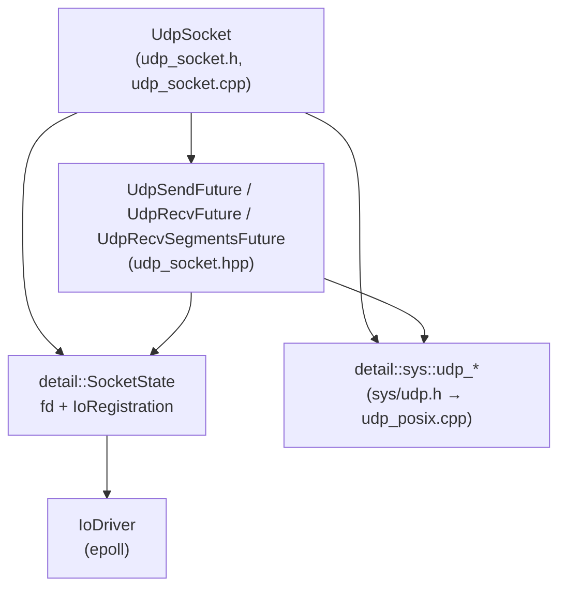
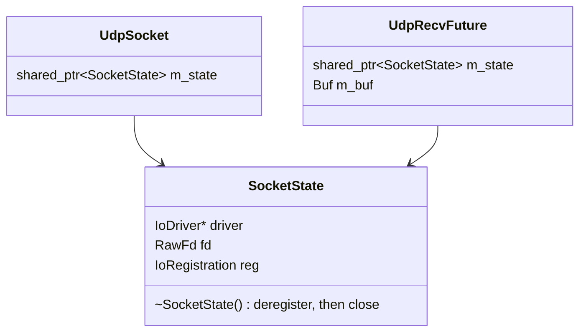
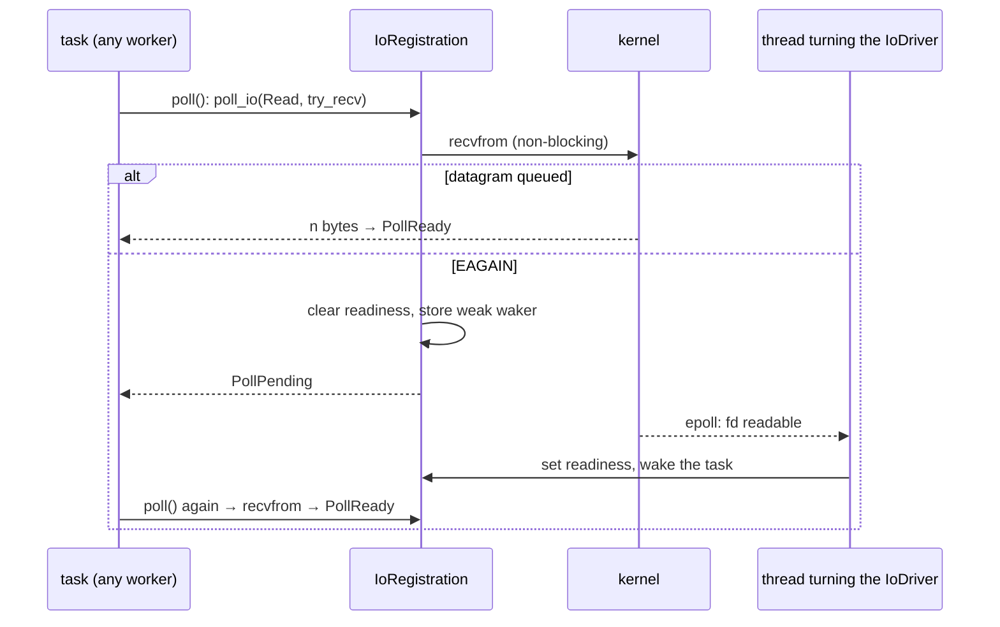

# UDP Socket

`UdpSocket` — async, connectionless UDP send/recv. Mirrors `TcpStream`/`TcpListener`'s
dual-backend structure: on desktop it runs on the Runtime's [I/O Driver](io_driver.md),
and on the Pico port (`CORO_PICO`) on lwIP's raw API.

---

## Overview

`UdpSocket` exposes a `sendto`/`recvfrom`-style API — every send specifies a destination,
every receive reports who it came from. It also supports an optional `connect()`-fixed-peer
mode, mirroring BSD "connected" UDP sockets: once connected, `send()`/`recv()` drop the
address argument and the OS (or lwIP) filters out datagrams from any other peer.

```cpp
UdpSocket sock = co_await UdpSocket::bind("0.0.0.0", 9000);

// Send a datagram to a specific peer. SocketAddress::parse validates the
// address up front rather than deferring failure to send_to().
auto peer = SocketAddress::parse("127.0.0.1", 9001).value();
co_await sock.send_to(std::string("hello"), peer);

// Receive the next datagram into the caller's buffer; reports who sent it.
auto [n, buf, sender] = co_await sock.recv_from(std::string(1500, '\0'));
buf.resize(n);
std::printf("got %zu bytes from %s\n", n, sender.to_string().c_str());

// Or fix a single peer up front and drop the address argument on every call:
UdpSocket client = co_await UdpSocket::bind("0.0.0.0", 0);
co_await client.connect(peer);
co_await client.send(std::string("hello"));
auto [n2, buf2] = co_await client.recv(std::string(1500, '\0'));
```

Both directions take the caller's buffer by value and return it — no span or raw pointer
ever escapes the I/O operation (see [`ByteBuffer`](../../include/coro/io/byte_buffer.h)).
Unlike `send_to`/`send`, `recv_from`/`recv` can't know the datagram's size ahead of time,
so oversized datagrams are truncated to fit the caller's buffer, same as POSIX
`recvfrom()`. There is no internal receive queue — `coro` does not buffer datagrams in
userspace on either backend. On the desktop backend, `recv_from`/`recv` first try a
non-blocking read on the calling thread; if nothing is queued yet, the call waits for
read readiness and the kernel's own per-socket receive buffer holds any datagrams that
arrive in the meantime, exactly as it would for any other UDP socket — see
[Receive path](#receive-path) below. lwIP has no equivalent OS-level buffer, so a datagram
that arrives while nothing is awaiting `recv_from`/`recv` on the Pico backend is dropped;
see the same section for why.

---

## `SocketAddress` — new shared address type

Nothing in the codebase today needs to report a peer address back to the caller —
`TcpStream::connect(host, port)` and `TcpListener::bind(host, port)` only ever take an
address as input. `recv_from()` is the first API that needs to *produce* one, so this
design introduces the library's first address type.

Modeled on Rust's `SocketAddr`/`Ipv4Addr`/`Ipv6Addr` split, but spelled out in full
(`SocketAddress`) to match this codebase's existing naming (`JoinHandle`,
`CancellationToken`) rather than Rust's abbreviation. Like Rust's version, addresses are
stored as fixed-size byte arrays, never as strings:

```cpp
// include/coro/io/socket_address.h
namespace coro {

struct Ipv4Address {
    std::array<uint8_t, 4> octets{};
};

struct Ipv6Address {
    std::array<uint8_t, 16> octets{};
    // Interface index disambiguating link-local addresses (fe80::/10), which are not
    // globally unique — the same address can be valid on multiple interfaces at once.
    // Zero for global-scope addresses, where it's meaningless. Corresponds directly to
    // sockaddr_in6::sin6_scope_id.
    uint32_t scope_id = 0;
};

struct SocketAddress {
    std::variant<Ipv4Address, Ipv6Address> address;
    uint16_t port = 0;

    /// Parses a numeric IPv4 or IPv6 address ("127.0.0.1", "::1", "fe80::1%3") plus
    /// port into a SocketAddress. Returns std::nullopt on malformed input — there is
    /// no way to construct a SocketAddress holding an invalid address.
    static std::optional<SocketAddress> parse(std::string_view host, uint16_t port);

    /// Renders back to text, e.g. "127.0.0.1:9001" or "[fe80::1%3]:9001". For
    /// logging/diagnostics only — allocates, so it must never sit on the send/recv
    /// hot path.
    std::string to_string() const;
};

} // namespace coro
```

`Ipv4Address` and `Ipv6Address` are trivially-copyable, fixed-size value types (5 and 20
bytes respectively) — no heap allocation, which matters as much for the Pico port as for
avoiding an unnecessary allocation on every desktop `send_to`/`recv_from`. Validation
happens once, at `parse()`, rather than being deferred to whatever eventually converts
a stored string. `parse()` is implemented with `inet_pton()` on the desktop backend and
`ip4addr_aton`/`ip6addr_aton` on the lwIP backend.

Shared by both backends and placed alongside `byte_buffer.h` under `include/coro/io/`
since, like `ByteBuffer`, it's a plain value type with no backend-specific code.
`Ipv6Address` exists in the type from day one, but see [Known limitations](#known-limitations--future-work) —
the Pico/lwIP backend only supports IPv4 in this design, consistent with the existing
`pico_port.md` limitation for `TcpStream`/`TcpListener`.

---

## Receive path

`coro` does not buffer datagrams in userspace. A userspace queue between the socket and
`recv_from()`/`recv()`, with its own capacity and drop policy, was considered and
rejected: on the desktop backend the kernel's own per-socket receive buffer already does
that job, the same way it does for any other UDP socket in any other language. The one
thing a userspace queue could do differently — drop the *oldest* queued datagram instead
of the newest when full — isn't something this design needs to provide. Instead:

- **Desktop (IoDriver):** `recv_from()`/`recv()` try a non-blocking `recvfrom()` on the
  calling thread. If a datagram is already sitting in the kernel's receive buffer, it is
  read straight into the caller's buffer with no suspension and no extra copy. Only on
  `EAGAIN` does the call wait, for read readiness from the IoDriver, and then retry; the
  kernel buffers everything that arrives in between, same as it always does. See
  [Send and receive futures](#send-and-receive-futures).
- **Pico (lwIP):** there is no socket fd to read from directly, and no OS-level receive
  buffer underneath lwIP at all, and no internal queue either, so `recv_from()`/`recv()`
  always suspend, registering `udp_recv()` for exactly this one call. A datagram that
  arrives while nothing is registered — i.e. while no `recv_from()`/`recv()` call is
  currently awaiting — is simply dropped by lwIP itself, with no buffer anywhere to catch
  it. This is a real, backend-specific behavior difference from the desktop backend,
  called out again in [Known limitations](#known-limitations--future-work).

---

## Public API

```cpp
// include/coro/io/udp_socket.h
class UdpSocket {
public:
    UdpSocket(UdpSocket&&) noexcept;
    UdpSocket& operator=(UdpSocket&&) noexcept;
    UdpSocket(const UdpSocket&)            = delete;
    UdpSocket& operator=(const UdpSocket&) = delete;

    ~UdpSocket();

    /// Binds a UDP socket to host:port. host is an IPv4 or IPv6 literal ("0.0.0.0",
    /// "::", ...) or, on desktop, a name resolved with lookup_host(); the first
    /// resolved address that binds is used.
    [[nodiscard]] static /* Future<UdpSocket> */ bind(std::string host, uint16_t port);

    /// Sends buf as a single datagram to dest. Returns buf once the send completes.
    template<ByteBuffer Buf>
    [[nodiscard]] /* Future<Buf> */ send_to(Buf buf, SocketAddress dest);

    /// Waits for the next datagram, copying it into buf. Returns {n, buf, sender},
    /// where n is the number of bytes written into buf. If the datagram was larger
    /// than buf, it is truncated to fit — same as POSIX recvfrom(). Suspends if none
    /// has arrived yet; see [Receive path](#receive-path) — there is no internal
    /// queue, so datagrams that arrive while nothing is awaiting are held by the
    /// kernel (desktop backend) or dropped (lwIP backend, which has no equivalent
    /// buffer).
    template<ByteBuffer Buf>
    [[nodiscard]] /* Future<std::tuple<std::size_t, Buf, SocketAddress>> */ recv_from(Buf buf);

    /// Fixes peer as this socket's only correspondent. Once connected, plain
    /// send()/recv() may be used instead of send_to()/recv_from(); datagrams from
    /// any other address are dropped by the OS (desktop backend) or by pcb->remote_ip
    /// filtering (lwIP backend) before they ever reach recv().
    [[nodiscard]] /* Future<void> */ connect(SocketAddress peer);

    /// Sends buf to the peer fixed by connect(). Throws if not connected.
    template<ByteBuffer Buf>
    [[nodiscard]] /* Future<Buf> */ send(Buf buf);

    /// Waits for the next datagram from the peer fixed by connect(), copying it
    /// into buf. Throws if not connected. Same truncation contract as recv_from().
    template<ByteBuffer Buf>
    [[nodiscard]] /* Future<std::tuple<std::size_t, Buf>> */ recv(Buf buf);

    /// Enables (or disables) sending to broadcast addresses via send_to()/send().
    /// Required on the desktop backend before a sendto() to a broadcast address is
    /// permitted by the OS (SO_BROADCAST) — otherwise it fails with EACCES. A no-op
    /// on the lwIP backend, which doesn't gate broadcast on this build's config; see
    /// [Multicast and broadcast](#multicast-and-broadcast).
    [[nodiscard]] /* Future<void> */ set_broadcast(bool enabled);

    /// Desktop backend on Linux only: UDP GSO. Later send()/send_to() buffers longer
    /// than bytes go out as consecutive datagrams of bytes each (last may be
    /// shorter) in one syscall. 0 disables. See [Segmented sends
    /// (GSO)](#segmented-sends-gso).
    void set_segment_size(std::size_t bytes);

    /// Desktop backend on Linux only: UDP GRO. The kernel may coalesce consecutive
    /// same-sized datagrams from one sender into one queued buffer; read them with
    /// recv_segments_from(). See [Coalesced receives (GRO)](#coalesced-receives-gro).
    void set_gro(bool enabled);

    /// Desktop backend only: like recv_from(), but returns {n, buf, sender,
    /// segment_size} -- buf[0, n) holds one or more datagrams of segment_size
    /// bytes each (the last may be shorter).
    template<ByteBuffer Buf>
    [[nodiscard]] /* Future<UdpSegments<Buf>> */ recv_segments_from(Buf buf);

    /// Joins multicast group so recv_from()/recv() start receiving datagrams sent to
    /// it. iface selects which local interface to join on; the default
    /// (Ipv4Address{}) lets the OS (desktop) or the single Pico interface (lwIP) choose.
    /// IPv4 only — see [Multicast and broadcast](#multicast-and-broadcast).
    [[nodiscard]] /* Future<void> */ join_multicast(Ipv4Address group, Ipv4Address iface = {});

    /// Leaves a multicast group previously joined with join_multicast().
    [[nodiscard]] /* Future<void> */ leave_multicast(Ipv4Address group, Ipv4Address iface = {});
};
```

The exact return type differs per backend:

| Backend | Method | Return type | Why |
|---|---|---|---|
| desktop (IoDriver) | `send_to()`, `send()` | `UdpSendFuture<Buf>` | A leaf future: the first `poll()` tries the non-blocking send; only on EAGAIN does it wait for write readiness |
| desktop (IoDriver) | `recv_from()`, `recv()` | `UdpRecvFuture<Buf, WithSender>` | A leaf future: tries `recvfrom()`; on EAGAIN waits for read readiness. Safe to drop at any time |
| desktop (IoDriver) | `recv_segments_from()` | `UdpRecvSegmentsFuture<Buf>` | Same as `recv_from()`, with `recvmsg()` for the GRO segment size |
| desktop (IoDriver) | `bind()`, `connect()`, `set_broadcast()`, `join_multicast()`, `leave_multicast()` | `Coro<T>` | Plain syscalls on the calling thread; no thread hop. Errors are thrown on `co_await`. `bind()` throws `std::logic_error` on a runtime whose executor doesn't turn the IoDriver (a `CurrentThreadExecutor` given its own `Parker`) |
| desktop (IoDriver) | `set_segment_size()`, `set_gro()` | `void` | A plain `setsockopt()` |
| lwIP (Pico) | all | `Coro<T>` | Callbacks fire synchronously inside the caller's own executor tick — no thread hop, so a plain `Coro` suffices, same as `TcpStream`'s lwIP methods |

**Concurrency** (matches the existing `TcpStream` restriction): only one receive
(`recv_from()`/`recv()`) may be in flight at a time, and only one send (`send_to()`/`send()`)
may be in flight at a time. A concurrent receive + send pair is fine — they use
independent wakers. `connect()` itself does not suspend on either backend (see below) and
must not be called concurrently with a send or receive already in flight, since it
changes the peer those operations use.

**Mixing `_to`/`_from` calls with `connect()`:** once `connect()` has been called,
both `recv_from()` and `send_to()` remain callable on both backends.

`sendto(2)`'s man page lists `EISCONN` ("a connection-mode socket was connected already
but a recipient was specified"). That case doesn't arise for UDP on Linux: `sendto(2)`
accepts an explicit destination on a connected UDP socket without error, so the desktop
`send_to()` passes the destination through as given, connected or not. `recv_from()` is
unaffected either way: once `connect()` has run, the kernel only delivers datagrams from
the connected peer, so `recv_from()` and `recv()` behave identically on this backend.

The lwIP backend has never had this restriction — `udp_sendto()` always accepts
an explicit destination regardless of connected state.

---

## Multicast and broadcast

Both are supported in this first iteration rather than deferred, since the underlying
mechanism already exists on both backends:

- **Multicast (desktop):** the `IP_ADD_MEMBERSHIP`/`IP_DROP_MEMBERSHIP` socket options
  join/leave an IGMP group — no new dependency.
- **Multicast (lwIP):** `LWIP_IGMP` is already `1` in this project's bundled
  `lwipopts.h.in` (enabled for the mDNS responder's own group join), so
  `igmp_joingroup_netif()`/`igmp_leavegroup_netif()` are already compiled into every Pico
  build — nothing to newly enable, just to call.
- **Broadcast (desktop):** the OS refuses a `sendto()` to a broadcast address with `EACCES`
  unless `SO_BROADCAST` is set first, so `set_broadcast(true)`
  must be called explicitly before broadcasting.
- **Broadcast (lwIP):** no explicit enable step is needed. lwIP's raw UDP API only
  enforces an `SO_BROADCAST`-equivalent check (an `SOF_BROADCAST` flag on the pcb) when
  `IP_SOF_BROADCAST`/`IP_SOF_BROADCAST_RECV` are defined; both default to `0` in lwIP's
  `opt.h` and are left unset in this project's `lwipopts.h.in`, so the check in
  `udp_sendto_if()` (`src/core/udp.c`) is compiled out entirely and `udp_sendto()` to a
  broadcast address just works. `set_broadcast()` is a no-op on this backend, kept only
  for API symmetry — see [Pico (lwIP) backend](#pico-lwip-backend) below.

**Scope kept deliberately narrow for this iteration:** `group`/`iface` are `Ipv4Address`,
not `SocketAddress` — there is no IPv6 multicast (MLD) support, consistent with the
existing IPv4-only limitation for the lwIP backend generally (see [Known
limitations](#known-limitations--future-work)). On the Pico backend, `iface` is accepted
for API symmetry with the desktop backend but ignored — a Pico target has exactly one
network interface, so there's nothing to select between; `join_multicast`/
`leave_multicast` always act on `netif_default`. Source-specific multicast (IGMPv3),
multicast TTL/loopback control, and directed (non-limited) broadcast address computation
from a subnet mask are all left for a future iteration.

---

## Backend flag

Per the project's existing (deferred) [[backend flag scheme]] design question, UDP gets
its own flag rather than reusing `CORO_TCP_BACKEND_LWIP`, since the two are logically
independent components that happen to be enabled together today:

| Flag | Effect |
|---|---|
| `CORO_UDP_BACKEND_LWIP` | Selects the lwIP backend for `UdpSocket` |

`cmake/platforms/pico.cmake` defines both `CORO_TCP_BACKEND_LWIP` and
`CORO_UDP_BACKEND_LWIP` for real Pico builds, same as it does today for TCP alone. A
desktop build defines neither, so `udp_socket.h`'s `#else` branch (IoDriver) is compiled.

---

## Desktop (IoDriver) backend



Every operation is a non-blocking syscall on the calling thread. An operation that would
block waits for readiness from the Runtime's [I/O Driver](io_driver.md), and is retried on
whichever worker the task is next polled on. There is no dedicated I/O thread and no
thread hop.

### The `sys/udp.h` seam

`UdpSocket` and its futures make no syscall themselves. Every one goes through
`include/coro/detail/sys/udp.h`, in the style of the driver's
[`sys` layer](io_driver.md#the-sys-layer), so a new platform implements that file and
reuses `UdpSocket` unchanged (see
[Porting to a new platform](io_driver.md#porting-to-a-new-platform)).

| Function | Syscall (POSIX backend, `src/detail/sys/udp_posix.cpp`) |
|---|---|
| `udp_open(local)` | `socket` (non-blocking, close-on-exec, `local`'s family) + `bind` |
| `udp_connect(fd, peer)` | `connect` |
| `udp_set_broadcast(fd, on)` | `SO_BROADCAST` |
| `udp_set_membership(fd, group, iface, join)` | `IP_ADD_MEMBERSHIP` / `IP_DROP_MEMBERSHIP` |
| `udp_set_segment_size(fd, bytes)`, `udp_set_gro(fd, on)` | `UDP_SEGMENT`, `UDP_GRO` (Linux; `ENOTSUP` elsewhere) |
| `udp_try_send(fd, data, size, dest)` | one `sendto`; `dest == nullptr` sends to the connected peer |
| `udp_try_recv(fd, data, size, sender)` | one `recvfrom`; `sender == nullptr` skips decoding the address |
| `udp_try_recv_segments(fd, data, size, sender, seg)` | one `recvmsg`, reading the `UDP_GRO` control message |

The setup functions throw `std::system_error`. The `try_` functions never block and
return an `IoResult`: a byte count, or an errno, where a would-block errno means "wait for
readiness and retry".

`SocketAddress` crosses to and from `sockaddr_storage` through `to_sockaddr()` and
`from_sockaddr()` in `src/detail/sys/sockaddr_posix.h`. They dispatch on the
`SocketAddress` variant and on `sa_family`, and carry `scope_id` for IPv6. The header is
private to the POSIX backends; no public header needs it.

### `SocketState`: who owns the fd



`UdpSocket` holds a `shared_ptr<detail::SocketState>`, and every future it hands out
copies it. `SocketState` registers the fd with the driver once, for both directions, when
the socket is created. Its destructor deregisters and then closes the fd. So the fd is
closed when the socket and every future started on it are gone, on whichever thread drops
the last share, and never while another worker is in a syscall on it. The other socket
primitives share the same `SocketState`.

### Send and receive futures

`send_to()`/`send()`, `recv_from()`/`recv()` and `recv_segments_from()` return
hand-written leaf futures (`udp_socket.hpp`), not coroutines. Each `poll()` is one call to
the registration's `poll_io`, wrapping one `try_` syscall:

```cpp
PollResult<OutputType> poll(detail::Context& ctx) {
    SocketAddress sender;
    auto result = m_state->reg.poll_io(IoDirection::Read, ctx, [&] {
        return detail::sys::udp_try_recv(m_state->fd, data, size, &sender);
    });
    if (!result) return PollPending;                 // waker stored; the driver wakes it
    if (!*result) return PollError(detail::socket_error(result->error(), "UdpSocket::recv_from"));
    return OutputType{**result, std::move(m_buf), sender};
}
```



- **No allocation in the common case.** `FutureAwaitable::await_ready()` runs the first
  `poll()` eagerly. A send the kernel accepts at once, or a receive with a datagram already
  queued, completes without suspending and without a coroutine frame.
- **Readiness handshake.** `poll_io` is the driver's
  [readiness handshake](io_driver.md#scheduledio-and-the-readiness-handshake). Readiness
  that arrives after the syscall saw `EAGAIN` is not lost: `poll_io` retries at once.
- **Straight into the caller's buffer.** The kernel copies the datagram directly into
  `buf`. A datagram larger than `buf` is truncated, as with `recvfrom()`.
- **Atomic sends.** A UDP datagram is sent whole or not at all, so there is no
  partial-send bookkeeping.
- **Safe to drop.** The futures have no `cancel()`. While pending, a future has only a
  weak waker stored in the registration and nothing armed in the kernel. Dropping it (for
  example when it loses a `timeout()`) leaves a stale waker that causes at most one
  spurious wake, and the next datagram goes to the next receive.

`send()` is `send_to()` with no destination, and `recv()` is `recv_from()` without
decoding the sender: on a connected socket the kernel already filtered to the peer.

### `connect` and socket options

`connect()`, `set_broadcast()`, `join_multicast()` and `leave_multicast()` are one
`connect`/`setsockopt` each, on the calling thread. They never wait, but return
`Coro<void>` so that errors arrive at `co_await` and the API matches the lwIP backend.
Each is a private static `_impl` coroutine that takes the `shared_ptr<SocketState>` by
value, so the lazy coroutine never holds `this` (the socket may be moved before it runs).

After `connect()` the kernel delivers only the peer's datagrams, and `send()` goes to the
peer. `join_multicast()` passes an all-zero `iface` as `INADDR_ANY`, letting the kernel
choose the interface.

`set_segment_size()` and `set_gro()` return `void`: they are plain `setsockopt` calls that
throw `std::system_error` directly.

### Segmented sends (GSO)

`set_segment_size(bytes)` sets Linux's `UDP_SEGMENT` socket option on the fd. From then
on the kernel splits any send longer than `bytes` into datagrams of `bytes` each (only
the last may be shorter), after one syscall and one pass through the UDP/IP stack. The
send path itself is unchanged: the send future just hands the kernel a longer buffer.

This matters because the per-datagram cost of the kernel stack, not syscall entry,
dominates small-datagram sends. Measured on an i5-11500H over loopback with 1468-byte
datagrams (performance governor, CPU µs per datagram): one `send()` per datagram 1.75,
`sendmmsg()` of 20 datagrams 1.67, GSO with 10 segments 0.54, GSO with 20 segments 0.46.
That is why there is no `sendmmsg()`-style batch API: it saves only the syscall entry.

```cpp
Coro<void> send_packets(UdpSocket& sock, std::vector<std::byte> packed) {
    sock.set_segment_size(1468);           // once
    co_await sock.send(std::move(packed)); // up to 44 x 1468-byte datagrams
}
```

Limits (all enforced by the kernel):

- One buffer carries at most 65507 bytes and 64 segments (128 on newer kernels);
  larger sends fail with `EMSGSIZE`.
- The segments are equal-sized, so datagrams of different sizes need separate sends.
  A send no larger than `bytes` goes out as an ordinary single datagram, so it's fine to
  send short packets on the same socket.
- The outgoing interface needs checksum offload; without it the send fails with `EIO`.
  Loopback and common NICs have it.

!!! note "NOTE: race with in-flight sends"
    `set_segment_size()` runs on the caller's thread. A send in flight on another worker
    may be segmented with either the old or the new size. The kernel reads the option once
    per send, so each send uses one size or the other, never a mix.

### Coalesced receives (GRO)

`set_gro(true)` sets Linux's `UDP_GRO` socket option: the kernel may then hand the socket
several consecutive same-sized datagrams from one sender as one buffer. Datagrams sent with
GSO stay coalesced end to end over loopback; from a NIC, the driver's GRO coalesces them.
`recv_segments_from()` reads such a buffer and reports the segment size (from the
`UDP_GRO` control message), and the caller splits it. `recv_from()` can't: it would return
the coalesced datagrams as one.

It does two things for a receiver of many small datagrams:

- **Faster receive.** Kernel cost per datagram drops from about 0.56 µs (`recv()`) to
  0.14 µs (same machine and datagrams as the GSO figures above).
- **Deeper receive buffer.** One coalesced buffer takes less of `SO_RCVBUF` than the same
  datagrams queued separately: with the default 212992-byte buffer and 1468-byte datagrams
  sent in GSO batches, the socket holds 176 datagrams instead of 88 before the kernel drops.

`UdpRecvSegmentsFuture` is `UdpRecvFuture` with `recvmsg()` in place of `recvfrom()`:
`poll_io(Read, udp_try_recv_segments)`. When the kernel didn't coalesce (GRO off, or off
Linux), the reported segment size equals the byte count.

```cpp
Coro<void> receive(UdpSocket& sock) {
    sock.set_gro(true);
    auto [n, buf, sender, seg] = co_await sock.recv_segments_from(std::vector<std::byte>(65535));
    for (std::size_t off = 0; off < n; off += seg)
        handle_datagram(std::span(buf).subspan(off, std::min(seg, n - off)));
}
```

The buffer should hold 65535 bytes: a coalesced read that doesn't fit is truncated, losing
whole datagrams.

!!! note "NOTE: race with queued datagrams"
    Datagrams queued before `set_gro()` changes keep the form they were queued in, so a
    receive just after `set_gro(false)` can still return a coalesced buffer.
    `recv_segments_from()` splits it correctly; `recv_from()` would not.

### `bind` and destructor

`bind(host, port)`:

1. `detail::socket_io_driver()` checks that the current Runtime's executor turns the
   IoDriver, and throws `std::logic_error` if not (a `CurrentThreadExecutor` given its
   own `Parker`). A socket there could never be woken, so it fails up front instead of
   hanging at its first wait.
2. `lookup_host(host, port)` resolves the host. A numeric literal returns at once; a name
   goes to the blocking pool (see [File I/O and DNS](file_io.md#lookup_host)).
3. `sys::udp_open()` is tried on each address in order. The first that binds is
   registered with the driver and returned; if none does, the last error is rethrown.

Nothing is armed in the kernel or the driver until an operation has to wait.

`~UdpSocket()` only drops its share of the `SocketState`. The fd is deregistered and
closed synchronously once the last in-flight future is gone too, so reopening the same
port right after every owner is dropped succeeds.

### Races

- **Send and receive on different workers.** Allowed. The registration has one waiter
  slot per direction, so a concurrent send and receive never overwrite each other's
  waker. Two concurrent receives (or two sends) are not supported: the second would
  replace the first's waker, leaving the first unwoken.
- **Socket destroyed while an operation is pending.** The future holds a share of the
  `SocketState`, so the fd stays open and registered. The pending operation completes, or
  is dropped, as usual.
- **fd reuse.** `~SocketState()` deregisters before it closes, so a new socket that gets
  the same fd number never inherits the old registration. A stale event that another
  worker's turn already fetched is handled by the driver: see
  [Registration lifetime and stale events](io_driver.md#registration-lifetime-and-stale-events).
- **Socket options during I/O.** `set_segment_size()`/`set_gro()` may race with in-flight
  operations; each send or receive sees one setting or the other (see the notes above).
  `connect()` must not run concurrently with a send or receive.
- **Executor that never turns the driver.** `bind()` throws `std::logic_error` (above),
  so no operation can wait on a driver that nobody turns.

!!! tip "PERF: one `shared_ptr` copy per operation"
    Every send or receive future copies the `shared_ptr<SocketState>`: one atomic
    increment and decrement per operation. It is what lets a future outlive its socket
    safely. Borrowing a raw pointer instead would need a guarantee that no future
    outlives the socket, which a droppable leaf future can't give.

!!! tip "TODO: `set_recv_buffer_size()`"
    A receiver that falls behind a bursty sender loses datagrams once `SO_RCVBUF` fills,
    and the default is about 200 KB. Add a `set_recv_buffer_size(bytes)` (`SO_RCVBUF`,
    reporting the size the kernel actually granted) when a workload needs a deeper
    buffer than `set_gro()` gives.

### Tests

`test/io/test_udp_socket.cpp` covers the API on both executors. These tests target the
driver backend specifically:

| Test | Checks |
|---|---|
| `UdpSocketTest.BindIpv6Loopback` | `bind("::1", ...)` and a round trip over IPv6 (skipped without IPv6 loopback). |
| `UdpSocketTest.BindAddressInUseThrowsOnAwait` | `EADDRINUSE`, and an unresolvable host (`dns_error_category()`), are `std::system_error`s thrown at `co_await`. |
| `UdpSocketTest.RecvWaitsThenCompletes*` | A receive with nothing queued waits for readiness, on `Runtime(4)` and `Runtime(1)`. |
| `UdpSocketTest.DroppedRecvLosesNoDatagram` | A receive dropped by `timeout()` consumes nothing; the next receive gets the datagram. |
| `UdpSocketTest.SocketDroppedWhileRecvPending` | Destroying the `UdpSocket` under a pending receive neither closes the fd nor loses the wake. |
| `UdpSocketTest.ConcurrentSendAndRecvOnOneSocket` | A send task and a receive task on one socket, on different workers. |
| `UdpSocketTest.BindThrowsWithoutDriver` | `bind()` throws `std::logic_error` on a `CurrentThreadExecutor` with its own `Parker`. |
| `UdpSocketTest.RecvWaitsOnWorkSharing` | A waiting receive is woken by an idle `WorkSharingExecutor` worker turning the driver. |
| `IoDriver.PollIoWaitsForWritable` (`test_io_driver.cpp`) | `poll_io(Write)` waits out a full send buffer. |

---

## Pico (lwIP) backend

lwIP's raw UDP API (`lwip/udp.h`) is markedly simpler than its TCP API: no connection
state machine, no send-buffer/window management, and — critically — `udp_sendto()` is
**synchronous**. It copies (or references, per `pbuf` type) the outgoing data and returns
immediately; there is no completion callback to await at all.

### `LwipUdpCtx` — internal shared state

Unlike the desktop backend, there's no try-the-syscall-first path here — lwIP has no
socket fd and no OS-level receive buffer beneath it, so every `recv_from()`/`recv()` call
registers `on_recv` fresh and suspends. As on the desktop backend, there is exactly one
in-flight receive at a time, so these fields describe a single pending call, not a queue:

```cpp
// src/io/lwip/lwip_udp_ctx.h
namespace coro::detail {

struct LwipUdpCtx {
    udp_pcb*          pcb = nullptr;
    // Set by UdpSocket::connect() so send()/recv() can throw a clear error instead
    // of silently behaving like send_to()/recv_from() with no destination. Filtering
    // of non-peer datagrams is handled by lwIP itself once udp_connect() is called —
    // this flag exists only for that precondition check.
    bool connected = false;

    // Single in-flight receive — no queue. pending_buf is the caller's own buffer,
    // registered for the duration of one recv_from_impl() call; on_recv copies directly
    // into it and reports completion via result_ready.
    std::byte*    pending_buf  = nullptr;
    std::size_t   pending_len  = 0;
    bool          result_ready = false;
    std::size_t   result_len   = 0;
    SocketAddress result_sender;
    Rc<Waker>     rx_waker;

    static void on_recv(void* arg, udp_pcb* pcb, pbuf* p,
                         const ip_addr_t* addr, u16_t port);
};

} // namespace coro::detail
```

### Receive callback

```cpp
void LwipUdpCtx::on_recv(void* arg, udp_pcb* pcb, pbuf* p,
                          const ip_addr_t* addr, u16_t port) {
    auto* ctx = static_cast<LwipUdpCtx*>(arg);

    udp_recv(pcb, nullptr, nullptr);  // single-shot: deregister immediately

    std::size_t n = std::min(ctx->pending_len, static_cast<std::size_t>(p->tot_len));
    pbuf_copy_partial(p, ctx->pending_buf, n, 0);
    // p->tot_len > n means the datagram was truncated to fit the caller's buffer.
    pbuf_free(p);

    Ipv4Address v4;
    std::memcpy(v4.octets.data(), &addr->addr, 4);  // ip_addr_t is IPv4-only in this build (no LWIP_IPV6)

    ctx->result_len    = n;
    ctx->result_sender  = SocketAddress{v4, port};
    ctx->result_ready   = true;
    if (ctx->rx_waker) { auto w = std::move(ctx->rx_waker); w->wake(); }
}
```

`udp_recv()` registers this callback fresh at the start of every `recv_from_impl()` call
and it deregisters itself (`udp_recv(pcb, nullptr, nullptr)`) the instant a datagram
arrives — there is no "stays armed" mode. This means a datagram that arrives while no
`recv_from()`/`recv()` call is currently registered is simply dropped by lwIP: nothing
holds it, since lwIP (unlike a kernel socket) has no receive buffer of its own underneath
`on_recv`. See [Known limitations](#known-limitations--future-work).

### `recv_from_impl`

```cpp
template<ByteBuffer Buf>
Coro<std::tuple<std::size_t, Buf, SocketAddress>> UdpSocket::recv_from_impl(detail::Rc<detail::LwipUdpCtx> ctx, Buf buf) {
    struct DatagramReady {
        using OutputType = void;
        detail::Rc<detail::LwipUdpCtx> ctx;
        PollResult<void> poll(detail::Context& cx) {
            if (ctx->result_ready) return PollReady;
            // RACE CONDITION NOTE: safe — on_recv fires on the executor thread
            // (cyw43_arch_poll / sys_check_timeouts), never concurrently.
            ctx->rx_waker = cx.getWaker();
            return PollPending;
        }
    };

    ctx->pending_buf  = reinterpret_cast<std::byte*>(buf.data());
    ctx->pending_len  = buf.size();
    ctx->result_ready = false;
    udp_recv(ctx->pcb, &detail::LwipUdpCtx::on_recv, ctx.get());

    co_await DatagramReady{ctx};

    co_return {ctx->result_len, std::move(buf), ctx->result_sender};
}
```

### `send_to_impl`

No awaiting needed — `udp_sendto()` either copies the data into its own pbuf immediately
(with `PBUF_RAM`) or fails synchronously. `dest` must currently hold an `Ipv4Address` —
see [Known limitations](#known-limitations--future-work):

```cpp
Coro<void> UdpSocket::send_to_impl(const std::byte* buf, std::size_t size, SocketAddress dest) {
    if (!std::holds_alternative<Ipv4Address>(dest.address))
        throw std::runtime_error("UdpSocket::send_to: IPv6 destination not supported on the lwIP backend");
    const auto& v4 = std::get<Ipv4Address>(dest.address);

    pbuf* p = pbuf_alloc(PBUF_TRANSPORT, size, PBUF_RAM);
    if (!p) throw std::runtime_error("UdpSocket::send_to: pbuf_alloc failed (out of memory)");
    std::memcpy(p->payload, buf, size);

    ip_addr_t addr;
    IP4_ADDR(&addr, v4.octets[0], v4.octets[1], v4.octets[2], v4.octets[3]);

    err_t err = udp_sendto(m_impl->pcb, p, &addr, dest.port);
    pbuf_free(p);
    if (err != ERR_OK)
        throw std::runtime_error("UdpSocket::send_to: udp_sendto failed");
    co_return;
}
```

Because this never suspends, `send_to()` on the Pico backend completes synchronously in
practice — the `Coro<void>` return type is kept only for API symmetry with the desktop
backend and to leave room for a future flow-control mechanism (see below) without an
API break.

### `connect_impl`, `send_impl`, `recv_impl`

`udp_connect()` is also synchronous: it stores the peer's address/port on the `pcb` and
sets the `UDP_FLAGS_CONNECTED` flag, after which lwIP itself drops any datagram not from
that peer before `on_recv` ever fires — no filtering logic needed on the `coro` side.
`udp_send()` (vs. `udp_sendto()`) then reuses that stored peer:

```cpp
Coro<void> UdpSocket::connect_impl(SocketAddress peer) {
    if (!std::holds_alternative<Ipv4Address>(peer.address))
        throw std::runtime_error("UdpSocket::connect: IPv6 peer not supported on the lwIP backend");
    const auto& v4 = std::get<Ipv4Address>(peer.address);

    ip_addr_t addr;
    IP4_ADDR(&addr, v4.octets[0], v4.octets[1], v4.octets[2], v4.octets[3]);

    err_t err = udp_connect(m_impl->pcb, &addr, peer.port);
    if (err != ERR_OK)
        throw std::runtime_error("UdpSocket::connect: udp_connect failed");
    m_impl->connected = true;
    co_return;
}

Coro<Buf> UdpSocket::send_impl(Buf buf) {
    if (!m_impl->connected)
        throw std::runtime_error("UdpSocket::send: not connected — call connect() first");

    pbuf* p = pbuf_alloc(PBUF_TRANSPORT, buf.size(), PBUF_RAM);
    if (!p) throw std::runtime_error("UdpSocket::send: pbuf_alloc failed (out of memory)");
    std::memcpy(p->payload, buf.data(), buf.size());

    err_t err = udp_send(m_impl->pcb, p);  // no addr/port — uses the connected peer
    pbuf_free(p);
    if (err != ERR_OK)
        throw std::runtime_error("UdpSocket::send: udp_send failed");
    co_return std::move(buf);
}
```

`recv_impl` is `recv_from_impl` with the precondition check added and the `SocketAddress`
element of the tuple dropped — it is implemented in terms of `recv_from_impl` rather than
duplicated.

### `set_broadcast_impl`, `join_multicast_impl`, `leave_multicast_impl`

None of these suspend, so — like `send_to_impl`/`connect_impl` — they're plain `Coro<void>`
kept synchronous in practice, with the `Coro` wrapper only for API symmetry with the
desktop backend:

```cpp
Coro<void> UdpSocket::set_broadcast_impl(bool enabled) {
    // No-op: IP_SOF_BROADCAST / IP_SOF_BROADCAST_RECV both default to 0 (lwIP's own
    // opt.h default, left unset in this project's lwipopts.h.in), so udp_sendto_if()
    // never checks an SOF_BROADCAST pcb flag in the first place — see
    // "Multicast and broadcast" above. Kept only for API symmetry with the desktop backend.
    (void)enabled;
    co_return;
}

Coro<void> UdpSocket::join_multicast_impl(Ipv4Address group, Ipv4Address iface) {
    (void)iface;  // Pico has exactly one network interface; always joins on netif_default
    ip4_addr_t addr;
    IP4_ADDR(&addr, group.octets[0], group.octets[1], group.octets[2], group.octets[3]);
    err_t err = igmp_joingroup_netif(netif_default, &addr);
    if (err != ERR_OK)
        throw std::runtime_error("UdpSocket::join_multicast: igmp_joingroup_netif failed");
    co_return;
}

Coro<void> UdpSocket::leave_multicast_impl(Ipv4Address group, Ipv4Address iface) {
    (void)iface;
    ip4_addr_t addr;
    IP4_ADDR(&addr, group.octets[0], group.octets[1], group.octets[2], group.octets[3]);
    err_t err = igmp_leavegroup_netif(netif_default, &addr);
    if (err != ERR_OK)
        throw std::runtime_error("UdpSocket::leave_multicast: igmp_leavegroup_netif failed");
    co_return;
}
```

Receiving multicast traffic needs no change to `on_recv`/`recv_from_impl` beyond the
IGMP join itself: `bind()` already binds the `pcb` to `IP_ADDR_ANY`, which (like the
desktop backend binding `0.0.0.0`) accepts a datagram addressed to any destination IP
matching the port — multicast included — once `igmp_joingroup_netif()` has told the
network layer to actually deliver that group's traffic up to IP.

### Destructor

```cpp
UdpSocket::~UdpSocket() {
    if (!m_impl || !m_impl->pcb) return;
    udp_recv(m_impl->pcb, nullptr, nullptr);  // detach callback before removal
    udp_remove(m_impl->pcb);
    m_impl->pcb = nullptr;
}
```

`udp_remove()` is synchronous and immediate — there's no FIN/graceful-close analogue for
UDP, so unlike `TcpStream`'s `tcp_close()`/`tcp_abort()` fallback, there's only one path.

```mermaid
sequenceDiagram
    participant C as coroutine
    participant L as lwIP
    participant E as CurrentThreadExecutor

    C->>L: udp_bind(pcb, addr, port)

    Note over C,L: ... nothing registered — a datagram arriving now is dropped ...

    C->>C: co_await recv_from(buf)
    C->>L: udp_recv(pcb, on_recv, ctx) — register for this call only
    C->>C: suspends, awaiting result_ready

    L->>L: on_recv: copy min(pending_len, p->tot_len) bytes into pending_buf
    L->>L: udp_recv(pcb, nullptr, nullptr) — deregister immediately (single-shot)
    L-->>C: result_ready = true; rx_waker->wake()
    E->>C: resumes, returns {result_len, buf, sender}

    C->>L: udp_sendto(pcb, pbuf, addr, port) — synchronous, no suspension
```

Once `connect()` has been called, the same diagram applies with `udp_connect(pcb, addr,
port)` run once up front and `udp_send(pcb, pbuf)` (no address) replacing `udp_sendto()` —
`on_recv` is unchanged; lwIP filters non-peer datagrams before it fires.

---

## Known limitations / Future work

- **Multicast/broadcast scope is deliberately narrow.** No IPv6 multicast (MLD) support —
  `join_multicast`/`leave_multicast` take `Ipv4Address`, not `SocketAddress`. No
  source-specific multicast (IGMPv3), no multicast TTL/loopback control, and no computed
  directed (subnet) broadcast addresses — callers must supply a literal broadcast address
  (e.g. `255.255.255.255`) themselves. On the Pico (lwIP) backend, `join_multicast`'s
  `iface` parameter is accepted but ignored — a Pico target has exactly one network
  interface, so `igmp_joingroup_netif()` always targets `netif_default`. See [Multicast
  and broadcast](#multicast-and-broadcast).
- **No userspace receive buffering on either backend — datagrams are dropped if nothing
  is awaiting `recv_from`/`recv` at the moment they arrive, on the Pico (lwIP) backend
  specifically.** On the desktop backend this is a non-issue in practice: the
  kernel's own per-socket receive buffer (`SO_RCVBUF`) holds datagrams that arrive between
  calls, exactly as it would for any other UDP socket. lwIP has no equivalent — `on_recv`
  is only ever registered for the duration of one `recv_from_impl()` call, and a datagram
  arriving while nothing is registered is simply gone, with no buffer anywhere to catch
  it (see [Receive path](#receive-path) and the lwIP backend's `on_recv` above). This is a
  deliberate simplification (dropping order/backpressure semantics aren't a requirement
  right now) in exchange for a much smaller design, but is a genuine platform-specific
  behavior difference callers relying on this backend need to be aware of — bursty senders
  faster than the receiver's polling cadence will lose datagrams on Pico that an equivalent
  desktop program would not.
- **`set_segment_size()` (GSO) and `set_gro()` are desktop-Linux only.** They throw
  `std::system_error` (`ENOTSUP`) on other desktop platforms and aren't declared on the
  lwIP backend, nor is `recv_segments_from()` (which off Linux returns one datagram per read).
  There is no `recv()`-style variant for connected sockets, and no `recvmmsg()` batching.
  See [Segmented sends (GSO)](#segmented-sends-gso) and
  [Coalesced receives (GRO)](#coalesced-receives-gro).
- **`send_to()` remains usable after `connect()` on both backends.** Linux's `sendto(2)`
  accepts an explicit destination on a connected UDP socket; see the "Mixing `_to`/`_from`
  calls with `connect()`" paragraph under [Public API](#public-api).
- **`SocketAddress` supports IPv6 (with `scope_id`), but the lwIP/Pico backend does
  not.** `send_to`/`recv_from`/`connect` throw at runtime if given an `Ipv6Address` on
  that backend, consistent with the existing IPv4-only `TcpStream`/`TcpListener`
  limitation noted in `pico_port.md`. The desktop backend handles both families,
  including binding to an IPv6 address (`bind("::1", port)`).

---

## File structure

```
include/coro/io/
  socket_address.h         SocketAddress/Ipv4Address/Ipv6Address — shared address type (both backends)
  udp_socket.h             UdpSocket — dispatches to the lwIP or desktop (IoDriver) backend
  udp_socket.hpp           UdpSendFuture / UdpRecvFuture / UdpRecvSegmentsFuture (desktop);
                           included from the bottom of udp_socket.h
include/coro/detail/
  socket_state.h           SocketState: fd + IoRegistration, shared by a socket and its futures
  sys/udp.h                UDP backend seam: the only place a UDP syscall is made

src/io/
  socket_address.cpp       SocketAddress::parse()/to_string() (both backends)
  udp_socket.cpp           bind() / connect() / socket options (desktop)
  lwip/
    lwip_udp_ctx.h          LwipUdpCtx internal struct
    udp_socket_lwip.cpp     UdpSocket implementation (lwIP)
src/detail/
  socket_state.cpp         SocketState, socket_io_driver()
  sys/udp_posix.cpp        POSIX implementation of sys/udp.h
  sys/sockaddr_posix.h     to_sockaddr()/from_sockaddr(), private to the POSIX backends
```

---

## Status

Design complete, including `SocketAddress`, fixed-peer `connect()`/`send()`/`recv()`, and
a no-userspace-buffering receive path: no internal queue on either backend, relying
instead on the kernel's own per-socket receive buffer on the desktop (IoDriver) backend,
and on per-call `on_recv` registration (dropping datagrams that arrive while idle) on the
Pico (lwIP) backend. On desktop every operation first tries its non-blocking syscall on
the calling thread and waits for readiness from the IoDriver only on `EAGAIN`. Multicast
(`join_multicast`/`leave_multicast`, via `IP_ADD_MEMBERSHIP`/`igmp_joingroup_netif()`) and
broadcast (`set_broadcast()`, via `SO_BROADCAST` on desktop, a no-op on lwIP) are
included in this first iteration — see [Multicast and broadcast](#multicast-and-broadcast)
— rather than deferred.

**Implemented and tested.** Both backends are in place per the design above:
`include/coro/io/socket_address.h` + `src/io/socket_address.cpp` (shared), and the
desktop/lwIP `UdpSocket` split described in [File structure](#file-structure). Real gtest
coverage exists for both: `test/io/test_udp_socket.cpp` runs against the desktop
IoDriver backend (`SocketAddress` parse/format round trips; `send_to`/`recv_from`; truncation of
oversized datagrams; `connect`/`send`/`recv`; mixing `send_to`/`recv_from` with a
connected socket; `set_broadcast`; `join_multicast`/`leave_multicast`, including an actual
multicast loopback delivery test), and `test/pico/test_udp_socket_real.cpp` runs the
same core scenarios against real lwIP in NO_SYS mode over the host loopback netif
(multicast excluded there — lwIP's default loopback netif doesn't set `NETIF_FLAG_IGMP`,
so `igmp_joingroup_netif()` isn't exercisable against it regardless of `UdpSocket`'s own
correctness). CMake wiring: `src/io/socket_address.cpp`, `src/io/udp_socket.cpp`,
`src/detail/socket_state.cpp` and `src/detail/sys/udp_posix.cpp` are part of the desktop
`coro` target; `cmake/platforms/pico.cmake`'s `coro_pico` target
additionally defines `CORO_UDP_BACKEND_LWIP` and compiles `socket_address.cpp` +
`udp_socket_lwip.cpp`; `test/CMakeLists.txt` adds `test_udp_socket` (desktop) and a new
`coro_lwip_udp` library + `test_udp_socket_real` executable (real lwIP), plus
`igmp.c` in the `lwip_host` source list and `LWIP_IGMP 1` in the host test
`lwipopts.h` (needed for the library to link `join_multicast`/`leave_multicast`'s
`igmp_joingroup_netif`/`igmp_leavegroup_netif` calls, even though that path isn't
exercised by the real-lwIP test itself).
