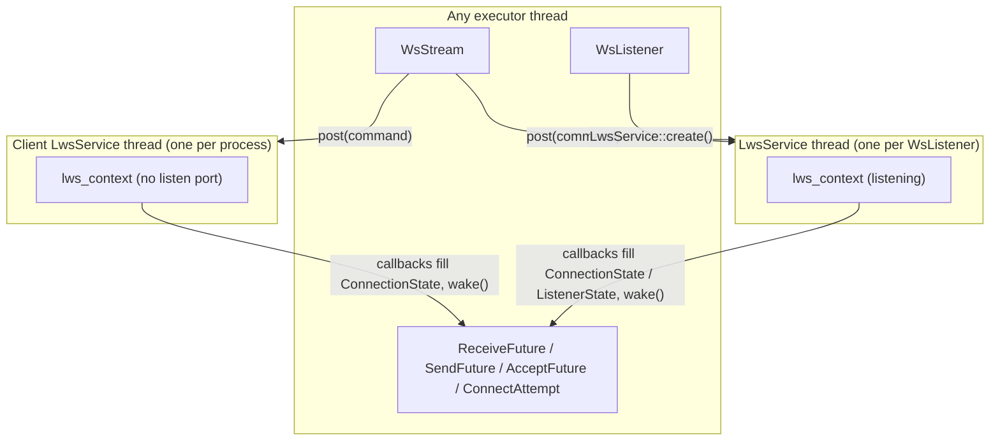
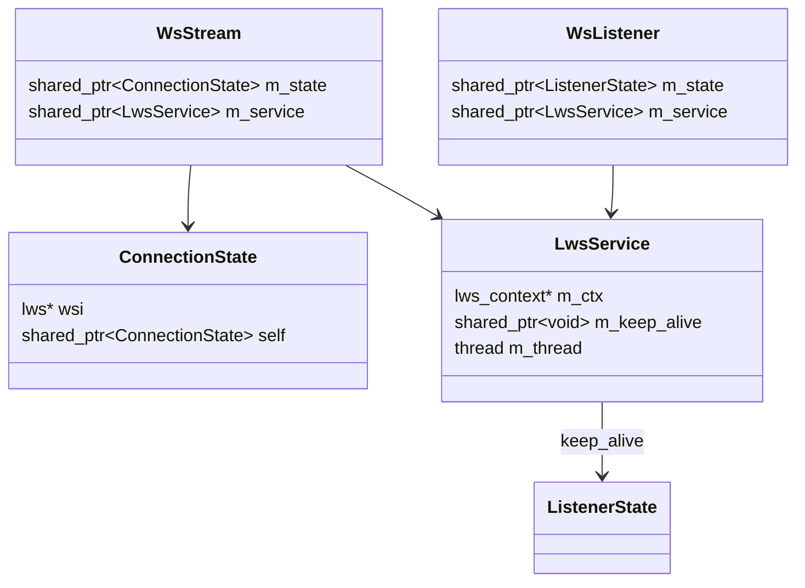
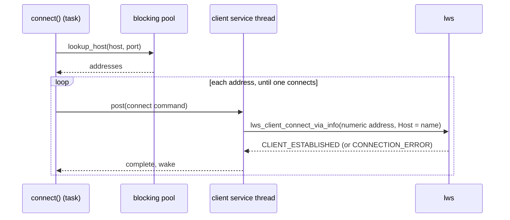
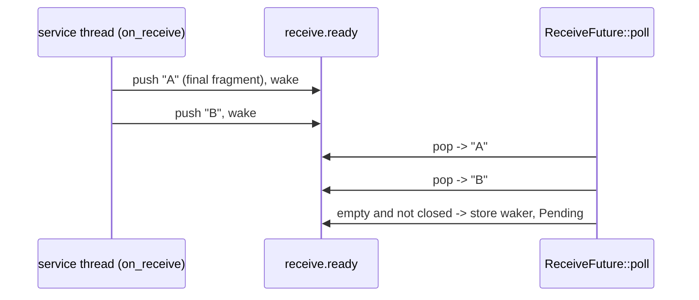

# WebSocket Stream

`WsStream` and `WsListener` are an async WebSocket client and server built on
[libwebsockets](https://libwebsockets.org/) (lws). They are not on the
[I/O Driver](io_driver.md). lws runs its own `poll()` loop, so each lws context gets a
dedicated **service thread**, and every lws call is posted to it. Futures are woken from
the lws callbacks on that thread.

Desktop only. `ws_stream.h` and `ws_listener.h` are excluded from the Pico install.

---

## Goals

- **Any executor.** WebSockets need neither the driver nor a particular executor; they
  work on a `CurrentThreadExecutor` with a caller-supplied `Parker`.
- **Same connect and bind behaviour as TCP.** Host names resolve through
  [`lookup_host()`](file_io.md#lookup_host), each address is tried in turn, and errors
  are `std::system_error` with a real errno.
- **Errors at the call site.** `connect()` and `bind()` throw; a bind failure is
  reported by `bind()` itself.
- **Safe to drop.** Dropping a stream, a listener or any pending future, on any thread,
  closes or abandons cleanly. A dropped `receive()` loses no message.

## Non-goals

- **Owned buffers for `send()`** (see the TODO under [API](#api)).
- **Explicit ping/pong.** lws answers pings itself.
- **TLS listeners.** `wss://` works for clients only.

---

## API

```cpp
#include <coro/io/ws_stream.h>
#include <coro/io/ws_listener.h>

// Client
WsStream ws = co_await coro::WsStream::connect("ws://example.com/chat");
co_await ws.send("hello");                                   // text frame
WsStream::Message msg = co_await ws.receive();
std::string_view text = msg.as_text();

// Server
WsListener listener = co_await coro::WsListener::bind("", 9001);   // all interfaces
while (true) {
    WsStream peer = co_await listener.accept();
    spawn(serve(std::move(peer))).detach();
}
```

### `WsStream`

| Method | Returns | Output |
|---|---|---|
| `static connect(url)`, `connect(url, options)` | `Coro<WsStream>` | the stream, once the opening handshake completes |
| `receive()` | `ReceiveFuture` | the oldest queued `Message` |
| `send(span, opcode = Binary)`, `send(string_view)` | `SendFuture` | `void`, once `lws_write()` has taken the frame |

- **URL:** `ws://host[:port]/path` or `wss://host[:port]/path`; default ports 80 and
  443. Anything else throws `std::invalid_argument`.
- **`WsStream::Options`:** `frame_mode` (`Full` assembles whole messages; `Partial`
  returns each fragment, with `Message::is_final` on the last), `subprotocols` to
  advertise (none by default, which accepts any server), and `max_message_size`
  (0 = unlimited).
- **`Message`:** `data` (bytes), `is_text`, `is_final`; `as_text()` throws
  `std::logic_error` on a binary frame.
- **Errors**, all `std::system_error` at `co_await`:
    - `connect`: `dns_error_category()` if the host doesn't resolve; otherwise the last
      address's failure (see the FIXME below).
    - `receive`: `EMSGSIZE` for a message over `max_message_size` (the connection stays
      usable); a closed connection throws once the queued messages are drained.
    - `send`: `ENOTCONN` if the connection closed first, `EIO` if `lws_write` failed.
- **Moved-from streams:** `receive()` and `send()` throw `std::logic_error`.
- **Concurrency:** only one `receive()` may be in flight. Sends go through a queue and
  are written in the order they were first polled. A stream must not be shared across
  tasks.
- **Drop and move-assign** post a graceful close (Close frame, then the peer's echo).

!!! tip "TODO: `send()` still borrows a span"
    `send` takes a `std::span`/`std::string_view` that must outlive the await, unlike the
    owned-buffer API of `TcpStream` and `File`. Move it to a `ByteBuffer` parameter
    (moved in, returned with the result) when the WebSocket API is next touched.

### `WsListener`

| Method | Returns | Output |
|---|---|---|
| `static bind(host, port)`, `bind(host, port, options)` | `Coro<WsListener>` | the listener; its socket is bound before this returns |
| `accept()` | `AcceptFuture` | the next `WsStream` whose handshake completed |

- **Host:** empty listens on every interface. Otherwise it's resolved with
  `lookup_host()`, and the first address that binds is used. Errors: `dns_error_category()`,
  or the last address's bind errno (`EADDRINUSE`, `EADDRNOTAVAIL`, ...).
- **`WsListener::Options`:** `frame_mode`, `max_frame_size` (lws's per-connection rx
  buffer), `max_message_size`, `subprotocols` to advertise, and two upgrade hooks:
    - `process_request(const WsUpgradeRequest&)`: inspect the path, headers and offered
      subprotocols; return a `WsUpgradeRejection` to refuse. lws closes the TCP
      connection; the status code is not sent.
    - `select_subprotocol(offered)`: return the chosen name, or empty to refuse.
- **Drop and move-assign** reject new upgrades and close connections still queued for
  `accept()`. Streams already accepted keep working (see
  [Lifetimes](#lifetimes)).

`connect` and `bind` each have two overloads rather than a defaulted `Options options = {}`
argument: GCC rejects that default because `Options` is a nested class with member
initializers.

---

## Service threads



- `detail::ws::LwsService` (`src/io/ws_service.{h,cpp}`, private) owns one
  `lws_context` and the thread that services it. The loop is one `lws_service()` pass,
  then every command posted since, then repeat.
- `post()` is the only way in from other threads. It queues a command and calls
  `lws_cancel_service()`, the one lws call that is safe from any thread, to wake the
  poll. Commands run in posting order.
- **Client:** every `WsStream::connect()` shares one process-wide client service,
  created on first use and kept until static destruction (see the FIXME below). If
  creating it fails, the next `connect()` tries again.
- **Server:** each `WsListener::bind()` creates its own service with a listening
  context. `lws_create_context()` runs on the calling thread, so a bind failure is
  reported by `bind()` itself.
- lws is built without its libuv event-lib backend (`with_libuv=False` in
  `conanfile.py`); the service thread uses lws's built-in `poll()` loop.

!!! note "NOTE: one fd table per context"
    lws sizes each context's fd table from the process's fd limit, so each listener,
    plus the shared client context, costs that much memory. Negligible for a handful of
    listeners; revisit if a program binds many.

### Lifetimes



- **`shared_ptr<LwsService>` is held only by `WsStream`, `WsListener` and their
  futures.** Callback state (`ConnectionState`, `ListenerState`) and posted commands
  never hold it. So the last reference always drops on a non-service thread, and
  `~LwsService()` can stop and join the thread. Destroying the context closes every
  connection still on it.
- **Accepted streams hold their listener's service.** So the listening context, and its
  bound port, live until the listener and the last stream it accepted are gone. Until
  then new connections fail the upgrade: the server callback checks
  `ListenerState::closed` in `FILTER_PROTOCOL_CONNECTION` and `ESTABLISHED`.
- **`self`.** While lws holds a raw pointer to a `ConnectionState` (the client wsi's user
  pointer, or the server's per-session slot), the state keeps itself alive through its
  `self` member. `close_connection()` clears it last, when lws reports the connection
  gone (`CLOSED`, a connect error, or `WSI_DESTROY`); it is idempotent.
- **`keep_alive`** holds what `lws_context_creation_info` points into (the protocols
  table and `ListenerState`) until after the context is destroyed.

!!! warning "FIXME: a client context can't be recreated"
    Freeing the client service when its last stream drops, and making a new one on the
    next `connect()`, fails under ASan in an Ubuntu 24.04 container: every client
    context after the first fails in `lws_context_init_client_ssl()`. lws logs nothing
    more specific; the silent failure points in
    `lws_tls_client_create_vhost_context()` are the SHA-256 hash of the TLS config
    (`EVP_MD_CTX_create`/`EVP_DigestInit_ex`). Server contexts, which don't do the SSL
    global init, are unaffected. The root cause wasn't found.

    The client service therefore lives for the rest of the process. A static's
    initializer creates it, so its destructor runs before OpenSSL's atexit cleanup. The
    cost is one idle thread blocked in `poll()` after the first `connect()`. Find the
    root cause before giving listeners TLS, since each listener has its own context and
    would hit the same path.

---

## Connection state

All per-connection state is one `detail::ws::ConnectionState`, shared by the futures (on
executor threads) and the lws callbacks (on the service thread). Each operation has its
own sub-state and mutex:

| Sub-state | Guards | Shared with |
|---|---|---|
| `ConnectSubState` | `waker`, `complete`, `cancelled`, `error`, lws's `reason` text | `ConnectAttempt` |
| `ReceiveSubState` | the message being assembled, `ready` queue, `waker` | `ReceiveFuture` |
| `SendSubState` (one per send) | `data`, `opcode`, `complete`, `cancelled`, `error`, `waker` | `SendFuture` |
| `send_queue` (own mutex) | `shared_ptr<SendSubState>`s waiting for WRITEABLE | `SendFuture`, close path |

`wsi`, `self` and `closing` are touched only on the service thread. `closed` is an atomic
that only goes false to true; each reader re-checks it under the sub-state mutex that
`close_connection()` takes before waking.

Wakers are stored as `Weak<Waker>`, as the driver stores them: the executor's task list
owns a waiting task, and a task that has gone is simply not woken. They are fired with
`detail::ws::wake()` outside the mutex.

lws fires one protocol callback for every event on every connection. The client
(`protocol_cb`) and server (`server_protocol_cb`) callbacks share the logic that matters:

| Event | Client / server reason | Does |
|---|---|---|
| Handshake done | `CLIENT_ESTABLISHED` / `ESTABLISHED` | completes the connect; the server queues the stream for `accept()` |
| Data | `CLIENT_RECEIVE` / `RECEIVE` | `on_receive()` |
| Writable | `CLIENT_WRITEABLE` / `SERVER_WRITEABLE` | `on_writeable()` |
| Gone | `CLIENT_CONNECTION_ERROR`, `CLIENT_CLOSED` / `CLOSED`, and `WSI_DESTROY` | `close_connection()` |

---

## Connect



`connect()` is a `Coro`. It parses the URL, resolves the host, then awaits a private
leaf future, `WsStream::ConnectAttempt`, per address. The attempt connects to the numeric
address, but the Host header and TLS SNI carry the name from the URL. The last error is
rethrown if no address connects, as in `TcpStream::connect`.

- **Cancellation.** Dropping a `ConnectAttempt` sets `cancelled`. The posted connect
  command checks it first. If the handshake still completes, ESTABLISHED sees
  `cancelled` and closes the connection. If the attempt is dropped after the connection
  was established but before it was taken, its destructor posts the close.
- **lws's reason in errors.** lws reports why a context or a connection failed only
  as text. A connect failure's text, and the error and warning lines lws logs on the
  calling thread during `lws_create_context()`, are appended to the exception's
  `what()`. Lines logged anywhere else are dropped.

!!! warning "FIXME: connect errors are a stand-in `ECONNREFUSED`"
    lws reports a client connection failure as `LWS_CALLBACK_CLIENT_CONNECTION_ERROR`
    with only a text reason, not an errno. Every failed connect is reported as
    `ECONNREFUSED`, with lws's text in `what()`. A timeout, an unreachable host and a
    failed handshake all look like a refusal.

!!! tip "TODO: no IPv6 in this lws build"
    The Conan lws package is built without `LWS_WITH_IPV6`. `connect()` skips IPv6
    addresses, recording `EAFNOSUPPORT`, and `bind()` skips IPv6 candidates. Enable the
    option, then drop the skips.

## Bind

`bind()` resolves the host, then calls `LwsService::create()` for each candidate address
with `LWS_SERVER_OPTION_FAIL_UPON_UNABLE_TO_BIND`, so a missing interface fails at once
instead of being retried later.

lws doesn't keep `errno` when its bind fails. After a failed `lws_create_context()`,
`bind()` probes the same address with a plain `sys::tcp_listen` and reports that errno,
or `EIO` if the probe succeeds. Race (benign): the port can change hands between the two
binds, which changes only the error reported.

---

## Receive

Incoming messages are queued on `ReceiveSubState::ready` as they arrive, whether or not a
`receive()` is pending, and each `receive()` pops the oldest. So messages that arrive back
to back stay separate, and dropping a `ReceiveFuture` (the losing branch of a `select()`
or `timeout()`) loses nothing.



- In `Full` mode fragments are assembled in `buffer` and queued once the final one
  arrives. In `Partial` mode each fragment is queued as its own entry.
- A message larger than `max_message_size` is queued as a single `EMSGSIZE` entry, which
  `receive()` throws. The rest of that message is discarded; the connection stays usable.
- When the connection closes, `receive()` still returns the queued messages first, then
  throws.

!!! warning "FIXME: the receive queue is unbounded"
    rx flow control isn't applied, so a peer that sends faster than the application
    receives grows `ready` without limit.

## Send

lws only allows `lws_write()` from inside a WRITEABLE callback, so a send takes one extra
hop compared to `TcpStream::write()`:

1. The first `SendFuture::poll` stores the waker under its sub-state mutex, releases it,
   then, under `send_queue_mutex`, checks `closed` and pushes the sub-state. It posts
   `lws_callback_on_writable()` to the service thread.
2. WRITEABLE (`on_writeable`) pops the front entry. Under its mutex, unless `cancelled`,
   it copies the data into an `LWS_PRE`-padded buffer, calls `lws_write()`, and
   completes the send. If more entries remain it asks for another WRITEABLE.
3. The next poll sees `complete` and returns, or throws its errno.

Dropping a `SendFuture` sets `cancelled` under the sub-state mutex. WRITEABLE checks it
and reads `data` under that same lock, so it can't read a span whose buffer the caller
has just freed.

!!! tip "PERF: one copy per send"
    `lws_write()` needs `LWS_PRE` bytes of headroom before the payload, so every send
    copies its data. An owned-buffer `send()` could reserve the headroom itself.

## Close

`~WsStream` and move assignment post a close. The command sets `closing` and asks for
WRITEABLE; `on_writeable` sees `closing`, calls `lws_close_reason()` and returns -1, since
lws only starts a close from inside a protocol callback. When lws reports the connection
gone, `close_connection()`:

1. fails a pending connect,
2. sets `closed` and wakes the receiver,
3. fails every queued send with `ENOTCONN` (under `send_queue_mutex`, then each
   sub-state's mutex),
4. clears the lws pointer to the state and drops `self`.

If the stream held the last reference to a listener's service, the destructor also
joins that service's thread, which closes the remaining connections abruptly.

---

## Races

- **Wake after executor teardown (known).** A callback can `lock()` a waker just as the
  task's executor is being destroyed. The executor drops its tasks first, so the window
  is a few instructions, and only on `Runtime` shutdown with a connection still active.
  The blocking pool has the same window. Wakes are skipped entirely while a service
  thread runs `lws_context_destroy()` (`LwsService::tearing_down()`): that destroy fires
  CLOSED for every connection, and by then no future can be waiting.
- **Cancel vs. destroy.** `lws_cancel_service()` must not overlap
  `lws_context_destroy()`. `post()` and `~LwsService()` call cancel with the service
  mutex held. The thread only destroys after it has seen `m_stopping` under that same
  mutex, and once `m_stopping` is set no one cancels again. If `lws_service()` fails,
  the thread sets `m_stopping` itself, so later posts are dropped instead of touching a
  dead context.
- **Send lock order.** `SendFuture::poll` never holds its sub-state mutex while taking
  `send_queue_mutex`; the close path takes `send_queue_mutex`, then each sub-state
  mutex. Checking `closed` and pushing under `send_queue_mutex`, which the close path
  also holds while setting `closed`, means a send can't be queued after the queue was
  failed.
- **Connect cancelled mid-handshake.** See [Connect](#connect).
- **Bind errno probe.** See [Bind](#bind).
- **Listener dropped during a handshake.** A connection already past
  `FILTER_PROTOCOL_CONNECTION` is refused at ESTABLISHED, which also checks `closed`.

---

## Tests

`test/io/test_ws_stream.cpp` (`test_ws_stream`). Each test uses its own port in
30201–30299, and accepts are bounded by a timeout so a lost connection fails instead of
hanging.

| Test | Checks |
|---|---|
| `WsStreamTest.TextRoundTripsBothWays` | Text both ways. |
| `WsStreamTest.BinaryMessageIsNotText` | `is_text` false; `as_text()` throws. |
| `WsStreamTest.BackToBackMessagesStaySeparate`, `...OnClient` | Two quick sends arrive as two messages, on either end. |
| `WsStreamTest.DroppedReceiveLosesNothing` | A `receive()` dropped by a timeout; the next one gets the message. |
| `WsStreamTest.OversizedMessageThrowsAndConnectionRecovers` | `EMSGSIZE`, then the next message arrives. |
| `WsStreamTest.QueuedMessagesDeliveredBeforeCloseThrows` | Messages queued before a close are received first. |
| `WsStreamTest.ConnectByName` | `ws://localhost:…` reaches a listener on 127.0.0.1, even if `::1` is tried first. |
| `WsStreamTest.ConnectRefusedThrowsSystemError` | Nothing listening: `connection_refused`. |
| `WsStreamTest.ConnectToUnresolvableNameThrowsDnsError` | `nonexistent.invalid` fails in `dns_error_category()`. |
| `WsStreamTest.MalformedUrlThrowsInvalidArgument` | `http://` URL. |
| `WsStreamTest.DroppedConnectIsHarmless` | A connect dropped by a 1 ms timeout; the next connect round-trips. |
| `WsStreamTest.RuntimeShutdownWithOpenStreams` | A detached task blocked in `receive()` at `Runtime` destruction: no hang, no crash. |
| `WsStreamTest.WorksWithoutDriver` | `CurrentThreadExecutor` + `PollingParker`, no timers. |
| `WsListenerTest.StreamsSurviveListenerDrop` | Both directions still work after the listener drops. |
| `WsListenerTest.DroppedListenerRejectsNewConnections` | A new connect fails while an accepted stream keeps the port. |
| `WsListenerTest.PortReleasedWhenLastStreamDrops` | Rebinding the port succeeds once everything is dropped. |
| `WsListenerTest.BindAddressInUseThrowsEaddrinuse` | The probed errno. |
| `WsListenerTest.BindUnresolvableNameThrowsDnsError` | DNS errors propagate from `bind`. |
| `WsListenerTest.EmptyHostBindsAllInterfaces` | `bind("", port)` accepts on loopback. |

---

## Files

| File | Contents |
|---|---|
| `include/coro/io/ws_stream.h`, `src/io/ws_stream.cpp` | `WsStream`, `ConnectionState` and sub-states, the client callback, `on_receive`, `on_writeable`, `close_connection` |
| `include/coro/io/ws_listener.h`, `src/io/ws_listener.cpp` | `WsListener`, `WsUpgradeRequest`, `ListenerState`, the server callback |
| `src/io/ws_service.h`, `src/io/ws_service.cpp` | `LwsService` (private) |
| `test/io/test_ws_stream.cpp` | Tests |
| `examples/io/ws_echo_client.cpp`, `ws_echo_server.cpp` | Examples |
