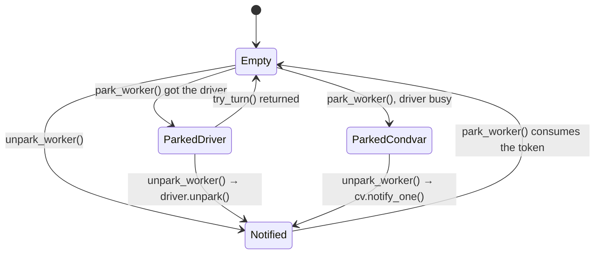
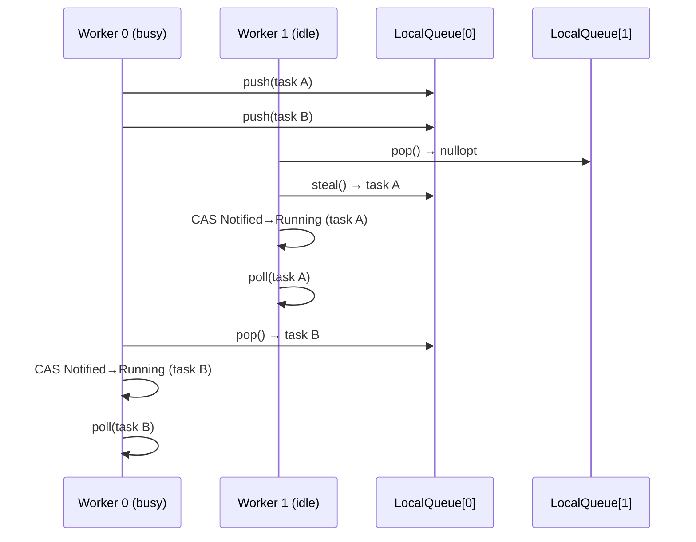
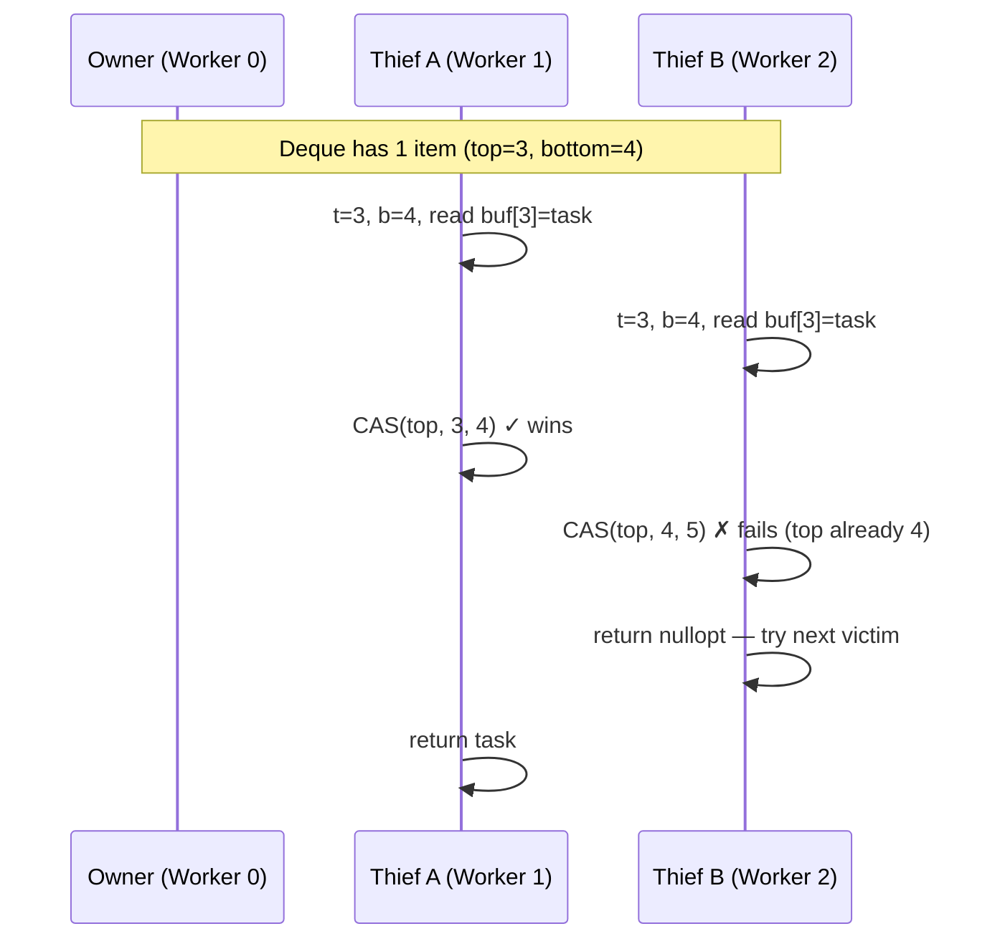

# Work-Stealing Executor

## Overview

The current `WorkSharingExecutor` gives each worker thread a local queue but has no
stealing path: when a worker's local queue is empty it blocks on a shared
condition variable waiting for the global injection queue. Under uneven load — one task
spawning many children, or tasks with varied run times — some workers sleep while
others are overloaded. Work-stealing fixes this by allowing idle workers to take tasks
from busy workers' local queues before going to sleep.

The design mirrors Tokio's multi-threaded scheduler at a high level, adapted to the
existing `Executor` interface and task state machine.

---

## Goals

- Replace (or upgrade) `WorkSharingExecutor` with a scheduler that steals work across
  threads before parking.
- Preserve the existing `Executor` interface (`schedule`, `enqueue`, `poll_ready_tasks`,
  `wait_for_completion`) so `Runtime` needs no changes.
- Preserve all invariants of the lock-free `SchedulingState` CAS machine.
- Keep the lock-free deque interface (`push` / `pop` / `steal`) so that implementing the
  Chase-Lev algorithm later is a drop-in change to `WorkStealingDeque`.

---

## Current State

`WorkSharingExecutor` already has most of the structure in place:

- Per-worker `WorkStealingDeque` with `push`, `pop`, `steal` — currently mutex-backed.
- A shared injection queue protected by `m_mutex` + `m_cv`.
- Thread-locals `t_owning_executor` and `t_worker_index` for local-path routing in
  `enqueue()`.

What is missing is the steal path in `worker_loop()`. Today, when a worker's local queue
is empty it goes directly to sleep on `m_cv`. It should first attempt to steal from
peer workers before sleeping.

---

## Proposed Design

### Worker Loop with Stealing

The core change is the task-search strategy in `worker_loop()`. Each worker follows this
priority order:

```
1. Pop from own local queue                   (no lock, LIFO)
2. Drain from injection queue                 (lock, FIFO — prevents starvation of remote wakes)
3. Enter "searching" state (if permitted)
   a. Steal from a peer's local queue         (one full sweep, round-robin)
   b. Re-check injection queue                (a task may have arrived during the sweep)
4. Exit searching, park
```

Step 2 is checked before stealing so that tasks enqueued from outside the executor
(timer wakeups, channel wakeups from non-worker threads) are not starved behind local
work.

### Victim Selection

Use a round-robin starting offset seeded by `worker_index` so that all workers do not
pile onto the same victim simultaneously:

```
for i in 0..N:
    victim = (worker_index + 1 + i) % N
    if victim == worker_index: skip
    if m_local_queues[victim].steal_half(my_queue) > 0:
        return my_queue.pop()   // run the first stolen task immediately
```

Each worker tries all peers once per search pass before concluding there is nothing to steal.

### Bounded Searching Workers

At most `num_workers / 2` workers are in the "searching" state at any time, tracked by
a shared atomic `m_searching`:

```
// Worker trying to enter searching:
int expected = m_searching.load();
while (expected < max_searching):
    if m_searching.compare_exchange_weak(expected, expected + 1):
        // entered searching — do the steal sweep
        ...
        m_searching.fetch_sub(1)
        break
// If CAS loop fails (already enough searchers), skip to park.
```

`max_searching = num_workers / 2` (minimum 1). This prevents thundering herd: if half
the pool is already searching, additional idle workers park immediately instead of all
piling onto the same victim queues.

The steal sweep itself acts as the latency buffer before parking — there is no separate
spin-yield loop.

### Parking and Wakeup

#### What park and unpark are

At the OS level, "parking" a thread means putting it to sleep until another thread
explicitly wakes it. On Linux this is a **futex** (`futex(FUTEX_WAIT)` to sleep,
`futex(FUTEX_WAKE)` to wake). On Windows it is `WaitOnAddress` / `WakeByAddressSingle`.
The key property shared by all implementations: the wake call is lock-free and targets
a specific thread rather than waking the entire pool.

A `std::condition_variable` is built on the same futex primitives but wraps them behind
a mutex. The mutex is necessary because `std::condition_variable` has no internal state
— it cannot remember that a notification was sent before a waiter arrived. Without the
lock, the following race is possible:

```
worker:   check predicate → false
notifier: predicate becomes true, notify_one() fires (nobody is waiting yet)
worker:   enters wait() — sleeps forever (notification was lost)
```

The mutex closes this window by ensuring the notifier cannot fire between the predicate
check and the `wait()` call.

#### How Tokio parks workers

Tokio avoids the global mutex entirely. Each worker owns a `Parker` struct containing:
- A small per-worker atomic (`AtomicUsize`) with three states: `EMPTY`, `PARKED`,
  `NOTIFIED`.
- The OS thread handle needed to call `unpark()` on that specific thread.

Rust's `std::thread::park()` / `unpark()` maps directly to futex on Linux. The atomic
state machine eliminates the lost-wakeup race without a mutex: if `unpark()` is called
before `park()`, the state transitions to `NOTIFIED` and the subsequent `park()` returns
immediately without ever touching the OS.

An **idle set** (a bitmask over worker indices, stored as an `AtomicU64` for pools up to
64 threads) tracks which workers are parked. When a task is enqueued, the enqueueing
thread reads the idle set, picks a parked worker, and calls `unpark()` on its handle —
all without acquiring any lock.

The comparison to our current approach:

| | `WorkSharingExecutor` condvar | Tokio-style per-worker park |
|---|---|---|
| Sleep | `m_cv.wait(lock)` — acquires `m_mutex` | `thread::park()` — futex only |
| Wake one | `m_cv.notify_one()` — acquires `m_mutex` | `handle.unpark()` — atomic + futex |
| Wake all (shutdown) | `m_cv.notify_all()` — acquires `m_mutex` | iterate idle set, unpark each |
| Lock contention | All workers share one mutex | None on the hot path |
| Which worker wakes | Unspecified (OS choice) | Caller chooses by index |

#### C++ equivalent: `std::binary_semaphore`

C++ has no direct `park()`/`unpark()` in the standard library. The two closest options
are:

- **`std::atomic<uint32_t>::wait()` / `notify_one()`** (C++20) — thin wrappers over
  futex. Require the caller to manage state and handle spurious wakeups manually.
- **`std::binary_semaphore`** (C++20) — a semaphore with a maximum count of 1.
  `acquire()` blocks if the count is 0; `release()` increments the count and wakes one
  waiter. On Linux, `libstdc++` and `libc++` both implement this with futex.

`std::binary_semaphore` is the right choice because it has the same "notify-before-wait"
semantics as Rust's `park()`/`unpark()`: if `release()` fires before `acquire()`, the
token is banked and `acquire()` returns immediately. The lost-wakeup race is closed by
the semaphore's internal count — no external mutex is required.

Per-worker parking with `std::binary_semaphore` would look like:

```cpp
struct WorkerSlot {
    std::thread             thread;
    std::binary_semaphore   parker{0};  // 0 = no pending wake
};
std::vector<WorkerSlot> m_workers;
std::atomic<uint64_t>   m_idle_mask{0}; // bit k set ↔ worker k is parked

static_assert(MAX_WORKERS <= 64, "m_idle_mask is a uint64_t; max 64 workers supported");

// Worker parks:
m_idle_mask.fetch_or(1ull << worker_index, std::memory_order_release);
m_workers[worker_index].parker.acquire();  // futex wait
m_idle_mask.fetch_and(~(1ull << worker_index), std::memory_order_relaxed);

// Enqueuer wakes one idle worker:
uint64_t idle = m_idle_mask.load(std::memory_order_acquire);
if (idle) {
    int idx = std::countr_zero(idle);  // pick lowest idle worker
    m_workers[idx].parker.release();   // futex wake — no mutex
}
```

#### 64-worker cap

`m_idle_mask` is a `uint64_t`, so the pool is capped at 64 workers. The constructor
clamps `num_threads` to `MAX_WORKERS` rather than throwing: with a throw, the default
`Runtime()` (sized by `hardware_concurrency()`) failed outright on >64-core machines.

!!! tip "TODO: Lift the 64-worker cap"
    Extra hardware threads beyond 64 go unused. See the roadmap entry
    "WorkStealingExecutor: more than 64 workers" for the two candidate designs
    (multi-word idle bitmap, or tokio-style counters plus a mutex-protected sleeper list).

#### Park protocol: avoiding lost wakeups

`binary_semaphore` closes the "notify arrives before `acquire()`" race (the token is
banked), but a different race remains between marking idle and parking:

```
worker:   finds all queues empty — not yet in m_idle_mask
enqueuer: pushes task, reads m_idle_mask → no idle workers, skips wake
worker:   sets bit in m_idle_mask, calls acquire() → sleeps with task pending ✗
```

The fix: after setting the idle bit, **re-check all queues once more** before calling
`acquire()`. If work is found, clear the bit and resume the worker loop. If not, park —
and if the enqueuer raced and called `release()` after the idle bit was set, the
semaphore token is banked and `acquire()` returns immediately without sleeping.

```
worker loop (park sequence):
  1. decrement m_searching (no longer searching)
  2. set idle bit in m_idle_mask  (release store)
  3. re-check local queue, injection queue, peer queues
  4. if work found: clear idle bit, loop back to step 1 of worker loop
  5. else: parker.acquire()       (sleeps only if no banked token)
  6. clear idle bit (already cleared by enqueuer's race wins too — harmless double-clear)
  7. resume worker loop
```

`WorkStealingExecutor` first used per-worker `std::binary_semaphore` parking,
replacing the shared `m_mutex` + `m_cv` used by `WorkSharingExecutor`. Once workers
could also park in the I/O driver, the semaphore became a per-worker park slot (mutex,
condvar and state); see [Parking in the I/O driver](#parking-in-the-io-driver). The
per-worker approach was adopted because:

- It is the natural C++ equivalent of Tokio's `park()`/`unpark()`.
- It makes Q4 (notify on local enqueue) cheap enough to always do correctly: check
  `m_searching` and `m_idle_mask` atomically, then call `unpark_worker()` on one
  idle worker — no shared-mutex round-trip.
- Shutdown (`notify_all`) becomes: call `unpark_worker()` on each worker.

The shared `m_mutex` is retained only for protecting the injection queue (remote
enqueue path). It is no longer used for parking/wakeup.

### LIFO Slot Optimization (Optional)

Tokio maintains a single-slot LIFO buffer per worker, separate from the local run
queue. When a task wakes another task (e.g. a sender waking a receiver), the newly
woken task is placed in the LIFO slot instead of the queue. On the next loop iteration,
the LIFO slot is checked first. This reduces latency for producer-consumer pairs by
running the consumer immediately after the producer yields, improving cache reuse.

This optimization is not required for correctness and can be added after the baseline
stealing path works.

---

## Parking in the I/O driver

I/O readiness and timers fire only where some thread turns the runtime's `IoDriver`
(see [I/O Driver](io_driver.md)). `WorkStealingExecutor` follows tokio's multi-thread
scheduler, and its workers share one driver:

- **Parking.** The first worker to run out of work takes the driver and parks in
  `try_turn(nullopt)`. Other idle workers park on their own condition variable.
- **Wakes during a turn.** Wakes fired inside the turn are local enqueues onto the
  turning worker's own queue.
- **Busy workers.** A busy worker does a non-blocking `try_turn(0)` every
  `kEventInterval` (61) task polls, so I/O and timers aren't starved when no worker is
  idle.

The idle-mask and searching protocol above is unchanged. What parks is a per-worker park
slot that knows whether the worker is blocked in the driver or on its condition variable.

### Driver API

A worker must not block on the driver's mutex while another worker holds it, so
`IoDriver` has a try-variant:

```cpp
/// Like turn(), but returns std::nullopt at once if another thread is turning.
std::optional<std::size_t> try_turn(std::optional<std::chrono::nanoseconds> timeout);

/// Like try_turn(), but calls before_poll() once it holds the driver; false releases
/// the driver without polling and returns 0.
template<typename BeforePoll>
std::optional<std::size_t> try_turn(std::optional<std::chrono::nanoseconds> timeout,
                                    BeforePoll&& before_poll);
```

### Per-worker park state

Each `WorkerSlot` holds `park_mutex`, `park_cv` and `park_state`, GUARDED BY
`park_mutex`:



```cpp
// Returns the number of I/O events and timers dispatched (0 if this worker didn't turn).
std::size_t park_worker(i):
    std::optional<size_t> n;
    { InDriverTurn guard;                 // thread-local: wakes in the turn are local, no notify
      n = driver.try_turn(nullopt, [&] {  // runs only once this worker holds the driver
          lock(slot.m);
          if (slot.state == Notified) return false;   // token banked: don't poll
          slot.state = ParkedDriver;
          return true; }); }
    lock(slot.m);
    if (!n && slot.state != Notified) {   // driver busy: fall back to the condvar
        slot.state = ParkedCondvar;
        slot.cv.wait(lock, [&]{ return slot.state == Notified; });
    }
    slot.state = Empty;
    return n.value_or(0);

void unpark_worker(i):
    { lock(slot.m); prev = slot.state; slot.state = Notified; }
    if      (prev == ParkedDriver)  driver.unpark();       // sticky eventfd write
    else if (prev == ParkedCondvar) slot.cv.notify_one();
    // prev == Empty or Notified: the token is banked; the next park_worker() returns at once
```

`notify_if_needed()` calls `unpark_worker(idx)` for the lowest idle worker. The destructor
sets `m_stop` and then calls `unpark_worker()` on every worker.

### Worker loop

- **Park** calls `park_worker(i)`, then clears its idle bit. If the turn dispatched
  anything and the worker's local queue now holds more than one task, `after_turn()` calls
  `notify_if_needed()` so another worker can help (tokio's `should_notify_others`). With
  exactly one task the worker just runs it, so a single I/O wake never costs a
  cross-thread wake.
- **After each task poll,** a counter is bumped. Every `kEventInterval` polls, the worker
  calls `try_turn(0)` inside an `InDriverTurn` guard and applies the same `after_turn()`
  rule. If another worker holds the driver, the call returns at once and costs nothing.
- **`enqueue()` on a worker of this executor** skips `notify_if_needed()` while the
  thread-local `InDriverTurn` flag is set. The turning worker runs those tasks itself as
  soon as the turn returns. Remote enqueues are unchanged.

### Parking and its races

- **A remote wake before the worker parks** (the lost-wakeup check). The enqueuer pushes,
  then reads `m_searching` and `m_idle_mask`. The worker sets its idle bit, then re-checks
  its queues. This is a store-then-load pattern on both sides. It is sound only because
  every queue a parking worker re-checks is mutex-protected, or only ever pushed to by its
  owner:
    - the injection queue is mutex-protected;
    - with `CORO_USE_LOCAL_RUN_QUEUE` (the default), only the owner pushes to its own
      local queue;
    - without it, `WorkStealingDeque` is mutex-protected.

    The mutex orders the two sides: either the worker's re-check sees the task, or the
    enqueuer's later load sees the idle bit.
- **A remote wake while the worker is in the driver, or about to be.** The worker sets
  `ParkedDriver` only once it holds the driver (inside `before_poll`). `unpark_worker()`
  sees it and calls `driver.unpark()`. That write is sticky, and only the driver's holder
  ever consumes it, so it reaches this worker's `epoll_wait` even if it lands first.

    !!! danger "WARNING: publish ParkedDriver only while holding the driver"
        If a worker set `ParkedDriver` and *then* called `try_turn()`, an unpark in that
        gap could write the eventfd while another worker was in a turn (a busy worker's
        `try_turn(0)`, or the previous holder on its way out). That worker would reset
        the eventfd, and the parking worker would then win the driver and block in
        `epoll_wait` with `Notified` unread: a lost wake-up, which shows up as a rare hang
        (most likely at `Runtime` teardown, whose unparks have no other backstop).
- **A remote wake while the worker is on the condvar.** `unpark_worker()` sees
  `ParkedCondvar`, sets `Notified`, and notifies. The wait predicate makes a spurious or
  early return harmless.
- **An unpark after a failed `try_turn()`, before the condvar wait.** The slot is still
  `Empty`, so `unpark_worker()` banks `Notified`; the worker checks it under the slot
  mutex and returns without waiting.
- **A stale driver unpark (benign).** The holder returns from `turn()` for an I/O event
  just before an `unpark_worker()` sees `ParkedDriver` and writes the eventfd. The next
  worker to turn returns at once, finds nothing, and parks again. Tokio has the same
  property.
- **Two enqueuers wake the same idle worker.** Both read its idle bit before the worker
  clears it. `Notified` is idempotent, so the second unpark only re-banks the token, at
  the cost of one extra loop iteration. (With a `binary_semaphore`, a second `release()`
  while the count is already 1 is undefined behaviour.)
- **Wakes dispatched inside a turn.** They fire on the turning worker, whose idle bit is
  still set. Without the `InDriverTurn` skip, `notify_if_needed()` could pick the turning
  worker itself (an eventfd write that makes its next turn return at once), or wake a
  peer that steals a task the turning worker was about to run. Both are pure overhead
  for the common "one event, one task" case.
- **The driver goes unturned while the holder runs tasks.** After the holder leaves
  `turn()`, nobody is in the driver until:
    - it parks again,
    - another worker parks and finds the driver free, or
    - some busy worker reaches its `kEventInterval` turn.

    Edge-triggered events wait in the kernel meanwhile, so nothing is lost. But a single
    long-running task on the old holder delays I/O and timer delivery when every other
    worker sits on its condvar. Tokio has the same property.
- **Shutdown.** The destructor sets `m_stop` under `m_mutex`, then unparks every worker.
  A worker in the driver gets `driver.unpark()`, and one on the condvar gets notified.
  Each sees `m_stop` and exits. The driver outlives the executor (`Runtime` member
  order), so the unparks are safe.

!!! tip "PERF: hand the driver off when the holder leaves it with work"
    To close the latency gap in the "driver goes unturned" case, a holder that returns
    from `turn()` with tasks to run could wake one condvar-parked worker, which would then
    take the driver. That costs a futex wake per driver wake-up whenever idle workers
    exist, and at high event rates it could ping-pong the driver between two workers on
    every event. Tokio doesn't do it either; decide from profiling.

!!! tip "PERF: prefer condvar-parked workers in `notify_if_needed()`"
    `notify_if_needed()` wakes the lowest idle bit, which may be the driver holder. Waking
    it costs an eventfd write and leaves the driver unturned until it parks again. Waking
    a condvar-parked worker first would avoid that, but needs a "driver holder" index next
    to the idle mask. Measure before adding it.

!!! tip "PERF: mutex + condvar park slot instead of a `binary_semaphore`"
    A semaphore can only wake a worker that waits on it. Once workers can also park in the
    driver, `unpark_worker()` has to know where the worker is parked: in `epoll_wait`,
    which needs `driver.unpark()`, or on its own wait primitive. The worker changes that
    state partway through parking (`ParkedDriver`, or `ParkedCondvar` after a failed
    `try_turn()`). The waker's read-and-set of the state has to be atomic with respect to
    that change, or the wake goes to the wrong place and is lost. A mutex keeps that
    protocol obvious, as CLAUDE.md prefers, and `cv.wait(lock, pred)` makes the move to
    `ParkedCondvar` and the sleep one step.

    Tokio's multi-thread parker (`scheduler/multi_thread/park.rs`) has the same shape:
    `EMPTY`/`PARKED_CONDVAR`/`PARKED_DRIVER`/`NOTIFIED`, with a mutex and a condvar.

    Compared with the semaphore:

    - **Sleep and wake:** the same futex wait, futex wake and context switch either way.
      This is the dominant cost, several µs.
    - **Extra work per park and unpark:** one uncontended lock and unlock, about 20–50 ns
      with no syscall. `notify_one()` with no waiter does not make a syscall either.
    - **Contention:** a waker can briefly contend on `park_mutex` with a worker that is
      waking up. `unpark_worker()` notifies after unlocking to keep that window short.

    Unparks happen only when the idle mask shows a sleeping worker, so a busy runtime
    rarely reaches this path. If profiling shows a regression, add tokio's fast path:
    make `park_state` an atomic that the waker `swap(Notified)`s, and take the lock and
    notify only when the old state was `ParkedCondvar`. That falls under the
    "scheduling-state atomics" exception in CLAUDE.md. Do not add it without numbers.

!!! warning "FIXME: lost wakeup on the non-`CORO_USE_LOCAL_RUN_QUEUE` affinity path"
    Without `CORO_USE_LOCAL_RUN_QUEUE`, a remote `enqueue()` pushes to the task's last
    worker `k` (the affinity path). It then calls `notify_if_needed()`, which returns early
    if any worker is searching. The searcher re-checks only its own queue and the injection
    queue before parking, never `k`'s. If `k` is parked, the task strands until some later
    wake. The default build doesn't take this path. Fix by unparking `k` directly when its
    idle bit is set, or by dropping the affinity path.

### Tests

| Test | Proves |
|---|---|
| `IoDriver.TryTurnReturnsNulloptWhileAnotherThreadTurns` | `try_turn()` never blocks on a held driver. |
| `IoDriver.TryTurnDispatchesWhenFree` | `try_turn()` behaves like `turn()` otherwise. |
| `WorkStealingIoTest.IoEventWakesTaskOnIdleRuntime` | An idle worker parked in the driver receives I/O (socketpair, writer thread after 50 ms). |
| `WorkStealingIoTest.BusyWorkersStillPollIo` | With every worker spinning on self-waking tasks (nobody parks), an I/O wait still completes through the `kEventInterval` turns. |
| `WorkStealingIoTest.ManySocketsPingPong` | 16 socketpairs × 200 round trips on `Runtime(4)`. A lost wakeup anywhere in the handoff shows up as a hang. |
| `WorkStealingIoTest.RemoteWakeUnparksDriverHolder` | A wake from a foreign thread reaches a runtime whose only idle worker is in the driver. |
| `WorkStealingIoTest.ShutdownWithPendingIoWait` | Destroying the runtime with a spawned task still waiting on a socket neither hangs nor crashes. |

These are in `test/runtime/test_io_driver.cpp` and `test/runtime/test_work_stealing_io.cpp`.
`ReadByteFuture`, `AsyncByteReader` and `SocketPair` live in the shared
`test/runtime/io_test_util.h`. Every idle worker parks through this path, so the
`AllExecutors` and work-stealing suites exercise it heavily too.

---

## Data Structures

### WorkStealingDeque

The current `WorkStealingDeque<T>` is mutex-backed and presents `push` / `pop` /
`steal`. A `steal_half(WorkStealingDeque& dst)` method is added: under the victim's
lock it computes `n = (size + 1) / 2`, moves the front `n` items into `dst`, and
returns `n`. The caller pops one task immediately and leaves the rest in its own queue
for future iterations. This amortizes steal overhead and avoids repeated lock
acquisitions when a victim has many tasks.

**The mutex-backed implementation will be kept for this phase.** The lock-free Chase-Lev
upgrade is deferred — see the
[Future Work: Chase-Lev Lock-Free Deque](#future-work-chase-lev-lock-free-deque) section
below for a full description of how it works and what changes when the time comes.

### Injection Queue

A `std::deque<TaskBase*>` protected by `m_mutex`. Remote wakers, `schedule()` calls from
non-worker threads, and local-queue overflow push here. Workers pop from it under the lock.

The queue's length is also published in `std::atomic<std::size_t> m_injection_len`,
written only under `m_mutex`. A worker whose local queue is empty reads it first and
takes the lock only when it is non-zero. Tokio's inject queue does the same with its
`len: AtomicUsize` and `is_empty()`.

A zero read can be stale, so it is used only where a miss is harmless: Step 2 of the
worker loop and the re-check after a steal sweep. The check before parking still takes
`m_mutex` after the idle bit is set. A push that races with a lock-free read is
therefore found before the worker sleeps, or its `notify_if_needed()` sees the idle bit.

With the fixed-capacity local run queue (`CORO_USE_LOCAL_RUN_QUEUE`), Step 2 takes a
batch instead of one task. The first task runs immediately and the rest are pushed onto
the worker's local queue. The batch size follows Tokio's `Core::next_task()`:

```cpp
cap  = min(local.remaining_slots(), local.max_capacity() / 2);
want = max(1, min(injection_len / num_workers + 1, cap));
```

The `1/num_workers` share leaves work for the other workers. The half-capacity limit
keeps the batch in the half of the ring that overflow never spills back to the
injection queue. The other injection-queue pops (after a steal sweep, before parking)
still take one task.

!!! note "NOTE: why Step 2 reads the length lock-free and pops in batches"
    With the owned tasks sharded, a profile of `SkynetJoinTest.Stealing` put 36% of
    samples on waiting for, or waking waiters of, `m_mutex` in Step 2. Adding the
    lock-free length test alone moved that only to 25%, still at the Step 2 lock, so
    the queue was not empty. The likely source is a fan-out workload overflowing the
    256-slot local queues: each overflow spills a batch into the injection queue, and
    workers were then taking the lock once per task to get them back.

### Worker Affinity

`TaskBase` carries `last_worker_index` (initialized to -1). After each successful
`poll()`, the executor stores `t_worker_index` into it. When `wake()` fires,
`enqueue()` uses the stored index to push directly onto that worker's local queue
instead of the injection queue, provided the executor pointer still matches.

The benefit: a woken task re-enters on the same core it last ran on, keeping its data
warm in L1/L2 and avoiding an injection-queue lock acquisition on the hot wakeup path.

### State Additions

A single shared atomic `std::atomic<int> m_searching{0}` tracks the number of workers
currently performing a steal sweep. No per-worker state is needed.

### Owned tasks

The executor holds one `shared_ptr` to every live task from `schedule()` until `poll()`
returns done. Run queues hold raw `TaskBase*`, so this reference is what keeps a
suspended task alive.

The references live in `detail::OwnedTasks` (`include/coro/detail/owned_tasks.h`), which
follows Tokio's `OwnedTasks` / `ShardedList`: an array of shards, each an intrusive
doubly-linked list behind its own `std::mutex`.

| Aspect | Choice |
|---|---|
| Shard count | `min(65536, bit_ceil(workers) * 4)`, the rule Tokio uses |
| Shard selection | Hash of the task's address. Tokio uses its task ID; coro tasks have none, and the address is fixed for the task's lifetime |
| Links | `TaskBase::owned_prev` / `owned_next`, stored in the task |
| Strong reference | `TaskBase::owned_self`, stored in the task and cleared on removal |
| Insert / remove | Lock one shard, a few pointer writes, no allocation |

Storing the strong reference in the task makes a deliberate `shared_ptr` cycle. It is
broken by `OwnedTasks::remove()` when the task finishes, or by `~OwnedTasks()` at
executor shutdown for tasks that never finished. Both release the reference after
dropping the shard lock, so task and user destructors never run under it.

Two things Tokio has are left out because nothing in coro reads them: the live-task
counter and the `closed` flag that rejects spawns during shutdown.

!!! note "NOTE: why the owned tasks are sharded"
    The first version was one `std::unordered_set<shared_ptr<TaskBase>>` behind one
    mutex. Every spawn and every completion on every worker took that lock. A
    frame-pointer profile of `SkynetJoinTest.Stealing` attributed 79% of samples to
    waiting on that mutex or waking its waiters, with about 7.5 s of system time against
    2.5 s of user time for 1.25 s of wall time.

!!! tip "TODO: `WorkSharingExecutor` and `CurrentThreadExecutor` still use a single set"
    `CurrentThreadExecutor` has no contention to remove, but the intrusive list would
    still save it a hash-table insert and erase per task.

---

## enqueue() Routing

```cpp
void WorkStealingExecutor::enqueue(shared_ptr<Task> task) {
    int affinity = task->waker().last_worker_index();

    if (t_worker_index >= 0 && t_owning_executor == this) {
        // Called from a worker thread — push to own local queue.
        m_local_queues[t_worker_index].push(move(task));
    } else if (affinity >= 0) {
        // Waker carries an affinity hint — push to that worker's local queue.
        // No lock needed: WorkStealingDeque::push is thread-safe.
        m_local_queues[affinity].push(move(task));
    } else {
        // No affinity — fall back to the shared injection queue.
        lock_guard lock(m_mutex);
        m_injection_queue.push_back(move(task));
    }
    notify_if_needed();
}

void WorkStealingExecutor::notify_if_needed() {
    // If at least one worker is already searching, it will find the task.
    if (m_searching.load(memory_order_acquire) > 0) return;
    // Otherwise wake one parked worker to begin searching.
    uint64_t idle = m_idle_mask.load(memory_order_acquire);
    if (idle) {
        int idx = std::countr_zero(idle);
        unpark_worker(idx);  // driver.unpark() or condvar notify, by park state
    }
}
```

All three enqueue paths share `notify_if_needed()`. A searching worker will find a
locally-enqueued task on its steal sweep without an explicit wake.

---

## Shutdown

1. Destructor sets `m_stop = true` inside `m_mutex` (still guards the injection queue).
2. Calls `unpark_worker()` on every worker: a worker in the driver gets
   `driver.unpark()`, one on its condvar is notified, and one not yet parked banks a
   token so its next park returns at once.
3. Joins all worker threads.

Workers exit their loop when `m_stop` is true and all queues are drained.

---

## Naming and Placement

`WorkSharingExecutor` is kept as-is (useful for debugging scheduler issues due to its
simpler concurrency). `WorkStealingExecutor` is added alongside it as a new class.

Files:
- `include/coro/runtime/work_stealing_executor.h`
- `src/runtime/work_stealing_executor.cpp`

`Runtime` selects the implementation: `num_threads <= 1` → `CurrentThreadExecutor`,
otherwise → `WorkStealingExecutor`.

---

## State Machine Invariants

The `SchedulingState` CAS machine is unchanged. The steal path is just another way to
dequeue a `Notified` task — the transition `Notified → Running` is always a CAS and
will fail if two workers race to claim the same task (which should not happen since
`steal()` is atomic, but the CAS is the ultimate guard).

---

## Tests

Unit tests are in `test/runtime/test_work_stealing_executor.cpp`. Key cases covered:

- Workers complete tasks when work is uneven (one spawning coroutine fans out N tasks).
- Tasks complete correctly with `N` workers and `M >> N` short-lived tasks.
- Stealing occurs: verify that with tasks pinned to worker 0's local queue, idle workers
  steal and execute them.
- Shutdown drains all in-flight tasks.
- Skynet benchmark (disabled by default — run with `--gtest_also_run_disabled_tests`).

All existing tests (`test_sleep`, `test_join_handle`, `test_join_set`, `test_coro_scope`,
channel tests) also exercise the work-stealing executor via `Runtime`.

---

## Sequence Diagram: Stealing Path



---

## Future Work: Chase-Lev Lock-Free Deque

> **Deferred.** The mutex-backed `WorkStealingDeque` is sufficient for correctness.
> This section documents the Chase-Lev algorithm so the upgrade path is understood
> before it is needed. When performance profiling shows deque contention is a
> bottleneck, this section becomes the implementation spec.

### Why Bother?

Every `steal()` call on the current mutex-backed deque acquires a lock, even when the
victim's queue is empty. Under high thread counts with frequent stealing this creates
contention on the victim's mutex. Chase-Lev eliminates all locks on the common paths:

| Operation | Mutex version | Chase-Lev |
|-----------|--------------|-----------|
| `push`    | lock + write  | write + atomic store |
| `pop`     | lock + read   | read + optional CAS (only on last element) |
| `steal`   | lock + read   | CAS on `top` |

### The Algorithm

Chase-Lev is a double-ended queue (deque) where:
- The **owner** thread pushes and pops from the **bottom** (back). No contention from
  thieves on this end in the common case.
- **Thief** threads steal from the **top** (front). Multiple thieves can race here, resolved
  by a CAS.

Three fields drive the algorithm:

```
top    — atomic<int64_t>, incremented by thieves when they take an item
bottom — int64_t, written only by the owner (load/store, no atomic needed from owner's view)
buf    — pointer to a circular array of capacity 2^k
```

The number of items in the deque at any moment is `bottom - top`. The deque is empty
when `bottom == top` and full when `bottom - top == capacity`.

```
┌─────────────────────────────────────────────────────┐
│  circular buffer (capacity = 8, indices mod 8)       │
│                                                      │
│  index:  0    1    2    3    4    5    6    7         │
│        ┌────┬────┬────┬────┬────┬────┬────┬────┐    │
│        │    │ T  │ T  │ T  │    │    │    │    │    │
│        └────┴────┴────┴────┴────┴────┴────┴────┘    │
│                ▲                   ▲                 │
│               top=1             bottom=4             │
│          (thieves steal        (owner pushes/pops   │
│           from here)            from here)          │
│                                                      │
│  items in deque: bottom - top = 3  (indices 1,2,3)  │
└─────────────────────────────────────────────────────┘
```

### Owner: push

```
buf[bottom % capacity] = item
bottom++   (release store — makes item visible to thieves)
```

If the buffer is full (`bottom - top == capacity`), allocate a new buffer of double
the size, copy all items, and swap the pointer atomically before writing the new item.

### Owner: pop

```
bottom--
item = buf[bottom % capacity]   (acquire load)
if bottom < top:
    // deque is now empty; restore bottom and give up
    bottom = top
    return nullopt
if bottom == top:
    // racing with a thief for the last item
    if CAS(top, top, top+1) succeeds:
        bottom = top+1   // thief won, deque truly empty now
        return nullopt
    // owner won the CAS; item is ours
return item
```

The CAS on pop only fires when there is exactly one item remaining, which is the rare
case. All other pops are pure reads and writes with no contention.

### Thief: steal

```
t = top.load(acquire)
b = bottom.load(acquire)
if t >= b: return nullopt   // empty
item = buf[t % capacity]   (acquire load — must read before CAS commits)
if CAS(top, t, t+1):
    return item
return nullopt   // lost the race; try another victim
```

Multiple thieves race via `CAS(top, t, t+1)`. Only one wins per item. The loser
simply moves on — it does not retry the same victim.

### Sequence Diagram: Concurrent steal race



### Memory Ordering Summary

| Access | Ordering | Reason |
|--------|----------|--------|
| `bottom` store after push | `release` | Makes the new item visible to thieves reading `bottom` |
| `bottom` load in thief | `acquire` | Pairs with owner's release store |
| `top` CAS in thief | `acq_rel` | Synchronises all thieves with each other |
| buffer element read in thief | `acquire` | Must happen before CAS commits the steal |

### What Changes in the Codebase

Only `include/coro/detail/work_stealing_deque.h` changes. The three atomic fields
replace `m_mutex` and `m_deque`. All call sites (`push`, `pop`, `steal_half`) keep the
same signatures. The executor code, wakers, and task state machine are unaffected.

One new concern: the growable buffer requires careful memory reclamation. When the
owner resizes, the old buffer cannot be freed immediately because a thief may have
loaded a pointer to it before the resize. The standard solution is epoch-based
reclamation or hazard pointers. A simpler alternative that avoids this entirely is to
use a **fixed-capacity** deque (bounded at construction time) and abort/assert if the
owner exceeds capacity. For task queues with a reasonable bound this is acceptable and
eliminates the reclamation problem.

---

## Open Questions

**Chase-Lev lock-free deque:** the `WorkStealingDeque` is currently mutex-backed.
Chase-Lev is documented in the [Future Work](#future-work-chase-lev-lock-free-deque)
section as a follow-on once profiling shows deque contention is a real bottleneck.

