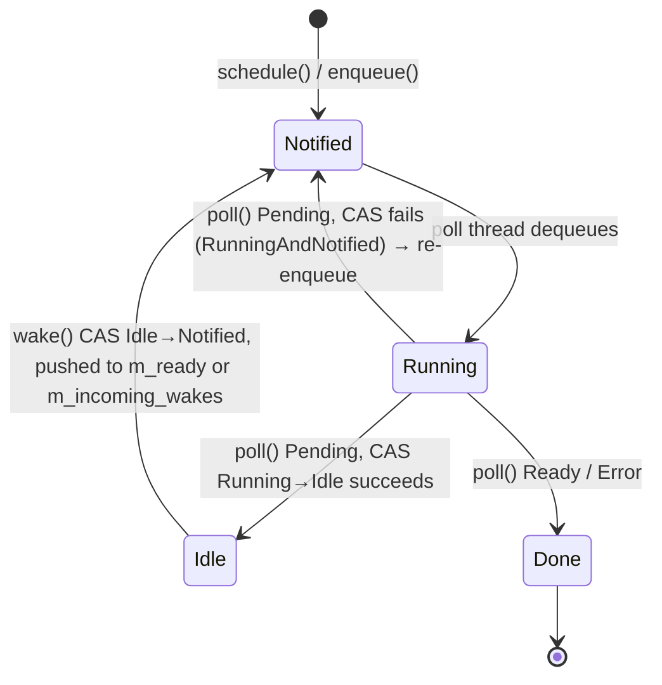
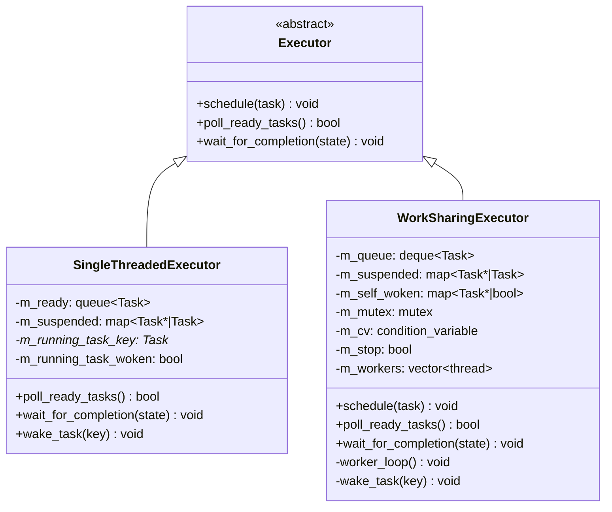
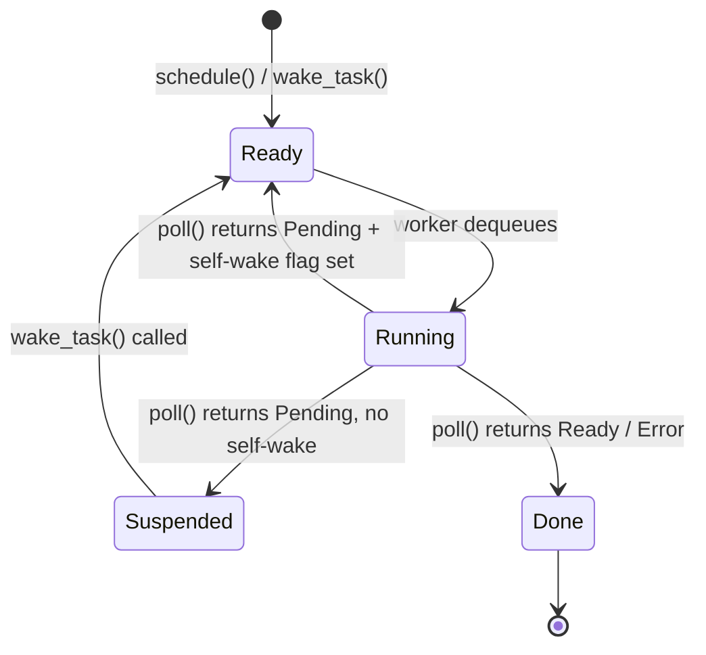

# Executor Design

Design document covering the `Executor` interface, the two concrete implementations
(`SingleThreadedExecutor` and `WorkSharingExecutor`), and the planned local-queue /
injection-queue changes that enable safe wakeups from external threads.

---

## Overview

`Executor` is the abstract scheduling interface. It accepts type-erased `Task` objects
and decides when to poll them. It does not own threads or the I/O reactor — those belong
to `Runtime`.

Two concrete implementations exist:

| Executor | Threads | Use case |
|---|---|---|
| `SingleThreadedExecutor` | 1 (the calling thread) | Tests, deterministic debugging, single-threaded apps |
| `WorkSharingExecutor` | N worker threads | Multi-threaded production use |

`Runtime` selects the implementation at construction time:

```cpp
Runtime::Runtime(std::size_t num_threads) {
    if (num_threads <= 1)
        m_executor = std::make_unique<SingleThreadedExecutor>();
    else
        m_executor = std::make_unique<WorkSharingExecutor>(num_threads, this);
}
```

---

## Local Wake vs. Remote Wake

When the `TimerService` background thread calls `Waker::wake()`, it originates from a
thread that is not the poll loop. The same is true of future I/O completion callbacks.
Every executor must therefore handle wakeups from threads it does not own.

Tokio and similar runtimes distinguish two categories of wakeup:

| Category | Caller thread | Synchronization needed |
|---|---|---|
| **Local wake** | Same thread as the poll loop / owning worker | None — sole owner of the local queue |
| **Remote wake** | Any other thread (timer, I/O, cross-thread) | Mutex + condvar signal |

**Local wake (fast path):** the waker fires from the thread that owns the ready queue.
No locking is needed. This is the common case: coroutines waking each other
synchronously during `poll()` — channels, `select`, `JoinHandle` resolution.

**Remote wake (injection queue):** the waker fires from a foreign thread. The safe
path appends the task to a mutex-protected **injection queue** and signals a condvar so
the poll thread wakes up if it is blocked. The poll thread drains the injection queue
at the start of each cycle.

The thread identity check is performed inside `Executor::enqueue()` — the method called
by `TaskWaker::wake()` after winning the `Idle → Notified` CAS. This replaces the old
`wake_task(key)` pattern that required a `m_suspended` lookup:

```
enqueue(task):
    if this_thread is the owning worker:
        local_queue.push(task)   // no lock
    else:
        lock(injection_mutex)
        injection_queue.push_back(task)
        unlock(injection_mutex)
        injection_cv.notify_one()
```

External threads never touch the local ready queue directly — only the injection queue.

---

## Task Scheduling State

Rather than tracking suspended tasks in a central `m_suspended` map, the planned design
follows Tokio's approach: ownership of the `shared_ptr<Task>` moves with the task's
lifecycle, and an atomic state field in `TaskStateBase` tracks the current phase.

### States

| State | `shared_ptr<Task>` owner | Description |
|---|---|---|
| **Idle** | The `Waker` stored by the suspended future | Waiting for an external event |
| **Running** | The executor / worker | Currently inside `poll()` |
| **Notified** | A ready queue | Queued and waiting to be polled |
| **RunningAndNotified** | The executor / worker | `wake()` fired during `poll()`; worker re-enqueues after poll returns |

```cpp
enum class SchedulingState : uint8_t {
    Idle               = 0,
    Running            = 1,
    Notified           = 2,
    RunningAndNotified = 3,
};
```

When `schedule()` first enqueues a task it must explicitly store `Notified` into
`scheduling_state` before pushing to the queue. The field defaults to `Idle`, but `Idle`
means a waker is responsible for re-enqueueing — at initial schedule no waker exists yet.
This mirrors Tokio, which initializes new task state with the `SCHEDULED` flag set.

Unlike the conceptual states shown in the executor state diagrams (which are implicit in
which data structure holds the task's `shared_ptr`), `SchedulingState` is an explicit
field that must be stored. The CAS operations that replace `m_suspended` have nothing to
operate on without it.

**Implementation note:** `scheduling_state` lives in `Task`, not `TaskStateBase`. The
original design placed it in `TaskStateBase`, but fire-and-forget tasks (created by
`spawn().submit().detach()`) have `m_state = nullptr` — they have no `TaskStateBase` at
all, yet still need a scheduling state for the waker CAS to work. Placing the field
directly in `Task` handles both cases uniformly:

```cpp
class Task {
public:
    std::atomic<SchedulingState> scheduling_state{SchedulingState::Idle};
    // ...
};
```

**C++ note:** `std::atomic<T>` is not movable. `Task` previously had
`Task(Task&&) noexcept = default`, which would produce a deleted move constructor once
`scheduling_state` was added. Explicit move operations were required that load/store the
atomic value rather than trying to move it.

### TaskWaker

`TaskWaker` holds exactly two fields: a `shared_ptr<Task>` (to push to a queue on wake)
and an `Executor*` to determine which queue to target. No `shared_ptr<TaskStateBase>` is
needed because `scheduling_state` lives directly in `Task`:

```cpp
struct TaskWaker : detail::Waker {
    shared_ptr<detail::Task> task;
    Executor*                executor;

    void wake() override {
        // Try Idle → Notified: first waker to fire; push task to queue.
        auto expected = SchedulingState::Idle;
        if (task->scheduling_state.compare_exchange_strong(
                expected, SchedulingState::Notified,
                std::memory_order_acq_rel, std::memory_order_relaxed)) {
            executor->enqueue(task);
            return;
        }
        // Try Running → RunningAndNotified: poll() is in progress; worker re-enqueues after.
        expected = SchedulingState::Running;
        task->scheduling_state.compare_exchange_strong(
            expected, SchedulingState::RunningAndNotified,
            std::memory_order_acq_rel, std::memory_order_relaxed);
        // If neither CAS succeeds the task is already Notified or RunningAndNotified — no-op.
    }
};
```

`acq_rel` on the winning CAS synchronizes-with any subsequent load of the task's state,
ensuring the worker that picks it up sees all writes made by the waking thread before the
CAS. `relaxed` on the failure path is safe because no memory ordering guarantee is needed
when nothing is transferred.

Multiple waker clones may race to call `wake()`. Only the first `Idle → Notified` CAS
succeeds and pushes to the queue; the rest are no-ops. Each clone holds its own
`shared_ptr<Task>` ref, so the task remains alive until the winning clone transfers its
ref to the queue.

The executor constructs `TaskWaker` immediately before calling `poll()` using just the
two required fields: `shared_ptr<Task>` (just dequeued) and `Executor*` (`this`).

### Executor::enqueue()

`executor->enqueue(task)` routes the task to the appropriate queue based on thread
identity — local queue (no lock) for the owning worker, injection queue (with lock) for
any other thread. This replaces `wake_task(key)`, which had to look up the task in
`m_suspended`. With the waker owning the `shared_ptr<Task>`, no lookup is needed.

**Initial schedule always uses the injection queue.** `schedule()` is called by
`Runtime::block_on()` before `wait_for_completion()` sets `m_poll_thread_id`
(single-threaded) or before any worker thread is running (work-sharing). In both cases
the caller is not a worker of the executor, so the first enqueue always takes the
injection/remote path. This is correct and expected — the poll thread or first worker
will drain it on its first iteration.

### Worker loop integration

After `poll()` returns `Pending`, the worker attempts to transition `Running → Idle`. If
`wake()` fired concurrently the state is `RunningAndNotified` and the CAS fails — the
worker re-enqueues instead of parking:

```
after poll() returns Pending:
    expected = Running
    if CAS(expected → Idle) succeeds:
        task.reset()          // waker now holds the only ref; task parks until wake() fires
    else:
        // State must be RunningAndNotified — assert and re-enqueue
        expected = RunningAndNotified
        ASSERT CAS(expected → Notified) succeeds, else log unexpected state and terminate
        enqueue(task)
```

This eliminates `m_suspended` from both executors entirely — there is no longer a map of
parked tasks. A task in the `Idle` state is kept alive solely by the `shared_ptr` inside
the `Waker` that the suspended future is holding.

Every scheduling state transition uses CAS — including `Notified → Running` before
`poll()`. A plain store would silently overwrite whatever state the task is actually in.
A CAS failure indicates a bug (e.g. two workers racing to poll the same task) and the
executor must log the unexpected state and terminate. This policy applies to every
transition: `schedule()` storing `Notified`, workers storing `Running`, and the post-poll
`Running → Idle` / `RunningAndNotified → Notified` paths.

---

## TaskStateBase and Completion Signalling

`block_on` must block the calling thread until the top-level task completes. The
completion signal lives in `TaskStateBase` — a non-template base of `TaskState<T>` that
is shared across both executors.

```cpp
struct TaskStateBase {
    mutable std::mutex      mutex;
    std::condition_variable cv;
    bool                    terminated{false};
    std::atomic<bool>       cancelled{false};

    // RACE CONDITION NOTE: this is safe because every code path that sets
    // `terminated = true` also calls `cv.notify_all()` *in the same critical section*
    // (under `mutex`). Key invariant: set `terminated = true` AND call `cv.notify_all()`
    // while holding `mutex`.
    void wait_until_done() {
        std::unique_lock lock(mutex);
        cv.wait(lock, [this]{ return terminated; });
    }
};
```

`scheduling_state` does **not** live here — see the implementation note in [Task Scheduling State](#task-scheduling-state).

Every terminal method (`setResult`, `setDone`, `setException`, `mark_done`) sets
`terminated = true` and calls `cv.notify_all()` **inside the same lock**, eliminating
any lost-wakeup window.

Cancellation is delivered by setting `cancelled = true` and then calling `waker->wake()`.
This transitions the task from `Idle → Notified` so it is re-enqueued and polled, where
it observes `cancelled` and enters the `PollDropped` path to run destructors and drain
child tasks. Simply dropping the `shared_ptr<Task>` is not safe: unlike Rust futures
(plain values that the compiler drops safely at any `await` point), C++ coroutine frames
are heap-allocated and the only way to release their resources is to resume and poll
through completion.

`wait_for_completion` for `WorkSharingExecutor` delegates entirely:

```cpp
void wait_for_completion(detail::TaskStateBase& state) {
    state.wait_until_done();
}
```

`SingleThreadedExecutor` cannot use this directly since it *is* the poll thread — it
must interleave polling with waiting. See the [SingleThreadedExecutor](#singlethreadedexecutor)
section for the planned fix.

`Runtime::block_on` passes `*state` directly to either implementation:

```cpp
m_executor->schedule(make_task(future, state));
m_executor->wait_for_completion(*state);
```

---

## SingleThreadedExecutor

### Current issues

`SingleThreadedExecutor` was designed under the assumption that all wakers fire
synchronously from within `poll()` on the calling thread. The `TimerService` background
thread violates this:

**Issue 1 — Data race:** `wake_task` accesses `m_running_task_key`, `m_running_task_woken`,
and `m_ready` without any mutex. An external thread calling `wake_task` from a different
thread is an unsynchronized concurrent write — a TSan-detectable data race.

**Issue 2 — Premature return:** `wait_for_completion` exits as soon as `poll_ready_tasks()`
returns `false`:

```cpp
while (true) {
    if (state.terminated) return;
    if (!poll_ready_tasks()) return;  // exits when ready queue is empty
}
```

If a task is in the `Idle` state awaiting a timer, the ready queue empties and `block_on`
returns before the future completes.

### Task states

Each task is in exactly one state at any moment:



### Planned data model

Fields added:

```
m_poll_thread_id : thread::id                    ← set when wait_for_completion is entered
m_incoming_wakes : deque<shared_ptr<Task>>       ← remote enqueue() calls deposit here
m_remote_mutex   : mutex                         ← guards m_incoming_wakes
m_remote_cv      : condition_variable            ← signalled by remote enqueue(); waited on by wait_for_completion
```

Fields removed:

```
m_suspended          ← replaced by Idle state; waker owns the shared_ptr<Task>
m_running_task_key   ← replaced by Running / RunningAndNotified atomic state
m_running_task_woken ← replaced by RunningAndNotified atomic state
```

### Planned enqueue routing

`TaskWaker::wake()` calls `executor->enqueue(task)` after the `Idle → Notified` CAS
succeeds. `enqueue` routes based on thread identity:

```
enqueue(task):
    if this_thread == m_poll_thread_id:
        // Local path — push directly to ready queue, no lock
        m_ready.push(task)
    else:
        // Remote path — hand off to poll thread via injection queue
        lock(m_remote_mutex)
        m_incoming_wakes.push_back(task)
        unlock(m_remote_mutex)
        m_remote_cv.notify_one()
```

The `Running → RunningAndNotified` self-wake CAS is handled entirely inside
`TaskWaker::wake()` — no executor involvement needed.

### Planned poll_ready_tasks — drain injection queue first

```
poll_ready_tasks():
    lock(m_remote_mutex)
    for task in m_incoming_wakes:
        m_ready.push(task)
    m_incoming_wakes.clear()
    unlock(m_remote_mutex)

    // Existing poll loop (unchanged)
    ...
```

### Planned wait_for_completion — block instead of exit

```
wait_for_completion(state):
    m_poll_thread_id = this_thread::get_id()
    while true:
        if state.terminated: return
        if poll_ready_tasks(): continue
        // Ready queue empty — block until a remote wake arrives.
        // state.terminated cannot change while blocked here since tasks only
        // complete during poll_ready_tasks(), which is not running.
        lock(m_remote_mutex)
        m_remote_cv.wait(lock, [this]{ return !m_incoming_wakes.empty(); })
        unlock(m_remote_mutex)
    m_poll_thread_id = {}
```

> **Note — task budget:** if tasks continuously wake each other, `poll_ready_tasks()`
> always returns `true` and the outer loop never yields. `m_incoming_wakes` is drained at
> the start of each `poll_ready_tasks()` call so timer wakeups are still serviced, but
> remote wakes may be delayed by an arbitrary number of local iterations. Tokio addresses
> this with a per-turn task budget (default 61): after processing that many tasks the
> worker unconditionally yields to drain the injection queue regardless of whether the
> local queue is empty. A similar bound should be applied here.

---

## WorkSharingExecutor

### Current implementation



### Current data model

```
WorkSharingExecutor
│
├── m_queue     : deque<shared_ptr<Task>>          ← ready tasks, mutex-protected
├── m_suspended : map<Task*, shared_ptr<Task>>     ← parked tasks, same mutex
├── m_self_woken: map<Task*, bool>                 ← tracks tasks mid-poll
├── m_mutex     : mutex                            ← guards all of the above
├── m_cv        : condition_variable               ← workers wait here
├── m_stop      : bool                             ← shutdown signal, set under m_mutex
└── m_workers   : vector<thread>                   ← N worker threads
```

`m_queue`, `m_suspended`, and `m_self_woken` share one mutex because moving a task
between them is always one atomic operation.

### Task state machine (current implementation)



**Self-wake** (waker fires while the task is mid-poll on a worker thread) is handled with
a per-task boolean flag in `m_self_woken`:

- `wake_task(key)`: if `key` is in `m_self_woken` (currently Running), set
  `m_self_woken[key] = true`. Otherwise move from `m_suspended` to `m_queue` and
  `notify_one`.
- After `poll()` returns: check and erase the `m_self_woken` entry. If it was true,
  re-enqueue; if false, move to `m_suspended`.

The planned design replaces `Suspended`, `m_suspended`, and `m_self_woken` with the
atomic `SchedulingState` described in the [Task Scheduling State](#task-scheduling-state)
section above.

### Worker thread loop

```
worker_loop():
    set_current_runtime(m_runtime)
    set_current_timer_service(&m_runtime->timer_service())

    loop:
        lock(m_mutex)
        wait on m_cv until: m_queue non-empty OR m_stop
        if m_stop and m_queue empty → break

        task = dequeue front of m_queue
        m_self_woken[task] = false
        unlock(m_mutex)

        waker = TaskWaker(task, this)
        done = task->poll(Context(waker))      ← runs outside the lock

        lock(m_mutex)
        self_woke = m_self_woken[task]; erase entry
        if done:
            m_cv.notify_all()                  ← inside lock — no lost wakeup
        elif self_woke:
            m_queue.push_back(task)
            m_cv.notify_one()
        else:
            m_suspended[task] = task
        unlock(m_mutex)

        if done: drop task                     ← destructor fires outside the lock

    set_current_runtime(nullptr)
    set_current_timer_service(nullptr)
```

**Key invariants:**
- `task->poll()` runs outside `m_mutex` so other workers can dequeue concurrently and
  `wake_task()` can acquire the lock.
- `m_cv.notify_all()` on task completion is called **inside** `m_mutex`. Calling it after
  the lock release creates a lost-wakeup window if the waiter checks `terminated` between
  the release and the notify.
- `m_stop = true` is set **inside** `m_mutex` before `notify_all()` in the destructor,
  for the same reason.

### Thread-local state

Two thread-locals are set on each worker at startup:

| Thread-local | Set by | Used by |
|---|---|---|
| `t_current_runtime` | Worker thread startup | `coro::spawn()`, `JoinSet::spawn()` |
| `t_current_timer_service` | Worker thread startup | `coro::schedule_wakeup()` in `SleepFuture::poll()` |

### Shutdown

The destructor:
1. Sets `m_stop = true` inside `m_mutex`
2. Calls `m_cv.notify_all()` after releasing the lock
3. Joins all worker threads

Outstanding tasks in `m_queue` and `m_suspended` are dropped when their `shared_ptr`s
destruct.

### Planned: per-worker local queues

External wakes via `wake_task` are already safe — every code path holds `m_mutex`. The
planned change is a performance optimization that also serves as the foundation for the
work-stealing executor on the roadmap.

Under the current design every wake, whether from the same worker or a remote thread,
acquires the single global `m_mutex`. With many tasks and many workers this lock becomes
a bottleneck.

**New data model:**

```
Per-worker (thread-local):
    m_local_queue[i] : WorkStealingDeque<shared_ptr<Task>>  ← see detail below

Shared:
    m_injection_queue : deque<shared_ptr<Task>>  ← remote enqueue() calls land here
    m_mutex           : mutex                    ← guards m_injection_queue only
    m_cv              : condition_variable
```

`m_suspended`, `m_self_woken`, and the `m_mutex` coverage of suspended/self-woken state
are all removed. `m_suspended` is replaced by the `Idle` scheduling state — a task in
`Idle` is kept alive solely by the `shared_ptr<Task>` inside its `Waker`. Self-wake is
handled by the `Running → RunningAndNotified` CAS in `TaskWaker::wake()` with no shared
data structure. `m_mutex` narrows to guard only `m_injection_queue`; each
`WorkStealingDeque` manages its own internal mutex. When `WorkStealingDeque` is eventually
replaced with a lock-free implementation, the `m_mutex` / `m_injection_queue` boundary is
unchanged.

`WorkStealingDeque` presents a Chase-Lev interface (`push`, `pop`, `steal`) backed by a
per-instance `std::mutex` + `std::deque`. This keeps the interface stable for a future
drop-in lock-free replacement.

**Thread-local state (updated):**

The original design used a single `t_worker_index` thread-local. This is insufficient
when multiple `WorkSharingExecutor` instances exist simultaneously — worker thread 0 of
executor A and worker thread 0 of executor B have the same index, so a cross-executor
`enqueue()` call from A's worker would incorrectly push to B's local queue at index 0.
The fix is two thread-locals:

```cpp
thread_local WorkSharingExecutor* t_owning_executor = nullptr;  // which executor owns this thread
thread_local int                  t_worker_index    = -1;       // which slot within that executor
```

`enqueue()` checks both: `t_worker_index >= 0 && t_owning_executor == this`. Only when
both match is the local (lock-free) path taken.

**Updated enqueue routing:**

`TaskWaker::wake()` calls `executor->enqueue(task)` after the `Idle → Notified` CAS.
`enqueue` routes based on thread identity — no `m_suspended` lookup needed:

```
enqueue(task):
    if t_worker_index >= 0 AND t_owning_executor == this:
        m_local_queue[t_worker_index].push(task)   // no lock
    else:
        lock(m_mutex)
        m_injection_queue.push_back(task)
        unlock(m_mutex)
        m_cv.notify_one()
```

**Updated worker loop — local queue first:**

```
worker_loop():
    set_current_runtime(m_runtime)
    set_current_timer_service(&m_runtime->timer_service())

    loop:
        task = m_local_queue[this_worker].pop()   // no lock
        if not task:
            lock(m_mutex)
            wait until: m_injection_queue non-empty OR m_stop
            task = m_injection_queue.pop_front()
            unlock(m_mutex)

        expected = Notified
        ASSERT CAS(expected → Running) succeeds, else log unexpected state and terminate
        done = task->poll(ctx)

        if done:
            drop task
        else:
            // Try Running → Idle; if wake() fired concurrently state is RunningAndNotified
            expected = Running
            if CAS(expected → Idle) succeeds:
                task.reset()   // waker holds the only ref; parks until wake() fires
            else:
                // State must be RunningAndNotified — assert and re-enqueue
                expected = RunningAndNotified
                ASSERT CAS(expected → Notified) succeeds, else log unexpected state and terminate
                enqueue(task)  // re-enqueue via local path

    set_current_runtime(nullptr)
    set_current_timer_service(nullptr)
```

**Relationship to work-stealing:** the only additional step needed for a work-stealing
executor is a steal path — when both the local queue and the injection queue are empty,
attempt to take a task from the back of another worker's local queue. That change is
isolated to the worker loop and does not affect wake routing.

> **Note — task budget:** a worker that continuously receives local wakes will never
> yield to check the injection queue, starving remote wakes. Tokio uses a per-turn budget
> (default 61 tasks from the local queue) after which the worker unconditionally checks
> the injection queue before continuing. A similar bound should be applied to the local
> queue drain loop here.

---

## Summary

| | `SingleThreadedExecutor` | `WorkSharingExecutor` |
|---|---|---|
| **External wake safety** | `m_incoming_wakes` injection queue; `m_remote_cv` blocks when idle | `m_injection_queue` + `m_cv`; workers block when both local and injection queues empty |
| **Suspended task storage** | `Idle` atomic state; waker holds the only `shared_ptr<Task>` ref | `Idle` atomic state; waker holds the only `shared_ptr<Task>` ref |
| **Self-wake detection** | `RunningAndNotified` CAS in `TaskWaker::wake()` | `RunningAndNotified` CAS in `TaskWaker::wake()` |
| **Local enqueue path** | Direct to `m_ready`, no lock (poll thread only) | Direct to `m_local_queue[t_worker_index]`, no lock (owning worker only) |
| **Remote enqueue path** | `m_incoming_wakes` + `m_remote_cv.notify_one()` | `m_injection_queue` + `m_cv.notify_one()` |
| **wait_for_completion** | Drives poll loop; blocks on `m_remote_cv` when ready queue empty | Delegates entirely to `state.wait_until_done()` |

---

## Files

| File | Status | Contents |
|---|---|---|
| `include/coro/detail/task_state.h` | Complete | `SchedulingState` enum |
| `include/coro/detail/task.h` | Complete | `scheduling_state` atomic in `Task`; explicit move ctor/assign |
| `include/coro/detail/work_stealing_deque.h` | Complete | `WorkStealingDeque<T>` — mutex-backed, Chase-Lev interface |
| `include/coro/runtime/executor.h` | Complete | `enqueue(shared_ptr<Task>)` pure virtual |
| `include/coro/runtime/task_waker.h` | Complete | Shared `TaskWaker` — `shared_ptr<Task>` + `Executor*` |
| `include/coro/runtime/single_threaded_executor.h` | Complete | Injection queue fields; `m_suspended` and self-wake fields removed |
| `src/single_threaded_executor.cpp` | Complete | `enqueue` routing; CAS-based poll loop; fixed `wait_for_completion` |
| `include/coro/runtime/work_sharing_executor.h` | Complete | Per-worker local queues; `m_suspended`, `m_self_woken` removed |
| `src/work_sharing_executor.cpp` | Complete | Dual thread-locals; `enqueue` routing; CAS-based worker loop |
