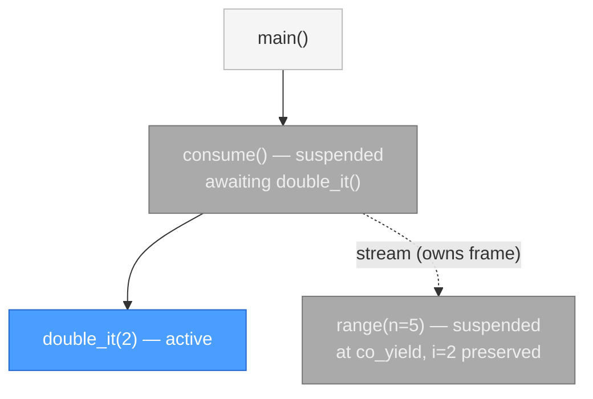
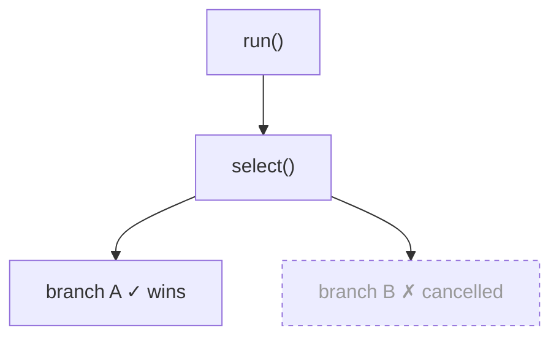
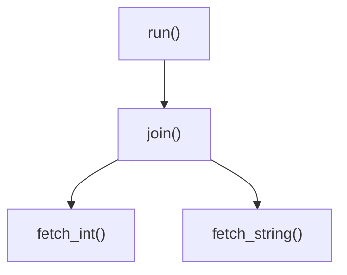
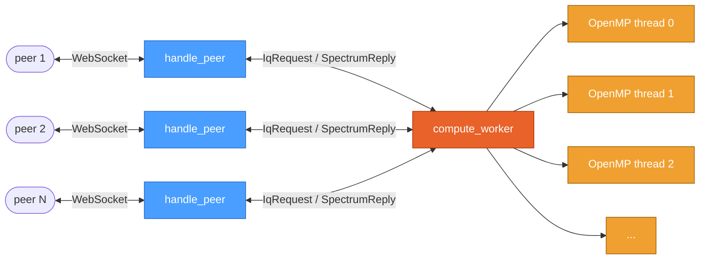

# Getting Started

This guide walks you through the core concepts of the library by building a TCP echo server
from the ground up. Each section introduces a feature as the server needs it — so you always
have a concrete reason for every abstraction you encounter. Sections 1–11 introduce all the
features; sections 12 and 13 are complete, self-contained examples that bring them together.

## Setup

The library requires C++20 and uses CMake. The recommended and supported
method for managing dependencies is with [Conan](https://conan.io). Other
package managers or manual installs should also work.

CMake locates dependencies through `find_package()`, which searches standard platform
locations automatically for common packages (e.g. GTest ships its own CMake config). For
less common packages you can point CMake at a manually installed prefix via
`CMAKE_PREFIX_PATH`, or write a
[CMake package config file](https://cmake.org/cmake/help/latest/command/find_package.html).
Conan is simply the most convenient way to generate these config files consistently across
platforms.

### Building with Conan

```bash
conan install . --build=missing -s:h build_type=Release
cmake --preset conan-release
cd build/Release && make
```

**`--build=missing`** (shorthand: `-b=missing`) — optional. Instructs Conan to build any
dependency that does not have a pre-built binary available, rather than exiting with an
error.

**`-s:h build_type=Release`** — optional. Selects the build type. Valid values are
`Release`, `Debug`, and `RelWithDebInfo`. Defaults to `Release` if omitted. The CMake
preset and build directory must match:

| Build type | CMake preset | Build directory |
|---|---|---|
| `Release` | `conan-release` | `build/Release` |
| `Debug` | `conan-debug` | `build/Debug` |
| `RelWithDebInfo` | `conan-relwithdebinfo` | `build/RelWithDebInfo` |

Common headers:

```cpp
// Core coroutine types
#include <coro/coro.h>                    // Coro<T> — async function return type
#include <coro/coro_stream.h>             // CoroStream<T> — async generator return type
#include <coro/future.h>                  // Future/Cancellable concepts, FutureRef, coro::ref()
#include <coro/stream.h>                  // Stream concept, coro::next()
#include <coro/co_invoke.h>               // co_invoke() — safe capturing-lambda coroutines

// Runtime
#include <coro/runtime/runtime.h>         // Runtime, spawn(), build_task()

// Tasks
#include <coro/task/join_handle.h>        // JoinHandle<T>
#include <coro/task/join_set.h>           // JoinSet<T>
#include <coro/task/spawn_blocking.h>     // spawn_blocking()
#include <coro/task/spawn_on.h>           // spawn_on(), with_context()

// Sync primitives
#include <coro/sync/select.h>             // select()
#include <coro/sync/join.h>               // join()
#include <coro/sync/sleep.h>              // sleep_for()
#include <coro/sync/timeout.h>            // timeout()
#include <coro/sync/event.h>              // Event — single-waiter set/wait primitive
#include <coro/sync/mutex.h>              // Mutex — async mutex
#include <coro/task/stream_handle.h>      // StreamHandle<T>

// Channels
#include <coro/sync/oneshot.h>            // oneshot_channel<T>
#include <coro/sync/mpsc.h>               // mpsc_channel<T>
#include <coro/sync/watch.h>              // watch_channel<T>

// I/O
#include <coro/io/file.h>                 // File — async file I/O
#include <coro/io/tcp_stream.h>           // TcpStream — async TCP
#include <coro/io/tcp_listener.h>         // TcpListener — TCP accept loop
#include <coro/io/ws_stream.h>            // WsStream — async WebSocket client
#include <coro/io/ws_listener.h>          // WsListener — WebSocket server
#include <coro/io/poll_stream.h>          // PollStream — character-device / fd streaming
```

---

## 1. Your first coroutine

A coroutine is a function that can suspend and resume. Calling a coroutine function does
**not** start executing it — it constructs an idle object representing a value that will
be produced sometime in the future. Nothing in the body runs until something drives it;
the typical entry point is `Runtime::block_on()`.

We are going to build a TCP echo server. This is the skeleton we will build on through
the rest of this guide:

```cpp
#include <coro/coro.h>
#include <coro/runtime/runtime.h>
#include <cstdio>

coro::Coro<int> run_server() {
    std::printf("server starting\n");
    co_return 0;  // stub — we'll fill this in section by section
}

int main() {
    coro::Runtime rt;
    return rt.block_on(run_server());
}
```

`run_server` is a coroutine: its return type is `Coro<int>` and it contains `co_return 0`.
The `int` is the exit code — `block_on` drives the coroutine to completion and returns its
value to `main`. Calling `run_server()` **does not** print anything — it constructs and
returns an idle `Coro<int>` object. `block_on` takes that object and drives it to
completion, which is when the printf actually executes.

The compiler recognizes a coroutine by two things together: a coroutine return type
(`Coro<T>`, `CoroStream<T>`) *and* at least one `co_return`, `co_await`, or `co_yield`
in the body. The return type alone is not enough — a plain function that returns `Coro<T>`
without any `co_*` keywords is just a factory:

```cpp
// Coroutine — co_return triggers the compiler to generate suspend/resume machinery.
// The body does not execute until the returned Coro<int> is driven by an executor.
coro::Coro<int> run_server() {
    std::printf("server starting\n");
    co_return 0;
}

// Regular function — no co_* keywords, so not a coroutine.
// It calls run_server(), which constructs and returns an idle Coro<int> object,
// then returns that object to the caller. Nothing inside run_server() has run yet.
coro::Coro<int> make_server() {
    return run_server();
}
```

Because calling a coroutine just produces an object, you can store it, pass it around,
or name it before running it:

```cpp
int main() {
    coro::Runtime rt;

    coro::Coro<int> task = run_server();   // idle — nothing has run yet
    // task can be stored, passed to another function, etc.
    return rt.block_on(std::move(task));   // now it runs; returns the exit code
}
```

`block_on` is the simplest way to drive a coroutine from synchronous code — section 5
covers how the runtime and executor work in detail, and section 6 shows how to run
coroutines in parallel with `spawn()`.

---

## 2. Awaiting another coroutine

The server stub immediately returns. Let's give it a real first step: binding to a port.
This is also where `co_await` first appears.

```cpp
#include <coro/coro.h>
#include <coro/runtime/runtime.h>
#include <coro/io/tcp_listener.h>  // TcpListener — covered in full in section 4
#include <cstdio>

coro::Coro<int> run_server() {
    // Think of TcpListener::bind as a coroutine that returns a TcpListener once the
    // port is bound and ready to accept connections. I/O types are covered in section 4.
    coro::TcpListener listener = co_await coro::TcpListener::bind("127.0.0.1", 8080);
    std::printf("listening on 127.0.0.1:8080\n");
    co_return 0;  // we'll accept connections in section 4
}

int main() {
    coro::Runtime rt;
    return rt.block_on(run_server());
}
```

`co_await` suspends `run_server()` until the socket is bound, then resumes it with the
`TcpListener` unwrapped directly into `listener`. Crucially, suspending does **not** block
the OS thread — control returns to the executor, which is free to run other coroutines in
the meantime. The thread is never parked waiting; it is always doing useful work.

Recall from section 1 that calling a coroutine function produces an idle object — nothing
has run. `co_await` is how a running coroutine starts a child: the child begins executing
immediately on the current thread, and if it reaches a point where it needs to wait (I/O,
a channel, a sleep), *that* suspension propagates up and the executor picks up something
else. When the child eventually completes, the parent resumes with the result.

To see the mechanics with a simpler example:

```cpp
coro::Coro<int> fetch_value() {
    co_return 100;
}

coro::Coro<void> run() {
    // fetch_value() constructs the coroutine object.
    // co_await starts it running and suspends run() until it completes.
    // v receives the unwrapped int — not a future, not an optional, just the value.
    int v = co_await fetch_value();
    std::cout << v << "\n";  // 100
}
```

!!! info
    `co_await` works on anything that produces a value asynchronously — not just `Coro<T>`.
    As we go we will introduce many other primitives such as channel receives, I/O operations, timers,
    and combinators like `select` and `join` that are all awaitable the same way. These types satisfy
    the [`Future` concept](design/future_and_stream.md), which the reference docs cover in detail, but you rarely
    need to think about it directly.

---

## 3. Async generators

The echo server won't use async generators, but `co_yield` is the third coroutine keyword
and follows naturally from the other two. It's worth understanding as a related concept.

`CoroStream<T>` introduces `co_yield`: where `co_return` produces a single value and exits,
`co_yield` emits a value and suspends — the generator resumes from the next `co_yield` when
the consumer asks for another item. Consume it with `co_await coro::next(stream)` in a
loop; `next()` returns `std::nullopt` when the generator is exhausted.

```cpp
#include <coro/coro_stream.h>
#include <coro/stream.h>
#include <coro/coro.h>
#include <coro/runtime/runtime.h>
#include <iostream>

coro::CoroStream<int> range(int n) {
    for (int i = 0; i < n; ++i)
        co_yield i;
}

coro::Coro<int> double_it(int x) { co_return x * 2; }

coro::Coro<void> consume() {
    auto stream = range(5);
    while (auto item = co_await coro::next(stream)) {
        int result = co_await double_it(*item);  // range stays suspended while this runs
        std::cout << result << " ";              // 0 2 4 6 8
    }
}

int main() {
    coro::Runtime rt;
    rt.block_on(consume());
}
```

At the moment `double_it` is executing, three coroutine frames exist simultaneously:



In synchronous code this would be impossible: `double_it`'s stack frame would occupy the
same memory that `range`'s frame previously used, overwriting it. Since `range` co_yielded
rather than returned, its frame is still live — it can't be overwritten. Each coroutine
frame is heap-allocated at its own independent address, so `double_it` and `range` coexist
without conflict, and `consume` can re-enter `range` as soon as `double_it` returns.

A generator can also `co_await` futures internally, suspending the stream until the
awaited future resolves. The `next()` pattern also appears with `JoinSet` and `mpsc`
channels later in this guide — any type satisfying `Stream<T>` is consumed the same way.

---

## 4. Async I/O

In section 2 we co_awaited `TcpListener::bind()` to get a listening socket. Now we add
`listener.accept()` — which suspends until a client connects and returns a `TcpStream`,
the read/write handle for that client — and an echo loop to send their data back.

`TcpStream::read()` and `TcpStream::write()` suspend the coroutine rather than blocking
the thread, freeing the executor to run other tasks in the meantime. When the operation
completes, `run_server` resumes on the next line — exactly as if the call had blocked.
Both `read` and `write` use owned buffers: the buffer is moved into the operation and returned with the
result, tying its lifetime to the coroutine frame and making dangling-pointer bugs
impossible at the type-system level.

```cpp
#include <coro/coro.h>
#include <coro/runtime/runtime.h>
#include <coro/io/tcp_listener.h>
#include <coro/io/tcp_stream.h>
#include <cstdio>
#include <string>

coro::Coro<int> run_server() {
    coro::TcpListener listener = co_await coro::TcpListener::bind("127.0.0.1", 8080);
    std::printf("listening on 127.0.0.1:8080\n");

    coro::TcpStream stream = co_await listener.accept();
    std::printf("client connected\n");
    for (;;) {
        auto [n, buf] = co_await stream.read(std::string(4096, '\0'));
        if (n == 0) {
            std::printf("EOF\n");
            co_return 0;
        }
        buf.resize(n);
        co_await stream.write(std::move(buf));
    }
}

int main() {
    coro::Runtime rt;
    return rt.block_on(run_server());
}
```

The server as is handles only one connection before it exits — section 6 extends it to handle many concurrently.

To test it, a client connects with `TcpStream::connect` — the same read/write interface from the other end:

```cpp
coro::Coro<void> run_client() {
    coro::TcpStream stream = co_await coro::TcpStream::connect("127.0.0.1", 8080);
    co_await stream.write(std::string("hello"));
    auto [n, reply] = co_await stream.read(std::string(4096, '\0'));
    reply.resize(n);
    std::printf("received: %.*s\n", (int)n, reply.c_str());
}
```

The library provides several other I/O types that follow the same suspend-not-block pattern.

### File — async file I/O

`File` provides async read and write on the local filesystem. The interface is the same
owned-buffer pattern as `TcpStream` — open, read, write, and the coroutine suspends
rather than blocking while the operation runs.

```cpp
#include <coro/io/file.h>

coro::Coro<void> run() {
    auto f = co_await coro::File::open("data.txt", coro::FileMode::Read);
    auto [n, buf] = co_await f.read(std::vector<std::byte>(4096));
    buf.resize(n);

    auto out = co_await coro::File::open(
        "output.txt", coro::FileMode::Write | coro::FileMode::Create | coro::FileMode::Truncate);
    co_await out.write(std::move(buf));
}
```

### WsStream / WsListener — WebSocket

`WsStream` and `WsListener` are the WebSocket equivalents of `TcpStream` and `TcpListener`.
`WsStream::connect()` handles the handshake and returns a stream with `send()` and
`receive()` methods; `WsListener::bind()` accepts incoming connections and hands out a
`WsStream` per client.

```cpp
#include <coro/io/ws_stream.h>

coro::Coro<void> run() {
    coro::WsStream ws = co_await coro::WsStream::connect("ws://localhost:9001/");
    co_await ws.send("hello");
    coro::WsStream::Message reply = co_await ws.receive();
    std::cout << reply.as_text() << "\n";  // "hello"
}
```

---

## 5. The Runtime and Executor

We've been creating a `Runtime` and calling `block_on()` without much explanation. Now
that the server can accept connections, here's what's been driving it. The `Runtime` owns
a configurable **executor** — the component that schedules and runs coroutine tasks.

`Runtime::block_on()` is the bridge between synchronous and async code. It takes a
single root coroutine, drives it to completion on the executor, and returns its result
to the caller. Everything else — spawning tasks, awaiting I/O, sleeping — happens from
inside that root coroutine.

```cpp
int main() {
    coro::Runtime rt;
    return rt.block_on(run_server());  // blocks until run_server() completes
}
```

### Choosing an executor

The executor determines how tasks are scheduled across threads. Three are available:

| Executor | Threads | Use case |
|---|---|---|
| `WorkStealingExecutor` | N (default: `hardware_concurrency()`) | Production default — tasks distributed across threads automatically |
| `SingleThreadedExecutor` | 1 | Tests, deterministic environments, single-core targets |
| `WorkSharingExecutor` | N | Rarely needed — see below |

The `Runtime` constructor selects the executor based on the thread count argument:

```cpp
coro::Runtime rt;       // WorkStealingExecutor, hardware_concurrency() threads
coro::Runtime rt(4);    // WorkStealingExecutor, 4 threads
coro::Runtime rt(1);    // SingleThreadedExecutor
```

For explicit control over executor type, use `std::in_place_type`:

```cpp
#include <coro/runtime/work_stealing_executor.h>
#include <coro/runtime/single_threaded_executor.h>
#include <coro/runtime/work_sharing_executor.h>

coro::Runtime rt(std::in_place_type<coro::WorkStealingExecutor>, 4);
coro::Runtime rt(std::in_place_type<coro::SingleThreadedExecutor>);
coro::Runtime rt(std::in_place_type<coro::WorkSharingExecutor>, 4);
```

- **Work-stealing** is the right default for most applications. Tasks are distributed
across worker threads; when a thread exhausts its local queue it steals tasks from
other threads, keeping all cores busy without manual load balancing.
- **Single-threaded** is ideal for tests and deterministic environments. All coroutines
run on the calling thread — no synchronization is needed for shared state between
coroutines, and execution order is reproducible.
- **Work-sharing** predates work-stealing in this library and exists because it was
simpler to implement initially. It uses a single global FIFO queue protected by a mutex, which
becomes a contention bottleneck under any significant task load. It is occasionally
useful when debugging to help isolate whether a bug is specific to the work-stealing
scheduler, but work-stealing should be preferred in virtually every other situation.
Only reach for this if you understand the trade-offs and have a concrete reason to.

The server code itself is unchanged regardless of which executor you use — the runtime
is a pure deployment knob. Because the choice is just a constructor argument, it can
even be a runtime decision based on a command-line flag:

```cpp
int main(int argc, char* argv[]) {
    bool single = argc > 1 && std::string_view(argv[1]) == "--single-threaded";

    if (single) {
        coro::Runtime rt(std::in_place_type<coro::SingleThreadedExecutor>);
        return rt.block_on(run_server());
    } else {
        coro::Runtime rt(std::in_place_type<coro::WorkStealingExecutor>);
        return rt.block_on(run_server());
    }
}
```

`run_server()` is called identically in both branches — nothing inside it changes.

---

## 6. Spawning parallel tasks

The server in section 4 accepts one connection, handles it, and exits. We could wrap the
echo loop in an outer `for` loop to keep accepting, but connections would then be handled
sequentially — the next `accept()` only runs after the current client disconnects. What we
need is for each connection to run in parallel: a separate instance of the echo loop per
client, all active at the same time. That means moving the echo loop into its own coroutine
that can be instantiated once per connection:

```cpp
static coro::Coro<void> handle_connection(coro::TcpStream stream, int id) {
    std::printf("[%d] connected\n", id);
    for (;;) {
        auto [n, buf] = co_await stream.read(std::string(4096, '\0'));
        if (n == 0) {
            std::printf("[%d] EOF\n", id);
            co_return;
        }
        buf.resize(n);
        co_await stream.write(std::move(buf));
    }
}
```

`handle_connection` takes `TcpStream` by value — the stream is moved into the task's
frame so each connection owns its socket independently, with no shared state between them.

To launch a separate instance of `handle_connection` per connection we use `coro::spawn()`,
which schedules a coroutine as an independent parallel task. A useful mental model is
launching an OS thread — the task executes concurrently with the caller, but no new thread
is actually created; spawning is lightweight and the task runs on the existing executor
threads. This also means the executor's thread count doesn't limit how many tasks you can
have — a single-threaded executor can run thousands of tasks, interleaving them
cooperatively rather than truly simultaneously. `spawn()` returns a `JoinHandle` that can
be `co_await`ed just like any other coroutine to retrieve the result or wait for
completion.

!!! info "Tasks and OS threads"
    A task is the coroutine analogue of an OS thread. A thread takes a function as its
    entry point; everything it calls runs sequentially on that thread — no two callees on
    the same thread overlap. A task works the same way: it takes a coroutine as its entry
    point, that coroutine `co_await`s other coroutines instead of calling functions, and
    everything in the resulting *"stack"* (a chain of suspended awaiters — not a true call
    stack, but the closest analogue) runs sequentially. Only coroutines in *different* tasks
    can execute simultaneously.

    The difference is cost. `std::thread` requires a kernel stack (8 MiB by default on
    Linux) and an OS scheduler registration — a round-trip into the kernel. A task allocates
    only a coroutine frame (typically a few hundred bytes) and a small scheduler entry, with
    no system call. The work-stealing executor is designed to support hundreds of thousands
    of concurrent tasks, in the same ballpark as Tokio, on which the scheduler is modelled.

```cpp
coro::Coro<int> run_server() {
    coro::TcpListener listener = co_await coro::TcpListener::bind("127.0.0.1", 8080);
    std::printf("listening on 127.0.0.1:8080\n");

    constexpr int max_connections = 5;  // fixed limit just to demonstrate joining
    std::vector<coro::JoinHandle<void>> handles;
    for (int i = 0; i < max_connections; ++i) {
        coro::TcpStream stream = co_await listener.accept();
        handles.push_back(coro::spawn(handle_connection(std::move(stream), i)));
    }

    for (auto& h : handles)
        co_await h;

    co_return 0;
}
```

To demonstrate joining here, the server accepts a fixed number of connections and runs them
all in parallel while we wait in the accept loop. Each `co_await h` waits for that session to
finish and join before the server exits. The limitation is that we have to know the count
upfront and we wait for sessions in spawn order rather than completion order — a client that
disconnects first still waits behind a slower one. Section 7 will cover how to extend this to
handle a dynamic number of connections and deliver results in completion order.

!!! warning "Key takeaways"
    The rest of this section covers cancellation, task lifetimes, and reference hazards.
    The behaviour is deliberate and the rules are few, but they may not be obvious to first
    time users and getting them wrong can lead to subtle bugs. It is worth reading this
    section in full before writing code that spawns tasks, but if you do decide to skip
    ahead for now at minimum keep these points in mind:

    - Dropping a `JoinHandle` **cancels** the task and the parent waits for it to drain — no dangling tasks, ever.
    - `handle.detach()` — fire and forget; parent never waits.
    - `handle.cancelOnDestroy(false)` — no cancel signal; parent waits for natural completion. Use this when a task needs to keep running during error cleanup — for example, a collector that must finish draining a channel even after sibling tasks have been cancelled.
    - After cancellation, **no user code runs again** — only destructors, in order.
    - **Reference hazard:** do not let a spawned task hold a reference to a local in the spawning scope. Use `co_invoke` to create an inner scope instead (see below).

### The coroutine scope mechanism

Every `Coro<T>` tracks the tasks it spawns. When a `JoinHandle` goes out of scope, the
enclosing coroutine records it as a pending child and will not let its own frame complete
until that child has fully **drained**. This is the coroutine scope mechanism — it
underpins both the cancellation guarantee and the reference safety rules below.

**Dropping a handle without awaiting cancels the task.** If you drop a `JoinHandle`
without awaiting it, the task receives a cancellation signal and the scope waits for it
to drain before completing — so there are never dangling tasks.

Draining is how the library works around the fact that C++ destructors cannot suspend.
Once a task is cancelled, **none of the user's coroutine code ever runs again** — no
`co_await` expression resumes, no code after a suspension point executes. What the drain
does instead is walk the call tree and run each frame's destructors in order, suspending
if a destructor itself needs to wait (for example, because a local `JoinHandle` triggers
a nested drain). This continues until every frame in the tree has been cleaned up.
The result is that cancellation is safe to use with RAII: local resources are always
destroyed in order, at the right time, even when the destruction path itself involves
asynchronous steps.

```cpp
std::atomic_bool handler_frame_destroyed = false;

coro::Coro<void> handle_connection() {
    // This local's destructor (④) fires when handle_connection's frame is cleaned up —
    // whether it completed normally or was cancelled.
    struct OnDestroy { ~OnDestroy() { handler_frame_destroyed.store(true); } } probe;

    // ② handle_connection suspends here waiting for client data.
    co_await coro::sleep_for(10s);  // stands in for a long-running read
    std::cout << "data received\n";  // never executes — cancelled at ②
}

coro::Coro<void> run_server() {
    // ① handle_connection is spawned and immediately starts executing, reaching ②.
    auto handle = coro::spawn(handle_connection());

    co_await coro::sleep_for(1s);  // server shuts down after 1s for this example
    co_return;
    // ③ handle goes out of scope — cancellation signal sent to handle_connection, interrupting ②.
    // ④ drain: handle_connection's frame is destroyed; ~OnDestroy fires.
    // ⑤ run_server() only completes after ④ — no dangling connections.
}

coro::Coro<void> parent() {
    co_await run_server();
    // ⑥ resumes after ~1s, not ~10s — handle_connection was cancelled before it completed.
    assert(handler_frame_destroyed.load());  // drain rules guarantee ④ fired before ⑥
}
```


To opt out of cancellation, two options are available. `detach()` fully severs the task
from the scope — the parent continues immediately and never waits for the child.
`cancelOnDestroy(false)` keeps the task in the scope but removes the cancellation signal:
when the handle is dropped the task continues running normally, and the parent waits for
it to finish naturally before returning.

```cpp
coro::Coro<void> parent() {
    coro::spawn(child()).detach();               // fire and forget — parent never waits for child

    coro::spawn(child()).cancelOnDestroy(false); // no cancel — parent waits for child to finish normally

    co_return;
}
```

#### Why cancel-on-drop is the default

This is a deliberate design choice. `std::async` and
`std::jthread` block in their destructors — they wait for the thread to finish. That
behaviour is safe for threads because there is no reliable way to cancel an arbitrary
running thread: a thread may be blocked in a syscall, spinning in a tight loop, or holding
a lock, and forcibly killing it leaves resources in an undefined state. Blocking until it
finishes naturally is the only safe option.

Coroutines do not have this problem. Structured cancellation always unwinds cleanly: the
cancellation signal is delivered at the next `co_await` point, every destructor runs in
order, and child tasks are recursively drained before the parent completes. Cancellation is
always safe, so it can be the default.

Making it the default is also the fail-safe choice. If an exception propagates unexpectedly
and destroys a `JoinHandle` before it is awaited — a situation that is easy to stumble into
— cancel-on-drop ensures the spawned task is stopped and drained immediately rather than
silently continuing to run, racing against now-destroyed state, or causing a deadlock when
the runtime tries to shut down. The non-cancelling behaviours (`detach()` and
`cancelOnDestroy(false)`) are available but intentionally opt-in: both require an explicit call and
cannot happen by accident.

#### The reference hazard

The scope mechanism catches most cases automatically, but there is one gap rooted in a
C++ limitation: destructors cannot suspend. `JoinHandle`'s destructor cannot block (that
would stall an executor thread) and cannot `co_await` (destructors are not coroutines),
so instead it records the child as pending and defers the drain wait to the next available
suspend point. The coroutine's own completion is the only suspend point guaranteed to
follow every possible `JoinHandle` destructor call — but by the time that completion
point is reached, C++ has already destroyed the frame's locals. The drain wait starts
after the locals are gone, leaving a window where a child holding a reference to a local
reads dangling memory.

C++ also has no compile-time check to catch this — there is no borrow checker to reject
a spawn that captures a reference to a local. To make the hazard concrete, imagine a
`worker` that suspends briefly before using the pointer:

```cpp
coro::Coro<void> worker(int* ptr) {
    co_await coro::sleep_for(std::chrono::milliseconds(10)); // ③ suspended here
    std::printf("%d\n", *ptr);  // ④ USE-AFTER-FREE: local_data is already gone
}

coro::Coro<void> unsafe_example() {
    int local_data = 42;                        // ① lives in the coroutine frame
    auto h = coro::spawn(worker(&local_data));  // ② child starts, holds &local_data
    co_return;
    // ③ local_data is DESTROYED as part of frame teardown.
    //    h's destructor fires: it cannot co_await, so it records the drain as
    //    pending and signals cancellation to worker.
    // ④ The deferred drain runs after the frame is gone — worker wakes from
    //    sleep_for and dereferences a dangling pointer.
}
```

The drain wait is deferred past the point where C++ has already torn down the frame's
locals, so there is always a window where the child can read destroyed memory.

**The safe patterns are:**

1. **Pass owned data** — move values into the child instead of capturing references.
2. **Use `co_invoke` to create a nested scope** — `co_invoke` (covered in section 10) introduces
   a new coroutine scope inside the current one. Placing the `JoinHandle` (or `JoinSet`) inside that
   nested scope — while the referenced variable stays in the outer frame — guarantees
   that the outer frame outlives the spawned task. The numbered steps below mirror the
   unsafe example so you can see exactly where the hazard is closed:

```cpp
coro::Coro<void> safe_example() {
    int shared_value = 42;          // ① lives in the outer coroutine frame

    co_await coro::co_invoke([&]() -> coro::Coro<void> {
        auto h = coro::spawn(worker(&shared_value)); // ② child starts, holds &shared_value
        co_await h;
        // ③ co_await suspends here — outer frame is still alive.
        //    worker wakes from sleep_for and reads *ptr safely.
        // ④ h goes out of scope; inner scope drains synchronously before
        //    co_invoke returns.
    });
    // ⑤ shared_value is destroyed here — the child finished at step ④.
}
```

`JoinSet` works equally well when you need to spawn multiple tasks — the point is not
which handle type you use, but that the handle lives in the inner scope while the
referenced variable lives in the outer one:

```cpp
co_await coro::co_invoke([&]() -> coro::Coro<void> {
    coro::JoinSet<void> js;
    js.spawn(worker_a(&shared_value));
    js.spawn(worker_b(&shared_value));
    co_await js.drain();
});
```

See the [Coroutine Scope design document](design/coroutine_scope.md) for a full explanation of
the implicit scope mechanism, its limits, and how it compares to Rust's `'static` bound.

---

## 7. Fan-out with `JoinSet`

Back to the server. In section 6 we spawned a `handle_connection` task per connection and
collected the `JoinHandle`s in a vector, but that required knowing the connection count
upfront. `JoinSet` removes that constraint: it accepts tasks as they arrive and tracks them
internally without a fixed size. We can `co_await coro::next(sessions)` at any point to
receive the next completed result or propagate an error.

```cpp
#include <coro/task/join_set.h>

coro::Coro<int> run_server() {
    coro::TcpListener listener = co_await coro::TcpListener::bind("127.0.0.1", 8080);
    std::printf("listening on 127.0.0.1:8080\n");

    coro::JoinSet<void> sessions;
    for (int i = 0; ; ++i) {
        // What we really want here is:
        //   await listener.accept()  -- OR --  coro::next(sessions)
        // whichever happens first, handle it, then loop.
        // For now we can only do one at a time:
        coro::TcpStream stream = co_await listener.accept();
        sessions.spawn(handle_connection(std::move(stream), i));
        co_await coro::next(sessions);  // wait for a session to complete
    }
}
```

Dropping `sessions` at any point — whether `run_server` returns normally, throws, or is
cancelled — cancels every in-flight connection simultaneously and drains them before the
frame is freed.

The loop still alternates sequentially: accept a connection, spawn it, wait for it to
finish, then accept the next. If we could instead react to whichever of those two operations
completes first — a new connection arriving or an existing session finishing — `sessions`
would grow and shrink dynamically, results and errors would surface in the order sessions
complete, and no client would ever block another from being accepted. Section 8 shows how
to achieve exactly that.

---

## 8. Concurrent combinators

**Concurrent** means multiple operations can make progress without waiting for each other
to complete — no ordering guarantees on when each starts or finishes. **Parallel** extends
this to include simultaneous execution on multiple cores.

`spawn()` creates parallel tasks. The combinators in this section — `join`, `select`,
`timeout`, and `sleep_for` — are concurrent but not parallel: they drive multiple futures
within the current task, advancing one at a time. No two branches within a single Task ever
execute simultaneously, even on a multi-threaded executor.

The server has two remaining problems: (1) the accept loop is stuck waiting in
`listener.accept()` and never drains completed sessions from the `JoinSet`; (2) a stalled
client that stops sending or receiving holds its connection slot indefinitely, blocking that
handler task forever. Both are solved with combinators.

!!! info "Concurrent vs parallel — tasks vs combinators"
    A plain `co_await` chain is linear: each coroutine waits for the one below it, just
    like a call stack. Combinators fan a single task out into multiple live branches at
    once — the task's execution structure becomes a tree, not a stack. All branches in
    that tree are interleaved cooperatively on a single thread at a time; none of them
    run truly simultaneously. A second *task* (spawned with `spawn()`) is a second
    independent tree, and those two trees are what the executor runs in parallel across
    threads. Combinators are concurrent; `spawn()` is parallel.

### Racing futures — `select()`



`select()` races two or more futures and returns as soon as one completes.
The result is a `std::variant` of `SelectBranch<N, T>` values identifying which
branch won and carrying its result. All other branches are cancelled and drained.

This is exactly what the section 7 loop was missing. Instead of awaiting `accept()` then
`next(sessions)` sequentially, we race them — whichever fires first is handled and the loop
continues immediately, keeping new connections and completed sessions serviced without
either starving the other:

```cpp
coro::Coro<int> run_server() {
    coro::TcpListener listener = co_await coro::TcpListener::bind("127.0.0.1", 8080);
    std::printf("listening on 127.0.0.1:8080\n");

    coro::JoinSet<void> sessions;
    for (int i = 0; ; ++i) {
        try {
            // variant<SelectBranch<0, TcpStream>, SelectBranch<1, bool>>
            auto sel = co_await coro::select(
                listener.accept(),    // branch 0: new connection ready
                coro::next(sessions)  // branch 1: a session completed (throws if it threw)
            );
            if (sel.index() == 0) {
                coro::TcpStream& stream = std::get<0>(sel).value;
                sessions.spawn(handle_connection(std::move(stream), i));
            }
            // branch 1: session completed normally — loop and accept more connections
        } catch (const std::exception& e) {
            std::printf("session error: %s — shutting down\n", e.what());
            co_return 1;
        }
    }
}
```

#### Keeping a future alive across a losing branch — `coro::ref()`

By default `select()` takes its futures by value and cancels any branch that loses. Sometimes
you want to re-enter the same future across multiple `select()` rounds — for example,
polling a long-running task while checking back periodically.

`coro::ref(f)` wraps an lvalue future in a non-owning reference. When that branch loses,
only the wrapper is discarded; the underlying future is untouched and can be passed to
`select()` again:

```cpp
using namespace std::chrono_literals;

coro::Coro<int> slow_task() {
    co_await coro::sleep_for(5s);
    co_return 42;
}

coro::Coro<void> run() {
    auto task = slow_task();  // lvalue — coro::ref() requires this

    // Check every second whether the task has finished.
    while (true) {
        auto sel = co_await coro::select(coro::ref(task), coro::sleep_for(1s));
        if (sel.index() == 0) {
            std::printf("done: %d\n", std::get<0>(sel).value);
            break;
        }
        std::printf("still waiting...\n");  // timer fired, loop and check again
    }
}
```

!!! warning "Key points"
    - `coro::ref()` only accepts lvalues — store the future in a named variable first.
      `coro::ref(slow_task())` is a compile error.
    - If the `coro::ref(f)` branch wins and delivers a result, the result is moved out of `f`.
      Do not await `f` again — it is logically consumed even though it was not moved.

### Joining futures — `join()`



`join()` is the complement of `select()`: it runs a fixed set of futures concurrently and
waits for **all** of them to complete. The number and types of branches are fixed at compile
time and results are returned as a `std::tuple` in branch order.

```cpp
#include <coro/sync/join.h>

coro::Coro<int>         fetch_int()    { co_return 42; }
coro::Coro<std::string> fetch_string() { co_return "hello"; }

coro::Coro<void> run() {
    auto [n, s] = co_await coro::join(fetch_int(), fetch_string());
    std::cout << n << " " << s << "\n";  // 42 hello
}
```

If any branch throws, the remaining branches are cancelled and the exception re-thrown.
Use `JoinSet` instead when the number of branches is dynamic.

### Suspending — `sleep_for()`

`sleep_for()` suspends the current coroutine for a duration without blocking any worker
thread. Other tasks continue to run on the executor while a coroutine sleeps.

```cpp
#include <coro/sync/sleep.h>
#include <chrono>

coro::Coro<void> run() {
    using namespace std::chrono_literals;
    co_await coro::sleep_for(100ms);
}
```

### Timeouts — `timeout()`

`timeout(duration, future)` is a convenience wrapper around `select` that races a future
against a `sleep_for` timer — the pattern from the `coro::ref()` example above, expressed
in one call. The second remaining server problem was stalled clients holding connection
slots indefinitely; we fix that by wrapping each read and write in `handle_connection`:

```cpp
static coro::Coro<void> handle_connection(coro::TcpStream stream, int id) {
    std::printf("[%d] connected\n", id);
    using namespace std::chrono_literals;
    for (;;) {
        auto recv = co_await coro::timeout(20s, stream.read(std::string(4096, '\0')));
        if (recv.index() != 0) {
            std::printf("[%d] receive timed out\n", id);
            co_return;
        }
        auto& [n, buf] = std::get<0>(recv).value;
        if (n == 0) {
            std::printf("[%d] EOF\n", id);
            co_return;
        }
        buf.resize(n);
        auto send = co_await coro::timeout(2s, stream.write(std::move(buf)));
        if (send.index() != 0) {
            std::printf("[%d] send timed out\n", id);
            co_return;
        }
    }
}
```

The return type mirrors `select(F, SleepFuture)`:
- `SelectBranch<0, T>` — the future completed in time.
- `SelectBranch<1, void>` — the deadline elapsed first.

---

## 9. Thread-safe communication

When tasks run in parallel they need to safely exchange data. Channels transfer ownership
between tasks so only one task holds a piece of data at a time, eliminating whole classes
of data races at the design level. The client in section 12 uses `mpsc` heavily — each
concurrent connection holds a cloned sender and forwards replies to a single collector task
— so the patterns introduced here appear directly in that example.

### Channels

> *"Do not communicate by sharing memory; instead, share memory by communicating."*
> — Go team

Channels are the direct embodiment of this idea: rather than protecting shared state with
a mutex and having tasks reach in to read or write it, channels let tasks transfer ownership
of values — the sender produces, the receiver consumes, and the channel handles the
synchronization transparently.

Three channel variants are provided:

| Variant | Producers | Consumers | Notes |
|---|---|---|---|
| `oneshot` | 1 | 1 | Single-use, one value; send is synchronous |
| `mpsc`    | N (cloneable sender) | 1 | Bounded buffer; backpressured send |
| `watch`   | N | N (cloneable receiver) | Last-value-wins; send never suspends |

!!! note
    Tokio also provides a broadcast channel that is not implemented yet, but likely will be added in the near future.

#### RAII handles and disconnection

Every channel end is a RAII handle. Dropping a handle signals disconnection to the other
side automatically — no explicit `close()` call is needed:

- **Sender dropped** — any receiver waiting for a value wakes immediately and gets a
  `ChannelError` result. For `mpsc`, dropping all senders closes the channel and causes
  the receiver's `next()` loop to terminate naturally.
- **Receiver dropped** — any sender waiting to send wakes immediately and gets its value
  back in the error slot of the returned `std::expected`, so move-only values are never
  silently lost.

For `watch`, the sender dropping is the normal way to signal that no more updates will
arrive. Receivers observe this as an error on their next `changed()` call and can exit
cleanly — it is not an unexpected failure.

#### Error handling

All channel operations return `std::expected<T, ChannelError>` rather than throwing.
Call `.value()` to throw on error, or check the result explicitly.

```cpp
#include <coro/sync/oneshot.h>
#include <coro/sync/mpsc.h>
#include <coro/sync/watch.h>
```

#### oneshot — single value, one sender, one receiver

Use `oneshot` to hand a single result from one task to another.
`send()` is synchronous and can be called from any thread.

```cpp
coro::Coro<void> run() {
    auto [tx, rx] = coro::oneshot_channel<int>();

    // co_invoke keeps the capturing lambda alive for the coroutine's lifetime — section 10
    auto h = coro::spawn(coro::co_invoke(
        [tx = std::move(tx)]() mutable -> coro::Coro<void> {
            tx.send(42);
            co_return;
        }));

    auto result = co_await rx;      // std::expected<int, ChannelError>
    std::cout << result.value() << "\n";  // 42
    co_await h;
}
```

If the sender is dropped without calling `send()`, `co_await rx` returns
`std::unexpected(ChannelError::Closed)`.

#### mpsc — bounded queue, multiple producers, one consumer

Use `mpsc` for producer/consumer pipelines. The receiver satisfies `Stream<T>`,
so consume it with `next()` in a loop.

```cpp
coro::Coro<void> run() {
    auto [tx, rx] = coro::mpsc_channel<int>(/*capacity=*/16);

    // Spawn two producers — each holds a copy of the sender.
    // When both complete, their senders are dropped, closing the channel.
    // co_invoke keeps the capturing lambda alive for the coroutine's lifetime — section 10
    auto h1 = coro::spawn(coro::co_invoke(
        [tx = tx.clone()]() mutable -> coro::Coro<void> {
            for (int j = 0; j < 3; ++j)
                co_await tx.send(j);
        }));
    auto h2 = coro::spawn(coro::co_invoke(
        [tx = std::move(tx)]() mutable -> coro::Coro<void> {
            for (int j = 0; j < 3; ++j)
                co_await tx.send(10 + j);
        }));

    // Consume until all senders are dropped.
    while (auto v = co_await coro::next(rx))
        std::cout << *v << " ";
    std::cout << "\n";

    co_await h1;
    co_await h2;
}
```

`send()` suspends the producer if the buffer is full, providing natural
backpressure. Use `try_send()` for a non-blocking attempt.

A common pattern for signalling completion without an explicit flag: clone the sender into
each spawned task and drop the original immediately. When the last task exits — whether
normally, by throwing, or by cancellation — the last clone is dropped, the channel closes,
and the receiver's `next()` loop exits naturally.

#### watch — last-value channel, multiple senders, many receivers

Use `watch` to broadcast configuration or state that multiple tasks need to observe.
Unlike `mpsc`, receivers do not consume values — each receiver independently tracks
when the value last changed and can read it at any time. Call `changed()` to suspend
until the next update, then `borrow()` to read the current value.

```cpp
coro::Coro<void> run() {
    auto [tx, rx] = coro::watch_channel<int>(/*initial=*/0);

    // co_invoke keeps the capturing lambda alive for the coroutine's lifetime — section 10
    auto h = coro::spawn(coro::co_invoke(
        [rx = std::move(rx)]() mutable -> coro::Coro<void> {
            while (true) {
                auto r = co_await rx.changed();
                if (!r) co_return;          // sender dropped — channel closed
                std::cout << *rx.borrow() << "\n";
            }
        }));

    tx.send(1);
    tx.send(2);
    tx.send(3);
    // Explicitly drop tx — closes the channel so the watcher's changed() returns an error.
    { auto _ = std::move(tx); }
    co_await h;
}
```

`rx.clone()` creates an independent receiver with its own cursor — useful when
multiple tasks need to track changes independently.

**`WatchBorrowGuard`** — `borrow()` returns a `WatchBorrowGuard<T>`, a scoped read-lock handle
borrowed from Rust's `watch` channel design. It holds a shared read lock on the
channel's value for its entire lifetime, preventing any `send()` call from writing
while it is held. Multiple receivers may hold `WatchBorrowGuard`s simultaneously — they
share the read lock and do not block each other. Dereference it to access the value;
it releases the lock when it goes out of scope.

```cpp
// changed() suspends until a new value is sent — no lock held while waiting.
co_await rx.changed();

{
    auto guard = rx.borrow();  // ← shared read lock acquired here
    use(*guard);               //   safe to read; other receivers can borrow too
}                              // ← guard destroyed, read lock released here

tx.send(new_config);           // fine — no WatchBorrowGuard alive, write lock available
```

!!! warning
    Do not hold a `WatchBorrowGuard` across a `co_await` point. If the coroutine
    suspends while the guard is alive, the read lock is held for the entire suspension —
    blocking every `send()` call until the coroutine is resumed and the guard finally
    goes out of scope. Always copy the value out or scope the guard tightly before
    any suspension point.

```cpp
// WRONG — read lock held across suspension
auto guard = rx.borrow();
co_await do_work(*guard);   // send() is blocked for the duration of do_work

// CORRECT — copy out first, then suspend freely
auto value = *rx.borrow();  // guard destroyed at semicolon, lock released
co_await do_work(value);
```

**`WatchBorrowMutGuard`** — the sender's counterpart is `borrow_mut()`, which acquires an
*exclusive* write lock on the value and returns a `WatchBorrowMutGuard<T>`. You modify the
value directly through the guard. When the guard is destroyed it automatically increments
the channel version and wakes all receivers — no separate `send()` call is needed. This
is the idiomatic way to update a field of a complex value in place rather than constructing
and moving an entirely new value.

```cpp
struct Config { int timeout_ms; std::string endpoint; };
auto [tx, rx] = coro::watch_channel<Config>({500, "primary"});

{
    auto guard = tx.borrow_mut();  // ← exclusive write lock acquired here
    guard->timeout_ms = 1000;      //   mutate in place
}                                  // ← guard destroyed: version++, all receivers woken

// rx.changed() will now resolve for any receiver that hasn't seen this version.
```

The same co_await warning applies with even more force: a `WatchBorrowMutGuard` holds an
*exclusive* lock, so every `borrow()` call on every receiver is blocked for the entire
suspension — not just `send()`. Always scope the guard tightly and never hold it across
a suspension point.

`tx.send_if_modified(f)` is the alternative when you want conditional notification: it calls
`f(T&)` under the write lock and only increments the version and wakes receivers if `f`
returns `true` — useful when the update may be a no-op and spurious wakeups are undesirable.

Additional primitives — `coro::Mutex`, `coro::Event`, and `coro::StreamHandle` — are
available for cases where channels do not fit. See the [Cheat Sheet](cheatsheet.md) for a
quick reference.

---

## 10. Capturing-lambda pitfall and `co_invoke`

In section 9 the channel examples used `co_invoke` with a comment pointing here. This is
why. A capturing lambda that returns `Coro<T>` has a subtle use-after-free when used as an
rvalue. The compiler lowers the lambda to an anonymous struct; `operator()` — being a member
function — captures `this` into the coroutine frame. The struct is a temporary and is
destroyed at the end of the full expression, before the coroutine is ever polled.

See [guideline CS.3](guidelines.md#cs3) in the Library Usage Guidelines for a full treatment of this pitfall and related patterns to avoid.

This is a well-known enough hazard that the C++ Core Guidelines explicitly recommend
never using capturing lambda coroutines — including value captures (`[=]`) — for exactly
this reason. `co_invoke` is the pattern this library provides to work around it: wrap
any capturing lambda in `co_invoke` and the library manages its lifetime for you.

```cpp
// DANGEROUS — lambda struct destroyed at ';', before first resumption
auto coro = [x]() -> Coro<void> {
    co_await something();
    use(x);          // accesses this->x — 'this' is dangling
}();
co_await coro;       // use-after-free
```

Use `co_invoke` instead. It moves the lambda onto the heap inside a wrapper that keeps it
alive for the coroutine's entire lifetime:

```cpp
#include <coro/co_invoke.h>

// SAFE — lambda kept alive by co_invoke
co_await co_invoke([x]() -> Coro<void> {
    co_await something();
    use(x);    // safe
});

// Also works with spawn:
auto handle = spawn(co_invoke([x]() -> Coro<void> { ... }));
```

`co_invoke` also works with `CoroStream<T>` lambdas.

### Member function coroutines implicitly capture `this`

A related pitfall applies to non-static member function coroutines. The coroutine frame
holds an implicit `this` pointer — if the object is destroyed while the task is still
running, every subsequent member access is a use-after-free. `co_await`ing a member
coroutine directly is safe because the caller's scope keeps the object alive, but
spawning one is dangerous:

```cpp
struct Processor {
    int value = 42;
    Coro<int> compute();
};

Coro<void> run() {
    Processor p;
    auto h = coro::spawn(p.compute());  // compute() holds this → &p

    co_return;
    // ① h destroyed (last declared, first destroyed) — compute() cancelled
    // ② p destroyed (first declared, last destroyed) — p.value gone
    // ③ run() completes — compute()'s drain starts here, after ②;
    //    compute()'s destructors access &p via this, but p is already gone — use-after-free
}
```

The safe patterns are the same `co_invoke` scope approach, or making the member function
static and passing `std::shared_ptr<T>` explicitly to tie the object's lifetime to the
task. See [Library Usage Guidelines](guidelines.md#cs4) for both patterns in full.

---

## 11. Running blocking code with `spawn_blocking`

Some work is inherently blocking — legacy library calls, CPU-intensive computation,
or synchronous file I/O. Calling these directly from a coroutine would park an executor
worker thread for the duration, starving all other tasks on that thread.

`spawn_blocking()` submits the callable to a dedicated `BlockingPool` thread. The executor
thread is released immediately and can pick up other tasks while the blocking work runs.
The result is returned as a `BlockingHandle<T>`, which is a `Future` you can `co_await`.

```cpp
#include <coro/task/spawn_blocking.h>
#include <coro/runtime/runtime.h>
#include <thread>
#include <chrono>

coro::Coro<void> run() {
    using namespace std::chrono_literals;

    // The executor thread is free while this sleeps on the blocking pool.
    int result = co_await coro::spawn_blocking([] {
        std::this_thread::sleep_for(100ms);  // blocking — fine on the pool
        return 42;
    });
    std::cout << result << "\n";  // 42
}

int main() {
    coro::Runtime rt;
    rt.block_on(run());
}
```

Exception propagation works the same as with any other future:

```cpp
co_await coro::spawn_blocking([]() -> int {
    throw std::runtime_error("oops");
});  // exception propagates to the awaiting coroutine
```

!!! warning "Ownership"
    The callable must own all its data — do not capture references or pointers into the
    spawning coroutine's locals. The blocking thread may outlive the spawning coroutine
    if the `BlockingHandle` is dropped without awaiting.

---

## 12. Putting it all together example 1 — TCP echo server and client

We've now introduced every feature used in the server we've been building section by
section. Here it is in full — along with the companion client that exercises it — with
nothing new introduced.

The server brings together the runtime entry point, async I/O, a task per connection,
`JoinSet` for dynamic fan-out, `select` to interleave accepting and draining, and
`timeout` to evict stalled clients.

### Server

```cpp
#include <coro/coro.h>
#include <coro/runtime/runtime.h>
#include <coro/runtime/single_threaded_executor.h>
#include <coro/runtime/work_stealing_executor.h>
#include <coro/io/tcp_listener.h>
#include <coro/io/tcp_stream.h>
#include <coro/task/join_set.h>
#include <coro/sync/timeout.h>
#include <cstdio>
#include <string>
#include <thread>

using namespace coro;
using namespace std::chrono_literals;

static Coro<void> handle_connection(TcpStream stream, int id) {
    std::printf("[%d] connected\n", id);
    for (;;) {
        auto recv = co_await timeout(20s, stream.read(std::string(4096, '\0')));
        if (recv.index() != 0) {
            std::printf("[%d] receive timed out\n", id);
            co_return;
        }
        auto& [n, buf] = std::get<0>(recv).value;
        if (n == 0) {
            std::printf("[%d] EOF\n", id);
            co_return;
        }
        buf.resize(n);
        auto send = co_await timeout(2s, stream.write(std::move(buf)));
        if (send.index() != 0) {
            std::printf("[%d] send timed out\n", id);
            co_return;
        }
    }
}

static Coro<int> run_server() {
    TcpListener listener = co_await TcpListener::bind("127.0.0.1", 8080);
    std::printf("listening on 127.0.0.1:8080\n");

    JoinSet<void> sessions;
    for (int i = 0;; ++i) {
        try {
            auto sel = co_await coro::select(
                listener.accept(),
                coro::next(sessions)
            );
            if (sel.index() == 0) {
                TcpStream& stream = std::get<0>(sel).value;
                sessions.spawn(handle_connection(std::move(stream), i));
            }
        } catch (const std::exception& e) {
            std::printf("session error: %s — shutting down\n", e.what());
            co_return 1;
        }
    }
}

int main(int argc, char* argv[]) {
    int threads = (argc > 1) ? std::stoi(argv[1]) : 0;

    if (threads == 1) {
        Runtime rt(std::in_place_type<SingleThreadedExecutor>);
        return rt.block_on(run_server());
    } else {
        int n = threads > 1 ? threads : (int)std::thread::hardware_concurrency();
        Runtime rt(std::in_place_type<WorkStealingExecutor>, n);
        return rt.block_on(run_server());
    }
}
```

The full source with timestamps and structured logging is in
[examples/io/tcp_echo_server.cpp](../examples/io/tcp_echo_server.cpp).

### Client

The companion client connects to the server and runs N connections concurrently, each
sending several messages with randomised delays between them. All connections are spawned
into a `JoinSet` so `async_main` waits for every one to finish before returning.

```cpp
#include <coro/coro.h>
#include <coro/runtime/runtime.h>
#include <coro/runtime/single_threaded_executor.h>
#include <coro/runtime/work_stealing_executor.h>
#include <coro/io/file.h>
#include <coro/io/tcp_stream.h>
#include <coro/task/join_set.h>
#include <coro/sync/mpsc.h>
#include <coro/sync/sleep.h>
#include <coro/sync/timeout.h>
#include <chrono>
#include <cstdio>
#include <format>
#include <random>
#include <stdexcept>
#include <string>
#include <thread>

using namespace coro;
using namespace std::chrono_literals;

// Connects to the echo server, sends five messages, and forwards each reply
// to the collector via the channel.  Each instance runs as an independent task
// — all N clients are in flight at once.
static Coro<void> run_client(int id, std::string message, MpscSender<std::string> results) {
    TcpStream stream = co_await TcpStream::connect("127.0.0.1", 8080);

    std::mt19937 rng(std::random_device{}());
    std::uniform_int_distribution<int> delay(100, 2000);

    for (int i = 0; i < 5; ++i) {
        co_await sleep_for(std::chrono::milliseconds(delay(rng)));

        std::string msg = std::format("{} [conn={} seq={}]", message, id, i);

        // variant<SelectBranch<0, pair<size_t,string>>, SelectBranch<1, void>>
        auto send = co_await timeout(2s, stream.write(std::move(msg)));
        if (send.index() != 0)
            throw std::runtime_error(std::format("conn {} send timed out", id));

        // variant<SelectBranch<0, pair<size_t,string>>, SelectBranch<1, void>>
        auto recv = co_await timeout(2s, stream.read(std::string(4096, '\0')));
        if (recv.index() != 0)
            throw std::runtime_error(std::format("conn {} receive timed out", id));

        auto& [n, reply] = std::get<0>(recv).value; // std::pair<size_t, std::string>
        reply.resize(n);
        co_await results.send(std::move(reply));
    }
}

// Receives reply strings from all clients and writes them to a file in arrival
// order — one writer, one file handle, no locking.  Returns the number of
// replies written.
static Coro<int> collect_results(MpscReceiver<std::string> rx) {
    File file = co_await File::open(
        "results.txt",
        FileMode::Write | FileMode::Create | FileMode::Truncate);
    int count = 0;
    while (auto reply = co_await coro::next(rx)) { // std::optional<std::string>
        co_await file.write(std::move(*reply) + "\n");
        ++count;
    }
    co_return count;
}

coro::Coro<int> async_main(std::string message) {
    constexpr int num_clients = 10;

    JoinSet<void> clients;

    // Spawn all clients, each with a cloned sender.  The original tx is dropped
    // at the end of the lambda so the channel closes when the last task-owned
    // clone is dropped — i.e. when every client exits one way or another.
    MpscReceiver<std::string> rx = [&] {
        auto [tx, rx] = mpsc_channel<std::string>(num_clients * 5); // MpscSender<string>, MpscReceiver<string>
        for (int i = 0; i < num_clients; ++i)
            clients.spawn(run_client(i, message, tx.clone()));
        return rx;  // tx dropped here — channel closes when all task-owned clones drop
    }();

    // Spawn the collector as a separate task with cancelOnDestroy(false).
    // If clients.drain() throws, the remaining clients are cancelled and their
    // senders dropped. The collector is not cancelled — it stays alive, flushes
    // whatever replies are still in the channel, and only completes once the
    // channel closes. async_main cannot exit until the collector finishes.
    JoinHandle<int> collector = coro::spawn(collect_results(std::move(rx)));
    collector.cancelOnDestroy(false);

    // If any client throws, drain() rethrows immediately and cancels the rest.
    co_await clients.drain();

    int written = co_await collector;
    std::printf("all done — %d replies written to results.txt\n", written);
    co_return 0;
}

int main(int argc, char* argv[]) {
    std::string message = (argc > 1) ? argv[1] : "hello";
    int threads = (argc > 2) ? std::stoi(argv[2]) : 0;

    if (threads == 1) {
        // All 12+ tasks — clients, collector, file I/O — on one OS thread.
        Runtime rt(std::in_place_type<SingleThreadedExecutor>);
        return rt.block_on(async_main(std::move(message)));
    } else {
        // Same code, now distributed across N worker threads — nothing else changes.
        int n = threads > 1 ? threads : (int)std::thread::hardware_concurrency();
        Runtime rt(std::in_place_type<WorkStealingExecutor>, n);
        return rt.block_on(async_main(std::move(message)));
    }
}
```

A few things worth noting:

- **Single writer via channel, not shared state.** Rather than giving every client a
  shared file handle protected by a mutex, each client owns a cloned
  `MpscSender<std::string>` and sends replies as they arrive. The collector is the only
  task that ever touches the file — no locking, no contention, and writes land in arrival
  order automatically.
- **Channel closes automatically.** The original `tx` is dropped inside the lambda, leaving
  only task-owned clones alive. When the last client exits — whether normally, by throwing,
  or by cancellation — the last clone is dropped, the channel closes, and the collector's
  `next(rx)` loop exits naturally with no explicit signal needed.
- **`cancelOnDestroy(false)` for clean shutdown.** If a client times out, `clients.drain()`
  rethrows the exception immediately and cancels the remaining clients. The collector is
  not cancelled — it keeps running until those cancellations drop the last sender and close
  the channel. Only then does the collector complete and allow `async_main` to exit. Without
  `cancelOnDestroy(false)`, the collector would be cancelled as part of scope cleanup and
  the channel would never be fully drained.
- **Data ownership.** Each `run_client` call receives its own copy of `message` and an
  owned sender. No sharing, no synchronization needed.

The full source with timestamps and structured logging is in
[examples/io/tcp_echo_client.cpp](../examples/io/tcp_echo_client.cpp).

---

## 13. Putting it all together example 2 — feeding a compute loop for CPU-bound work

Many compute-intensive workloads are best parallelised with dedicated tools — OpenMP for
CPU-bound loops, FFTW or MKL for signal processing, CUDA for GPU workloads. Coro is not the right tool for parallelising those tightly coupled compute loops,
and doesn't try to be. However, those workloads never exist in isolation, and that is where
coro does have a role: building the async orchestration layer on top, keeping the compute
loop constantly fed so it never stalls waiting for the next unit of work.

```mermaid
---
displayMode: compact
---
gantt
    title Pipelined Execution
    dateFormat X
    axisFormat %

    section Coro IO
    Input 0   : crit, s0h, 0, 1
    Input 1   : crit, s1h, after s0h, 2
    Input 2   : crit, s2h, after s1h, 3
    Input 3   : crit, s3h, after s0k, 4
    Input 4   : crit, s4h, after s1k, 6
    Input 5   : crit, s5h, after s2k, 8

    section Coro IO
    Output 0   : done, s0d, after s0k, 4
    Output 1   : done, s1d, after s1k, 6
    Output 2   : done, s2d, after s2k, 8
    Output 3   : done, s3d, after s3k, 10

    section Compute
    Compute 0 : active, s0k, after s0h, 3
    Compute 1 : active, s1k, after s0k, 5
    Compute 2 : active, s2k, after s1k, 7
    Compute 3 : active, s3k, after s2k, 9
```



As a concrete example, a synchronous loop runs a Cooley-Tukey FFT using OpenMP on IQ blocks
and sends the magnitude spectrum back. `compute_worker` — the function that implements it —
is a self-contained black box: channel in, channel out. The input here arrives over WebSocket,
but the orchestration pattern is identical regardless of source — the WebSocket receive can be
swapped for an `mpsc` receiver, a file read, or any other type satisfying the `Stream` concept,
and `compute_worker` does not change at all. This makes the pattern equally applicable as a
stage in a larger in-memory pipeline as it is for I/O-driven workloads. The channel boundary
creates a clean separation of concerns — `compute_worker` knows nothing about I/O or scheduling,
and the orchestrator knows nothing about how the computation works. Each side is free to be
optimised, replaced, or reused without touching the other.


> *Blue — One `handle_peer` coroutine per peer, running on the executor thread pool.
Each request carries its own reply address, so results route back to the right
peer with no shared state; Red — `compute_worker` on a dedicated blocking thread;
Orange — OpenMP worker thread spawned from `compute_worker`.*

Three problems have to be solved on the coro side to guarantee `compute_worker` never stalls:

- **The compute loop can't run on an executor thread.** An FFT blocks the OS thread for
  its entire duration, which would freeze every other coroutine sharing that thread.
  `spawn_blocking` gives it a dedicated OS thread where blocking is fine.
- **Many peers share one compute loop.** Each completed spectrum must be returned to the
  peer that requested it, with no external coordination required.
- **Input flow control.** The capacity of the `IqRequest` mpsc channel is the implicit
  bound — a peer that can't push into a full channel suspends automatically until space is
  available, with no explicit coordination required. The FIFO ordering should make this fair in
  practice, though if more strict per-peer guarantees are required explicit quota management
  can be implemented — out of scope for this example.

The full example follows, broken into labeled sections below.

```cpp
#include <complex>
#include <cmath>
#include <numbers>
#include <cstring>
#include <cstdio>

#include <coro/coro.h>
#include <coro/future.h>
#include <coro/runtime/runtime.h>
#include <coro/sync/mpsc.h>
#include <coro/sync/select.h>
#include <coro/task/spawn_blocking.h>
#include <coro/task/join_set.h>
#include <coro/io/ws_stream.h>
#include <coro/io/ws_listener.h>

using namespace coro;

using IqBlock  = std::vector<std::complex<float>>;
using Spectrum = std::vector<float>;

constexpr int FFT_SIZE    = 1024;
constexpr int IQ_CAPACITY = 16;   // shared queue depth across all peers

// Each request carries its IQ block and a per-peer reply sender.
struct IqRequest {
    IqBlock                block;
    MpscSender<Spectrum> reply;
};
```

**`compute_worker` — keeping the compute off the executor, and using the right tool for
parallelism.** `spawn_blocking` places this function on a dedicated OS thread so the FFT
never touches an executor thread. The loop calls `blocking_recv` to wait for work without
spinning. Each `IqRequest` carries an `MpscSender<Spectrum>` cloned from a per-peer
reply channel — the "call me when done" address bundled with the work. `try_send()` delivers
the result directly to the peer that issued the request with no routing and no shared state.
Conceptually it is a callback, but with thread safety, coroutine wakeup, result delivery,
and disconnect detection already built in: `is_closed()` skips the FFT entirely if
the peer is already gone; `try_send()` silently discards the result if disconnection happens
mid-FFT.

Because `compute_worker` is a plain OS thread with no executor involvement, the
Cooley-Tukey below can be replaced with FFTW, an MKL call, or a CUDA kernel[^dsp-gpu] —
the orchestration layer above sees no difference:

```cpp
static void compute_worker(MpscReceiver<IqRequest> iq_rx) {
    // std::optional<IqRequest>
    while (auto req = iq_rx.blocking_recv()) {
        if (req->reply.is_closed()) continue;  // peer gone, skip FFT

        // Cooley-Tukey FFT — replace this block with FFTW or a vendor library.
        IqBlock& block = req->block;
        int n = (int)block.size();

        // Bit-reversal permutation.
        for (int i = 1, j = 0; i < n; ++i) {
            int bit = n >> 1;
            for (; j & bit; bit >>= 1) j ^= bit;
            j ^= bit;
            if (i < j) std::swap(block[i], block[j]);
        }

        // Butterfly passes. Groups at each level are independent; OpenMP
        // parallelises the i loop. The j loop within each group is sequential.
        for (int len = 2; len <= n; len <<= 1) {
            float ang = -2.0f * std::numbers::pi_v<float> / (float)len;
            std::complex<float> wlen(std::cos(ang), std::sin(ang));
            #pragma omp parallel for schedule(static)
            for (int i = 0; i < n; i += len) {
                std::complex<float> w(1.0f, 0.0f);
                for (int j = 0; j < len / 2; ++j, w *= wlen) {
                    std::complex<float> u = block[i + j];
                    std::complex<float> v = block[i + j + len / 2] * w;
                    block[i + j]           = u + v;
                    block[i + j + len / 2] = u - v;
                }
            }
        }

        // Magnitude spectrum — first n/2 positive-frequency bins.
        Spectrum spectrum(n / 2);
        for (int i = 0; i < n / 2; ++i)
            spectrum[i] = std::abs(block[i]);

        req->reply.try_send(std::move(spectrum));  // no-op if peer disconnected mid-FFT
    }
}
```

**`handle_peer` — mpsc backpressure as flow control.** Each peer creates a private
`mpsc` reply channel and runs a two-state loop. In the idle state it selects on both the
WebSocket and the reply channel simultaneously — whichever arrives first is handled and
the loop continues. When a new IQ block arrives it transitions to the sending state,
where it selects on pushing the block into the shared compute channel and draining any
result that comes back while it waits. Once the block is accepted the loop returns to
idle. Backpressure is handled entirely by the compute channel: if it is full,
`iq_tx.send()` suspends until space is available — no explicit flow control needed.

```cpp
// One coroutine per peer. Two states: idle (select on ws + reply) and sending
// (select on compute-channel push + reply). The compute channel's capacity is
// the implicit backpressure bound — no explicit window management required.
static Coro<void> handle_peer(WsStream ws, MpscSender<IqRequest> iq_tx) {
    constexpr std::size_t expected_bytes = FFT_SIZE * sizeof(std::complex<float>);
    // Private reply channel for this peer. compute_worker sends results back here
    // via a cloned sender embedded in each IqRequest.
    auto [reply_tx, reply_rx] = mpsc_channel<Spectrum>(IQ_CAPACITY);
    try {
        for (;;) {
            // --- Idle state ---
            // Loop until a valid IQ block arrives, delivering any results that
            // come back from in-flight requests in the meantime.
            std::optional<IqBlock> next_block;
            while (!next_block.has_value()) {
                // std::variant<WsStream::Message, std::optional<Spectrum>>
                auto outcome = co_await select(ws.receive(), reply_rx.recv());
                if (outcome.index() == 0) {
                    auto& msg = std::get<0>(outcome);
                    if (msg.data.size() >= expected_bytes) {
                        next_block.emplace(FFT_SIZE);
                        std::memcpy(next_block->data(), msg.data.data(), expected_bytes);
                    }
                } else {
                    auto& result = std::get<1>(outcome);
                    if (!result) return;  // compute_worker shut down
                    std::span<const std::byte> bytes(
                        reinterpret_cast<const std::byte*>(result->data()),
                        result->size() * sizeof(float));
                    co_await ws.send(bytes);
                }
            }

            // --- Sending state ---
            // The send future is constructed once and held across multiple select()
            // calls via coro::ref(). This is necessary because select() requires
            // ownership of its futures but the channel may be full, causing the reply
            // branch to win first. coro::ref() lets the same suspended send future be
            // re-entered on each iteration without being moved or destroyed, preserving
            // its position in the channel's wait list until the send succeeds.
            // std::variant<std::expected<void, IqRequest>, std::optional<Spectrum>>
            auto send_future = iq_tx.send(IqRequest{std::move(*next_block), reply_tx.clone()});
            while (true) {
                auto outcome = co_await select(coro::ref(send_future), reply_rx.recv());
                if (outcome.index() == 0) {
                    if (!std::get<0>(outcome).has_value()) return;  // compute_worker shut down
                    break;  // block accepted — return to idle state
                } else {
                    // Result arrived while waiting to push — deliver it and retry the send.
                    auto& result = std::get<1>(outcome);
                    if (!result) return;
                    std::span<const std::byte> bytes(
                        reinterpret_cast<const std::byte*>(result->data()),
                        result->size() * sizeof(float));
                    co_await ws.send(bytes);
                }
            }
        }
    } catch (const std::exception&) {}
    // iq_tx clone dropped here — sender_count decrements toward zero.
}
```

**`run_dsp` — wiring it together.** One `handle_peer` coroutine is spawned per accepted
connection. This is inexpensive — tasks are not OS threads and carry no kernel stack, so
adding more peers is a scheduler entry, not a system call. A `JoinSet<void>` tracks peer
handlers as connections arrive and depart, removing the need to manage their lifetimes
manually. Shutdown flows through the channel: when the listener closes, the accept-loop
drops its `iq_tx` clone; as each `handle_peer` exits it drops its own clone; when the
last clone is gone `blocking_recv` returns `nullopt` and the compute worker exits. No
explicit shutdown signals are needed — the channel's sender count is the signal:

```cpp
static Coro<void> run_dsp(std::string url) {
    // std::pair<MpscSender<IqRequest>, MpscReceiver<IqRequest>>
    auto [iq_tx, iq_rx] = mpsc_channel<IqRequest>(IQ_CAPACITY);

    auto worker = coro::spawn_blocking(
        [iq_rx = std::move(iq_rx)]() mutable {
            compute_worker(std::move(iq_rx));
        });

    WsListener listener = co_await WsListener::listen(url);
    JoinSet<void> peers;

    try {
        for (;;) {
            // WsStream
            WsStream ws = co_await listener.accept();
            peers.spawn(handle_peer(std::move(ws), iq_tx.clone()));
        }
    } catch (const std::exception&) {}

    // Listener closed — drop our sender clone so the worker exits once all
    // peer handlers have also finished and dropped their clones.
    { auto dropped = std::move(iq_tx); }
    while (co_await coro::next(peers)) {}
    co_await std::move(worker);

    std::printf("server shutdown complete\n");
}

int main(int argc, char* argv[]) {
    std::string url = argc > 1 ? argv[1] : "ws://localhost:9001/dsp";
    Runtime rt;
    rt.block_on(run_dsp(std::move(url)));
}
```

### Extending to GPU compute

Replacing `compute_worker` with a GPU kernel is the same pipeline problem applied one
level deeper. Most discrete GPU architectures operate on their own memory, separate from
the CPU's address space — before a kernel can run, input data must be explicitly copied
from host memory to device memory (H2D), and results copied back afterward (D2H). Not all
architectures require explicit transfers, but it is the common case for discrete GPUs from
NVIDIA, AMD, and Intel.

!!! note "Unified memory"
    NVIDIA's unified memory (`cudaMallocManaged`), some integrated GPUs, and certain
    unified-memory designs appear to eliminate explicit transfers. They do not — the
    transfers become demand-paged, triggered when the device first accesses the memory.
    The result is timing much closer to the sequential pipeline below: the transfer stalls
    the kernel rather than happening ahead of time. Explicit prefetching with
    `cudaMemPrefetchAsync` (or the equivalent for your architecture) before the kernel runs
    restores the pipelined behaviour and the full performance improvement.

The kernel itself becomes the compute loop; those transfers become the I/O surrounding it.
In a real application the outer pipeline carries more than just memcpy — preprocessing,
format conversion, validation — but the structure is identical: async I/O feeds a compute
stage that cannot be interrupted, results flow back out through a channel.

Run sequentially, the transfers are dead time: the GPU sits idle while data is being
copied in and the CPU sits idle while the kernel runs.

```mermaid
---
displayMode: compact
---
gantt
    title Sequential GPU execution
    dateFormat X
    axisFormat %

    section H2D
    H2D block 0   : crit, s0h, 0, 1
    H2D block 1   : crit, s1h, after s0d, 4
    H2D block 2   : crit, s2h, after s1d, 7
    H2D block 3   : crit, s3h, after s2d, 10

    section Compute
    Kernel block 0 : active, s0k, after s0h, 2
    Kernel block 1 : active, s1k, after s1h, 5
    Kernel block 2 : active, s2k, after s2h, 8
    Kernel block 3 : active, s3k, after s3h, 11

    section D2H
    D2H block 0   : done, s0d, after s0k, 3
    D2H block 1   : done, s1d, after s1k, 6
    D2H block 2   : done, s2d, after s2k, 9
    D2H block 3   : done, s3d, after s3k, 12

```



Treating the transfers as async stages — moving them into the orchestration layer rather
than blocking inside `compute_worker` — lets them overlap with kernel execution. If
compute is the bottleneck, by the time a kernel finishes the next block is already on the
device. The transfer overhead is fully amortised — its cost drops to zero.

```mermaid
---
displayMode: compact
---
gantt
    title Pipelined GPU execution
    dateFormat X
    axisFormat %

    section WS Receive
    WS Recv 0   : r0, 0, 1
    WS Recv 1   : r1, after s0h, 3
    WS Recv 2   : r2, after s1h, 5
    WS Recv 3   : r3, after s2h, 7

    section H2D
    H2D block 0   : crit, s0h, after r0, 2
    H2D block 1   : crit, s1h, after r1, 4
    H2D block 2   : crit, s2h, after r2, 6
    H2D block 3   : crit, s3h, after r3, 8

    section Compute
    Kernel block 0 : active, s0k, after s0h, 4
    Kernel block 1 : active, s1k, after s1h, 6
    Kernel block 2 : active, s2k, after s2h, 8
    Kernel block 3 : active, s3k, after s3h, 10

    section D2H
    D2H block 0   : done, s0d, after s0k, 5
    D2H block 1   : done, s1d, after s1k, 7
    D2H block 2   : done, s2d, after s2k, 9
    D2H block 3   : done, s3d, after s3k, 11

    section WS Send
    WS Send 0   : t0, after s0d, 6
    WS Send 1   : t1, after s1d, 8
    WS Send 2   : t2, after s2d, 10
    WS Send 3   : t3, after s3d, 12

```



Fitting this into the existing pipeline requires minimal change. `handle_peer` initiates
the H2D transfer before pushing the request — a single `co_await` added to the idle
state, suspending only long enough for the data to land on the device:

```cpp
// Sketch — gaps left intentional.
co_await h2d_transfer(d_block, host_block.data(), bytes, stream);
co_await iq_tx.send(GpuRequest{d_block, reply_tx.clone()});
```

The GPU's async API is not async in the coro sense, but bridging it is straightforward:
create a oneshot channel, pass the sender to a completion callback, and `co_await` the
receiver. The sender lives on the coroutine frame and remains valid until the `co_await`
completes. The following uses CUDA as a concrete example — AMD (HIP) and Intel (SYCL/Level
Zero) follow the same pattern with different API names:

```cpp
// Wraps a CUDA async H2D transfer in a coro awaitable.
// AMD HIP and Intel SYCL/Level Zero follow the same pattern with different API names.
static Coro<void> h2d_transfer(void* dst, const void* src,
                                size_t bytes, cudaStream_t stream) {
    auto [tx, rx] = oneshot_channel<void>();

    // tx lives on the coroutine frame — valid until co_await returns.
    // cudaLaunchHostFunc takes a C function pointer; pass &tx as void* instead of capturing.
    cudaMemcpyAsync(dst, src, bytes, cudaMemcpyHostToDevice, stream);
    cudaLaunchHostFunc(stream, [](void* arg) noexcept {
        static_cast<OneshotSender<void>*>(arg)->send();
    }, &tx);

    co_await rx.recv();  // suspend until the transfer completes
}
```

This is one approach among several — the transfer could equally live in a dedicated
coroutine stage, or be handled by a second `spawn_blocking` worker. The point is that
any of them fit naturally into the pipeline without restructuring it, and the same
oneshot-as-callback pattern applies to any C API that signals completion asynchronously —
DMA controllers, hardware interrupt handlers, completion ports.

---

## Next steps

- Browse the [Patterns](notes/patterns.md) guide for idiomatic solutions to common async
  programming problems: request-reply, actors, graceful shutdown, fan-out, pipelines,
  retry with backoff, and more.
- Read the [Library Usage Guidelines](guidelines.md) for rules on writing correct, safe,
  and idiomatic code with this library.
- Read the [Internal Design Details](design/architecture.md) for a deeper explanation of the
  `Future`/`Stream` model, the executor architecture, and the coroutine scope lifetime
  guarantees.
- Browse the [Examples](tutorials/examples.md) for self-contained programs covering common patterns.
