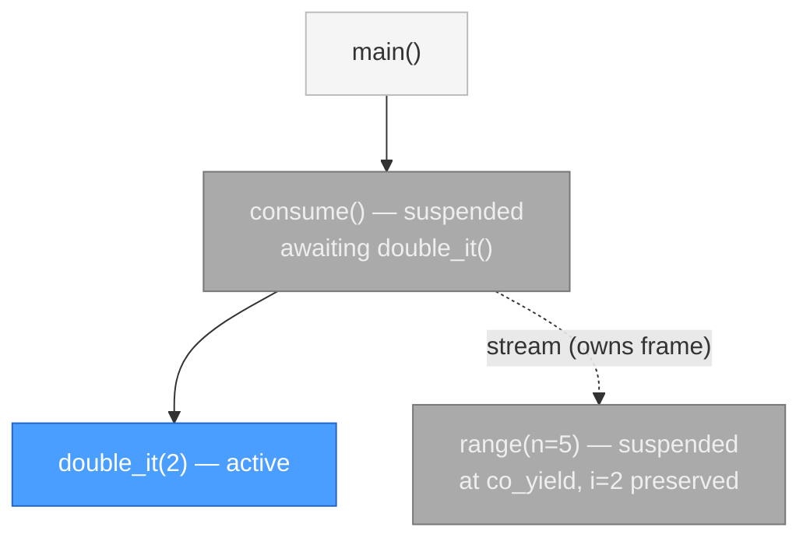
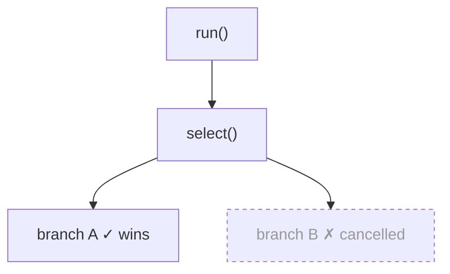
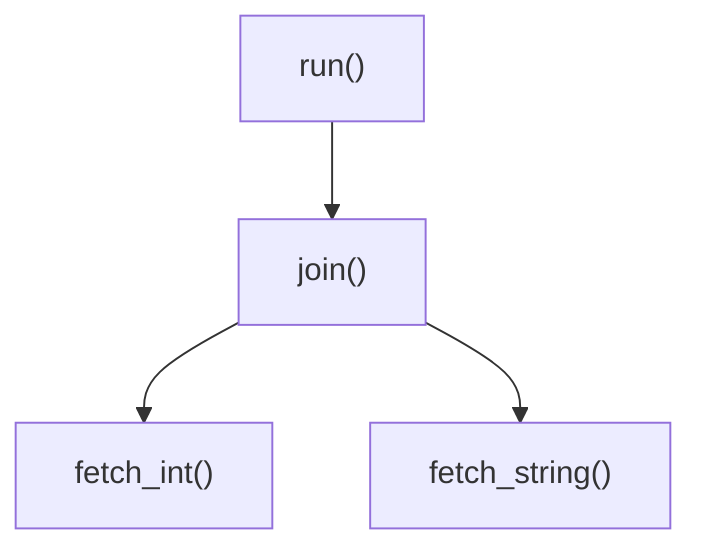
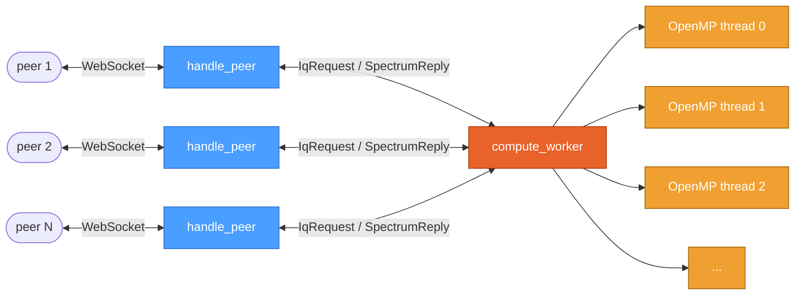

# Getting Started

This guide walks you through the core concepts of the library by building a TCP echo server
from the ground up. Each section introduces a feature as the server needs it — so you always
have a concrete reason for every abstraction you encounter. Sections 1–13 introduce all the
features; sections 14 and 15 are complete, self-contained examples that bring them together.

The route, in the order the server runs into each problem:

- **Sections 1–5: one client.** What a coroutine is, `co_await`, async I/O and the runtime
  that drives it all. (Section 3, generators, is a short side trip the server does not use.)
- **Sections 6–9: many clients.** One task per connection, what happens to a task that is
  cancelled and the lifetime rules that follow from it, a `JoinSet` to hold any number of
  tasks, and cleanup that runs however a session ends.
- **Section 10: doing two things at once inside one task.** Accepting new clients while
  collecting finished sessions, and evicting a client that has stalled.
- **Section 11: tasks working together.** Passing data between tasks through channels
  instead of sharing it.
- **Sections 12–13: living in a real process.** Shutting down cleanly on Ctrl-C, and
  running blocking code without stalling everything else.
- **Sections 14–15: complete programs.** The finished echo server and client, then a
  second example that feeds a CPU-bound compute loop.

Boxes titled "Deep dive" are folded and can be skipped on a first read; the guide reads
correctly without them. The boxes that are open are the ones not to skip.

## Setup

coro is built, packaged and consumed with [Conan](https://conan.io) and CMake.

| | Supported and tested | Not supported today |
|---|---|---|
| Platform and compiler | GCC on Linux; Raspberry Pi Pico (RP2040), bare metal | Windows / MSVC — the I/O driver is built on `epoll`, so it is known not to work |
| C++ standard | C++23 | C++20 should be possible with compatibility adapters for the few C++23 library types the API uses, such as `std::expected`, but is not regularly tested |
| Build | Conan | Plain CMake with the dependencies installed by hand. The CMake files are kept free of Conan specifics so this may be supported later, but it has never been confirmed to work |

### Using coro in your project

Add coro as a requirement in your project's `conanfile.py`:

```python
def requirements(self):
    self.requires("coro/[0.1.0]")
```

then find the package and link its target in your `CMakeLists.txt`:

```cmake
find_package(coro CONFIG REQUIRED)

add_executable(my_server main.cpp)
target_link_libraries(my_server PRIVATE coro::coro)
```

Conan has to be able to find the coro package. From a checkout of this repository,
`conan create .` builds it and places it in your local Conan cache;
[Versioning](versioning.md) covers version numbers and the alternative of pointing
Conan at a live checkout with `conan editable add`.

[examples/io](../examples/io) is a complete consumer project laid out exactly this way —
its own `conanfile.py` and `CMakeLists.txt`, building the echo server and client that
this guide develops. It is the quickest starting point to copy from. The Pico port is
consumed the same way but links different targets; see
[the Pico port design notes](design/pico_port.md).

### Building coro itself

The rest of this section is only needed if you are building the library from source, for
example to run its tests or work on it.

```bash
conan install . --build=missing -s:h build_type=Release
cmake --preset conan-release
cd build/Release && make
```

**`--build=missing`** (shorthand: `-b=missing`) — optional. Instructs Conan to build any
dependency that does not have a pre-built binary available, rather than exiting with an
error.

**`-s:h build_type=Release`** — optional. Selects the build type. Valid values are
`Release`, `Debug`, and `RelWithDebInfo`. Defaults to `Release` if omitted. The CMake
preset and build directory must match:

| Build type | CMake preset | Build directory |
|---|---|---|
| `Release` | `conan-release` | `build/Release` |
| `Debug` | `conan-debug` | `build/Debug` |
| `RelWithDebInfo` | `conan-relwithdebinfo` | `build/RelWithDebInfo` |

Public headers — everything under `coro/detail/` is internal and should not be included
directly:

```cpp
// Core coroutine types
#include <coro/coro.h>                    // Coro<T> — async function return type
#include <coro/coro_stream.h>             // CoroStream<T> — async generator return type
#include <coro/future.h>                  // Future/Cancellable concepts, FutureRef, coro::ref(), coro::never()
#include <coro/stream.h>                  // Stream concept, coro::next()
#include <coro/co_invoke.h>               // co_invoke() — safe capturing-lambda coroutines
#include <coro/version.h>                 // CORO_VERSION (generated at build time)

// Runtime
#include <coro/runtime/runtime.h>         // Runtime, spawn(), build_task()
#include <coro/runtime/executor.h>        // Executor — abstract interface, taken by spawn_on()
#include <coro/runtime/work_stealing_executor.h>   // WorkStealingExecutor — multi-threaded default
#include <coro/runtime/work_sharing_executor.h>    // WorkSharingExecutor
#include <coro/runtime/current_thread_executor.h>  // CurrentThreadExecutor — single thread, MCU
#include <coro/runtime/clock.h>           // Clock, Instant — deadlines for sleep_until()/timeout_at()

// Tasks
#include <coro/task/join_handle.h>        // JoinHandle<T>
#include <coro/task/stream_handle.h>      // StreamHandle<T>
#include <coro/task/join_set.h>           // JoinSet<T>
#include <coro/task/spawn_builder.h>      // SpawnBuilder — returned by build_task()
#include <coro/task/spawn_blocking.h>     // spawn_blocking()
#include <coro/task/spawn_on.h>           // spawn_on(), with_context()
#include <coro/task/fiber.h>              // spawn_fiber(), fiber_yield(), FiberHandle<T>

// Sync primitives
#include <coro/sync/select.h>             // select()
#include <coro/sync/when.h>               // when() — conditional select() branch
#include <coro/sync/join.h>               // join()
#include <coro/sync/sleep.h>              // sleep_for(), sleep_until()
#include <coro/sync/timeout.h>            // timeout(), timeout_at()
#include <coro/sync/interval.h>           // IntervalTimer — drift-compensating periodic timer
#include <coro/sync/event.h>              // Event — single-waiter set/wait primitive
#include <coro/sync/mutex.h>              // Mutex<T> — async mutex

// Channels
#include <coro/sync/oneshot.h>            // oneshot_channel<T>
#include <coro/sync/mpsc.h>               // mpsc_channel<T>
#include <coro/sync/watch.h>              // watch_channel<T>
#include <coro/sync/broadcast.h>          // broadcast_channel<T>
#include <coro/sync/channel_error.h>      // ChannelError, TrySendError, BroadcastRecvError

// I/O
#include <coro/io/file.h>                 // File — async file I/O
#include <coro/io/tcp_stream.h>           // TcpStream — async TCP
#include <coro/io/tcp_listener.h>         // TcpListener — TCP accept loop
#include <coro/io/udp_socket.h>           // UdpSocket — async UDP
#include <coro/io/pipe.h>                 // Pipe — async named pipe (FIFO)
#include <coro/io/lookup_host.h>          // lookup_host() — async DNS
#include <coro/io/socket_address.h>       // SocketAddress, Ipv4Address, Ipv6Address
#include <coro/io/ws_stream.h>            // WsStream — async WebSocket client
#include <coro/io/ws_listener.h>          // WsListener — WebSocket server
#include <coro/io/signal.h>               // signal(), signal_stream() — OS signal delivery
#include <coro/io/byte_buffer.h>          // ByteBuffer — concept for buffers passed to read/write

// Framing — decoding a byte stream into messages
#include <coro/io/decoder_stream.h>       // DecoderStream<T> — coroutine return type for decoders
#include <coro/io/byte_source.h>          // ByteSource — the byte supply a decoder awaits on
#include <coro/io/decoder_concept.h>      // Decoder, ZeroCopyDecoder concepts

// Microcontroller builds only
#include <coro/sync/isr_event.h>          // IsrEvent, IsrChannel<T>, IsrSemaphore — ISR-to-task signalling
#include <coro/pico/hal/gpio.h>           // GpioPin — async edge/level waits (Pico)
#include <coro/pico/hal/dma.h>            // AsyncDmaTransfer (Pico)
#include <coro/pico/mqtt.h>               // MqttClient (Pico, optional)
```

---

## 1. Your first coroutine

A coroutine is a function that can suspend and resume. Calling a coroutine function does
**not** start executing it — it constructs an idle object representing a value that will
be produced sometime in the future. Nothing in the body runs until something drives it;
the typical entry point is `Runtime::block_on()`.

We are going to build a TCP echo server. This is the skeleton we will build on through
the rest of this guide:

```cpp
#include <coro/coro.h>
#include <coro/runtime/runtime.h>
#include <cstdio>

coro::Coro<int> run_server() {
    std::printf("server starting\n");
    co_return 0;  // stub — we'll fill this in section by section
}

int main() {
    coro::Runtime rt;
    return rt.block_on(run_server());
}
```

`run_server` is a coroutine: its return type is `Coro<int>` and it contains `co_return 0`.
The `int` is the exit code — `block_on` drives the coroutine to completion and returns its
value to `main`. Calling `run_server()` **does not** print anything — it constructs and
returns an idle `Coro<int>` object. `block_on` takes that object and drives it to
completion, which is when the printf actually executes.

The compiler recognizes a coroutine by two things together: a coroutine return type
(`Coro<T>`, `CoroStream<T>`) *and* at least one `co_return`, `co_await`, or `co_yield`
in the body. The return type alone is not enough — a plain function that returns `Coro<T>`
without any `co_*` keywords is just a factory:

```cpp
// Coroutine — co_return triggers the compiler to generate suspend/resume machinery.
// The body does not execute until the returned Coro<int> is driven by an executor.
coro::Coro<int> run_server() {
    std::printf("server starting\n");
    co_return 0;
}

// Regular function — no co_* keywords, so not a coroutine.
// It calls run_server(), which constructs and returns an idle Coro<int> object,
// then returns that object to its caller. Nothing inside run_server() has run yet.
coro::Coro<int> make_server() {
    return run_server();
}
```

Because calling a coroutine just produces an object, you can store it, pass it around,
or name it before running it:

```cpp
int main() {
    coro::Runtime rt;

    coro::Coro<int> task = run_server();   // idle — nothing has run yet
    // task can be stored, passed to another function, etc.
    return rt.block_on(std::move(task));   // now it runs; returns the exit code
}
```

`block_on` is the simplest way to drive a coroutine from synchronous code — section 5
covers how the runtime and executor work in detail, and section 6 shows how to run
coroutines in parallel with `spawn()`.

---

## 2. Awaiting another coroutine

The server stub immediately returns. Let's give it a real first step: binding to a port.
This is also where `co_await` first appears.

```cpp
#include <coro/coro.h>
#include <coro/runtime/runtime.h>
#include <coro/io/tcp_listener.h>  // TcpListener — covered in full in section 4
#include <cstdio>

coro::Coro<int> run_server() {
    // Think of TcpListener::bind as a coroutine that returns a TcpListener once the
    // port is bound and ready to accept connections. I/O types are covered in section 4.
    coro::TcpListener listener = co_await coro::TcpListener::bind("127.0.0.1", 8080);
    std::printf("listening on 127.0.0.1:8080\n");
    co_return 0;  // we'll accept connections in section 4
}

int main() {
    coro::Runtime rt;
    return rt.block_on(run_server());
}
```

`co_await` suspends `run_server()` until the socket is bound, then resumes it with the
`TcpListener` unwrapped directly into `listener`. Crucially, suspending does **not** block
the OS thread — control returns to the executor, which is free to run other coroutines in
the meantime. The thread is never parked waiting; it is always doing useful work.

Recall from section 1 that calling a coroutine function produces an idle object — nothing
has run. `co_await` is how a running coroutine starts a child: the child begins executing
immediately on the current thread, and if it reaches a point where it needs to wait (I/O,
a channel, a sleep), *that* suspension propagates up and the executor picks up something
else. When the child eventually completes, the parent resumes with the result. In effect,
awaiting a coroutine is the async form of calling a function: the child's frame plays the
part of a stack frame, and the chain of coroutines awaiting one another plays the part of
the call stack.
`co_await` can only appear inside a coroutine; ordinary code such as `main` gets in
through `block_on`.

To see the mechanics with a simpler example:

```cpp
coro::Coro<int> fetch_value() {
    co_return 100;
}

coro::Coro<void> run() {
    // fetch_value() constructs the coroutine object.
    // co_await starts it running and suspends run() until it completes.
    // v receives the unwrapped int — not a future, not an optional, just the value.
    int v = co_await fetch_value();
    std::cout << v << "\n";  // 100
}
```

Errors need no new machinery either. An exception thrown inside a coroutine unwinds and
propagates exactly as it does through ordinary function calls: locals are destroyed in
reverse order, and the exception passes up through each `co_await` to the coroutine that
is awaiting, until a `catch` handles it. An exception nothing catches comes out of
`Runtime::block_on()` in `main`.

```cpp
coro::Coro<int> run_server() {
    try {
        coro::TcpListener listener = co_await coro::TcpListener::bind("127.0.0.1", 8080);
        std::printf("listening on 127.0.0.1:8080\n");
        co_return 0;
    } catch (const std::system_error& e) {  // for example, the port is already in use
        std::printf("bind failed: %s\n", e.what());
        co_return 1;
    }
}
```

??? info "`co_await` works on anything that implements the `coro::Future<T>` concept"
    `co_await` works on anything that produces a value asynchronously by implementing the `coro::Future<T>` concept — not just `Coro<T>`.
    As we go we will introduce many other primitives such as channel receives, I/O operations, timers,
    and combinators like `select` and `join` that are all awaitable the same way. These types satisfy
    the [`Future` concept](design/future_and_stream.md), which the reference docs cover in detail, but you rarely
    need to think about it directly.

---

## 3. Async generators

The echo server won't use async generators, but `co_yield` is the third coroutine keyword
and follows naturally from the other two. It's worth understanding as a related concept.

`CoroStream<T>` introduces `co_yield`: where `co_return` produces a single value and exits,
`co_yield` emits a value and suspends — the generator resumes from the next `co_yield` when
the consumer asks for another item. Consume it with `co_await coro::next(stream)` in a
loop; `next()` returns `std::nullopt` when the generator is exhausted.

```cpp
#include <coro/coro_stream.h>
#include <coro/stream.h>
#include <coro/coro.h>
#include <coro/runtime/runtime.h>
#include <iostream>

coro::CoroStream<int> range(int n) {
    for (int i = 0; i < n; ++i)
        co_yield i;
}

coro::Coro<int> double_it(int x) { co_return x * 2; }

coro::Coro<void> consume() {
    auto stream = range(5);
    while (auto item = co_await coro::next(stream)) {
        int result = co_await double_it(*item);  // range stays suspended while this runs
        std::cout << result << " ";              // 0 2 4 6 8
    }
}

int main() {
    coro::Runtime rt;
    rt.block_on(consume());
}
```

At the moment `double_it` is executing, three coroutine frames exist simultaneously:


```mermaid
graph TD
    main["main()"]
    consume["consume() — suspended\nawaiting double_it()"]
    range["range(n=5) — suspended\nat co_yield, i=2 preserved"]
    dbl["double_it(2) — active"]

    main --> consume
    consume --> dbl
    consume -. "stream (owns frame)" .-> range

    style main fill:#f5f5f5,stroke:#bbb,color:#333
    style consume fill:#aaa,stroke:#777,color:#eee
    style range fill:#aaa,stroke:#777,color:#eee
    style dbl fill:#4a9eff,stroke:#2266cc,color:#fff
```

In synchronous code this would be impossible: `double_it`'s stack frame would occupy the
same memory that `range`'s frame previously used, overwriting it. Since `range` co_yielded
rather than returned, its frame is still live — it can't be overwritten. Each coroutine
frame is heap-allocated at its own independent address, so `double_it` and `range` coexist
without conflict, and `consume` can re-enter `range` as soon as `double_it` returns.

A generator can also `co_await` futures internally, suspending the stream until the
awaited future resolves. The `next()` pattern also appears with `JoinSet` and `mpsc`
channels later in this guide — any type satisfying `Stream<T>` is consumed the same way.

---

## 4. Async I/O

In section 2 we co_awaited `TcpListener::bind()` to get a listening socket. Now we add
`listener.accept()` — which suspends until a client connects and returns a `TcpStream`,
the read/write handle for that client — and an echo loop to send their data back.

`TcpStream::read()` and `TcpStream::write()` suspend the coroutine rather than blocking
the thread, freeing the executor to run other tasks in the meantime. When the operation
completes, `run_server` resumes on the next line — exactly as if the call had blocked.
Both `read` and `write` use owned buffers: the buffer is moved into the operation and returned with the
result, tying its lifetime to the coroutine frame and making dangling-pointer bugs
impossible at the type-system level.

```cpp
#include <coro/coro.h>
#include <coro/runtime/runtime.h>
#include <coro/io/tcp_listener.h>
#include <coro/io/tcp_stream.h>
#include <cstdio>
#include <string>

coro::Coro<int> run_server() {
    coro::TcpListener listener = co_await coro::TcpListener::bind("127.0.0.1", 8080);
    std::printf("listening on 127.0.0.1:8080\n");

    coro::TcpStream stream = co_await listener.accept();
    std::printf("client connected\n");
    for (;;) {
        auto [n, buf] = co_await stream.read(std::string(4096, '\0'));
        if (n == 0) {
            std::printf("EOF\n");
            co_return 0;
        }
        buf.resize(n);
        co_await stream.write(std::move(buf));
    }
}

int main() {
    coro::Runtime rt;
    return rt.block_on(run_server());
}
```

Follow the buffer through the loop. `read` takes it by value: `std::string(4096, '\0')`
is a 4096-byte buffer moved into the operation, which owns it for as long as the read is
in progress. When the read completes, the buffer comes back alongside `n`, the number of
bytes actually received. The string is still 4096 bytes long, so `buf.resize(n)` trims it
to the data before it is moved into `write` the same way.

I/O failures are reported as exceptions: a failed `bind`, `accept`, `read` or `write`
throws `std::system_error` carrying the operating system's error code. A client closing
its connection is not a failure — `read` returns `n == 0`, which is what ends the loop
above.

The server as is handles only one connection before it exits — section 6 extends it to handle many concurrently.

To test it, a client connects with `TcpStream::connect` — the same read/write interface from the other end:

```cpp
coro::Coro<void> run_client() {
    coro::TcpStream stream = co_await coro::TcpStream::connect("127.0.0.1", 8080);
    co_await stream.write(std::string("hello"));
    auto [n, reply] = co_await stream.read(std::string(4096, '\0'));
    reply.resize(n);
    std::printf("received: %.*s\n", (int)n, reply.c_str());
}
```

The library provides several other I/O types that follow the same suspend-not-block pattern.

### File — async file I/O

`File` provides async read and write on the local filesystem. The interface is the same
owned-buffer pattern as `TcpStream` — open, read, write, and the coroutine suspends
rather than blocking while the operation runs.

Disks have no readiness to wait on, so each operation runs as one job on the Runtime's
blocking pool (as `tokio::fs` does). A write is complete when its `co_await` returns; call
`sync_all()` when it must also be on the device.

```cpp
#include <coro/io/file.h>

coro::Coro<void> run() {
    auto f = co_await coro::File::open("data.txt", coro::FileMode::Read);
    auto [n, buf] = co_await f.read(std::vector<std::byte>(4096));
    buf.resize(n);

    auto out = co_await coro::File::open(
        "output.txt", coro::FileMode::Write | coro::FileMode::Create | coro::FileMode::Truncate);
    co_await out.write(std::move(buf));
}
```

### lookup_host — DNS

`TcpStream::connect`, `TcpListener::bind` and `UdpSocket::bind` accept a hostname as well as
a numeric address, and try each address it resolves to. To resolve without connecting:

```cpp
#include <coro/io/lookup_host.h>

std::vector<coro::SocketAddress> addrs = co_await coro::lookup_host("example.com", 443);
```

Resolution runs `getaddrinfo` on the blocking pool. A failure throws `std::system_error`
in `coro::dns_error_category()`.

### WsStream / WsListener — WebSocket

`WsStream` and `WsListener` are the WebSocket equivalents of `TcpStream` and `TcpListener`.
`WsStream::connect()` handles the handshake and returns a stream with `send()` and
`receive()` methods; `WsListener::bind(host, port)` starts a server, and each
`co_await listener.accept()` hands out a `WsStream` for the next client. `receive()`
throws once the connection has closed, so a per-client loop ends by exception rather
than by a sentinel value.

```cpp
#include <coro/io/ws_stream.h>

coro::Coro<void> run() {
    coro::WsStream ws = co_await coro::WsStream::connect("ws://localhost:9001/");
    co_await ws.send("hello");
    coro::WsStream::Message reply = co_await ws.receive();
    std::cout << reply.as_text() << "\n";  // "hello"
}
```

---

## 5. The Runtime and Executor

We've been creating a `Runtime` and calling `block_on()` without much explanation. Now
that the server can accept connections, here's what's been driving it. The `Runtime` owns
a configurable **executor** — the component that schedules and runs coroutine tasks.

`Runtime::block_on()` is the bridge between synchronous and async code. It takes a
single root coroutine, drives it to completion on the executor, and returns its result
to the caller. The root coroutine plays the part `main` plays in an ordinary program: it
is the bottom of the call chain, and the run ends when it returns. Everything else — spawning tasks, awaiting I/O, sleeping — happens from
inside that root coroutine.

```cpp
int main() {
    coro::Runtime rt;
    return rt.block_on(run_server());  // blocks until run_server() completes
}
```

### Choosing an executor

The executor determines how tasks are scheduled across threads. Three are available:

| Executor | Task threads | I/O | Use case |
|---|---|---|---|
| `WorkStealingExecutor` | N (default: `hardware_concurrency()`) | Handled by whichever worker thread is idle | Production default — tasks distributed across threads automatically |
| `WorkSharingExecutor` | N | Handled by whichever worker thread is idle | Rarely needed — see below |
| `CurrentThreadExecutor` | 1 (caller's thread) | Polled on the same thread: the executor waits in the I/O driver when idle | Deterministic, unsynchronized task ordering; tests; MCU/no-RTOS targets; nested `Runtime`s |

The `Runtime` constructor selects the executor based on the thread count argument:

```cpp
coro::Runtime rt;       // WorkStealingExecutor, hardware_concurrency() threads
coro::Runtime rt(4);    // WorkStealingExecutor, 4 threads
coro::Runtime rt(1);    // CurrentThreadExecutor
```

For explicit control over executor type, use `std::in_place_type`:

```cpp
#include <coro/runtime/work_stealing_executor.h>
#include <coro/runtime/work_sharing_executor.h>
#include <coro/runtime/current_thread_executor.h>

coro::Runtime rt(std::in_place_type<coro::WorkStealingExecutor>, 4);
coro::Runtime rt(std::in_place_type<coro::WorkSharingExecutor>, 4);
coro::Runtime rt(std::in_place_type<coro::CurrentThreadExecutor>);
```

If in doubt, use the default. The details of each executor are below for when you need
to choose.

??? note "Deep dive: how the three executors differ"
    - **Work-stealing** is the right default for most applications. Tasks are distributed
    across worker threads; when a thread exhausts its local queue it steals tasks from
    other threads, keeping all cores busy without manual load balancing.
    - **Work-sharing** predates work-stealing in this library and exists because it was
    simpler to implement initially. It uses a single global FIFO queue protected by a mutex, which
    becomes a contention bottleneck under any significant task load. It is occasionally
    useful when debugging to help isolate whether a bug is specific to the work-stealing
    scheduler, but work-stealing should be preferred in virtually every other situation.
    Only reach for this if you understand the trade-offs and have a concrete reason to.
    - **Current-thread** is ideal for tests and deterministic environments. All coroutines
    run on the one calling thread — no synchronization is needed for shared state between
    coroutines, and execution order is reproducible. When no task is ready, the thread waits
    in the I/O driver (epoll on Linux) until a socket becomes ready, a timer expires, or
    another thread wakes a task, so an idle runtime uses no CPU. It never creates task
    threads of its own, which also makes it the right choice for a nested `Runtime` (e.g.
    inside `spawn_blocking`) and the only executor on MCU targets, where it busy-polls the
    network stack instead of blocking. `Runtime(1)` selects it.

The server code itself is unchanged regardless of which executor you use — the runtime
is a pure deployment knob. Because the choice is just a constructor argument, it can
even be a runtime decision based on a command-line flag:

```cpp
int main(int argc, char* argv[]) {
    bool single = argc > 1 && std::string_view(argv[1]) == "--single-threaded";

    if (single) {
        coro::Runtime rt(std::in_place_type<coro::CurrentThreadExecutor>);
        return rt.block_on(run_server());
    } else {
        coro::Runtime rt(std::in_place_type<coro::WorkStealingExecutor>);
        return rt.block_on(run_server());
    }
}
```

`run_server()` is called identically in both branches — nothing inside it changes.

---

## 6. Spawning parallel tasks

The server in section 4 accepts one connection, handles it, and exits. We could wrap the
echo loop in an outer `for` loop to keep accepting, but connections would then be handled
sequentially — the next `accept()` only runs after the current client disconnects. What we
need is for each connection to run in parallel: a separate instance of the echo loop per
client, all active at the same time. That means moving the echo loop into its own coroutine
that can be instantiated once per connection:

```cpp
static coro::Coro<void> handle_connection(coro::TcpStream stream, int id) {
    std::printf("[%d] connected\n", id);
    for (;;) {
        auto [n, buf] = co_await stream.read(std::string(4096, '\0'));
        if (n == 0) {
            std::printf("[%d] EOF\n", id);
            co_return;
        }
        buf.resize(n);
        co_await stream.write(std::move(buf));
    }
}
```

`handle_connection` takes `TcpStream` by value — the stream is moved into the task's
frame so each connection owns its socket independently, with no shared state between them.

To launch a separate instance of `handle_connection` per connection we use `coro::spawn()`,
which schedules a coroutine as an independent parallel **task**. `spawn()` returns a
`JoinHandle` that can be `co_await`ed just like any other coroutine to retrieve the result
or wait for completion.

```cpp
coro::Coro<int> run_server() {
    coro::TcpListener listener = co_await coro::TcpListener::bind("127.0.0.1", 8080);
    std::printf("listening on 127.0.0.1:8080\n");

    constexpr int max_connections = 5;  // fixed limit just to demonstrate joining
    std::vector<coro::JoinHandle<void>> handles;
    for (int i = 0; i < max_connections; ++i) {
        coro::TcpStream stream = co_await listener.accept();
        handles.push_back(coro::spawn(handle_connection(std::move(stream), i)));
    }

    for (auto& h : handles)
        co_await h;

    co_return 0;
}
```

Connect two clients — for example `nc 127.0.0.1 8080` in two terminals — and close the
second one first:

```
listening on 127.0.0.1:8080
[0] connected
[1] connected
[1] EOF
[0] EOF
```

Client 1 was accepted, served and finished while client 0 was still connected: both
sessions were in progress at once, each advancing whenever its own socket had data.

To demonstrate joining here, the server accepts a fixed number of connections and runs them
all in parallel while we wait in the accept loop. Each `co_await h` waits for that session to
finish and join before the server exits. The limitation is that a `JoinHandle` is awaited
one at a time, so we have to pick an order: we wait for sessions in spawn order rather than
completion order, and a client that disconnects first still waits behind a slower one.
Section 8 covers how to wait for whichever session finishes next.

### A task is like a thread

The mental model for a task, here and for the rest of the guide, is an OS thread. Section 2
compared a coroutine to a stack frame and `co_await` to a function call; a task is the
whole stack. A thread takes a function as its entry point, and everything that function
calls runs on that thread, one call at a time. A task takes a coroutine as its entry point,
and everything that coroutine awaits runs in that task, one coroutine at a time. `spawn()`
does for tasks what constructing a `std::thread` does for threads: it starts a second,
independent stack. Until now the whole program has been a single task, the one
`block_on()` started.

Two properties carry over from threads unchanged, and between them they settle most
questions of thread safety:

- **Within one task, nothing overlaps.** Like the function calls on one thread's stack,
  the coroutines of a single task run one at a time, so code in the same task never races
  with itself.
- **Different tasks can run at the same instant.** Anything two tasks both touch needs the
  same protection it would need between two threads. Our server sidesteps the question by
  giving each task its own `TcpStream`; section 11 shows how to pass data between tasks
  without sharing it.

The analogy also extends one level down. Threads run on CPU cores, placed there by the OS
scheduler; tasks run on the executor's worker threads, placed there by the executor. A
worker thread is to a task what a core is to a thread. `spawn()` creates no thread, any
more than starting a thread adds a core, so the thread count does not limit the number of
tasks. `CurrentThreadExecutor` is a single-core machine: it can run thousands of tasks,
but never two at the same instant, so no data race between them is possible. They still
interleave at every `co_await`, though, so state shared between tasks can change while one
of them is suspended.

The analogy is a starting point, and it breaks down in three places:

- **Tasks are scheduled cooperatively, not preemptively.** The OS can take a core away
  from a thread at any moment, so a thread that blocks holds up only itself. Nothing can
  take a worker thread away from a task: it keeps the thread until it suspends at a
  `co_await`. A task that blocks therefore holds up its worker thread and every other task
  that thread would have run. Section 13 covers work that has no choice but to block.
- **A task can tell when it has moved.** A thread runs on one core at a time and may be on
  a different one after a context switch; a task runs on one worker thread at a time and
  may be on a different one after any `co_await`. The OS carries everything a thread owns
  from core to core, so the thread never notices. Nothing carries per-thread state from
  one worker thread to the next, because that state belongs to the worker thread and not
  to the task. So do not rely on thread identity across a suspension: a `thread_local`
  variable or `std::this_thread::get_id()` may give a different answer before and after,
  and a `std::mutex` locked before a `co_await` may end up unlocked from another thread,
  which is undefined behaviour.
- **A task can be a tree, not only a stack.** A function can call only one function at a
  time. A coroutine can await several at once with the combinators of section 10, so one
  task can keep several branches in progress, which no thread's stack can do. Even then
  the branches take turns: still only one coroutine of the task runs at any instant.

Code that respects these points runs correctly on any executor, which is what keeps the
executor a deployment choice (section 5).

??? info "Deep dive: what a task costs compared with a thread"
    `std::thread` requires a kernel stack (8 MiB by default on Linux) and an OS scheduler
    registration — a round-trip into the kernel. A task allocates only a coroutine frame
    (typically a few hundred bytes) and a small scheduler entry, with no system call. The
    work-stealing executor is designed to support hundreds of thousands of concurrent
    tasks, in the same ballpark as Tokio, on which the scheduler is modelled.

### Exceptions stop at the task boundary

The analogy holds for errors as well: a task is an exception boundary, as a thread is. An
exception that escapes `handle_connection` cannot unwind into `run_server` at the moment
it is thrown, because the two are running independently, each on its own stack. It is
stored in the task and rethrown from `co_await h`, the point where the task's result is
collected, and from there it propagates like any other exception.

!!! warning "Dropping a handle discards the result — value or exception alike"
    A `JoinHandle` is the only way to retrieve a task's result. If it is *dropped* —
    destroyed without being awaited, for example by going out of scope — or detached,
    whatever the task produces is discarded, and that includes an exception: it is not
    rethrown anywhere and nothing is logged. This is the same rule as `std::future`, where
    an exception stored by `std::async` is lost if `get()` is never called. Await the
    handle — or use a `JoinSet` (section 8) — for any task whose failure you need to hear
    about.

Every handle so far has been awaited. What happens to a task whose handle is *not* awaited
is the subject of the next section; section 8 then returns to the server.

---

## 7. Cancellation and the coroutine scope

Section 6 awaited every `JoinHandle` it created. This section is about the handles that
are not awaited — dropped at the end of a scope, by an early return, or by an exception.
It takes four questions in turn: what happens to such a task, what a cancelled task still
gets to do, who exactly does the cancelling and the waiting, and what all of that means
for data the task refers to.

!!! warning "Key takeaways"
    The behaviour described here is deliberate and the rules are few, but they may not be
    obvious to first time users and getting them wrong can lead to subtle bugs. It is
    worth reading this section in full before writing code that spawns tasks, but if you
    do decide to skip ahead for now at minimum keep these points in mind:

    - **Dropping a `JoinHandle` cancels its task.** A cancelled task runs none of your code
      again — not even a `catch` block. It stops at the `co_await` it is suspended on and
      only its destructors run, in order, so every resource must be released by a
      destructor (RAII).
    - **No dangling tasks.** A coroutine that drops a handle is not seen to finish until
      that task has finished too. `co_await parent()` returns only once everything
      `parent` spawned is gone.
    - **Two opt-outs, both explicit:**
        - `handle.cancelOnDestroy(false)` — no cancel signal; the parent waits for the task
          to finish naturally. Use this when a task needs to keep running during error
          cleanup — for example, a collector that must finish draining a channel even after
          sibling tasks have been cancelled.
        - `handle.detach()` — fire and forget; the parent never waits and the result is
          lost.
    - **Reference hazard:** never give a spawned task a pointer or reference — including
      an implicit `this` — to a local of the coroutine that holds its `JoinHandle`. The
      parent does wait for the task, but only *after* its own locals have been destroyed.
      Have the task own its data, or spawn it from an inner `co_invoke` coroutine (shown
      below).
    - **Wrap every capturing lambda coroutine in `co_invoke`.** Called directly, its
      captures dangle before the coroutine first runs — even captures by value.

### Cancellation

The server so far awaits every handle before it returns. Suppose instead that `run_server`
ends early — an error, or an operator shutting it down — while sessions are still in
progress. Something has to happen to those tasks. Left to themselves they would carry on
with nobody able to reach them, and possibly outlive the things they depend on.

coro's answer is that a coroutine takes its tasks with it. **When a coroutine ends, every
task it spawned and has not awaited is cancelled, and the coroutine waits for those tasks
to finish cleaning up before its own result becomes visible.** The rule applies
recursively at every level: a cancelled task cancels and waits for the tasks *it* spawned
as it unwinds, so stopping the coroutine at the top takes down everything beneath it,
innermost first, and there are never dangling tasks.

Here is the rule at work. `run_server` spawns one session and returns after a second,
while the session is still waiting on a read that would take ten:

```cpp
std::atomic_bool handler_frame_destroyed = false;

coro::Coro<void> handle_connection() {
    // This local's destructor (④) fires when handle_connection's frame is cleaned up —
    // whether it completed normally or was cancelled.
    struct OnDestroy { ~OnDestroy() { handler_frame_destroyed.store(true); } } probe;

    // ② handle_connection suspends here waiting for client data.
    co_await coro::sleep_for(10s);  // stands in for a long-running read
    std::cout << "data received\n";  // never executes — cancelled at ②
}

coro::Coro<void> run_server() {
    // ① handle_connection is spawned and immediately starts executing, reaching ②.
    auto handle = coro::spawn(handle_connection());

    co_await coro::sleep_for(1s);  // server shuts down after 1s for this example
    co_return;
    // ③ handle goes out of scope — cancellation signal sent to handle_connection, interrupting ②.
    // ④ drain: handle_connection's frame is destroyed; ~OnDestroy fires.
    // ⑤ run_server() waits to notify parent until after ④ and handle_connection exits.
}

coro::Coro<void> parent() {
    co_await run_server();
    // ⑥ resumes after ~1s, not ~10s — handle_connection was cancelled before it completed.
    assert(handler_frame_destroyed.load());  // drain rules guarantee ④ fired before ⑥
}
```

Follow the numbers. `run_server` returns at ③ without ever awaiting `handle`, so
`handle_connection` is cancelled where it is suspended, at ②. Its frame is destroyed (④),
and only then does `run_server`'s completion reach `parent` (⑤, ⑥). `parent` resumes after
about one second, not ten, and by then nothing of `handle_connection` is left.

### A cancelled task runs only its destructors

Look at what `handle_connection` got to do once it was cancelled: the destructor of `probe`
ran, and the `std::cout` line did not. That is everything cancellation allows.

Cleaning up a cancelled task is called **draining**. A task that is actively running when
it is cancelled continues to its next suspension point; a task that is already suspended
stays where it is. Either way it is never resumed again. From that point **none of the
user's coroutine code ever runs again** — no `co_await` expression resumes, no code after
a suspension point executes; only destructors run. Draining walks the task's call tree and
runs each frame's destructors in order, suspending wherever a frame has to wait for child
tasks of its own, until every frame in the tree has been cleaned up. Locals are therefore
always destroyed in order and at the right time, even when the destruction path itself
involves asynchronous steps.

"No user code runs again" is stricter than it first sounds. In ordinary code it is common
to pair a manual release with a `try`/`catch`, so that every way out of the function
releases the resource:

```cpp
coro::Coro<void> handle_connection(coro::TcpStream stream) {
    char* scratch = static_cast<char*>(std::malloc(4096));
    try {
        co_await serve(stream, scratch);  // any coroutine that suspends
    } catch (...) {
        std::free(scratch);  // error path
        throw;
    }
    std::free(scratch);      // normal path
}
```

In a function those are the only two ways out. A coroutine has a third: it is cancelled
while suspended at the `co_await` and simply never resumes. Cancellation is not an
exception, so the `catch` does not run, and neither does the line after it. `scratch` is
leaked.

Destructors are the one thing that does run on all three paths, which makes RAII the only
safe way to manage a resource in a coroutine:

```cpp
coro::Coro<void> handle_connection(coro::TcpStream stream) {
    auto scratch = std::make_unique<char[]>(4096);
    co_await serve(stream, scratch.get());
}   // freed on normal return, on an exception, and on cancellation
```

The same goes for anything else a `catch` or a trailing statement would normally undo:
unlocking, closing, decrementing a counter, sending a final message. Put it in a
destructor. Section 9 shows how to do that when the cleanup itself needs to `co_await`.

### The `JoinHandle` decides who cancels and who waits

Up to here this section has spoken of a coroutine cancelling and waiting for "the tasks it
spawned". That was deliberately loose, to get the behaviour across first, and in most code
it is also what happens. Strictly, though, `spawn()` creates no relationship at all between
`run_server` and `handle_connection`. What makes one the child of the other is the
`JoinHandle` — more precisely, where the handle is destroyed.

It is the destructor because that is the moment the task would otherwise be left dangling.
While the handle exists, someone can still await the task or cancel it. Once the handle is
gone, nobody can do either, so that is the point at which the library has to step in. It
does two separate things. Go back to step ③ of the example, where `handle` is destroyed:

- **The task is sent a cancellation signal.** This is why `handle_connection` is
  interrupted at ② instead of running its `sleep_for(10s)` to completion.
- **The coroutine that dropped the handle takes on the job of waiting for the task.**
  This is why `run_server` does not report its own result to `parent` until the task is
  gone (⑤).

In thread terms this is a `std::jthread`, whose destructor requests a stop and then joins.
There are two differences. A thread has to check for the stop request and may ignore it,
while a task is stopped at its next suspension point whether it checks or not. And
`~jthread()` blocks until the join is done, whereas `~JoinHandle()` returns at once and
leaves the waiting to the coroutine that dropped it — a detail that looks minor here and
turns out to be the source of the hazard below.

Each of the two effects can be switched off. `cancelOnDestroy(false)` removes the signal
and keeps the wait: the child runs on normally and the parent waits for it to finish.
`detach()` removes both: the child keeps running on its own and the parent returns without
waiting for it.

```cpp
coro::Coro<void> parent() {
    coro::spawn(child()).cancelOnDestroy(false); // no cancel — parent waits for child to finish normally

    coro::spawn(child()).detach();               // fire and forget — parent never waits for child

    co_return;
}
```

Cancel-on-drop is the default because, for coroutines, cancelling is always safe, and it
is the fail-safe outcome when a handle is dropped by accident — an unexpected exception,
say. The two alternatives are opt-in and cannot happen by mistake.

??? note "Deep dive: why cancel-on-drop is the default"
    Cancel-on-drop being the default, rather than `detach()` or `cancelOnDestroy(false)`, is a
    deliberate design choice. `std::async` and
    `std::jthread` block in their destructors — they wait for the thread to finish. That
    behaviour is safe for threads because there is no reliable way to cancel an arbitrary
    running thread: a thread may be blocked in a syscall, spinning in a tight loop, or holding
    a lock, and forcibly killing it leaves resources in an undefined state. Blocking until it
    finishes naturally is the only safe option. `~JoinHandle()` does not have that option —
    it can neither block nor suspend, for the reasons given under the coroutine scope below.

    Coroutines do not need it. Structured cancellation always unwinds cleanly: the
    cancellation signal is delivered at the next `co_await` point, every destructor runs in
    order, and child tasks are recursively drained before the parent completes. Cancellation is
    always safe, so it can be the default.

    Making it the default is also the fail-safe choice. If an exception propagates unexpectedly
    and destroys a `JoinHandle` before it is awaited — a situation that is easy to stumble into
    — cancel-on-drop ensures the spawned task is stopped and drained immediately rather than
    silently continuing to run, racing against now-destroyed state, or causing a deadlock when
    the runtime tries to shut down. The non-cancelling behaviours (`detach()` and
    `cancelOnDestroy(false)`) are available but intentionally opt-in: both require an explicit call and
    cannot happen by accident.

Because the relationship lives in the handle, it travels with the handle. A `JoinHandle`
is an ordinary movable object, so the parent need not be the coroutine that called
`spawn()`. Pass the handle to another coroutine or return it to the caller, and whichever
coroutine finally destroys it is the one that cancels the task and waits for it.

So the place a task is started and the place it is cancelled and waited for are two
different points in the program, sometimes far apart, sometimes only a few lines. Anything
the task holds a reference to has to stay alive across that whole gap, and the rest of
this section is about what that takes.

### The coroutine scope and the reference hazard

Of the two things a dropped handle does, the wait is the one that matters for references,
and it has a name: the **coroutine scope**. Every `Coro` has one. It keeps track of the
handles dropped while the coroutine ran, and joins all of those tasks before the
coroutine's result can be observed.

That makes it tempting to hand a task a pointer to one of the spawning coroutine's locals.
After all, the spawner waits for the task:

```cpp
coro::Coro<void> worker(int* ptr) {
    co_await coro::sleep_for(10ms);
    std::printf("%d\n", *ptr);
}

coro::Coro<void> spawner() {
    int local_data = 42;
    coro::JoinHandle<void> h = coro::spawn(worker(&local_data))
        .cancelOnDestroy(false);  // let worker run to completion
    co_return;
}
```

This is a use-after-free. `spawner` does wait for `worker`, but too late.

This is the second `std::jthread` difference coming due: the wait cannot happen inside
`~JoinHandle()`. A thread's destructor closes the gap by blocking until the child is done,
but blocking here would stall the executor thread, and a destructor cannot `co_await`
because destructors in C++ cannot be coroutines. So `~JoinHandle()` only
registers the task with the scope, and the wait is deferred to the next point where
`spawner` is able to suspend: after its body has finished and its locals have been
destroyed.

`h` and `local_data` are locals of the same frame, so they are destroyed together. By the
time `spawner` starts waiting for `worker`, `local_data` is already gone. Keeping the frame
alive a little longer does not help either: it is the destruction of `h` that registers the
wait, so the locals have to be destroyed before `spawner` knows there is anything to wait
for.

C++ has no borrow checker to reject a spawn that takes a reference to a local, so this is
a pattern you have to recognise and avoid:

!!! danger "CORE RULE: Data a spawned task refers to must never live in the same frame as the `JoinHandle` for that task"
    Put the data in an outer frame and the handle in an inner one. The inner coroutine
    drops the handle and waits for the task as it finishes, and the outer frame — with the
    data in it — is alive the whole time. Better still, have the task own its data, so
    there is no reference to go stale. See
    [CS.1–CS.4 in the guidelines](guidelines.md#coroutine-scope) for all the safe patterns.

```cpp
coro::Coro<void> awaiter() {
    int local_data = 42;  // lives in awaiter: the outer frame

    co_await co_invoke([&]() -> coro::Coro<void> {
        coro::JoinHandle<void> h = coro::spawn(worker(&local_data))  // h lives in the inner frame
            .cancelOnDestroy(false);
        co_return;
        // ~JoinHandle fires here. The inner coroutine waits for worker before it
        // completes, and local_data is untouched: it is not in this frame.
    });

    // resumes only after the inner coroutine completes, which is only after worker
    // completes — local_data was alive the entire time
    co_return;
    // local_data destroyed here, after worker is done
}
```

Returning from the inner coroutine is now the await point that separates the two events:
`h` is destroyed first, the wait for `worker` happens, and only when `awaiter` resumes and
finishes is `local_data` destroyed.

!!! note "`co_invoke` is the only safe way to use capturing lambda coroutines, even ones only capturing by value"
    `co_invoke` is the one safe exception to the [no-capturing-lambda-coroutine
    rule](guidelines.md#cs3-never-invoke-a-capturing-lambda-coroutine-directly-use-co_invoke).
    It heap-allocates the lambda and the coroutine together so that captured references
    remain valid across suspension points — which is exactly why `[&]` is safe here but
    would be undefined behaviour if the lambda were invoked directly.
    You will see `co_invoke` in most of the examples from here on;
    [the end of this section](#capturing-lambdas-and-co_invoke) explains the pitfall it
    avoids in full.

??? note "Deep dive: how the scope works, and why the library does not close this gap for you"
    Internally the scope is a `thread_local` variable in the executor's worker thread, set
    by every coroutine each time it is resumed and reset each time it suspends.
    `~JoinHandle()` uses it to register itself with the scope of whichever coroutine is
    currently executing on that thread. When a coroutine's body finishes, its locals are
    destroyed — which may register more `JoinHandle`s — and before returning its result the
    coroutine joins every handle registered during execution or during that destruction.
    Only then does it resume its awaiter.

    A cancelled coroutine follows the same order, except that its entire frame —
    parameters as well as locals — is destroyed before the join begins, so nothing in a
    coroutine's own frame can be relied on to outlive that join.

    It may be possible to devise some other way for `spawner` to detect that it needs to
    wait for `worker` before destroying its frame, or to use something like boost.context
    or libucontext to context switch from within `~JoinHandle()`, in effect implementing
    the await-in-a-destructor that standard C++ coroutines do not support. Every option
    explored comes with its own complications and drawbacks, so instead of solving the
    problem generally it is left as a pattern to recognise and avoid.

    See the [Coroutine Scope design document](design/coroutine_scope.md) for a full
    explanation of the implicit scope mechanism, its limits, and how it compares to Rust's
    `'static` bound.

#### Member functions pass `this`

The `worker` example passed its pointer in plain sight. C++ also has a very common way to
hand a task a reference without noticing: non-static member function coroutines. They take
`this` implicitly, and `this` carries the same hazard as any explicit pointer argument.

```cpp
struct Foo {
    static coro::Coro<void> static_bar(std::shared_ptr<Foo> self);
    coro::Coro<void> bar();
    // ...
};

coro::Coro<void> bad_spawner() {
    Foo foo;
    coro::JoinHandle<void> h = coro::spawn(foo.bar())  // bar() holds this → &foo
        .cancelOnDestroy(false);                       // let bar() run to completion
    co_return;
    // ① h destroyed (last declared, first destroyed) — bar() keeps running
    // ② foo destroyed (first declared, last destroyed)
    // ③ bad_spawner waits for bar() here, after ② — bar() runs the rest of its
    //    body with a `this` that points at nothing
}

coro::Coro<void> good_spawner1() {
    Foo foo;
    co_await co_invoke([&]() -> coro::Coro<void> {
        coro::JoinHandle<void> h = coro::spawn(foo.bar())
            .cancelOnDestroy(false);
        co_return;
    });
    co_return;
}

coro::Coro<void> good_spawner2() {
    auto foo = std::make_shared<Foo>();
    coro::JoinHandle<void> h = coro::spawn(Foo::static_bar(foo))
        .cancelOnDestroy(false);
    co_return;
}
```

`bad_spawner` is the `worker`/`local_data` case again, with `&foo` passed as `this`.
`good_spawner1` applies the core rule: `co_invoke` gives the spawn its own inner frame,
nested inside the frame that owns `foo`. `good_spawner2` avoids the reference altogether:
`foo` becomes a `std::shared_ptr<Foo>` passed by value into the static `static_bar`, so
the task owns its own copy and keeps the object alive for as long as it runs, even though
`good_spawner2` destroys its copy right away.

Awaiting a member coroutine directly — `co_await foo.bar()` — is always fine: the awaiting
coroutine is suspended, with `foo` alive, until `bar()` is done. The hazard is only in
spawning one.

### Capturing lambdas and `co_invoke`

Both inner-frame fixes above spawned from a lambda wrapped in `co_invoke`, and the wrapper
is not optional. A capturing lambda that returns `Coro<T>` has the member-function problem
in its sharpest form, and it has it even when nothing is spawned. The compiler lowers a
lambda to an anonymous struct whose `operator()` is a member function, so the coroutine
frame holds `this` — a pointer to the lambda object — and reaches every capture through
it. The captures are not copied into the frame. The lambda object is usually a
temporary, destroyed at the end of the full expression, before the coroutine has run at
all:

```cpp
// DANGEROUS — lambda struct destroyed at ';', before first resumption
auto coro = [x]() -> Coro<void> {
    co_await something();
    use(x);          // accesses this->x — 'this' is dangling
}();
co_await coro;       // use-after-free
```

Note that `x` is captured by value and it makes no difference: the copy lives in the
lambda object, not in the coroutine frame. The C++ Core Guidelines recommend never using
capturing lambda coroutines for exactly this reason. `co_invoke` is the pattern this
library provides instead. It moves the lambda onto the heap inside a wrapper that keeps it
alive for the coroutine's entire lifetime:

```cpp
#include <coro/co_invoke.h>

// SAFE — lambda kept alive by co_invoke
co_await co_invoke([x]() -> Coro<void> {
    co_await something();
    use(x);    // safe
});

// Also works with spawn:
auto handle = spawn(co_invoke([x]() -> Coro<void> { ... }));
```

`co_invoke` also works with `CoroStream<T>` lambdas. A lambda with an empty capture list
`[]` has nothing to dangle and needs no wrapper. See
[guideline CS.3](guidelines.md#cs3-never-invoke-a-capturing-lambda-coroutine-directly-use-co_invoke)
for the full treatment.

That is everything a dropped handle does. The server, meanwhile, still awaits every handle
it creates, one at a time and in spawn order; section 8 removes that limit, and relies on
the rules above to shut its sessions down.

---

## 8. Fan-out with `JoinSet`

Back to the server. In section 6 we spawned a `handle_connection` task per connection and
collected the `JoinHandle`s in a vector, then awaited them one at a time in spawn order.
That order is the constraint. We have to choose which session to wait for, and the one
that finishes first is rarely the one we chose, so a finished session sits uncollected and
an error in it goes unnoticed until its turn comes.

`JoinSet` is a collection of tasks that is awaited as a whole. `co_await
coro::next(sessions)` resolves with the next task to finish, whichever one that is,
delivering its result or rethrowing its exception. The rest keep running. Tasks can be
added at any time, so the set grows and shrinks as sessions come and go.

One behaviour to know up front: `next()` on an **empty** `JoinSet` does not wait for a
task to be added. It resolves immediately with "nothing left" — `false` for a
`JoinSet<void>`, `std::nullopt` otherwise — the same way any exhausted stream ends, which
is what lets `while (co_await coro::next(sessions))` terminate. `sessions.empty()` reports
whether any task is currently pending or awaiting consumption, so you can check before
asking. That matters as soon as `next(sessions)` is raced against another branch, which
is where section 10 picks this up.

```cpp
#include <coro/task/join_set.h>

coro::Coro<int> run_server() {
    coro::TcpListener listener = co_await coro::TcpListener::bind("127.0.0.1", 8080);
    std::printf("listening on 127.0.0.1:8080\n");

    coro::JoinSet<void> sessions;
    for (int i = 0; ; ++i) {
        // What we really want here is:
        //   await listener.accept()  -- OR --  coro::next(sessions)
        // whichever happens first, handle it, then loop.
        // For now we can only do one at a time:
        coro::TcpStream stream = co_await listener.accept();
        sessions.spawn(handle_connection(std::move(stream), i));
        co_await coro::next(sessions);  // wait for a session to complete
    }
}
```

Dropping `sessions` at any point — whether `run_server` returns normally, throws, or is
cancelled — cancels every in-flight connection simultaneously and drains them before the
frame is freed.

When the opposite is wanted — let every task run to completion — `co_await
sessions.drain()` waits for all of them. Results are discarded; if any task threw, the
first exception is rethrown once they have all finished. It is the `JoinSet` counterpart
of awaiting each `JoinHandle` in a loop, and reappears in section 14.

The same coroutine scope rules that govern individually spawned tasks and their `JoinHandle`s
apply here too — a task spawned into a `JoinSet` still needs any referenced data to outlive
the frame holding the `JoinSet`, and `co_invoke` is still the tool for enforcing that when the
two would otherwise share a frame.

The loop still alternates sequentially: accept a connection, spawn it, wait for it to
finish, then accept the next. `JoinSet` waits for the first of any number of tasks, but
they all have to be tasks of the same type. The loop needs the same thing for two
operations of different kinds: a new connection arriving or an existing session finishing,
whichever comes first. With that, results and errors would surface in the order sessions
complete, and no client would ever block another from being accepted. That is `select`,
which section 10 introduces.

---

## 9. Running async cleanup during drain

Suppose every session needs to send the client one last goodbye frame as part of its
teardown — not just when `handle_connection` returns normally, but also if `sessions`
cancels it: a slow client evicted by a timeout, or the whole `JoinSet` being dropped
because `run_server` itself is shutting down. Whatever the trigger, the cleanup has to run
every time, so the natural place to put it is a destructor on a per-connection RAII
member — it fires on every exit path, cancelled or not, for free:

```cpp
class FinalNotice {
public:
    explicit FinalNotice(coro::TcpStream& stream) : m_stream(stream) {}
    ~FinalNotice() {
        co_await send_goodbye(m_stream);  // does not compile — destructors can't suspend
    }
private:
    coro::TcpStream& m_stream;
};
```

This doesn't compile, and it's not specific to `coro` — no C++ destructor can `co_await`,
because a destructor has no `co_await` machinery to suspend with in the first place.
`send_goodbye` has to run somewhere else, as its own coroutine, but the destructor still
needs a way to stop the current coroutine from being considered finished until that other
coroutine completes.

Section 7 already gives us exactly that tool. Dropping a `JoinHandle` transfers its task into
the current coroutine's scope, and the coroutine won't report a terminal result until every
task in its scope has drained — that's true no matter where the drop happens, including inside
a destructor. So a destructor that needs to run async work doesn't need `co_await` at all: it
just needs to `spawn()` that work and drop the resulting `JoinHandle`. The one thing to get
right is `cancelOnDestroy(false)` — without it, the freshly spawned task would immediately
receive the same cancellation signal tearing down everything else around it, and would drain
having never actually run `send_goodbye`.

```cpp
// Takes the stream by value — the goodbye task owns it.
coro::Coro<void> send_goodbye(coro::TcpStream stream) {
    try {
        // Bounded: a stalled client must not be able to hold up shutdown.
        co_await coro::timeout(1s, stream.write(std::string("goodbye\n")));
    } catch (const std::exception&) {
        // The peer is already gone — there is nobody left to say goodbye to.
    }
}

class FinalNotice {
public:
    explicit FinalNotice(coro::TcpStream& stream) : m_stream(stream) {}

    ~FinalNotice() {
        // spawn + drop with cancelOnDestroy(false): attaches send_goodbye() to the
        // enclosing coroutine's scope as a task that must complete, rather than one
        // that gets cancelled alongside everything else currently unwinding.
        // std::move hands the stream itself to the task, not a reference to it.
        coro::spawn(send_goodbye(std::move(m_stream))).cancelOnDestroy(false);
    }

private:
    coro::TcpStream& m_stream;
};

coro::Coro<void> handle_connection(coro::TcpStream stream) {
    FinalNotice notice(stream);
    co_await serve(stream);
    // notice is destroyed once serve() finishes, normally or mid-cancellation.
    // ~FinalNotice's spawned send_goodbye() becomes a new scope entry right here,
    // so handle_connection isn't fully drained — and can't report a result —
    // until send_goodbye also completes.
}
```

Note the `std::move`. `send_goodbye` takes the `TcpStream` by value, so the spawned task
owns the stream outright instead of holding a reference to it. That is what keeps this
within section 7's core rule: the `JoinHandle` is dropped inside `handle_connection`'s
frame, so the task must not reference anything living in that frame — and when
`handle_connection` is cancelled, its frame, `stream` included, is destroyed before
`send_goodbye` gets to run. Passing `m_stream` by reference would leave the task writing
to a stream that no longer exists.

`send_goodbye` itself shows two rules that apply to any cleanup task. First, **bound it**:
the enclosing coroutine cannot finish until the cleanup does, so a goodbye written to a
stalled client would hold up everything waiting on this session, including shutdown.
Wrapping the write in `timeout()` (section 10) caps that wait at one second. Second,
**expect it to fail**: cleanup often runs precisely because the connection broke, so a
write error here is normal and is caught and ignored.

That's the whole pattern: **spawn the async work, then drop its `JoinHandle` with
`cancelOnDestroy(false)`**, anywhere a destructor needs to kick off something asynchronous.
It works because a destructor never needs to *wait* on the task it starts — it only needs the
enclosing coroutine to wait on it, and the scope mechanism already provides that for free.

Note that this delays *observation* of completion, not completion itself. By the time
`~FinalNotice` runs, `handle_connection` has finished — none of its code will run again.
What the pending `send_goodbye` delays is when a caller awaiting `handle_connection` (or,
per section 8, a `JoinSet` waiting on it) sees the result. The trigger doesn't matter either:
normal return, a timeout or a losing `select` branch (section 10), or shutdown on an OS
signal (section 12) all drain through this same path.

---

## 10. Concurrent combinators

**Concurrent** means multiple operations can make progress without waiting for each other
to complete — no ordering guarantees on when each starts or finishes. **Parallel** extends
this to include simultaneous execution on multiple cores.

`spawn()` creates parallel tasks. The combinators in this section — `join`, `select`,
`timeout`, and `sleep_for` — are concurrent but not parallel: they drive multiple futures
within the current task, advancing one at a time. No two branches within a single Task ever
execute simultaneously, even on a multi-threaded executor.

The server has two remaining problems: (1) the accept loop is stuck waiting in
`listener.accept()` and never drains completed sessions from the `JoinSet`; (2) a stalled
client that stops sending or receiving holds its connection slot indefinitely, blocking that
handler task forever. Both are solved with combinators.

!!! info "Concurrent vs parallel — tasks vs combinators"
    A plain `co_await` chain is linear: each coroutine waits for the one below it, just
    like a call stack. Combinators fan a single task out into multiple live branches at
    once — the task's execution structure becomes a tree, not a stack. All branches in
    that tree are interleaved cooperatively on a single thread at a time; none of them
    run truly simultaneously. This is where the thread analogy of section 6 runs out: a
    thread's call stack has no equivalent. A second *task* (spawned with `spawn()`) is a second
    independent tree, and those two trees are what the executor runs in parallel across
    threads. Combinators are concurrent; `spawn()` is parallel.

### Racing futures — `select()`


```mermaid
graph TD
    run["run()"] --> S["select()"]
    S --> W["branch A  ✓ wins"]
    S --> L["branch B  ✗ cancelled"]
    style L stroke-dasharray:4 4,color:#999
```

`select()` races two or more futures and returns as soon as one completes.
The result is a `std::variant` of `SelectBranch<N, T>` values identifying which
branch won and carrying its result. All other branches are cancelled and drained.
If a branch throws, the others are cancelled the same way and the exception is rethrown
from the `co_await`.

This is exactly what the section 8 loop was missing. Instead of awaiting `accept()` then
`next(sessions)` sequentially, we race them — whichever fires first is handled and the loop
continues immediately, keeping new connections and completed sessions serviced without
either starving the other:

```cpp
coro::Coro<int> run_server() {
    coro::TcpListener listener = co_await coro::TcpListener::bind("127.0.0.1", 8080);
    std::printf("listening on 127.0.0.1:8080\n");

    coro::JoinSet<void> sessions;
    for (int i = 0; ; ++i) {
        try {
            // variant<SelectBranch<0, TcpStream>, SelectBranch<1, bool>>
            auto sel = co_await coro::select(
                listener.accept(),  // branch 0: new connection ready
                // branch 1: a session completed (throws if it threw). Gated on
                // !sessions.empty() — see "Selecting a branch that isn't always
                // available" below for why an ungated coro::next(sessions) here
                // would busy-spin while sessions is empty.
                coro::when(!sessions.empty(), [&] { return coro::next(sessions); })
            );
            if (sel.index() == 0) {
                coro::TcpStream& stream = std::get<0>(sel).value;
                sessions.spawn(handle_connection(std::move(stream), i));
            }
            // branch 1: session completed normally — loop and accept more connections
        } catch (const std::exception& e) {
            std::printf("session error: %s — shutting down\n", e.what());
            co_return 1;
        }
    }
}
```

#### What happens to the branch that loses

That loop cancels `listener.accept()` every time a session finishes first. Can a
connection be lost that way? No, and the reason is worth spelling out.

Each call such as `listener.accept()` creates a *future*: a one-shot placeholder for a
single operation and its eventual result. Creating it does nothing; the operation only
starts when the future is awaited. Once it has delivered its result it is finished, and
the next connection needs a new call and a new future.

Cancelling a future therefore cancels that one operation and nothing else. Think of it as
abandoning a function call, not destroying the object the function was called on. When a
session finishes first, the pending `accept()` is abandoned: no `TcpStream` is produced,
and the listener is untouched. A client that connects in the meantime stays queued in the
listener. The next iteration creates a fresh `accept()` future, and whichever future is
the first to resolve receives that connection, as if the abandoned ones had never existed.
The same is true of `next(sessions)`: the `JoinSet` is the long-lived object, and
abandoning a future for its next result takes nothing out of the set.

So it is tempting to conclude that losing a `select()` is always harmless. Here is a loop
that sends a large reply and prints a progress line every second until it is done:

```cpp
using namespace std::chrono_literals;

coro::Coro<void> send_reply(coro::TcpStream& stream, std::string reply) {
    for (;;) {
        auto sel = co_await coro::select(
            stream.write(std::move(reply)),  // branch 0: the whole reply has been sent
            coro::sleep_for(1s));            // branch 1: a second has passed
        if (sel.index() == 0) co_return;
        std::printf("still sending...\n");
    }
}
```

It looks like the accept loop, and it is broken. `write()` is not a single step: it keeps
sending until the whole buffer has gone out. If the timer wins first, the write future is
abandoned partway through, and two things go wrong:

- **The peer has received part of the reply and will never get the rest.** The bytes
  already sent stay sent; the future that knew how far it had got is gone.
- **The reply itself is gone.** The buffer was moved into the write future when the
  future was created, and was destroyed with it. The second time round the loop,
  `reply` is an empty moved-from string.

`accept()` was safe to abandon because it either produces a connection or does nothing.
An operation that makes progress in steps is not:

| Operation | If it loses a `select()` |
|---|---|
| `accept()`, `read()`, `next()`, a channel `recv()` | Nothing is lost; the next call carries on as if this one never happened |
| `read_exact()` | The bytes it had already read are lost |
| `write()` | The buffer is lost, and part of it may already have been sent |
| `sleep_for()` | The time already waited; a new call starts the timer from zero |

After an abandoned `read_exact()` or `write()` the byte stream is out of step, and the
only safe thing left to do with the connection is close it.

#### Keeping a future alive across a losing branch — `coro::ref()`

The fix is to stop handing `select()` the future itself. By default `select()` takes its
futures by value and destroys any branch that loses. `coro::ref(f)` instead wraps a future
held in a local variable in a non-owning reference. When that branch loses, only the
wrapper is discarded; the underlying future is untouched, keeps its buffer and its
progress, and can be passed to `select()` again:

```cpp
coro::Coro<void> send_reply(coro::TcpStream& stream, std::string reply) {
    auto write = stream.write(std::move(reply));  // created once, outside the loop

    for (;;) {
        auto sel = co_await coro::select(
            coro::ref(write),      // branch 0: resumes the same write each time round
            coro::sleep_for(1s));  // branch 1: a second has passed
        if (sel.index() == 0) co_return;
        std::printf("still sending...\n");
    }
}
```

The timer is deliberately *not* held this way: a fresh `sleep_for(1s)` each time round is
exactly what a once-a-second progress line needs.

!!! warning "Key points"
    - `coro::ref()` only accepts lvalues — store the future in a named variable first.
      `coro::ref(stream.write(...))` is a compile error.
    - If the `coro::ref(f)` branch wins and delivers a result, the result is moved out of `f`.
      Do not await `f` again — it is logically consumed even though it was not moved.

#### Selecting a branch that isn't always available — `coro::when()`

`select()` needs the same set of branches, with the same types, on every round —
but sometimes a branch is only meaningful *some* of the time. The recurring example is
`coro::next(a_join_set)`: an **empty** `JoinSet`'s `next()` resolves immediately with
"nothing left" (section 8), so racing it unconditionally means that branch wins every
time while the set is empty. Since a branch that is ready immediately never suspends the
awaiting coroutine, `co_await select(..., coro::next(sessions))`
does not give control back to the executor at all in that state — the calling coroutine
busy-loops instead of waiting for real work.

`coro::when(cond, make_future)` fixes this: it evaluates `cond` once and, only if
true, calls `make_future()` to build the branch. While disengaged (`cond` was false),
the branch never completes, so it simply never wins.
Crucially, `make_future` is not called at all when disengaged, so the branch's future
is never constructed — this matters when construction has side effects, is expensive,
or (as with some futures) isn't even valid to attempt in the disabled case.

This case is the reason `when()` exists. Without it, skipping the `JoinSet` branch while
the set is empty means writing two different `select()` calls — one with the branch and
one without — whose result variants have different types and different branch indices,
and duplicating the handling code for each. With `when()` the `select()` is written once:
the arguments, the result type and the index of every branch are the same whether the
gated branch is live or not.

```cpp
coro::JoinSet<void> sessions;
// ...
auto sel = co_await coro::select(
    listener.accept(),
    coro::when(!sessions.empty(), [&] { return coro::next(sessions); })
);
```

`JoinSet<T>::empty()` is the query used to gate this: true when there are no pending or
completed-but-unconsumed tasks.

??? note "Deep dive: `when()` fine print and `coro::never<T>()`"
    !!! warning "Key points"
        - `make_future` runs at most once per `when()` call, only when `cond` is true.
        - A disengaged `when()` never completes on its own — it only makes sense
          as a `select()` branch racing against something that can actually complete.
        - If `make_future` would be expensive to re-invoke every loop iteration, build the
          inner future once outside the loop and hold it with `coro::ref()` instead.

    `coro::never<T>()` is the lower-level primitive `when()` is built on: a future that never
    completes. Reach for it directly when you want a permanent placeholder branch rather than
    a conditional one.

### Joining futures — `join()`


```mermaid
graph TD
    run["run()"] --> J["join()"]
    J --> A["fetch_int()"]
    J --> B["fetch_string()"]
```

`join()` is the complement of `select()`: it runs a fixed set of futures concurrently and
waits for **all** of them to complete. The number and types of branches are fixed at compile
time and results are returned as a `std::tuple` in branch order.

```cpp
#include <coro/sync/join.h>

coro::Coro<int>         fetch_int()    { co_return 42; }
coro::Coro<std::string> fetch_string() { co_return "hello"; }

coro::Coro<void> run() {
    auto [n, s] = co_await coro::join(fetch_int(), fetch_string());
    std::cout << n << " " << s << "\n";  // 42 hello
}
```

If any branch throws, the remaining branches are cancelled and the exception re-thrown.
Use `JoinSet` instead when the number of branches is dynamic.

### Suspending — `sleep_for()`

`sleep_for()` suspends the current coroutine for a duration without blocking any worker
thread. Other tasks continue to run on the executor while a coroutine sleeps.

```cpp
#include <coro/sync/sleep.h>
#include <chrono>

coro::Coro<void> run() {
    using namespace std::chrono_literals;
    co_await coro::sleep_for(100ms);
}
```

### Timeouts — `timeout()`

`timeout(duration, future)` is a convenience wrapper around `select` that races a future
against a `sleep_for` timer — the pattern from the `coro::ref()` example above, expressed
in one call. The second remaining server problem was stalled clients holding connection
slots indefinitely; we fix that by wrapping each read and write in `handle_connection`:

```cpp
static coro::Coro<void> handle_connection(coro::TcpStream stream, int id) {
    std::printf("[%d] connected\n", id);
    using namespace std::chrono_literals;
    for (;;) {
        auto recv = co_await coro::timeout(20s, stream.read(std::string(4096, '\0')));
        if (recv.index() != 0) {
            std::printf("[%d] receive timed out\n", id);
            co_return;
        }
        auto& [n, buf] = std::get<0>(recv).value;
        if (n == 0) {
            std::printf("[%d] EOF\n", id);
            co_return;
        }
        buf.resize(n);
        auto send = co_await coro::timeout(2s, stream.write(std::move(buf)));
        if (send.index() != 0) {
            std::printf("[%d] send timed out\n", id);
            co_return;
        }
    }
}
```

The return type mirrors `select(F, SleepFuture)`:
- `SelectBranch<0, T>` — the future completed in time.
- `SelectBranch<1, void>` — the deadline elapsed first.

Because `timeout()` is a `select()`, the rule about losing branches applies to it too. A
timed-out `read()` loses nothing, but a timed-out `write()` may have sent part of its
buffer — which is why `handle_connection` ends the session on a send timeout instead of
trying again.

A deadline elapsing is an ordinary result, not an error: `timeout()` does not throw when
the timer wins. An exception thrown by the wrapped future still propagates as usual.

---

## 11. Thread-safe communication

So far `handle_connection` (section 6) has logged with a plain `std::printf`. That's fine
for following along, but a real server would want those lines durable, written to a file
instead of a console. A production server would just reach for an existing,
already-thread-safe logging library instead of writing one by hand. Still, logging is a
small, self-contained problem, which makes it a convenient stand-in for the more general
one this section actually covers: getting results from many parallel sessions to one
place safely. The instinctive move is to give every task a reference to the same open
file, plus a mutex to keep writes from interleaving:

```cpp
struct SharedSink {
    coro::File file;
    std::mutex mutex;
};

coro::Coro<void> handle_connection(SharedSink& sink, std::string log_line) {
    std::lock_guard lock(sink.mutex);    // guards against interleaved writes... or does it?
    co_await sink.file.write(log_line);  // mutex is still locked here
}
```

This compiles, and the lock does prevent interleaved writes. But `std::lock_guard` is held
across a `co_await` suspension point, so the mutex stays locked while the task is
suspended. That breaks in two ways, one for each kind of executor.

**It can unlock on the wrong thread.** A `std::mutex` is owned by the thread that locked
it, not by the task, and must be unlocked by that same thread. On a multi-threaded
executor the task may resume after the `co_await` on a different worker thread (section
6), and `~lock_guard` then unlocks a mutex that thread does not own, which
is undefined behaviour. `std::recursive_mutex` makes it worse, because it records the
owning thread and decides from that whether a `lock()` may proceed. Nothing reports the
mistake; a plain mutex will often appear to work.

**It can deadlock.** On `CurrentThreadExecutor`, if a second `handle_connection` runs
while the first is suspended holding the mutex, it blocks the only worker thread there is.
Even once the first write finishes, no thread is free to resume that task, because the
only thread is the one blocked on the mutex. The whole event loop halts — not just these
two tasks, but every task on the `Runtime` — with no exception or error message to explain
why. More worker threads only raise the number of waiting tasks it takes.

Swapping in `coro::Mutex`, which suspends instead of blocking and is not tied to a thread,
fixes both with the same ordering guarantee `std::mutex` gives. But it still costs scheduling overhead, which
raises the question: does `SharedSink` need a lock at all? `coro::File` documents its
safety guarantees, but the next type we meet might not. Knowing whether a type is safe to
use concurrently, and then following those rules, is left entirely to the programmer; the
compiler catches neither a mistake nor a wrong guess.

The mutex, the race and the deadlock are all symptoms of one underlying hazard: a mutable
reference to an object coexisting with any other reference to it. Rust considers this
dangerous enough that its compiler rejects such code outright. C++ gives no such check, so
the dependable fix is structural: do not share the object at all.

!!! note "NOTE: so, is `coro::File` safe to share?"
    For the record: no — `coro::File` is documented as confined to a single task, with
    at most one read or write in flight per file descriptor at a time. Notice how little
    that answer ends up mattering once the design uses channels instead of a shared
    reference: the question never had to be asked in the first place.

### Channels

> *"Do not communicate by sharing memory; instead, share memory by communicating."*
> — Go team

It is not just Rust that recognizes the shared mutable reference hazard. The quote above
summarizes the canonical way Go encourages programmers to avoid the same types of errors.
While not compiler enforced in Go the way it is in Rust, this is the same basic solution
in action. Don't be careful with shared mutable references, instead have no shared references
to be careful with in the first place.

Channels are the direct embodiment of this idea: rather than protecting shared state with
a mutex and having tasks reach in to read or write it, channels let tasks transfer ownership
of values — the sender produces, the receiver consumes, and the channel handles the
synchronization transparently. The client in section 14 uses `mpsc` for exactly this —
each connection holds a cloned sender and forwards replies to a single collector task that
owns the file, so the patterns introduced here appear directly in that example.

Four channel variants are provided:

| Variant | Producers | Consumers | Notes |
|---|---|---|---|
| `oneshot`   | 1 | 1 | Single-use, one value; send is synchronous |
| `mpsc`      | N (cloneable sender) | 1 | Bounded buffer; backpressured send |
| `watch`     | N | N (cloneable receiver) | Last-value-wins; send never suspends |
| `broadcast` | N (cloneable sender) | N (`resubscribe()`-able receiver) | Every receiver sees every message; a slow receiver that falls behind the ring buffer gets `Lagged{skipped}` instead of silently missing values |

#### RAII handles and disconnection

Every channel end is a RAII handle. Dropping a handle signals disconnection to the other
side automatically — no explicit `close()` call is needed:

- **Last sender dropped** — any receiver waiting for a value wakes immediately and is
  told the channel is closed. Values already buffered are still delivered first. For
  `mpsc`, this is what makes the receiver's `next()` loop terminate naturally.
- **Receiver dropped** — a send fails and hands the value back in the error slot of the
  returned `std::expected`, so move-only values are never silently lost. (`broadcast` is
  the exception: with no receivers a send fails the same way, but the channel stays open
  and new receivers can still subscribe.)

For `watch`, the sender dropping is the normal way to signal that no more updates will
arrive. Receivers observe this as an error on their next `changed()` call and can exit
cleanly — it is not an unexpected failure.

#### Error handling

Channels never throw, and they keep two kinds of failure apart:

- **The channel itself has a problem** — it is closed, the other end is gone, a
  `broadcast` receiver lagged. The *channel* reports this, in the return type of the
  operation. On the receiving side it usually means "stop receiving".
- **The sender has an error to report** — a parse failed, a request was rejected. That is
  application data. Send it *through* the channel as an ordinary value, for example by
  making the payload a `std::expected`. The receiver handles it and keeps receiving.

Because the two travel separately, a receiver can always tell "the producer told me
something went wrong" from "the producer is gone":

```cpp
// The payload is itself an expected — a decode failure is a message like any other.
auto [tx, rx] = coro::mpsc_channel<std::expected<Frame, DecodeError>>(/*capacity=*/16);

while (auto item = co_await rx.recv()) {  // nullopt: channel closed — stop receiving
    if (!item->has_value()) {
        log(item->error());               // error sent by the producer — keep going
        continue;
    }
    handle(**item);
}
```

How each channel reports its own state:

| Operation | Returns | Channel-level outcome |
|---|---|---|
| `oneshot` `rx.recv()` | `std::expected<T, ChannelError>` | `Closed` — sender dropped without sending |
| `mpsc` `rx.recv()` / `next(rx)` | `std::optional<T>` | `nullopt` — every sender dropped and the buffer is empty |
| `watch` `rx.changed()` | `std::expected<void, ChannelError>` | `SenderDropped` — no more updates will arrive |
| `broadcast` `rx.recv()` | `std::expected<T, BroadcastRecvError>` | `Lagged` (keep going) or `Closed` (stop) |
| any `send()` | `std::expected<…, T>` | the unsent value handed back — nobody to receive it |

For the `std::expected` results, call `.value()` to throw on error, or check the result
explicitly. The short examples below ignore the result of `send()` because their
receivers are known to be alive; real code should check it.

```cpp
#include <coro/sync/oneshot.h>
#include <coro/sync/mpsc.h>
#include <coro/sync/watch.h>
#include <coro/sync/broadcast.h>
```

#### oneshot — single value, one sender, one receiver

Use `oneshot` to hand a single result from one task to another.
`send()` is synchronous and can be called from any thread.

```cpp
coro::Coro<void> run() {
    auto [tx, rx] = coro::oneshot_channel<int>();

    // co_invoke keeps the capturing lambda alive for the coroutine's lifetime — section 7
    auto h = coro::spawn(coro::co_invoke(
        [tx = std::move(tx)]() mutable -> coro::Coro<void> {
            tx.send(42);
            co_return;
        }));

    auto result = co_await rx.recv();  // std::expected<int, ChannelError>
    std::cout << result.value() << "\n";  // 42
    co_await h;
}
```

If the sender is dropped without calling `send()`, `co_await rx.recv()` returns
`std::unexpected(ChannelError::Closed)`.

#### mpsc — bounded queue, multiple producers, one consumer

Use `mpsc` for producer/consumer pipelines. The receiver satisfies `Stream<T>`,
so consume it with `next()` in a loop.

```cpp
coro::Coro<void> run() {
    auto [tx, rx] = coro::mpsc_channel<int>(/*capacity=*/16);

    // Spawn two producers — each holds a copy of the sender.
    // When both complete, their senders are dropped, closing the channel.
    // co_invoke keeps the capturing lambda alive for the coroutine's lifetime — section 7
    auto h1 = coro::spawn(coro::co_invoke(
        [tx = tx.clone()]() mutable -> coro::Coro<void> {
            for (int j = 0; j < 3; ++j)
                co_await tx.send(j);
        }));
    auto h2 = coro::spawn(coro::co_invoke(
        [tx = std::move(tx)]() mutable -> coro::Coro<void> {
            for (int j = 0; j < 3; ++j)
                co_await tx.send(10 + j);
        }));

    // Consume until all senders are dropped.
    while (auto v = co_await coro::next(rx))
        std::cout << *v << " ";
    std::cout << "\n";

    co_await h1;
    co_await h2;
}
```

`send()` suspends the producer if the buffer is full, providing natural
backpressure. Use `try_send()` for a non-blocking attempt.

You will see the receive written two ways. Every channel has its own member function
returning a future for the next value — `rx.recv()` here and on `oneshot` and `broadcast`, `rx.changed()` on `watch`. `mpsc` is also
the one channel whose receiver is a `Stream`, so the generic `coro::next(rx)` works on it
too. On an `mpsc` receiver the two are interchangeable: both yield `std::optional<T>`,
with `nullopt` once every sender is gone, and neither loses a value if the future is
dropped before it resolves — say, as the losing branch of a `select()`.

A common pattern for signalling completion without an explicit flag: clone the sender into
each spawned task and drop the original immediately. When the last task exits — whether
normally, by throwing, or by cancellation — the last clone is dropped, the channel closes,
and the receiver's `next()` loop exits naturally.

#### watch — last-value channel, multiple senders, many receivers

Use `watch` to broadcast configuration or state that multiple tasks need to observe.
Unlike `mpsc`, receivers do not consume values — each receiver independently tracks
when the value last changed and can read it at any time. Call `changed()` to suspend
until the next update, then `borrow()` to read the current value.

```cpp
coro::Coro<void> run() {
    auto [tx, rx] = coro::watch_channel<int>(/*initial=*/0);

    // co_invoke keeps the capturing lambda alive for the coroutine's lifetime — section 7
    auto h = coro::spawn(coro::co_invoke(
        [rx = std::move(rx)]() mutable -> coro::Coro<void> {
            while (true) {
                auto r = co_await rx.changed();
                if (!r) co_return;          // sender dropped — channel closed
                std::cout << *rx.borrow() << "\n";
            }
        }));

    tx.send(1);
    tx.send(2);
    tx.send(3);
    // Explicitly drop tx — closes the channel so the watcher's changed() returns an error.
    { auto _ = std::move(tx); }
    co_await h;
}
```

`rx.clone()` creates an independent receiver with its own cursor — useful when
multiple tasks need to track changes independently.

One rule to carry with you: `borrow()` returns a guard that holds a read lock on the
value, so never keep it alive across a `co_await`. Copy the value out, as
`*rx.borrow()` does above, and let the guard go. The sender has a matching
`borrow_mut()` for updating the value in place.

??? note "Deep dive: borrow guards — reading and updating a `watch` value in place"
    **`WatchBorrowGuard`** — `borrow()` returns a `WatchBorrowGuard<T>`, a scoped read-lock handle
    borrowed from Rust's `watch` channel design. It holds a shared read lock on the
    channel's value for its entire lifetime, preventing any `send()` call from writing
    while it is held. Multiple receivers may hold `WatchBorrowGuard`s simultaneously — they
    share the read lock and do not block each other. Dereference it to access the value;
    it releases the lock when it goes out of scope.

    ```cpp
    // changed() suspends until a new value is sent — no lock held while waiting.
    co_await rx.changed();

    {
        auto guard = rx.borrow();  // ← shared read lock acquired here
        use(*guard);               //   safe to read; other receivers can borrow too
    }                              // ← guard destroyed, read lock released here

    tx.send(new_config);           // fine — no WatchBorrowGuard alive, write lock available
    ```

    !!! warning
        Do not hold a `WatchBorrowGuard` across a `co_await` point. If the coroutine
        suspends while the guard is alive, the read lock is held for the entire suspension —
        blocking every `send()` call until the coroutine is resumed and the guard finally
        goes out of scope. Always copy the value out or scope the guard tightly before
        any suspension point.

    ```cpp
    // WRONG — read lock held across suspension
    auto guard = rx.borrow();
    co_await do_work(*guard);   // send() is blocked for the duration of do_work

    // CORRECT — copy out first, then suspend freely
    auto value = *rx.borrow();  // guard destroyed at semicolon, lock released
    co_await do_work(value);
    ```

    **`WatchBorrowMutGuard`** — the sender's counterpart is `borrow_mut()`, which acquires an
    *exclusive* write lock on the value and returns a `WatchBorrowMutGuard<T>`. You modify the
    value directly through the guard. When the guard is destroyed it automatically increments
    the channel version and wakes all receivers — no separate `send()` call is needed. This
    is the idiomatic way to update a field of a complex value in place rather than constructing
    and moving an entirely new value.

    ```cpp
    struct Config { int timeout_ms; std::string endpoint; };
    auto [tx, rx] = coro::watch_channel<Config>({500, "primary"});

    {
        auto guard = tx.borrow_mut();  // ← exclusive write lock acquired here
        guard->timeout_ms = 1000;      //   mutate in place
    }                                  // ← guard destroyed: version++, all receivers woken

    // rx.changed() will now resolve for any receiver that hasn't seen this version.
    ```

    The same co_await warning applies with even more force: a `WatchBorrowMutGuard` holds an
    *exclusive* lock, so every `borrow()` call on every receiver is blocked for the entire
    suspension — not just `send()`. Always scope the guard tightly and never hold it across
    a suspension point.

    `tx.send_if_modified(f)` is the alternative when you want conditional notification: it calls
    `f(T&)` under the write lock and only increments the version and wakes receivers if `f`
    returns `true` — useful when the update may be a no-op and spurious wakeups are undesirable.

#### broadcast — every receiver sees every message

Use `broadcast` when several tasks each need to see every message — events, log lines,
notifications. This is the difference from the other two multi-party channels: an `mpsc`
value is consumed by its one receiver, and a `watch` receiver only ever sees the latest
value, so anything sent in between is skipped. A `broadcast` receiver keeps its own
position in a shared ring buffer and reads each message in order.

```cpp
coro::Coro<void> listen(int id, coro::BroadcastReceiver<std::string> rx) {
    for (;;) {
        // std::expected<std::string, coro::BroadcastRecvError>
        auto r = co_await rx.recv();
        if (r) {
            std::cout << id << ": " << *r << "\n";
        } else if (r.error().kind == coro::BroadcastRecvError::Kind::Lagged) {
            // Fell too far behind — the oldest unread messages were overwritten.
            std::cout << id << ": missed " << r.error().skipped << " messages\n";
        } else {
            co_return;  // Closed — every sender dropped and nothing left to read
        }
    }
}

coro::Coro<void> run() {
    auto [tx, rx1] = coro::broadcast_channel<std::string>(/*capacity=*/16);
    auto rx2 = tx.subscribe();  // a second, independent receiver

    auto h1 = coro::spawn(listen(1, std::move(rx1)));
    auto h2 = coro::spawn(listen(2, std::move(rx2)));

    tx.send("hello");  // both listeners print "hello"
    tx.send("world");  // both listeners print "world"

    // Explicitly drop tx — closes the channel so both listeners exit.
    { auto _ = std::move(tx); }
    co_await h1;
    co_await h2;
}
```

Three things differ from `mpsc`:

- **`send()` never suspends, so there is no backpressure.** The buffer is a fixed-size
  ring; when it is full, `send()` overwrites the oldest message. A slow receiver cannot
  stall the sender or the other receivers.
- **A receiver that falls behind is told so.** If messages it had not read yet were
  overwritten, its next `recv()` returns `Lagged` with the number it `skipped`, and the
  receiver carries on from the oldest message still buffered. Size the capacity for the
  burst you expect, and decide what a lagged receiver should do — carry on, resynchronise,
  or give up.
- **Receivers are added, not cloned.** `tx.subscribe()` or `rx.resubscribe()` creates a
  new receiver that sees only messages sent *after* that call — there is no replay.
  `tx.clone()` adds another sender. The message type must be copyable, since every
  receiver gets its own copy.

`send()` returns the number of receivers the message was delivered to, or hands the value
back as an error if there are currently none. Dropping every receiver does not close the
channel; a sender can `subscribe()` new ones at any time.

Additional primitives — `coro::Mutex`, `coro::Event`, and `coro::StreamHandle` — are
available for cases where channels do not fit. See the [Cheat Sheet](cheatsheet.md) for a
quick reference.

---

## 12. Graceful shutdown on OS signals

A long-running server needs to stop cleanly when the operator sends `SIGINT` or
`SIGTERM` — finish in-flight work, close listeners, exit — rather than dying
mid-request. `coro::signal()` and `coro::signal_stream()` (`#include <coro/io/signal.h>`)
turn a signal into something a coroutine can simply `co_await`, so you never write a
signal handler yourself. That is the one rule of this section: **do not install your own
handler and call into coro from it** — not even a channel's `try_send()`. The deep dive
below explains why; the rest of the section shows what to do instead.

??? note "Deep dive: why a raw signal handler is unsafe, and how `coro::signal()` avoids it"
    The channels from section 11 make an obvious approach tempting: install a raw
    `sigaction()` handler and push a message onto a channel for the server to receive.
    **Don't do this:**

    ```cpp
    // DANGEROUS — do not do this
    coro::MpscSender<int> g_shutdown_tx;  // set before installing the handler

    void handle_sigint(int) {
        g_shutdown_tx.try_send(0);  // unsafe — see below
    }

    void install_handler() {
        struct sigaction sa{};
        sa.sa_handler = handle_sigint;
        sigaction(SIGINT, &sa, nullptr);
    }
    ```

    A POSIX signal handler runs in a severely restricted async-signal-safe context — the
    same category of restriction as a hardware interrupt handler, just delivered by the
    kernel to a regular thread instead of to hardware. `try_send()` takes a mutex lock and
    touches `shared_ptr` ref-counts internally; neither is guaranteed reentrant or
    signal-safe. If the signal arrives while the interrupted thread already holds that same
    mutex, or mid-allocation, the handler can deadlock or corrupt state. This applies to
    essentially every coro primitive, not just channels — `Event::set()`, `coro::spawn()`,
    and `Waker::wake()` all have the same problem. See [guideline
    SG.1](guidelines.md#signal-safety) for the full rule.

    !!! note "NOTE: bare-metal ports face the same problem from ISRs, not signals"
        On the MCU port, `IsrEvent` and `IsrChannel` (`include/coro/sync/isr_event.h`) exist
        to solve this exact mutex-safety problem, but for hardware interrupts instead of OS
        signals. They are not available on desktop builds. On bare metal, with no OS
        underneath, there is no I/O driver or self-pipe to write to, so a hardware-specific,
        interrupt-safe primitive is the only option for signaling out of an ISR in that
        environment.

    `coro::signal()` and `coro::signal_stream()` solve the signal-safety problem with a
    self-pipe: the real OS-level handler coro installs only bumps an atomic counter
    and writes one byte to a pipe — both async-signal-safe — and all actual dispatch
    (coalescing repeat deliveries, waking the waiting coroutine) happens afterward, when the
    pipe wakes the Runtime's I/O driver, in ordinary non-handler context. See
    `doc/design/signal_handling.md` for the full design.

`coro::signal(signum)` returns a one-shot `Future<void>` that resolves on the next
delivery of that signal — `select` it (section 10) alongside the running server task so
either a normal exit or a signal triggers the same cleanup path:

```cpp
#include <coro/io/signal.h>

coro::Coro<int> async_main() {
    auto server_handle = coro::spawn(run_server());
    auto result = co_await coro::select(
        coro::ref(server_handle),
        coro::signal(SIGINT),
        coro::signal(SIGTERM)
    );
    if (result.index() == 0) {
        co_return std::get<0>(result).value;  // run_server() exited normally
    }
    // SIGINT or SIGTERM received — cancel run_server() and wait for it to drain.
    co_return co_await std::move(server_handle).cancel_and_join();
}

int main() {
    coro::Runtime rt;
    return rt.block_on(async_main());
}
```

`coro::ref(server_handle)` (section 10) keeps the losing branch's future usable after
`select` returns — without it, `select` would cancel `server_handle` the moment a
signal won, racing with the explicit `cancel_and_join()` call below.

Notice what `run_server()` does *not* have to do: it doesn't take a cancellation token
as a parameter, it doesn't thread that token down through every nested coroutine it
spawns, and it doesn't have to remember to check it — or cancel children in the right
order — at every level of the call tree. `cancel_and_join()` cancels exactly one task,
the root, from the top. Cancellation then propagates *down* automatically: each
suspended `co_await` along every branch unwinds much as it would for an exception,
running RAII destructors as it goes, which is what cancels and drains that branch's own
children in turn. (Much as, not exactly: recall from section 7 that no `catch` block runs
on the way out, only destructors.) The bottom-up bookkeeping that a manual
cancellation-token scheme requires — and the risk of forgetting one branch — is handled
by the same destructor ordering the language already guarantees, instead of by hand.

For a server that needs to react to several distinct signals differently — reload
config on `SIGHUP`, shut down on `SIGTERM` — `coro::signal_stream()` yields a coalesced
`SignalEvent{signum, count}` for every watched signal instead of resolving once:

```cpp
coro::SignalStream sigs = coro::signal_stream({SIGHUP, SIGTERM});
while (std::optional<coro::SignalEvent> event = co_await coro::next(sigs)) {
    if (event->signum == SIGHUP) reload_config();
    else break;  // SIGTERM
}
```

A session cancelled by this shutdown path drains exactly the same way as one cancelled by
a timeout or evicted by `select` — section 9 covers the `FinalNotice` pattern for running
async cleanup (like a goodbye frame) from a destructor during that drain, and shutdown is
just one more trigger for the same mechanism.

---

## 13. Running blocking code with `spawn_blocking`

Some work is inherently blocking — legacy library calls, CPU-intensive computation, or
synchronous file I/O. Suppose `handle_connection` needs to run one of these as part of
servicing a client. The obvious thing to do is just call it inline:

```cpp
coro::Coro<void> handle_connection(coro::TcpStream stream) {
    legacy_blocking_call();  // no co_await — just an ordinary, blocking function call
    co_await stream.write(std::string("done"));
}
```

This compiles and even works, in the sense that it produces the right answer — but
there's no `co_await` in `legacy_blocking_call()`, so nothing about it tells the executor
it should run something else in the meantime. The call just blocks the OS thread the way
it would in any non-async program, for however long it takes. This is the cooperative
scheduling of section 6 at work: the OS would take the core away from a blocked thread and
give it to another, but nothing takes a worker thread away from a task, so a task that
blocks takes its worker thread with it. On a `CurrentThreadExecutor` every other task in
the entire program is frozen for that duration — there's no other thread to pick up the
slack. On a `WorkStealingExecutor` the other worker threads keep
going, but the one thread running `handle_connection` is gone from the pool until the
call returns, and enough blocking calls landing on enough threads at once reproduces the
single-threaded problem on however many threads you have.

`spawn_blocking()` submits the callable to a dedicated `BlockingPool` thread. The executor
thread is released immediately and can pick up other tasks while the blocking work runs.
The result is returned as a `BlockingHandle<T>`, which is a `Future` you can `co_await`.

```cpp
#include <coro/task/spawn_blocking.h>
#include <coro/runtime/runtime.h>
#include <thread>
#include <chrono>

coro::Coro<void> run() {
    using namespace std::chrono_literals;

    // The executor thread is free while this sleeps on the blocking pool.
    int result = co_await coro::spawn_blocking([] {
        std::this_thread::sleep_for(100ms);  // blocking — fine on the pool
        return 42;
    });
    std::cout << result << "\n";  // 42
}

int main() {
    coro::Runtime rt;
    rt.block_on(run());
}
```

Exception propagation works the same as with any other future:

```cpp
co_await coro::spawn_blocking([]() -> int {
    throw std::runtime_error("oops");
});  // exception propagates to the awaiting coroutine
```

!!! warning "Ownership"
    The callable must own all its data — do not capture references or pointers into the
    spawning coroutine's locals. Dropping the `BlockingHandle` without awaiting it asks
    the blocking work to stop but does not wait for it, so the thread may outlive the
    spawning coroutine.

---

## 14. Putting it all together example 1 — TCP echo server and client

We've now introduced every feature used in the server we've been building section by
section. Here it is in full — along with the companion client that exercises it — with
nothing new introduced.

The server brings together the runtime entry point, async I/O, a task per connection,
`JoinSet` for dynamic fan-out, `select` to interleave accepting and draining, `timeout`
to evict stalled clients, the async-cleanup pattern of section 9 to send each client a
goodbye line however its session ends, and `signal` for a clean shutdown on Ctrl-C. Not
every section ends up in it: the mutex and logger of section 11 were there to show how a
feature works rather than because an echo server needs them.
Channels (section 11) appear in the client below, and `spawn_blocking` (section 13) is
the centrepiece of section 15.

### Server

```cpp
#include <coro/coro.h>
#include <coro/runtime/runtime.h>
#include <coro/runtime/current_thread_executor.h>
#include <coro/runtime/work_stealing_executor.h>
#include <coro/io/signal.h>
#include <coro/io/tcp_listener.h>
#include <coro/io/tcp_stream.h>
#include <coro/task/join_set.h>
#include <coro/sync/select.h>
#include <coro/sync/timeout.h>
#include <coro/sync/when.h>
#include <chrono>
#include <csignal>
#include <cstdio>
#include <exception>
#include <string>
#include <thread>
#include <variant>

using namespace coro;
using namespace std::chrono_literals;

// Last message to a client before its connection closes (section 9). Takes the
// stream by value — the goodbye task owns it.
static Coro<void> send_goodbye(TcpStream stream) {
    try {
        // Bounded: a stalled client must not be able to hold up shutdown.
        co_await timeout(1s, stream.write(std::string("goodbye\n")));
    } catch (const std::exception&) {
        // The peer is already gone — there is nobody left to say goodbye to.
    }
}

// Sends the goodbye on every exit path of handle_connection: EOF, timeout, or
// cancellation when the server shuts down.
class FinalNotice {
public:
    explicit FinalNotice(TcpStream& stream) : m_stream(stream) {}
    ~FinalNotice() {
        coro::spawn(send_goodbye(std::move(m_stream))).cancelOnDestroy(false);
    }
private:
    TcpStream& m_stream;
};

static Coro<void> handle_connection(TcpStream stream, int id) {
    FinalNotice notice(stream);
    std::printf("[%d] connected\n", id);
    for (;;) {
        auto recv = co_await timeout(20s, stream.read(std::string(4096, '\0')));
        if (recv.index() != 0) {
            std::printf("[%d] receive timed out\n", id);
            co_return;
        }
        auto& [n, buf] = std::get<0>(recv).value;
        if (n == 0) {
            std::printf("[%d] EOF\n", id);
            co_return;
        }
        buf.resize(n);
        auto send = co_await timeout(2s, stream.write(std::move(buf)));
        if (send.index() != 0) {
            std::printf("[%d] send timed out\n", id);
            co_return;
        }
    }
}

static Coro<int> run_server() {
    TcpListener listener = co_await TcpListener::bind("127.0.0.1", 8080);
    std::printf("listening on 127.0.0.1:8080\n");

    JoinSet<void> sessions;
    for (int i = 0;; ++i) {
        try {
            auto sel = co_await coro::select(
                listener.accept(),
                coro::when(!sessions.empty(), [&] { return coro::next(sessions); })
            );
            if (sel.index() == 0) {
                TcpStream& stream = std::get<0>(sel).value;
                sessions.spawn(handle_connection(std::move(stream), i));
            }
        } catch (const std::exception& e) {
            std::printf("session error: %s — shutting down\n", e.what());
            co_return 1;
        }
    }
}

// Runs the server until it exits on its own or SIGINT/SIGTERM arrives (section 12).
static Coro<int> async_main() {
    auto server_handle = coro::spawn(run_server());
    auto result = co_await coro::select(
        coro::ref(server_handle),
        coro::signal(SIGINT),
        coro::signal(SIGTERM)
    );
    if (result.index() == 0) {
        co_return std::get<0>(result).value;  // run_server() exited on its own
    }
    // Cancelling run_server() drops `sessions`, which cancels and drains every
    // connection still open before cancel_and_join() resolves. Each one sends its
    // goodbye on the way out, so shutdown takes at most the 1s send_goodbye() allows.
    std::printf("signal received — shutting down\n");
    co_return co_await std::move(server_handle).cancel_and_join();
}

int main(int argc, char* argv[]) {
    int threads = (argc > 1) ? std::stoi(argv[1]) : 0;

    if (threads == 1) {
        Runtime rt(std::in_place_type<CurrentThreadExecutor>);
        return rt.block_on(async_main());
    } else {
        int n = threads > 1 ? threads : (int)std::thread::hardware_concurrency();
        Runtime rt(std::in_place_type<WorkStealingExecutor>, n);
        return rt.block_on(async_main());
    }
}
```

The goodbye line is sent after the last echo, so the companion client below, which reads
only in reply to its own messages, never sees it; connect with `nc 127.0.0.1 8080` and
press Ctrl-C on the server to watch it arrive.

The same server, with timestamped log lines in place of the bare `printf` calls, is in
[examples/io/tcp_echo_server.cpp](../examples/io/tcp_echo_server.cpp).

### Client

The companion client connects to the server and runs N connections concurrently, each
sending several messages with randomised delays between them. All connections are spawned
into a `JoinSet` so `async_main` waits for every one to finish before returning.

```cpp
#include <coro/coro.h>
#include <coro/runtime/runtime.h>
#include <coro/runtime/current_thread_executor.h>
#include <coro/runtime/work_stealing_executor.h>
#include <coro/io/file.h>
#include <coro/io/tcp_stream.h>
#include <coro/task/join_set.h>
#include <coro/sync/mpsc.h>
#include <coro/sync/sleep.h>
#include <coro/sync/timeout.h>
#include <chrono>
#include <cstdio>
#include <format>
#include <random>
#include <stdexcept>
#include <string>
#include <thread>

using namespace coro;
using namespace std::chrono_literals;

// Connects to the echo server, sends five messages, and forwards each reply
// to the collector via the channel.  Each instance runs as an independent task
// — all N clients are in flight at once.
static Coro<void> run_client(int id, std::string message, MpscSender<std::string> results) {
    TcpStream stream = co_await TcpStream::connect("127.0.0.1", 8080);

    std::mt19937 rng(std::random_device{}());
    std::uniform_int_distribution<int> delay(100, 2000);

    for (int i = 0; i < 5; ++i) {
        co_await sleep_for(std::chrono::milliseconds(delay(rng)));

        std::string msg = std::format("{} [conn={} seq={}]", message, id, i);

        // variant<SelectBranch<0, pair<size_t,string>>, SelectBranch<1, void>>
        auto send = co_await timeout(2s, stream.write(std::move(msg)));
        if (send.index() != 0)
            throw std::runtime_error(std::format("conn {} send timed out", id));

        // variant<SelectBranch<0, pair<size_t,string>>, SelectBranch<1, void>>
        auto recv = co_await timeout(2s, stream.read(std::string(4096, '\0')));
        if (recv.index() != 0)
            throw std::runtime_error(std::format("conn {} receive timed out", id));

        auto& [n, reply] = std::get<0>(recv).value; // std::pair<size_t, std::string>
        reply.resize(n);
        co_await results.send(std::move(reply));
    }
}

// Receives reply strings from all clients and writes them to a file in arrival
// order — one writer, one file handle, no locking.  Returns the number of
// replies written.
static Coro<int> collect_results(MpscReceiver<std::string> rx) {
    File file = co_await File::open(
        "results.txt",
        FileMode::Write | FileMode::Create | FileMode::Truncate);
    int count = 0;
    while (auto reply = co_await coro::next(rx)) { // std::optional<std::string>
        co_await file.write(std::move(*reply) + "\n");
        ++count;
    }
    co_return count;
}

coro::Coro<int> async_main(std::string message) {
    constexpr int num_clients = 10;

    JoinSet<void> clients;

    // Spawn all clients, each with a cloned sender.  The original tx is dropped
    // at the end of the lambda so the channel closes when the last task-owned
    // clone is dropped — i.e. when every client exits one way or another.
    MpscReceiver<std::string> rx = [&] {
        auto [tx, rx] = mpsc_channel<std::string>(num_clients * 5); // MpscSender<string>, MpscReceiver<string>
        for (int i = 0; i < num_clients; ++i)
            clients.spawn(run_client(i, message, tx.clone()));
        return rx;  // tx dropped here — channel closes when all task-owned clones drop
    }();

    // Spawn the collector as a separate task with cancelOnDestroy(false).
    // If clients.drain() throws, every client has already finished and dropped its
    // sender, but replies may still be sitting in the channel. The collector is not
    // cancelled — it stays alive, flushes whatever is left, and completes once it
    // sees the channel closed. async_main cannot exit until the collector finishes.
    JoinHandle<int> collector = coro::spawn(collect_results(std::move(rx)));
    collector.cancelOnDestroy(false);

    // Waits for every client (section 8). If any threw, the first exception is
    // rethrown here once they have all finished.
    co_await clients.drain();

    int written = co_await collector;
    std::printf("all done — %d replies written to results.txt\n", written);
    co_return 0;
}

int main(int argc, char* argv[]) {
    std::string message = (argc > 1) ? argv[1] : "hello";
    int threads = (argc > 2) ? std::stoi(argv[2]) : 0;

    if (threads == 1) {
        // All 12+ tasks — clients, collector, file I/O — on one OS thread.
        Runtime rt(std::in_place_type<CurrentThreadExecutor>);
        return rt.block_on(async_main(std::move(message)));
    } else {
        // Same code, now distributed across N worker threads — nothing else changes.
        int n = threads > 1 ? threads : (int)std::thread::hardware_concurrency();
        Runtime rt(std::in_place_type<WorkStealingExecutor>, n);
        return rt.block_on(async_main(std::move(message)));
    }
}
```

A few things worth noting:

- **Single writer via channel, not shared state.** Rather than giving every client a
  shared file handle protected by a mutex, each client owns a cloned
  `MpscSender<std::string>` and sends replies as they arrive. The collector is the only
  task that ever touches the file — no locking, no contention, and writes land in arrival
  order automatically.
- **Channel closes automatically.** The original `tx` is dropped inside the lambda, leaving
  only task-owned clones alive. When the last client exits — whether normally, by throwing,
  or by cancellation — the last clone is dropped, the channel closes, and the collector's
  `next(rx)` loop exits naturally with no explicit signal needed.
- **`cancelOnDestroy(false)` for clean shutdown.** If a client times out, `clients.drain()`
  still waits for the remaining clients, then rethrows the exception out of `async_main`.
  That unwinds past `co_await collector`, dropping the collector's handle while replies
  may still be buffered in the channel. The collector is not cancelled — it keeps running
  until it has read them all and seen the channel close, and only then is `async_main`
  allowed to exit. Without `cancelOnDestroy(false)`, the collector would be cancelled as
  part of scope cleanup and the channel would never be fully drained.
- **Data ownership.** Each `run_client` call receives its own copy of `message` and an
  owned sender. No sharing, no synchronization needed.

The same client, with timestamped log lines and an optional host and port on the command
line, is in [examples/io/tcp_echo_client.cpp](../examples/io/tcp_echo_client.cpp).

---

## 15. Putting it all together example 2 — feeding a compute loop for CPU-bound work

Many compute-intensive workloads are best parallelised with dedicated tools — OpenMP for
CPU-bound loops, FFTW or MKL for signal processing, CUDA for GPU workloads. Coro is not the right tool for parallelising those tightly coupled compute loops,
and doesn't try to be. However, those workloads never exist in isolation, and that is where
coro does have a role: building the async orchestration layer on top, keeping the compute
loop constantly fed so it never stalls waiting for the next unit of work.


```mermaid
---
displayMode: compact
---
gantt
    title Pipelined Execution
    dateFormat X
    axisFormat %

    section Coro IO
    Input 0   : crit, s0h, 0, 1
    Input 1   : crit, s1h, after s0h, 2
    Input 2   : crit, s2h, after s1h, 3
    Input 3   : crit, s3h, after s0k, 4
    Input 4   : crit, s4h, after s1k, 6
    Input 5   : crit, s5h, after s2k, 8

    section Coro IO
    Output 0   : done, s0d, after s0k, 4
    Output 1   : done, s1d, after s1k, 6
    Output 2   : done, s2d, after s2k, 8
    Output 3   : done, s3d, after s3k, 10

    section Compute
    Compute 0 : active, s0k, after s0h, 3
    Compute 1 : active, s1k, after s0k, 5
    Compute 2 : active, s2k, after s1k, 7
    Compute 3 : active, s3k, after s2k, 9
```

As a concrete example, a synchronous loop runs a Cooley-Tukey FFT using OpenMP on IQ blocks
and sends the magnitude spectrum back. `compute_worker` — the function that implements it —
is a self-contained black box: channel in, channel out. The input here arrives over WebSocket,
but the orchestration pattern is identical regardless of source — the WebSocket receive can be
swapped for an `mpsc` receiver, a file read, or any other type satisfying the `Stream` concept,
and `compute_worker` does not change at all. This makes the pattern equally applicable as a
stage in a larger in-memory pipeline as it is for I/O-driven workloads. The channel boundary
creates a clean separation of concerns — `compute_worker` knows nothing about I/O or scheduling,
and the orchestrator knows nothing about how the computation works. Each side is free to be
optimised, replaced, or reused without touching the other.


```mermaid
graph LR
    classDef coroutine fill:#4a9eff,stroke:#2266cc,color:#fff
    classDef blocking fill:#e8622a,stroke:#aa3300,color:#fff
    classDef omp fill:#f0a030,stroke:#a06000,color:#fff

    direction TB
    worker["compute_worker"] --> t0["OpenMP thread 0"]
    worker --> t1["OpenMP thread 1"]
    worker --> t2["OpenMP thread 2"]
    worker --> t3["..."]

    peer1([peer 1]) <-->|WebSocket| h1["handle_peer"]
    peer2([peer 2]) <-->|WebSocket| h2["handle_peer"]
    peerN([peer N]) <-->|WebSocket| hN["handle_peer"]
    h1 & h2 & hN <-->|"IqRequest / SpectrumReply"| worker

    class h1,h2,hN coroutine
    class worker blocking
    class t0,t1,t2,t3 omp
```
> *Blue — One `handle_peer` coroutine per peer, running on the executor thread pool.
Each request carries its own reply address, so results route back to the right
peer with no shared state; Red — `compute_worker` on a dedicated blocking thread;
Orange — OpenMP worker thread spawned from `compute_worker`.*

Three problems have to be solved on the coro side to guarantee `compute_worker` never stalls:

- **The compute loop can't run on an executor thread.** An FFT blocks the OS thread for
  its entire duration, which would freeze every other coroutine sharing that thread.
  `spawn_blocking` gives it a dedicated OS thread where blocking is fine.
- **Many peers share one compute loop.** Each completed spectrum must be returned to the
  peer that requested it, with no external coordination required.
- **Input flow control.** The capacity of the `IqRequest` mpsc channel is the implicit
  bound — a peer that can't push into a full channel suspends automatically until space is
  available, with no explicit coordination required. The FIFO ordering should make this fair in
  practice, though if more strict per-peer guarantees are required explicit quota management
  can be implemented — out of scope for this example.

The full example follows, broken into labeled sections below.

```cpp
#include <complex>
#include <cmath>
#include <numbers>
#include <cstdint>
#include <cstring>
#include <cstdio>
#include <optional>
#include <span>
#include <string>
#include <vector>

#include <coro/coro.h>
#include <coro/future.h>
#include <coro/runtime/runtime.h>
#include <coro/sync/mpsc.h>
#include <coro/sync/select.h>
#include <coro/sync/when.h>
#include <coro/task/spawn_blocking.h>
#include <coro/task/join_set.h>
#include <coro/io/signal.h>
#include <coro/io/ws_stream.h>
#include <coro/io/ws_listener.h>

using namespace coro;

using IqBlock  = std::vector<std::complex<float>>;
using Spectrum = std::vector<float>;

constexpr int FFT_SIZE    = 1024;
constexpr int IQ_CAPACITY = 16;   // shared queue depth across all peers

// Each request carries its IQ block and a per-peer reply sender.
struct IqRequest {
    IqBlock                block;
    MpscSender<Spectrum> reply;
};
```

**`compute_worker` — keeping the compute off the executor, and using the right tool for
parallelism.** `spawn_blocking` places this function on a dedicated OS thread so the FFT
never touches an executor thread. The loop calls `blocking_next` to wait for work without
spinning. Each `IqRequest` carries an `MpscSender<Spectrum>` cloned from a per-peer
reply channel — the "call me when done" address bundled with the work. `try_send()` delivers
the result directly to the peer that issued the request with no routing and no shared state.
Conceptually it is a callback, but with thread safety, coroutine wakeup, result delivery,
and disconnect detection already built in: `is_closed()` skips the FFT entirely if
the peer is already gone; `try_send()` silently discards the result if disconnection happens
mid-FFT.

Because `compute_worker` is a plain OS thread with no executor involvement, the
Cooley-Tukey below can be replaced with FFTW, an MKL call, or a CUDA kernel — the
orchestration layer above sees no difference. ([Extending to GPU
compute](#extending-to-gpu-compute), at the end of this section, covers what a GPU kernel
adds.)

```cpp
static void compute_worker(MpscReceiver<IqRequest> iq_rx) {
    // std::optional<IqRequest>
    while (auto req = coro::blocking_next(iq_rx)) {
        if (req->reply.is_closed()) continue;  // peer gone, skip FFT

        // Cooley-Tukey FFT — replace this block with FFTW or a vendor library.
        IqBlock& block = req->block;
        int n = (int)block.size();

        // Bit-reversal permutation.
        for (int i = 1, j = 0; i < n; ++i) {
            int bit = n >> 1;
            for (; j & bit; bit >>= 1) j ^= bit;
            j ^= bit;
            if (i < j) std::swap(block[i], block[j]);
        }

        // Butterfly passes. Groups at each level are independent; OpenMP
        // parallelises the i loop. The j loop within each group is sequential.
        for (int len = 2; len <= n; len <<= 1) {
            float ang = -2.0f * std::numbers::pi_v<float> / (float)len;
            std::complex<float> wlen(std::cos(ang), std::sin(ang));
            #pragma omp parallel for schedule(static)
            for (int i = 0; i < n; i += len) {
                std::complex<float> w(1.0f, 0.0f);
                for (int j = 0; j < len / 2; ++j, w *= wlen) {
                    std::complex<float> u = block[i + j];
                    std::complex<float> v = block[i + j + len / 2] * w;
                    block[i + j]           = u + v;
                    block[i + j + len / 2] = u - v;
                }
            }
        }

        // Magnitude spectrum — first n/2 positive-frequency bins.
        Spectrum spectrum(n / 2);
        for (int i = 0; i < n / 2; ++i)
            spectrum[i] = std::abs(block[i]);

        req->reply.try_send(std::move(spectrum));  // no-op if peer disconnected mid-FFT
    }
}
```

**`handle_peer` — mpsc backpressure as flow control.** Each peer creates a private
`mpsc` reply channel and runs a single loop around one `select()` with three branches:
read the next IQ block from the WebSocket, push the block it is holding into the shared
compute channel, and deliver a result that has come back. Only the last is always live.
The other two are gated with `coro::when()` (section 10) on whether a block is currently
waiting to be pushed: while one is, the peer stops reading the WebSocket and offers the
push instead; once the block is accepted it goes back to reading. Results are delivered
either way, so a peer waiting on a full compute channel still drains its replies.
Backpressure is handled entirely by the compute channel: if it is full, `iq_tx.send()`
suspends until space is available — and because the peer isn't reading while it waits,
that backpressure reaches all the way back to the client. No explicit flow control needed.

```cpp
// One coroutine per peer, one select() per iteration. `pending_send` decides which of
// the first two branches is live: reading a new block, or pushing the one already held.
// The compute channel's capacity is the implicit backpressure bound — no explicit
// window management required.
static Coro<void> handle_peer(WsStream ws, MpscSender<IqRequest> iq_tx) {
    constexpr std::size_t expected_bytes = FFT_SIZE * sizeof(std::complex<float>);
    // Private reply channel for this peer. compute_worker sends results back here
    // via a cloned sender embedded in each IqRequest.
    auto [reply_tx, reply_rx] = mpsc_channel<Spectrum>(IQ_CAPACITY);

    // Engaged while a block is waiting to be accepted by the compute channel.
    // The send future is constructed once and stays here until it completes: the
    // channel may be full, in which case the reply branch wins first and the send has
    // to be offered again on the next iteration. coro::ref() lends the same suspended
    // future to each select() without moving or destroying it, so it keeps its
    // position in the channel's wait list until the send succeeds.
    std::optional<MpscSendFuture<IqRequest>> pending_send;
    try {
        for (;;) {
            // std::variant<SelectBranch<0, WsStream::Message>,
            //              SelectBranch<1, std::expected<void, IqRequest>>,
            //              SelectBranch<2, std::optional<Spectrum>>>
            auto outcome = co_await select(
                // Branch 0: read the next block — only when not already holding one.
                coro::when(!pending_send.has_value(), [&] { return ws.receive(); }),
                // Branch 1: push the held block — only while one is waiting.
                coro::when(pending_send.has_value(), [&] { return coro::ref(*pending_send); }),
                // Branch 2: a result came back — always live.
                reply_rx.recv());

            if (outcome.index() == 0) {
                auto& msg = std::get<0>(outcome).value;
                if (msg.data.size() < expected_bytes) continue;  // malformed — ignore
                IqBlock block(FFT_SIZE);
                std::memcpy(block.data(), msg.data.data(), expected_bytes);
                // Branch 0 is now disabled and branch 1 enabled.
                pending_send.emplace(iq_tx.send(IqRequest{std::move(block), reply_tx.clone()}));
            } else if (outcome.index() == 1) {
                if (!std::get<1>(outcome).value.has_value()) co_return;  // compute_worker shut down
                pending_send.reset();  // block accepted — go back to reading
            } else {
                auto& result = std::get<2>(outcome).value;
                if (!result) co_return;  // compute_worker shut down
                std::span<const std::byte> bytes(
                    reinterpret_cast<const std::byte*>(result->data()),
                    result->size() * sizeof(float));
                co_await ws.send(bytes);
            }
        }
    } catch (const std::exception&) {}
    // iq_tx clone dropped here — sender_count decrements toward zero.
}
```

**`run_dsp` — wiring it together.** One `handle_peer` coroutine is spawned per accepted
connection. This is inexpensive — tasks are not OS threads and carry no kernel stack, so
adding more peers is a scheduler entry, not a system call. A `JoinSet<void>` tracks peer
handlers as connections arrive and depart, removing the need to manage their lifetimes
manually; the accept loop reaps finished handlers with the same `when()`-gated
`next(peers)` branch as the section 10 server. `listener.accept()` never fails while the
listener is alive, so the loop also races it against `SIGINT` (section 12) to give the
server a way to stop. On Ctrl-C the server exits as soon as it can rather than waiting
for clients to leave: the `JoinSet` is dropped, which cancels every peer handler still
connected. Shutdown then flows through the channel: the accept loop drops its `iq_tx` clone; as each `handle_peer` is
destroyed it drops its own clone; when the last clone is gone `blocking_next` returns
`nullopt` and the compute worker exits. Nothing tells the worker to stop explicitly —
the channel's sender count is the signal:

```cpp
static Coro<void> run_dsp(uint16_t port) {
    // std::pair<MpscSender<IqRequest>, MpscReceiver<IqRequest>>
    auto [iq_tx, iq_rx] = mpsc_channel<IqRequest>(IQ_CAPACITY);

    auto worker = coro::spawn_blocking(
        [iq_rx = std::move(iq_rx)]() mutable {
            compute_worker(std::move(iq_rx));
        });

    WsListener listener = co_await WsListener::bind("localhost", port);

    // Created once and lent to each select() with coro::ref(), so Ctrl-C is watched
    // continuously rather than only while a select() is in progress.
    auto interrupted = coro::signal(SIGINT);
    {
        JoinSet<void> peers;
        for (;;) {
            // std::variant<SelectBranch<0, WsStream>, SelectBranch<1, bool>, SelectBranch<2, void>>
            auto sel = co_await select(
                // Branch 0: a new peer connected.
                listener.accept(),
                // Branch 1: a peer handler finished — reap it so the JoinSet doesn't
                // grow without bound. Disabled while there is nothing to reap.
                coro::when(!peers.empty(), [&] { return coro::next(peers); }),
                // Branch 2: Ctrl-C.
                coro::ref(interrupted));
            if (sel.index() == 2) break;
            if (sel.index() == 0)
                peers.spawn(handle_peer(std::move(std::get<0>(sel).value), iq_tx.clone()));
            // index 1: nothing to do — next(peers) already removed the finished handler.
        }
        // peers dropped here — handlers still running are cancelled, and each drops
        // its iq_tx clone as it is destroyed.
    }

    // Drop our own sender clone so the worker exits once the last peer handler's
    // clone is gone too.
    { auto dropped = std::move(iq_tx); }
    co_await std::move(worker);

    std::printf("server shutdown complete\n");
}

int main(int argc, char* argv[]) {
    uint16_t port = argc > 1 ? static_cast<uint16_t>(std::stoi(argv[1])) : 9001;
    Runtime rt;
    rt.block_on(run_dsp(port));
}
```

### Extending to GPU compute

Replacing `compute_worker` with a GPU kernel is the same pipeline problem applied one
level deeper. Most discrete GPU architectures operate on their own memory, separate from
the CPU's address space — before a kernel can run, input data must be explicitly copied
from host memory to device memory (H2D), and results copied back afterward (D2H). Not all
architectures require explicit transfers, but it is the common case for discrete GPUs from
NVIDIA, AMD, and Intel.

!!! note "Unified memory"
    NVIDIA's unified memory (`cudaMallocManaged`), some integrated GPUs, and certain
    unified-memory designs appear to eliminate explicit transfers. They do not — the
    transfers become demand-paged, triggered when the device first accesses the memory.
    The result is timing much closer to the sequential pipeline below: the transfer stalls
    the kernel rather than happening ahead of time. Explicit prefetching with
    `cudaMemPrefetchAsync` (or the equivalent for your architecture) before the kernel runs
    restores the pipelined behaviour and the full performance improvement.

The kernel itself becomes the compute loop; those transfers become the I/O surrounding it.
In a real application the outer pipeline carries more than just memcpy — preprocessing,
format conversion, validation — but the structure is identical: async I/O feeds a compute
stage that cannot be interrupted, results flow back out through a channel.

Run sequentially, the transfers are dead time: the GPU sits idle while data is being
copied in and the CPU sits idle while the kernel runs.


```mermaid
---
displayMode: compact
---
gantt
    title Sequential GPU execution
    dateFormat X
    axisFormat %

    section H2D
    H2D block 0   : crit, s0h, 0, 1
    H2D block 1   : crit, s1h, after s0d, 4
    H2D block 2   : crit, s2h, after s1d, 7
    H2D block 3   : crit, s3h, after s2d, 10

    section Compute
    Kernel block 0 : active, s0k, after s0h, 2
    Kernel block 1 : active, s1k, after s1h, 5
    Kernel block 2 : active, s2k, after s2h, 8
    Kernel block 3 : active, s3k, after s3h, 11

    section D2H
    D2H block 0   : done, s0d, after s0k, 3
    D2H block 1   : done, s1d, after s1k, 6
    D2H block 2   : done, s2d, after s2k, 9
    D2H block 3   : done, s3d, after s3k, 12

```

Treating the transfers as async stages — moving them into the orchestration layer rather
than blocking inside `compute_worker` — lets them overlap with kernel execution. If
compute is the bottleneck, by the time a kernel finishes the next block is already on the
device. The transfer overhead is fully amortised — its cost drops to zero.


```mermaid
---
displayMode: compact
---
gantt
    title Pipelined GPU execution
    dateFormat X
    axisFormat %

    section WS Receive
    WS Recv 0   : r0, 0, 1
    WS Recv 1   : r1, after s0h, 3
    WS Recv 2   : r2, after s1h, 5
    WS Recv 3   : r3, after s2h, 7

    section H2D
    H2D block 0   : crit, s0h, after r0, 2
    H2D block 1   : crit, s1h, after r1, 4
    H2D block 2   : crit, s2h, after r2, 6
    H2D block 3   : crit, s3h, after r3, 8

    section Compute
    Kernel block 0 : active, s0k, after s0h, 4
    Kernel block 1 : active, s1k, after s1h, 6
    Kernel block 2 : active, s2k, after s2h, 8
    Kernel block 3 : active, s3k, after s3h, 10

    section D2H
    D2H block 0   : done, s0d, after s0k, 5
    D2H block 1   : done, s1d, after s1k, 7
    D2H block 2   : done, s2d, after s2k, 9
    D2H block 3   : done, s3d, after s3k, 11

    section WS Send
    WS Send 0   : t0, after s0d, 6
    WS Send 1   : t1, after s1d, 8
    WS Send 2   : t2, after s2d, 10
    WS Send 3   : t3, after s3d, 12

```

Fitting this into the existing pipeline requires minimal change. `handle_peer` initiates
the H2D transfer before pushing the request — a single `co_await` added to the idle
state, suspending only long enough for the data to land on the device:

```cpp
// Sketch — gaps left intentional.
co_await h2d_transfer(d_block, host_block.data(), bytes, stream);
co_await iq_tx.send(GpuRequest{d_block, reply_tx.clone()});
```

The GPU's async API is not async in the coro sense, but bridging it is straightforward:
create a oneshot channel, pass the sender to a completion callback, and `co_await` the
receiver. The sender lives on the coroutine frame and remains valid until the `co_await`
completes. The following uses CUDA as a concrete example — AMD (HIP) and Intel (SYCL/Level
Zero) follow the same pattern with different API names:

```cpp
// Wraps a CUDA async H2D transfer in a coro awaitable.
// AMD HIP and Intel SYCL/Level Zero follow the same pattern with different API names.
static Coro<void> h2d_transfer(void* dst, const void* src,
                                size_t bytes, cudaStream_t stream) {
    auto [tx, rx] = oneshot_channel<void>();

    // tx lives on the coroutine frame — valid until co_await returns.
    // cudaLaunchHostFunc takes a C function pointer; pass &tx as void* instead of capturing.
    cudaMemcpyAsync(dst, src, bytes, cudaMemcpyHostToDevice, stream);
    cudaLaunchHostFunc(stream, [](void* arg) noexcept {
        static_cast<OneshotSender<void>*>(arg)->send();
    }, &tx);

    co_await rx.recv();  // suspend until the transfer completes
}
```

This is one approach among several — the transfer could equally live in a dedicated
coroutine stage, or be handled by a second `spawn_blocking` worker. The point is that
any of them fit naturally into the pipeline without restructuring it, and the same
oneshot-as-callback pattern applies to any C API that signals completion asynchronously —
DMA controllers, hardware interrupt handlers, completion ports.

---

## Errors at a glance

Every failure in this guide is reported in one of three ways — an exception, a
`std::expected`, or a variant index:

| Where | How a failure is reported |
|---|---|
| Inside a coroutine | An exception; it unwinds through each `co_await` exactly as through a function call |
| I/O (`bind`, `accept`, `read`, `write`, …) | Throws `std::system_error` with the OS error code. End of stream is not an error: `read` returns `n == 0` |
| A spawned task | Its exception is rethrown where the result is collected: `co_await handle`, `next(set)`, `set.drain()` |
| A task whose handle was dropped or detached | Its result is discarded, exception included |
| `select()`, `join()` | A throwing branch cancels the others; the exception is rethrown from the `co_await` |
| `timeout()` | Not an error — branch 1 of the returned variant |
| Channels (section 11) | Never throw; they return `std::expected` |
| `Runtime::block_on()` | Rethrows whatever escapes the root coroutine |

---

## Recap

That completes the tour. These are the points from the guide to carry into your own code:

- **Calling a coroutine only creates it.** Nothing runs until it is `co_await`ed, spawned,
  or handed to `Runtime::block_on()`.
- **`co_await` suspends the coroutine, not the thread.** Never block inside a coroutine;
  hand blocking work to `spawn_blocking()`.
- **`spawn()` starts a task that runs independently**, possibly on another thread. Its
  `JoinHandle` is the only way to its result — value or exception.
- **Dropping a handle cancels the task, and the coroutine that dropped it waits for it.**
  A cancelled task runs only its destructors, so all cleanup must be RAII.
- **Never let a task refer to data in the frame that holds its handle.** Have the task own
  its data, or spawn it from an inner `co_invoke` coroutine. Wrap every capturing lambda
  coroutine in `co_invoke`.
- **`select()`, `join()` and `timeout()` run several futures within one task.** A branch
  that loses is abandoned along with whatever was moved into it; use `coro::ref()` to keep
  a future alive across rounds.
- **Pass data between tasks through channels** instead of sharing it behind a mutex.
- **Let `coro::signal()` handle OS signals;** do not install a handler of your own.

## Next steps

- Keep the [Cheat Sheet](cheatsheet.md) to hand: the API covered in this guide on a
  single printable page.
- Browse the [Patterns](notes/patterns.md) guide for idiomatic solutions to common async
  programming problems: request-reply, actors, graceful shutdown, fan-out, pipelines,
  retry with backoff, and more.
- Read the [Library Usage Guidelines](guidelines.md) for rules on writing correct, safe,
  and idiomatic code with this library.
- Read the [Internal Design Details](design/architecture.md) for a deeper explanation of the
  `Future`/`Stream` model, the executor architecture, and the coroutine scope lifetime
  guarantees.
- Browse the [Examples](tutorials/examples.md) for self-contained programs covering common patterns.
