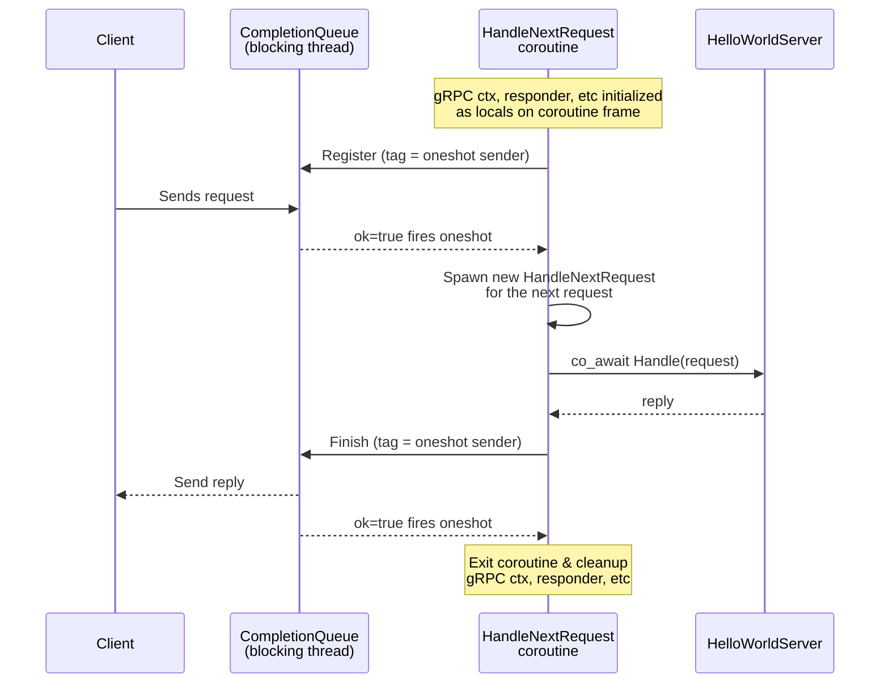

# Tutorial: Building a gRPC Server with coro::Runtime

This tutorial walks through the `examples/grpc` sample — a fully async gRPC server built with `coro::Runtime`. It covers all four gRPC streaming patterns without blocking any threads.

We start with the service definition — the contract that describes what the server does — then look at what implementing it feels like, and finally peel back the layers underneath one at a time.

---

## Part 1: The Service Definition

We'll use an extended version of the helloworld service from the official gRPC examples.
[helloworld.proto](../examples/grpc/helloworld.proto) declares the four RPC patterns we'll implement:

```proto
service Greeter {
  rpc SayHello              (HelloRequest)         returns (HelloReply) {}
  rpc SayHelloStreamRequest (stream HelloRequest)  returns (HelloReply) {}
  rpc SayHelloStreamReply   (HelloRequest)         returns (stream HelloReply) {}
  rpc SayHelloBidiStream    (stream HelloRequest)  returns (stream HelloReply) {}
}
```

`protoc` generates a `Greeter::AsyncService` class with a `RequestSayHello` method for each entry — the raw registration functions that `GrpcServer` calls internally. We never touch those directly.

---

## Part 2: What We're Building Toward

The whole point of this exercise is to make gRPC handlers look and feel like ordinary async functions. All the transport, serialization, completion-queue polling, and concurrency management disappears into the framework. gRPC supports four types of service methods

| Method | Pattern | Handler signature |
|---|---|---|
| `SayHello` | Unary | `Coro<Reply> Handle(Request const&)` |
| `SayHelloStreamRequest` | Client-streaming | `Coro<Reply> Handle(CoroStream<Request>)` |
| `SayHelloStreamReply` | Server-streaming | `CoroStream<Reply> Generate(Request const&)` |
| `SayHelloBidiStream` | Bidirectional | `CoroStream<Reply> Process(CoroStream<Request>)` |

### Unary RPC — one request, one reply

```cpp
coro::Coro<HelloReply> Handle(HelloRequest const& request) {
    HelloReply reply;
    reply.set_message("Hello " + request.name() + "!");
    co_await coro::sleep_for(random_delay());   // any async work goes here
    co_return reply;
}
```

This is just a coroutine that takes a request and returns a reply. There is no mention of gRPC, no completion queues, no callbacks, no threads. It reads exactly like a synchronous function — the only difference is `co_await` and `co_return`.

### Client-streaming RPC — many requests, one reply

```cpp
coro::Coro<HelloReply> Handle(coro::CoroStream<HelloRequest> req_stream) {
    std::string names;
    while (auto req = co_await coro::next(req_stream)) {
        names += (*req).name() + " ";
    }
    HelloReply reply;
    reply.set_message("Hello " + names + "!");
    co_return reply;
}
```

The incoming message stream is just an async channel receiver. Iterate it with `co_await coro::next()` until it closes, then return one reply. No explicit read loop against gRPC internals, no half-close bookkeeping.

### Server-streaming RPC — one request, many replies

```cpp
coro::CoroStream<HelloReply> Generate(HelloRequest const& request) {
    for (auto& word : split(request.name())) {
        HelloReply reply;
        reply.set_message("Hello " + word + "!");
        co_await coro::sleep_for(random_delay());
        co_yield reply; // each yield sends one reply
    }
}
```

An async generator — `co_yield` one reply at a time. The framework writes each yielded value to the wire. No `Write()` calls, no write-completion callbacks.

### Bidirectional RPC — many requests, many replies

```cpp
coro::CoroStream<HelloReply> Process(coro::CoroStream<HelloRequest> req_stream) {
    while (auto req = co_await coro::next(req_stream)) {
        HelloReply reply;
        reply.set_message("Echo: " + (*req).name());
        co_await coro::sleep_for(random_delay());
        co_yield reply;
    }
}
```

The two streaming patterns combined: read from a channel, yield replies. Each `co_await coro::next()` receives one client message; each `co_yield` sends one server reply.

### What all four patterns have in common

Despite covering very different transport semantics, every handler follows the same shape:

- Typed, deserialized request objects arrive as function arguments or channel values — never as raw bytes or gRPC buffers.
- Async work is expressed with `co_await` — the coroutine suspends and the executor runs other tasks while it waits.
- Results are returned with `co_return` or emitted with `co_yield` — no callbacks, no manual `Finish()` calls.
- Concurrency is free: the single-threaded executor overlaps all in-flight handlers automatically.

The rest of this tutorial explains what sits beneath these handlers to make that possible.

---


## Part 3: Connecting the Server to the Framework

[helloserver.cpp](../examples/grpc/helloserver.cpp) defines `HelloWorldServer`. The class inherits `GrpcServer<HelloWorldServer, Greeter::AsyncService>`, whose implementation does two things: registers the gRPC-generated methods and connects them to the handler functions shown in Part 2.

### Registering methods

```cpp
HelloWorldServer() : GrpcServer(
    &helloworld::Greeter::AsyncService::RequestSayHello,
    &helloworld::Greeter::AsyncService::RequestSayHelloStreamRequest,
    &helloworld::Greeter::AsyncService::RequestSayHelloStreamReply,
    &helloworld::Greeter::AsyncService::RequestSayHelloBidiStream)
{}
```

`helloworld::Greeter::AsyncService` is the class generated by `protoc` for our service definition. It exposes one registration method per RPC — `RequestSayHello`, `RequestSayHelloStreamRequest`, and so on. We pass pointers to those methods to the `GrpcServer` base class constructor, which uses template metaprogramming to inspect each pointer's signature at compile time and wire it to the correct handler automatically. This explicit registration step is the only gRPC-specific code in the concrete server: we'll go into the details later, but C++ lacks the runtime reflection that would be needed to discover these methods on its own, so we have to name them. Everything else — reading requests, dispatching handlers, writing replies — is handled internally by the framework.

### Handler naming

The four handler methods use three different names (`Handle`, `Generate`, `Process`) for a mundane reason: C++ cannot overload on return type. `Handle(Request const&)` returning `Coro<Reply>` vs `CoroStream<Reply>` would be ambiguous, so server-streaming gets `Generate` and bidirectional gets `Process`.

### Server-side state

```cpp
std::size_t m_request_count = 0;
```

Handlers can share state as ordinary member variables. Because this server uses `SingleThreadedExecutor` — all coroutines run on one thread — there are no data races and no mutexes are needed. By default `Runtime` uses a multi-threaded `WorkStealingExecutor`, so be careful if you copy this example. It's only because we explicilty specify `SingleThreadedExecutor` that we get thread safety.

---

## Part 4: Starting the Server

```cpp
auto server = std::make_shared<HelloWorldServer>();
coro::Runtime rt(std::in_place_type<coro::SingleThreadedExecutor>);
rt.block_on(HelloWorldServer::Serve(server, port));
```

Three lines start the entire server:

1. **`make_shared`** — `GrpcServer` uses `shared_from_this` to keep itself alive across spawned coroutines. A `shared_ptr` is required.
2. **`Runtime`** — creates the async executor. `SingleThreadedExecutor` is deterministic and needs no synchronization between handlers.
3. **`block_on`** — drives `Serve()` to completion. `Serve()` builds the gRPC server, spawns the initial request listeners, and runs the completion-queue loop until shutdown.

---

## Part 5: The `GrpcServer` Base Class

[grpc_server.h](../examples/grpc/grpc_server.h) is the layer that translates gRPC's raw async API into the clean handler signatures above. It is the most complex piece, and the one that makes all the simplicity in Part 2 possible.

### The problem

gRPC's async server API is completion-queue based. To receive one RPC call you must:

1. Register for the next incoming call, providing a tag and a `CompletionQueue` pointer.
2. Block on `CompletionQueue::Next()` waiting for that tag to fire.
3. Deserialize the request, process it, post a `Finish()` with another tag.
4. Block again waiting for the write to complete.
5. Repeat from step 1 for the next call.

Streaming adds more reads and writes, each with their own tags and completion events, but it's the same basic idea. This machinery is the same for every server — it belongs in a base class.

The above is slightly simplified: you don't actually have to wait for the write in step 4 to complete before registering for the next call. Neither `GrpcServer` nor the official gRPC example server work that way. Instead, as soon as a call arrives in step 2, both immediately register a new listener for the next incoming call before processing the current one. The actual sequence is:

1. Register for the next incoming call, providing a tag and a `CompletionQueue` pointer.
2. Block on `CompletionQueue::Next()` waiting for that tag to fire.
3. Launch a new context at step 1 to accept the next incoming call.
4. Deserialize the request, process it, post a `Finish()` with another tag.
5. Block again waiting for the write to complete.
6. Clean up this context.

This allows the server to keep accepting new requests while the current context concurrently handles steps 4–6.

The official gRPC async example implements this by allocating a new `CallData` object to act as the state machine for the next call while the current one finishes and deletes itself — essentially hand-rolling the same pattern. `GrpcServer` does the same thing by simply spawning a new coroutine task for the next call and letting the runtime manage its scheduling and lifetime. The logic is identical; coroutines just make it far more readable and eliminate the error-prone manual state machine.

### How it works



**The completion queue runs on a blocking thread.** `CompletionQueue::Next()` blocks until an event arrives. `Serve()` runs this loop via `spawn_blocking` so it never stalls the async executor. When an event fires, the tag — a pointer to an `OneshotSender<bool>` — is cast and sent. The coroutine waiting on the matching receiver wakes up.

**Each handler spawns the next listener before processing.** When a call arrives, `HandleNextRequest` immediately registers a new listener for the same method, then processes the current call. This keeps the server accepting new requests at all times without a fixed-size thread pool.

**RPC type is deduced from the method pointer.** `ServiceMethodTraits<Method>` inspects the pointer's parameter types and selects the correct `HandleNextRequest` overload via tag dispatch — unary, client-streaming, server-streaming, or bidirectional — entirely at compile time.

---

## Part 6: The Python Client

[hello_client.py](../examples/grpc/hello_client.py) exercises all four RPC types concurrently using `grpc.aio`:

```python
await asyncio.gather(*(
    coro
    for i in range(iterations)
    for coro in (
        say_hello(stub, i),
        say_hello_stream_request(stub, i),
        say_hello_stream_reply(stub, i),
        say_hello_bidi(stub, i),
    )
))
```

With `--iterations 5` (the default) this fires 20 concurrent RPCs at the server simultaneously. The 250–1000 ms `sleep_for` delays in each handler are intentional: they make it easy to observe that the single-threaded server is genuinely overlapping all the in-flight requests rather than serializing them.
