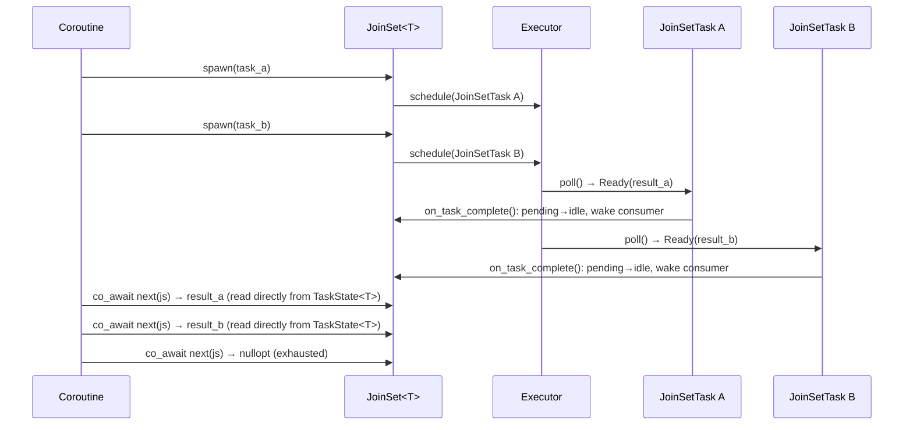

# JoinSet

`JoinSet<T>` is a structured-concurrency primitive that lets a coroutine spawn multiple
homogeneous child tasks and collect their results as they complete.



## Motivation

`JoinSet` makes the child-task lifecycle **explicit** and gives the user full control:

- Consume results one-by-one as they complete (`next()`)
- Wait for all to finish and discard results (`drain()`)
- Cancel remaining tasks by dropping the `JoinSet`
- Compose with `select` for heterogeneous result types via multiple `JoinSet`s

## API

```cpp
// Non-void T: spawn, stream results, or drain
JoinSet<int> js;
js.spawn(compute(1));
js.spawn(compute(2));
js.spawn(compute(3));

// Option A: consume results in completion order
while (auto result = co_await next(js))
    use(*result);

// Option B: drain and discard results (first exception rethrown)
co_await js.drain();

// Void tasks: spawn and drain only
JoinSet<void> js2;
js2.spawn(fire_and_forget_a());
js2.spawn(fire_and_forget_b());
co_await js2.drain();
```

`JoinSet<T>` (non-void) satisfies `Stream<T>` and composes with `select`:

```cpp
JoinSet<int>    int_tasks;
JoinSet<string> str_tasks;
// ...spawn into each...
co_await select(next(int_tasks), next(str_tasks));
```

## Cancel on drop

Dropping a `JoinSet` (without calling `drain()`) cancels all pending child tasks.
Inside a `co_invoke` lambda, the enclosing `CoroutineScope` ensures the cancelled tasks
finish draining before the lambda's `Coro<T>` completes — no use-after-free.

```cpp
co_await co_invoke([&data]() -> Coro<void> {
    JoinSet<void> js;
    for (auto& item : data)
        js.spawn(process(item));
    if (error_condition)
        co_return;  // js dropped here → tasks cancelled → scope drains before return
    co_await js.drain();
});
```

## Exception handling

- `next()`: an exception from a completed task is rethrown when that result is dequeued.
- `drain()`: waits for all tasks to finish, then rethrows the first exception encountered.
- In both cases, remaining tasks continue running and are only cancelled when `JoinSet`
  is dropped.

## Internal design

### Allocation model

Each `spawn()` call creates a single `JoinSetTask<F>` via `make_shared`. `JoinSetTask<F>`
inherits `TaskImpl<F>`, which in turn inherits both `TaskBase` (executor interface / waker)
and `TaskState<T>` (result, exception, cancellation flag). One allocation therefore covers:

- The executor-facing `TaskBase` interface
- The result-holding `TaskState<T>` subobject
- The `JoinSet` tracking data (`weak_ptr<JoinSetSharedState<T>>`)
- The user's future `F`

No separate handle wrapper is needed.

### Shared state

`JoinSetSharedState<T>` (internal, `detail/`) is shared between the `JoinSet`, every
live `JoinSetTask`, and any live `JoinSetDrainFuture` via `shared_ptr`. It holds:

| Field | Type | Description |
|---|---|---|
| `pending_handles` | `set<shared_ptr<TaskBase>>` | Strong refs to running tasks — lifetime anchors while tasks are Idle between executor polls |
| `idle_handles` | `list<shared_ptr<TaskState<T>>>` | Completed tasks awaiting consumption; aliased into the same allocation as the corresponding `TaskBase` |
| `consumer_waker` | `shared_ptr<Waker>` | Wakes the `next()`/`drain()` consumer when a task completes |
| `mutex` | `std::mutex` | Protects all fields |

### Task lifecycle

`JoinSetTask<F>` overrides `on_task_complete()`, which `TaskImpl<F>::poll()` calls at
every terminal exit (after `setResult`, `setException`, or `mark_done`). The override:

1. Locks `JoinSetSharedState::mutex`.
2. Erases `self` from `pending_handles`.
3. Pushes an aliased `shared_ptr<TaskState<T>>` (same allocation, `TaskState<T>*`
   stored pointer) onto `idle_handles`.
4. Steals `consumer_waker` while still under the lock.
5. Releases the lock, then calls `waker->wake()`.

`JoinSet::poll_next()` pops from `idle_handles` and reads the result directly from
`TaskState<T>` under its own mutex — the same logic used by `JoinHandle::poll()`. No
result copy into an intermediate queue is needed.

```
After spawn(A), spawn(B), spawn(C):
  pending_handles: {A, B, C}
  idle_handles:    []

After B completes (on_task_complete() moves B):
  pending_handles: {A, C}
  idle_handles:    [B]          ← B's TaskState<T> is readable; no extra allocation

After poll_next() consumes B:
  pending_handles: {A, C}
  idle_handles:    []           ← B's allocation freed when shared_ptr<TaskState<T>> drops
```

The `JoinSetTask` uses a `weak_ptr<JoinSetSharedState<T>>` to avoid a reference cycle:
`JoinSetSharedState::pending_handles` → `TaskBase` → `(weak)` → `JoinSetSharedState`.
When the `JoinSet` is destroyed, `lock()` returns null and `on_task_complete()` is a
silent no-op; the executor's temporary strong reference keeps the task alive through the
remainder of `poll()`.

### Cancellation flow

When `JoinSet` is dropped, `cancel_pending()`:

1. Collects all entries from `pending_handles` into a local `vector` (keeping tasks
   alive via temporary strong refs).
2. Clears `pending_handles` (drops the persistent refs).
3. Calls `cancel_task()` on each task — sets `cancelled = true` and enqueues the task
   so the executor sees the flag on the next poll.

Tasks that are currently Running or Notified are already held by the executor's
temporary strong reference and self-terminate on their next poll. The local `vector`
ensures Idle tasks are not freed between the ref-drop and the `cancel_task()` enqueue.

### Stream<T> satisfaction

`JoinSet<T>` (non-void) exposes `ItemType = T` and `poll_next()`, satisfying `Stream<T>`.
The existing `next()` free function and all stream combinators work without modification.
`JoinSet<void>` does not satisfy `Stream` (no `ItemType`); only `drain()` is provided.
