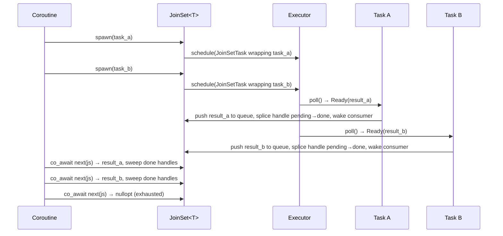

# JoinSet

`JoinSet<T>` is a structured-concurrency primitive that lets a coroutine spawn multiple
homogeneous child tasks and collect their results as they complete.



## Motivation

`Synchronize` (deprecated — prefer `co_invoke` + `JoinSet::drain()`) drained children
implicitly and discarded their results. `JoinSet` makes the lifecycle **explicit** and gives the user full control:

- Consume results one-by-one as they complete (`next()`)
- Wait for all to finish and discard results (`drain()`)
- Cancel remaining tasks by dropping the `JoinSet`
- Compose with `select` for heterogeneous result types via multiple `JoinSet`s

## API

```cpp
// Non-void T: spawn, stream results, or drain
JoinSet<int> js;
js.spawn(compute(1));
js.spawn(compute(2));
js.spawn(compute(3));

// Option A: consume results in completion order
while (auto result = co_await next(js))
    use(*result);

// Option B: drain and discard results (first exception rethrown)
co_await js.drain();

// Void tasks: spawn and drain only
JoinSet<void> js2;
js2.spawn(fire_and_forget_a());
js2.spawn(fire_and_forget_b());
co_await js2.drain();
```

`JoinSet<T>` (non-void) satisfies `Stream<T>` and composes with `select`:

```cpp
JoinSet<int>    int_tasks;
JoinSet<string> str_tasks;
// ...spawn into each...
co_await select(next(int_tasks), next(str_tasks));
```

## Cancel on drop

Dropping a `JoinSet` (without calling `drain()`) cancels all pending child tasks.
Inside a `co_invoke` lambda, the enclosing `CoroutineScope` ensures the cancelled tasks
finish draining before the lambda's `Coro<T>` completes — no use-after-free.

```cpp
co_await co_invoke([&data]() -> Coro<void> {
    JoinSet<void> js;
    for (auto& item : data)
        js.spawn(process(item));
    if (error_condition)
        co_return;  // js dropped here → tasks cancelled → scope drains before return
    co_await js.drain();
});
```

## Exception handling

- `next()`: an exception from a completed task is rethrown when that result is dequeued.
- `drain()`: waits for all tasks to finish, then rethrows the first exception encountered
  (consistent with `Synchronize`'s behaviour).
- In both cases, remaining tasks continue running and are only cancelled when `JoinSet`
  is dropped.

## Internal design

### Shared state

`JoinSetSharedState<T>` (internal, `detail/`) is shared between the `JoinSet`, every
`JoinSetTask` wrapper, and any live `JoinSetDrainFuture` via `shared_ptr`. It holds:

| Field | Description |
|---|---|
| `results` | Queue of `variant<T, exception_ptr>` (non-void) or `queue<exception_ptr>` (void) |
| `pending_count` | Number of tasks not yet completed or cancelled |
| `consumer_waker` | Wakes the `next()`/`drain()` consumer when results arrive |
| `pending_handles` | `std::list<JoinHandle<void>>` — handles for tasks still running |
| `done_handles` | `std::list<JoinHandle<void>>` — handles for tasks that have finished |

All fields are protected by a single `mutex`.

### Handle lifecycle

Every `spawn()` call inserts a `JoinHandle<void>` at the back of `pending_handles` and
passes the resulting `std::list` iterator to the corresponding `JoinSetTask`. Using
`std::list` gives stable iterators — no iterator invalidation when other nodes are
inserted or spliced.

When a task finishes (in `JoinSetTask::poll()`) or is cancelled (in
`~JoinSetTask()`), it splices its node from `pending_handles` to `done_handles` in **O(1)**
under the mutex. The handle is not destroyed immediately; it waits in the done list.

At the next **sweep point** — any call to `poll_next()`, `spawn()`, or
`JoinSetDrainFuture::poll()` — the done list is moved out of the shared state under the
lock, then destroyed after the lock is released. This keeps `JoinHandle` destructors
(which touch atomics and the `CoroutineScope` mutex) outside the shared-state lock,
preventing any lock-ordering issue.

```
After spawn(A), spawn(B), spawn(C):
  pending_handles: [A] → [B] → [C]
  done_handles:    []

After B completes (JoinSetTask::poll() splices B):
  pending_handles: [A] → [C]
  done_handles:    [B]

After next poll_next() sweep:
  pending_handles: [A] → [C]
  done_handles:    []        ← B's JoinHandle destroyed here (outside lock)
```

### Cancellation flow

When `JoinSet` is dropped, `pending_handles` and `done_handles` are destroyed as part of
`JoinSetSharedState`'s destructor (or when its `shared_ptr` ref count hits zero). Each
`JoinHandle<void>` destructor:

1. Marks `TaskState<void>::cancelled = true`.
2. If inside a coroutine `poll()` (`t_current_coro` is non-null), registers a
   `PendingChild` with the enclosing `CoroutineScope`.

The `CoroutineScope` then drains all registered children before the parent coroutine
delivers its result, ensuring no task outlives the scope that spawned it.

Handles already in `done_handles` have `terminated == true`; their `CoroutineScope`
registration completes immediately (no blocking).

### Stream<T> satisfaction

`JoinSet<T>` (non-void) exposes `ItemType = T` and `poll_next()`, satisfying `Stream<T>`.
The existing `next()` free function and all stream combinators work without modification.
`JoinSet<void>` does not satisfy `Stream` (no `ItemType`); only `drain()` is provided.
