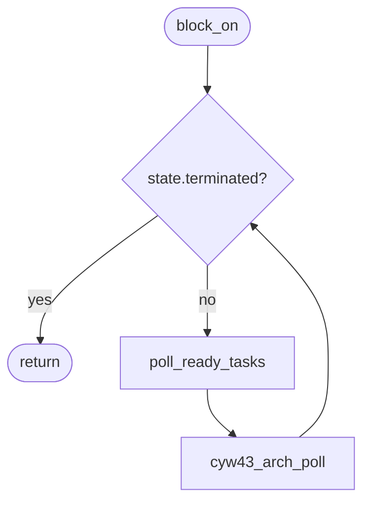
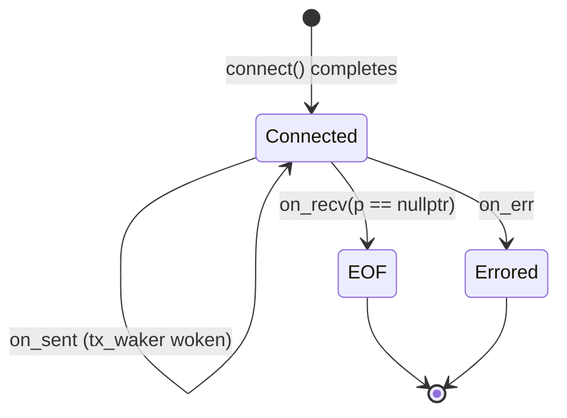
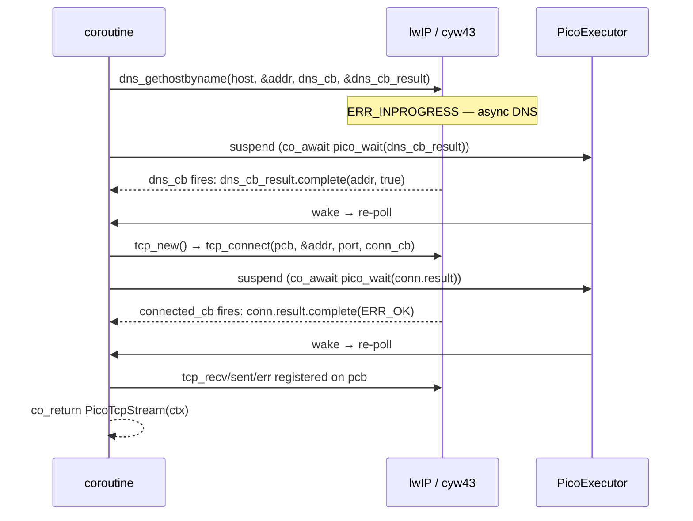

# Pico Port

Stripped-down port of the coro library to Raspberry Pi Pico W (RP2040/RP2350),
targeting the Pico SDK with `CYW43_ARCH_POLL` mode. Provides `PicoExecutor`,
`PicoTcpStream`, and `PicoTcpListener` — enough to run coroutines with async TCP
client and server I/O on bare metal.

## Scope

| Included | Excluded |
|---|---|
| `Coro<T>` / `JoinHandle<T>` / `JoinSet<T>` — coroutine return types | `WorkSharingExecutor` / `WorkStealingExecutor` |
| `spawn()` / `JoinHandle` — task spawning and joining | `File` / `WsStream` |
| `PicoExecutor` — single-threaded run loop | `spawn_blocking` (no thread pool) |
| `PicoTcpStream` — async TCP client | `sleep_for` / `timeout` (no timer integration) |
| `PicoTcpListener` — async TCP server | |
| `mpsc`, `oneshot`, `watch`, `select`, `join` — sync primitives | |

All coroutine machinery in `include/coro/detail/` and `include/coro/sync/` is
portable C++20 with no platform dependencies and compiles as-is.

---

## Architecture

### How the existing library maps to the Pico SDK

| libuv backend | Pico SDK equivalent |
|---|---|
| `uv_run(UV_RUN_ONCE)` | `cyw43_arch_poll()` |
| `uv_tcp_t` | lwIP `tcp_pcb*` |
| `uv_async_send()` doorbell | N/A — single-threaded, no cross-thread wakeup |
| `UvCallbackResult` (mutex-protected) | `PicoCallbackResult` (no mutex) |
| `SingleThreadedUvExecutor` (dedicated thread) | `PicoExecutor` (runs on calling thread) |

### Event loop

`PicoExecutor::block_on()` drives everything:



`cyw43_arch_poll()` processes pending WiFi chip events and fires any pending lwIP
callbacks (TCP recv, sent, err) synchronously on the calling thread before returning.
This means wakers stored by `PicoCallbackResult` or `PicoTcpContext` are always
called on the same thread as the executor — no locking is needed anywhere in the
I/O path.

### Why no mutex in `PicoCallbackResult`

`UvCallbackResult` protects its `waker` and `value` fields with a `std::mutex`
because libuv callbacks fire on a dedicated I/O thread that is separate from the
task poll thread. With `CYW43_ARCH_POLL`, there is no separate I/O thread — lwIP
callbacks always fire from inside `cyw43_arch_poll()`, which is called from the
executor loop on the main thread. Single-threaded ordering eliminates the data race.

> **CAUTION:** If you switch to `CYW43_ARCH_THREADSAFE_BACKGROUND`, lwIP callbacks
> can arrive from core 1 or an IRQ. In that case, `PicoCallbackResult` needs a
> `critical_section_t` guard around `waker` and `value`. `PicoExecutor::enqueue()`
> would also need a critical section around the queue push.

---

## New files

```
include/coro/pico/
  pico_callback_result.h    PicoCallbackResult<Args...> + PicoFuture<Args...>
  pico_executor.h           PicoExecutor class declaration
  pico_tcp_stream.h         PicoTcpContext + PicoTcpStream declaration
  pico_tcp_stream.hpp       read<Buf> / write<Buf> template implementations
  pico_tcp_listener.h       PicoListenContext + PicoTcpListener declaration

src/
  pico_executor.cpp         PicoExecutor implementation
  pico_tcp_stream.cpp       connect coroutine + lwIP callbacks
  pico_tcp_listener.cpp     bind / accept coroutines + on_accept callback
```

---

## Component design

### `PicoCallbackResult<Args...>` and `PicoFuture<Args...>`

Direct analogues of `UvCallbackResult`/`UvFuture` without the mutex. Used for
**one-shot** bridges: DNS resolution and TCP connect.

```
coroutine frame
┌──────────────────────────────────────┐
│ PicoCallbackResult<ip_addr_t, bool>  │◄── void* arg in dns callback
│   waker:  shared_ptr<Waker>   ◄──────┼─── set by PicoFuture::poll()
│   value:  optional<tuple<...>>       │
└──────────────────────────────────────┘
         │ complete() called from callback
         ▼
    waker->wake()  →  PicoExecutor::enqueue()  →  task re-polled
```

Frame stays alive because the coroutine is suspended at `co_await pico_wait(result)`.
The raw pointer stored in `void* arg` is therefore always valid when the callback fires.

### `PicoExecutor`

Identical CAS state machine as `SingleThreadedExecutor` (Notified → Running → Idle /
RunningAndNotified). Differences:

- **`block_on(future)`** — convenience entry point analogous to `Runtime::block_on()`.
  Constructs a `detail::TaskImpl<F>`, schedules it, and drives the event loop until the
  task completes. Users never touch `detail::` internals directly. Sets a thread-local
  `Executor*` for the duration of the call (see below) so that `coro::spawn()` works
  transparently inside coroutines without a `Runtime`.
- **No remote injection queue.** `enqueue()` pushes directly to `m_ready` — always
  called from the executor thread.
- **No `std::thread` / `std::condition_variable` in the executor itself.** The condvar
  in `detail::TaskStateBase` is never *waited on* by `PicoExecutor` — it polls
  `state.terminated` in a loop instead.
- **`cyw43_arch_poll()` replaces blocking.** When the ready queue is empty, the
  executor calls `cyw43_arch_poll()` rather than blocking on a condvar.

### `coro::spawn()` compatibility

`coro::spawn()` currently calls `current_runtime()`, which reads a thread-local
`Runtime*` set by `Runtime::block_on()`. `PicoExecutor` is not a `Runtime`, so
without changes the free `coro::spawn()` would throw inside pico coroutines.

The fix is a small addition to the core library shared by all executors:

1. **Add `thread_local Executor* g_current_executor`** in `executor.cpp`, alongside
   the existing `thread_local Runtime*` in `runtime.cpp`.
2. **`Runtime::block_on()` sets both** — the current runtime *and* the current executor.
   No behaviour change for non-pico code.
3. **`PicoExecutor::block_on()` sets only the executor** thread-local (no Runtime).
4. **`coro::spawn()` checks the executor thread-local as a fallback**: if no Runtime is
   registered, it constructs a `SpawnBuilder` from `current_executor()` directly.

From user code there is no visible difference — `coro::spawn(future)` works the same
whether called from inside `Runtime::block_on()` or `PicoExecutor::block_on()`.

### `PicoTcpContext`

Shared state (via `std::shared_ptr`) between a `PicoTcpStream` and the three lwIP
callbacks registered on its PCB.



**Receive model:** `on_recv` copies incoming pbuf data into `rx_buf` (a
`std::vector<uint8_t>`) and calls `tcp_recved()` to open the receive window.
Any suspended `read()` future is woken via `rx_waker`. Multiple `on_recv` calls
accumulate in `rx_buf`; `read()` drains up to `buf.size()` bytes per call.

**Transmit model:** `write()` loops, calling `tcp_write(... TCP_WRITE_FLAG_COPY ...)`
in chunks sized to `tcp_sndbuf()`. If the send buffer fills (`tcp_sndbuf() == 0`),
it flushes with `tcp_output()` and suspends on `tx_waker` until `on_sent` fires.
`TCP_WRITE_FLAG_COPY` means the source buffer only needs to be valid until
`tcp_write` returns — the coroutine frame buffer ownership model is preserved.

**Error model:** `on_err` is called by lwIP after a fatal error; the PCB is freed
by lwIP *before* this callback returns, so `on_err` sets `pcb = nullptr`. Any code
that touches the PCB first checks `ctx->errored` or `ctx->pcb != nullptr`.

### `PicoTcpListener`

Accepts incoming connections using the lwIP `tcp_accept` callback. The design
mirrors `TcpListener` (libuv backend) but is simpler because bind and listen are
synchronous — no async I/O is needed to set up a server socket.

**`PicoListenContext`** is shared between the `PicoTcpListener` and `on_accept`:

```
PicoTcpListener
  └── shared_ptr<PicoListenContext>
        ├── listen_pcb: tcp_pcb*         ← set as tcp_arg; used by on_accept
        ├── pending: deque<tcp_pcb*>     ← new connections pushed here
        ├── accept_waker: shared_ptr     ← set by accept() future, woken by on_accept
        └── closed: bool                 ← set by destructor; guards on_accept
```

**Bind / listen flow** (synchronous — no suspension needed):
1. `tcp_new_ip_type(IPADDR_TYPE_ANY)` → new PCB
2. `tcp_bind(pcb, addr, port)`
3. `tcp_listen_with_backlog(pcb, 4)` → returns new listen PCB; old PCB is freed internally on success
4. `tcp_accept(listen_pcb, on_accept)` → register callback
5. `co_return PicoTcpListener(ctx)` — `bind()` returns on first poll without suspending

**Accept flow**:
1. `accept()` checks `pending` — if empty, suspends via `ConnectionReady` future
2. `on_accept` fires (from `cyw43_arch_poll()`), pushes new PCB, wakes `accept_waker`
3. `accept()` resumes, pops PCB from `pending`
4. Wraps PCB in a fresh `PicoTcpContext` with `tcp_recv`/`tcp_sent`/`tcp_err` wired up
5. Returns `PicoTcpStream`

**Important lwIP detail:** `tcp_listen_with_backlog` frees the original bound PCB on
success and returns a new `tcp_pcb_listen` type. The returned pointer must be used from
that point; the original pointer is invalid. On OOM failure, the original PCB is NOT
freed — `tcp_abort` it manually.

### `PicoTcpStream::connect` — sequence



Two separate `PicoCallbackResult` objects live on the coroutine frame — one for DNS,
one for TCP connect. A `ConnState::fired` flag prevents double-complete if both
`tcp_err` and the connect callback fire (shouldn't happen but defensive).

After `tcp_err` fires during connect, lwIP has already freed the PCB. The connect
coroutine must **not** call `tcp_abort` in the error path — only when `tcp_connect`
itself returns non-`ERR_OK` (before any callback has fired).

---

## CMake integration

```cmake
# In your Pico project's CMakeLists.txt:

add_executable(my_app main.cpp)

# Pull in the coro library source (adjust path as needed)
target_sources(my_app PRIVATE
    path/to/coro/src/pico_executor.cpp
    path/to/coro/src/pico_tcp_stream.cpp
    path/to/coro/src/pico_tcp_listener.cpp  # omit if only using the client
    # core portable sources:
    path/to/coro/src/context.cpp
    path/to/coro/src/waker.cpp
    path/to/coro/src/executor.cpp
    path/to/coro/src/cancellation_token.cpp
    path/to/coro/src/single_threaded_executor.cpp
    path/to/coro/src/task.cpp
)

target_include_directories(my_app PRIVATE
    path/to/coro/include
)

target_link_libraries(my_app
    pico_stdlib
    pico_cyw43_arch_lwip_poll   # CYW43_ARCH_POLL mode — required
)

target_compile_features(my_app PRIVATE cxx_std_20)
```

Use `pico_cyw43_arch_lwip_poll` specifically — not `lwip_threadsafe_background`.

For the server example, lwIP's default PCB counts are tight. Add to your `lwipopts.h`:

```c
#define MEMP_NUM_TCP_PCB        8   // concurrent established connections
#define MEMP_NUM_TCP_PCB_LISTEN 2   // listening sockets (1 is usually enough)
#define TCP_MSS                 1460
#define TCP_SND_BUF             (4 * TCP_MSS)
#define TCP_WND                 (4 * TCP_MSS)
```
The entire port is built around the assumption that lwIP callbacks fire
synchronously from `cyw43_arch_poll()`.

---

## Usage example

```cpp
#include <coro/pico/pico_executor.h>
#include <coro/pico/pico_tcp_stream.h>
#include <coro/coro.h>
#include <pico/stdlib.h>
#include <pico/cyw43_arch.h>
#include <string>

coro::Coro<void> http_get(const char* host, uint16_t port) {
    auto stream = co_await coro::PicoTcpStream::connect(host, port);

    std::string req = "GET / HTTP/1.0\r\nHost: ";
    req += host;
    req += "\r\n\r\n";
    co_await stream.write(std::move(req));

    auto [n, buf] = co_await stream.read(std::string(1024, '\0'));
    buf.resize(n);

    // use buf ...
}

int main() {
    stdio_init_all();
    cyw43_arch_init();
    cyw43_arch_enable_sta_mode();
    cyw43_arch_wifi_connect_blocking("SSID", "password", CYW43_AUTH_WPA2_AES_PSK);

    coro::PicoExecutor exec;
    exec.block_on(http_get("example.com", 80));

    cyw43_arch_deinit();
}
```

---

## Known limitations and future work

### `std::condition_variable` dependency

`detail::TaskStateBase` contains a `std::condition_variable` (used by
`wait_until_done()` for multi-threaded executors). `PicoExecutor::block_on()` never calls
`wait_until_done()` — it polls `state.terminated` in a loop — but the condvar must
be *linkable*.

- **With FreeRTOS** (`pico_freertos_sdk`): `std::condition_variable` is provided by
  the FreeRTOS C++ support layer. This is the recommended path.
- **Bare metal without FreeRTOS**: Newlib's C++ runtime may not provide
  `std::condition_variable`. If linking fails, the cleanest fix is to add a
  `PicoTaskStateBase` that replaces the condvar with a bare `bool` flag (since
  `wait_until_done()` is never called). This would require a small refactor of
  `detail::TaskStateBase`.

### No timer / sleep support

`sleep_for()` and `timeout()` depend on `TimerService` which is backed by libuv's
timer API. On Pico, the equivalent is `add_alarm_in_ms()` / `alarm_pool`. A
`PicoTimerFuture` following the same `PicoCallbackResult` pattern would be
straightforward to add.

### Single active read and write per stream

`PicoTcpContext` stores one `rx_waker` and one `tx_waker`. Calling `read()` from
two concurrent tasks (or `write()` from two concurrent tasks) on the same stream
would silently overwrite the waker and lose wakeups. Document and enforce
single-consumer usage; the same restriction exists in `TcpStream`.

### `rx_buf` memory pressure

Incoming data is eagerly copied from pbufs into a `std::vector<uint8_t>`. On a busy
stream this allocation grows without bound until `read()` drains it. For
memory-constrained applications, consider capping `rx_buf` at a fixed size and
pausing `tcp_recv` (by returning `ERR_WOULDBLOCK`) when it fills.

### Large writes and `tcp_sndbuf` granularity

`tcp_sndbuf()` returns available bytes in the lwIP send queue, which is bounded by
`TCP_SND_BUF` (default 2×`TCP_MSS`, typically ~2744 bytes). Writing more than this
in one call silently loops and suspends. For high-throughput use, increase
`TCP_SND_BUF` in `lwipopts.h`.

### IPv6

`tcp_new()` creates an IPv4-only PCB. For dual-stack, replace with
`tcp_new_ip_type(IPADDR_TYPE_ANY)` and pass an `ip_addr_t` that can hold either
address family. lwIP's DNS resolver returns an `ip_addr_t` that works with both.
