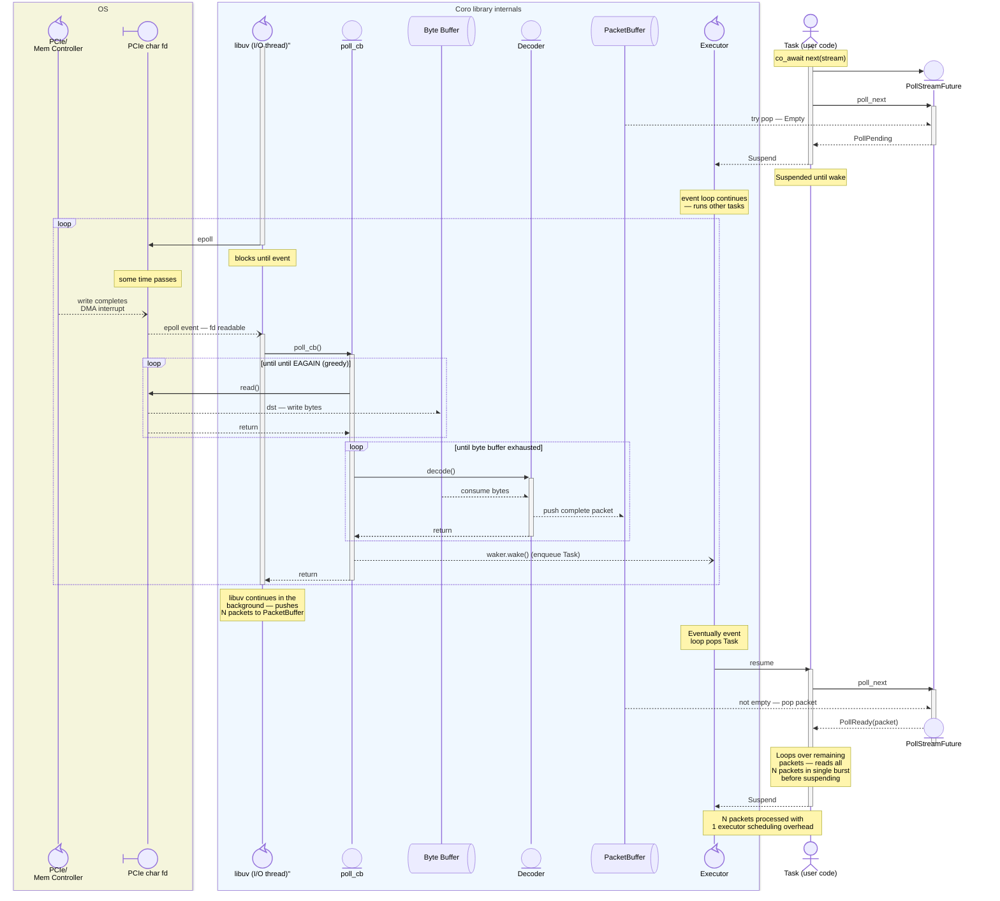
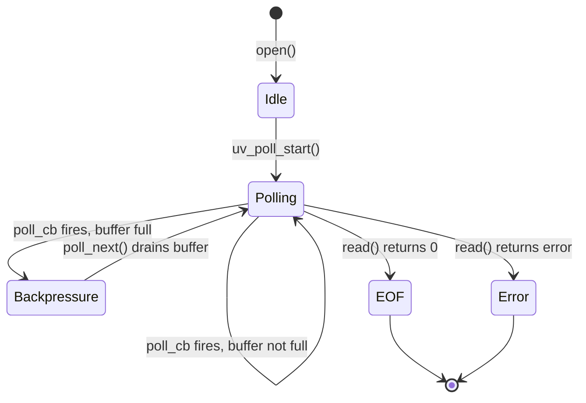

# Poll-based Streams

Design document for `PollStream<T>` — a buffered Stream adapter for pollable file
descriptors (character devices, pipes, sockets) using `uv_poll_t`.

---

## Overview

`PollStream<T, Decoder>` provides an efficient Stream interface for reading framed data from
pollable file descriptors. It is designed for **event-driven I/O** on file descriptors
that support `epoll()`/`poll()` semantics, as opposed to the threadpool-based `File`
class which uses `uv_fs_read()` for regular disk files.

Primary motivation: reading a continuous stream of **variable-length, multi-header packets**
from a **PCIe character device** with minimal latency and executor overhead.

### Key Design Goals

1. **Event-driven, not polled** — use `uv_poll_t` to get notified when data is ready
2. **Zero threadpool overhead** — reads happen directly in the event loop callback
3. **Amortize executor scheduling cost** — internal buffering allows one task resumption
   to process multiple packets
4. **Backpressure support** — stop polling when consumer falls behind
5. **Generic framing protocol** — pluggable `Decoder` for variable-length, multi-stage protocols
6. **Reusable for multiple fd types** — PCIe character devices, pipes, Unix sockets, serial ports, etc.

---

## Problem Statement: Executor Scheduling Overhead

### The PCIe Character Device Use Case

The device streams variable-length packets through a PCIe character device
(`/dev/pcie_data`). Each packet has a **multi-stage framing protocol**:

1. **Primary header** (16 bytes, fixed) — contains packet type, flags, and payload length
2. **Optional secondary header** (16 bytes, conditional) — present if flag set in primary header
3. **Payload** (variable, 4KB - 128KB) — actual data, size specified in primary header
4. **Footer** (16 bytes, fixed pattern) — synchronization marker to detect framing errors

```
┌─────────────┬──────────────┬──────────────┬─────────┐
│ Header1     │ Header2?     │ Payload      │ Footer  │
│ 16 bytes    │ 0 or 16 bytes│ 4KB - 128KB  │ 16 bytes│
│ (has size)  │ (conditional)│ (variable)   │ (magic) │
└─────────────┴──────────────┴──────────────┴─────────┘
```

Application requirements:

- Begin processing each packet as soon as it arrives (low latency requirement)
- Handle continuous streams (no buffering between packets is acceptable at app level)
- Detect and recover from framing errors (footer validation)
- Avoid unnecessary overhead that adds latency to the processing pipeline

### Why `uv_fs_read` is the Wrong Tool

The existing `File` class uses `uv_fs_read()`, which:

1. **Goes through libuv's threadpool** — every read is dispatched to a worker thread
2. **High per-operation overhead** — context switch to/from threadpool per packet
3. **Polling-based** — must submit a new read request after each packet completes
4. **Not event-driven** — cannot be notified when data arrives; must speculatively submit reads

```
With File + uv_fs_read per packet:
  Packet arrives → eventually detected by pending read on threadpool
              → worker thread completes read
              → callback posts to event loop
              → TaskWaker::wake() → enqueue → schedule → resume
              → process 1 packet
              → submit next read → back to threadpool
```

**Per-packet cost:** threadpool round-trip + executor scheduling overhead

### Why PCIe Character Devices Support Better Approaches

PCIe character devices:

- Are **pollable** — support `epoll()`, `poll()`, `select()`
- Signal **`POLLIN`** when data is ready to read
- Support **non-blocking reads** with `O_NONBLOCK` / `EAGAIN`

This means we can use `uv_poll_t` to register the fd with libuv's event loop and get
notified immediately when the device writes data — **no threadpool involved**.

---

## Solution: Event-Driven Polling with Stateful Frame Decoding

### Architecture



**Two-level buffering:**

1. **Byte buffer** (circular, ~256KB) — raw bytes from fd; managed by `poll_cb`
2. **Packet buffer** (ring, ~32-64 packets) — decoded packets; consumed by `poll_next`

### Stateful Frame Decoding

The **Decoder** is a pluggable component that implements the framing protocol. It maintains
internal state across multiple `decode()` calls to handle packets that span multiple reads:

```cpp
template<typename T>
class Decoder {
public:
    // Try to extract one complete frame from the byte buffer
    // Returns:
    //   some(T)   - successfully decoded a complete packet
    //   nullopt   - need more bytes (partial packet in buffer)
    // Throws if framing error detected (e.g., invalid footer magic)
    std::optional<T> decode(std::span<const std::byte> buffer, std::size_t& consumed);

    // Reset decoder state (e.g., after error recovery)
    void reset();
};
```

The decoder tracks which stage of the multi-header packet it's currently reading and how
many more bytes are needed.

### Latency Amortization

**Scenario:** 10 packets arrive during the window between `wake()` and task resumption.

| Approach | Overhead |
|---|---|
| `File` + per-packet `uv_fs_read` | 10 × (threadpool + executor scheduling) |
| `PollStream` + buffering | 1 × (executor scheduling) + 10 × (buffer pop) |

The buffer **absorbs the burst** and allows the task to process multiple packets per
resumption, amortizing the executor's scheduling cost.

### Backpressure

If packets arrive faster than the consumer task processes them:

1. Buffer fills to capacity
2. `poll_cb` calls `uv_poll_stop()` — stops receiving epoll events
3. OS kernel buffers continue to fill (PCIe driver buffers in kernel)
4. Task eventually resumes and drains buffer
5. `poll_next()` detects space available, calls `uv_poll_start()` — resumes polling

This provides **automatic flow control** without dropping packets (up to kernel buffer limits).

---

## API Design

### Decoder Concept

The `Decoder` abstraction handles framing protocol details:

```cpp
template<typename T>
concept Decoder = requires(T decoder, std::span<const std::byte> buf, std::size_t& consumed) {
    // Try to extract one complete frame from the byte buffer
    // Returns:
    //   some(typename T::OutputType) - decoded complete packet, consumed bytes via ref param
    //   nullopt                      - need more bytes (partial packet)
    // Throws std::runtime_error if framing error detected
    { decoder.decode(buf, consumed) } -> std::same_as<std::optional<typename T::OutputType>>;

    // Output type of decoded packets
    typename T::OutputType;

    // Reset decoder to initial state (e.g., after error recovery)
    { decoder.reset() } -> std::same_as<void>;
};
```

### PollStream Class Template

```cpp
template<typename T, Decoder DecoderT>
class PollStream {
public:
    using ItemType = T;

    /// Opens a pollable file descriptor and wraps it as a Stream
    /// fd: open file descriptor (must support poll/epoll semantics)
    /// decoder: decoder instance (moved into stream)
    /// packet_buffer_capacity: number of decoded packets to buffer (default 64)
    /// byte_buffer_capacity: raw byte buffer size (default 256KB)
    /// io_service: the IoService managing the uv_loop
    [[nodiscard]] static PollStream open(
        int fd,
        DecoderT decoder,
        std::size_t packet_buffer_capacity = 64,
        std::size_t byte_buffer_capacity = 256 * 1024,
        IoService* io_service = current_io_service()
    );

    /// Stream concept interface — poll for the next item
    PollResult<std::optional<T>> poll_next(detail::Context& ctx);

    /// Closes the fd and stops polling (called by destructor)
    void close();

    PollStream(PollStream&&) noexcept;
    PollStream& operator=(PollStream&&) noexcept;
    PollStream(const PollStream&) = delete;
    PollStream& operator=(const PollStream&) = delete;

    ~PollStream();

private:
    struct State; // forward declaration
    std::shared_ptr<State> m_state;
    IoService*             m_io_service;

    explicit PollStream(int fd, DecoderT decoder,
                       std::size_t pkt_buf_cap, std::size_t byte_buf_cap,
                       IoService* io_service);

    static void poll_cb(uv_poll_t* handle, int status, int events);
    static void close_cb(uv_handle_t* handle);
};
```

### Example: PcieDecoder for Multi-Stage Frame Protocol

**Note:** `PcieDecoder` is provided as an example in `test/pcie_decoder.h`
to demonstrate a complex, multi-stage decoder with zero-copy support. It is **not**
part of the core library.

For the PCIe character device protocol, a specialized decoder handles the four-stage framing:

```cpp
// In test/pcie_decoder.h

/// PCIe character device packet structure
struct PciePacket {
    struct Header1 {
        uint32_t magic;           // Protocol magic number
        uint16_t flags;           // Bit 0: has_header2
        uint16_t payload_length;  // 4KB - 128KB
        uint64_t timestamp;       // timestamp
    } header1;

    std::optional<struct Header2 {
        uint64_t sequence_number;
        uint64_t reserved;
    }> header2;

    std::vector<std::byte> payload;  // Variable length

    struct Footer {
        uint64_t magic1;          // Expected: 0xDEADBEEFCAFEBABE
        uint64_t magic2;          // Expected: 0x0123456789ABCDEF
    } footer;
};

static constexpr uint64_t FOOTER_MAGIC1 = 0xDEADBEEFCAFEBABE;
static constexpr uint64_t FOOTER_MAGIC2 = 0x0123456789ABCDEF;

/// Stateful decoder for multi-stage PCIe character device packets
class PcieDecoder {
public:
    using OutputType = PciePacket;

    PcieDecoder() = default;

    /// Decode one packet from byte buffer
    std::optional<PciePacket> decode(std::span<const std::byte> buffer,
                                     std::size_t& consumed);

    /// Reset to initial state (e.g., after framing error recovery)
    void reset();

private:
    enum class State {
        ReadingHeader1,   // Need 16 bytes
        ReadingHeader2,   // Need 16 bytes (conditional)
        ReadingPayload,   // Need N bytes (from header1)
        ReadingFooter,    // Need 16 bytes
    };

    State      m_state = State::ReadingHeader1;
    PciePacket m_packet;  // Packet being assembled
    std::size_t m_payload_length = 0;
    bool        m_has_header2 = false;
};
```

### Example: PcieStream Type Alias

```cpp
// In test/pcie_stream.h
using PcieStream = PollStream<PciePacket, PcieDecoder>;

// Usage:
#include "pcie_stream.h"  // from examples/io/

auto stream = PcieStream::open(
    open("/dev/pcie_data", O_RDONLY | O_NONBLOCK),
    PcieDecoder{}
);
```

---

## Implementation Details

### Internal State

```cpp
template<typename T, Decoder DecoderT>
struct PollStream<T, DecoderT>::State {
    uv_poll_t                                   poll_handle;      // libuv poll handle
    int                                         fd;               // file descriptor

    // Two-level buffering
    CircularByteBuffer                          byte_buffer;      // Raw bytes from fd (e.g., 256KB)
    RingBuffer<T>                               packet_buffer;    // Decoded packets (e.g., 64 packets)

    DecoderT                                    decoder;          // Stateful frame decoder

    std::atomic<std::shared_ptr<detail::Waker>> waker;            // stored waker for wake()
    std::exception_ptr                          error;            // captured error
    bool                                        eof = false;      // EOF seen on fd
    bool                                        polling = false;  // uv_poll_start active?
};
```

**Two-level buffering rationale:**

- **Byte buffer** (circular, 256KB default) — holds raw bytes between `read()` calls;
  handles partial packets that span multiple reads
- **Packet buffer** (ring, 64 packets default) — holds decoded, validated packets ready
  for consumption; provides executor scheduling amortization

**Ownership model:** `State` is held via `shared_ptr` so it outlives the `PollStream`
instance if a callback is in-flight when the stream is moved or destroyed.

**Thread safety:**

- `waker` is atomic (written by I/O thread in `poll_cb`, read/written by worker in `poll_next`)
- `byte_buffer` and `decoder` are accessed only in `poll_cb` (I/O thread)
- `packet_buffer` is written in `poll_cb`, read in `poll_next`
- When `poll_next` is active, polling is stopped (`uv_poll_stop`), so no concurrent access

**RACE CONDITION NOTE:** The circular byte buffer and decoder are accessed exclusively
on the I/O thread during `poll_cb`. The `poll_next` method only reads from the packet
buffer, which is written by `poll_cb` but never concurrently accessed because `uv_poll`
is stopped while `poll_next` is draining the packet buffer. This design eliminates the
need for a mutex on the hot path.

### State Machine



| State | Description | uv_poll active? |
|---|---|---|
| **Idle** | Stream created but not yet polled | No |
| **Polling** | Registered with event loop; waiting for `POLLIN` | Yes |
| **Backpressure** | Buffer full; polling stopped to apply backpressure | No |
| **EOF** | `read()` returned 0; stream exhausted | No |
| **Error** | I/O error or protocol violation; stream faulted | No |

### The poll_cb Callback — Read + Decode Loop

The callback runs on the I/O thread when the fd becomes readable. It performs two operations:

1. **Greedy read** — fill the byte buffer with raw data from the fd
2. **Greedy decode** — extract as many complete packets as possible from the byte buffer

```cpp
template<typename T, Decoder DecoderT>
void PollStream<T, DecoderT>::poll_cb(uv_poll_t* handle, int status, int events) {
    auto* state = static_cast<State*>(handle->data);

    // uv_poll error (e.g., fd closed externally)
    if (status < 0) {
        state->error = std::make_exception_ptr(
            std::system_error(-status, std::system_category(), "uv_poll error")
        );
        uv_poll_stop(&state->poll_handle);
        state->polling = false;
        wake_consumer(state);
        return;
    }

    if (events & UV_READABLE) {
        // PHASE 1: GREEDY READ — fill byte buffer with raw data
        while (state->byte_buffer.writable_bytes() > 0) {
            auto writable_span = state->byte_buffer.writable_span();
            ssize_t n = ::read(state->fd, writable_span.data(), writable_span.size());

            if (n > 0) {
                // Got data — advance byte buffer write pointer
                state->byte_buffer.commit_write(n);
            }
            else if (n == 0) {
                // EOF — stream exhausted
                state->eof = true;
                uv_poll_stop(&state->poll_handle);
                state->polling = false;
                break;
            }
            else if (n == -1) {
                if (errno == EAGAIN || errno == EWOULDBLOCK) {
                    // No more data available right now — normal exit
                    break;
                }
                // Real error
                state->error = std::make_exception_ptr(
                    std::system_error(errno, std::system_category(), "read failed")
                );
                uv_poll_stop(&state->poll_handle);
                state->polling = false;
                break;
            }
            // Note: n > 0 but not the common case paths - shouldn't happen
        }

        // PHASE 2: GREEDY DECODE — extract complete packets from byte buffer
        try {
            while (!state->packet_buffer.full()) {
                auto readable_span = state->byte_buffer.readable_span();
                if (readable_span.empty()) {
                    break; // No more bytes to decode
                }

                std::size_t consumed = 0;
                auto packet = state->decoder.decode(readable_span, consumed);

                if (packet) {
                    // Got a complete packet — move to packet buffer
                    state->packet_buffer.push(std::move(*packet));
                    state->byte_buffer.consume(consumed);
                } else {
                    // Need more bytes — partial packet remains in byte buffer
                    break;
                }
            }
        } catch (const std::exception& e) {
            // Decoder threw — framing error (e.g., invalid footer magic)
            state->error = std::current_exception();
            uv_poll_stop(&state->poll_handle);
            state->polling = false;
            wake_consumer(state);
            return;
        }

        // Apply backpressure if packet buffer full
        if (state->packet_buffer.full() && state->polling) {
            uv_poll_stop(&state->poll_handle);
            state->polling = false;
        }

        // Also apply backpressure if byte buffer full (can't read more until decoded)
        if (state->byte_buffer.writable_bytes() == 0 && state->polling) {
            uv_poll_stop(&state->poll_handle);
            state->polling = false;
        }

        // Wake the consumer task (SINGLE wake for potentially many packets)
        wake_consumer(state);
    }
}

template<typename T, Decoder DecoderT>
void wake_consumer(State* state) {
    auto waker = state->waker.exchange(nullptr, std::memory_order_acq_rel);
    if (waker) {
        waker->wake(); // Calls executor->enqueue(task) via TaskWaker
    }
}
```

**Key properties:**

- **Two-phase processing** — read raw bytes, then decode packets
- **Greedy on both phases** — reads until `EAGAIN` or byte buffer full; decodes until packet buffer full or need more bytes
- **Single wake** — only one `wake()` call regardless of how many packets were decoded
- **Backpressure on two levels** — stops polling when either byte buffer or packet buffer fills
- **Error handling** — decoder throws on framing errors (invalid footer, etc.); caught and stored

### The poll_next Method — Hot Path Optimization

Called by the worker thread when the task resumes or explicitly polls:

```cpp
template<typename T, Decoder DecoderT>
PollResult<std::optional<T>> PollStream<T, DecoderT>::poll_next(detail::Context& ctx) {
    // Check for errors first
    if (m_state->error) {
        return PollError(std::exchange(m_state->error, nullptr));
    }

    // HOT PATH: try to pop from packet buffer without suspending
    if (auto packet = m_state->packet_buffer.pop()) {
        // Got a buffered packet — return immediately

        // Re-enable polling if we were in backpressure
        if (!m_state->polling && !m_state->eof) {
            // RACE CONDITION NOTE: poll_cb and poll_next never run concurrently.
            // When poll_next is running, uv_poll is stopped (polling = false).
            // When poll_cb is running, the task is either suspended or not yet
            // resumed. This eliminates data races on `packet_buffer` and `polling`.
            uv_poll_start(&m_state->poll_handle, UV_READABLE, poll_cb);
            m_state->polling = true;
        }

        return std::optional<T>(std::move(*packet));
    }

    // Packet buffer empty — check if stream is done
    if (m_state->eof && m_state->byte_buffer.readable_bytes() == 0) {
        return std::optional<T>(std::nullopt); // Ready(nullopt) = stream exhausted
    }

    // Packet buffer empty but more data may arrive — register waker and suspend
    m_state->waker.store(
        std::make_shared<detail::Waker>(ctx.waker()),
        std::memory_order_release
    );

    // Ensure polling is active (should already be, but guard against spurious wakes)
    if (!m_state->polling) {
        uv_poll_start(&m_state->poll_handle, UV_READABLE, poll_cb);
        m_state->polling = true;
    }

    return PollPending;
}
```

**Hot path characteristics:**

- **Zero-copy buffer pop** — move semantics transfer ownership directly to caller
- **No suspension if data available** — `co_await stream.next()` returns immediately
  when packet buffer is non-empty
- **Backpressure release** — restarts polling when packet buffer drains below capacity
- **EOF with partial data** — only signals exhaustion when both EOF seen and byte buffer empty
  (ensures partial packet at EOF is not silently dropped)

### PcieDecoder Implementation

The decoder maintains state across multiple `decode()` calls to handle packets that span
multiple `read()` operations:

```cpp
std::optional<PciePacket> PcieDecoder::decode(std::span<const std::byte> buffer,
                                               std::size_t& consumed) {
    consumed = 0;

    while (true) {
        switch (m_state) {
        case State::ReadingHeader1: {
            if (buffer.size() < 16) {
                return std::nullopt; // Need more bytes
            }

            // Parse primary header
            std::memcpy(&m_packet.header1, buffer.data(), 16);
            buffer = buffer.subspan(16);
            consumed += 16;

            // Extract flags and payload length
            m_has_header2 = (m_packet.header1.flags & 0x01) != 0;
            m_payload_length = m_packet.header1.payload_length;

            // Validate payload length
            if (m_payload_length < 4096 || m_payload_length > 128 * 1024) {
                throw std::runtime_error("Invalid payload length in header1");
            }

            // Transition to next state
            m_state = m_has_header2 ? State::ReadingHeader2 : State::ReadingPayload;
            continue; // Try next state immediately
        }

        case State::ReadingHeader2: {
            if (buffer.size() < 16) {
                return std::nullopt; // Need more bytes
            }

            // Parse secondary header
            PciePacket::Header2 header2;
            std::memcpy(&header2, buffer.data(), 16);
            m_packet.header2 = header2;

            buffer = buffer.subspan(16);
            consumed += 16;

            m_state = State::ReadingPayload;
            continue;
        }

        case State::ReadingPayload: {
            if (buffer.size() < m_payload_length) {
                return std::nullopt; // Need more bytes
            }

            // Copy payload
            m_packet.payload.resize(m_payload_length);
            std::memcpy(m_packet.payload.data(), buffer.data(), m_payload_length);

            buffer = buffer.subspan(m_payload_length);
            consumed += m_payload_length;

            m_state = State::ReadingFooter;
            continue;
        }

        case State::ReadingFooter: {
            if (buffer.size() < 16) {
                return std::nullopt; // Need more bytes
            }

            // Parse footer
            std::memcpy(&m_packet.footer, buffer.data(), 16);
            consumed += 16;

            // Validate footer magic numbers
            if (m_packet.footer.magic1 != FOOTER_MAGIC1 ||
                m_packet.footer.magic2 != FOOTER_MAGIC2) {
                throw std::runtime_error("Invalid footer magic — frame sync lost");
            }

            // Packet complete — reset state and return
            m_state = State::ReadingHeader1;
            auto completed_packet = std::move(m_packet);
            m_packet = PciePacket{}; // Reset for next packet
            return completed_packet;
        }

        default:
            std::abort(); // Bug — unknown state
        }
    }
}

void PcieDecoder::reset() {
    m_state = State::ReadingHeader1;
    m_packet = PciePacket{};
    m_payload_length = 0;
    m_has_header2 = false;
}
```

**Decoder state machine:**

1. **ReadingHeader1** — accumulate 16 bytes, parse flags and payload length
2. **ReadingHeader2** — if flag set, accumulate 16 more bytes
3. **ReadingPayload** — accumulate N bytes (from header1)
4. **ReadingFooter** — accumulate 16 bytes, validate magic pattern

**Key properties:**

- **Incremental parsing** — returns `nullopt` when more bytes needed; picks up where it left off on next call
- **Zero-copy when possible** — uses `std::memcpy` for headers/footer, `resize + memcpy` for payload
- **Validation** — throws on invalid payload length or footer mismatch
- **State carries across reads** — if a 64KB packet spans 5 `read()` calls, decoder maintains state through all 5

---

## Usage Example: PCIe Character Device Packet Stream

### Application Context

An external device streams variable-length packets via a PCIe character device:

- Device: `/dev/pcie_data`
- Packet structure: multi-stage (header1 + optional header2 + payload + footer)
- Payload size range: 4KB - 128KB per packet
- Arrival rate: ~1,000 packets/sec (limited by payload size)
- Requirement: low-latency processing pipeline with frame sync validation

### Opening the Stream

```cpp
#include "pcie_stream.h"  // from examples/io/
#include <fcntl.h>

Coro<void> pcie_reader() {
    // Open PCIe character device in non-blocking mode
    int fd = ::open("/dev/pcie_data", O_RDONLY | O_NONBLOCK);
    if (fd < 0) {
        throw std::system_error(errno, std::system_category(),
                                "Failed to open PCIe character device");
    }

    // Create PcieStream with decoder
    auto stream = PcieStream::open(fd, PcieDecoder{});

    // Process packets as they arrive
    try {
        while (auto pkt = co_await stream.next()) {
            // pkt is PciePacket with validated footer
            std::cout << "Received packet: timestamp=" << pkt->header1.timestamp
                      << " payload_size=" << pkt->payload.size() << "\n";

            if (pkt->header2) {
                std::cout << "  sequence=" << pkt->header2->sequence_number << "\n";
            }

            process_payload(pkt->payload);
        }
    } catch (const std::exception& e) {
        // Framing error (e.g., invalid footer magic) or I/O error
        std::cerr << "Stream error: " << e.what() << "\n";
    }

    std::cout << "PCIe stream closed\n";
}
```

### Processing Pipeline with CoroStream

```cpp
// Stage 1: Raw packet stream from device (framing already handled by PcieDecoder)
CoroStream<PciePacket> raw_packets(std::string device_path) {
    int fd = ::open(device_path.c_str(), O_RDONLY | O_NONBLOCK);
    if (fd < 0) {
        throw std::system_error(errno, std::system_category());
    }

    auto stream = PcieStream::open(fd, PcieDecoder{});

    while (auto pkt = co_await stream.next()) {
        co_yield std::move(*pkt); // Move to avoid copying large payloads
    }
}

// Stage 2: Filter and transform packets
CoroStream<ProcessedData> process_packets(CoroStream<PciePacket> raw) {
    while (auto pkt = co_await raw.next()) {
        // Check packet type in header1
        uint8_t pkt_type = (pkt->header1.flags >> 8) & 0xFF;

        if (pkt_type == 0x01) {
            // Process type 0x01 packets
            co_yield process_type1(*pkt);
        } else if (pkt_type == 0x02) {
            // Process type 0x02 packets differently
            co_yield process_type2(*pkt);
        } else {
            // Log and skip unknown packet type
            std::cerr << "Unknown packet type: 0x"
                      << std::hex << (int)pkt_type << "\n";
        }
    }
}

// Stage 3: Batch processing
Coro<void> process_stream() {
    auto raw = raw_packets("/dev/pcie_data");
    auto processed = process_packets(std::move(raw));

    std::vector<ProcessedData> batch;
    batch.reserve(16); // Smaller batch due to larger payloads

    while (auto data = co_await processed.next()) {
        batch.push_back(std::move(*data));

        if (batch.size() >= 16) {
            process_batch(batch);
            batch.clear();
        }
    }

    // Process remaining
    if (!batch.empty()) {
        process_batch(batch);
    }
}
```

### Performance Characteristics

With 1,000 packets/sec (avg 64KB payloads) and packet buffer size 64:

- **Average burst size:** ~2-5 packets per task resumption (depends on executor load and payload sizes)
- **Executor overhead amortization:** 1 task scheduling per 2-5 packets = 2-5× reduction
- **Byte buffer utilization:** 256KB byte buffer holds ~4 complete packets' worth of raw data (handles read/decode pipeline)
- **Backpressure activation:** only if processing falls behind by >64 packets OR byte buffer fills (e.g., during large payload decode)
- **Latency breakdown:**
  - First packet in burst: epoll notification + decode + 1 executor scheduling = ~100-500μs
  - Subsequent packets in burst: buffer pop + payload move = ~1-10μs per packet
- **Footer validation:** every packet validated; framing errors caught immediately and stream faulted

### Multiple Simultaneous Streams

Applications may need to open multiple PCIe character devices simultaneously (e.g., up to 8
independent data streams). The recommended approach is to create **independent `PollStream`
instances** for each device:

```cpp
std::vector<PcieStream> streams;
for (int i = 0; i < 8; ++i) {
    std::string device = "/dev/pcie_data_" + std::to_string(i);
    int fd = ::open(device.c_str(), O_RDONLY | O_NONBLOCK);
    streams.push_back(PcieStream::open(fd, PcieDecoder{}));
}
```

**Efficiency:** libuv uses `epoll` (Linux) or equivalent multiplexing under the hood, so registering
8 separate `uv_poll_t` handles is essentially free — the OS efficiently waits on all 8 fds with a
single syscall. Each stream maintains independent buffers and backpressure, providing isolation
(errors in one stream don't affect others) while still being highly efficient. There is no need for
a custom multiplexing layer; libuv already provides optimal fd multiplexing.

---

## Comparison: PollStream vs File

| | `File` (regular files) | `PollStream` (character devices) |
|---|---|---|
| **Underlying API** | `uv_fs_read` | `uv_poll_t` + `read()` |
| **Execution model** | Threadpool | Event loop callback |
| **Per-operation overhead** | High (context switch to/from worker thread) | Low (callback on I/O thread) |
| **Notification** | Completion callback after threadpool finishes | `epoll` event when data ready |
| **Buffering** | None (each read is one future) | Internal ring buffer |
| **Suitable for** | Disk files, random access | Character devices, pipes, sockets, streaming data |
| **Backpressure** | Not applicable (disk files don't produce data) | Automatic via `uv_poll_stop()` |
| **Concurrency model** | One read future at a time per file | One consumer task at a time per stream |

---

## Generalization: Other Pollable fd Types

`PollStream<T, Decoder>` works for any pollable
fd with any framing protocol — just implement a custom `Decoder`.

### Fixed-Size Message Decoder

For simple fixed-size messages (e.g., 32-byte packets):

```cpp
template<typename T>
class FixedSizeDecoder {
public:
    using OutputType = T;

    std::optional<T> decode(std::span<const std::byte> buffer, std::size_t& consumed) {
        if (buffer.size() < sizeof(T)) {
            return std::nullopt; // Need more bytes
        }

        T item;
        std::memcpy(&item, buffer.data(), sizeof(T));
        consumed = sizeof(T);
        return item;
    }

    void reset() {} // Stateless — no-op
};

// Usage:
auto stream = PollStream<Message, FixedSizeDecoder<Message>>::open(sock_fd, FixedSizeDecoder<Message>{});
```

### Length-Prefixed Decoder (like Protocol Buffers)

For variable-length messages with a 4-byte length prefix:

```cpp
class LengthPrefixedDecoder {
public:
    using OutputType = std::vector<std::byte>;

    std::optional<std::vector<std::byte>> decode(std::span<const std::byte> buffer,
                                                  std::size_t& consumed) {
        if (m_state == State::ReadingLength) {
            if (buffer.size() < 4) return std::nullopt;

            std::memcpy(&m_length, buffer.data(), 4);
            m_length = ntohl(m_length); // Network byte order

            if (m_length > MAX_MESSAGE_SIZE) {
                throw std::runtime_error("Message too large");
            }

            buffer = buffer.subspan(4);
            consumed = 4;
            m_state = State::ReadingData;
        }

        // State::ReadingData
        if (buffer.size() < m_length) return std::nullopt;

        std::vector<std::byte> data(m_length);
        std::memcpy(data.data(), buffer.data(), m_length);
        consumed += m_length;

        m_state = State::ReadingLength;
        return data;
    }

    void reset() {
        m_state = State::ReadingLength;
        m_length = 0;
    }

private:
    enum class State { ReadingLength, ReadingData };
    State m_state = State::ReadingLength;
    uint32_t m_length = 0;
    static constexpr uint32_t MAX_MESSAGE_SIZE = 16 * 1024 * 1024; // 16MB
};
```

### Newline-Delimited Decoder (e.g., JSON-RPC)

For text protocols with newline delimiters:

```cpp
class NewlineDelimitedDecoder {
public:
    using OutputType = std::string;

    std::optional<std::string> decode(std::span<const std::byte> buffer,
                                      std::size_t& consumed) {
        // Find newline in buffer
        auto* begin = reinterpret_cast<const char*>(buffer.data());
        auto* end = begin + buffer.size();
        auto* newline = std::find(begin, end, '\n');

        if (newline == end) {
            return std::nullopt; // No complete line yet
        }

        // Extract line (excluding newline)
        std::string line(begin, newline);
        consumed = (newline - begin) + 1; // +1 to skip the '\n'

        return line;
    }

    void reset() {} // Stateless
};

// Usage for JSON-RPC over Unix socket:
auto stream = PollStream<std::string, NewlineDelimitedDecoder>::open(sock_fd, NewlineDelimitedDecoder{});
while (auto line = co_await stream.next()) {
    auto json = nlohmann::json::parse(*line);
    handle_rpc_call(json);
}
```

---

## Zero-Copy Payload Optimization

### Motivation

The current design copies large payloads twice:
1. **Kernel → byte_buffer** — `read()` syscall
2. **byte_buffer → PciePacket::payload** — `memcpy` in `decoder.decode()`

For 64KB payloads at 1,000 packets/sec, this is **~120 MB/sec** of unnecessary memory bandwidth.

### Zero-Copy Strategy

Pre-allocate the destination `PciePacket::payload` vector and read directly into it:

```
Current:  kernel → byte_buffer → decoder memcpy → packet.payload → move to user
Zero-copy: kernel → packet.payload (direct) → move to user
```

The byte buffer is still needed for small, fixed-size headers and footer (~48 bytes per packet).

### Modified Decoder Interface

Add methods for zero-copy payload handling:

```cpp
class PcieDecoder {
public:
    // Existing decode method for headers/footer (small data)
    std::optional<PciePacket> decode(std::span<const std::byte> buffer,
                                     std::size_t& consumed);

    // Zero-copy payload methods

    /// Returns true if decoder is ready to receive payload bytes directly
    bool is_reading_payload() const { return m_state == State::ReadingPayload; }

    /// Get writable span into the work-in-progress packet's payload
    /// Returns: span starting at current payload write position
    std::span<std::byte> get_payload_write_target();

    /// Notify decoder that N bytes were written directly to payload
    void commit_payload_bytes(std::size_t n);

    /// Check if payload is complete (all bytes received)
    bool payload_complete() const {
        return m_payload_bytes_read >= m_packet.payload.size();
    }

private:
    State m_state = State::ReadingHeader1;
    PciePacket m_packet;
    std::size_t m_payload_bytes_read = 0;  // Track progress within payload
};
```

### Modified Decoder State Machine

```cpp
std::optional<PciePacket> PcieDecoder::decode(std::span<const std::byte> buffer,
                                               std::size_t& consumed) {
    consumed = 0;

    while (true) {
        switch (m_state) {
        case State::ReadingHeader1: {
            if (buffer.size() < 16) return std::nullopt;

            std::memcpy(&m_packet.header1, buffer.data(), 16);
            buffer = buffer.subspan(16);
            consumed += 16;

            m_has_header2 = (m_packet.header1.flags & 0x01) != 0;
            std::size_t payload_length = m_packet.header1.payload_length;

            if (payload_length < 4096 || payload_length > 128 * 1024) {
                throw std::runtime_error("Invalid payload length");
            }

            // PRE-ALLOCATE payload vector for zero-copy writes
            m_packet.payload.resize(payload_length);
            m_payload_bytes_read = 0;

            m_state = m_has_header2 ? State::ReadingHeader2 : State::ReadingPayload;
            continue;
        }

        case State::ReadingHeader2: {
            if (buffer.size() < 16) return std::nullopt;

            PciePacket::Header2 header2;
            std::memcpy(&header2, buffer.data(), 16);
            m_packet.header2 = header2;

            buffer = buffer.subspan(16);
            consumed += 16;

            m_state = State::ReadingPayload;
            continue;
        }

        case State::ReadingPayload: {
            // NOTE: This path is only used if poll_cb didn't read directly
            // (e.g., if payload data was already in byte_buffer from previous read)
            std::size_t remaining = m_packet.payload.size() - m_payload_bytes_read;

            if (buffer.size() < remaining) return std::nullopt;

            std::memcpy(m_packet.payload.data() + m_payload_bytes_read,
                       buffer.data(), remaining);
            buffer = buffer.subspan(remaining);
            consumed += remaining;
            m_payload_bytes_read = m_packet.payload.size();

            m_state = State::ReadingFooter;
            continue;
        }

        case State::ReadingFooter: {
            if (buffer.size() < 16) return std::nullopt;

            std::memcpy(&m_packet.footer, buffer.data(), 16);
            consumed += 16;

            if (m_packet.footer.magic1 != FOOTER_MAGIC1 ||
                m_packet.footer.magic2 != FOOTER_MAGIC2) {
                throw std::runtime_error("Invalid footer magic");
            }

            m_state = State::ReadingHeader1;
            auto completed = std::move(m_packet);
            m_packet = PciePacket{};
            return completed;
        }
        }
    }
}

std::span<std::byte> PcieDecoder::get_payload_write_target() {
    assert(m_state == State::ReadingPayload);
    return std::span<std::byte>(
        m_packet.payload.data() + m_payload_bytes_read,
        m_packet.payload.size() - m_payload_bytes_read
    );
}

void PcieDecoder::commit_payload_bytes(std::size_t n) {
    assert(m_state == State::ReadingPayload);
    m_payload_bytes_read += n;
    assert(m_payload_bytes_read <= m_packet.payload.size());
}
```

### Modified poll_cb with Zero-Copy

```cpp
template<typename T, Decoder DecoderT>
void PollStream<T, DecoderT>::poll_cb(uv_poll_t* handle, int status, int events) {
    auto* state = static_cast<State*>(handle->data);

    if (status < 0 || !(events & UV_READABLE)) { /* error handling */ return; }

    // PHASE 1: GREEDY READ with zero-copy routing
    while (true) {
        // Route read based on decoder state
        if (state->decoder.is_reading_payload() && !state->decoder.payload_complete()) {
            // ZERO-COPY PATH: read directly into packet payload
            auto write_target = state->decoder.get_payload_write_target();

            ssize_t n = ::read(state->fd, write_target.data(), write_target.size());

            if (n > 0) {
                state->decoder.commit_payload_bytes(n);

                // Continue reading if payload not complete
                if (!state->decoder.payload_complete()) {
                    continue;
                }
                // Payload complete — fall through to decode footer from byte_buffer
            } else if (n == 0) {
                state->eof = true;
                break;
            } else if (errno == EAGAIN || errno == EWOULDBLOCK) {
                break;  // No more data
            } else {
                state->error = std::make_exception_ptr(
                    std::system_error(errno, std::system_category(), "read failed")
                );
                uv_poll_stop(&state->poll_handle);
                state->polling = false;
                wake_consumer(state);
                return;
            }
        }

        // NORMAL PATH: read headers/footer into byte_buffer
        if (state->byte_buffer.writable_bytes() == 0) break;

        auto writable_span = state->byte_buffer.writable_span();
        ssize_t n = ::read(state->fd, writable_span.data(), writable_span.size());

        if (n > 0) {
            state->byte_buffer.commit_write(n);
        } else if (n == 0) {
            state->eof = true;
            break;
        } else if (errno == EAGAIN || errno == EWOULDBLOCK) {
            break;
        } else {
            state->error = std::make_exception_ptr(
                std::system_error(errno, std::system_category(), "read failed")
            );
            uv_poll_stop(&state->poll_handle);
            state->polling = false;
            wake_consumer(state);
            return;
        }
    }

    // PHASE 2: GREEDY DECODE (same as before)
    try {
        while (!state->packet_buffer.full()) {
            auto readable_span = state->byte_buffer.readable_span();
            if (readable_span.empty()) break;

            std::size_t consumed = 0;
            auto packet = state->decoder.decode(readable_span, consumed);

            if (packet) {
                state->packet_buffer.push(std::move(*packet));
                state->byte_buffer.consume(consumed);
            } else {
                break;
            }
        }
    } catch (const std::exception& e) {
        state->error = std::current_exception();
        uv_poll_stop(&state->poll_handle);
        state->polling = false;
        wake_consumer(state);
        return;
    }

    // Backpressure and wake (same as before)
    if (state->packet_buffer.full() && state->polling) {
        uv_poll_stop(&state->poll_handle);
        state->polling = false;
    }

    wake_consumer(state);
}
```

### Safety Properties

1. **Pre-allocation safety** — payload vector is resized to exact size from header1; no reallocation during reads
2. **Bounds checking** — `commit_payload_bytes()` asserts it doesn't exceed allocated size
3. **Partial read handling** — `m_payload_bytes_read` tracks progress; multiple `read()` calls accumulate correctly
4. **Fallback path** — if payload data lands in byte_buffer (e.g., small packet read in one syscall), `decode()` handles it via memcpy
5. **Move semantics** — completed packet moved to packet_buffer, then moved to user; no deep copies

### Performance Impact

**Before (with memcpy):**

- 1,000 packets/sec × 64KB avg = 64 MB/sec
- Copy overhead: 64 MB/sec memcpy = ~10-20ms CPU time @ 3-6 GB/sec memory bandwidth

**After (zero-copy):**

- Payload bytes only copied once (kernel → packet.payload)
- Saves ~10-20ms CPU + ~64 MB/sec memory bandwidth
- Headers/footer still use byte_buffer (48 bytes/packet = 48 KB/sec, negligible)

### Trade-offs

**Pros:**

- Eliminates one full payload copy
- Significant savings for large payloads (64KB+)
- No change to user-facing API

**Cons:**

- More complex poll_cb logic (two read paths)
- Decoder must pre-allocate payload (can't defer until full packet received)
- Slightly more decoder state to track (`m_payload_bytes_read`)

---

## Future Enhancements

### 1. Write Support (Bidirectional Streams)

Add `UV_WRITABLE` polling and a `write()` method for bidirectional communication:

```cpp
co_await stream.write(packet);
```

### 2. Cancellation Support

Integrate with `CancellationToken` so the stream can be aborted mid-flight:

```cpp
auto stream = PollStream<T>::open(fd, buffer_capacity, token);
```

### 3. Metrics and Observability

Expose buffer utilization, backpressure events, and throughput stats:

```cpp
auto stats = stream.stats();
std::cout << "Buffer utilization: " << stats.avg_buffer_fill << "\n";
```

---

## Open Questions

1. **Buffer size tuning:** Current defaults (256KB byte buffer, 64 packet buffer) are
   reasonable for PCIe character devices with 4-128KB payloads. Should these be:
    - Exposed as template parameters for compile-time optimization?
    - Dynamically adjustable at runtime via `stream.set_buffer_capacity()`?
    - Auto-tuned based on observed payload sizes?

2. **Decoder error recovery:** When a decoder throws (framing error), the stream faults
   and becomes unusable. Should there be a "recovery mode" where:
    - `decoder.reset()` is called automatically
    - Stream attempts to resync (e.g., scan for footer magic in byte buffer)
    - Consumer can call `stream.recover()` to clear error and continue?

3. **Zero-copy payload delivery:** Currently payloads are copied from the byte buffer into
   `PciePacket::payload`. For large payloads (4KB-128KB), this copy is expensive. A zero-copy
   approach is possible by having the decoder pre-allocate the payload vector and `poll_cb`
   read directly into it. See "Zero-Copy Payload Optimization" section below for details.

4. **Multi-consumer support:** Current design assumes one consumer task. Could multiple
   tasks await the same stream (with internal coordination)? Probably not needed — use
   a `Channel` to fan-out if multiple consumers are required.

5. **Partial packet at EOF:** If EOF arrives mid-packet (incomplete payload, no footer),
   should the stream:
    - Throw an error (current behavior: `eof && byte_buffer.readable_bytes() > 0` is ignored)?
    - Call `decoder.decode()` one final time and let decoder decide?
    - Provide partial data to consumer via a special `incomplete_packet()` method?

---

## References

- [libuv documentation: uv_poll_t](http://docs.libuv.org/en/v1.x/poll.html)
- Linux PCIe character device driver documentation
- Rust `tokio::io::unix::AsyncFd` — similar event-driven wrapper for pollable fds
- Linux `epoll(7)` man page — underlying kernel mechanism
