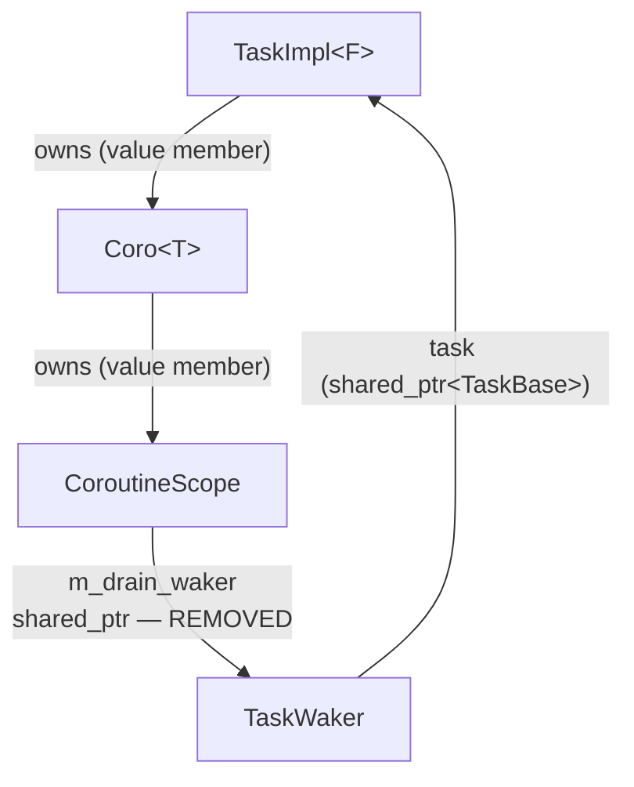
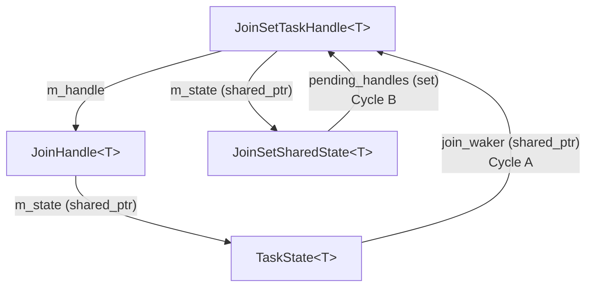
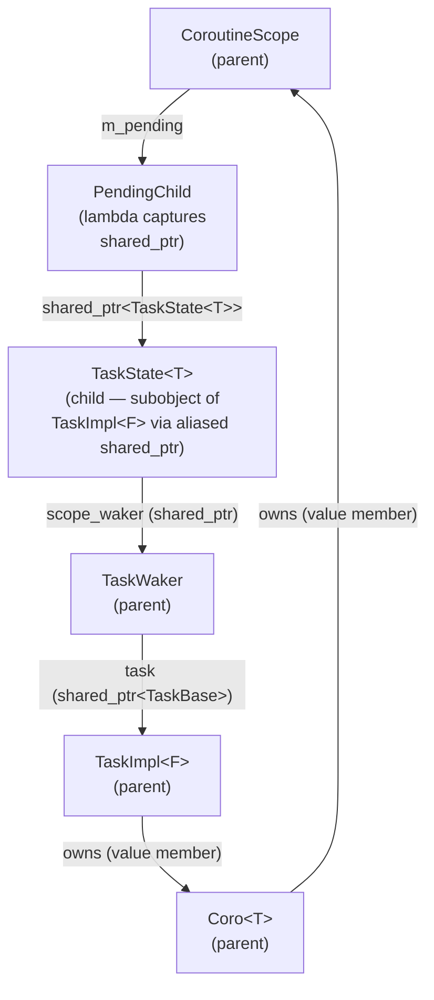
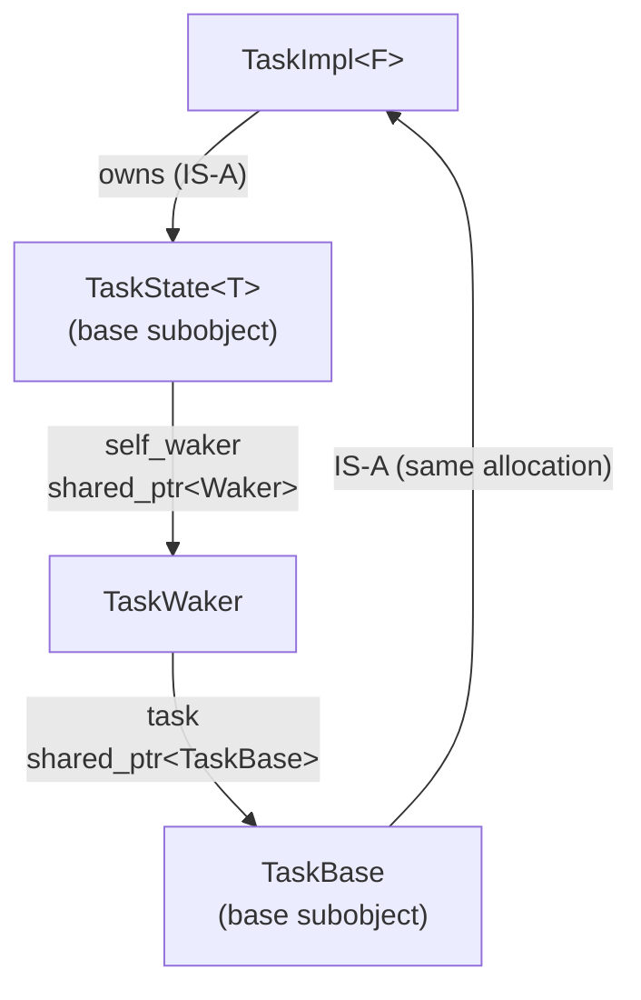

# Shared-Pointer Ownership Cycles

This document records the `shared_ptr` cycles discovered in the library, how each
was resolved, and the design constraints that make them easy to reintroduce. The long-
term goal is a principled ownership model — possibly using `weak_ptr` at the right
seam points — that structurally prevents these cycles rather than relying on careful
manual cleanup.

---

## Background: why cycles appear

The executor, tasks, and futures need to keep each other alive across suspension
points. The natural tool is `shared_ptr`, but three-way shared ownership quickly
produces cycles that never reach a reference count of zero.

The fundamental tension is:

- A **suspended task** must be kept alive by something while it waits. The chosen
  mechanism is `TaskWaker::task` — the waker holds a `shared_ptr<TaskBase>` (aliased
  from the `TaskImpl<F>` allocation) and is stored by whoever will eventually wake the task.
- A **task's future** may itself store wakers (e.g. to wake child tasks or to
  be woken by them). Those wakers can point back to the same task.

Any path from a `TaskImpl<F>` through its owned future back to a `shared_ptr<TaskBase>`
referencing the same `TaskImpl<F>` is a cycle.

---

## Ownership graph overview

```
Executor (queue)
    └── shared_ptr<TaskBase>    ← aliased to TaskBase subobject of TaskImpl<F>
            └── TaskImpl<F>     (single make_shared allocation; inherits TaskBase + TaskState<T>)
                    └── F  (e.g. Coro<void>)
                            └── CoroutineScope  (value member)
                                    ├── vector<PendingChild>  (captures shared_ptr<TaskState<T>> of children)
                                    └── [DO NOT ADD: shared_ptr<Waker> m_drain_waker]  ← was the bug

TaskWaker  (Waker implementation used by executors)
    ├── shared_ptr<TaskBase>   ← aliased shared_ptr; same ref count as TaskImpl<F>
    └── Executor*

TaskBase  (base subobject of TaskImpl<F>)
    └── Executor*  owning_executor   ← raw ptr set by Executor::schedule(); executor outlives tasks

TaskState<T>  (base subobject of TaskImpl<F>; shared with JoinHandle via aliased shared_ptr)
    ├── shared_ptr<Waker>  join_waker    ← set by JoinHandle::poll(); points to whoever is awaiting
    └── shared_ptr<Waker>  scope_waker   ← set by CoroutineScope; points to parent task's TaskWaker

JoinHandle<T>
    ├── shared_ptr<TaskState<T>>   ← aliased from same TaskImpl<F> allocation; no extra heap object
    └── shared_ptr<TaskBase>       ← aliased from same TaskImpl<F> allocation; used by cancel()

JoinSetTaskHandle<T>  (implements Waker; is the join_waker for spawned tasks)
    ├── JoinHandle<T>                    ← m_handle; points to child TaskState<T>
    └── shared_ptr<JoinSetSharedState>   ← m_state; points back to the set

JoinSetSharedState<T>
    └── set<shared_ptr<JoinSetTaskHandle<T>>>  pending_handles
```

---

## Cycle 1 — `CoroutineScope::m_drain_waker` (fixed)

### The cycle

When a `Coro<T>` polls with pending children it calls:

```cpp
m_scope->set_drain_waker(ctx.getWaker()->clone())
```

`ctx.getWaker()` returns a `TaskWaker` whose `task` field is a `shared_ptr<TaskBase>`
pointing to the very task that owns this `Coro<T>`. If `set_drain_waker` stores that
waker as a member, the chain is:



All links except `m_drain_waker` are value/unique ownership. `m_drain_waker`
and `TaskWaker::task` are both `shared_ptr`. Together they form a cycle that keeps
`TaskImpl<F>` alive forever after the executor drops its last local ref.

### Why it went unnoticed

`m_drain_waker` was only ever **written**, never **read**. The waker is passed
directly to children via `child.set_scope_waker(waker)` (the parameter), so the
stored member was dead storage. It likely originated as a "keep-alive" guard under
the mistaken assumption that nothing else held the waker alive — but each child's
`TaskState::scope_waker` already holds its own clone.

### The fix

Remove `m_drain_waker` from `CoroutineScope` entirely. See [coro_scope.h](../include/coro/detail/coro_scope.h).

### The invariant to enforce going forward

> **Do not store a `TaskWaker` (or any `shared_ptr<Waker>` derived from
> `ctx.getWaker()`) inside any object that is transitively owned by the `TaskImpl<F>`
> being woken.**

Objects transitively owned by `TaskImpl<F>` include: the `F m_future` member,
`Coro<T>`, `CoroStream<T>`, `CoroutineScope`, and any future adaptor that stores
a sub-future by value.

Note: `TaskState::self_waker` was previously the mechanism for `JoinHandle::cancel()`
to wake a sleeping task. It was removed because it created exactly this cycle
(`TaskImpl → TaskState::self_waker → TaskWaker → TaskBase → TaskImpl`). See
"Cycle 4 — `TaskState::self_waker`" below for the replacement design.

---

## Cycle 2 — `JoinSetTaskHandle` ↔ `TaskState` (self-healing, documented for awareness)

### The cycle

When `JoinSet::add()` polls a `JoinHandle` to register a waker:

```cpp
detail::Context ctx(join_set_handle);
join_set_handle->m_handle.poll(ctx);   // sets TaskState::join_waker = join_set_handle
```

The resulting reference graph while a child task is pending:



**Cycle A:** `JoinSetTaskHandle → TaskState → JoinSetTaskHandle`
**Cycle B:** `JoinSetTaskHandle → JoinSetSharedState → JoinSetTaskHandle`

### Why these are currently safe

Both cycles have well-defined break points:

| Scenario | How Cycle A breaks | How Cycle B breaks |
|---|---|---|
| Task completes normally | `setResult/setDone/setException` moves `join_waker` out before calling `wake()` | `JoinSetTaskHandle::wake()` calls `pending_handles.erase(self)` |
| JoinSet dropped / cancelled | `cancel_pending()` calls `take_handle()` on each handle, moving `m_handle` out | `cancel_pending()` calls `pending_handles.clear()` |

After both cycles break, the remaining chain is linear:
```
(executor) ──► Task ──► TaskState ──► join_waker=null (cleared)
TaskState also held by (executor) until mark_done() fires
JoinSetTaskHandle ──► JoinSetSharedState    (no back-reference after pending_handles cleared)
```
Everything is freed when the executor processes the cancelled task and drops its refs.

### The risk

The cycles are safe **only** because both break points are always executed. Future
refactors that skip `cancel_pending()` (e.g. in a new destructor path), or that call
`JoinHandle::poll()` with a waker that is itself owned by `TaskState`, could make one
of these cycles permanent.

---

## Cycle 3 — `CoroutineScope::m_pending` ↔ `TaskState::scope_waker` (transient, by design)

After `set_drain_waker()` installs the parent's waker on each child:



This cycle persists from the moment `set_scope_waker` is called until the child calls
`mark_done()`/`setDone()`/`setResult()`, which moves `scope_waker` out (breaking the
right-hand side of the cycle). After that the `PendingChild` entry is swept from
`m_pending` on the next call to `has_pending()` or `set_drain_waker()` (breaking the
left-hand side).

This is **intentional**: the child must hold the parent's waker alive so it can fire
it on completion. The parent must hold the child's state alive so it can check
`is_done()`. The cycle dissolves naturally as children complete. It only becomes a
problem if a child **never** reaches a terminal state (i.e. a task that is leaked at
the executor level — a separate problem).

---

## Design strategies for long-term improvement

The following approaches should be evaluated when undertaking a proper ownership redesign.

### Strategy 1: `weak_ptr` at the `TaskWaker::task` seam

`TaskWaker` holds a `shared_ptr<TaskBase>` to keep the task alive while parked. This is
the root cause of Cycle 1. If instead `TaskWaker` held a `weak_ptr<TaskBase>`, no future
or scope could form a cycle back to the task through the waker.

The downside: when a child fires the waker, it must `lock()` the `weak_ptr` to
re-enqueue the task. If the task has already been freed (e.g. cancelled and dropped
by the executor), `lock()` returns null — which is the correct no-op behavior. This
is actually safer than the current design.

```cpp
struct TaskWaker final : detail::Waker {
    std::weak_ptr<detail::TaskBase> task;   // weak, not shared
    Executor*                       executor;

    void wake() override {
        if (auto t = task.lock())
            executor->enqueue(std::move(t));
    }
};
```

**Implication:** the executor queue (`m_ready`) and the `task` local variable in
`poll_ready_tasks()` must together keep the task alive while it is running or
queued. They already do — the executor holds `shared_ptr<TaskBase>` in its queue and
as a local variable during the poll loop. The waker is not needed to keep the task
alive in those states.

When a task parks (Running → Idle after returning Pending), the executor does
`task.reset()`. With a `weak_ptr` waker this means the task ref count drops to zero
and the `TaskImpl<F>` is immediately destroyed — which is wrong, since we expect a
child to wake it.

**Resolution:** the executor must keep a separate `shared_ptr<TaskBase>` in an "idle
set" (or a `suspended_tasks` map keyed by task ID) when a task parks. When the
waker fires, the task is moved from idle → ready. This is already the Tokio/async-std
model and is more explicit about task lifetime than the current implicit "waker owns
the parked task" scheme.

### Strategy 2: `weak_ptr` at the `JoinSetTaskHandle::m_state` seam

`JoinSetTaskHandle` holds a `shared_ptr<JoinSetSharedState>` so it can post results
and wake the consumer. If this were a `weak_ptr`, Cycle B disappears entirely:

```cpp
std::weak_ptr<JoinSetSharedState<T>> m_state;  // weak
```

In `wake()`, the handle would `lock()` the weak pointer. If the `JoinSet` has already
been destroyed (`m_state` expired), the lock fails and the wake is a no-op — which is
already the intended behavior (closing flag protects against the same race currently).
This would be strictly safer and eliminate the need for the `closing` flag.

### Strategy 3: separate "suspended task registry" in the executor

Currently, the only thing keeping a parked task alive is the waker(s) stored by
futures. This creates pressure on every future to hold a `shared_ptr<TaskBase>`,
which is the source of all the cycles above.

An alternative: the executor maintains an explicit `map<TaskId, shared_ptr<Task>>`
for suspended tasks. Wakers hold only a `TaskId` (an integer) and a raw pointer (or
weak reference) to the executor. On wake, the executor looks up the ID, moves the
task to the ready queue, and removes it from the suspended map.

This fully decouples task lifetime from waker lifetime, eliminating the entire class
of cycle. It is also more debuggable (the suspended set can be inspected) and more
correct (a waker for a dead task is a no-op rather than a dangling access).

---

---

## Cycle 4 — `TaskState::self_waker` (fixed)

### The cycle

`TaskImpl::poll()` previously stored a clone of its own `TaskWaker` into
`TaskState::self_waker` on every non-cancelled poll, so that `JoinHandle::cancel()`
could call `wake()` on a sleeping task. This created a permanent strong cycle:



The cycle would only break when a terminal method (`mark_done`, `setResult`,
`setException`) cleared `self_waker`. If a task was cancelled and the cancel path
had a bug, or in future code that added a new terminal path, the cycle could survive.

### The fix

`self_waker` was removed from `TaskState`. `JoinHandle` now holds a second aliased
`shared_ptr<TaskBase>` (`m_task`, same `TaskImpl<F>` allocation as `m_state`) and
performs the wakeup CAS loop directly — the same logic as `TaskWaker::wake()`:

```cpp
// In JoinHandle::cancel():
m_state->cancelled.store(true, std::memory_order_relaxed);
// Idle → Notified: enqueue.  Running → RunningAndNotified: worker re-enqueues.
// Notified / RunningAndNotified / Done: already in-flight or finished — no-op.
```

`TaskBase::owning_executor` (a raw `Executor*`, set by `Executor::schedule()`) gives
`cancel()` the routing information it needs without holding any `shared_ptr` that
could form a new cycle.

### Ownership graph after the fix

```
JoinHandle → shared_ptr<TaskBase>  ─┐
                                    ├─ same make_shared<TaskImpl<F>> allocation
JoinHandle → shared_ptr<TaskState> ─┘
```

Neither pointer creates a cycle: `JoinHandle` is external to the task and nothing
inside the task points back to `JoinHandle`.

`TaskWaker` (held by futures awaiting the task) still holds `shared_ptr<TaskBase>`.
This is a transient reference — it lives only while something is awaiting the task,
and is dropped when that future resolves. No task-internal object holds `TaskWaker`.

### Edge cases

The following situations result in degraded cancellation behavior. They are all safe
(no UAF, no leak) but cancellation may not be instantaneous. These are documented
here for future revisitation.

**1. `m_task` is null in `JoinHandle`**

`m_task` is null after a move-from or `detach()`. `cancel()` guards against this and
is a no-op for the wakeup portion. The `cancelled` flag is still set, so the task
will self-terminate on its next natural wakeup.

Future code paths that construct `JoinHandle` with only a `TaskState` (one-arg
constructor) will also fall into this case. The one-arg constructor is retained
for backward compatibility; any call site that doesn't pass `TaskBase` should be
treated as a deliberate trade-off and commented accordingly.

**2. `owning_executor` is null**

Set by `Executor::schedule()`. Can be null if a `TaskImpl` is constructed but never
scheduled (not possible through any public spawn path today, but possible in tests
that create tasks manually). `cancel()` sets `cancelled=true` but cannot enqueue.
The task self-terminates on its next natural wakeup.

**3. Executor has already been destroyed**

`owning_executor` is a raw `Executor*`. The executor always outlives its tasks in
normal usage (the executor owns the thread pool that runs them), so this is safe.
If a task somehow outlives its executor (e.g. a JoinHandle held in a long-lived
scope while the Runtime is destroyed), calling `cancel()` after executor destruction
would be UB. The correct fix is to ensure the Runtime outlives all JoinHandles.

---

## Summary of known cycles and their status

| Cycle | Objects involved | Status | Fix applied |
|---|---|---|---|
| 1 | `TaskImpl → Coro → CoroutineScope → TaskWaker → TaskImpl` | **Fixed** | Removed `m_drain_waker` from `CoroutineScope` |
| 2A | `JoinSetTaskHandle → TaskState<T> → JoinSetTaskHandle` | Self-healing | Break points in `wake()` and `cancel_pending()` |
| 2B | `JoinSetTaskHandle → JoinSetSharedState → JoinSetTaskHandle` | Self-healing | Break points in `wake()` and `cancel_pending()` |
| 3 | `CoroutineScope → TaskState<T>_child → TaskWaker_parent → TaskImpl_parent → CoroutineScope` | Transient by design | Dissolved when child calls `mark_done()` |
| 4 | `TaskImpl → TaskState::self_waker → TaskWaker → TaskBase → TaskImpl` | **Fixed** | Removed `self_waker`; `JoinHandle` holds `TaskBase` directly |

Any new future or scope adaptor that stores a `shared_ptr<Waker>` derived from
`ctx.getWaker()` should be audited against the ownership graph above before merging.
