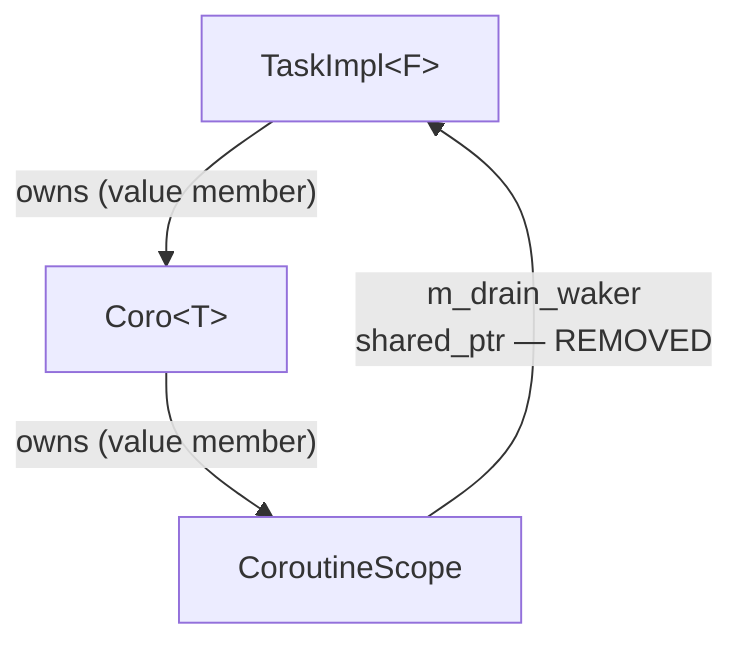
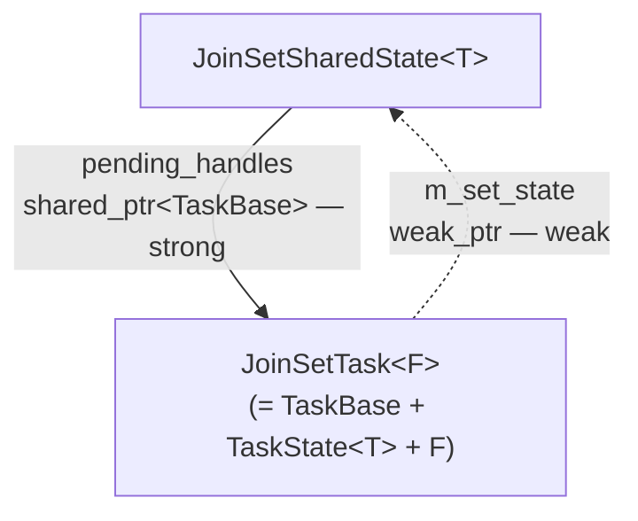
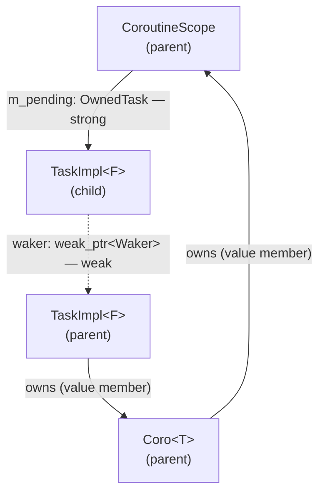
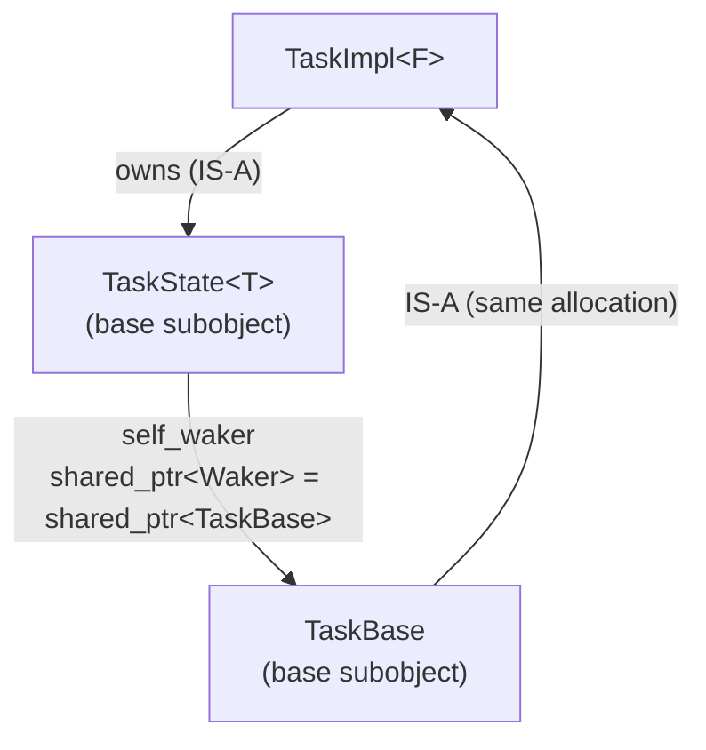

# Shared-Pointer Ownership Cycles

This document records the `shared_ptr` cycles discovered in the library, how each
was resolved, and the design constraints that make them easy to reintroduce. The long-
term goal is a principled ownership model — possibly using `weak_ptr` at the right
seam points — that structurally prevents these cycles rather than relying on careful
manual cleanup.

---

## Background: why cycles appear

The executor, tasks, and futures need to keep each other alive across suspension
points. The natural tool is `shared_ptr`, but three-way shared ownership quickly
produces cycles that never reach a reference count of zero.

The fundamental tension is:

- A **suspended task** must be kept alive by something while it waits. The chosen
  mechanism is the waker clone — `TaskBase` IS the `Waker` (it inherits both `Waker`
  and `enable_shared_from_this`), so `clone()` returns a `shared_ptr<TaskBase>` without
  any extra allocation. Leaf futures store these clones and call `wake()` on them.
- A **task's future** may itself store wakers (e.g. to wake child tasks or to
  be woken by them). Those wakers can point back to the same task.

Any path from a `TaskImpl<F>` through its owned future back to a `shared_ptr<TaskBase>`
referencing the same `TaskImpl<F>` is a cycle.

---

## Ownership graph overview

```
Executor (queue)
    └── shared_ptr<TaskBase>    ← temporary ref (Notified/Running only); dropped when task parks

OwnedTask                       ← sole persistent strong reference to a task
    └── shared_ptr<TaskBase>    ← aliased to TaskBase subobject of TaskImpl<F>
            └── TaskImpl<F>     (single make_shared allocation; inherits TaskBase + TaskState<T>)
                    └── F  (e.g. Coro<void>)
                            └── CoroutineScope  (value member)
                                    └── vector<OwnedTask>  (owns child tasks until they complete)

TaskBase  (base subobject of TaskImpl<F>; IS the Waker via enable_shared_from_this)
    ├── Executor*  owning_executor   ← raw ptr set by Executor::schedule(); executor outlives tasks
    └── shared_ptr<void>  self_owned ← detached-task self-reference; cleared on terminal state

TaskState<T>  (base subobject of TaskImpl<F>; shared with JoinHandle via aliased shared_ptr)
    └── weak_ptr<Waker>  waker   ← set by JoinHandle::poll() or CoroutineScope; weak — no cycle

JoinHandle<T>
    ├── shared_ptr<TaskState<T>>   ← aliased from same TaskImpl<F> allocation; no extra heap object
    └── OwnedTask m_owned          ← sole persistent lifetime anchor for the task

JoinSetTask<F>  (single allocation; inherits TaskImpl<F> = TaskBase + TaskState<T> + F)
    └── weak_ptr<JoinSetSharedState<T>>  ← m_set_state; weak — breaks the ownership cycle

JoinSetSharedState<T>
    ├── set<shared_ptr<TaskBase>>      pending_handles   ← running tasks (strong lifetime anchors)
    └── list<shared_ptr<TaskState<T>>> idle_handles      ← completed tasks (aliased into JoinSetTask allocation)
```

---

## Cycle 1 — `CoroutineScope::m_drain_waker` (fixed)

### The cycle

When a `Coro<T>` polls with pending children it calls:

```cpp
m_scope->set_drain_waker(ctx.getWaker()->clone())
```

`ctx.getWaker()` returns a `shared_ptr<TaskBase>` (the task IS the waker) pointing to
the very task that owns this `Coro<T>`. If `set_drain_waker` stores that waker as a
member, the chain is:



All links except `m_drain_waker` are value/unique ownership. `m_drain_waker` is a
`shared_ptr<TaskBase>` pointing back to the same `TaskImpl<F>`, forming a cycle that
keeps it alive forever after the executor drops its last local ref.

### Why it went unnoticed

`m_drain_waker` was only ever **written**, never **read**. The waker is passed
directly to children via `child.set_scope_waker(waker)` (the parameter), so the
stored member was dead storage. It likely originated as a "keep-alive" guard under
the mistaken assumption that nothing else held the waker alive — but each child's
`TaskState::scope_waker` already holds its own clone.

### The fix

Remove `m_drain_waker` from `CoroutineScope` entirely. See [coro_scope.h](../include/coro/detail/coro_scope.h).

### The invariant to enforce going forward

> **Do not store a waker clone (any `shared_ptr<Waker>` derived from `ctx.getWaker()`)
> inside any object that is transitively owned by the `TaskImpl<F>` being woken.**

Objects transitively owned by `TaskImpl<F>` include: the `F m_future` member,
`Coro<T>`, `CoroStream<T>`, `CoroutineScope`, and any future adaptor that stores
a sub-future by value.

Note: `TaskState::self_waker` was previously the mechanism for `JoinHandle::cancel()`
to wake a sleeping task. It was removed because it created exactly this cycle
(`TaskImpl → TaskState::self_waker → shared_ptr<TaskBase> → TaskImpl`). See
"Cycle 4 — `TaskState::self_waker`" below for the replacement design.

---

## Cycle 2 — `JoinSetSharedState` ↔ `JoinSetTask` (structurally eliminated)

### Potential cycle

`JoinSetSharedState::pending_handles` holds strong `shared_ptr<TaskBase>` references to
running tasks. Each `JoinSetTask` needs to call back into its owning `JoinSetSharedState`
when it completes. A naive back-reference would form a cycle:

```
JoinSetSharedState → pending_handles → JoinSetTask → JoinSetSharedState
```

### How it is eliminated

`JoinSetTask<F>` stores a `weak_ptr<JoinSetSharedState<T>>` rather than a strong reference.
The reference graph while a child task is pending:



The weak edge does not contribute to the reference count. When `JoinSet` is destroyed its
`m_state shared_ptr<JoinSetSharedState>` drops; if no `JoinSetDrainFuture` is alive the
shared state is freed. Subsequent `on_task_complete()` calls find `lock() == null` and are
silent no-ops. The executor's temporary strong reference keeps each `JoinSetTask` alive
through the remainder of its `poll()` call.

---

## Cycle 3 — `CoroutineScope::m_pending` ↔ `TaskState::waker` (eliminated)

After `set_waker()` installs the parent's waker on each child, the graph is:



The dashed (weak) edge does not contribute to the reference count, so no cycle exists.
`waker` is a `weak_ptr<Waker>` stored in `TaskState<T>` and cleared by all terminal
methods. `CoroutineScope` holds each child via `OwnedTask` (the sole persistent strong
reference) and sweeps it once `is_complete()` returns true.

---

## Ownership redesign

The strategies described in this section have been superseded. See
[task_ownership.md](task_ownership.md) for the adopted design: `OwnedTask` (a
move-only wrapper that is the sole persistent strong reference to a task) combined
with `WeakWaker` (a `weak_ptr`-backed waker used for pure notification). This
eliminates Cycle 3 structurally and Cycle 2B as a consequence, without requiring a
suspended-task registry in the executor.

---

## Cycle 4 — `TaskState::self_waker` (fixed)

### The cycle

`TaskImpl::poll()` previously stored a clone of its own waker into
`TaskState::self_waker` on every non-cancelled poll, so that `JoinHandle::cancel()`
could call `wake()` on a sleeping task. This created a permanent strong cycle:



The cycle would only break when a terminal method (`mark_done`, `setResult`,
`setException`) cleared `self_waker`. If a task was cancelled and the cancel path
had a bug, or in future code that added a new terminal path, the cycle could survive.

### The fix

`self_waker` was removed from `TaskState`. `JoinHandle` now holds an `OwnedTask m_owned`
(the sole persistent strong reference to the task) and performs the wakeup CAS loop
directly via `m_owned.get()` — the same logic as `TaskBase::wake()`:

```cpp
// In JoinHandle::cancel():
m_state->cancelled.store(true, std::memory_order_relaxed);
auto task = m_owned.get();
// Idle → Notified: enqueue.  Running → RunningAndNotified: worker re-enqueues.
// Notified / RunningAndNotified / Done: already in-flight or finished — no-op.
```

`TaskBase::owning_executor` (a raw `Executor*`, set by `Executor::schedule()`) gives
`cancel()` the routing information it needs without holding any `shared_ptr` that
could form a new cycle.

### Ownership graph after the fix

```
JoinHandle → OwnedTask ────────────┐
                                   ├─ same make_shared<TaskImpl<F>> allocation
JoinHandle → shared_ptr<TaskState> ┘
```

Neither reference creates a cycle: `JoinHandle` is external to the task and nothing
inside the task points back to it.

### Edge cases

The following situations result in degraded cancellation behavior. They are all safe
(no UAF, no leak) but cancellation may not be instantaneous.

**1. `m_owned` is empty in `JoinHandle`**

`m_owned` is empty after a move-from or `detach()`. `cancel()` guards against this and
is a no-op for the wakeup portion. The `cancelled` flag is still set, so the task
will self-terminate on its next natural wakeup.

**2. `owning_executor` is null**

Set by `Executor::schedule()`. Can be null if a `TaskImpl` is constructed but never
scheduled (not possible through any public spawn path today, but possible in tests
that create tasks manually). `cancel()` sets `cancelled=true` but cannot enqueue.
The task self-terminates on its next natural wakeup.

**3. Executor has already been destroyed**

`owning_executor` is a raw `Executor*`. The executor always outlives its tasks in
normal usage (the executor owns the thread pool that runs them), so this is safe.
If a task somehow outlives its executor (e.g. a JoinHandle held in a long-lived
scope while the Runtime is destroyed), calling `cancel()` after executor destruction
would be UB. The correct fix is to ensure the Runtime outlives all JoinHandles.

---

## Summary of known cycles and their status

| Cycle | Objects involved | Status | Fix applied |
|---|---|---|---|
| 1 | `TaskImpl → Coro → CoroutineScope → shared_ptr<Waker> → TaskImpl` | **Eliminated** | Removed `m_drain_waker` from `CoroutineScope`; structurally prevented by `weak_ptr` waker storage |
| 2 | `JoinSetSharedState → pending_handles → JoinSetTask → JoinSetSharedState` | **Eliminated** | `JoinSetTask::m_set_state` is `weak_ptr<JoinSetSharedState>`; no strong back-reference exists |
| 3 | `CoroutineScope → TaskState_child → waker → TaskBase_parent → TaskImpl_parent` | **Eliminated** | `TaskState::waker` is `weak_ptr<Waker>`; weak edge does not close the cycle |
| 4 | `TaskImpl → TaskState::self_waker → shared_ptr<Waker> → TaskImpl` | **Eliminated** | Removed `self_waker`; structurally prevented by `weak_ptr` waker storage |
| Detached self-ref | `TaskImpl → self_owned → TaskImpl` | Intentional | Breaks at task completion; see [task_ownership.md](task_ownership.md) |

See [task_ownership.md](task_ownership.md) for the ownership model that eliminates
Cycles 2B and 3. Any new future or scope adaptor that stores a `shared_ptr<Waker>`
derived from `ctx.getWaker()` should be audited against the ownership graph in that
document before merging.
