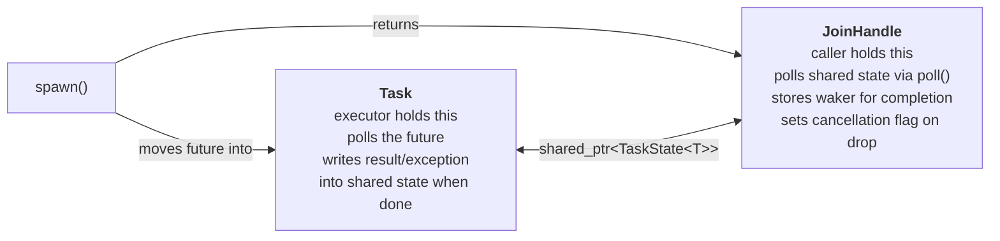

# Task and Executor

## Overview

`Task`, `Executor`, and `Runtime` form the scheduling layer of the library. There are two
distinct user-facing types:

- **`Coro<T>`** — the return type of coroutine functions. Satisfies `Future<T>`. Owns the
  coroutine frame via a `promise_type`.
- **`CoroStream<T>`** — the return type of async generator functions. Satisfies `Stream<T>`.
  Uses `co_yield` to produce values and can `co_await` futures internally.
- **`JoinHandle<T>`** — returned by `spawn()`. Satisfies `Future<T>`. Allows the caller to
  `co_await` the result of a spawned task.
- **`Synchronize`** — structured concurrency scope inspired by Julia's `@sync`. Guarantees
  all tasks spawned within it complete before the scope exits, even if an exception unwinds
  the parent. The safe alternative to `runtime.spawn()` when child tasks share parent data.

**`Task`** is an internal, type-erased heap-allocated unit of work. It wraps any `Future<T>`,
not just coroutines. Users never construct a `Task` directly — `spawn()` creates one
internally.

The `Executor` drives tasks by polling them. The `Runtime` bundles the executor, thread pool,
and libuv I/O reactor into a single user-facing object.

## Requirements

- `Coro<T>` is the return type of coroutine functions and satisfies `Future<T>`
- `CoroStream<T>` is the return type of async generator functions and satisfies `Stream<T>`
- `spawn()` accepts **any** type satisfying `Future<T>`, not only `Coro<T>`
- `spawn()` returns a `JoinHandle<T>` that can be `co_await`ed to retrieve the result
- `Task` is an internal type-erased wrapper — not part of the public API
- The executor interface is abstract, allowing alternative scheduler implementations
- The first concrete executor is single-threaded — simpler to implement and useful for testing and debugging
- The second concrete executor uses a multi-threaded work-stealing scheduler
- The `Runtime` owns the thread pool and libuv event loop
- `co_await future` inside a `Coro` or `CoroStream` coroutine must correctly integrate with the poll model
- `Synchronize` guarantees all child tasks complete before the scope exits, including during exception unwinding
- Dropping a `JoinHandle` without awaiting it cancels the task and detaches
- `JoinHandle::detach()` explicitly detaches without cancelling — the task runs to completion independently and the parent loses all ability to synchronize or cancel it

## Proposed Design

### Runtime vs Executor split

- **`Executor`** — abstract base responsible only for scheduling: accepts type-erased tasks
  and decides when to poll them. Does not own threads or I/O.
- **`Runtime`** — user-facing object that owns the thread pool, libuv event loop, and a
  concrete `Executor`. Provides `spawn()` and `block_on()`.

```cpp
Runtime rt;
rt.block_on(my_async_main());
```

### Coro<T> — coroutine return type

`Coro<T>` is the return type of coroutine functions. It holds a `std::coroutine_handle` and
satisfies `Future<T>` so it can be passed to `spawn()` or `block_on()` like any other future.

```cpp
template<typename T>
class Coro {
public:
    using OutputType = T;

    struct promise_type { ... };  // C++20 coroutine promise

    PollResult<T> poll(Context& ctx);
};

// Usage
Coro<int> compute()
{
    co_return 42;
}

Coro<void> my_async_main()
{
    JoinHandle<int> h = runtime.spawn(compute());   // Coro<int> — accepted as any Future
    JoinHandle<int> h2 = runtime.spawn(ImmediateFuture<int>(7));  // hand-written Future also works
    int result = co_await h;
}
```

When the executor calls `coro.poll(ctx)`:
1. The `Context` is stored in the `promise_type` so it is accessible inside the coroutine.
2. The coroutine is resumed via `coroutine_handle.resume()`.
3. If the coroutine suspends (via `co_await inner_future`), `poll` returns `Pending`.
4. If the coroutine reaches `co_return value`, `poll` returns `Ready(value)`.
5. If the coroutine throws, `poll` returns `Error(current_exception)`.

### CoroStream<T, HasFinalValue> — async generator return type

`CoroStream<T, bool HasFinalValue = false>` is the return type of async generator functions.
`co_yield` produces stream items. When `HasFinalValue = true`, `co_return value` emits one
final item of the same type `T` before the stream exhausts — the consumer sees it as just
another item from `poll_next`. There is no separate return channel; both template parameters
share the same type, keeping `poll_next`'s signature unchanged.

`CoroStream<T, HasFinalValue>` always satisfies `Stream<T>`, so it works anywhere a `Stream`
is accepted regardless of `HasFinalValue`.

```cpp
template<typename T, bool HasFinalValue = false>
class CoroStream {
public:
    using ItemType = T;

    struct promise_type { ... };  // supports yield_value, await_transform,
                                  // and return_value (when HasFinalValue = true)

    PollResult<std::optional<T>> poll_next(Context& ctx);
};
```

When `poll_next(ctx)` is called:
1. The `Context` is stored in `promise_type`, same as `Coro`.
2. The coroutine resumes until it hits `co_yield value`, `co_return`, or throws.
3. `co_yield value` — suspends, returns `Ready(some(value))`.
4. `co_return value` (`HasFinalValue = true`) — emits the value as the final item,
   returning `Ready(some(value))`; the next call returns `Ready(nullopt)`.
5. Falling off the end or `co_return` void (`HasFinalValue = false`) — returns `Ready(nullopt)`.
6. Unhandled exception — returns `Error(current_exception)`.

```cpp
// Simple generator — no final value
CoroStream<int> range(int from, int to)
{
    for (int i = from; i < to; ++i)
        co_yield i;
}

// Generator with final value — yields values, last item is the running total
CoroStream<int, true> running_sum(std::vector<int> data)
{
    int sum = 0;
    for (int x : data) {
        sum += x;
        co_yield x;
    }
    co_return sum;  // emitted as the last item before exhaustion
}

Coro<void> consumer()
{
    auto s = running_sum({1, 2, 3});
    while (auto item = co_await next(s)) {
        // sees: 1, 2, 3, then 6 (the sum) as the last item, then nullopt
        process(*item);
    }
}
```

`CoroStream` is consumed via `next()` — it is never spawned directly. If a stream needs to
run in the background, wrap a `Coro<void>` around it that drives the stream and pushes
results into a channel.

### co_await integration

Any type satisfying `Future<F>` can be `co_await`ed inside a `Coro` or `CoroStream`
coroutine via `await_transform` in the `promise_type`. `FutureAwaitable` is not exposed
via a free `operator co_await` — it is only reachable through the promise. This restricts
`co_await` to library coroutine types and gives a clear compile error if someone tries to
`co_await` a `Future` inside a third-party coroutine whose `promise_type` knows nothing
about this library.

```cpp
template<Future F>
struct FutureAwaitable {
    bool await_ready();                              // polls once; returns true if already Ready
    void await_suspend(std::coroutine_handle<> h);  // stores handle; returns to executor
    typename F::OutputType await_resume();           // re-polls; returns value or rethrows
};

// Inside Coro::promise_type and CoroStream::promise_type:
template<Future F>
FutureAwaitable<F> await_transform(F&& future);

// Anything that does not satisfy Future is rejected at compile time:
template<typename T> requires (!Future<T>)
void await_transform(T&&) = delete;
```

### SpawnBuilder and StreamSpawnBuilder

`runtime.spawn(x)` returns a builder rather than immediately submitting the task. The builder
exposes configuration setters and a terminal `.submit()` that consumes the builder, submits
the task, and returns the handle. `runtime.spawn()` is overloaded on `Future` vs `Stream`,
returning different builder types so `buffer()` is only available when spawning a stream.

```cpp
template<Future F>
class SpawnBuilder {
public:
    SpawnBuilder& name(std::string name);
    JoinHandle<typename F::OutputType> submit();  // consumes builder, submits task
};

template<Stream S>
class StreamSpawnBuilder {
public:
    StreamSpawnBuilder& name(std::string name);
    StreamSpawnBuilder& buffer(std::size_t size);  // bounded channel capacity (default: 64)
    StreamHandle<typename S::ItemType> submit();
};
```

Usage:

```cpp
Coro<void> example()
{
    JoinHandle<int> h = runtime.spawn(compute())
        .name("compute-task")
        .submit();

    StreamHandle<Packet> s = runtime.spawn(read_packets(sock))
        .name("packet-reader")
        .buffer(128)
        .submit();

    int result = co_await h;
    while (auto pkt = co_await next(s)) { process(*pkt); }
}
```

### JoinHandle<T> and StreamHandle<T>

`JoinHandle<T>` satisfies `Future<T>` and is marked `[[nodiscard]]` — discarding it drops
and cancels the task immediately, which is almost never intentional.

The task and its `JoinHandle` share a ref-counted `TaskState<T>` object. This shared state
manages the result slot, the waker, and the cancellation flag:



`JoinHandle` exposes explicit control over the task's lifetime:

```cpp
template<typename T>
class [[nodiscard]] JoinHandle {
public:
    // Satisfies Future<T> — co_await to get the result
    PollResult<T> poll(Context& ctx);

    // Detaches without cancelling. The task runs to completion independently.
    // After calling detach(), the JoinHandle is consumed and the result is discarded.
    // The parent can no longer synchronize with or cancel the task.
    void detach() &&;

    // Destructor: cancels the task if not yet awaited or detached.
    ~JoinHandle();
};
```

`TaskState<T>` must handle these scenarios safely:
- Task completes before `JoinHandle` is polled — result stored, handle reads it on next poll
- `JoinHandle` polled before task completes — waker registered, task calls `wake()` on completion
- `JoinHandle` dropped — cancellation flag set; task checks flag at each poll and exits early
- `JoinHandle::detach()` called — handle releases its reference to `TaskState`; task continues unaffected
- Task throws — exception stored in `TaskState`, re-thrown when `JoinHandle` is `co_await`ed

`StreamHandle<T>` satisfies `Stream<T>` and is also `[[nodiscard]]`. Internally it is the
consumer end of a bounded channel. The spawned task drives `poll_next()` on the original
stream and sends values through the channel, suspending when the buffer is full to preserve
back-pressure.

### Synchronize

`Synchronize` is a structured concurrency scope inspired by Julia's `@sync` / `@async`
pattern. Any tasks spawned through a `Synchronize` scope are guaranteed to complete before
the scope's `co_await` returns — including when an exception unwinds the parent coroutine.
This makes it the safe choice when child tasks need to reference data owned by the parent.

```cpp
Coro<void> parent()
{
    int local = 42;

    co_await Synchronize([&](Synchronize& sync) -> Coro<void> {
        // Safe to capture &local — Synchronize guarantees it outlives all children.
        sync.spawn(child(local)).name("child-a").submit();
        sync.spawn(other_child(local)).name("child-b").submit();
        // co_await other futures here too
    });
    // All children are guaranteed finished here, even if an exception was thrown above.
}
```

`Synchronize::spawn()` has the same builder interface as `Runtime::spawn()`. Internally it
uses `current_runtime()` (the thread-local runtime) to submit tasks, the same mechanism as
the free `spawn()` function. When the `Synchronize` coroutine is `co_await`ed, it drives all
child tasks to completion and re-throws the first exception encountered (if any) after all
children have finished.

`Synchronize` is the idiomatic way to structure fan-out / fan-in patterns:

```cpp
Coro<void> fetch_all(std::vector<Url> urls)
{
    std::vector<Result> results(urls.size());

    co_await Synchronize([&](Synchronize& sync) -> Coro<void> {
        for (std::size_t i = 0; i < urls.size(); ++i)
            sync.spawn(fetch(urls[i], results[i])).submit();
    });
    // All fetches done, results populated.
    process(results);
}
```

### JoinHandle lifetime options

There are three ways to relinquish a `JoinHandle`, with different effects on the child task:

| Action | Effect on task |
|---|---|
| `co_await handle` | Waits for completion, returns result or rethrows exception |
| `handle.detach()` | Task runs to completion; result is discarded; no cancellation |
| Drop (destructor) | Cancellation flag set; task exits at next poll; result discarded |

`detach()` is the explicit fire-and-forget path. It is still subject to the same convention
as `spawn()` — the detached task must own all its data. Use `Synchronize` when the task
needs to reference parent-owned data.

This three-way design mirrors Julia's pattern extended with explicit detach:
- `runtime.spawn().submit()` + `co_await` → synchronize with result
- `runtime.spawn().submit()` + `.detach()` → fire and forget, task runs to completion
- `runtime.spawn().submit()` + drop → cancel and discard

### Internal Task type

`Task` is a type-erased, heap-allocated wrapper around any `Future`. It is created by
`spawn()` and held by the executor. Users never interact with it directly.

```cpp
// Internal — not public API
class Task {
public:
    void poll(Context& ctx);   // type-erased poll dispatch
    // ...
};
```

### Abstract Executor interface

```cpp
class Executor {
public:
    virtual ~Executor();
    virtual void schedule(std::unique_ptr<Task> task) = 0;
};
```

### Single-threaded executor (first implementation)

Runs all tasks on a single thread — the thread that calls `Runtime::block_on()` or
`Runtime::run()`. No synchronization is needed between tasks since only one thread is
ever polling. This makes it straightforward to implement and invaluable for testing and
debugging (deterministic scheduling, no data races).

- Single task queue (a simple FIFO)
- Tasks are polled one at a time on the calling thread
- libuv event loop is driven on the same thread between polls
- `spawn()` pushes to the queue; waking a task re-enqueues it

Each task moves through four states: **Scheduled** (in the ready queue) → **Running**
(inside `poll()`) → **Suspended** (parked, waiting for a waker) → **Complete** (freed).
A special case is the self-wake: a future that calls `waker->wake()` from inside its own
`poll()`. At that point the task is Running, not yet in the suspended map, so a naive
`wake_task` would silently drop the call. The executor tracks the currently-running task's
key and a `woken` flag; if `wake()` is called while Running the flag is set, and after
`poll()` returns the task is re-enqueued rather than parked. This mirrors the
`RUNNING | SCHEDULED` bitmask transition in Tokio's task harness, without needing atomics
since only one thread is ever active.

### Work-stealing executor (second implementation)

- N worker threads (default: hardware concurrency), each with a local double-ended queue
- New tasks are pushed to the spawning thread's local queue
- When a thread's queue is empty it attempts to steal from the back of another thread's queue
- A global overflow queue handles cross-thread spawns when no local thread context exists

### Runtime

```cpp
class Runtime {
public:
    explicit Runtime(std::size_t num_threads = std::thread::hardware_concurrency());

    // Runs future on the calling thread, blocking until it completes. Drives the libuv loop.
    // Intended for use in main() to launch the top-level coroutine.
    template<Future F>
    typename F::OutputType block_on(F future);

    // Returns a builder for configuring and submitting a future as a task.
    template<Future F>
    [[nodiscard]] SpawnBuilder<F> spawn(F future);

    // Returns a builder for configuring and submitting a stream as a background task.
    template<Stream S>
    [[nodiscard]] StreamSpawnBuilder<S> spawn(S stream);
};
```

### Free spawn() function

A free `spawn()` function mirrors Tokio's `tokio::spawn()`. It retrieves the thread-local
`Runtime` and delegates to its `spawn()` member. This is the idiomatic way to spawn tasks
from within a running coroutine without passing a `Runtime` reference everywhere.

```cpp
// Sets the thread-local runtime for the calling thread.
// Called internally by Runtime::block_on() and worker thread startup.
void set_current_runtime(Runtime* rt);

// Returns the thread-local runtime. Throws if called outside a runtime context.
Runtime& current_runtime();

// Free spawn — equivalent to current_runtime().spawn(std::move(future))
template<Future F>
[[nodiscard]] SpawnBuilder<F> spawn(F future);

template<Stream S>
[[nodiscard]] StreamSpawnBuilder<S> spawn(S stream);
```

Usage:

```cpp
Coro<void> my_coro()
{
    // No need to pass runtime around — uses thread-local runtime implicitly
    JoinHandle<int> h = spawn(compute()).name("compute").submit();
    int result = co_await h;
}
```

## Design Considerations

### CoroStream promise_type

`CoroStream<T, HasFinalValue>::promise_type` must support `yield_value(T)` (for `co_yield`),
`return_value(T)` (when `HasFinalValue = true`) or `return_void()` (when `HasFinalValue =
false`), and `await_transform` (for `co_await` inside the body). These are independent and
compose without conflict in C++20.

The main differences from `Coro::promise_type`:
- `initial_suspend` returns `suspend_always` — the generator does not run until first polled
- `yield_value(T)` stores the yielded value and suspends
- When `HasFinalValue = true`, `return_value(T)` stores the value in the same slot as
  `yield_value`; `poll_next` emits it as `Ready(some(value))` before returning `Ready(nullopt)`
- When `HasFinalValue = false`, `return_void()` signals exhaustion directly

### Exception propagation

Exceptions thrown inside a `Coro` or `CoroStream` are caught by `promise_type::unhandled_exception()` and stored as `PollError` in the `PollResult`. They are rethrown at each `co_await` boundary via `FutureAwaitable::await_resume()`, propagating up through the coroutine chain. Try/catch blocks inside coroutines work normally. At the top level, `block_on` rethrows any unhandled exception into the calling thread. The executor's own call stack is never unwound — exceptions only travel within coroutine frames.

### Separation of Coro<T> from Task

`Coro<T>` carries the coroutine machinery (`promise_type`, coroutine frame lifetime) while
`Task` carries the scheduling machinery (type erasure, waker, queue membership). Keeping them
separate means `spawn()` can accept any `Future` — a hand-written state machine, a timer, a
wrapped C callback — without needing to be a coroutine. This matches Tokio's design where
`spawn()` accepts `impl Future`, not `async fn` specifically.

### Context propagation inside coroutines

The `Context` passed to `Coro::poll()` must be visible when the coroutine executes
`co_await inner_future` so `FutureAwaitable` can pass it to `inner_future.poll()`. The
cleanest approach is to store a `Context*` in the `promise_type` on each `poll()` call.
`FutureAwaitable::await_ready()` and `await_resume()` retrieve it via
`coroutine_handle.promise()`.

### libuv integration point

libuv callbacks run on the event loop thread. When a callback fires (e.g. a read completes),
it calls `waker->wake()`, which posts the task back to the executor's queue. The libuv loop
runs on a dedicated thread inside `Runtime` and communicates with worker threads via a
thread-safe queue and a `uv_async_t` handle.

## Design Considerations (continued)

### spawn() ownership

`runtime.spawn(x)` moves `x` into the builder immediately. `.submit()` then consumes the
builder and submits the task, returning the handle. The caller is left with only the
`JoinHandle` or `StreamHandle` and cannot interact with the original future or stream
after calling `runtime.spawn()`.

### block_on threading

`block_on` runs the future on the calling thread and blocks until completion. This is the
intended entry point from `main()`. It also drives the libuv event loop on that thread for
the duration of the call.

### co_await inside Coro — await_transform

`Coro::promise_type` and `CoroStream::promise_type` both implement `await_transform` to
control what can be `co_await`ed. Only types satisfying `Future` are accepted; anything
else hits the deleted overload and fails at compile time. There is no free
`operator co_await` — `FutureAwaitable` is only reachable through the promise, so
`co_await future` is silently rejected outside of library coroutine types.

### Cancellation

Cancellation is a required feature. The `JoinHandle`, `Context`, and `Task` designs must
not foreclose it. `Context` will carry a `shared_ptr<CancellationToken>` from the start,
returning `nullptr` until cancellation is implemented. Adding it later would require changing
every `poll()` signature.

```cpp
class Context {
public:
    explicit Context(std::shared_ptr<Waker> waker,
                     std::shared_ptr<CancellationToken> token = nullptr);
    std::shared_ptr<Waker>             getWaker() const;
    std::shared_ptr<CancellationToken> getCancellationToken() const;  // nullptr until implemented
};
```

The cancellation design will be its own feature phase.

### Unhandled exceptions in spawned tasks

If a task spawned via `runtime.spawn()` throws and no one `co_await`s the `JoinHandle`, the
exception is swallowed. Once logging is available, unhandled task exceptions will be logged
at that point. The exception is stored in the `JoinHandle`'s shared slot regardless — it is
only discarded when the `JoinHandle` is destroyed without being awaited.

For tasks spawned inside a `Synchronize` scope, the first exception is re-thrown by the
`co_await Synchronize(...)` expression after all children have completed.

## Open Questions

None.
