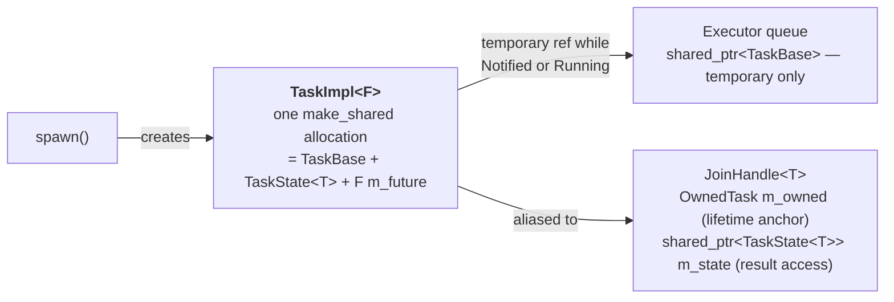
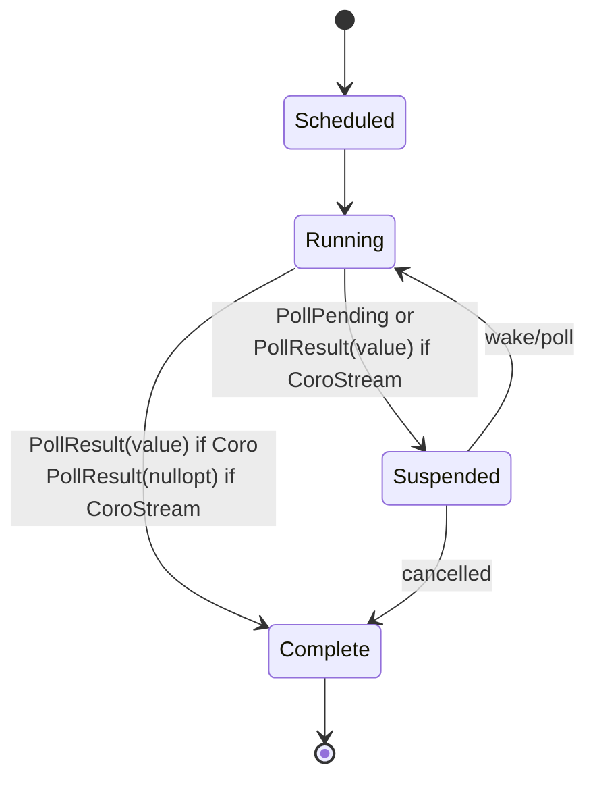

# Task and Executor

## Overview

`Task`, `Executor`, and `Runtime` form the scheduling layer of the library. There are two
distinct user-facing types:

- **`Coro<T>`** — the return type of coroutine functions. Satisfies `Future<T>`. Owns the
  coroutine frame via a `promise_type`.
- **`CoroStream<T>`** — the return type of async generator functions. Satisfies `Stream<T>`.
  Uses `co_yield` to produce values and can `co_await` futures internally.
- **`JoinHandle<T>`** — returned by `spawn()`. Satisfies `Future<T>`. Allows the caller to
  `co_await` the result of a spawned task.
- **`Synchronize`** — structured concurrency scope. Guarantees all tasks spawned within it
  complete before the scope exits. **Deprecated** — prefer `co_invoke` + `JoinSet::drain()`
  for new code.

**`Task`** is an internal, heap-allocated unit of work. `spawn()` creates a single
`TaskImpl<F>` object (via `make_shared`) that combines the executor-facing interface
(`TaskBase`) and the result/cancellation state (`TaskState<T>`) into one allocation.
Users never construct a `Task` directly.

The `Executor` drives tasks by polling them. The `Runtime` bundles the executor, thread pool,
and libuv I/O reactor into a single user-facing object.

## Design

### Runtime vs Executor split

- **`Executor`** — abstract base responsible only for scheduling: accepts type-erased tasks
  and decides when to poll them. Does not own threads or I/O.
- **`Runtime`** — user-facing object that owns the thread pool, libuv event loop, and a
  concrete `Executor`. Provides `spawn()` and `block_on()`.

```cpp
Runtime rt;
rt.block_on(my_async_main());
```

### Coro<T> — coroutine return type

`Coro<T>` is the return type of coroutine functions. It holds a `std::coroutine_handle` and
satisfies `Future<T>` so it can be passed to `spawn()` or `block_on()` like any other future.

```cpp
template<typename T>
class Coro {
public:
    using OutputType = T;

    struct promise_type { ... };  // C++20 coroutine promise

    PollResult<T> poll(Context& ctx);
};

// Usage
Coro<int> compute()
{
    co_return 42;
}

Coro<void> my_async_main()
{
    JoinHandle<int> h = runtime.spawn(compute()).submit();   // Coro<int> — accepted as any Future
    JoinHandle<int> h2 = runtime.spawn(ImmediateFuture<int>(7)).submit();  // hand-written Future also works
    int result = co_await h;
}
```

When the executor calls `coro.poll(ctx)`:

1. The `Context` is stored in the `promise_type` so it is accessible inside the coroutine.
2. The coroutine is resumed via `coroutine_handle.resume()`.
3. If the coroutine suspends (via `co_await inner_future`), `poll` returns `Pending`.
4. If the coroutine reaches `co_return value`, `poll` returns `Ready(value)`.
5. If the coroutine throws, `poll` returns `Error(current_exception)`.

### CoroStream<T, HasFinalValue> — async generator return type

`CoroStream<T, bool HasFinalValue = false>` is the return type of async generator functions.
`co_yield` produces stream items. When `HasFinalValue = true`, `co_return value` emits one
final item of the same type `T` before the stream exhausts — the consumer sees it as just
another item from `poll_next`. There is no separate return channel; both template parameters
share the same type, keeping `poll_next`'s signature unchanged.

`CoroStream<T, HasFinalValue>` always satisfies `Stream<T>`, so it works anywhere a `Stream`
is accepted regardless of `HasFinalValue`.

```cpp
template<typename T, bool HasFinalValue = false>
class CoroStream {
public:
    using ItemType = T;

    struct promise_type { ... };  // supports yield_value, await_transform,
                                  // and return_value (when HasFinalValue = true)

    PollResult<std::optional<T>> poll_next(Context& ctx);
};
```

When `poll_next(ctx)` is called:

1. The `Context` is stored in `promise_type`, same as `Coro`.
2. The coroutine resumes until it hits `co_yield value`, `co_return`, or throws.
3. `co_yield value` — suspends, returns `Ready(some(value))`.
4. `co_return value` (`HasFinalValue = true`) — emits the value as the final item,
   returning `Ready(some(value))`; the next call returns `Ready(nullopt)`.
5. Falling off the end or `co_return` void (`HasFinalValue = false`) — returns `Ready(nullopt)`.
6. Unhandled exception — returns `Error(current_exception)`.

```cpp
// Simple generator — no final value
CoroStream<int> range(int from, int to)
{
    for (int i = from; i < to; ++i)
        co_yield i;
}

// Generator with final value — yields values, last item is the running total
CoroStream<int, true> running_sum(std::vector<int> data)
{
    int sum = 0;
    for (int x : data) {
        sum += x;
        co_yield x;
    }
    co_return sum;  // emitted as the last item before exhaustion
}

Coro<void> consumer()
{
    auto s = running_sum({1, 2, 3});
    while (auto item = co_await next(s)) {
        // sees: 1, 2, 3, then 6 (the sum) as the last item, then nullopt
        process(*item);
    }
}
```

`CoroStream` is consumed via `next()` — it is never spawned directly. If a stream needs to
run in the background, wrap a `Coro<void>` around it that drives the stream and pushes
results into a channel.

### co_await integration

Any type satisfying `Future<F>` can be `co_await`ed inside a `Coro` or `CoroStream`
coroutine via `await_transform` in the `promise_type`. `FutureAwaitable` is not exposed
via a free `operator co_await` — it is only reachable through the promise. This restricts
`co_await` to library coroutine types and gives a clear compile error if someone tries to
`co_await` a `Future` inside a third-party coroutine whose `promise_type` knows nothing
about this library.

```cpp
template<Future F>
struct FutureAwaitable {
    bool await_ready();                              // polls once; returns true if already Ready
    void await_suspend(std::coroutine_handle<> h);  // stores handle; returns to executor
    typename F::OutputType await_resume();           // re-polls; returns value or rethrows
};

// Inside Coro::promise_type and CoroStream::promise_type:
template<Future F>
FutureAwaitable<F> await_transform(F&& future);

// Anything that does not satisfy Future is rejected at compile time:
template<typename T> requires (!Future<T>)
void await_transform(T&&) = delete;
```

### SpawnBuilder and StreamSpawnBuilder

`runtime.spawn(x)` returns a builder rather than immediately submitting the task. The builder
exposes configuration setters and a terminal `.submit()` that consumes the builder, submits
the task, and returns the handle. `runtime.spawn()` is overloaded on `Future` vs `Stream`,
returning different builder types so `buffer()` is only available when spawning a stream.

```cpp
template<Future F>
class SpawnBuilder {
public:
    SpawnBuilder& name(std::string name);
    JoinHandle<typename F::OutputType> submit();  // consumes builder, submits task
};

template<Stream S>
class StreamSpawnBuilder {
public:
    StreamSpawnBuilder& name(std::string name);
    StreamSpawnBuilder& buffer(std::size_t size);  // bounded channel capacity (default: 64)
    StreamHandle<typename S::ItemType> submit();
};
```

Usage:

```cpp
Coro<void> example()
{
    JoinHandle<int> h = runtime.spawn(compute())
        .name("compute-task")
        .submit();

    StreamHandle<Packet> s = runtime.spawn(read_packets(sock))
        .name("packet-reader")
        .buffer(128)
        .submit();

    int result = co_await h;
    while (auto pkt = co_await next(s)) { process(*pkt); }
}
```

### JoinHandle<T> and StreamHandle<T>

`JoinHandle<T>` satisfies `Future<T>` and is marked `[[nodiscard]]` — discarding it drops
and cancels the task immediately, which is almost never intentional.

`spawn()` creates a single `TaskImpl<F>` object via `make_shared`. `TaskImpl<F>` inherits
from both `TaskBase` (the executor-facing interface) and `TaskState<T>` (the result,
cancellation flag, and wakers). Two aliased `shared_ptr`s are produced from this one
allocation — they share the same reference count and keep the same `TaskImpl<F>` alive, but
point to different base subobjects:



`JoinHandle` exposes explicit control over the task's lifetime:

```cpp
template<typename T>
class [[nodiscard]] JoinHandle {
public:
    // Satisfies Future<T> — co_await to get the result
    PollResult<T> poll(Context& ctx);

    // Detaches without cancelling. Moves OwnedTask into TaskBase::self_owned so the
    // task anchors its own lifetime until it reaches a terminal state.
    JoinHandle& detach() &;
    JoinHandle&& detach() &&;

    // Configure whether dropping this handle cancels the task (default: true).
    JoinHandle& cancelOnDestroy(bool b = true) &;
    JoinHandle&& cancelOnDestroy(bool b = true) &&;

    // Destructor: cancels the task (if cancelOnDestroy) and transfers OwnedTask to
    // the enclosing CoroutineScope if inside a poll(), otherwise self-anchors the
    // task via self_owned when cancelOnDestroy=false.
    ~JoinHandle();
};
```

The shared `TaskState<T>` (embedded in `TaskImpl<F>`) handles these scenarios safely:

- Task completes before `JoinHandle` is polled — result stored, handle reads it on next poll
- `JoinHandle` polled before task completes — weak waker registered, task fires it on completion
- `JoinHandle` dropped inside coroutine — `OwnedTask` transferred to `CoroutineScope`; scope drains before parent completes
- `JoinHandle` dropped outside coroutine — cancellation flag set; task self-terminates at next natural wakeup
- `JoinHandle::detach()` called — `OwnedTask` moved into `TaskBase::self_owned`; task continues unaffected until terminal state
- Task throws — exception stored in `TaskState<T>`, re-thrown when `JoinHandle` is `co_await`ed

`StreamHandle<T>` satisfies `Stream<T>` and is also `[[nodiscard]]`. Internally it is the
consumer end of a bounded channel. The spawned task drives `poll_next()` on the original
stream and sends values through the channel, suspending when the buffer is full to preserve
back-pressure.

### Synchronize

> **Deprecated** — prefer `co_invoke` + `JoinSet::drain()` for new code.

`Synchronize` is a structured concurrency scope that guarantees all tasks spawned within it
complete before the scope's `co_await` returns — including when an exception unwinds the
parent coroutine. It predates `JoinSet` and is retained for compatibility.

```cpp
Coro<void> parent()
{
    int local = 42;

    co_await Synchronize([&](Synchronize& sync) -> Coro<void> {
        sync.spawn(child(local)).name("child-a").submit();
        sync.spawn(other_child(local)).name("child-b").submit();
    });
    // All children guaranteed finished here.
}
```

Prefer the equivalent `JoinSet` pattern for new code:

```cpp
Coro<void> parent()
{
    int local = 42;
    co_await co_invoke([&]() -> Coro<void> {
        JoinSet<void> js;
        js.spawn(child(local));
        js.spawn(other_child(local));
        co_await js.drain();
    });
}
```

### JoinHandle lifetime options

There are three ways to relinquish a `JoinHandle`, with different effects on the child task:

| Action | Effect on task |
|---|---|
| `co_await handle` | Waits for completion, returns result or rethrows exception |
| `handle.detach()` | Task runs to completion; `OwnedTask` moved into `self_owned`; result discarded; no cancellation |
| Drop inside coroutine | `OwnedTask` transferred to enclosing `CoroutineScope`; scope drains before parent frame is freed |
| Drop outside coroutine | Cancellation flag set; task exits at next natural wakeup; result discarded |

`detach()` is the explicit fire-and-forget path. Detached tasks are not tracked by the
enclosing `CoroutineScope` — they run to completion independently. Use `cancelOnDestroy(false)`
when the task should complete (not be cancelled) but still participate in the scope's drain
guarantee.

This three-way design mirrors Julia's pattern extended with explicit detach:

- `runtime.spawn().submit()` + `co_await` → synchronize with result
- `runtime.spawn().submit()` + `.detach()` → fire and forget, task runs to completion
- `runtime.spawn().submit()` + drop → cancel and discard

### Internal Task types

`TaskBase` is a non-template abstract base held by the executor queue and waker clones.
`TaskImpl<F>` is the concrete template that inherits from both `TaskBase` and
`TaskState<F::OutputType>` and stores the future directly — one `make_shared` allocation
covers the entire task. Users never interact with either type directly.

```cpp
// Internal — not public API

class TaskBase {
public:
    std::atomic<SchedulingState> scheduling_state{SchedulingState::Idle};
    std::string name;
    int         last_worker_index = -1;
    std::shared_ptr<void> self_owned; // detached-task self-reference; cleared at terminal state
    virtual bool poll(Context& ctx) = 0;
    virtual bool is_complete() const = 0;                    // checked by CoroutineScope
    virtual void set_waker(std::weak_ptr<Waker> waker) = 0; // called by JoinHandle and CoroutineScope
    virtual void on_task_complete() noexcept {}              // hook for JoinSetTask bookkeeping
    virtual void cancel_task() noexcept {}                   // type-erased cancellation for JoinSet
    virtual ~TaskBase() = default;
};

template<Future F>
class TaskImpl : public TaskBase, public TaskState<typename F::OutputType> {
    F    m_future;
    bool m_completed        = false;
    bool m_cancel_requested = false;
    bool poll(Context& ctx) override { /* cooperative cancel protocol; calls on_task_complete() at terminal exit */ }
    bool is_complete() const override { /* checks TaskState::terminated under lock */ }
    void set_waker(std::weak_ptr<Waker> w) override { /* stores in TaskState::waker */ }
    void cancel_task() noexcept override { /* sets cancelled flag, calls wake() */ }
};

// spawn() produces one allocation; OwnedTask is the sole persistent lifetime anchor:
auto impl = std::make_shared<TaskImpl<F>>(std::move(future));
std::shared_ptr<TaskState<typename F::OutputType>> join_ptr = impl;
detail::OwnedTask owned{std::shared_ptr<TaskBase>(impl)};
executor->schedule(std::shared_ptr<TaskBase>(std::move(impl)));
return JoinHandle<T>(std::move(join_ptr), std::move(owned));
```

### Abstract Executor interface

```cpp
class Executor {
public:
    virtual ~Executor();
    virtual void schedule(std::shared_ptr<TaskBase> task) = 0;
    virtual void enqueue(std::shared_ptr<TaskBase> task)  = 0;
};
```

### Single-threaded executor (first implementation)

Runs all tasks on a single thread — the thread that calls `Runtime::block_on()` or
`Runtime::run()`. No synchronization is needed between tasks since only one thread is
ever polling. This makes it straightforward to implement and invaluable for testing and
debugging (deterministic scheduling, no data races).

- Single task queue (a simple FIFO)
- Tasks are polled one at a time on the calling thread
- libuv event loop is driven on the same thread between polls
- `spawn()` pushes to the queue; waking a task re-enqueues it

Each task moves through four states:

1. **Scheduled** (in the ready queue)
2. **Running** (inside `poll()`)
3. **Suspended** (parked, waiting for a waker)
4. **Complete** (freed).



A special case is the self-wake: a future that calls `waker->wake()` from inside its own
`poll()`. At that point the task is Running, not yet in the suspended map, so a naive
`wake_task` would silently drop the call. The executor tracks the currently-running task's
key and a `woken` flag; if `wake()` is called while Running the flag is set, and after
`poll()` returns the task is re-enqueued rather than parked. This mirrors the
`RUNNING | SCHEDULED` bitmask transition in Tokio's task harness, without needing atomics
since only one thread is ever active.

### Work-stealing executor (second implementation)

- N worker threads (default: hardware concurrency), each with a local double-ended queue
- New tasks are pushed to the spawning thread's local queue
- When a thread's queue is empty it attempts to steal from the back of another thread's queue
- A global overflow queue handles cross-thread spawns when no local thread context exists

### Runtime

```cpp
class Runtime {
public:
    explicit Runtime(std::size_t num_threads = std::thread::hardware_concurrency());

    // Runs future on the calling thread, blocking until it completes. Drives the libuv loop.
    // Intended for use in main() to launch the top-level coroutine.
    template<Future F>
    typename F::OutputType block_on(F future);

    // Returns a builder for configuring and submitting a future as a task.
    template<Future F>
    [[nodiscard]] SpawnBuilder<F> spawn(F future);

    // Returns a builder for configuring and submitting a stream as a background task.
    template<Stream S>
    [[nodiscard]] StreamSpawnBuilder<S> spawn(S stream);
};
```

### Free spawn() function

A free `spawn()` function mirrors Tokio's `tokio::spawn()`. It retrieves the thread-local
`Runtime` and delegates to its `spawn()` member. This is the idiomatic way to spawn tasks
from within a running coroutine without passing a `Runtime` reference everywhere.

```cpp
// Sets the thread-local runtime for the calling thread.
// Called internally by Runtime::block_on() and worker thread startup.
void set_current_runtime(Runtime* rt);

// Returns the thread-local runtime. Throws if called outside a runtime context.
Runtime& current_runtime();

// Free spawn — equivalent to current_runtime().spawn(std::move(future))
template<Future F>
[[nodiscard]] SpawnBuilder<F> spawn(F future);

template<Stream S>
[[nodiscard]] StreamSpawnBuilder<S> spawn(S stream);
```

Usage:

```cpp
Coro<void> my_coro()
{
    // No need to pass runtime around — uses thread-local runtime implicitly
    JoinHandle<int> h = spawn(compute()).name("compute").submit();
    int result = co_await h;
}
```

## Design Considerations

### CoroStream promise_type

`CoroStream<T, HasFinalValue>::promise_type` must support `yield_value(T)` (for `co_yield`),
`return_value(T)` (when `HasFinalValue = true`) or `return_void()` (when `HasFinalValue =
false`), and `await_transform` (for `co_await` inside the body). These are independent and
compose without conflict in C++20.

The main differences from `Coro::promise_type`:

- `initial_suspend` returns `suspend_always` — the generator does not run until first polled
- `yield_value(T)` stores the yielded value and suspends
- When `HasFinalValue = true`, `return_value(T)` stores the value in the same slot as
  `yield_value`; `poll_next` emits it as `Ready(some(value))` before returning `Ready(nullopt)`
- When `HasFinalValue = false`, `return_void()` signals exhaustion directly

### Exception propagation

Exceptions thrown inside a `Coro` or `CoroStream` are caught by `promise_type::unhandled_exception()` and stored as `PollError` in the `PollResult`. They are rethrown at each `co_await` boundary via `FutureAwaitable::await_resume()`, propagating up through the coroutine chain. Try/catch blocks inside coroutines work normally. At the top level, `block_on` rethrows any unhandled exception into the calling thread. The executor's own call stack is never unwound — exceptions only travel within coroutine frames.

### Separation of Coro<T> from Task

`Coro<T>` carries the coroutine machinery (`promise_type`, coroutine frame lifetime) while
`Task` carries the scheduling machinery (type erasure, waker, queue membership). Keeping them
separate means `spawn()` can accept any `Future` — a hand-written state machine, a timer, a
wrapped C callback — without needing to be a coroutine. This matches Tokio's design where
`spawn()` accepts `impl Future`, not `async fn` specifically.

### Context propagation inside coroutines

The `Context` passed to `Coro::poll()` must be visible when the coroutine executes
`co_await inner_future` so `FutureAwaitable` can pass it to `inner_future.poll()`. The
cleanest approach is to store a `Context*` in the `promise_type` on each `poll()` call.
`FutureAwaitable::await_ready()` and `await_resume()` retrieve it via
`coroutine_handle.promise()`.

### libuv integration point

libuv callbacks run on the `IoService` thread. When a callback fires (e.g. a timer or read
completes), it calls `waker->wake()`, which posts the task back to the executor via the
injection queue. The `IoService` runs on a dedicated thread inside `Runtime` and communicates
with worker threads via `uv_async_t` notifications.

### spawn() ownership

`runtime.spawn(x)` moves `x` into the builder immediately. `.submit()` then consumes the
builder and submits the task, returning the handle. The caller is left with only the
`JoinHandle` or `StreamHandle` and cannot interact with the original future or stream
after calling `runtime.spawn()`.

### block_on threading

`block_on` runs the future on the calling thread and blocks until completion. This is the
intended entry point from `main()`. It also drives the libuv event loop on that thread for
the duration of the call.

### co_await inside Coro — await_transform

`Coro::promise_type` and `CoroStream::promise_type` both implement `await_transform` to
control what can be `co_await`ed. Only types satisfying `Future` are accepted; anything
else hits the deleted overload and fails at compile time. There is no free
`operator co_await` — `FutureAwaitable` is only reachable through the promise, so
`co_await future` is silently rejected outside of library coroutine types.

### Cancellation

Cancellation is a required feature. The `JoinHandle`, `Context`, and `Task` designs must
not foreclose it. `Context` will carry a `shared_ptr<CancellationToken>` from the start,
returning `nullptr` until cancellation is implemented. Adding it later would require changing
every `poll()` signature.

```cpp
class Context {
public:
    explicit Context(std::shared_ptr<Waker> waker,
                     std::shared_ptr<CancellationToken> token = nullptr);
    std::shared_ptr<Waker>             getWaker() const;
    std::shared_ptr<CancellationToken> getCancellationToken() const;  // nullptr until implemented
};
```

The cancellation design will be its own feature phase.

### Unhandled exceptions in spawned tasks

If a task spawned via `runtime.spawn()` throws and no one `co_await`s the `JoinHandle`, the
exception is swallowed. Once logging is available, unhandled task exceptions will be logged
at that point. The exception is stored in the `JoinHandle`'s shared slot regardless — it is
only discarded when the `JoinHandle` is destroyed without being awaited.

For tasks spawned inside a `Synchronize` scope, the first exception is re-thrown by the
`co_await Synchronize(...)` expression after all children have completed.
