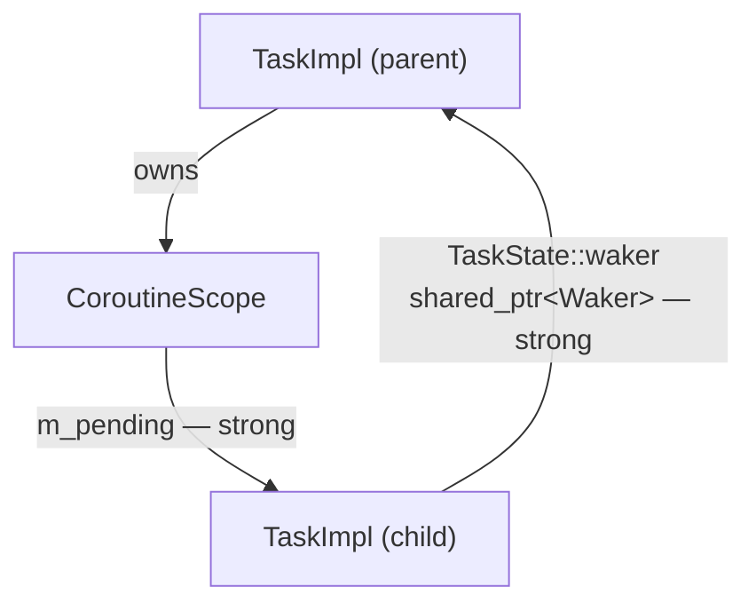
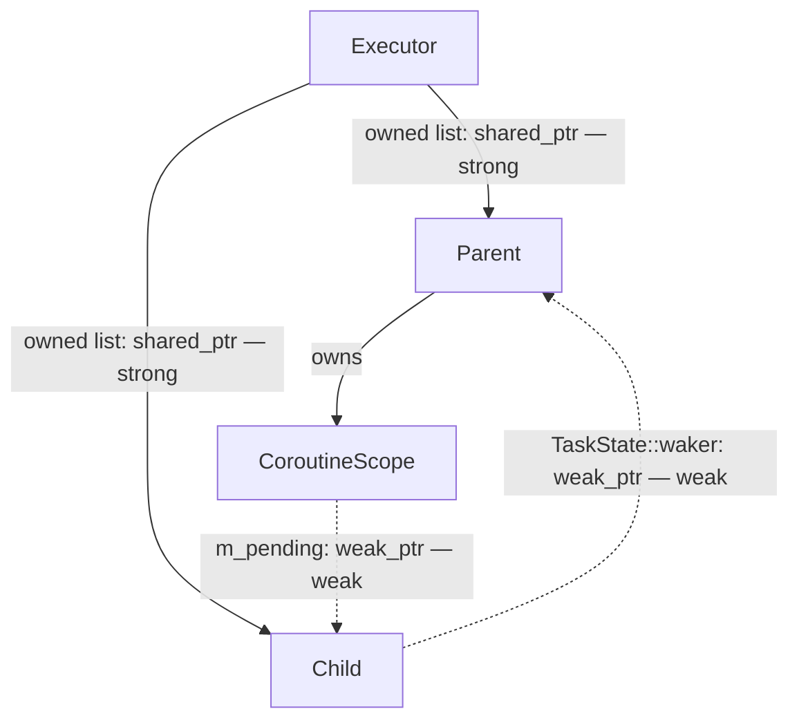
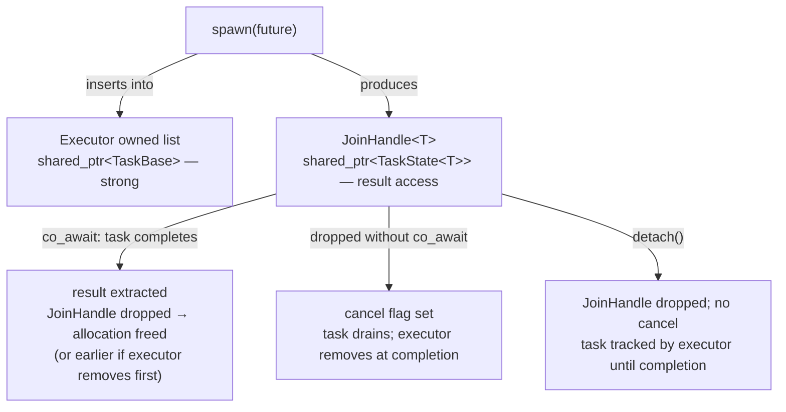
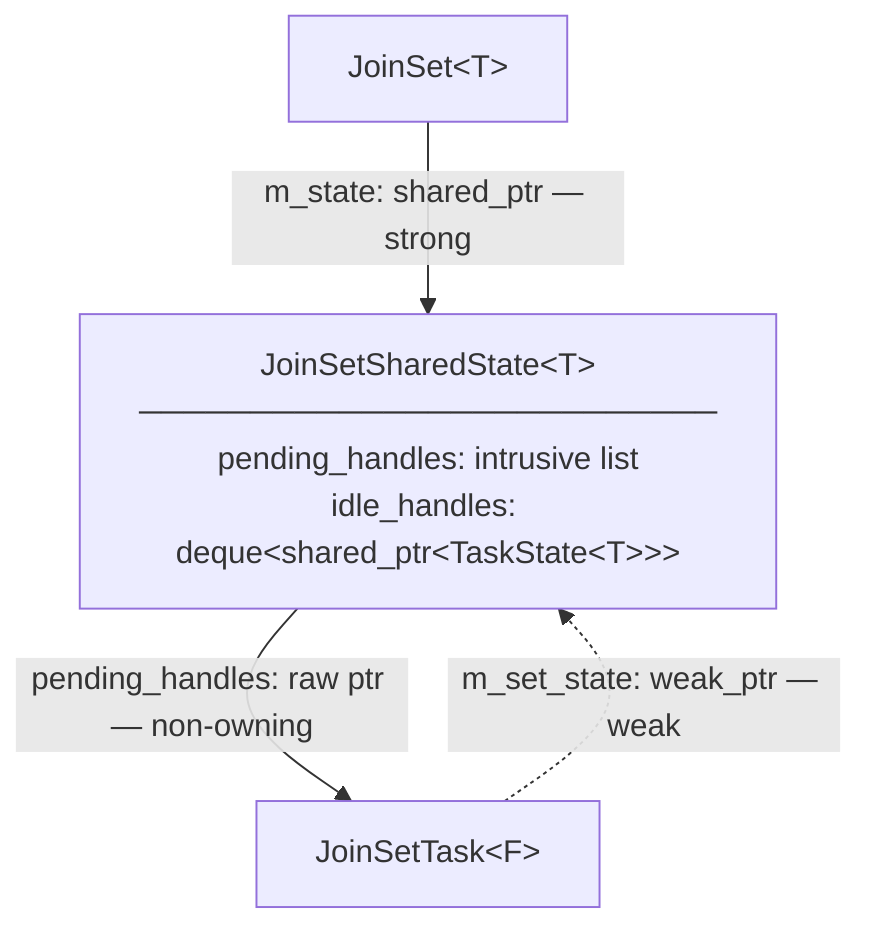
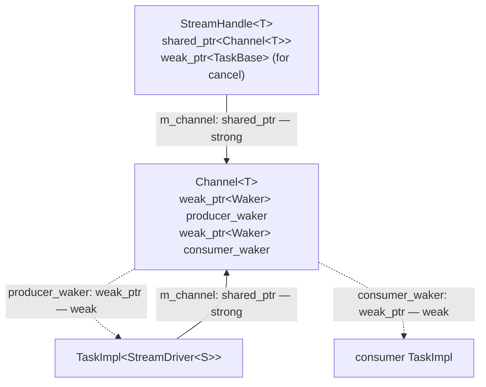

# Task Ownership Model

## Background

`TaskBase` IS the `Waker` — it inherits both `Waker` and
`enable_shared_from_this<TaskBase>`. `clone()` returns `shared_from_this()`, so a
waker clone is a strong `shared_ptr<TaskBase>` pointing to the same allocation as the
task itself.

This makes waker clones **dual-purpose**: they serve as both the *notification
mechanism* (calling `wake()` re-enqueues the task) and as a *strong reference* to the
task allocation. The problem is that any future which needs to notify a task also holds
a strong reference to it. For the `CoroutineScope` this creates a persistent strong
cycle:



Both edges are load-bearing — the parent must track children, and children must be
able to wake the parent — so the cycle cannot be removed without changing the mechanism.

---

## Design

Two complementary changes break all cycles and provide a clean ownership hierarchy:

**Executor-owned task list** — the executor holds a `shared_ptr<TaskBase>` for every
live task, from spawn until the task reaches a terminal state. This is always the
authoritative lifetime anchor. No other entity needs to hold a persistent strong
reference to a `TaskBase`/`TaskImpl` allocation while the task is running. `OwnedTask`
as a concept is eliminated: the executor IS the owner.

**`weak_ptr<Waker>` storage** — all fields that store wakers for later notification
change from `shared_ptr<Waker>` to `weak_ptr<Waker>`. `TaskBase` and the `Waker`
interface are otherwise unchanged. Firing a stored waker becomes `lock()` + `wake()`
rather than `->wake()`. If the task has been freed before the waker fires, `lock()`
returns null and the call is a safe no-op.

With these two changes, the reference graph for Cycle 3 becomes:



The executor is the root. Both edges in the former cycle are now weak. The parent's
allocation is kept alive by the executor's owned list, not by any child-held reference.

---

## Executor-owned task list

The executor maintains an intrusive doubly-linked list of all live tasks. The list node
is embedded directly in `TaskBase` — no separate allocation per entry. The list is
protected by a single mutex and is accessed at three points only:

- **Spawn** — insert the new task into the list
- **Completion** — remove the task; if no `shared_ptr<TaskState<T>>` references remain,
  the allocation is freed immediately
- **Shutdown** — iterate, cancel all tasks, and drain before returning from `block_on`

Normal polling never touches this list. The mutex is rarely contended.

This replaces `OwnedTask` as the mechanism that keeps a parked task alive between the
executor dropping its queue reference and the task being woken back into the queue. The
executor's owned list always covers this window.

---

## `JoinHandle<T>` — result access only

`JoinHandle<T>` holds a single `shared_ptr<TaskState<T>>`. This serves two purposes:

- While the task is running, it provides typed access to the result slot once the task
  completes (aliased into the same `TaskImpl` allocation as `TaskBase`).
- After the executor removes the task from its owned list at completion, if the
  `JoinHandle` is still alive it becomes the sole surviving reference to the allocation,
  keeping it live until the result is consumed.

`JoinHandle` no longer holds an `OwnedTask` and is no longer the task's lifetime anchor
while the task is running — the executor's owned list handles that.



---

## Weak waker storage and `Context`

`TaskBase` and the `Waker` interface are unchanged. `clone()` still returns
`shared_from_this()` — a strong `shared_ptr<TaskBase>`. The change is in how futures
**store** wakers for later notification.

`Context` gains a `get_weak_waker()` accessor that constructs a `weak_ptr<Waker>` from
the strong waker it holds:

```cpp
class Context {
public:
    std::shared_ptr<Waker> getWaker() const;        // existing — strong, for temporary use
    std::weak_ptr<Waker>   get_weak_waker() const;  // new — for persistent storage
};
```

Leaf futures and `TaskState::waker` change their stored type from `shared_ptr<Waker>`
to `weak_ptr<Waker>` and use `get_weak_waker()` to register:

```cpp
// Registering for notification — weak, does not extend task lifetime:
m_waker = ctx.get_weak_waker();

// Firing:
if (auto w = m_waker.lock()) w->wake();
```

The executor constructs `Context` with a strong `shared_ptr<Waker>` for the duration
of the poll call. This temporary strong reference exists only while the task is
Running; it is dropped when `poll()` returns. It is not stored anywhere.

---

## JoinSet tasks

`JoinSet::spawn()` allocates a `JoinSetTask<F>` covering the executor-facing `TaskBase`
and the result-holding `TaskState<T>`. Unlike a regular spawned task, there is no
`JoinHandle` — the consumer reads results via the `JoinSetSharedState`.

With executor-level ownership, `JoinSetSharedState::pending_handles` no longer needs
to anchor each task's lifetime. It uses an intrusive list of raw `JoinSetTask*` pointers
(safe because the executor's owned list guarantees the tasks remain live) with O(1)
insertion, removal, and iteration:



On task completion, `on_task_complete()` unlinks `this` from `pending_handles` in O(1)
via the embedded intrusive list node. An aliased `shared_ptr<TaskState<T>>` (into the
same allocation) is moved to `idle_handles` for the consumer to read. At this point the
executor still holds the task via its owned list; when both the executor's owned-list
entry and the `idle_handles` entry are dropped, the allocation is freed.

On `JoinSet` destruction, `cancel_pending()` iterates `pending_handles`, calls
`cancel_task()` on each, and clears the list. No ownership transfer to a `CoroutineScope`
is needed: the executor's owned list keeps every cancelled task alive, and the
executor-level drain on shutdown ensures all cancelled tasks reach a terminal state
before `block_on` returns.

---

## Stream tasks

`StreamHandle<T>` holds a `shared_ptr<Channel<T>>` for the consumer end of the channel.
The background `StreamDriver` task is tracked by the executor's owned list like any
other spawned task — no `OwnedTask` is needed in `StreamHandle`.

When `StreamHandle` is dropped, the channel's consumer end is closed. `StreamDriver`
detects this on its next poll (channel write returns a closed-channel error) and returns
`PollDropped`, after which the executor removes it from the owned list and the allocation
is freed.

For rapid cancellation without waiting for the driver to reach its next natural poll,
`StreamHandle` can call `cancel_task()` on the driver via a `weak_ptr<TaskBase>` — this
wakes the driver immediately so it polls and exits in the next executor cycle. The
`weak_ptr` does not anchor the driver's lifetime; that is the executor's job.



!!! warning "WARNING: Channel waker fields must remain weak_ptr"
    Do not change `Channel::producer_waker` or `Channel::consumer_waker` to `shared_ptr<Waker>`.
    Both fields form cycles through the task graph that prevent allocations from ever being freed
    when a task is cancelled. Use `ctx.get_weak_waker()` to set them and `lock()` before firing.

---

## Detached tasks

When `JoinHandle::detach()` is called, the caller surrenders ownership of the result.
The task continues running and is tracked by the executor's owned list like any other
task. No `self_owned` self-reference is needed — the executor guarantees the allocation
remains live until the task reaches a terminal state.

On `JoinHandle` drop without `detach()` (with `cancelOnDestroy = true`): the cancel
flag is set and the task will drain. The executor's owned list keeps it alive through
the drain.

On shutdown, the executor cancels all tracked tasks (including detached ones) and drains
them before `block_on` returns. Detached tasks are therefore not truly "fire and forget"
with respect to memory — they are cleaned up safely on shutdown — but they are decoupled
from any `CoroutineScope` and do not block their spawning coroutine from returning.

---

## Reference categories

Every `shared_ptr` or `weak_ptr` touching a `TaskBase`/`TaskState` allocation falls
into one of four categories.

---

### Category 1 — Executor owned list: the authoritative lifetime anchor

The executor holds one `shared_ptr<TaskBase>` per live task in its owned-list from
spawn until terminal state. This is the single entity whose lifetime controls when the
`TaskImpl` allocation MAY be freed (the actual free happens when all Category 2
references are also released).

No other data structure may hold a persistent `shared_ptr<TaskBase>` as a lifetime
anchor. The executor's owned list is the only correct place.

---

### Category 2 — `shared_ptr<TaskState<T>>`: result access and post-completion lifetime

`JoinHandle<T>` holds `m_state: shared_ptr<TaskState<T>>`. Both Category 1 and
Category 2 are aliased `shared_ptr`s into the same `TaskImpl` allocation — they share
one reference count.

Category 2 references exist for result reading (`poll()`, reading the value after
completion). After the executor removes the task at terminal state, any surviving
Category 2 references extend the allocation's lifetime until they are released.

`block_on` uses this same pattern for its root task:

```cpp
auto impl = std::make_shared<detail::TaskImpl<F>>(std::move(future));
std::shared_ptr<detail::TaskState<...>> state = impl;  // aliased — same allocation
m_executor->schedule(std::shared_ptr<detail::TaskBase>(impl));
m_executor->wait_for_completion(*state);
// state keeps TaskImpl alive on the call stack for the duration of block_on()
```

`JoinSet::idle_handles` also holds `shared_ptr<TaskState<T>>` aliased into the
`JoinSetTask` allocation, keeping it alive until the consumer reads the result.

---

### Category 3 — Executor queue: temporary strong reference (Notified/Running only)

Executor queues (`m_ready`, `m_local_queues`, `m_injection_queue`, `m_incoming_wakes`)
hold `shared_ptr<TaskBase>`. These exist only while the task is in the `Notified` or
`Running` state. They are in addition to, not instead of, the Category 1 owned-list
entry.

These references **must not** be changed to `weak_ptr`.

---

### Category 4 — `weak_ptr<Waker>`: notification only, no lifetime ownership

All wakers stored for later notification are `weak_ptr<Waker>`:

- `TaskState::waker` — a single slot shared between `JoinHandle::poll()` (while the
  caller awaits the result) and `CoroutineScope` (while the scope waits for a dropped
  child to drain).
- Leaf futures (uv_future, sleep, channels, etc.) — store the waker from `ctx.get_weak_waker()`

A `weak_ptr<Waker>` does not contribute to the reference count of the task it points
at. Firing is `if (auto w = stored_waker.lock()) w->wake()`. If the task has already
been freed, `lock()` returns null and the call is a safe no-op.

**This is the correct storage type for any waker that will be held across a suspension
point.** Using `shared_ptr<Waker>` instead creates an ownership cycle because
`TaskBase IS the Waker` — storing a strong waker clone inside an object transitively
owned by the same `TaskImpl` forms a cycle that prevents the task from ever being freed.
See [shared_ptr_cycles.md](shared_ptr_cycles.md) for the full cycle analysis.

---

### Quick-reference table

| Usage | Type | Category | Why |
|---|---|---|---|
| Executor owned list entry | `shared_ptr<TaskBase>` | 1 — lifetime anchor | authoritative owner from spawn to terminal state |
| `JoinHandle::m_state` | `shared_ptr<TaskState<T>>` | 2 — result access | typed result access; same allocation; extends lifetime after executor removes at completion |
| `JoinSetSharedState::idle_handles` | `deque<shared_ptr<TaskState<T>>>` | 2 — result access | aliased into `JoinSetTask` allocation; consumer reads result directly |
| `Runtime::block_on()` local `state` | `shared_ptr<TaskState<T>>` | 2 — result access | root task anchor for synchronous call stack |
| Executor queue entries | `shared_ptr<TaskBase>` | 3 — temporary (Notified/Running) | task must stay alive between enqueue and poll |
| `TaskState::waker` | `weak_ptr<Waker>` | 4 — notification only | shared slot for JoinHandle awaiter and CoroutineScope drain; must not create cycle |
| Leaf future waker fields | `weak_ptr<Waker>` | 4 — notification only | fires task wake from I/O or timer callback |
| `Channel::producer_waker` | `weak_ptr<Waker>` | 4 — notification only | wakes StreamDriver when buffer has space; must not create cycle |
| `Channel::consumer_waker` | `weak_ptr<Waker>` | 4 — notification only | wakes consumer task when buffer has items or stream is closed; must not create cycle |
| `CoroutineScope::m_pending` | `vector<weak_ptr<TaskBase>>` | — non-owning | drain tracking only; executor's owned list provides lifetime |
| `JoinSetSharedState::pending_handles` | intrusive list of `JoinSetTask*` | — non-owning | O(1) task lookup/removal; executor's owned list provides lifetime |
| `StreamHandle` driver ref | `weak_ptr<TaskBase>` | — non-owning | cancel-on-drop only; executor's owned list provides lifetime |

---

## Cycle analysis

| Cycle | Status |
|---|---|
| 1: `TaskImpl → Coro → CoroutineScope → shared_ptr<Waker> → TaskImpl` | **Eliminated** — `m_drain_waker` removed; waker storage is `weak_ptr` |
| 2: `JoinSetSharedState → pending_handles → JoinSetTask → JoinSetSharedState` | **Eliminated** — `JoinSetTask::m_set_state` is `weak_ptr<JoinSetSharedState>`; `pending_handles` uses raw pointers, not strong refs |
| 3: `CoroutineScope → TaskState_child → waker → TaskBase_parent` | **Eliminated** — `CoroutineScope::m_pending` uses `weak_ptr`; `TaskState::waker` is `weak_ptr`; no strong edge in either direction |
| 4: `TaskImpl → TaskState::self_waker → shared_ptr<Waker> → TaskImpl` | **Eliminated** — `self_waker` removed; no future stores a strong waker pointing back to its own task |
| Detached task self-ref: `TaskImpl → self_owned → TaskImpl` | **Eliminated** — `self_owned` removed; executor's owned list is the lifetime anchor for detached tasks |
| 5: `StreamDriver → m_channel → producer_waker (strong) → StreamDriver` | **Eliminated** — `Channel::producer_waker` is `weak_ptr<Waker>` |
| 6: `consumer_task → StreamHandle → m_channel → consumer_waker (strong) → consumer_task` | **Eliminated** — `Channel::consumer_waker` is `weak_ptr<Waker>` |

---

## Invariants

**1. The executor's owned list is the sole persistent `shared_ptr<TaskBase>`.**
No other data structure holds a persistent strong reference to a `TaskBase` allocation
while the task is alive. Temporary strong references (executor queue entries,
`weak_ptr::lock()` during waker firing, `shared_from_this()` during `on_task_complete()`)
are held only for the duration of the current call stack and are never stored.

**2. The executor inserts each task exactly once (at spawn) and removes it exactly once
(at terminal state).**
Between these two events, the executor's owned list guarantees the allocation is live.
After removal, any remaining Category 2 references (`JoinHandle::m_state`,
`JoinSetSharedState::idle_handles`) extend the allocation until they are released.

**3. `weak_ptr<Waker>` is always used for stored wakers.**
`Category 4` wakers must use `get_weak_waker()` and `lock()` before firing. Using
`shared_ptr<Waker>` for any stored waker field creates a reference cycle through the
task graph.

**4. `cancel_pending()` may iterate raw task pointers safely.**
Because the executor's owned list keeps every tracked task alive, iterating
`JoinSetSharedState::pending_handles` (raw pointers) or `CoroutineScope::m_pending`
(`weak_ptr<TaskBase>`) is safe as long as the iteration happens while the executor is
running and before the owned list entry is removed (i.e., before terminal state). Under
the shared mutex, this is always the case.

**5. `cancel_pending()` does not need to transfer tasks to a `CoroutineScope`.**
The executor-level drain on shutdown ensures all cancelled tasks reach a terminal state
before `block_on` returns. `add_child()` is no longer required for JoinSet cancellation.

**6. Detached tasks are tracked by the executor.**
`JoinHandle::detach()` removes the handle's Category 2 reference. The executor's owned
list keeps the task alive. On shutdown, the executor cancels and drains all tracked
tasks including detached ones — no self-reference or external anchor is needed.
