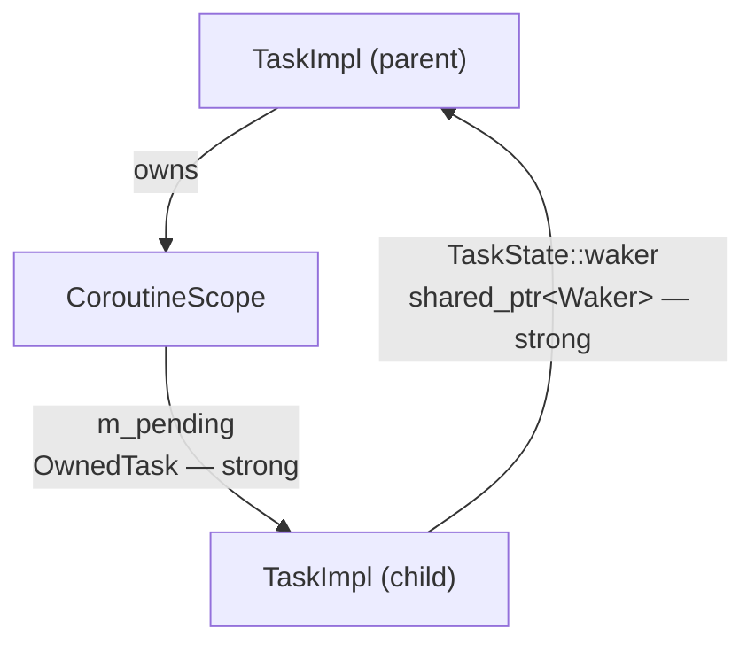
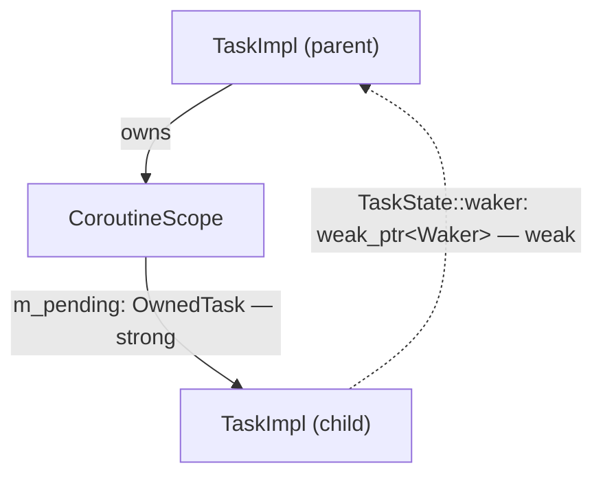
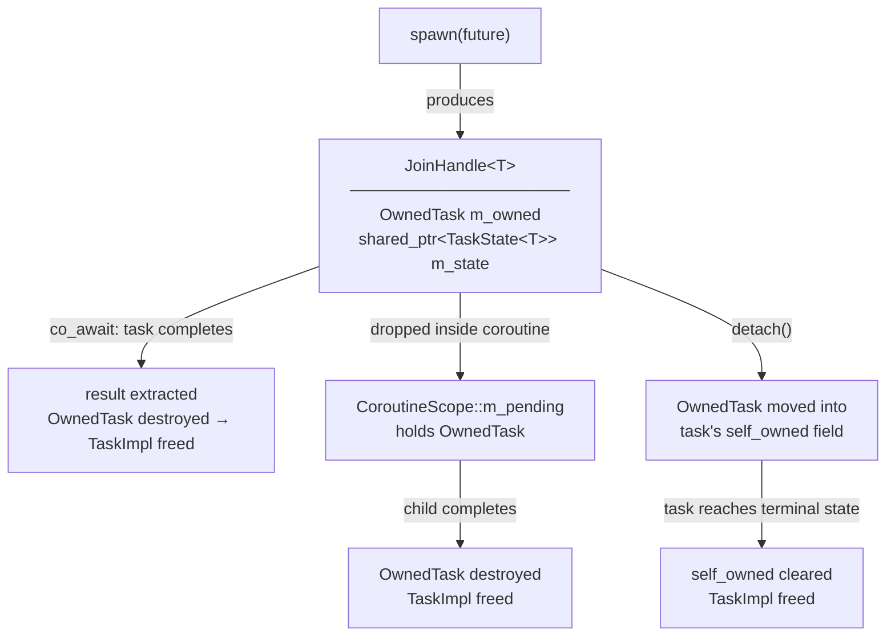
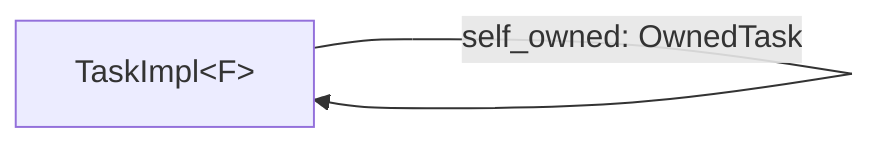

# Task Ownership Model

## Background

`TaskBase` IS the `Waker` — it inherits both `Waker` and
`enable_shared_from_this<TaskBase>`. `clone()` returns `shared_from_this()`, so a
waker clone is a strong `shared_ptr<TaskBase>` pointing to the same allocation as the
task itself.

This makes waker clones **dual-purpose**: they serve as both the *notification
mechanism* (calling `wake()` re-enqueues the task) and the *lifetime anchor* (the
strong reference keeps a parked task allocation alive). The executor drops its
`shared_ptr<TaskBase>` when a task parks; waker clones stored by leaf futures then
become the sole thing keeping the task alive until something wakes it.

The problem is that every future that needs to notify a task must also own a strong
reference to it. For the `CoroutineScope` this creates a persistent strong cycle
(Cycle 3 in [shared_ptr_cycles.md](shared_ptr_cycles.md)):



The child holds a strong reference to the parent through `scope_waker`, and the
parent holds a strong reference to the child through `m_pending`. Both are required
for structured concurrency to work — the parent must track children, and children must
be able to wake the parent. The cycle is the mechanism; it cannot be removed without
also removing the guarantee.

The fix is to separate the two roles that waker clones currently play.

---

## Design

Two complementary changes decouple task lifetime from waker notification:

**`OwnedTask`** — a move-only wrapper that is the sole persistent strong reference to
a task. It controls when the task allocation is freed. No other entity holds a
persistent strong reference.

**`weak_ptr<Waker>` storage** — all fields that store wakers for later notification
(`TaskState::waker`, leaf future waker fields) change from `shared_ptr<Waker>`
to `weak_ptr<Waker>`. `TaskBase` and the `Waker` interface are otherwise unchanged.
Firing a stored waker becomes `lock()` + `wake()` rather than `->wake()`. If the task
has been freed before the waker fires, `lock()` returns null and the call is a
silent no-op.

With these two changes, the reference graph for Cycle 3 becomes:



The dashed (weak) edge does not contribute to the reference count. The cycle is
broken. The parent is kept alive by its *own* `OwnedTask` held in the grandparent's
`JoinHandle` or `CoroutineScope` — not by the child.

---

## `OwnedTask`

`OwnedTask` is a move-only type wrapping `shared_ptr<TaskBase>`. The copy constructor
and copy-assignment are deleted; transfer is always explicit.

```cpp
class OwnedTask {
public:
    OwnedTask(OwnedTask&&) noexcept = default;
    OwnedTask& operator=(OwnedTask&&) noexcept = default;

    OwnedTask(const OwnedTask&)            = delete;
    OwnedTask& operator=(const OwnedTask&) = delete;

    // Type-erased lifecycle queries — delegate to TaskBase virtuals.
    bool is_complete() const;
    void set_waker(std::weak_ptr<Waker> waker);

    // Temporary strong-reference access — for cancel() and executor enqueue only.
    // The returned shared_ptr must not be stored persistently.
    const std::shared_ptr<TaskBase>& get() const;
    std::weak_ptr<TaskBase> get_weak() const;
};
```

The "sole persistent strong reference" contract is by convention: any code that
obtains a temporary strong reference (via `get()` or by locking a `weak_ptr`) must
not store it persistently. This is the same convention as `std::mutex` — you may lock
it temporarily but you do not copy or store it.

To allow type-erased lifecycle queries through `OwnedTask`, `TaskBase` exposes virtual
methods:

```cpp
class TaskBase : ... {
    virtual bool is_complete() const = 0;
    virtual void set_waker(std::weak_ptr<Waker> waker) = 0;
    virtual void on_task_complete() noexcept {}   // default no-op; overridden by JoinSetTask
    virtual void cancel_task() noexcept {}         // default no-op; overridden by TaskImpl<F>
};
```

`TaskImpl<F>` implements `is_complete()` and `set_waker()` by delegating to its inherited
`TaskState<T>` subobject. `on_task_complete()` is called at every terminal exit from
`TaskImpl<F>::poll()` (after `setResult`, `setException`, or `mark_done`); the default
no-op is overridden by `JoinSetTask<F>` to perform JoinSet bookkeeping.
`CoroutineScope::m_pending` holds `OwnedTask` objects directly.

---

## Weak waker storage and `Context`

`TaskBase` and the `Waker` interface are unchanged. `clone()` still returns
`shared_from_this()` — a strong `shared_ptr<TaskBase>`. The change is in how futures
**store** wakers for later notification.

`Context` gains a `get_weak_waker()` accessor that constructs a `weak_ptr<Waker>` from
the strong waker it holds:

```cpp
class Context {
public:
    std::shared_ptr<Waker> getWaker() const;        // existing — strong, for temporary use
    std::weak_ptr<Waker>   get_weak_waker() const;  // new — for persistent storage
};
```

Leaf futures and `TaskState::waker` change their stored type from `shared_ptr<Waker>`
to `weak_ptr<Waker>` and use `get_weak_waker()` to register:

```cpp
// Registering for notification — weak, does not extend task lifetime:
m_waker = ctx.get_weak_waker();

// Firing:
if (auto w = m_waker.lock()) w->wake();
```

The executor constructs `Context` with a strong `shared_ptr<Waker>` for the duration
of the poll call. This temporary strong reference exists only while the task is
Running; it is dropped when `poll()` returns. It is not stored anywhere.

---

## Ownership Flow

`JoinHandle<T>` holds two aliased references into the same `TaskImpl<F>` allocation:

- **`OwnedTask m_owned`** — the lifetime anchor (move-only).
- **`shared_ptr<TaskState<T>> m_state`** — aliased pointer for typed result access.



Neither reference creates a cycle: `JoinHandle` is external to the task and nothing
inside the task points back to it.

---

## Detached Tasks

When `JoinHandle::detach()` is called, the caller surrenders ownership. No parent
holds the `OwnedTask`, so the task must anchor its own lifetime until it reaches a
terminal state.

`detach()` moves the `OwnedTask` into a `self_owned` field on `TaskBase` itself.
Every terminal method (`setResult`, `setDone`, `setException`, `mark_done`) clears
`self_owned` inside the same critical section that sets `terminated = true` and fires
the wakers. When the executor's temporary strong reference (from the ready queue) is
subsequently dropped, the refcount reaches zero and the task frees itself.



The self-reference is set before the task is first enqueued, so there is no window
where neither the caller's `OwnedTask` nor `self_owned` exists.

This is an intentional self-cycle with a guaranteed break point at task completion.
If the executor orphans a detached task and never polls it to a terminal state, the
self-reference leaks — but this is the same failure mode as the current design, where
waker clones would leak indefinitely. The self-reference does not introduce a new
leak class; it moves the responsibility for the leak from implicit waker-clone lifetime
to an explicit, auditable field.

---

## Reference Categories

Every `shared_ptr` or `weak_ptr` touching a `TaskBase`/`TaskState` allocation falls
into one of four categories. Knowing which category a reference belongs to makes it
easy to audit new code for correctness.

---

### Category 1 — `OwnedTask`: the sole persistent lifetime anchor

`OwnedTask` is the single entity whose lifetime controls when the `TaskImpl` allocation
is freed. Exactly one `OwnedTask` exists per live task. It is held by:

- `JoinHandle::m_owned` — for spawned tasks awaited by a parent coroutine
- `CoroutineScope::m_pending` — after a `JoinHandle` is dropped inside a coroutine
- `TaskStateBase::self_owned` — for detached tasks (self-reference cleared at completion)

Code review rule: if you are storing a `shared_ptr<TaskBase>` in a data structure
that outlives the current call stack, you are creating a second persistent lifetime
anchor — which violates the ownership model. Use `OwnedTask` explicitly or justify
why a second anchor is correct.

---

### Category 2 — Companion aliased `shared_ptr<TaskState<T>>`

`JoinHandle` holds `m_state: shared_ptr<TaskState<T>>` alongside `m_owned`. Both are
aliased `shared_ptr`s into the same `TaskImpl` allocation — they share one reference
count and contribute no extra heap object. `m_state` exists solely for typed result
access (`poll()`, reading the value after completion). It does not independently
anchor the task lifetime; `m_owned` does that.

`Runtime::block_on()` uses this same pattern without an explicit `OwnedTask`:

```cpp
auto impl = std::make_shared<detail::TaskImpl<F>>(std::move(future));
std::shared_ptr<detail::TaskState<...>> state = impl;  // aliased — same allocation
m_executor->schedule(std::shared_ptr<detail::TaskBase>(impl));
m_executor->wait_for_completion(*state);
// state keeps TaskImpl alive on the call stack for the duration of block_on()
```

`state` is the sole persistent strong reference for the root task. It lives on the
`block_on` call stack until `wait_for_completion` returns, keeping the task alive even
after the executor parks it. No `OwnedTask` is needed here.

---

### Category 3 — Executor queue: temporary strong reference (Notified/Running only)

Executor queues (`m_ready`, `m_local_queues`, `m_injection_queue`, `m_incoming_wakes`)
hold `shared_ptr<TaskBase>`. These exist only while the task is in the `Notified` or
`Running` state:

- **Notified**: the task is in the ready queue waiting to be polled. The executor queue
  reference keeps it alive because the task has not yet been parked and no leaf-future
  waker holds a strong reference at this point.
- **Running**: the worker loop holds the `shared_ptr` in a local variable while polling.

When the task parks (`Running → Idle`), the executor drops its reference and `OwnedTask`
(Category 1) becomes the sole surviving strong reference. If the executor queue held a
`weak_ptr` instead, the task could be freed between enqueue and poll — which would be
a use-after-free.

These references **must not** be changed to `weak_ptr`.

---

### Category 4 — `weak_ptr<Waker>`: notification only, no lifetime ownership

All wakers stored for later notification are `weak_ptr<Waker>`:

- `TaskState::waker` — a single slot shared between `JoinHandle::poll()` (set while the
  caller awaits the result) and `CoroutineScope::set_waker()` (set while the scope waits
  for a dropped child to drain). These two uses are mutually exclusive: a handle is either
  being co_awaited (not dropped) or it has been dropped into a scope (not awaited).
- Leaf futures (uv_future, sleep, channels, etc.) — store the waker from `ctx.get_weak_waker()`

A `weak_ptr<Waker>` does not contribute to the reference count of the task it points
at. Firing is `if (auto w = stored_waker.lock()) w->wake()`. If the task has already
been freed (its `OwnedTask` dropped), `lock()` returns null and the call is a safe
no-op. If the task is alive, `lock()` produces a transient strong `shared_ptr<Waker>`
that is released immediately after `wake()` returns.

**This is the correct storage type for any waker that will be held across a suspension
point.** Using `shared_ptr<Waker>` instead creates an ownership cycle because
`TaskBase IS the Waker` — storing a strong waker clone inside an object transitively
owned by the same `TaskImpl` forms a cycle that prevents the task from ever being freed.
See [shared_ptr_cycles.md](shared_ptr_cycles.md) for the full cycle analysis.

---

### Quick-reference table

| Usage | Type | Category | Why |
|---|---|---|---|
| `CoroutineScope::m_pending` | `vector<OwnedTask>` | 1 — lifetime anchor | sole persistent strong ref for dropped children |
| `JoinHandle::m_owned` | `OwnedTask` | 1 — lifetime anchor | sole persistent strong ref for spawned task |
| `JoinSetSharedState::pending_handles` | `set<shared_ptr<TaskBase>>` | 1 — lifetime anchor | strong refs to running JoinSet tasks while Idle between polls |
| `TaskStateBase::self_owned` | `shared_ptr<void>` | 1 — lifetime anchor | detached task self-reference; cleared at terminal state |
| `JoinHandle::m_state` | `shared_ptr<TaskState<T>>` | 2 — companion alias | typed result access; same allocation as m_owned |
| `JoinSetSharedState::idle_handles` | `list<shared_ptr<TaskState<T>>>` | 2 — companion alias | aliased into same JoinSetTask allocation; consumer reads result directly |
| `Runtime::block_on()` `state` | `shared_ptr<TaskState<T>>` | 2 — companion alias | root task anchor for synchronous call stack |
| Executor queue entries | `shared_ptr<TaskBase>` | 3 — temporary (Notified/Running) | task must stay alive between enqueue and poll |
| `TaskState::waker` | `weak_ptr<Waker>` | 4 — notification only | shared slot for JoinHandle awaiter and CoroutineScope drain; must not create cycle |
| Leaf future waker fields | `weak_ptr<Waker>` | 4 — notification only | fires task wake from I/O or timer callback |

---

## Cycle Analysis

| Cycle | Status |
|---|---|
| 1: `TaskImpl → Coro → CoroutineScope → shared_ptr<Waker> → TaskImpl` | **Eliminated** — `m_drain_waker` removed; waker storage is `weak_ptr` |
| 2: `JoinSetSharedState → pending_handles → JoinSetTask → JoinSetSharedState` | **Eliminated** — `JoinSetTask::m_set_state` is `weak_ptr<JoinSetSharedState>`; no strong back-reference |
| 3: `CoroutineScope → TaskState_child → waker → TaskBase_parent → TaskImpl_parent` | **Eliminated** — `TaskState::waker` is `weak_ptr<Waker>`; weak edge does not close the cycle |
| 4: `TaskImpl → TaskState::self_waker → shared_ptr<Waker> → TaskImpl` | **Eliminated** — `self_waker` removed; no future stores a strong waker pointing back to its own task |
| Detached self-ref: `TaskImpl → self_owned → TaskImpl` | Intentional; guaranteed to break at task completion |

---

## Invariants

**1. `OwnedTask` is the sole entity that may hold a persistent strong `shared_ptr<TaskBase>`.**
Temporary strong references (executor queue, `weak_ptr::lock()` during waker firing)
are held only for the duration of the current call and are never stored in any data
structure.

**2. `OwnedTask` outlives all code paths that lock the task's `weak_ptr<Waker>`.**
Locking during `wake()` obtains only a transient strong reference. If `OwnedTask` has
already been destroyed, `lock()` returns null and the call is a safe no-op.

**3. `OwnedTask` is destroyed only after the task reaches a terminal state or has
been drained by `CoroutineScope`.**
`CoroutineScope` drops an `OwnedTask` only after `is_complete()` returns true.
`JoinHandle` drops `OwnedTask` only after polling confirms the task has terminated.
These are enforced by the existing draining protocol in `Coro<T>` and `CoroutineScope`.

**4. For detached tasks, `self_owned` is set before the task's first enqueue.**
`detach()` sets `TaskBase::self_owned` before calling `schedule()` on the executor.
There is no window where neither the caller's `OwnedTask` nor `self_owned` holds a
strong reference.

**5. Terminal methods clear `self_owned` exactly once, under the task state mutex.**
`mark_done`, `setResult`, `setDone`, and `setException` clear `self_owned` inside the
same critical section that sets `terminated = true`. This ensures the self-reference
is released on every terminal path and cannot be cleared twice.
