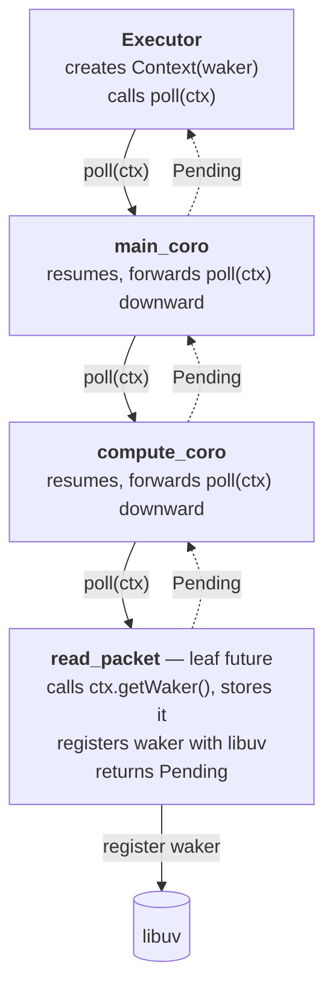
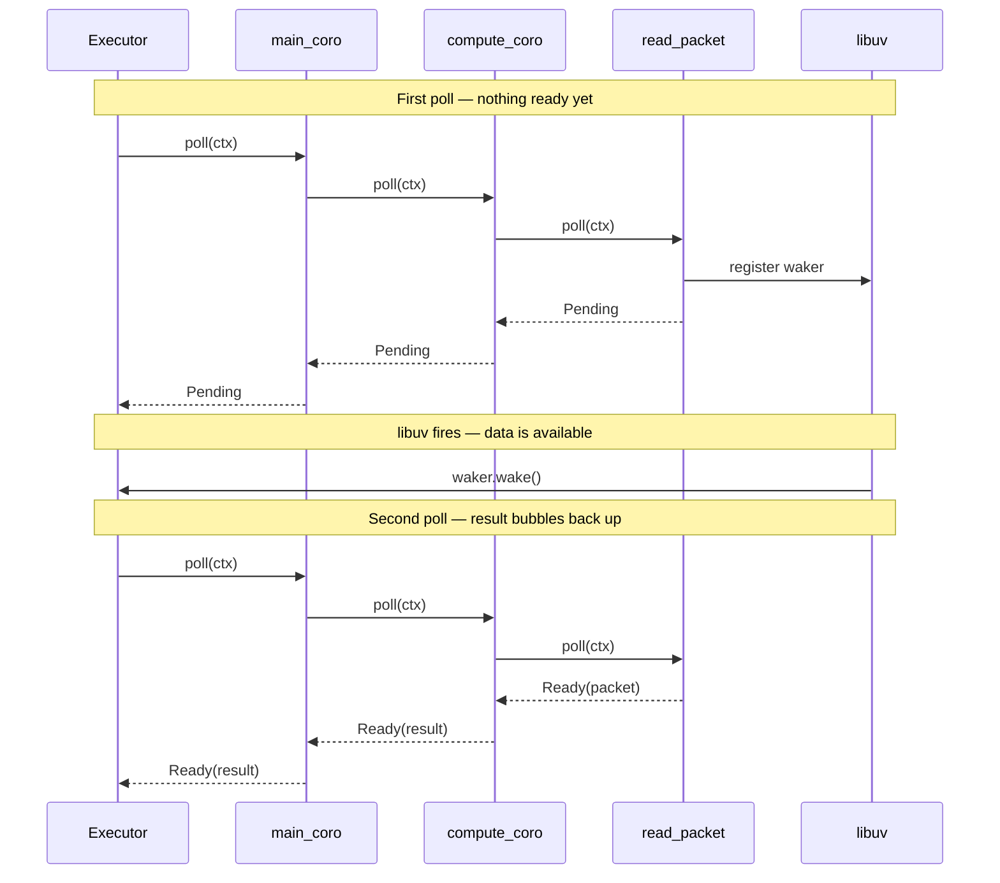
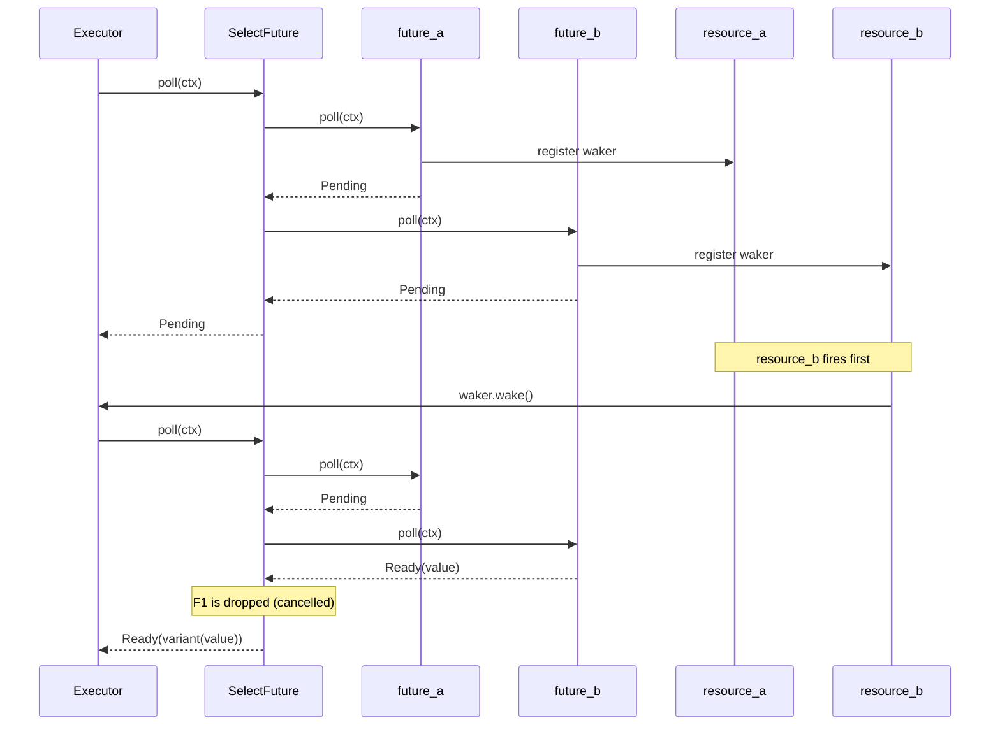
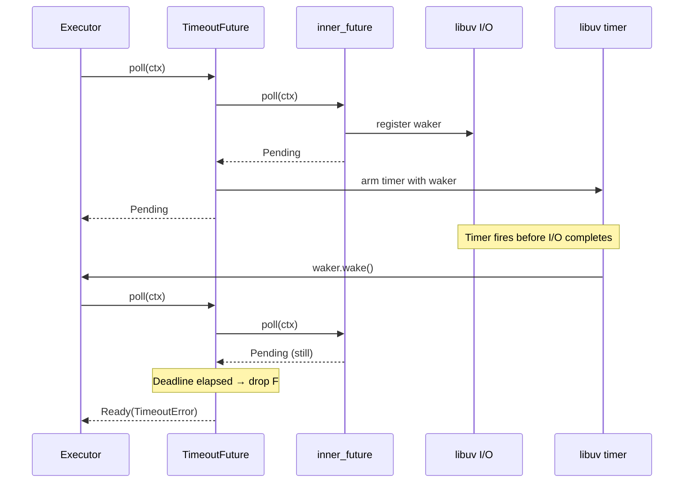

# Waker and Context Propagation

## Overview

A task has exactly one `Context` and one `Waker`. Every future in the coroutine stack beneath
that task shares the same `Context`. This document explains why, how the `Context` flows
down through nested `co_await` calls, and what happens when the waker fires.

## Tasks vs Threads

A thread owns its call stack. When a thread calls a function, that function runs to
completion (or blocks the whole thread waiting).

A coroutine task works differently. The executor owns the task and drives it by calling
`poll()` from outside. Each `poll()` call cascades down through the coroutine stack,
resuming each coroutine right where it was last suspended, until it reaches the leaf
future — the one waiting on an external event like I/O or a timer. If the leaf is still
not ready, `Pending` propagates back up through the entire chain to the executor.

This means **the executor calls `poll()` fresh from the top on every scheduling tick**.
The coroutines in the middle don't block — they just resume, pass the call downward, and
suspend again when the leaf returns `Pending`.

## The Single Context Invariant

When the executor polls a task it constructs a `Context` holding the task's `Waker` and
passes it down through every `poll()` call in the chain. Because it is passed by reference
through every layer, **all futures in the stack share the same `Context`**.

Only the leaf future — the one actually waiting on an external resource — calls
`ctx.getWaker()` and stores it. Intermediate coroutines simply forward `ctx` downward and
never need to store it themselves.

## The Poll Cascade — Normal Flow

The following sequence shows a two-level coroutine stack waiting on a network read.

Key observations:
- `main_coro` and `compute_coro` never store the waker — they just forward `ctx`
- `read_packet` is the only future that interacts with libuv
- On the second poll, each coroutine resumes instantly from where it was — the intermediate
  coroutines are not doing work, they are just passing the call through to find the ready leaf

## Re-polling is Cheap

Because coroutine frames store their local state on the heap, each intermediate coroutine
resumes exactly where it was suspended. "Passing through" an intermediate coroutine is a
single function call that immediately reaches the next `co_await` and forwards the poll.
The cost of re-polling a deep stack is proportional to the depth, not the amount of work
each coroutine has done.

## Multiple Leaf Futures — SelectFuture

When a `SelectFuture` holds multiple inner futures, all of them receive the same `ctx` and
register the same waker. Whichever external event fires first wakes the task. On re-poll,
`SelectFuture` polls each inner future to find the ready one.

Both `future_a` and `future_b` hold a clone of the same waker. Either firing wakes the
task. The `SelectFuture` does not need to know in advance which one will fire first.

## Timeout — Two Competing Wakers

`timeout(f, 10s)` registers the waker with two sources: the inner future's resource and a
libuv timer. Whichever fires first wakes the task. On re-poll, `TimeoutFuture` checks
whether the timer has elapsed to decide how to interpret the result.

If the I/O fires first instead, `TimeoutFuture` receives `Ready(value)` from the inner
future, cancels the timer, and returns `Ready(value)` — the timeout path is never taken.

## The Key Invariant

At any point while a task is suspended, the waker is registered with every external resource
that could make the task able to make progress. When any of them fires, the task is
re-polled. The entire chain re-evaluates in a single `poll()` call, reaching the now-ready
leaf and returning the result upward.

This is why intermediate coroutines never need to store the waker — they are not waiting on
anything themselves. They are just the scaffolding that connects the executor to the leaf.
