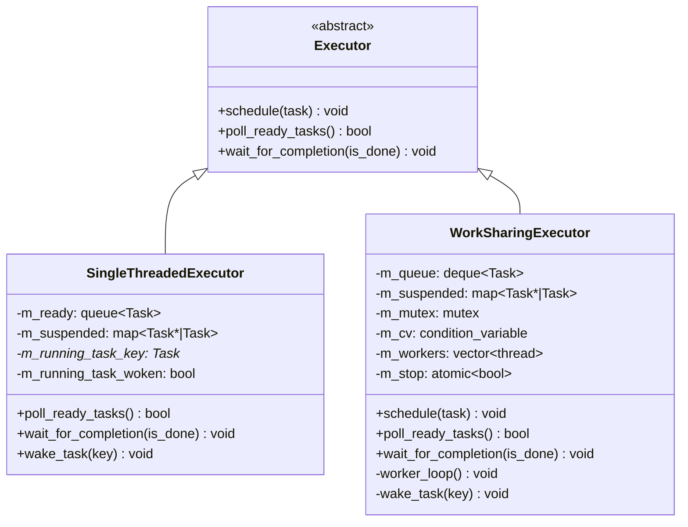
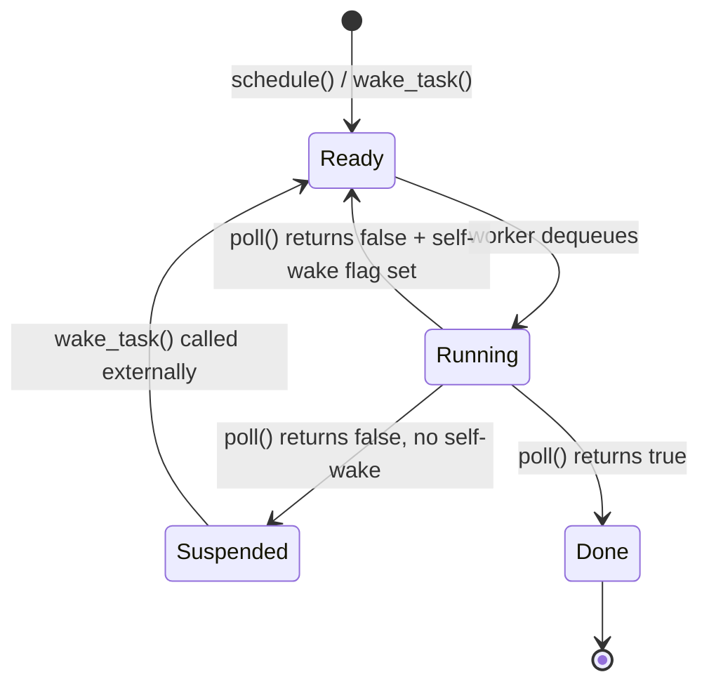

# Work-Sharing Executor

A multi-threaded `Executor` implementation where all worker threads share a single task
queue. Tasks run in parallel across threads; there is no per-thread affinity or stealing.

## Relationship to `SingleThreadedExecutor`



---

## Interface change: `wait_for_completion()`

`Runtime::block_on()` currently drives execution by spinning on `poll_ready_tasks()`:

```cpp
while (!is_done()) {
    if (!m_executor->poll_ready_tasks())
        break;  // broken for multi-threaded — workers may still be running
}
```

For `WorkSharingExecutor`, workers run on their own threads and `block_on`'s calling
thread should block efficiently rather than spin. A new virtual method handles this:

```cpp
// New virtual method on Executor:
virtual void wait_for_completion(std::function<bool()> is_done);
```

| Implementation | Behaviour |
|---|---|
| `SingleThreadedExecutor` | Existing spin loop: calls `poll_ready_tasks()` until `is_done()` |
| `WorkSharingExecutor` | Waits on `m_cv` (condition variable), woken by `wake_task()` after each task completes, checks `is_done()` |

`Runtime::block_on()` becomes:

```cpp
m_executor->schedule(make_task(future, state));
m_executor->wait_for_completion([&] { return state->terminated; });
```

`poll_ready_tasks()` is retained on `WorkSharingExecutor` (returns whether the queue is
non-empty) for any callers that check executor state, but `block_on` no longer calls it
directly.

---

## Data model

```
WorkSharingExecutor
│
├── m_queue: deque<shared_ptr<Task>>      ← ready tasks, mutex-protected
├── m_suspended: map<Task*, shared_ptr<Task>>  ← parked tasks, same mutex
├── m_mutex: mutex                         ← guards queue + suspended + per-task flags
├── m_cv: condition_variable               ← workers + block_on wait here
├── m_stop: atomic<bool>                   ← shutdown signal
└── m_workers: vector<thread>              ← N worker threads
```

`m_queue` and `m_suspended` share a single mutex. This is safe because the queue and
suspended map are always accessed together (moving a task between them is one operation).

---

## Task state machine

Each task is in exactly one state at any moment. State is implicit in which data structure
holds the task's `shared_ptr`:



**Self-wake** (waker fires while the task is mid-poll on a worker thread) is handled with
a per-task boolean flag stored alongside the `shared_ptr` in a parallel map:

```
m_self_woken: unordered_map<Task*, bool>   ← protected by m_mutex
```

- `wake_task(key)`: if `key` is found in `m_self_woken` (i.e. currently Running), set
  `m_self_woken[key] = true`. Otherwise move from `m_suspended` to `m_queue` and
  `notify_one`.
- After `poll()` returns: check `m_self_woken[key]`. If true, re-enqueue; if false, move
  to `m_suspended`.

---

## Worker thread loop

```
loop:
    lock(m_mutex)
    wait on m_cv until: m_queue non-empty OR m_stop
    if m_stop and m_queue empty → break

    task = dequeue front of m_queue
    insert key into m_self_woken map (initially false)
    unlock(m_mutex)

    create Waker(key, this)
    create Context(waker)
    bool done = task->poll(ctx)          ← runs outside the lock

    lock(m_mutex)
    remove key from m_self_woken, capture flag value
    if done:
        drop task                        ← destructor fires here, outside lock if possible
        notify_all(m_cv)                 ← wake block_on's wait_for_completion check
    elif self_wake_flag:
        m_queue.push_back(task)
        notify_one(m_cv)
    else:
        m_suspended[key] = task
    unlock(m_mutex)
```

`task->poll(ctx)` runs **outside the lock** so other workers can continue dequeuing and
`wake_task()` can acquire the lock to move suspended tasks back to the ready queue.

---

## Thread-local state

Two thread-locals must be set on each worker thread at startup:

| Thread-local | Set by | Used by |
|---|---|---|
| `t_current_runtime` | Worker thread startup | `coro::spawn()` free function, `JoinSet::spawn()` |
| `t_current_coro` | `CurrentCoroGuard` inside `Coro::poll()` | `JoinHandle` destructor (CoroutineScope registration) |

`t_current_coro` is already set correctly per-poll by `CurrentCoroGuard` — no change
needed. `t_current_runtime` must be set to the owning `Runtime*` when each worker starts.
`WorkSharingExecutor` therefore needs a back-pointer to `Runtime` passed at construction.

---

## Shutdown

`Runtime::~Runtime()` destructs the executor. The destructor:

1. Sets `m_stop = true`
2. Calls `m_cv.notify_all()` to wake all blocked workers
3. Joins all worker threads

Outstanding tasks in `m_queue` and `m_suspended` are dropped when their `shared_ptr`s
destruct — same semantics as the single-threaded executor.

---

## `Runtime` construction change

```cpp
Runtime::Runtime(std::size_t num_threads) {
    if (num_threads <= 1)
        m_executor = std::make_unique<SingleThreadedExecutor>();
    else
        m_executor = std::make_unique<WorkSharingExecutor>(num_threads, this);
}
```

---

## New files

| File | Contents |
|---|---|
| `include/coro/runtime/work_sharing_executor.h` | `WorkSharingExecutor` class declaration |
| `src/work_sharing_executor.cpp` | Implementation |

`Executor` gains `wait_for_completion()` as a pure virtual (or with a default
single-threaded implementation that calls `poll_ready_tasks()`).
`SingleThreadedExecutor` implements it with its existing spin loop.
`Runtime::block_on()` updated to call `wait_for_completion` instead of the manual loop.
