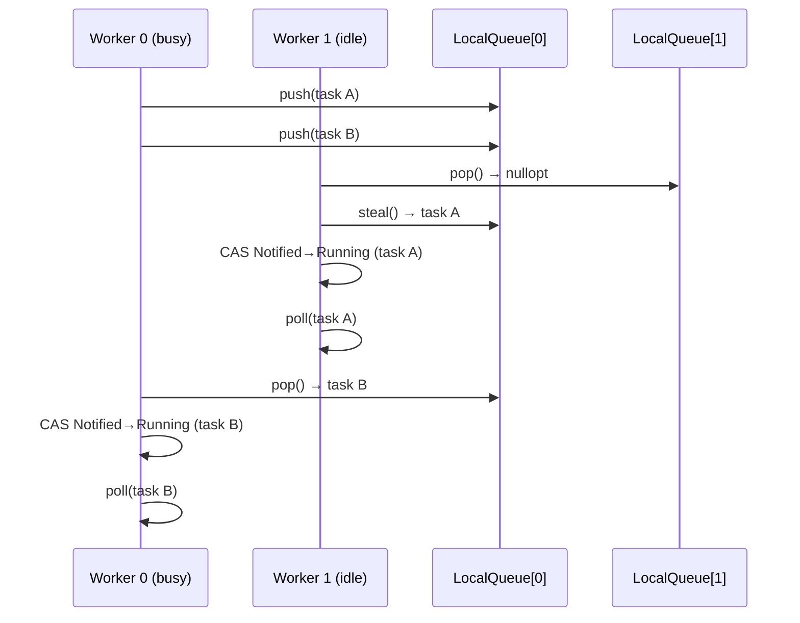
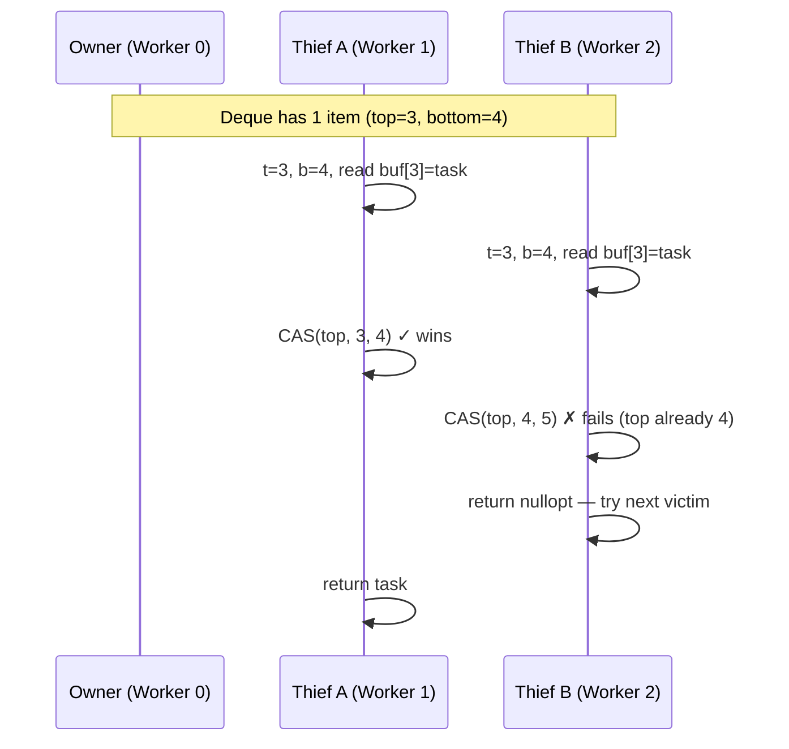

# Work-Stealing Executor

## Overview

The current `WorkSharingExecutor` gives each worker thread a local queue but has no
stealing path: when a worker's local queue is empty it blocks on a shared
condition variable waiting for the global injection queue. Under uneven load — one task
spawning many children, or tasks with varied run times — some workers sleep while
others are overloaded. Work-stealing fixes this by allowing idle workers to take tasks
from busy workers' local queues before going to sleep.

The design mirrors Tokio's multi-threaded scheduler at a high level, adapted to the
existing `Executor` interface and task state machine.

---

## Goals

- Replace (or upgrade) `WorkSharingExecutor` with a scheduler that steals work across
  threads before parking.
- Preserve the existing `Executor` interface (`schedule`, `enqueue`, `poll_ready_tasks`,
  `wait_for_completion`) so `Runtime` needs no changes.
- Preserve all invariants of the lock-free `SchedulingState` CAS machine.
- Keep the lock-free deque interface (`push` / `pop` / `steal`) so that implementing the
  Chase-Lev algorithm later is a drop-in change to `WorkStealingDeque`.

---

## Current State

`WorkSharingExecutor` already has most of the structure in place:

- Per-worker `WorkStealingDeque` with `push`, `pop`, `steal` — currently mutex-backed.
- A shared injection queue protected by `m_mutex` + `m_cv`.
- Thread-locals `t_owning_executor` and `t_worker_index` for local-path routing in
  `enqueue()`.

What is missing is the steal path in `worker_loop()`. Today, when a worker's local queue
is empty it goes directly to sleep on `m_cv`. It should first attempt to steal from
peer workers before sleeping.

---

## Proposed Design

### Worker Loop with Stealing

The core change is the task-search strategy in `worker_loop()`. Each worker follows this
priority order:

```
1. Pop from own local queue                   (no lock, LIFO)
2. Drain from injection queue                 (lock, FIFO — prevents starvation of remote wakes)
3. Enter "searching" state (if permitted)
   a. Steal from a peer's local queue         (one full sweep, round-robin)
   b. Re-check injection queue                (a task may have arrived during the sweep)
4. Exit searching, park
```

Step 2 is checked before stealing so that tasks enqueued from outside the executor
(timer wakeups, channel wakeups from non-worker threads) are not starved behind local
work.

### Victim Selection

Use a round-robin starting offset seeded by `worker_index` so that all workers do not
pile onto the same victim simultaneously:

```
for i in 0..N:
    victim = (worker_index + 1 + i) % N
    if victim == worker_index: skip
    if m_local_queues[victim].steal_half(my_queue) > 0:
        return my_queue.pop()   // run the first stolen task immediately
```

Each worker tries all peers once per search pass before concluding there is nothing to steal.

### Bounded Searching Workers

At most `num_workers / 2` workers are in the "searching" state at any time, tracked by
a shared atomic `m_searching`:

```
// Worker trying to enter searching:
int expected = m_searching.load();
while (expected < max_searching):
    if m_searching.compare_exchange_weak(expected, expected + 1):
        // entered searching — do the steal sweep
        ...
        m_searching.fetch_sub(1)
        break
// If CAS loop fails (already enough searchers), skip to park.
```

`max_searching = num_workers / 2` (minimum 1). This prevents thundering herd: if half
the pool is already searching, additional idle workers park immediately instead of all
piling onto the same victim queues.

The steal sweep itself acts as the latency buffer before parking — there is no separate
spin-yield loop.

### Parking and Wakeup

#### What park and unpark are

At the OS level, "parking" a thread means putting it to sleep until another thread
explicitly wakes it. On Linux this is a **futex** (`futex(FUTEX_WAIT)` to sleep,
`futex(FUTEX_WAKE)` to wake). On Windows it is `WaitOnAddress` / `WakeByAddressSingle`.
The key property shared by all implementations: the wake call is lock-free and targets
a specific thread rather than waking the entire pool.

A `std::condition_variable` is built on the same futex primitives but wraps them behind
a mutex. The mutex is necessary because `std::condition_variable` has no internal state
— it cannot remember that a notification was sent before a waiter arrived. Without the
lock, the following race is possible:

```
worker:   check predicate → false
notifier: predicate becomes true, notify_one() fires (nobody is waiting yet)
worker:   enters wait() — sleeps forever (notification was lost)
```

The mutex closes this window by ensuring the notifier cannot fire between the predicate
check and the `wait()` call.

#### How Tokio parks workers

Tokio avoids the global mutex entirely. Each worker owns a `Parker` struct containing:
- A small per-worker atomic (`AtomicUsize`) with three states: `EMPTY`, `PARKED`,
  `NOTIFIED`.
- The OS thread handle needed to call `unpark()` on that specific thread.

Rust's `std::thread::park()` / `unpark()` maps directly to futex on Linux. The atomic
state machine eliminates the lost-wakeup race without a mutex: if `unpark()` is called
before `park()`, the state transitions to `NOTIFIED` and the subsequent `park()` returns
immediately without ever touching the OS.

An **idle set** (a bitmask over worker indices, stored as an `AtomicU64` for pools up to
64 threads) tracks which workers are parked. When a task is enqueued, the enqueueing
thread reads the idle set, picks a parked worker, and calls `unpark()` on its handle —
all without acquiring any lock.

The comparison to our current approach:

| | `WorkSharingExecutor` condvar | Tokio-style per-worker park |
|---|---|---|
| Sleep | `m_cv.wait(lock)` — acquires `m_mutex` | `thread::park()` — futex only |
| Wake one | `m_cv.notify_one()` — acquires `m_mutex` | `handle.unpark()` — atomic + futex |
| Wake all (shutdown) | `m_cv.notify_all()` — acquires `m_mutex` | iterate idle set, unpark each |
| Lock contention | All workers share one mutex | None on the hot path |
| Which worker wakes | Unspecified (OS choice) | Caller chooses by index |

#### C++ equivalent: `std::binary_semaphore`

C++ has no direct `park()`/`unpark()` in the standard library. The two closest options
are:

- **`std::atomic<uint32_t>::wait()` / `notify_one()`** (C++20) — thin wrappers over
  futex. Require the caller to manage state and handle spurious wakeups manually.
- **`std::binary_semaphore`** (C++20) — a semaphore with a maximum count of 1.
  `acquire()` blocks if the count is 0; `release()` increments the count and wakes one
  waiter. On Linux, `libstdc++` and `libc++` both implement this with futex.

`std::binary_semaphore` is the right choice because it has the same "notify-before-wait"
semantics as Rust's `park()`/`unpark()`: if `release()` fires before `acquire()`, the
token is banked and `acquire()` returns immediately. The lost-wakeup race is closed by
the semaphore's internal count — no external mutex is required.

Per-worker parking with `std::binary_semaphore` would look like:

```cpp
struct WorkerSlot {
    std::thread             thread;
    std::binary_semaphore   parker{0};  // 0 = no pending wake
};
std::vector<WorkerSlot> m_workers;
std::atomic<uint64_t>   m_idle_mask{0}; // bit k set ↔ worker k is parked

static_assert(MAX_WORKERS <= 64, "m_idle_mask is a uint64_t; max 64 workers supported");

// Worker parks:
m_idle_mask.fetch_or(1ull << worker_index, std::memory_order_release);
m_workers[worker_index].parker.acquire();  // futex wait
m_idle_mask.fetch_and(~(1ull << worker_index), std::memory_order_relaxed);

// Enqueuer wakes one idle worker:
uint64_t idle = m_idle_mask.load(std::memory_order_acquire);
if (idle) {
    int idx = std::countr_zero(idle);  // pick lowest idle worker
    m_workers[idx].parker.release();   // futex wake — no mutex
}
```

#### 64-worker cap

`m_idle_mask` is a `uint64_t`, so the pool is capped at 64 workers. This covers all
realistic use cases (machines with >64 hardware threads are uncommon and the scheduler
design does not target NUMA at this stage). A `static_assert` in the constructor
enforces the limit with a clear error message rather than silent bit truncation.

#### Park protocol: avoiding lost wakeups

`binary_semaphore` closes the "notify arrives before `acquire()`" race (the token is
banked), but a different race remains between marking idle and parking:

```
worker:   finds all queues empty — not yet in m_idle_mask
enqueuer: pushes task, reads m_idle_mask → no idle workers, skips wake
worker:   sets bit in m_idle_mask, calls acquire() → sleeps with task pending ✗
```

The fix: after setting the idle bit, **re-check all queues once more** before calling
`acquire()`. If work is found, clear the bit and resume the worker loop. If not, park —
and if the enqueuer raced and called `release()` after the idle bit was set, the
semaphore token is banked and `acquire()` returns immediately without sleeping.

```
worker loop (park sequence):
  1. decrement m_searching (no longer searching)
  2. set idle bit in m_idle_mask  (release store)
  3. re-check local queue, injection queue, peer queues
  4. if work found: clear idle bit, loop back to step 1 of worker loop
  5. else: parker.acquire()       (sleeps only if no banked token)
  6. clear idle bit (already cleared by enqueuer's race wins too — harmless double-clear)
  7. resume worker loop
```

#### This phase

`WorkStealingExecutor` uses per-worker `std::binary_semaphore` parking from the start,
replacing the shared `m_mutex` + `m_cv` used by `WorkSharingExecutor`. The semaphore
approach is adopted because:

- It is the natural C++ equivalent of Tokio's `park()`/`unpark()`.
- It makes Q4 (notify on local enqueue) cheap enough to always do correctly: check
  `m_searching` and `m_idle_mask` atomically, then call `parker.release()` on one
  idle worker — no mutex round-trip.
- Shutdown (`notify_all`) becomes: iterate `m_idle_mask`, call `release()` on each
  parked worker.

The shared `m_mutex` is retained only for protecting the injection queue (remote
enqueue path). It is no longer used for parking/wakeup.

### LIFO Slot Optimization (Optional)

Tokio maintains a single-slot LIFO buffer per worker, separate from the local run
queue. When a task wakes another task (e.g. a sender waking a receiver), the newly
woken task is placed in the LIFO slot instead of the queue. On the next loop iteration,
the LIFO slot is checked first. This reduces latency for producer-consumer pairs by
running the consumer immediately after the producer yields, improving cache reuse.

This optimization is not required for correctness and can be added after the baseline
stealing path works.

---

## Data Structures

### WorkStealingDeque

The current `WorkStealingDeque<T>` is mutex-backed and presents `push` / `pop` /
`steal`. A `steal_half(WorkStealingDeque& dst)` method is added: under the victim's
lock it computes `n = (size + 1) / 2`, moves the front `n` items into `dst`, and
returns `n`. The caller pops one task immediately and leaves the rest in its own queue
for future iterations. This amortizes steal overhead and avoids repeated lock
acquisitions when a victim has many tasks.

**The mutex-backed implementation will be kept for this phase.** The lock-free Chase-Lev
upgrade is deferred — see the
[Future Work: Chase-Lev Lock-Free Deque](#future-work-chase-lev-lock-free-deque) section
below for a full description of how it works and what changes when the time comes.

### Injection Queue

Unchanged: `std::deque<shared_ptr<Task>>` protected by `m_mutex`. Remote wakers and
`schedule()` calls push here. Workers drain it under the lock.

### TaskWaker — Worker Affinity

`TaskWaker` gains one additional field:

```cpp
int m_last_worker_index = -1;  // -1 = unknown / not on this executor
```

After each successful `poll()`, the executor stores `t_worker_index` into the task's
waker. When the waker fires, `enqueue()` uses the stored index to push directly onto
that worker's local queue instead of the injection queue, provided the executor pointer
still matches.

The benefit: a woken task re-enters on the same core it last ran on, keeping its data
warm in L1/L2 and avoiding an injection-queue lock acquisition on the hot wakeup path.
The cost is one extra `int` in `TaskWaker` and a trivial branch in `enqueue()`.

### State Additions

A single shared atomic `std::atomic<int> m_searching{0}` tracks the number of workers
currently performing a steal sweep. No per-worker state is needed.

---

## enqueue() Routing

```cpp
void WorkStealingExecutor::enqueue(shared_ptr<Task> task) {
    int affinity = task->waker().last_worker_index();

    if (t_worker_index >= 0 && t_owning_executor == this) {
        // Called from a worker thread — push to own local queue.
        m_local_queues[t_worker_index].push(move(task));
    } else if (affinity >= 0) {
        // Waker carries an affinity hint — push to that worker's local queue.
        // No lock needed: WorkStealingDeque::push is thread-safe.
        m_local_queues[affinity].push(move(task));
    } else {
        // No affinity — fall back to the shared injection queue.
        lock_guard lock(m_mutex);
        m_injection_queue.push_back(move(task));
    }
    notify_if_needed();
}

void WorkStealingExecutor::notify_if_needed() {
    // If at least one worker is already searching, it will find the task.
    if (m_searching.load(memory_order_acquire) > 0) return;
    // Otherwise wake one parked worker to begin searching.
    uint64_t idle = m_idle_mask.load(memory_order_acquire);
    if (idle) {
        int idx = std::countr_zero(idle);
        m_workers[idx].parker.release();  // futex wake — no mutex
    }
}
```

All three enqueue paths share `notify_if_needed()`. A searching worker will find a
locally-enqueued task on its steal sweep without an explicit wake.

---

## Shutdown

1. Destructor sets `m_stop = true` inside `m_mutex` (still guards the injection queue).
2. Iterates `m_idle_mask` and calls `parker.release()` on every parked worker.
3. Joins all worker threads.

Workers exit their loop when `m_stop` is true and all queues are drained.

---

## Naming and Placement

`WorkSharingExecutor` is kept as-is (useful for debugging scheduler issues due to its
simpler concurrency). `WorkStealingExecutor` is added alongside it as a new class.

Files:
- `include/coro/runtime/work_stealing_executor.h`
- `src/work_stealing_executor.cpp`

`Runtime` selects the implementation: `num_threads <= 1` → `SingleThreadedExecutor`,
otherwise → `WorkStealingExecutor`.

---

## State Machine Invariants

The `SchedulingState` CAS machine is unchanged. The steal path is just another way to
dequeue a `Notified` task — the transition `Notified → Running` is always a CAS and
will fail if two workers race to claim the same task (which should not happen since
`steal()` is atomic, but the CAS is the ultimate guard).

---

## Testing Approach

Phase 2 will stub out `WorkStealingExecutor` and add tests. Phase 3 validates them.

**Unit tests (new):**
- `test_work_stealing_executor.cpp`
  - Workers complete tasks when work is uneven (one spawning coroutine fans out N tasks).
  - Tasks complete correctly with `N` workers and `M >> N` short-lived tasks.
  - Stealing occurs: verify that with 1 task pinned to worker 0's local queue and 3
    idle workers, one of the idle workers steals and executes the task.
  - Shutdown drains all in-flight tasks.

**Existing tests** that must continue to pass:
- All `test_sleep` tests (timer service wakeups via the remote path).
- All `test_join_handle`, `test_join_set`, `test_coro_scope` tests.
- All channel tests (`test_mpsc`, `test_watch`, `test_oneshot`).

Run with ThreadSanitizer enabled to catch data races in the steal path.

---

## Sequence Diagram: Stealing Path



---

## Future Work: Chase-Lev Lock-Free Deque

> **Deferred.** The mutex-backed `WorkStealingDeque` is sufficient for correctness.
> This section documents the Chase-Lev algorithm so the upgrade path is understood
> before it is needed. When performance profiling shows deque contention is a
> bottleneck, this section becomes the implementation spec.

### Why Bother?

Every `steal()` call on the current mutex-backed deque acquires a lock, even when the
victim's queue is empty. Under high thread counts with frequent stealing this creates
contention on the victim's mutex. Chase-Lev eliminates all locks on the common paths:

| Operation | Mutex version | Chase-Lev |
|-----------|--------------|-----------|
| `push`    | lock + write  | write + atomic store |
| `pop`     | lock + read   | read + optional CAS (only on last element) |
| `steal`   | lock + read   | CAS on `top` |

### The Algorithm

Chase-Lev is a double-ended queue (deque) where:
- The **owner** thread pushes and pops from the **bottom** (back). No contention from
  thieves on this end in the common case.
- **Thief** threads steal from the **top** (front). Multiple thieves can race here, resolved
  by a CAS.

Three fields drive the algorithm:

```
top    — atomic<int64_t>, incremented by thieves when they take an item
bottom — int64_t, written only by the owner (load/store, no atomic needed from owner's view)
buf    — pointer to a circular array of capacity 2^k
```

The number of items in the deque at any moment is `bottom - top`. The deque is empty
when `bottom == top` and full when `bottom - top == capacity`.

```
┌─────────────────────────────────────────────────────┐
│  circular buffer (capacity = 8, indices mod 8)       │
│                                                      │
│  index:  0    1    2    3    4    5    6    7         │
│        ┌────┬────┬────┬────┬────┬────┬────┬────┐    │
│        │    │ T  │ T  │ T  │    │    │    │    │    │
│        └────┴────┴────┴────┴────┴────┴────┴────┘    │
│                ▲                   ▲                 │
│               top=1             bottom=4             │
│          (thieves steal        (owner pushes/pops   │
│           from here)            from here)          │
│                                                      │
│  items in deque: bottom - top = 3  (indices 1,2,3)  │
└─────────────────────────────────────────────────────┘
```

### Owner: push

```
buf[bottom % capacity] = item
bottom++   (release store — makes item visible to thieves)
```

If the buffer is full (`bottom - top == capacity`), allocate a new buffer of double
the size, copy all items, and swap the pointer atomically before writing the new item.

### Owner: pop

```
bottom--
item = buf[bottom % capacity]   (acquire load)
if bottom < top:
    // deque is now empty; restore bottom and give up
    bottom = top
    return nullopt
if bottom == top:
    // racing with a thief for the last item
    if CAS(top, top, top+1) succeeds:
        bottom = top+1   // thief won, deque truly empty now
        return nullopt
    // owner won the CAS; item is ours
return item
```

The CAS on pop only fires when there is exactly one item remaining, which is the rare
case. All other pops are pure reads and writes with no contention.

### Thief: steal

```
t = top.load(acquire)
b = bottom.load(acquire)
if t >= b: return nullopt   // empty
item = buf[t % capacity]   (acquire load — must read before CAS commits)
if CAS(top, t, t+1):
    return item
return nullopt   // lost the race; try another victim
```

Multiple thieves race via `CAS(top, t, t+1)`. Only one wins per item. The loser
simply moves on — it does not retry the same victim.

### Sequence Diagram: Concurrent steal race



### Memory Ordering Summary

| Access | Ordering | Reason |
|--------|----------|--------|
| `bottom` store after push | `release` | Makes the new item visible to thieves reading `bottom` |
| `bottom` load in thief | `acquire` | Pairs with owner's release store |
| `top` CAS in thief | `acq_rel` | Synchronises all thieves with each other |
| buffer element read in thief | `acquire` | Must happen before CAS commits the steal |

### What Changes in the Codebase

Only `include/coro/detail/work_stealing_deque.h` changes. The three atomic fields
replace `m_mutex` and `m_deque`. All call sites (`push`, `pop`, `steal_half`) keep the
same signatures. The executor code, wakers, and task state machine are unaffected.

One new concern: the growable buffer requires careful memory reclamation. When the
owner resizes, the old buffer cannot be freed immediately because a thief may have
loaded a pointer to it before the resize. The standard solution is epoch-based
reclamation or hazard pointers. A simpler alternative that avoids this entirely is to
use a **fixed-capacity** deque (bounded at construction time) and abort/assert if the
owner exceeds capacity. For task queues with a reasonable bound this is acceptable and
eliminates the reclamation problem.

---

## Open Questions

**Q2 — Chase-Lev: deferred.**
The `WorkStealingDeque` will remain mutex-backed for this phase. Chase-Lev is documented
in the [Future Work](#future-work-chase-lev-lock-free-deque) section as a follow-on
once the stealing logic and tests are stable.


